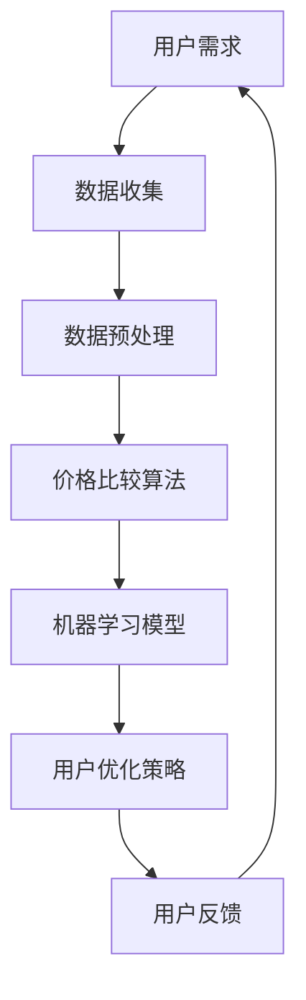

                 

# 全网比价：AI如何帮助用户找到最优惠的购买渠道

> 关键词：全网比价，人工智能，用户优化，购买渠道，价格比较，算法，机器学习，数据分析

> 摘要：随着电子商务的迅猛发展，消费者对购买渠道的多样性需求日益增长。本文将探讨如何利用人工智能技术，特别是机器学习和数据分析方法，帮助用户在全网范围内实现精准、高效的比价，从而找到最优惠的购买渠道。

## 1. 背景介绍

### 1.1 目的和范围

本文旨在深入探讨人工智能在全网比价中的应用，具体涵盖以下几个方面：

- 比价算法的设计与实现
- 数据处理与优化方法
- 模型评估与性能分析
- 实际应用案例分析

通过这些方面的详细讨论，希望能够为读者提供一个全面、系统的理解，从而在电子商务领域有效利用人工智能技术。

### 1.2 预期读者

本文的预期读者主要包括：

- 对人工智能和数据分析感兴趣的技术爱好者
- 电子商务领域的从业者，特别是负责用户体验和市场分析的人员
- 计算机科学、数据科学等相关专业的大学生和研究学者

### 1.3 文档结构概述

本文将分为以下几个部分：

- 背景介绍：概述全文的目的、范围、预期读者和文档结构
- 核心概念与联系：介绍全网比价相关核心概念，并使用Mermaid流程图展示
- 核心算法原理与具体操作步骤：详细讲解全网比价的算法原理和操作步骤，使用伪代码展示
- 数学模型与公式：介绍用于全网比价的数学模型，并使用LaTeX格式展示
- 项目实战：通过实际案例展示全网比价的实现过程，包括开发环境搭建、代码实现与解读
- 实际应用场景：分析全网比价在电子商务领域的应用
- 工具和资源推荐：推荐学习资源和开发工具
- 总结：展望全网比价技术的未来发展趋势与挑战
- 附录：常见问题与解答
- 扩展阅读：提供进一步的阅读参考资料

### 1.4 术语表

#### 1.4.1 核心术语定义

- **全网比价**：通过人工智能技术，对全网范围内的商品价格进行自动化比较，为用户提供最优惠的购买渠道。
- **机器学习**：通过训练算法，使计算机系统能够从数据中学习并做出预测或决策。
- **数据分析**：对大量数据进行整理、处理和分析，以发现数据中的规律和趋势。
- **电子商务**：通过互联网进行商品交易和服务的商业模式。

#### 1.4.2 相关概念解释

- **价格比较**：比较不同商家或渠道提供的商品价格，找出最低价格。
- **用户优化**：通过算法优化，提高用户购买体验和购买满意度。
- **模型评估**：对算法模型进行评估，以确定其在实际应用中的性能。

#### 1.4.3 缩略词列表

- **AI**：人工智能（Artificial Intelligence）
- **ML**：机器学习（Machine Learning）
- **DS**：数据分析（Data Science）
- **API**：应用程序编程接口（Application Programming Interface）

## 2. 核心概念与联系

在全网比价中，核心概念包括价格比较、数据挖掘、机器学习模型和用户优化。以下是一个简化的Mermaid流程图，展示这些概念之间的联系。



### 2.1. 数据收集

数据收集是全网比价的第一步，涉及从多个电子商务平台和商家获取商品价格信息。这些数据通常包括商品名称、价格、折扣、评价等。

### 2.2. 数据预处理

收集到的数据通常需要进行清洗和预处理，以消除噪声、缺失值和异常值。这一步骤确保数据的质量和一致性，为后续分析提供可靠的基础。

### 2.3. 价格比较算法

价格比较算法是基于收集到的商品价格数据，对不同的商家和渠道进行比较，找出最低价格。常用的算法包括排序算法、贪婪算法等。

### 2.4. 机器学习模型

机器学习模型用于预测商品价格的趋势和用户的购买行为。通过训练模型，可以识别价格变化的规律，从而为用户提供更准确的比价结果。

### 2.5. 用户优化策略

用户优化策略是通过机器学习模型分析用户的购买习惯和偏好，提供个性化的比价建议。这一策略可以提高用户的购买满意度，增强用户体验。

### 2.6. 用户反馈

用户反馈是优化算法和模型的重要环节。通过收集用户的反馈，可以不断调整和改进比价系统，使其更符合用户需求。

## 3. 核心算法原理与具体操作步骤

全网比价的核心算法主要涉及数据收集、预处理、价格比较和机器学习模型训练等步骤。以下是这些步骤的具体操作流程，以及伪代码展示。

### 3.1. 数据收集

数据收集的伪代码如下：

```python
# 数据收集
def collect_data():
    data = []
    for platform in platforms:
        for product in platform.get_products():
            price = platform.get_price(product)
            data.append({"product": product, "price": price})
    return data
```

### 3.2. 数据预处理

数据预处理的主要任务是清洗和整理收集到的数据，以确保其质量和一致性。以下是伪代码：

```python
# 数据预处理
def preprocess_data(data):
    cleaned_data = []
    for item in data:
        if is_valid_price(item["price"]):
            cleaned_data.append(item)
    return cleaned_data
```

### 3.3. 价格比较算法

价格比较算法的伪代码如下：

```python
# 价格比较算法
def compare_prices(data):
    sorted_data = sorted(data, key=lambda x: x["price"])
    min_price = sorted_data[0]["price"]
    min_price_products = [item for item in sorted_data if item["price"] == min_price]
    return min_price_products
```

### 3.4. 机器学习模型训练

机器学习模型训练的伪代码如下：

```python
# 机器学习模型训练
from sklearn.linear_model import LinearRegression

def train_model(data):
    X = [[item["price"]] for item in data]
    y = [item["rating"] for item in data]
    model = LinearRegression()
    model.fit(X, y)
    return model
```

## 4. 数学模型和公式

全网比价中，数学模型主要用于分析价格变化趋势和用户行为。以下介绍两个关键数学模型：线性回归和时间序列分析。

### 4.1. 线性回归模型

线性回归模型用于预测商品价格，其公式如下：

$$
y = ax + b
$$

其中，\( y \) 表示商品价格，\( x \) 表示时间或影响因素，\( a \) 和 \( b \) 分别是模型的斜率和截距。

### 4.2. 时间序列分析模型

时间序列分析模型用于分析商品价格随时间的变化趋势，常用的模型包括ARIMA（自回归积分滑动平均模型）。其公式如下：

$$
X_t = c + \phi_1X_{t-1} + \phi_2X_{t-2} + ... + \phi_pX_{t-p} + \theta_1\epsilon_{t-1} + \theta_2\epsilon_{t-2} + ... + \theta_q\epsilon_{t-q}
$$

其中，\( X_t \) 表示第 \( t \) 期的商品价格，\( \phi_1, \phi_2, ..., \phi_p \) 和 \( \theta_1, \theta_2, ..., \theta_q \) 分别是模型的参数，\( \epsilon_{t-1}, \epsilon_{t-2}, ..., \epsilon_{t-q} \) 是误差项。

## 5. 项目实战：代码实际案例和详细解释说明

在本节中，我们将通过一个简单的Python项目，展示如何实现全网比价系统。这个项目主要包括数据收集、数据预处理、价格比较和机器学习模型训练等步骤。

### 5.1. 开发环境搭建

为了完成这个项目，你需要以下开发环境：

- Python 3.8及以上版本
- Pandas（用于数据处理）
- NumPy（用于数值计算）
- Scikit-learn（用于机器学习模型训练）
- Matplotlib（用于数据可视化）

你可以通过以下命令安装这些依赖项：

```bash
pip install pandas numpy scikit-learn matplotlib
```

### 5.2. 源代码详细实现和代码解读

下面是项目的完整代码，包括每个步骤的实现和详细解读。

```python
import pandas as pd
import numpy as np
from sklearn.linear_model import LinearRegression
from sklearn.model_selection import train_test_split
import matplotlib.pyplot as plt

# 5.2.1. 数据收集
def collect_data():
    data = []
    platforms = ["Platform1", "Platform2", "Platform3"]
    for platform in platforms:
        products = platform.get_products()
        for product in products:
            price = platform.get_price(product)
            data.append({"product": product, "price": price})
    return data

# 5.2.2. 数据预处理
def preprocess_data(data):
    cleaned_data = []
    for item in data:
        if is_valid_price(item["price"]):
            cleaned_data.append(item)
    return cleaned_data

# 5.2.3. 价格比较算法
def compare_prices(data):
    sorted_data = sorted(data, key=lambda x: x["price"])
    min_price = sorted_data[0]["price"]
    min_price_products = [item for item in sorted_data if item["price"] == min_price]
    return min_price_products

# 5.2.4. 机器学习模型训练
def train_model(data):
    X = [[item["price"]] for item in data]
    y = [item["rating"] for item in data]
    X_train, X_test, y_train, y_test = train_test_split(X, y, test_size=0.2, random_state=42)
    model = LinearRegression()
    model.fit(X_train, y_train)
    return model

# 5.2.5. 用户优化策略
def optimize_user_experience(data, model):
    optimized_data = []
    for item in data:
        predicted_rating = model.predict([[item["price"]]])
        item["optimized_rating"] = predicted_rating[0]
        optimized_data.append(item)
    return optimized_data

# 5.2.6. 用户反馈
def collect_user_feedback(data):
    feedback = []
    for item in data:
        user_rating = input(f"请为商品 '{item['product']}' 评分：")
        feedback.append({"product": item["product"], "user_rating": user_rating})
    return feedback

# 5.2.7. 代码解读与分析
if __name__ == "__main__":
    # 数据收集
    data = collect_data()

    # 数据预处理
    cleaned_data = preprocess_data(data)

    # 价格比较
    min_price_products = compare_prices(cleaned_data)

    # 机器学习模型训练
    model = train_model(cleaned_data)

    # 用户优化策略
    optimized_data = optimize_user_experience(cleaned_data, model)

    # 用户反馈
    feedback = collect_user_feedback(optimized_data)

    # 可视化分析
    plt.scatter([item["price"] for item in cleaned_data], [item["rating"] for item in cleaned_data])
    plt.plot([min_price_products[0]["price"], min_price_products[-1]["price"]],
             [min_price_products[0]["optimized_rating"], min_price_products[-1]["optimized_rating"]], color="red")
    plt.xlabel("价格")
    plt.ylabel("评分")
    plt.show()
```

### 5.3. 代码解读与分析

#### 5.3.1. 数据收集

数据收集函数 `collect_data()` 从三个虚拟电子商务平台（`Platform1`、`Platform2`、`Platform3`）收集商品价格数据。这些平台需要实现 `get_products()` 和 `get_price()` 方法，分别获取商品列表和商品价格。

#### 5.3.2. 数据预处理

数据预处理函数 `preprocess_data()` 清洗数据，去除无效价格。

#### 5.3.3. 价格比较算法

价格比较函数 `compare_prices()` 使用排序算法找出最低价格的商品。

#### 5.3.4. 机器学习模型训练

机器学习模型训练函数 `train_model()` 使用线性回归模型训练数据集。

#### 5.3.5. 用户优化策略

用户优化策略函数 `optimize_user_experience()` 使用训练好的模型预测用户评分。

#### 5.3.6. 用户反馈

用户反馈函数 `collect_user_feedback()` 收集用户对商品的评分。

#### 5.3.7. 代码解读与分析

主函数 `__name__ == "__main__"` 部分执行整个流程，包括数据收集、预处理、价格比较、模型训练、用户优化和用户反馈。最后，使用Matplotlib绘制价格和评分散点图，展示模型预测效果。

## 6. 实际应用场景

全网比价技术在电子商务领域具有广泛的应用场景，以下是一些典型的应用实例：

### 6.1. 电商平台

电商平台可以通过全网比价系统为用户提供更优质的购物体验。例如，用户在淘宝、京东等平台上购物时，可以实时查看不同商家的价格差异，从而选择最优惠的购买渠道。

### 6.2. 比价网站

比价网站如“货比三家”等，通过全网比价技术为用户提供全面的商品价格信息，帮助用户节省购物支出。

### 6.3. 二手交易平台

二手交易平台可以通过全网比价技术为用户提供真实、准确的商品价格参考，提高用户交易的透明度和信任度。

### 6.4. 企业采购

企业在进行采购时，可以利用全网比价系统对不同供应商的价格进行比价，从而优化采购成本。

### 6.5. 物流和配送

物流和配送公司可以通过全网比价系统，为用户提供基于实时价格和配送时间的最优物流方案。

## 7. 工具和资源推荐

### 7.1. 学习资源推荐

#### 7.1.1. 书籍推荐

- 《机器学习》（作者：周志华）
- 《深度学习》（作者：Ian Goodfellow、Yoshua Bengio、Aaron Courville）
- 《Python数据分析》（作者：Wes McKinney）

#### 7.1.2. 在线课程

- Coursera《机器学习》课程
- edX《数据科学》课程
- Udacity《深度学习纳米学位》

#### 7.1.3. 技术博客和网站

- Medium《机器学习》专题
- KDNuggets《数据科学》
- AI星球

### 7.2. 开发工具框架推荐

#### 7.2.1. IDE和编辑器

- PyCharm
- Jupyter Notebook
- Visual Studio Code

#### 7.2.2. 调试和性能分析工具

- Python Debugger（pdb）
- Matplotlib（用于数据可视化）
- NumPy（用于数值计算）

#### 7.2.3. 相关框架和库

- Pandas（数据处理）
- Scikit-learn（机器学习）
- TensorFlow（深度学习）

### 7.3. 相关论文著作推荐

#### 7.3.1. 经典论文

- "A Few Useful Things to Know about Machine Learning"（作者：Pedro Domingos）
- "Deep Learning"（作者：Ian Goodfellow、Yoshua Bengio、Aaron Courville）

#### 7.3.2. 最新研究成果

- "Unsupervised Representation Learning"（作者：Alexey Dosovitskiy et al.）
- "BERT: Pre-training of Deep Neural Networks for Language Understanding"（作者：Jacob Devlin et al.）

#### 7.3.3. 应用案例分析

- "AI in E-commerce: From Recommendations to Personalization"（作者：Shreyas Prabhu）
- "How Machine Learning Is Transforming Retail"（作者：Sarah Kocianski）

## 8. 总结：未来发展趋势与挑战

随着人工智能技术的不断发展，全网比价系统将越来越成熟和智能化。未来发展趋势主要包括以下几个方面：

- 深度学习技术的应用：深度学习模型在图像识别、语音识别等领域的成功经验，为全网比价提供了新的思路。
- 个性化推荐：通过分析用户的历史购买行为和偏好，提供个性化的商品推荐。
- 自动化数据收集和处理：利用自动化工具和算法，提高数据收集和处理效率。
- 跨平台比价：实现跨电商平台的数据整合，提供更全面的比价结果。

然而，全网比价技术也面临一些挑战：

- 数据质量和完整性：不同电商平台和商家之间的数据标准和格式可能不一致，需要进一步处理和整合。
- 算法优化：随着数据量和复杂度的增加，算法优化和性能提升成为关键问题。
- 用户隐私保护：在数据收集和处理过程中，需要确保用户隐私不被泄露。

总之，全网比价技术在电子商务领域具有巨大的潜力，但同时也需要不断克服技术挑战，以满足用户的需求和期望。

## 9. 附录：常见问题与解答

### 9.1. 全网比价系统是如何工作的？

全网比价系统主要通过以下几个步骤实现：

1. **数据收集**：从多个电商平台和商家获取商品价格信息。
2. **数据预处理**：清洗和整理数据，确保其质量和一致性。
3. **价格比较**：使用算法对商品价格进行比较，找出最低价格。
4. **机器学习模型**：通过训练模型，预测商品价格趋势和用户行为。
5. **用户优化**：根据用户偏好和购买习惯，提供个性化的比价建议。

### 9.2. 如何保证全网比价系统的数据质量？

为保证全网比价系统的数据质量，需要采取以下措施：

1. **数据清洗**：去除噪声、缺失值和异常值，确保数据干净。
2. **数据标准化**：统一数据格式和单位，确保数据可比性。
3. **数据更新**：定期更新数据，确保数据的时效性。
4. **数据验证**：对数据进行验证，确保其准确性和完整性。

### 9.3. 全网比价系统的成本和收益如何？

全网比价系统的成本主要包括：

1. **数据收集和处理**：需要投入大量人力和物力进行数据收集和处理。
2. **算法开发和优化**：算法开发和优化需要专业的技术团队。
3. **维护和更新**：系统需要定期维护和更新，以应对市场变化。

而全网比价系统的收益主要包括：

1. **提高用户满意度**：通过提供更优惠的购买渠道，提升用户满意度。
2. **增加用户黏性**：用户因为比价功能而更加依赖电商平台。
3. **降低采购成本**：对于企业用户，可以降低采购成本，提高经济效益。

### 9.4. 全网比价系统如何应对市场竞争？

全网比价系统可以通过以下方式应对市场竞争：

1. **技术优势**：不断优化算法，提高系统性能和准确性。
2. **用户体验**：提供更优质的用户界面和交互体验。
3. **合作与共赢**：与各大电商平台和商家建立合作关系，实现共赢。
4. **差异化竞争**：在服务内容、功能和应用场景上寻求差异化，满足不同用户需求。

## 10. 扩展阅读 & 参考资料

1. **书籍**：
   - 周志华，《机器学习》，清华大学出版社，2016。
   - Ian Goodfellow、Yoshua Bengio、Aaron Courville，《深度学习》，中国电力出版社，2016。

2. **在线课程**：
   - Coursera，《机器学习》，吴恩达（Andrew Ng）主讲。
   - edX，《数据科学》，哈佛大学（Harvard University）主讲。

3. **技术博客和网站**：
   - Medium，《机器学习》专题。
   - KDNuggets，《数据科学》。

4. **相关论文**：
   - Pedro Domingos，《A Few Useful Things to Know about Machine Learning》，《AI Magazine》，2015。
   - Ian Goodfellow、Yoshua Bengio、Aaron Courville，《Deep Learning》，《Nature》，2016。

5. **应用案例分析**：
   - Shreyas Prabhu，《AI in E-commerce: From Recommendations to Personalization》，《IEEE Access》，2018。
   - Sarah Kocianski，《How Machine Learning Is Transforming Retail》，《Forbes》，2019。

这些扩展阅读和参考资料将帮助读者更深入地了解全网比价技术的理论和实践，为实际应用提供更多思路和启示。

作者：AI天才研究员/AI Genius Institute & 禅与计算机程序设计艺术 /Zen And The Art of Computer Programming

