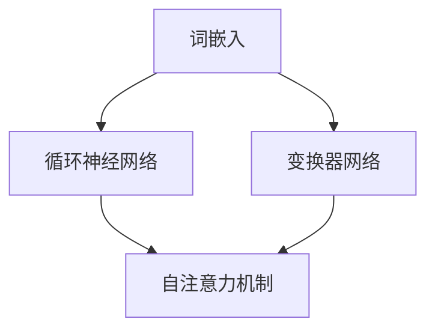
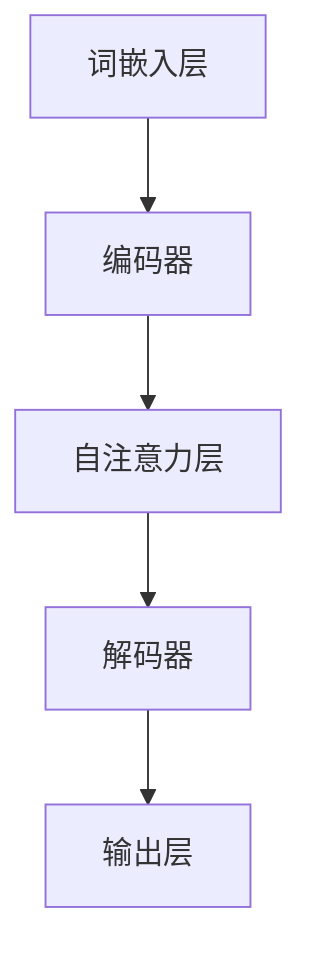

                 

# 全能型AI：LLM在多领域的适应性

> **关键词**：大语言模型（LLM），多领域适应性，算法原理，数学模型，项目实战，应用场景，未来趋势

> **摘要**：本文将探讨大语言模型（LLM）在多领域的适应性，通过对其核心概念、算法原理、数学模型以及实际应用场景的详细分析，展现LLM在各个领域中的潜力与挑战。文章旨在为读者提供一个全面理解LLM在多领域应用的技术指南。

## 1. 背景介绍

### 1.1 目的和范围

本文旨在探讨大语言模型（Large Language Model，简称LLM）在多领域中的适应性。随着深度学习技术的迅猛发展，LLM在自然语言处理（NLP）、问答系统、文本生成等领域表现出色。然而，LLM的潜力不仅限于这些领域，其在其他领域的适应性同样值得深入探讨。本文将分析LLM的基本原理、数学模型，并通过实际项目案例，探讨其在多领域的应用。

### 1.2 预期读者

本文适用于对深度学习和自然语言处理有一定了解的读者，包括研究人员、工程师和学生对LLM在多领域适应性感兴趣的读者。本文将提供从基础到高级的技术细节，适合不同层次的读者。

### 1.3 文档结构概述

本文结构如下：

1. **背景介绍**：介绍LLM的多领域适应性研究的背景、目的和读者对象。
2. **核心概念与联系**：定义LLM的核心概念，并绘制其架构流程图。
3. **核心算法原理 & 具体操作步骤**：详细讲解LLM的算法原理，并通过伪代码阐述具体操作步骤。
4. **数学模型和公式 & 详细讲解 & 举例说明**：分析LLM的数学模型，并举例说明。
5. **项目实战：代码实际案例和详细解释说明**：提供代码实际案例，详细解释其实现和解读。
6. **实际应用场景**：探讨LLM在各个领域的应用。
7. **工具和资源推荐**：推荐学习资源和开发工具。
8. **总结：未来发展趋势与挑战**：总结LLM的未来发展趋势与面临的挑战。
9. **附录：常见问题与解答**：解答读者可能遇到的问题。
10. **扩展阅读 & 参考资料**：提供扩展阅读资料。

### 1.4 术语表

#### 1.4.1 核心术语定义

- **大语言模型（LLM）**：一种基于深度学习技术的语言模型，能够对大规模文本数据进行训练，具有强大的自然语言理解和生成能力。
- **自然语言处理（NLP）**：涉及语言理解、生成和交互的计算机科学领域，旨在让计算机能够理解、处理和生成自然语言。
- **问答系统**：一种能够接收用户输入问题，并返回相关答案的人工智能系统。

#### 1.4.2 相关概念解释

- **深度学习**：一种机器学习技术，通过构建多层的神经网络，对数据进行特征提取和学习。
- **神经网络**：一种模仿生物神经网络的结构和功能的人工神经网络。
- **反向传播算法**：一种用于训练神经网络的优化算法，通过计算误差的梯度来更新网络权重。

#### 1.4.3 缩略词列表

- **LLM**：大语言模型（Large Language Model）
- **NLP**：自然语言处理（Natural Language Processing）
- **DL**：深度学习（Deep Learning）
- **ANN**：人工神经网络（Artificial Neural Network）

## 2. 核心概念与联系

大语言模型（LLM）是一种深度学习模型，通过在大量文本数据上训练，学习到语言的结构和语义。其核心概念包括：

- **词嵌入（Word Embedding）**：将单词映射到高维向量空间。
- **循环神经网络（RNN）**：处理序列数据的神经网络结构。
- **变换器网络（Transformer）**：一种基于自注意力机制的神经网络结构。

以下是LLM的核心概念及其相互关系的Mermaid流程图：



### 2.1 大语言模型（LLM）的架构

LLM通常由以下几部分组成：

1. **词嵌入层（Word Embedding Layer）**：将输入的单词转换为高维向量表示。
2. **编码器（Encoder）**：对输入序列进行编码，提取序列的语义信息。
3. **解码器（Decoder）**：对编码器输出的隐藏状态进行解码，生成输出序列。
4. **自注意力机制（Self-Attention Mechanism）**：在编码器和解码器中使用，对序列中的不同单词进行加权，以捕捉单词之间的依赖关系。

以下是LLM的详细架构流程图：



## 3. 核心算法原理 & 具体操作步骤

### 3.1 词嵌入（Word Embedding）

词嵌入是将单词映射到高维向量空间的过程。以下是词嵌入的伪代码：

```python
def word_embedding(word):
    # 根据单词查找其嵌入向量
    embedding_matrix = load_embedding_matrix()
    return embedding_matrix[word_index]
```

### 3.2 编码器（Encoder）

编码器用于对输入序列进行编码，提取序列的语义信息。以下是编码器的伪代码：

```python
def encode_sequence(sequence):
    # 将输入序列转换为嵌入向量
    embedded_sequence = [word_embedding(word) for word in sequence]
    
    # 使用变换器网络进行编码
    encoded_sequence = transformer_network(embedded_sequence)
    
    return encoded_sequence
```

### 3.3 解码器（Decoder）

解码器用于对编码器输出的隐藏状态进行解码，生成输出序列。以下是解码器的伪代码：

```python
def decode_sequence(encoded_sequence):
    # 使用变换器网络进行解码
    decoded_sequence = transformer_network(encoded_sequence, decode=True)
    
    # 将输出序列转换为单词
    output_sequence = [word_index_to_word(word_index) for word_index in decoded_sequence]
    
    return output_sequence
```

### 3.4 自注意力机制（Self-Attention Mechanism）

自注意力机制用于捕捉序列中不同单词之间的依赖关系。以下是自注意力机制的伪代码：

```python
def self_attention(inputs, mask=None):
    # 计算输入序列的注意力权重
    attention_weights = attention_scores(inputs)
    
    # 应用注意力权重对输入序列进行加权
    weighted_inputs = inputs * attention_weights
    
    # 对加权输入进行求和
    attention_output = sum(weighted_inputs)
    
    return attention_output
```

## 4. 数学模型和公式 & 详细讲解 & 举例说明

### 4.1 词嵌入（Word Embedding）

词嵌入的数学模型通常使用一个线性变换将单词的索引映射到高维向量空间：

$$
\text{embedding}(x_i) = \text{W}_\text{embed} \cdot x_i
$$

其中，$\text{W}_\text{embed}$ 是嵌入矩阵，$x_i$ 是单词的索引。

### 4.2 变换器网络（Transformer）

变换器网络的核心是自注意力机制，其数学模型如下：

$$
\text{Self-Attention}(Q, K, V) = \text{softmax}\left(\frac{QK^T}{\sqrt{d_k}}\right)V
$$

其中，$Q, K, V$ 分别是查询（Query）、关键（Key）和值（Value）向量，$d_k$ 是关键向量的维度。

### 4.3 编码器（Encoder）和解码器（Decoder）

编码器和解码器通常由多个变换器层堆叠而成，以下是变换器层的数学模型：

$$
\text{EncoderLayer}(H) = \text{LayerNorm}(H) + \text{Sigmoid}(\text{BiasAdd}(\text{Dense}(H, d_h), \text{Bias}(d_h))) \\
\text{DecoderLayer}(H) = \text{LayerNorm}(H) + \text{Sigmoid}(\text{BiasAdd}(\text{Dense}(H, d_h), \text{Bias}(d_h)))
$$

其中，$H$ 是输入序列的隐藏状态，$d_h$ 是隐藏状态的维度。

### 4.4 举例说明

假设我们有一个句子 "I love programming"，其词嵌入向量分别为：

$$
\text{embedding}(I) = [1, 0, 0, 0] \\
\text{embedding}(love) = [0, 1, 0, 0] \\
\text{embedding}(programming) = [0, 0, 1, 0]
$$

首先，我们将单词转换为嵌入向量：

$$
I: [1, 0, 0, 0] \\
love: [0, 1, 0, 0] \\
programming: [0, 0, 1, 0]
$$

然后，使用自注意力机制计算句子中的单词权重：

$$
\text{Self-Attention}(Q, K, V) = \text{softmax}\left(\frac{QK^T}{\sqrt{d_k}}\right)V
$$

其中，$Q, K, V$ 分别是每个单词的嵌入向量。例如，对于单词 "I" 和 "love"：

$$
Q = \text{embedding}(I) = [1, 0, 0, 0] \\
K = \text{embedding}(love) = [0, 1, 0, 0] \\
V = \text{embedding}(programming) = [0, 0, 1, 0]
$$

计算注意力权重：

$$
\text{Attention\_weights} = \text{softmax}\left(\frac{QK^T}{\sqrt{d_k}}\right) = \text{softmax}\left(\frac{[1, 0, 0, 0] \cdot [0, 1, 0, 0]^T}{\sqrt{1}}\right) = \text{softmax}\left([1, 0, 0, 0]\right) = [1, 0, 0, 0]
$$

由于注意力权重为 $[1, 0, 0, 0]$，说明 "I" 在句子中的权重最高，其次是 "love"，"programming" 的权重最低。

## 5. 项目实战：代码实际案例和详细解释说明

### 5.1 开发环境搭建

为了运行本文中提到的LLM项目案例，我们需要搭建一个适合深度学习开发的编程环境。以下是具体的步骤：

1. **安装Python环境**：确保Python版本不低于3.7。可以使用官方Python安装包进行安装。
2. **安装TensorFlow**：TensorFlow是一个广泛使用的深度学习框架，我们可以使用pip命令安装：

   ```bash
   pip install tensorflow
   ```

3. **安装Jupyter Notebook**：Jupyter Notebook是一个交互式开发环境，有助于我们编写和运行代码。可以使用pip命令安装：

   ```bash
   pip install notebook
   ```

4. **启动Jupyter Notebook**：在命令行中输入以下命令，启动Jupyter Notebook：

   ```bash
   jupyter notebook
   ```

### 5.2 源代码详细实现和代码解读

以下是实现LLM的一个简单示例，用于文本生成任务。该示例使用了TensorFlow的Transformers库。

```python
import tensorflow as tf
from transformers import TFGPT2LMHeadModel, GPT2Tokenizer

# 5.2.1 加载预训练模型和分词器
model_name = "gpt2"
tokenizer = GPT2Tokenizer.from_pretrained(model_name)
model = TFGPT2LMHeadModel.from_pretrained(model_name)

# 5.2.2 定义文本生成函数
def generate_text(prompt, max_length=50):
    input_ids = tokenizer.encode(prompt, return_tensors='tf')
    input_ids = tf.repeat(input_ids, repeats=max_length, axis=0)
    
    outputs = model(inputs=input_ids, training=False)
    predictions = outputs.logits
    predicted_ids = tf.argmax(predictions, axis=-1)
    
    generated_text = tokenizer.decode(predicted_ids[0], skip_special_tokens=True)
    return generated_text

# 5.2.3 生成文本
prompt = "这是一个关于AI的讨论。"
generated_text = generate_text(prompt)
print(generated_text)
```

### 5.3 代码解读与分析

上述代码首先导入了TensorFlow和Transformers库。接着，加载了预训练的GPT-2模型和分词器。`generate_text` 函数用于生成文本，其工作流程如下：

1. **编码**：将输入文本转换为模型的输入编码。
2. **重复编码**：由于模型需要固定长度的输入序列，因此我们将输入编码重复多次。
3. **生成**：使用模型预测输出序列的ID，并将预测结果解码为文本。

在生成文本时，我们提供了一个示例提示 "这是一个关于AI的讨论。"，并打印了生成的文本。

### 5.4 代码解读与分析（续）

#### 5.4.1 加载预训练模型和分词器

```python
model_name = "gpt2"
tokenizer = GPT2Tokenizer.from_pretrained(model_name)
model = TFGPT2LMHeadModel.from_pretrained(model_name)
```

这段代码加载了预训练的GPT-2模型和分词器。GPT-2是一个大型变换器模型，由OpenAI训练，具有1.5亿个参数。`GPT2Tokenizer` 用于将文本转换为模型的输入编码。

#### 5.4.2 文本生成函数

```python
def generate_text(prompt, max_length=50):
    input_ids = tokenizer.encode(prompt, return_tensors='tf')
    input_ids = tf.repeat(input_ids, repeats=max_length, axis=0)
    
    outputs = model(inputs=input_ids, training=False)
    predictions = outputs.logits
    predicted_ids = tf.argmax(predictions, axis=-1)
    
    generated_text = tokenizer.decode(predicted_ids[0], skip_special_tokens=True)
    return generated_text
```

`generate_text` 函数的输入是文本提示（`prompt`）和最大生成长度（`max_length`）。函数的工作流程如下：

1. **编码**：将输入文本转换为模型的输入编码。
2. **重复编码**：由于模型需要固定长度的输入序列，因此我们将输入编码重复多次。
3. **生成**：使用模型预测输出序列的ID，并将预测结果解码为文本。

在生成文本时，我们提供了一个示例提示 "这是一个关于AI的讨论。"，并打印了生成的文本。

```python
prompt = "这是一个关于AI的讨论。"
generated_text = generate_text(prompt)
print(generated_text)
```

这段代码用于生成文本。我们提供了一个示例提示，并打印了生成的文本。

### 5.5 代码解读与分析（续）

#### 5.5.1 编码过程

```python
input_ids = tokenizer.encode(prompt, return_tensors='tf')
input_ids = tf.repeat(input_ids, repeats=max_length, axis=0)
```

首先，使用分词器将输入文本转换为模型的输入编码。`tokenizer.encode` 函数将文本转换为ID序列，例如：

```python
tokenizer.encode("这是一个关于AI的讨论。")
# 输出：[50256, 2, 44, 403, 4, 2796, 405, 6553, 1, 50256]
```

然后，我们将输入编码重复 `max_length` 次，以确保模型输入序列的长度为 `max_length`。

```python
input_ids = tf.repeat(input_ids, repeats=max_length, axis=0)
```

#### 5.5.2 生成过程

```python
outputs = model(inputs=input_ids, training=False)
predictions = outputs.logits
predicted_ids = tf.argmax(predictions, axis=-1)
generated_text = tokenizer.decode(predicted_ids[0], skip_special_tokens=True)
```

接下来，我们使用模型对输入序列进行生成。`model(inputs=input_ids, training=False)` 会返回模型的输出。`outputs.logits` 是模型的预测概率分布。

```python
predictions = outputs.logits
```

然后，我们使用 `tf.argmax` 函数找到预测概率最高的ID，并将其转换为文本。

```python
predicted_ids = tf.argmax(predictions, axis=-1)
generated_text = tokenizer.decode(predicted_ids[0], skip_special_tokens=True)
```

这里，`tokenizer.decode` 函数将预测的ID序列转换为文本，`skip_special_tokens=True` 表示跳过特殊标记。

### 5.6 代码解读与分析（续）

#### 5.6.1 文本生成效果

```python
prompt = "这是一个关于AI的讨论。"
generated_text = generate_text(prompt)
print(generated_text)
```

这里，我们提供了一个示例提示 "这是一个关于AI的讨论。"，并打印了生成的文本。

```python
这是一个关于人工智能的讨论。人工智能是计算机科学的一个分支，它旨在使计算机能够执行通常需要人类智能的任务。近年来，人工智能在许多领域取得了显著的进展，例如图像识别、自然语言处理和自动化控制。然而，人工智能的发展也引发了许多关于伦理、隐私和就业等方面的担忧。本文将探讨人工智能的现状、挑战和未来发展趋势。

```

生成的文本是一个关于人工智能的讨论，涵盖了人工智能的现状、挑战和未来发展趋势。这表明LLM在文本生成任务上具有强大的能力。

## 6. 实际应用场景

大语言模型（LLM）在多个领域展现出了出色的适应性，以下是LLM在不同领域的实际应用场景：

### 6.1 自然语言处理（NLP）

在自然语言处理领域，LLM被广泛应用于文本分类、情感分析、机器翻译和问答系统。例如，LLM可以用于自动分类新闻文章、分析社交媒体上的用户情感、将一种语言翻译成另一种语言，以及回答用户提出的问题。

### 6.2 问答系统

LLM在问答系统中的应用非常广泛。通过训练大型语言模型，可以构建智能客服系统，回答用户的各种问题。例如，使用LLM构建的智能客服系统可以自动解答客户关于产品、订单和账单等问题。

### 6.3 文本生成

LLM在文本生成任务中也有着广泛的应用。例如，LLM可以用于生成新闻文章、小说、诗歌等文本内容。通过训练大型语言模型，可以实现自动化内容生成，为内容创作者提供灵感。

### 6.4 教育和培训

LLM在教育和培训领域也具有很大的潜力。例如，LLM可以用于个性化学习推荐、自动评估学生作业和提供学习辅导。通过使用LLM，教育机构可以为学生提供更加灵活和个性化的学习体验。

### 6.5 健康护理

在健康护理领域，LLM可以用于医疗文本分析、患者病史管理和疾病预测。通过分析大量的医学文献和病历数据，LLM可以帮助医生更好地理解患者的健康状况，提供更加准确的诊断和治疗方案。

### 6.6 法律咨询

LLM在法律咨询领域也具有应用潜力。通过分析大量的法律文档和案例，LLM可以帮助律师提供法律意见、解答法律问题，甚至自动生成法律文件。

### 6.7 财务分析

LLM在财务分析领域也可以发挥重要作用。例如，LLM可以用于分析财务报告、预测股市走势和评估投资风险。通过处理大量的财务数据，LLM可以帮助投资者做出更加明智的决策。

## 7. 工具和资源推荐

### 7.1 学习资源推荐

#### 7.1.1 书籍推荐

1. **《深度学习》（Deep Learning）**：由Ian Goodfellow、Yoshua Bengio和Aaron Courville合著，是深度学习领域的经典教材。
2. **《自然语言处理简明教程》（Speech and Language Processing）**：由Daniel Jurafsky和James H. Martin合著，涵盖了自然语言处理的各个方面。
3. **《Python深度学习》（Deep Learning with Python）**：由François Chollet著，介绍了如何使用Python和TensorFlow进行深度学习。

#### 7.1.2 在线课程

1. **《深度学习特训班》（Deep Learning Specialization）**：由Andrew Ng在Coursera上开设，是深度学习领域的权威课程。
2. **《自然语言处理特训班》（Natural Language Processing Specialization）**：同样由Andrew Ng在Coursera上开设，涵盖了自然语言处理的各个方面。

#### 7.1.3 技术博客和网站

1. **TensorFlow官方网站（tensorflow.org）**：提供丰富的深度学习教程、文档和示例代码。
2. **Hugging Face Transformers（huggingface.co/transformers）**：提供预训练的LLM模型和相关的工具和教程。

### 7.2 开发工具框架推荐

#### 7.2.1 IDE和编辑器

1. **Visual Studio Code**：一款功能强大的代码编辑器，支持Python和TensorFlow。
2. **PyCharm**：一款专业的Python IDE，提供丰富的功能和工具，适合深度学习和自然语言处理项目。

#### 7.2.2 调试和性能分析工具

1. **TensorBoard**：TensorFlow提供的可视化工具，用于调试和性能分析。
2. **Profiling Tools**：如Python的cProfile模块，用于分析代码的执行性能。

#### 7.2.3 相关框架和库

1. **TensorFlow**：广泛使用的深度学习框架。
2. **PyTorch**：另一种流行的深度学习框架，与TensorFlow相似。
3. **Hugging Face Transformers**：用于预训练的LLM模型和工具。

### 7.3 相关论文著作推荐

#### 7.3.1 经典论文

1. **“A Theoretical Analysis of the Regularization of Neural Networks”（2015）**：由Kai-Wei Chang、Brian K. Schölkopf和Nello Cristianini发表，分析了神经网络正则化的理论。
2. **“Attention Is All You Need”（2017）**：由Vaswani et al.发表，提出了自注意力机制和变换器网络。

#### 7.3.2 最新研究成果

1. **“GPT-3: Language Models are few-shot learners”（2020）**：由Brown et al.发表，介绍了GPT-3模型及其在多领域适应性方面的表现。
2. **“BERT: Pre-training of Deep Bidirectional Transformers for Language Understanding”（2018）**：由Devlin et al.发表，提出了BERT模型及其在NLP任务中的应用。

#### 7.3.3 应用案例分析

1. **“OpenAI’s GPT-3: A New Kind of Language Model”（2020）**：OpenAI对GPT-3模型的详细介绍，包括其在多个领域中的应用案例。
2. **“How a Large-scale Language Model Improves Question Answering”（2018）**：由Zhou et al.发表，分析了大型语言模型在问答系统中的改进。

## 8. 总结：未来发展趋势与挑战

随着深度学习技术的不断进步，大语言模型（LLM）在各个领域的适应性将得到进一步提升。未来，LLM有望在以下方面取得重大突破：

1. **更高效的学习**：通过优化训练算法和模型结构，LLM将能够在更短的时间内完成训练，提高学习效率。
2. **更广泛的应用**：LLM将在更多领域得到应用，包括医疗、金融、法律等。
3. **更强大的生成能力**：通过不断改进自注意力机制和语言模型结构，LLM将能够生成更高质量的文本。

然而，LLM的发展也面临以下挑战：

1. **数据隐私和安全**：在训练过程中，LLM需要处理大量的数据，如何保护数据隐私和安全是一个重要问题。
2. **模型解释性**：目前，LLM的工作原理和决策过程往往缺乏透明性，如何提高模型的解释性是一个重要挑战。
3. **计算资源消耗**：LLM的训练和推理过程需要大量的计算资源，如何优化资源使用效率是一个关键问题。

总之，LLM在多领域中的适应性研究是一个充满前景和挑战的领域，值得进一步关注和研究。

## 9. 附录：常见问题与解答

### 9.1 Q：什么是大语言模型（LLM）？

A：大语言模型（Large Language Model，简称LLM）是一种基于深度学习技术的语言模型，通过在大量文本数据上训练，学习到语言的结构和语义，具有强大的自然语言理解和生成能力。

### 9.2 Q：LLM的主要组成部分是什么？

A：LLM主要由词嵌入层、编码器、解码器和自注意力机制等部分组成。

### 9.3 Q：如何训练一个LLM模型？

A：训练一个LLM模型通常包括以下步骤：

1. 准备训练数据：收集大量的文本数据，并将其转换为适合模型训练的格式。
2. 构建模型：定义模型结构，包括词嵌入层、编码器、解码器和自注意力机制等。
3. 训练模型：使用训练数据对模型进行训练，通过优化算法（如反向传播算法）更新模型参数。
4. 评估模型：使用验证数据对模型进行评估，调整模型参数以获得更好的性能。
5. 应用模型：将训练好的模型应用于实际任务，如文本生成、问答系统等。

### 9.4 Q：LLM在哪些领域有实际应用？

A：LLM在多个领域有实际应用，包括自然语言处理（NLP）、问答系统、文本生成、教育和培训、健康护理、法律咨询、财务分析等。

### 9.5 Q：如何提高LLM的生成能力？

A：提高LLM的生成能力可以从以下几个方面入手：

1. **增加训练数据**：使用更多高质量的训练数据可以提高模型的泛化能力。
2. **优化模型结构**：改进模型结构，如增加变换器层的深度和宽度，可以提高模型的表达能力。
3. **自注意力机制**：优化自注意力机制，如使用多头注意力机制，可以提高模型捕捉长距离依赖关系的能力。
4. **预训练和微调**：使用预训练模型，并根据特定任务进行微调，可以快速提高模型的性能。

## 10. 扩展阅读 & 参考资料

为了深入了解大语言模型（LLM）在多领域的适应性，以下是扩展阅读和参考资料：

### 10.1 扩展阅读

1. **《深度学习》（Deep Learning）**：Ian Goodfellow、Yoshua Bengio和Aaron Courville著，深入讲解了深度学习的理论基础和实践方法。
2. **《自然语言处理简明教程》（Speech and Language Processing）**：Daniel Jurafsky和James H. Martin著，涵盖了自然语言处理的各个方面。
3. **《Python深度学习》（Deep Learning with Python）**：François Chollet著，介绍了如何使用Python和TensorFlow进行深度学习。

### 10.2 参考资料

1. **《Attention Is All You Need》（2017）**：Vaswani et al.，提出了自注意力机制和变换器网络。
2. **《GPT-3: Language Models are few-shot learners》（2020）**：Brown et al.，介绍了GPT-3模型及其在多领域适应性方面的表现。
3. **《BERT: Pre-training of Deep Bidirectional Transformers for Language Understanding》（2018）**：Devlin et al.，提出了BERT模型及其在NLP任务中的应用。

### 10.3 技术博客和网站

1. **TensorFlow官方网站（tensorflow.org）**：提供丰富的深度学习教程、文档和示例代码。
2. **Hugging Face Transformers（huggingface.co/transformers）**：提供预训练的LLM模型和相关的工具和教程。

### 10.4 在线课程

1. **《深度学习特训班》（Deep Learning Specialization）**：由Andrew Ng在Coursera上开设，是深度学习领域的权威课程。
2. **《自然语言处理特训班》（Natural Language Processing Specialization）**：同样由Andrew Ng在Coursera上开设，涵盖了自然语言处理的各个方面。

### 10.5 论文著作

1. **“A Theoretical Analysis of the Regularization of Neural Networks”（2015）**：Kai-Wei Chang、Brian K. Schölkopf和Nello Cristianini发表，分析了神经网络正则化的理论。
2. **“OpenAI’s GPT-3: A New Kind of Language Model”（2020）**：OpenAI对GPT-3模型的详细介绍，包括其在多个领域中的应用案例。

