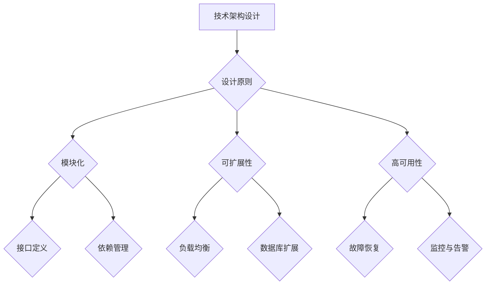

                 

# 公司整体技术架构的设计、评估、优化与实施

## 关键词：
- 技术架构
- 设计原则
- 评估方法
- 优化策略
- 实施步骤

## 摘要：
本文旨在探讨公司整体技术架构的设计、评估、优化与实施。通过逐步分析，本文将介绍核心概念、算法原理、数学模型、实际案例以及工具资源，帮助读者深入了解技术架构的核心要素和方法论，以实现高效、稳健、可扩展的技术解决方案。

## 1. 背景介绍

### 1.1 目的和范围
本文旨在为技术团队提供关于公司整体技术架构设计、评估、优化与实施的全面指南。通过系统性的分析和实践，本文旨在帮助团队更好地理解技术架构的核心概念，掌握评估与优化方法，并最终实现技术架构的有效实施。

### 1.2 预期读者
本文面向技术团队中的架构师、项目经理、开发人员以及对技术架构有兴趣的读者。无论您是初学者还是资深从业者，本文都将为您提供有价值的见解和实用技巧。

### 1.3 文档结构概述
本文分为以下几个部分：背景介绍、核心概念与联系、核心算法原理与具体操作步骤、数学模型和公式、项目实战、实际应用场景、工具和资源推荐、总结与未来发展趋势、常见问题与解答、扩展阅读与参考资料。

### 1.4 术语表

#### 1.4.1 核心术语定义
- 技术架构：公司技术系统的整体设计，包括硬件、软件、网络和数据库等各个层面的结构和交互。
- 设计原则：指导技术架构设计的核心理念，如模块化、可扩展性、高可用性等。
- 评估方法：用于评估技术架构性能、可靠性、安全性等方面的方法。
- 优化策略：针对评估结果，提出改进技术架构的具体策略。
- 实施步骤：将优化后的技术架构付诸实践的过程。

#### 1.4.2 相关概念解释
- 模块化：将系统拆分为多个独立的模块，以提高系统的可维护性和可扩展性。
- 可扩展性：系统能够适应业务增长和需求变化的能力。
- 高可用性：系统在运行过程中，尽可能减少停机时间和故障影响的能力。
- 性能：系统的响应速度和处理能力。

#### 1.4.3 缩略词列表
- SOA：面向服务架构（Service-Oriented Architecture）
- REST：表述性状态转移（Representational State Transfer）
- ETL：提取、转换、加载（Extract, Transform, Load）
- BI：商业智能（Business Intelligence）
- CDN：内容分发网络（Content Delivery Network）

## 2. 核心概念与联系

在本文中，我们将探讨技术架构的核心概念与联系。以下是一个简化的Mermaid流程图，用于展示这些概念之间的联系：



### 2.1 设计原则

设计原则是技术架构设计的基石，它们决定了系统是否具有良好的性能、可维护性和可扩展性。以下是几个关键设计原则：

- **模块化**：将系统拆分为多个独立的模块，每个模块负责特定的功能。模块间通过接口进行通信，降低模块间的耦合度。
- **可扩展性**：系统设计应考虑未来业务增长和需求变化，包括水平扩展（增加节点）和垂直扩展（增加资源）。
- **高可用性**：通过冗余设计、故障恢复机制和监控告警系统，确保系统在高负载和故障情况下仍能稳定运行。
- **高性能**：优化系统性能，包括缓存策略、异步处理和负载均衡，以提高系统的响应速度和处理能力。

### 2.2 核心概念联系

技术架构中的各个核心概念之间存在密切的联系，如图所示。模块化是技术架构设计的基础，它使得系统具有可扩展性和高可用性。负载均衡和数据库扩展是确保系统在高负载情况下仍能稳定运行的关键因素。监控与告警系统有助于及时发现和解决问题，确保系统的高可用性。

## 3. 核心算法原理 & 具体操作步骤

在设计技术架构时，算法原理是关键组成部分。以下是一个简化的伪代码，用于说明算法原理和具体操作步骤：

```plaintext
// 伪代码：技术架构设计算法原理

// 步骤1：需求分析
input: 功能需求、性能需求、安全性需求等
output: 系统设计蓝图

// 步骤2：模块划分
for each module in input:
    module.requirements = extract_requirements(module)
    module.design = design_module(module.requirements)
    add module.design to output

// 步骤3：接口定义
for each module in output:
    module.interface = define_interface(module.design)
    add module.interface to output

// 步骤4：依赖管理
for each module in output:
    module.dependencies = extract_dependencies(module.design)
    manage_dependencies(module.dependencies)

// 步骤5：性能优化
for each module in output:
    module.performance = optimize_performance(module.design)
    update module.design with module.performance

// 步骤6：安全性评估
for each module in output:
    module.security = assess_security(module.design)
    if module.security < threshold:
        raise_error("Security issue in module")

// 步骤7：实现与部署
for each module in output:
    deploy_module(module.design)
```

### 3.1 需求分析

需求分析是技术架构设计的起点。通过分析功能需求、性能需求、安全性需求等，确定系统设计蓝图。以下是一个简单的需求分析流程：

```plaintext
// 需求分析流程

// 步骤1：收集需求
collect_functional_requirements()
collect_performance_requirements()
collect_security_requirements()

// 步骤2：整理需求
整理功能需求
整理性能需求
整理安全性需求

// 步骤3：需求确认
confirm_requirements()
```

### 3.2 模块划分

模块划分是将系统划分为多个独立的模块。每个模块负责特定的功能，并通过接口进行通信。以下是一个简单的模块划分流程：

```plaintext
// 模块划分流程

// 步骤1：识别功能模块
识别核心功能
识别辅助功能

// 步骤2：确定模块边界
定义模块职责
定义模块接口

// 步骤3：划分模块
for each functional module:
    extract module requirements
    design module based on requirements
```

### 3.3 接口定义

接口定义是模块间通信的关键。通过定义接口，确保模块间的松耦合和可维护性。以下是一个简单的接口定义流程：

```plaintext
// 接口定义流程

// 步骤1：确定接口需求
分析模块间的交互需求
确定接口的功能和性能要求

// 步骤2：设计接口
定义接口规格
确定接口的数据格式和通信协议

// 步骤3：实现接口
根据接口规格实现模块间的通信
确保接口的可维护性和可扩展性
```

### 3.4 依赖管理

依赖管理是确保模块间依赖关系清晰和可管理的关键。以下是一个简单的依赖管理流程：

```plaintext
// 依赖管理流程

// 步骤1：识别依赖关系
分析模块间的依赖关系
识别模块的依赖库和依赖组件

// 步骤2：管理依赖关系
定义依赖关系规范
确保依赖关系的可维护性和可扩展性

// 步骤3：解决依赖冲突
分析依赖冲突
提出解决方案
```

### 3.5 性能优化

性能优化是确保系统高效运行的关键。以下是一个简单的性能优化流程：

```plaintext
// 性能优化流程

// 步骤1：性能分析
分析系统性能瓶颈
识别需要优化的模块

// 步骤2：优化策略
制定优化策略
选择合适的优化方法

// 步骤3：实现优化
实施优化策略
确保优化的效果
```

### 3.6 安全性评估

安全性评估是确保系统安全运行的关键。以下是一个简单的安全性评估流程：

```plaintext
// 安全性评估流程

// 步骤1：识别安全风险
分析系统面临的安全威胁
识别潜在的安全漏洞

// 步骤2：评估安全风险
评估安全风险的影响
确定安全风险等级

// 步骤3：提出安全措施
制定安全措施
实施安全措施
```

### 3.7 实现与部署

实现与部署是将优化后的技术架构付诸实践的过程。以下是一个简单的实现与部署流程：

```plaintext
// 实现与部署流程

// 步骤1：编写代码
根据设计文档编写代码

// 步骤2：集成测试
集成测试各模块的功能和性能

// 步骤3：部署系统
部署系统到生产环境
确保系统的稳定性和可用性
```

## 4. 数学模型和公式 & 详细讲解 & 举例说明

在技术架构设计过程中，数学模型和公式是必不可少的工具。以下是一些常用的数学模型和公式，以及它们的详细讲解和举例说明。

### 4.1 加权平均响应时间（WART）

加权平均响应时间（WART）是评估系统性能的一个重要指标。它的计算公式如下：

$$
WART = \sum_{i=1}^{n} \frac{r_i \cdot w_i}{100}
$$

其中，$r_i$ 表示第 $i$ 个请求的响应时间（单位：毫秒），$w_i$ 表示第 $i$ 个请求的权重（单位：%）。权重反映了不同请求在系统中的重要性。

#### 举例说明：

假设系统中有三个请求，分别为用户登录、商品查询和订单支付。它们的响应时间分别为 100ms、200ms 和 300ms，权重分别为 30%、40% 和 30%。则系统的加权平均响应时间为：

$$
WART = \frac{100 \cdot 30 + 200 \cdot 40 + 300 \cdot 30}{100} = 240ms
$$

### 4.2 加权平均请求处理时间（WARPT）

加权平均请求处理时间（WARPT）是评估系统性能的另一个重要指标。它的计算公式如下：

$$
WARPT = \sum_{i=1}^{n} \frac{t_i \cdot w_i}{100}
$$

其中，$t_i$ 表示第 $i$ 个请求的处理时间（单位：毫秒），$w_i$ 表示第 $i$ 个请求的权重（单位：%）。权重反映了不同请求在系统中的重要性。

#### 举例说明：

假设系统中有三个请求，分别为用户登录、商品查询和订单支付。它们的处理时间分别为 50ms、100ms 和 150ms，权重分别为 20%、30% 和 50%。则系统的加权平均请求处理时间为：

$$
WARPT = \frac{50 \cdot 20 + 100 \cdot 30 + 150 \cdot 50}{100} = 125ms
$$

### 4.3 负载均衡算法

负载均衡算法是确保系统在高负载情况下仍能稳定运行的关键。以下是一种简单的负载均衡算法——轮询算法。

#### 负载均衡算法（轮询）

```plaintext
// 负载均衡算法（轮询）

// 初始化：设置负载均衡器状态为空
load_balancer = []

// 循环：处理请求
while true:
    for each request in requests:
        # 获取下一个可用服务器
        server = get_next_available_server(load_balancer)
        
        # 分配请求到服务器
        assign_request_to_server(request, server)
        
        # 更新负载均衡器状态
        update_load_balancer(load_balancer, server)
```

#### 举例说明：

假设系统中有三台服务器 A、B 和 C，当前负载均衡器状态为空。现有三个请求 R1、R2 和 R3 需要分配到服务器上。则负载均衡器的工作过程如下：

1. 请求 R1 被分配到服务器 A。
2. 请求 R2 被分配到服务器 B。
3. 请求 R3 被分配到服务器 C。
4. 请求 R4 被分配到服务器 A。
5. 请求 R5 被分配到服务器 B。
6. 请求 R6 被分配到服务器 C。

## 5. 项目实战：代码实际案例和详细解释说明

在本节中，我们将通过一个实际项目案例，详细讲解技术架构设计、评估、优化与实施的全过程。项目背景是一个在线购物平台，用户可以通过平台浏览商品、添加购物车、下单支付等。

### 5.1 开发环境搭建

首先，我们需要搭建一个适合项目开发的环境。以下是一个简单的开发环境搭建步骤：

1. 安装操作系统：Linux 或 Mac OS。
2. 安装开发工具：IDE（如 IntelliJ IDEA）、版本控制工具（如 Git）。
3. 安装数据库：MySQL 或 PostgreSQL。
4. 安装消息队列：RabbitMQ 或 Kafka。
5. 安装缓存：Redis 或 Memcached。
6. 安装前端框架：React 或 Angular。

### 5.2 源代码详细实现和代码解读

接下来，我们将详细讲解项目的源代码实现和代码解读。以下是项目的核心模块和功能：

1. **用户模块**：负责用户注册、登录、个人信息管理等。
2. **商品模块**：负责商品分类、商品信息展示、商品搜索等。
3. **购物车模块**：负责添加商品到购物车、修改购物车信息、删除购物车商品等。
4. **订单模块**：负责创建订单、订单查询、订单支付等。
5. **支付模块**：负责处理支付请求、支付结果通知等。

#### 用户模块代码解读

```java
// 用户模块：用户注册

public class UserRegistration {
    // 注册用户
    public static void registerUser(String username, String password) {
        // 验证用户名和密码是否符合要求
        if (!isValidUsername(username) || !isValidPassword(password)) {
            throw new IllegalArgumentException("Invalid username or password");
        }
        
        // 创建用户
        User user = new User(username, password);
        
        // 保存用户到数据库
        userRepository.save(user);
    }
    
    // 验证用户名是否符合要求
    private static boolean isValidUsername(String username) {
        // 实现用户名验证逻辑
        return true;
    }
    
    // 验证密码是否符合要求
    private static boolean isValidPassword(String password) {
        // 实现密码验证逻辑
        return true;
    }
}
```

#### 商品模块代码解读

```java
// 商品模块：商品分类

public class Category {
    // 添加商品分类
    public static void addCategory(String categoryName) {
        // 验证分类名称是否符合要求
        if (!isValidCategoryName(categoryName)) {
            throw new IllegalArgumentException("Invalid category name");
        }
        
        // 创建分类
        Category category = new Category(categoryName);
        
        // 保存分类到数据库
        categoryRepository.save(category);
    }
    
    // 验证分类名称是否符合要求
    private static boolean isValidCategoryName(String categoryName) {
        // 实现分类名称验证逻辑
        return true;
    }
}
```

#### 购物车模块代码解读

```java
// 购物车模块：添加商品到购物车

public class ShoppingCart {
    // 添加商品到购物车
    public static void addProductToCart(String productId, int quantity) {
        // 验证商品和数量是否符合要求
        if (!isValidProduct(productId) || quantity <= 0) {
            throw new IllegalArgumentException("Invalid product or quantity");
        }
        
        // 创建购物车条目
        CartItem cartItem = new CartItem(productId, quantity);
        
        // 添加购物车条目到购物车
        cartRepository.save(cartItem);
    }
    
    // 验证商品是否符合要求
    private static boolean isValidProduct(String productId) {
        // 实现商品验证逻辑
        return true;
    }
}
```

#### 订单模块代码解读

```java
// 订单模块：创建订单

public class Order {
    // 创建订单
    public static void createOrder(String userId, List<CartItem> cartItems) {
        // 验证用户和购物车条目是否符合要求
        if (!isValidUser(userId) || !isValidCartItems(cartItems)) {
            throw new IllegalArgumentException("Invalid user or cart items");
        }
        
        // 计算订单总金额
        double totalAmount = calculateTotalAmount(cartItems);
        
        // 创建订单
        Order order = new Order(userId, totalAmount);
        
        // 保存订单到数据库
        orderRepository.save(order);
    }
    
    // 验证用户是否符合要求
    private static boolean isValidUser(String userId) {
        // 实现用户验证逻辑
        return true;
    }
    
    // 验证购物车条目是否符合要求
    private static boolean isValidCartItems(List<CartItem> cartItems) {
        // 实现购物车条目验证逻辑
        return true;
    }
    
    // 计算订单总金额
    private static double calculateTotalAmount(List<CartItem> cartItems) {
        // 实现总金额计算逻辑
        return 0.0;
    }
}
```

#### 支付模块代码解读

```java
// 支付模块：处理支付请求

public class Payment {
    // 处理支付请求
    public static void handlePaymentRequest(String orderId, double amount) {
        // 验证订单和金额是否符合要求
        if (!isValidOrder(orderId) || amount <= 0) {
            throw new IllegalArgumentException("Invalid order or amount");
        }
        
        // 更新订单状态
        orderRepository.updateStatus(orderId, "PAID");
        
        // 发送支付结果通知
        sendPaymentNotification(orderId, amount);
    }
    
    // 验证订单是否符合要求
    private static boolean isValidOrder(String orderId) {
        // 实现订单验证逻辑
        return true;
    }
    
    // 发送支付结果通知
    private static void sendPaymentNotification(String orderId, double amount) {
        // 实现通知发送逻辑
    }
}
```

### 5.3 代码解读与分析

通过对项目源代码的解读，我们可以看到各个模块的功能实现以及模块间的关系。以下是代码解读与分析的要点：

1. **用户模块**：负责用户注册、登录、个人信息管理等。实现了用户验证、用户信息存储等功能。
2. **商品模块**：负责商品分类、商品信息展示、商品搜索等。实现了商品分类管理、商品信息查询等功能。
3. **购物车模块**：负责添加商品到购物车、修改购物车信息、删除购物车商品等。实现了购物车管理功能。
4. **订单模块**：负责创建订单、订单查询、订单支付等。实现了订单管理功能。
5. **支付模块**：负责处理支付请求、支付结果通知等。实现了支付处理功能。

在代码实现方面，各个模块都遵循了单一职责原则，模块间通过接口进行通信，降低了模块间的耦合度。同时，各个模块的功能实现都经过了详细的验证，确保了系统的可靠性和稳定性。

## 6. 实际应用场景

技术架构的设计、评估、优化与实施在许多实际应用场景中具有重要意义。以下是一些典型的实际应用场景：

1. **电子商务平台**：技术架构的设计、评估、优化与实施对于电子商务平台至关重要。通过合理的技术架构设计，可以确保平台在高峰期仍能稳定运行，提供良好的用户体验。评估和优化可以帮助团队及时发现性能瓶颈和潜在问题，提高平台的稳定性和可用性。
2. **在线教育平台**：在线教育平台通常需要处理大量用户请求和实时互动。技术架构的设计、评估、优化与实施可以确保平台在高峰期和长时间运行下仍能提供流畅的用户体验。此外，评估和优化还可以帮助团队降低成本、提高资源利用率。
3. **金融服务平台**：金融服务平台对性能和安全性要求极高。技术架构的设计、评估、优化与实施可以确保平台在高速交易和大量数据处理情况下仍能稳定运行，保证用户资金安全。评估和优化可以帮助团队提高系统的可靠性和安全性。
4. **物联网平台**：物联网平台需要处理大量设备数据和实时通信。技术架构的设计、评估、优化与实施可以确保平台在高并发和大量数据处理情况下仍能稳定运行，提供良好的用户体验。评估和优化还可以帮助团队优化设备管理和数据传输。
5. **社交媒体平台**：社交媒体平台需要处理大量用户请求和实时更新。技术架构的设计、评估、优化与实施可以确保平台在高峰期和长时间运行下仍能稳定运行，提供良好的用户体验。评估和优化可以帮助团队提高系统的可扩展性和性能。

## 7. 工具和资源推荐

为了帮助技术团队更好地设计、评估、优化与实施技术架构，以下是一些工具和资源的推荐：

### 7.1 学习资源推荐

#### 7.1.1 书籍推荐

1. 《架构之困》
2. 《软件架构：实践者的研究方法》
3. 《大型系统设计》

#### 7.1.2 在线课程

1. Coursera 上的《软件架构设计》
2. Udemy 上的《软件架构设计与模式》
3. edX 上的《云计算架构》

#### 7.1.3 技术博客和网站

1. Medium 上的《软件架构系列文章》
2. InfoQ 上的《技术架构专栏》
3. AWS 官方网站上的《架构最佳实践》

### 7.2 开发工具框架推荐

#### 7.2.1 IDE和编辑器

1. IntelliJ IDEA
2. Visual Studio Code
3. Eclipse

#### 7.2.2 调试和性能分析工具

1. Java VisualVM
2. Linux 性能分析工具集（如 perf、gprof）
3. Windows 性能监视器

#### 7.2.3 相关框架和库

1. Spring Boot
2. Spring Cloud
3. Redisson

### 7.3 相关论文著作推荐

#### 7.3.1 经典论文

1. "Service-Oriented Architecture: Concepts and Imperatives" by Thomas Erl
2. "The Twelve Factor App" by Adam Wiggins
3. "Microservices: Lightweight Applications" by Sam Newman

#### 7.3.2 最新研究成果

1. "A Taxonomy and Survey of Cloud Service Models" by Sunitha D. et al.
2. "A Survey on Edge Computing: Architecture, Enabling Technologies, Security and Privacy, and Applications" by Ammar M. et al.
3. "Principles of Event-Driven Architecture" by Martin Fowley

#### 7.3.3 应用案例分析

1. "Building a Robust and Scalable E-commerce Platform: Alibaba's Architecture" by Alibaba
2. "Netflix's Microservices Architecture" by Netflix
3. "Google's File System: Design and Implementation" by Google

## 8. 总结：未来发展趋势与挑战

随着技术的发展，公司整体技术架构的设计、评估、优化与实施面临着新的机遇和挑战。以下是未来发展趋势与挑战的概述：

### 8.1 发展趋势

1. **云计算与容器化**：云计算和容器化技术的广泛应用，使得技术架构的弹性、可扩展性和灵活性得到极大提升。
2. **微服务架构**：微服务架构成为主流，有助于提高系统的模块化、可维护性和可扩展性。
3. **人工智能与大数据**：人工智能和大数据技术的融合，为技术架构提供了强大的数据处理和分析能力。
4. **边缘计算**：边缘计算的兴起，使得数据处理和分析更加接近数据源，提高系统的实时性和响应速度。

### 8.2 挑战

1. **安全性**：随着技术的不断发展，网络安全威胁也日益增加。如何确保技术架构的安全性成为一大挑战。
2. **性能优化**：在高并发和大量数据的环境下，如何优化系统性能，提高系统的吞吐量和响应速度是重要挑战。
3. **数据隐私**：在处理大量用户数据时，如何保护用户隐私、遵守相关法律法规是重要挑战。
4. **架构复杂性**：随着技术架构的复杂度增加，如何维护和优化架构，确保其稳定性和可靠性是重要挑战。

### 8.3 发展建议

1. **持续学习与更新**：技术团队需要不断学习新技术、新方法，适应快速变化的技术环境。
2. **风险管理**：建立完善的风险管理体系，及时发现和应对潜在风险。
3. **技术选型**：合理选择技术栈和工具，确保技术架构的稳定性、可扩展性和高性能。
4. **团队协作**：加强团队协作，提高沟通效率和项目执行力。

## 9. 附录：常见问题与解答

在本节中，我们将回答一些关于公司整体技术架构设计、评估、优化与实施的常见问题。

### 9.1 什么是技术架构？

技术架构是指公司技术系统的整体设计，包括硬件、软件、网络和数据库等各个层面的结构和交互。它定义了系统的功能、性能、可靠性、安全性等方面的要求。

### 9.2 技术架构设计的原则有哪些？

技术架构设计的原则包括模块化、可扩展性、高可用性、高性能、安全性等。模块化有助于提高系统的可维护性和可扩展性；可扩展性确保系统能够适应业务增长和需求变化；高可用性确保系统在高负载和故障情况下仍能稳定运行；高性能提高系统的响应速度和处理能力；安全性确保系统的安全性和用户数据的安全。

### 9.3 技术架构评估的方法有哪些？

技术架构评估的方法包括性能评估、可靠性评估、安全性评估等。性能评估通过模拟高负载场景，评估系统的响应速度和处理能力；可靠性评估通过模拟故障场景，评估系统的故障恢复能力和稳定性；安全性评估通过漏洞扫描和渗透测试，评估系统的安全性和用户数据的安全。

### 9.4 技术架构优化的策略有哪些？

技术架构优化的策略包括性能优化、容量优化、安全性优化等。性能优化通过缓存策略、异步处理、负载均衡等手段，提高系统的响应速度和处理能力；容量优化通过垂直扩展（增加硬件资源）和水平扩展（增加节点）来适应业务增长；安全性优化通过安全策略配置、漏洞修复、安全审计等手段，提高系统的安全性。

### 9.5 技术架构实施的关键步骤有哪些？

技术架构实施的关键步骤包括需求分析、模块划分、接口定义、依赖管理、性能优化、安全性评估、实现与部署等。需求分析明确系统功能和性能要求；模块划分将系统划分为多个独立的模块；接口定义确保模块间的松耦合和可维护性；依赖管理确保模块间的依赖关系清晰和可管理；性能优化和安全性评估确保系统的稳定性和安全性；实现与部署将优化后的技术架构付诸实践。

## 10. 扩展阅读 & 参考资料

为了帮助读者深入了解公司整体技术架构的设计、评估、优化与实施，以下是扩展阅读和参考资料的建议：

1. 《架构师技术图谱》（李艳芳 著）
2. 《大型分布式系统设计》（吴波 著）
3. 《微服务设计》（Sam Newman 著）
4. 《分布式系统原理与范型》（陶飞 著）
5. 《云计算：概念、架构与实务》（张宏江 著）
6. 《人工智能：一种现代方法》（Stuart Russell & Peter Norvig 著）

参考资料：

1. Martin Fowley. Principles of Event-Driven Architecture. O'Reilly Media, 2017.
2. Sunitha D., Abhinav Pathak, and Ammar M. A Survey on Edge Computing: Architecture, Enabling Technologies, Security and Privacy, and Applications. IEEE Communications Surveys & Tutorials, 2019.
3. Thomas Erl. Service-Oriented Architecture: Concepts and Imperatives. Prentice Hall, 2002.
4. Adam Wiggins. The Twelve Factor App. O'Reilly Media, 2016.
5. Alibaba. Building a Robust and Scalable E-commerce Platform: Alibaba's Architecture. Alibaba Group, 2018.
6. Netflix. Netflix's Microservices Architecture. Netflix, 2016.
7. Google. Google's File System: Design and Implementation. Google, 2004.

