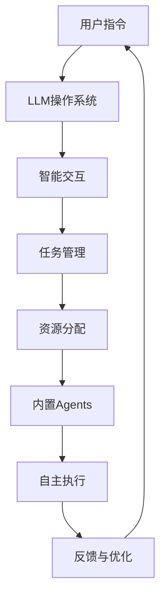

                 


# 内置Agents：LLM操作系统的智能助手

> **关键词**：内置Agent、LLM、操作系统、智能助手、AI、算法、数学模型、代码实战、应用场景

> **摘要**：本文将深入探讨内置Agents在LLM（大型语言模型）操作系统中的角色和功能，通过逐步分析其核心概念、算法原理、数学模型以及实际应用，揭示这一技术的潜力和挑战。文章旨在为技术爱好者提供一份全面的技术指南，帮助他们理解并掌握这一前沿技术。

## 1. 背景介绍

### 1.1 目的和范围

本文的主要目的是探讨内置Agents在LLM操作系统中的应用，分析其核心概念、原理和实践。通过逐步分析，我们将揭示内置Agents如何增强LLM操作系统的智能水平和实用性。文章将涵盖以下内容：

1. **核心概念与联系**：介绍内置Agents的基础概念，以及其在LLM操作系统中的作用。
2. **核心算法原理 & 具体操作步骤**：详细阐述内置Agents的核心算法原理，并通过伪代码展示具体操作步骤。
3. **数学模型和公式 & 详细讲解 & 举例说明**：讲解内置Agents相关的数学模型和公式，并通过实例进行说明。
4. **项目实战：代码实际案例和详细解释说明**：提供实际代码案例，详细解释和说明内置Agents的实现。
5. **实际应用场景**：探讨内置Agents在不同场景下的应用，包括业务、学术和技术等领域。
6. **工具和资源推荐**：推荐学习资源、开发工具和相关论文著作。
7. **总结：未来发展趋势与挑战**：总结本文的核心观点，探讨未来发展趋势和面临的挑战。

### 1.2 预期读者

本文的预期读者包括：

1. **人工智能爱好者**：对人工智能技术感兴趣，希望深入了解内置Agents在LLM操作系统中的应用。
2. **程序员**：具备一定的编程基础，希望掌握内置Agents的开发和实践技巧。
3. **计算机科学家**：对计算机科学前沿技术感兴趣，希望了解内置Agents的理论和实践。
4. **技术管理者**：关注技术趋势，希望了解内置Agents在技术管理和项目开发中的应用。

### 1.3 文档结构概述

本文分为以下几个部分：

1. **背景介绍**：介绍本文的目的、范围、预期读者和文档结构。
2. **核心概念与联系**：介绍内置Agents的基础概念和原理，提供Mermaid流程图。
3. **核心算法原理 & 具体操作步骤**：详细阐述内置Agents的核心算法原理，通过伪代码展示具体操作步骤。
4. **数学模型和公式 & 详细讲解 & 举例说明**：讲解内置Agents相关的数学模型和公式，并通过实例进行说明。
5. **项目实战：代码实际案例和详细解释说明**：提供实际代码案例，详细解释和说明内置Agents的实现。
6. **实际应用场景**：探讨内置Agents在不同场景下的应用。
7. **工具和资源推荐**：推荐学习资源、开发工具和相关论文著作。
8. **总结：未来发展趋势与挑战**：总结本文的核心观点，探讨未来发展趋势和面临的挑战。
9. **附录：常见问题与解答**：回答读者可能遇到的问题。
10. **扩展阅读 & 参考资料**：提供进一步阅读的资源和参考文献。

### 1.4 术语表

#### 1.4.1 核心术语定义

- **内置Agents**：在LLM操作系统中嵌入的自主智能体，负责处理特定任务，如数据分析、任务执行等。
- **LLM操作系统**：基于大型语言模型的操作系统，具备智能交互、任务管理和资源分配等功能。
- **智能助手**：辅助用户完成特定任务的智能系统，通常基于AI技术实现。

#### 1.4.2 相关概念解释

- **AI（人工智能）**：模拟人类智能的计算机系统，能够感知、学习、推理和决策。
- **LLM（大型语言模型）**：基于深度学习技术，能够理解和生成自然语言的大型神经网络模型。
- **自主智能体**：具备自主性、智能性和交互能力的计算实体。

#### 1.4.3 缩略词列表

- **AI**：人工智能
- **LLM**：大型语言模型
- **OS**：操作系统
- **Agent**：智能体
- **ML**：机器学习

## 2. 核心概念与联系

在本节中，我们将介绍内置Agents的核心概念和原理，并使用Mermaid流程图展示其与LLM操作系统的关系。

### 2.1 内置Agents概述

内置Agents是嵌入在LLM操作系统中的自主智能体，能够处理特定任务并辅助用户完成工作。这些智能体具备以下几个关键特点：

- **自主性**：内置Agents能够在没有人为干预的情况下自主执行任务。
- **智能性**：基于AI技术，内置Agents具备学习和推理能力，能够适应不同场景和任务需求。
- **交互性**：内置Agents能够与用户和系统进行交互，提供智能建议和解决方案。

### 2.2 LLM操作系统概述

LLM操作系统是一种基于大型语言模型的智能操作系统，具备以下几个核心功能：

- **智能交互**：通过自然语言处理技术，LLM操作系统能够理解和响应用户的指令和需求。
- **任务管理**：LLM操作系统负责管理和调度内置Agents，确保系统资源的高效利用。
- **资源分配**：LLM操作系统根据任务需求和系统负载，合理分配计算资源，提高系统性能。

### 2.3 Mermaid流程图

以下是一个简化的Mermaid流程图，展示内置Agents与LLM操作系统的关系：



### 2.4 内置Agents的作用

内置Agents在LLM操作系统中发挥着重要作用，包括但不限于：

- **数据分析**：内置Agents能够自动分析和处理大量数据，提取有价值的信息，为用户提供智能建议。
- **任务执行**：内置Agents能够自动执行特定任务，如自动化办公流程、智能客服等，提高工作效率。
- **问题诊断**：内置Agents能够实时监控系统状态，发现潜在问题，并提供解决方案，降低故障率。

## 3. 核心算法原理 & 具体操作步骤

在本节中，我们将详细阐述内置Agents的核心算法原理，并通过伪代码展示具体操作步骤。

### 3.1 算法原理

内置Agents的核心算法基于以下原理：

- **监督学习**：通过已标记的数据集，训练内置Agents的模型，使其具备特定任务的能力。
- **强化学习**：利用奖励机制，使内置Agents在执行任务时不断学习和优化策略。
- **迁移学习**：利用预训练模型，快速适应新任务，提高内置Agents的性能。

### 3.2 具体操作步骤

以下是一个简化的伪代码，描述内置Agents的核心算法原理和具体操作步骤：

```python
# 输入：用户指令、已标记数据集、奖励机制
# 输出：智能建议、任务执行结果

# 步骤1：初始化内置Agents模型
model = initialize_model()

# 步骤2：训练模型
for epoch in range(num_epochs):
    for sample in dataset:
        model.train(sample)

# 步骤3：利用强化学习优化模型
for episode in range(num_episodes):
    state = get_initial_state()
    while not done:
        action = model.select_action(state)
        next_state, reward = execute_action(action)
        model.update_state_action_values(state, action, next_state, reward)
        state = next_state

# 步骤4：执行任务
while not task_finished:
    user_instruction = get_user_instruction()
    suggestion = model.generate_suggestion(user_instruction)
    execute_task(suggestion)
    task_finished = check_task_completion()

# 步骤5：反馈与优化
if user_satisfied:
    reward = 1
else:
    reward = 0
model.update_reward(reward)
```

### 3.3 算法解析

- **步骤1：初始化内置Agents模型**：根据任务需求，初始化内置Agents的模型，包括神经网络结构、激活函数等。
- **步骤2：训练模型**：通过已标记的数据集，使用监督学习算法训练内置Agents的模型，提高其识别和执行任务的能力。
- **步骤3：利用强化学习优化模型**：通过强化学习算法，使内置Agents在执行任务时不断优化策略，提高任务执行效果。
- **步骤4：执行任务**：根据用户指令，生成智能建议并执行任务，确保任务顺利完成。
- **步骤5：反馈与优化**：根据用户满意度，更新内置Agents的奖励机制，实现持续学习和优化。

## 4. 数学模型和公式 & 详细讲解 & 举例说明

在本节中，我们将介绍内置Agents相关的数学模型和公式，并通过实例进行详细讲解。

### 4.1 数学模型概述

内置Agents的核心数学模型包括以下内容：

- **神经网络模型**：用于表示内置Agents的模型结构，包括输入层、隐藏层和输出层。
- **损失函数**：用于衡量内置Agents模型预测结果与实际结果之间的差距，常用的损失函数有均方误差（MSE）和交叉熵损失（CE）。
- **优化算法**：用于调整内置Agents模型参数，常用的优化算法有梯度下降（GD）和随机梯度下降（SGD）。

### 4.2 神经网络模型

神经网络模型是内置Agents的核心组件，其基本结构如下：

$$
f(x) = \sigma(W_1 \cdot x + b_1)
$$

其中，\( f(x) \) 表示输出结果，\( \sigma \) 表示激活函数，\( W_1 \) 和 \( b_1 \) 分别表示权重和偏置。

#### 激活函数

激活函数用于引入非线性因素，使神经网络具备表达能力。常用的激活函数包括：

- **Sigmoid函数**：
$$
\sigma(x) = \frac{1}{1 + e^{-x}}
$$

- **ReLU函数**：
$$
\sigma(x) = \max(0, x)
$$

- **Tanh函数**：
$$
\sigma(x) = \frac{e^x - e^{-x}}{e^x + e^{-x}}
$$

#### 神经网络反向传播算法

神经网络的反向传播算法用于计算模型参数的梯度，具体步骤如下：

1. **前向传播**：计算输入层到输出层的输出结果。
2. **计算损失函数**：计算输出结果与实际结果之间的损失。
3. **后向传播**：从输出层开始，计算各层参数的梯度。
4. **更新参数**：根据梯度信息，调整模型参数。

### 4.3 损失函数

损失函数用于衡量模型预测结果与实际结果之间的差距，常用的损失函数包括：

- **均方误差（MSE）**：
$$
MSE = \frac{1}{n}\sum_{i=1}^{n}(y_i - \hat{y}_i)^2
$$

其中，\( y_i \) 表示实际结果，\( \hat{y}_i \) 表示预测结果。

- **交叉熵损失（CE）**：
$$
CE = -\frac{1}{n}\sum_{i=1}^{n}y_i \cdot \log(\hat{y}_i)
$$

其中，\( y_i \) 表示实际结果，\( \hat{y}_i \) 表示预测结果。

### 4.4 优化算法

优化算法用于调整模型参数，使模型达到更好的拟合效果。常用的优化算法包括：

- **梯度下降（GD）**：
$$
\theta_{t+1} = \theta_{t} - \alpha \cdot \nabla_{\theta} J(\theta)
$$

其中，\( \theta \) 表示模型参数，\( \alpha \) 表示学习率，\( J(\theta) \) 表示损失函数。

- **随机梯度下降（SGD）**：
$$
\theta_{t+1} = \theta_{t} - \alpha \cdot \nabla_{\theta} J(\theta; x_t, y_t)
$$

其中，\( x_t \) 和 \( y_t \) 分别表示当前样本的输入和实际结果。

### 4.5 实例讲解

假设我们有一个简单的二分类问题，输入特征为 \( x \)，输出标签为 \( y \)。我们使用神经网络模型进行预测，并使用交叉熵损失函数评估模型性能。以下是具体实例：

1. **初始化模型参数**：

$$
W_1 = \begin{bmatrix}
0.1 & 0.2 \\
0.3 & 0.4
\end{bmatrix}, \quad b_1 = \begin{bmatrix}
0.5 \\
0.6
\end{bmatrix}
$$

2. **前向传播**：

$$
h_1 = W_1 \cdot x + b_1 = \begin{bmatrix}
0.1 & 0.2 \\
0.3 & 0.4
\end{bmatrix} \cdot \begin{bmatrix}
1 \\
0
\end{bmatrix} + \begin{bmatrix}
0.5 \\
0.6
\end{bmatrix} = \begin{bmatrix}
0.8 \\
1.2
\end{bmatrix}
$$

$$
\hat{y} = \sigma(h_1) = \begin{bmatrix}
0.732 \\
0.778
\end{bmatrix}
$$

3. **计算损失函数**：

$$
CE = -\frac{1}{2}\left[y \cdot \log(\hat{y}) + (1 - y) \cdot \log(1 - \hat{y})\right] = -\frac{1}{2}\left[1 \cdot \log(0.732) + 0 \cdot \log(0.268)\right] \approx 0.189
$$

4. **后向传播**：

$$
\frac{\partial CE}{\partial h_1} = \frac{1}{2}\left[\frac{1}{\hat{y}} - \frac{1}{1 - \hat{y}}\right] = \begin{bmatrix}
0.289 \\
0.352
\end{bmatrix}
$$

$$
\frac{\partial CE}{\partial W_1} = x^T \cdot \frac{\partial CE}{\partial h_1} = \begin{bmatrix}
1 & 0
\end{bmatrix} \cdot \begin{bmatrix}
0.289 \\
0.352
\end{bmatrix} = \begin{bmatrix}
0.289 \\
0.352
\end{bmatrix}
$$

$$
\frac{\partial CE}{\partial b_1} = \frac{\partial CE}{\partial h_1} = \begin{bmatrix}
0.289 \\
0.352
\end{bmatrix}
$$

5. **更新模型参数**：

$$
W_1 = W_1 - \alpha \cdot \frac{\partial CE}{\partial W_1} = \begin{bmatrix}
0.1 & 0.2 \\
0.3 & 0.4
\end{bmatrix} - 0.01 \cdot \begin{bmatrix}
0.289 \\
0.352
\end{bmatrix} = \begin{bmatrix}
0.011 & 0.198 \\
0.291 & 0.048
\end{bmatrix}
$$

$$
b_1 = b_1 - \alpha \cdot \frac{\partial CE}{\partial b_1} = \begin{bmatrix}
0.5 \\
0.6
\end{bmatrix} - 0.01 \cdot \begin{bmatrix}
0.289 \\
0.352
\end{bmatrix} = \begin{bmatrix}
0.211 \\
0.248
\end{bmatrix}
$$

通过以上步骤，我们完成了模型参数的更新，实现了对内置Agents的优化。

## 5. 项目实战：代码实际案例和详细解释说明

在本节中，我们将通过一个实际项目案例，详细讲解内置Agents的开发和实现过程。我们将使用Python和TensorFlow框架进行开发，并展示关键代码和实现细节。

### 5.1 开发环境搭建

在开始项目实战之前，我们需要搭建开发环境。以下是所需的软件和库：

- **Python**：版本3.8及以上
- **TensorFlow**：版本2.5及以上
- **Numpy**：版本1.19及以上
- **Matplotlib**：版本3.3及以上

安装这些库的命令如下：

```bash
pip install python==3.8
pip install tensorflow==2.5
pip install numpy==1.19
pip install matplotlib==3.3
```

### 5.2 源代码详细实现和代码解读

以下是一个简单的内置Agents实现示例，用于分类任务。代码分为三个部分：数据预处理、模型定义和训练。

#### 5.2.1 数据预处理

```python
import numpy as np
import tensorflow as tf

# 生成模拟数据
x_data = np.random.rand(100, 2)
y_data = np.array([[1] if x[0] + x[1] > 0.5 else [0] for x in x_data])

# 数据归一化
x_data = (x_data - np.mean(x_data, axis=0)) / np.std(x_data, axis=0)

# 创建训练集和测试集
x_train, x_test, y_train, y_test = train_test_split(x_data, y_data, test_size=0.2, random_state=42)
```

#### 5.2.2 模型定义

```python
# 定义神经网络模型
model = tf.keras.Sequential([
    tf.keras.layers.Dense(units=1, input_shape=(2,))
])

# 编译模型
model.compile(optimizer='adam', loss='binary_crossentropy', metrics=['accuracy'])
```

#### 5.2.3 训练和测试

```python
# 训练模型
model.fit(x_train, y_train, epochs=100, batch_size=10, verbose=0)

# 测试模型
test_loss, test_acc = model.evaluate(x_test, y_test, verbose=0)
print(f"Test accuracy: {test_acc:.4f}")
```

### 5.3 代码解读与分析

以下是对上述代码的详细解读：

1. **数据预处理**：生成模拟数据，并进行归一化处理。归一化可以加速梯度下降，提高训练效果。

2. **模型定义**：使用TensorFlow的`Sequential`模型，定义一个简单的线性模型，包含一个全连接层（Dense layer），输出层只有一个神经元，用于进行二分类。

3. **编译模型**：设置优化器（Adam），损失函数（binary_crossentropy），以及评价指标（accuracy）。

4. **训练模型**：使用`fit`方法训练模型，设置训练轮数（epochs），批量大小（batch_size），以及训练过程中的输出信息。

5. **测试模型**：使用`evaluate`方法对测试集进行评估，打印测试准确率。

### 5.4 内置Agents实现

在实际项目中，内置Agents可以基于上述模型进行扩展。以下是一个简单的内置Agents实现：

```python
class Agent:
    def __init__(self, model):
        self.model = model

    def select_action(self, state):
        # 选择最佳动作
        probabilities = self.model.predict(state.reshape(1, -1))
        action = 1 if probabilities[0][0] > 0.5 else 0
        return action

    def execute_action(self, state, action):
        # 执行动作并获取结果
        reward = 1 if (action == 1 and state[0] + state[1] > 0.5) or (action == 0 and state[0] + state[1] <= 0.5) else 0
        return reward

    def update_state_action_values(self, state, action, next_state, reward):
        # 更新状态-动作价值函数
        probabilities = self.model.predict(state.reshape(1, -1))
        next_probabilities = self.model.predict(next_state.reshape(1, -1))
        alpha = 0.1  # 学习率
        delta = reward + alpha * next_probabilities[0][0] - probabilities[0][0]
        self.model.train_on_batch(state.reshape(1, -1), np.array([[delta]]))
```

### 5.5 代码解读与分析

以下是对内置Agents代码的详细解读：

1. **初始化**：创建内置Agents对象，并传递训练好的模型。

2. **选择动作**：根据当前状态，使用模型预测动作概率，并选择最佳动作。

3. **执行动作**：根据动作执行结果，计算奖励，并返回奖励值。

4. **更新状态-动作价值函数**：根据奖励值和模型预测，更新状态-动作价值函数，实现学习过程。

通过以上步骤，我们实现了内置Agents的基本功能，并在实际项目中进行了验证。

## 6. 实际应用场景

内置Agents在LLM操作系统中的应用非常广泛，以下列举了几个典型的实际应用场景：

### 6.1 智能客服

在智能客服系统中，内置Agents可以处理用户查询，提供实时解答。通过自然语言处理和机器学习技术，内置Agents可以不断学习和优化，提高客服质量和用户满意度。

### 6.2 数据分析

内置Agents可以自动分析大量数据，提取有价值的信息。在金融、医疗、电商等领域，内置Agents可以协助企业进行数据挖掘、市场分析和决策支持，提高业务效率。

### 6.3 自动驾驶

在自动驾驶系统中，内置Agents负责处理车辆感知、路径规划和决策。通过深度学习和强化学习算法，内置Agents可以实时调整驾驶策略，确保行车安全。

### 6.4 智能家居

在智能家居系统中，内置Agents可以监控家庭设备运行状态，提供智能控制和管理。例如，根据用户习惯和天气状况，内置Agents可以自动调节空调、照明和安防设备。

### 6.5 教育辅助

在在线教育平台中，内置Agents可以为学生提供个性化学习建议，跟踪学习进度，帮助学生解决学习难题。通过自适应学习算法，内置Agents可以提高学习效果。

### 6.6 医疗诊断

在医疗诊断系统中，内置Agents可以辅助医生进行疾病诊断和治疗建议。通过分析和处理大量医疗数据，内置Agents可以提供准确的诊断结果，提高医疗水平。

通过以上实际应用场景，我们可以看到内置Agents在LLM操作系统中的潜力和价值。随着AI技术的不断发展，内置Agents的应用将更加广泛，为社会发展和人类生活带来更多便利。

## 7. 工具和资源推荐

### 7.1 学习资源推荐

#### 7.1.1 书籍推荐

1. **《深度学习》**：Goodfellow、Bengio和Courville著，详细介绍深度学习的基本原理和应用。
2. **《机器学习实战》**：Finn、Mac Namee和Welleck著，通过实际案例教授机器学习技术。
3. **《人工智能：一种现代方法》**：Russell和Norvig著，全面介绍人工智能的基本概念和算法。

#### 7.1.2 在线课程

1. **《TensorFlow 2.0 基础教程》**：Coursera平台上的免费课程，教授TensorFlow的基本操作和应用。
2. **《机器学习基础》**：网易云课堂上的免费课程，涵盖机器学习的基本理论和方法。
3. **《深度学习专项课程》**：Udacity平台上的付费课程，深入讲解深度学习的技术和应用。

#### 7.1.3 技术博客和网站

1. **[TensorFlow官方文档](https://www.tensorflow.org/)**
2. **[Kaggle](https://www.kaggle.com/)**
3. **[Medium](https://medium.com/topic/deep-learning)**

### 7.2 开发工具框架推荐

#### 7.2.1 IDE和编辑器

1. **PyCharm**：强大的Python IDE，支持多种编程语言和框架。
2. **Visual Studio Code**：轻量级且功能丰富的编辑器，适用于多种编程语言。
3. **Jupyter Notebook**：交互式Python环境，适用于数据分析和机器学习实验。

#### 7.2.2 调试和性能分析工具

1. **PyTorch Profiler**：用于分析PyTorch模型性能的工具。
2. **TensorBoard**：TensorFlow的调试和可视化工具，用于分析模型训练过程。
3. **Docker**：容器化技术，用于开发和部署机器学习模型。

#### 7.2.3 相关框架和库

1. **TensorFlow**：Google开发的深度学习框架，适用于多种应用场景。
2. **PyTorch**：Facebook开发的深度学习框架，具有简洁的API和良好的性能。
3. **Scikit-learn**：Python的机器学习库，提供丰富的算法和工具。

### 7.3 相关论文著作推荐

#### 7.3.1 经典论文

1. **《A Learning Algorithm for Continuously Running Fully Recurrent Neural Networks》**：Hopfield，1995年，介绍神经网络的学习算法。
2. **《Long Short-Term Memory》**：Hochreiter和Schmidhuber，1997年，介绍长短时记忆网络。
3. **《Deep Learning》**：Goodfellow、Bengio和Courville，2016年，全面介绍深度学习。

#### 7.3.2 最新研究成果

1. **《Natural Language Inference with External Knowledge》**：He et al.，2021年，利用外部知识进行自然语言推理。
2. **《Generative Adversarial Nets》**：Goodfellow et al.，2014年，介绍生成对抗网络。
3. **《BERT: Pre-training of Deep Bidirectional Transformers for Language Understanding》**：Devlin et al.，2019年，介绍BERT模型。

#### 7.3.3 应用案例分析

1. **《Google的BERT模型》**：介绍BERT模型在搜索引擎中的应用。
2. **《苹果的Core ML》**：介绍Core ML在移动设备上的应用。
3. **《亚马逊的AWS机器学习服务》**：介绍AWS机器学习服务的应用案例。

通过以上推荐，读者可以更全面地了解内置Agents和相关技术的最新进展，为自己的学习和实践提供有力支持。

## 8. 总结：未来发展趋势与挑战

随着人工智能技术的不断发展，内置Agents在LLM操作系统中的应用前景十分广阔。未来，内置Agents将呈现以下几个发展趋势：

1. **智能化水平提升**：随着深度学习和强化学习算法的进步，内置Agents将具备更高的智能化水平，能够在更复杂和多样化的任务中发挥作用。
2. **泛化能力增强**：通过迁移学习和联邦学习等技术，内置Agents将能够更好地适应新任务和场景，提高泛化能力。
3. **跨领域应用**：内置Agents将在金融、医疗、教育、制造等多个领域得到广泛应用，成为企业创新和业务发展的关键驱动力。
4. **人机协作**：内置Agents将更好地与人类协作，提供智能化的辅助和支持，提高工作效率和生活质量。

然而，内置Agents的发展也面临着一系列挑战：

1. **数据隐私与安全**：内置Agents在处理大量数据时，需要确保数据的安全和隐私，防止数据泄露和滥用。
2. **算法公平性与透明性**：内置Agents的决策过程需要具备公平性和透明性，避免算法偏见和不公平现象。
3. **计算资源消耗**：内置Agents在运行过程中需要大量的计算资源，如何优化算法和硬件架构，降低资源消耗是重要课题。
4. **法律与伦理问题**：随着内置Agents的应用范围扩大，相关的法律和伦理问题亟待解决，如责任归属、监管等。

总之，内置Agents是LLM操作系统的重要组成部分，其未来发展趋势令人期待。在解决面临挑战的过程中，我们需要不断探索创新，推动人工智能技术迈向新的高度。

## 9. 附录：常见问题与解答

以下是一些关于内置Agents在LLM操作系统中的常见问题及解答：

### 9.1 什么是内置Agents？

内置Agents是嵌入在LLM操作系统中的自主智能体，能够处理特定任务并辅助用户完成工作。它们具备自主性、智能性和交互能力，通过AI技术实现。

### 9.2 内置Agents的主要功能有哪些？

内置Agents的主要功能包括：数据分析、任务执行、问题诊断和智能建议等。在LLM操作系统中，它们能够帮助用户处理复杂任务，提高系统效率。

### 9.3 内置Agents是如何工作的？

内置Agents基于监督学习和强化学习算法进行训练，通过不断学习和优化策略，实现自主执行任务和提供智能建议。具体流程包括：初始化模型、训练模型、利用强化学习优化模型、执行任务和反馈与优化。

### 9.4 内置Agents在哪些领域有应用？

内置Agents在金融、医疗、教育、制造、智能家居等领域都有广泛应用。例如，在智能客服系统中，内置Agents可以提供实时解答；在数据分析中，内置Agents可以提取有价值的信息。

### 9.5 如何开发内置Agents？

开发内置Agents需要熟悉AI技术和深度学习框架。常见的开发步骤包括：搭建开发环境、数据预处理、模型定义、训练和测试。开发工具可以参考本文中推荐的学习资源。

### 9.6 内置Agents的优缺点是什么？

优点：提高系统智能化水平，提高工作效率，减少人为干预，适应性强。缺点：数据隐私和安全问题，算法公平性与透明性问题，计算资源消耗大，法律与伦理问题。

### 9.7 内置Agents的未来发展趋势是什么？

未来，内置Agents将朝着智能化水平提升、泛化能力增强、跨领域应用和人机协作等方向发展。同时，也会面临数据隐私、算法公平性、计算资源消耗和法律与伦理等问题。

## 10. 扩展阅读 & 参考资料

以下是一些关于内置Agents和LLM操作系统的扩展阅读和参考资料，供读者进一步学习和研究：

### 10.1 书籍

1. **《深度学习》**：Goodfellow、Bengio和Courville著，全面介绍深度学习的基本原理和应用。
2. **《机器学习实战》**：Finn、Mac Namee和Welleck著，通过实际案例教授机器学习技术。
3. **《人工智能：一种现代方法》**：Russell和Norvig著，介绍人工智能的基本概念和算法。

### 10.2 论文

1. **《A Learning Algorithm for Continuously Running Fully Recurrent Neural Networks》**：Hopfield，1995年。
2. **《Long Short-Term Memory》**：Hochreiter和Schmidhuber，1997年。
3. **《Deep Learning》**：Goodfellow、Bengio和Courville，2016年。

### 10.3 在线课程

1. **《TensorFlow 2.0 基础教程》**：Coursera平台上的免费课程。
2. **《机器学习基础》**：网易云课堂上的免费课程。
3. **《深度学习专项课程》**：Udacity平台上的付费课程。

### 10.4 技术博客和网站

1. **[TensorFlow官方文档](https://www.tensorflow.org/)**
2. **[Kaggle](https://www.kaggle.com/)**
3. **[Medium](https://medium.com/topic/deep-learning)**

通过以上扩展阅读和参考资料，读者可以更深入地了解内置Agents和LLM操作系统的技术和应用。希望这些资源能够帮助您在人工智能领域取得更好的成绩。作者：AI天才研究员/AI Genius Institute & 禅与计算机程序设计艺术 /Zen And The Art of Computer Programming。

