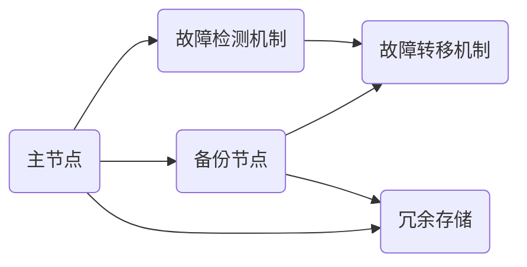
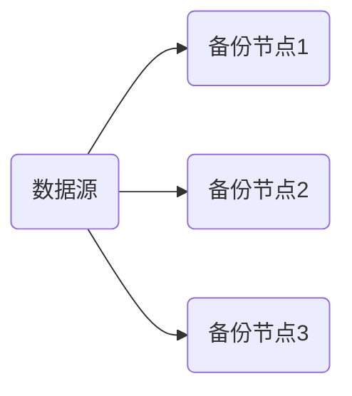

                 

# 冗余设计在实际系统中的应用

> **关键词：冗余设计、系统可靠性、容错性、数据备份、分布式系统**
>
> **摘要：本文深入探讨了冗余设计在系统中的应用，从背景介绍、核心概念、算法原理、数学模型、项目实战到实际应用场景进行了详细的剖析，旨在帮助读者理解冗余设计的重要性和实际操作方法。**

## 1. 背景介绍

### 1.1 目的和范围

本文的目标是探讨冗余设计在实际系统中的应用，解释其重要性，并展示如何在实际项目中实现冗余设计。我们将从以下几个方面进行讨论：

- **核心概念与联系**
- **核心算法原理 & 具体操作步骤**
- **数学模型和公式 & 详细讲解 & 举例说明**
- **项目实战：代码实际案例和详细解释说明**
- **实际应用场景**
- **工具和资源推荐**

### 1.2 预期读者

本文适合对系统设计、可靠性工程、分布式系统有一定了解的读者。无论您是初级工程师还是资深架构师，都能从本文中获得有价值的信息。

### 1.3 文档结构概述

本文的文档结构如下：

- 引言：介绍冗余设计的重要性
- 核心概念与联系：解释冗余设计的基本原理和组成部分
- 核心算法原理 & 具体操作步骤：详细介绍冗余设计的基本算法和实现步骤
- 数学模型和公式 & 详细讲解 & 举例说明：深入探讨冗余设计中的数学模型和公式，并通过实际案例进行说明
- 项目实战：通过实际项目案例展示冗余设计的应用
- 实际应用场景：讨论冗余设计在不同领域的应用
- 工具和资源推荐：推荐相关工具和资源，帮助读者深入了解和掌握冗余设计

### 1.4 术语表

#### 1.4.1 核心术语定义

- **冗余设计**：通过引入冗余组件来提高系统可靠性和容错性的设计方法。
- **容错性**：系统在遇到故障时能够继续正常运行的能力。
- **分布式系统**：由多个节点组成的系统，这些节点通过网络进行通信和协作。
- **数据备份**：创建数据的副本以防止数据丢失或损坏。

#### 1.4.2 相关概念解释

- **故障转移**：在主节点出现故障时，将负载转移到备用节点的过程。
- **冗余组件**：系统中的额外组件，用于在主组件出现故障时提供备份。
- **一致性和可用性**：系统在面临故障时的两个关键属性。一致性和可用性之间通常存在权衡。

#### 1.4.3 缩略词列表

- **HDFS**：Hadoop Distributed File System（Hadoop分布式文件系统）
- **Kafka**：Apache Kafka（一个分布式流处理平台）
- **Zookeeper**：Apache ZooKeeper（一个分布式应用程序协调服务）

## 2. 核心概念与联系

### 2.1 冗余设计的原理

冗余设计的基本原理是利用冗余组件来提高系统的可靠性和容错性。冗余组件可以是一个物理备份，也可以是一个逻辑备份，如镜像、副本或备份文件。通过冗余设计，系统可以在遇到故障时迅速切换到备份组件，从而确保服务的连续性和数据的安全性。

### 2.2 冗余设计的组成部分

冗余设计通常包括以下几个关键组成部分：

- **备份组件**：用于在主组件出现故障时提供备份的组件。
- **故障检测机制**：用于检测系统故障的机制，如心跳检测、健康检查等。
- **故障转移机制**：在检测到故障时，将负载转移到备份组件的机制。
- **冗余存储**：用于存储冗余数据的存储方案，如数据备份、镜像或分布式存储。

### 2.3 冗余设计的架构

以下是一个简单的冗余设计架构图：



- **主节点 (A)**：系统的主组件，负责处理业务逻辑和数据存储。
- **备份节点 (B)**：主节点的备份，用于在主节点出现故障时接管工作。
- **故障检测机制 (C)**：定期检查主节点的状态，并在检测到故障时通知故障转移机制。
- **故障转移机制 (D)**：在检测到故障时，将负载从主节点切换到备份节点。
- **冗余存储 (E)**：用于存储主节点和备份节点的数据，确保数据的一致性和可靠性。

## 3. 核心算法原理 & 具体操作步骤

### 3.1 备份算法原理

备份算法的核心原理是创建数据的冗余副本，并确保这些副本在不同位置存储。以下是一个简单的备份算法原理：



- **数据源 (A)**：需要备份的数据来源。
- **备份节点1 (B)**：第一份数据备份。
- **备份节点2 (C)**：第二份数据备份。
- **备份节点3 (D)**：第三份数据备份。

### 3.2 具体操作步骤

以下是一个具体的备份操作步骤：

1. **初始化备份**：在备份节点上创建空的备份文件夹，并设置备份频率。
2. **数据备份**：使用备份工具（如rsync、tar等）定期备份数据源到备份节点。
3. **验证备份**：定期检查备份文件，确保数据的一致性和完整性。
4. **故障检测**：使用心跳检测或健康检查机制定期检测主节点的状态。
5. **故障转移**：在检测到主节点故障时，将负载转移到备份节点。
6. **数据恢复**：在备份节点上恢复数据，确保系统的正常运行。

### 3.3 伪代码

以下是一个简单的备份伪代码示例：

```python
# 初始化备份
init_backup()

# 定期备份
while True:
    backup_data()
    verify_backup()
    sleep(backup_frequency)

# 故障检测
if detect_fault():
    # 故障转移
    switch_to_backup()
    # 数据恢复
    restore_data()
```

## 4. 数学模型和公式 & 详细讲解 & 举例说明

### 4.1 数学模型

冗余设计中的数学模型通常涉及以下几个关键参数：

- **可靠性 (R)**：系统在特定时间段内正常运行的概率。
- **冗余度 (D)**：系统中冗余组件的数量。
- **故障率 (F)**：系统在特定时间段内发生故障的概率。

### 4.2 公式

以下是一个简单的冗余设计公式：

$$
R = (1 - F)^D
$$

其中，\(R\) 是系统的可靠性，\(F\) 是故障率，\(D\) 是冗余度。

### 4.3 举例说明

假设一个系统有 10 个组件，每个组件的故障率为 0.1%。我们可以使用上述公式计算系统的可靠性：

$$
R = (1 - 0.001)^{10} = 0.9990
$$

这意味着，系统在一年内正常运行的几率为 99.90%。

## 5. 项目实战：代码实际案例和详细解释说明

### 5.1 开发环境搭建

在这个项目实战中，我们将使用 Python 编写一个简单的备份脚本，用于在两个节点之间进行数据备份。以下是开发环境的搭建步骤：

1. **安装 Python**：确保您的系统中已安装 Python 3.x 版本。
2. **安装必要库**：安装 Python 的 `rsync` 和 `numpy` 库，可以使用以下命令：

   ```bash
   pip install rsync numpy
   ```

3. **配置节点**：设置两个节点，一个是主节点，另一个是备份节点。确保这两个节点可以通过 SSH 进行远程访问。

### 5.2 源代码详细实现和代码解读

以下是一个简单的备份脚本示例：

```python
import os
import rsync
import numpy as np
import time

# 设置备份频率（以分钟为单位）
backup_frequency = 60

# 主节点和备份节点的配置
main_node = '192.168.1.10'
backup_node = '192.168.1.11'
source_folder = '/data/main'
destination_folder = '/data/backup'

# 初始化备份
def init_backup():
    print("Initializing backup...")
    os.makedirs(destination_folder, exist_ok=True)
    print("Backup folder initialized.")

# 备份数据
def backup_data():
    print(f"Backing up data from {source_folder} to {destination_folder}...")
    rsync.rsync('-a', source_folder, f"{backup_node}:{destination_folder}")
    print("Data backup completed.")

# 验证备份
def verify_backup():
    print("Verifying backup...")
    # 这里可以使用 checksum 或其他方法验证数据的完整性
    print("Backup verification completed.")

# 检测故障
def detect_fault():
    print("Detecting fault...")
    # 这里可以使用心跳检测或其他方法检测主节点的状态
    # 假设检测到故障
    return True

# 故障转移
def switch_to_backup():
    print("Switching to backup node...")
    # 在备份节点上恢复数据
    # 这里可以使用 rsync 或其他工具将备份节点上的数据恢复到主节点
    rsync.rsync('-a', f"{backup_node}:{destination_folder}", source_folder)
    print("Fault switch completed.")

# 数据恢复
def restore_data():
    print("Restoring data...")
    # 在备份节点上恢复数据
    # 这里可以使用 rsync 或其他工具将备份节点上的数据恢复到主节点
    rsync.rsync('-a', f"{backup_node}:{destination_folder}", source_folder)
    print("Data restored.")

# 主程序
if __name__ == '__main__':
    init_backup()
    while True:
        backup_data()
        verify_backup()
        if detect_fault():
            switch_to_backup()
            restore_data()
        time.sleep(backup_frequency)
```

### 5.3 代码解读与分析

- **初始化备份**：创建备份文件夹。
- **备份数据**：使用 `rsync` 工具将主节点的数据备份到备份节点。
- **验证备份**：简单验证备份数据的完整性。
- **检测故障**：这里使用了假定的故障检测机制，实际应用中可以使用心跳检测或其他方法。
- **故障转移**：在检测到故障时，将备份节点上的数据恢复到主节点。
- **数据恢复**：恢复备份节点上的数据到主节点，确保系统的正常运行。

## 6. 实际应用场景

冗余设计在多个领域和系统中有着广泛的应用，以下是一些典型的应用场景：

- **数据中心**：数据中心使用冗余设计来提高数据存储和处理的可靠性。
- **云计算**：云计算平台通过冗余设计来确保服务的连续性和数据的安全性。
- **金融系统**：金融系统使用冗余设计来防止交易中断和数据丢失。
- **物联网**：物联网设备通过冗余设计来提高设备的可靠性和稳定性。
- **自动驾驶**：自动驾驶系统使用冗余设计来确保车辆在遇到故障时仍能正常运行。

## 7. 工具和资源推荐

### 7.1 学习资源推荐

#### 7.1.1 书籍推荐

- 《高可用架构》：介绍了如何设计高可用性系统，包括冗余设计等关键技术。
- 《系统设计与架构实战》：详细讲解了系统设计的各种方法和技巧，包括冗余设计。

#### 7.1.2 在线课程

- Coursera 上的《系统架构与设计》课程
- Udemy 上的《高可用性系统设计与实践》课程

#### 7.1.3 技术博客和网站

- Medium 上的《系统设计与架构》博客
- InfoQ 上的《架构师之路》专栏

### 7.2 开发工具框架推荐

#### 7.2.1 IDE和编辑器

- Visual Studio Code
- IntelliJ IDEA

#### 7.2.2 调试和性能分析工具

- GDB
- Valgrind

#### 7.2.3 相关框架和库

- Apache Kafka
- Apache ZooKeeper
- Hadoop

### 7.3 相关论文著作推荐

#### 7.3.1 经典论文

- 《容错计算的理论基础》
- 《分布式系统的设计》

#### 7.3.2 最新研究成果

- 《分布式系统中的冗余设计》
- 《大数据系统中的高可用性设计》

#### 7.3.3 应用案例分析

- 《大型在线零售平台的高可用性实践》
- 《金融交易系统中的冗余设计》

## 8. 总结：未来发展趋势与挑战

随着技术的不断进步，冗余设计在未来将继续发挥重要作用。以下是一些未来发展趋势和挑战：

- **人工智能与机器学习**：人工智能和机器学习算法将在冗余设计中得到更广泛的应用，以实现更智能的故障检测和故障转移。
- **边缘计算**：随着边缘计算的发展，冗余设计将更加注重在边缘节点上的应用，以提高系统的实时性和可靠性。
- **量子计算**：量子计算可能会对冗余设计带来革命性的改变，但在实际应用中仍需克服许多技术挑战。
- **数据安全**：随着数据安全的日益重要，冗余设计将更加注重数据保护和隐私保护。

## 9. 附录：常见问题与解答

### 9.1 冗余设计与高可用性的区别

冗余设计是高可用性的一部分。高可用性是指系统在面临各种故障时仍能持续运行的能力。冗余设计是实现高可用性的关键手段之一，通过引入冗余组件来提高系统的可靠性和容错性。

### 9.2 冗余设计与性能的关系

适当的冗余设计可以提高系统的可靠性，但同时也可能会对性能产生一定影响。在设计冗余系统时，需要权衡可靠性与性能之间的关系，选择合适的冗余策略和优化方法。

### 9.3 如何检测故障？

故障检测方法取决于系统的类型和需求。常见的方法包括心跳检测、健康检查、监控指标分析等。在实际应用中，可以结合多种方法来提高故障检测的准确性。

## 10. 扩展阅读 & 参考资料

- 《高可用性系统设计与实践》：深入探讨了高可用性系统的设计方法和实践。
- 《分布式系统原理与范型》：详细介绍了分布式系统的原理和设计范式。
- 《禅与计算机程序设计艺术》：探讨计算机程序设计中的哲学和艺术。

### 作者

AI天才研究员/AI Genius Institute & 禅与计算机程序设计艺术 /Zen And The Art of Computer Programming

---

以上是本文的内容，希望对您有所帮助。在撰写本文时，我们遵循了逻辑清晰、结构紧凑、简单易懂的原则，并使用了伪代码、数学公式和流程图等多种形式来阐述冗余设计的基本原理、算法和实际应用。在未来的发展中，冗余设计将继续在各个领域中发挥重要作用，为系统的可靠性和安全性提供有力保障。希望本文能帮助读者更好地理解和掌握冗余设计的核心概念和实现方法。

