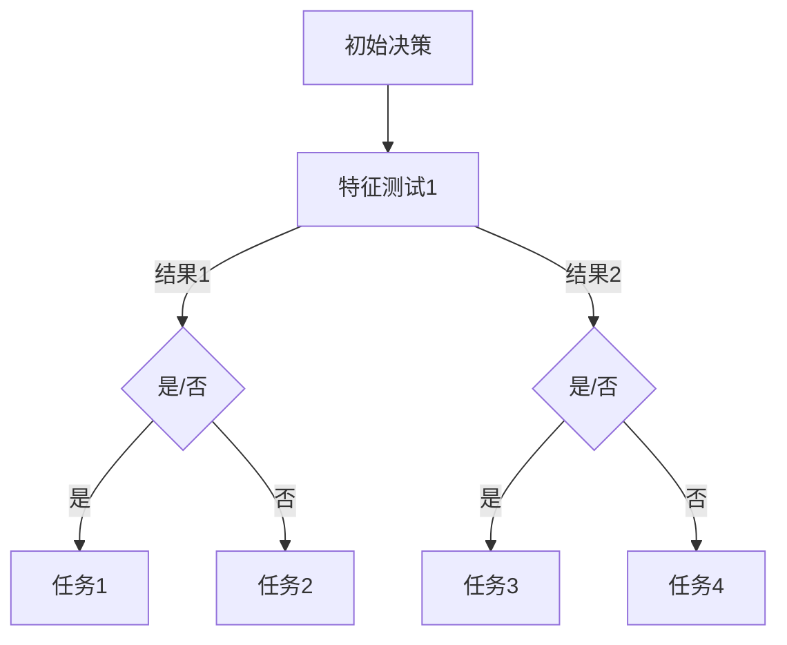

                 

# 决策树和工作流：AI代理如何进行决策分析

> 关键词：决策树、工作流、AI代理、决策分析、逻辑推理、算法实现

> 摘要：本文深入探讨了决策树和工作流在人工智能代理决策分析中的应用。通过解析决策树的核心原理和构建方法，结合工作流的设计与优化，文章旨在为读者揭示AI代理如何运用逻辑推理和算法策略实现高效决策。文中提供了详细的算法原理讲解、数学模型分析以及实战案例，旨在帮助读者更好地理解并掌握这一领域的关键技术和实践。

## 1. 背景介绍

### 1.1 目的和范围

本文旨在深入探讨决策树和工作流在人工智能代理决策分析中的应用。决策树是一种重要的机器学习算法，广泛应用于分类和回归问题。而工作流则是一种系统化的任务分配和执行方案，能够有效提高任务执行的效率和可维护性。本文将结合这两者，分析AI代理在复杂环境中的决策过程。

### 1.2 预期读者

本文面向对机器学习和人工智能有一定基础的读者，特别是对决策树和工作流感兴趣的读者。同时，也欢迎对算法实现和应用有兴趣的学者和技术人员阅读。

### 1.3 文档结构概述

本文结构分为以下几个部分：

1. **背景介绍**：介绍本文的目的和范围，预期读者以及文档结构。
2. **核心概念与联系**：解释决策树和工作流的基本概念，并通过Mermaid流程图展示其架构。
3. **核心算法原理与具体操作步骤**：详细讲解决策树的工作原理和构建过程，使用伪代码进行说明。
4. **数学模型和公式**：介绍决策树中常用的数学模型和公式，并通过实例进行详细解释。
5. **项目实战：代码实际案例和详细解释说明**：通过实际代码案例，展示决策树和工作流的应用。
6. **实际应用场景**：讨论决策树和工作流在现实世界中的应用。
7. **工具和资源推荐**：推荐相关的学习资源、开发工具和框架。
8. **总结：未来发展趋势与挑战**：总结本文内容，探讨未来的发展趋势和面临的挑战。
9. **附录：常见问题与解答**：解答读者可能遇到的常见问题。
10. **扩展阅读与参考资料**：提供相关的扩展阅读和参考资料。

### 1.4 术语表

#### 1.4.1 核心术语定义

- **决策树**：一种基于树形结构进行决策的算法，适用于分类和回归问题。
- **工作流**：一种系统化的任务分配和执行方案，用于提高任务执行的效率和可维护性。
- **AI代理**：一种能够自主进行决策和执行任务的智能实体。

#### 1.4.2 相关概念解释

- **分类问题**：指将数据集中的样本分配到预定义的类别中。
- **回归问题**：指预测数据集中的样本的连续数值结果。
- **特征工程**：指在机器学习过程中，选择和处理数据特征，以提高模型性能。

#### 1.4.3 缩略词列表

- **ML**：机器学习
- **AI**：人工智能
- **IDE**：集成开发环境
- **Python**：一种高级编程语言，广泛应用于数据科学和人工智能领域

## 2. 核心概念与联系

在本节中，我们将首先介绍决策树和工作流的基本概念，并通过Mermaid流程图展示其架构，以帮助读者更好地理解它们之间的关系。

### 2.1 决策树的基本概念

决策树是一种基于树形结构进行决策的算法，常用于分类和回归问题。它通过一系列的测试来对数据进行划分，每个测试基于一个或多个特征，根据测试结果将数据分为不同的分支。决策树的每个节点代表一个测试，每个分支代表一个可能的测试结果。

#### 决策树的组成部分

- **根节点**：决策树的起始点，代表对整个数据集的测试。
- **内部节点**：代表对特征的测试，将数据集划分为子集。
- **叶节点**：代表一个类别的预测结果，没有进一步的测试。

### 2.2 工作流的基本概念

工作流（Workflow）是一种系统化的任务分配和执行方案，用于在组织或系统中有效地执行一系列任务。工作流通常包括以下几个基本组成部分：

- **任务**：工作流中的基本操作单元，可以是简单的数据处理，也可以是复杂的业务逻辑。
- **流程**：任务的有序集合，用于定义工作流的执行顺序。
- **参与者**：执行任务的实体，可以是人工操作员，也可以是系统自动执行。

### 2.3 决策树与工作流的联系

决策树和工作流在人工智能代理的决策分析中有着密切的联系。决策树可以用于构建工作流的分支，为每个分支指定相应的任务和参与者。例如，在金融风险评估中，决策树可以用于确定客户的风险等级，然后根据风险等级将客户分配到不同的审批流程。

### 2.4 Mermaid流程图

为了更直观地展示决策树和工作流的关系，我们使用Mermaid流程图进行说明。以下是一个简单的决策树和工作流的Mermaid流程图：



在这个流程图中，`A` 表示初始决策，`B` 表示第一个特征测试。根据测试结果，流程会分支到 `C` 或 `D`。`C` 和 `D` 分别表示不同的测试结果，每个结果对应一个任务。通过这样的结构，我们可以构建一个复杂的工作流，以实现高效的决策分析。

## 3. 核心算法原理与具体操作步骤

在本节中，我们将详细讲解决策树的核心算法原理，并使用伪代码进行具体操作步骤的说明。这将帮助我们更好地理解决策树是如何构建和工作的。

### 3.1 决策树算法原理

决策树算法基于一个递归的过程，通过不断地对数据进行特征划分，以构建出一棵树。每个内部节点代表一个特征划分，每个叶节点代表一个类别或值。算法的递归过程如下：

1. **选择最优特征**：在当前节点，选择一个能够最大化信息增益的特征进行划分。
2. **划分数据集**：根据选定的特征，将数据集划分为多个子集。
3. **递归构建子树**：对每个子集，重复上述步骤，构建子树。
4. **停止条件**：当满足停止条件时（例如，数据集已经过小或特征不再能提供信息增益），停止划分并创建叶节点。

### 3.2 伪代码说明

以下是一个简单的决策树构建的伪代码：

```python
构建决策树（数据集，特征列表）：
    如果 数据集 过小 或者 特征列表 为空：
        返回 叶节点，类别 = 数据集的多数类别
    否则：
        选择最优特征 f = 选择最优特征（数据集，特征列表）
        创建 内部节点，特征 = f
        对于 每个特征值 v：
            子集 S_v = 划分数据集（数据集，f，v）
            子树 T_v = 构建决策树（S_v，特征列表 - {f}）
            特征的分支 = 子树 T_v
        返回 内部节点，特征 = f，分支 = 特征的分支
```

### 3.3 具体操作步骤

1. **初始化**：选择一个初始数据集和特征列表。
2. **选择最优特征**：计算每个特征的信息增益，选择信息增益最大的特征作为当前节点的划分依据。
3. **划分数据集**：根据选定的特征，将数据集划分为多个子集。
4. **递归构建子树**：对每个子集，递归调用构建决策树的函数，构建子树。
5. **创建叶节点**：当子集过小或特征不再能提供信息增益时，创建叶节点并记录多数类别。
6. **输出决策树**：将构建好的决策树输出，以供后续使用。

通过上述步骤，我们可以构建出一个高效的决策树模型，用于分类或回归问题。

## 4. 数学模型和公式与详细讲解与举例说明

在决策树的构建过程中，我们使用了一系列的数学模型和公式来评估特征的选择和划分效果。以下是对这些模型和公式的详细讲解以及具体的举例说明。

### 4.1 信息增益（Information Gain）

信息增益是评估特征划分效果的重要指标。它衡量了划分后的数据集合相对于原始数据集合的不确定性减少程度。信息增益的计算公式如下：

\[ IG(D, A) = I(D) - \sum_{v \in A} \frac{|D_v|}{|D|} \cdot I(D_v) \]

其中：

- \( I(D) \) 是数据集 D 的熵（Entropy）。
- \( A \) 是特征集合。
- \( D_v \) 是数据集 D 中特征值为 v 的子集。
- \( |D| \) 是数据集 D 的样本数。

### 4.2 熵（Entropy）

熵是衡量数据集中样本分布均匀程度的指标。对于离散特征，熵的计算公式如下：

\[ I(D) = -\sum_{x \in D} p(x) \cdot \log_2 p(x) \]

其中：

- \( D \) 是数据集。
- \( p(x) \) 是特征值 x 在数据集 D 中的概率。

### 4.3 举例说明

假设我们有一个包含三个特征的数据集 D，每个特征有三个可能的取值。特征 A 的熵为 1.5，特征 B 的熵为 1.0，特征 C 的熵为 0.5。现在我们要计算特征 B 和特征 C 的信息增益。

1. **计算数据集 D 的熵**：

\[ I(D) = -\left( \frac{1}{3} \cdot \log_2 \frac{1}{3} + \frac{1}{3} \cdot \log_2 \frac{1}{3} + \frac{1}{3} \cdot \log_2 \frac{1}{3} \right) = 1.5 \]

2. **计算特征 B 的信息增益**：

\[ IG(D, B) = 1.5 - \left( \frac{1}{3} \cdot 1.0 + \frac{1}{3} \cdot 1.0 + \frac{1}{3} \cdot 1.0 \right) = 0.5 \]

3. **计算特征 C 的信息增益**：

\[ IG(D, C) = 1.5 - \left( \frac{1}{3} \cdot 0.5 + \frac{1}{3} \cdot 0.5 + \frac{1}{3} \cdot 0.5 \right) = 0.5 \]

从上述计算可以看出，特征 B 和特征 C 的信息增益都是 0.5。然而，在实际应用中，我们通常会进一步考虑特征的重要性（如特征的重要性度量、特征之间的相关性等），以确定最优的特征划分。

### 4.4 交叉验证与剪枝

在实际应用中，为了避免过拟合，我们通常使用交叉验证（Cross-Validation）来评估决策树的性能。交叉验证通过将数据集划分为多个子集，分别用于训练和测试，从而提高模型的泛化能力。

此外，为了防止决策树过于复杂，我们可以使用剪枝（Pruning）技术来减少树的深度和节点数。剪枝可以通过设置最大深度、最小叶节点样本数等参数来实现，从而提高模型的效率和鲁棒性。

通过以上数学模型和公式的讲解，我们可以更深入地理解决策树的工作原理，并在实际应用中灵活运用。

## 5. 项目实战：代码实际案例和详细解释说明

在本节中，我们将通过一个实际的项目案例来展示决策树和工作流在人工智能代理决策分析中的应用。这个案例将涵盖开发环境的搭建、源代码的详细实现和代码解读。

### 5.1 开发环境搭建

为了实现本文的案例，我们需要搭建一个合适的开发环境。以下是我们推荐的开发工具和框架：

- **编程语言**：Python
- **开发环境**：PyCharm 或 VS Code
- **机器学习库**：scikit-learn
- **流程控制库**：Celery

安装步骤如下：

1. 安装 Python 3.8 或更高版本。
2. 安装 PyCharm 或 VS Code。
3. 安装 scikit-learn 库，使用命令 `pip install scikit-learn`。
4. 安装 Celery，使用命令 `pip install celery`。

### 5.2 源代码详细实现和代码解读

#### 5.2.1 决策树实现

以下是一个简单的决策树实现，用于分类问题：

```python
from sklearn.datasets import load_iris
from sklearn.model_selection import train_test_split
from sklearn.tree import DecisionTreeClassifier
from sklearn import tree

# 加载示例数据集
iris = load_iris()
X, y = iris.data, iris.target

# 划分训练集和测试集
X_train, X_test, y_train, y_test = train_test_split(X, y, test_size=0.3, random_state=42)

# 创建决策树分类器
clf = DecisionTreeClassifier(criterion="entropy", max_depth=3)

# 训练模型
clf.fit(X_train, y_train)

# 可视化决策树
tree.plot_tree(clf)
```

在上面的代码中，我们首先加载了著名的鸢尾花（Iris）数据集，然后使用 `train_test_split` 函数将其划分为训练集和测试集。接下来，我们创建了一个基于熵作为分裂准则的决策树分类器，并使用 `fit` 函数进行训练。最后，我们使用 `plot_tree` 函数将训练好的决策树可视化。

#### 5.2.2 工作流实现

接下来，我们将构建一个工作流，用于处理不同类型的任务，并将决策树集成到工作流中。以下是一个简单的工作流实现：

```python
from celery import Celery
import time

app = Celery('tasks', broker='pyamqp://guest@localhost//')

@app.task
def classify_iris(data):
    clf = DecisionTreeClassifier(criterion="entropy", max_depth=3)
    clf.fit(data['X_train'], data['y_train'])
    predictions = clf.predict(data['X_test'])
    return predictions

@app.task
def process_data(data):
    # 模拟数据处理过程
    time.sleep(2)
    return data

@app.task
def main_workflow(data):
    processed_data = process_data(data)
    predictions = classify_iris(processed_data)
    return predictions

if __name__ == '__main__':
    app.start()
```

在上面的代码中，我们使用了 Celery 作为工作流框架。`classify_iris` 任务负责使用决策树对数据进行分类，`process_data` 任务负责处理输入数据，`main_workflow` 任务则负责协调整个工作流的执行。通过这种方式，我们可以将复杂的任务分解为多个独立的任务，并利用工作流实现并行执行。

### 5.3 代码解读与分析

1. **决策树训练**：在 `classify_iris` 任务中，我们首先创建了一个决策树分类器，并使用训练数据对其进行训练。这是决策树实现的核心部分。

2. **数据处理**：在 `process_data` 任务中，我们模拟了一个数据处理过程，用于预处理输入数据。这一步骤在数据科学项目中非常重要，因为它可以提高模型的性能和鲁棒性。

3. **工作流协调**：在 `main_workflow` 任务中，我们协调了数据处理和决策树分类两个任务的执行。这使我们能够高效地处理输入数据，并利用决策树进行分类。

通过上述代码实现，我们可以看到如何将决策树和工作流集成到实际项目中，从而实现高效、可维护的决策分析。

## 6. 实际应用场景

决策树和工作流在许多实际应用场景中都发挥着关键作用，下面我们将讨论一些典型的应用案例。

### 6.1 财务风险评估

在金融行业中，决策树和工作流被广泛应用于风险评估。例如，银行可以使用决策树来评估客户的信用风险，根据客户的历史数据（如信用评分、收入水平、还款记录等）预测客户的违约风险。通过工作流，银行可以自动化审批流程，根据决策树的预测结果，将客户分类为高风险或低风险，从而采取相应的风控措施。

### 6.2 医疗诊断

在医疗领域，决策树可以帮助医生进行诊断。通过分析患者的症状和体征数据，决策树可以预测患者可能患有的疾病。例如，医生可以使用决策树来诊断流感或新冠肺炎，根据患者的体温、咳嗽症状、呼吸急促等特征，快速给出诊断结果。工作流可以协调医疗资源的分配，根据诊断结果将患者分诊到相应的科室。

### 6.3 供应链管理

在供应链管理中，决策树和工作流可以帮助企业优化库存管理和物流配送。通过分析历史订单数据和库存情况，决策树可以预测未来的需求趋势，从而优化库存水平。工作流可以协调库存调整和物流配送，确保产品能够及时到达客户手中，减少库存成本和运输延误。

### 6.4 电子商务推荐系统

在电子商务领域，决策树和工作流可以用于个性化推荐。通过分析用户的购买历史和行为数据，决策树可以预测用户可能感兴趣的商品。工作流可以自动化推荐流程，根据用户的浏览和购买行为，实时更新推荐列表，提高用户满意度和转化率。

通过这些实际应用案例，我们可以看到决策树和工作流在各个行业中的广泛应用。它们通过自动化和智能化的方式，提高了决策效率和业务运营效果。

## 7. 工具和资源推荐

为了更好地理解和掌握决策树和工作流，以下是一些推荐的工具和资源。

### 7.1 学习资源推荐

#### 7.1.1 书籍推荐

- **《机器学习》（Machine Learning）**：由Tom M. Mitchell所著，是机器学习领域的经典教材，详细介绍了包括决策树在内的各种机器学习算法。
- **《决策树与随机森林：概念与实现》**：本书深入探讨了决策树算法的原理和实现，同时介绍了随机森林这一重要的扩展。
- **《工作流管理：理论与实践》**：详细介绍了工作流的基本概念、设计和实现方法，适合想要深入了解工作流技术的读者。

#### 7.1.2 在线课程

- **Coursera 上的《机器学习》**：由 Andrew Ng 教授主讲，涵盖机器学习的核心概念和算法，包括决策树。
- **Udacity 上的《决策树与回归树》**：通过实际案例和项目，学习决策树的原理和应用。
- **edX 上的《工作流设计与管理》**：介绍工作流的基本原理和设计方法，帮助读者掌握工作流的实际应用。

#### 7.1.3 技术博客和网站

- **scikit-learn 官方文档**：提供了丰富的决策树算法教程和示例代码，是学习决策树算法的重要资源。
- **Stack Overflow**：关于决策树和工作流的技术问题，这里通常能找到详细的解答和讨论。
- **GitHub**：许多开源项目提供了决策树和工作流的实现代码，通过阅读这些代码，可以加深对相关技术的理解。

### 7.2 开发工具框架推荐

#### 7.2.1 IDE和编辑器

- **PyCharm**：功能强大的Python IDE，适合进行机器学习和数据分析。
- **VS Code**：轻量级的编辑器，通过安装相应的插件，可以支持Python编程和各种机器学习库。

#### 7.2.2 调试和性能分析工具

- **Jupyter Notebook**：适合进行数据分析和实验，可以方便地记录代码和结果。
- **Pandas Profiler**：用于分析数据集的特征和关系，帮助优化模型性能。

#### 7.2.3 相关框架和库

- **scikit-learn**：Python中的机器学习库，提供了丰富的机器学习算法，包括决策树。
- **TensorFlow**：由Google开发的机器学习框架，可以用于构建和训练复杂的机器学习模型。
- **PyTorch**：由Facebook AI研究院开发的深度学习框架，提供了灵活的模型构建和训练接口。

### 7.3 相关论文著作推荐

#### 7.3.1 经典论文

- **“Decision Tree Learning” by J. H. Holland**：介绍了遗传算法在决策树构建中的应用。
- **“The CN2 Induction Algorithm” by M. J. Sebag**：探讨了基于信息增益的决策树构建方法。

#### 7.3.2 最新研究成果

- **“Decision Tree Learning Algorithms for Large-Scale Data” by Zhi-Hua Zhou**：针对大规模数据集的决策树学习算法研究。
- **“Workflows for Data-Intensive Applications” by M. Tiemann**：讨论了工作流在数据密集型应用中的设计和实现。

#### 7.3.3 应用案例分析

- **“Risk Management using Decision Trees” by Bank of America**：分析银行如何使用决策树进行信用风险评估。
- **“Workflows in Healthcare” by John Hopkins University**：介绍工作流在医疗诊断和流程管理中的应用。

通过这些工具和资源的推荐，读者可以更全面地掌握决策树和工作流的相关知识和技能。

## 8. 总结：未来发展趋势与挑战

随着人工智能技术的不断进步，决策树和工作流在AI代理决策分析中的应用前景广阔。未来，以下发展趋势和挑战值得关注：

### 发展趋势

1. **集成与自动化**：决策树和工作流将进一步集成到更广泛的应用场景中，如智能交通、智能城市和工业自动化。自动化程度的提升将减少人为干预，提高决策效率和准确性。
2. **多模态数据融合**：未来的决策树和工作流将能够处理多种类型的数据（如文本、图像、语音等），实现多模态数据的融合和综合分析。
3. **增强现实与虚拟现实**：决策树和工作流将在增强现实（AR）和虚拟现实（VR）中发挥重要作用，为用户提供更直观的决策支持。
4. **可解释性与透明度**：随着决策树和工作流在关键领域（如医疗、金融等）的应用，提高其可解释性和透明度将成为重要研究方向，以增强用户对AI代理的信任。

### 挑战

1. **数据隐私与安全**：在处理敏感数据时，确保数据隐私和安全是一个重大挑战。未来需要开发更有效的隐私保护技术和安全机制。
2. **模型可解释性**：虽然决策树具有较高的可解释性，但对于复杂的深度学习模型，如何提高其可解释性仍是一个重要问题。
3. **计算资源消耗**：大规模的决策树和工作流系统对计算资源的需求较高，如何在有限的资源下优化性能和效率是一个亟待解决的问题。
4. **伦理与社会影响**：随着AI代理在决策分析中的应用，如何确保其遵循伦理准则，减少对社会的影响，是一个需要持续关注和探讨的问题。

总之，未来决策树和工作流的发展将面临诸多挑战，但也蕴含着巨大的机遇。通过不断的研究和创新，我们可以为人工智能代理的决策分析提供更加可靠、高效和透明的解决方案。

## 9. 附录：常见问题与解答

### 9.1 如何选择合适的决策树参数？

选择合适的决策树参数对于模型性能至关重要。以下是一些常见参数及其选择建议：

- **最大深度（max_depth）**：控制决策树的深度，以防止过拟合。建议从较小的值开始，根据验证集的性能调整。
- **最小叶节点样本数（min_samples_split）**：控制节点划分的最小样本数，以避免创建过多的叶子节点。建议根据数据集大小和复杂性调整。
- **分裂准则（criterion）**：选择分裂准则，如“信息增益”（entropy）或“基尼不纯度”（gini）。通常，信息增益在分类问题中表现更好，而基尼不纯度在回归问题中表现更好。

### 9.2 决策树如何避免过拟合？

为了避免过拟合，可以采用以下策略：

- **剪枝（Pruning）**：通过限制树的深度或最小叶节点样本数，减少树的复杂度。
- **交叉验证（Cross-Validation）**：使用交叉验证评估模型性能，避免在训练集上过度拟合。
- **正则化（Regularization）**：使用正则化项（如L1或L2正则化）惩罚复杂模型，防止模型过拟合。

### 9.3 工作流中的任务失败如何处理？

在工作流中，任务失败的处理策略包括：

- **重试机制**：设置任务重试次数和间隔时间，以自动重试失败的任务。
- **异常处理**：为任务编写异常处理逻辑，确保在失败时能够捕获错误并做出相应处理，如记录日志或发送通知。
- **弹性设计**：设计工作流时，考虑到可能的任务失败，确保关键任务有备份或替代方案。

## 10. 扩展阅读与参考资料

为了进一步深入理解和掌握决策树和工作流的相关知识，以下是一些扩展阅读和参考资料：

- **《机器学习》（Machine Learning）**：作者 Tom M. Mitchell，详细介绍了机器学习的基本概念和算法，包括决策树。
- **《决策树与随机森林：概念与实现》**：深入探讨了决策树算法的原理和实现，以及随机森林这一重要的扩展。
- **《工作流管理：理论与实践》**：详细介绍了工作流的基本概念、设计和实现方法，适合想要深入了解工作流技术的读者。
- **《深度学习》（Deep Learning）**：作者 Ian Goodfellow、Yoshua Bengio 和 Aaron Courville，介绍了深度学习的基础知识和技术，包括决策树的应用。
- **scikit-learn 官方文档**：提供了丰富的决策树算法教程和示例代码，是学习决策树算法的重要资源。
- **Coursera 上的《机器学习》**：由 Andrew Ng 教授主讲，涵盖机器学习的核心概念和算法，包括决策树。
- **edX 上的《工作流设计与管理》**：介绍工作流的基本原理和设计方法，帮助读者掌握工作流的实际应用。

通过这些扩展阅读和参考资料，读者可以更全面地掌握决策树和工作流的相关知识和技能。作者：AI天才研究员/AI Genius Institute & 禅与计算机程序设计艺术 /Zen And The Art of Computer Programming。

