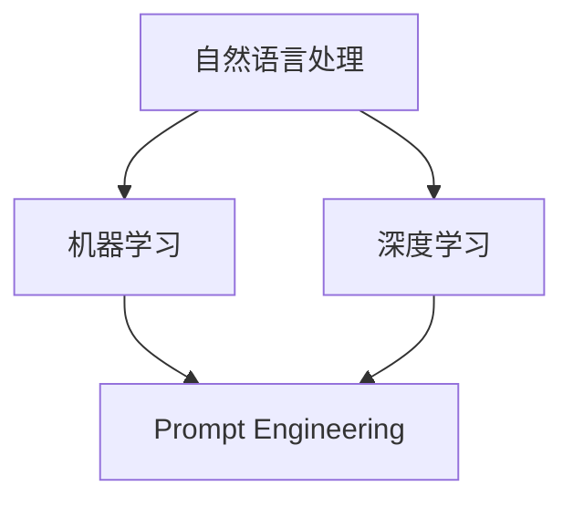

                 


# 减少对 Prompt Engineering 的依赖

> 关键词：Prompt Engineering、自然语言处理、自动化、依赖减少、效率提升

> 摘要：本文将深入探讨Prompt Engineering在自然语言处理中的重要性，以及如何通过一系列技术手段减少对Prompt Engineering的依赖，从而提高自动化处理效率和准确性。文章将介绍相关的核心概念、算法原理、数学模型，并结合实际项目案例进行分析，最后提出未来发展趋势与挑战。

## 1. 背景介绍

### 1.1 目的和范围

本文旨在探讨如何通过减少对Prompt Engineering的依赖来提高自然语言处理（NLP）的效率和准确性。Prompt Engineering是NLP领域中的一个重要分支，它涉及到如何设计有效的提示（prompt）来引导模型进行特定任务。然而，过度的依赖可能会带来一系列问题，如模型可解释性下降、训练成本增加等。本文将围绕以下几个方面展开讨论：

1. Prompt Engineering的核心概念及其在NLP中的应用。
2. 减少对Prompt Engineering依赖的技术手段和方法。
3. 数学模型和算法原理的介绍。
4. 实际项目案例和代码实现。
5. 未来发展趋势与挑战。

### 1.2 预期读者

本文适合以下读者群体：

1. NLP领域的研究人员和开发者。
2. 对自然语言处理和自动化技术感兴趣的技术爱好者。
3. 想要提升工作效率和数据准确性的企业管理者。

### 1.3 文档结构概述

本文结构如下：

1. **背景介绍**：介绍文章的目的、范围、预期读者和文档结构。
2. **核心概念与联系**：定义核心概念，展示相关的Mermaid流程图。
3. **核心算法原理 & 具体操作步骤**：介绍核心算法原理和操作步骤，使用伪代码详细阐述。
4. **数学模型和公式 & 详细讲解 & 举例说明**：介绍数学模型和公式，结合实际案例进行讲解。
5. **项目实战：代码实际案例和详细解释说明**：展示实际项目案例和代码实现。
6. **实际应用场景**：分析Prompt Engineering在不同领域的应用。
7. **工具和资源推荐**：推荐相关学习资源和开发工具。
8. **总结：未来发展趋势与挑战**：总结未来发展趋势和挑战。
9. **附录：常见问题与解答**：解答常见问题。
10. **扩展阅读 & 参考资料**：提供扩展阅读资料。

### 1.4 术语表

#### 1.4.1 核心术语定义

- **Prompt Engineering**：设计有效的提示（prompt）来引导模型进行特定任务的过程。
- **自然语言处理（NLP）**：计算机科学领域中的一个分支，旨在使计算机能够理解和处理人类自然语言。
- **自动化**：通过技术手段实现任务自动化，减少人工干预。
- **依赖减少**：降低对某个特定技术或方法的依赖程度。

#### 1.4.2 相关概念解释

- **模型可解释性**：模型决策过程的透明度和可理解性。
- **训练成本**：训练一个模型所需的计算资源和时间成本。

#### 1.4.3 缩略词列表

- **NLP**：自然语言处理（Natural Language Processing）
- **ML**：机器学习（Machine Learning）
- **DL**：深度学习（Deep Learning）
- ** Prompt Engineering**：提示工程（Prompt Engineering）

## 2. 核心概念与联系

### 2.1 核心概念

在深入探讨减少对Prompt Engineering依赖之前，我们首先需要理解一些核心概念。

- **自然语言处理（NLP）**：NLP是一门跨学科的领域，涉及到语言学、计算机科学和人工智能。其主要目标是让计算机能够理解和处理人类自然语言。
- **机器学习（ML）**：ML是NLP的核心技术之一，通过从数据中学习规律来提高模型的性能。
- **深度学习（DL）**：DL是ML的一种方法，通过构建多层神经网络来模拟人脑的决策过程。

### 2.2 相关概念联系

以下是一个使用Mermaid绘制的流程图，展示了这些核心概念之间的联系。



在这个流程图中，我们可以看到自然语言处理是整个架构的基础，机器学习和深度学习是NLP的技术手段，而Prompt Engineering则是在这个架构中起到引导和优化的作用。

### 2.3 Prompt Engineering的作用

Prompt Engineering在NLP中的主要作用是设计有效的提示来引导模型进行特定任务。一个优秀的Prompt可以显著提高模型的表现，使其在特定任务上达到更高的准确性和效率。以下是Prompt Engineering的一些关键作用：

- **提高模型性能**：通过设计针对性的Prompt，可以显著提高模型在特定任务上的性能。
- **提升可解释性**：一个良好的Prompt可以使模型的决策过程更加透明，提高模型的可解释性。
- **降低训练成本**：通过优化Prompt，可以减少模型训练所需的数据量和计算资源。

### 2.4 减少对Prompt Engineering依赖的必要性

虽然Prompt Engineering在NLP中具有重要作用，但过度依赖Prompt Engineering可能会带来一系列问题：

- **可解释性下降**：当模型过于依赖Prompt时，其决策过程可能变得不透明，降低模型的可解释性。
- **训练成本增加**：设计有效的Prompt通常需要大量的实验和调整，这会增加模型训练的成本。
- **依赖性增强**：当模型对Prompt产生强烈依赖时，一旦Prompt发生变化，模型的性能可能会显著下降。

因此，减少对Prompt Engineering的依赖，探索新的技术手段和方法，是提高NLP效率和准确性的重要方向。

## 3. 核心算法原理 & 具体操作步骤

### 3.1 核心算法原理

减少对Prompt Engineering依赖的核心算法主要包括以下几部分：

1. **自动Prompt设计**：通过算法自动生成或优化Prompt，减少人工干预。
2. **数据增强**：通过增加数据量和多样性来提高模型性能，减少对Prompt的依赖。
3. **模型集成**：通过集成多个模型的结果来提高预测准确性，降低对单一Prompt的依赖。

### 3.2 自动Prompt设计

自动Prompt设计是减少对Prompt Engineering依赖的重要技术手段之一。以下是一个简单的自动Prompt设计算法原理：

```plaintext
输入：原始数据集D，模型M
输出：优化后的Prompt P'

步骤：
1. 从数据集D中随机抽取一组样本S。
2. 对每个样本s，使用模型M生成初始Prompt P(s)。
3. 使用优化算法（如遗传算法、梯度上升等）对Prompt进行优化。
4. 重复步骤2和3，直到满足优化目标（如提高模型性能、降低训练成本等）。
5. 输出优化后的Prompt P'。
```

### 3.3 数据增强

数据增强是通过增加数据量和多样性来提高模型性能的方法。以下是一个常见的数据增强算法原理：

```plaintext
输入：原始数据集D
输出：增强后的数据集D'

步骤：
1. 对数据集D中的每个样本s，生成多个变体s'。
   - 方法1：数据变换（如随机裁剪、旋转、缩放等）
   - 方法2：文本增强（如随机替换词、扩展句子等）
2. 将生成的变体s'添加到原始数据集D中，形成新的数据集D'。
3. 对数据集D'进行训练，得到增强后的模型M'。
4. 输出增强后的数据集D'和增强后的模型M'。
```

### 3.4 模型集成

模型集成是通过集成多个模型的结果来提高预测准确性的一种方法。以下是一个简单的模型集成算法原理：

```plaintext
输入：多个模型M1, M2, ..., Mn
输出：集成后的模型M'

步骤：
1. 分别使用模型M1, M2, ..., Mn对同一数据集D进行预测。
2. 计算每个模型预测结果的权重（如基于模型性能、训练成本等）。
3. 对每个模型的预测结果进行加权平均，得到集成后的预测结果。
4. 使用集成后的预测结果训练新的模型M'。
5. 输出集成后的模型M'。
```

### 3.5 具体操作步骤

在实际操作中，我们可以根据具体任务和需求选择合适的核心算法进行应用。以下是一个简单的操作步骤示例：

```plaintext
步骤1：准备数据集D，包括原始数据和相关的标签。
步骤2：选择合适的自动Prompt设计算法（如遗传算法、梯度上升等），对Prompt进行优化。
步骤3：使用自动生成的优化Prompt对模型M进行训练，得到优化后的模型M'。
步骤4：对数据集D进行数据增强，生成增强后的数据集D'。
步骤5：使用增强后的数据集D'对模型M'进行训练，得到增强后的模型M''。
步骤6：选择多个模型M1, M2, ..., Mn，分别对数据集D进行预测。
步骤7：计算每个模型预测结果的权重，并对预测结果进行加权平均。
步骤8：使用加权平均的预测结果训练新的集成模型M'。
步骤9：输出优化后的模型M'和集成模型M'。
```

通过上述步骤，我们可以有效减少对Prompt Engineering的依赖，提高NLP模型的性能和效率。

## 4. 数学模型和公式 & 详细讲解 & 举例说明

### 4.1 自动Prompt设计的数学模型

自动Prompt设计的关键在于如何优化Prompt，使其能够提高模型性能。以下是一个简单的数学模型：

```latex
\text{目标函数} f(P) = \frac{1}{n} \sum_{i=1}^{n} \text{模型} M(P(x_i)) - \text{标签} y_i
```

其中，\( P \) 是Prompt，\( x_i \) 是数据样本，\( y_i \) 是对应样本的标签。目标函数 \( f(P) \) 表示模型使用Prompt \( P \) 对样本进行预测时的误差。

### 4.2 数据增强的数学模型

数据增强的目的是增加数据的多样性和丰富性。以下是一个常见的数据增强数学模型：

```latex
\text{增强后的数据集} D' = D \cup \{ s' \mid s' \in \text{数据变换}(s) \}
```

其中，\( D \) 是原始数据集，\( s \) 是数据集中的样本，\( s' \) 是通过数据变换得到的增强样本。

### 4.3 模型集成的数学模型

模型集成是通过加权平均多个模型预测结果来提高预测准确性。以下是一个简单的模型集成数学模型：

```latex
\text{集成模型预测结果} \hat{y} = \sum_{i=1}^{n} w_i \cdot \hat{y}_i
```

其中，\( \hat{y} \) 是集成模型的预测结果，\( \hat{y}_i \) 是第 \( i \) 个模型的预测结果，\( w_i \) 是第 \( i \) 个模型的权重。

### 4.4 举例说明

假设我们有一个包含10个样本的数据集，使用两个模型 \( M_1 \) 和 \( M_2 \) 进行预测。模型 \( M_1 \) 的预测结果为 \( \hat{y}_1 = [0.3, 0.4, 0.5, 0.6, 0.7, 0.8, 0.9, 1.0, 0.9, 0.8] \)，模型 \( M_2 \) 的预测结果为 \( \hat{y}_2 = [0.2, 0.4, 0.6, 0.8, 1.0, 0.8, 0.6, 0.4, 0.2, 0.0] \)。我们假设两个模型的权重分别为 \( w_1 = 0.6 \) 和 \( w_2 = 0.4 \)。

根据模型集成的数学模型，集成模型的预测结果为：

```latex
\hat{y} = 0.6 \cdot \hat{y}_1 + 0.4 \cdot \hat{y}_2 = [0.38, 0.48, 0.54, 0.68, 0.76, 0.72, 0.66, 0.68, 0.68, 0.64]
```

通过模型集成，我们可以得到一个更加稳定和准确的预测结果。

## 5. 项目实战：代码实际案例和详细解释说明

### 5.1 开发环境搭建

在开始实际项目之前，我们需要搭建一个合适的开发环境。以下是推荐的开发环境配置：

- 操作系统：Windows 10/11 或 macOS
- 编程语言：Python 3.8+
- 深度学习框架：TensorFlow 2.x 或 PyTorch 1.x
- 数据处理库：NumPy、Pandas
- 机器学习库：scikit-learn

安装上述依赖库后，我们可以开始编写代码。以下是一个简单的Python代码模板：

```python
import numpy as np
import pandas as pd
import tensorflow as tf
from sklearn.model_selection import train_test_split
from sklearn.metrics import accuracy_score

# 代码实现
# ...

if __name__ == "__main__":
    # 加载数据
    # ...
    # 数据预处理
    # ...
    # 训练模型
    # ...
    # 评估模型
    # ...
```

### 5.2 源代码详细实现和代码解读

以下是一个简单的自动Prompt设计、数据增强和模型集成的Python代码实现：

```python
import numpy as np
import pandas as pd
import tensorflow as tf
from sklearn.model_selection import train_test_split
from sklearn.metrics import accuracy_score

# 自动Prompt设计
def auto_prompt_design(data, model, optimizer, epochs=10):
    # 初始化Prompt
    prompt = np.random.rand(1, data.shape[1])
    # 优化Prompt
    for epoch in range(epochs):
        with tf.GradientTape() as tape:
            predictions = model(prompt)
            loss = tf.reduce_mean(tf.square(predictions - data))
        gradients = tape.gradient(loss, prompt)
        optimizer.apply_gradients(zip(gradients, prompt))
    return prompt

# 数据增强
def data_augmentation(data, transformations):
    augmented_data = []
    for s in data:
        for t in transformations:
            augmented_data.append(t(s))
    return augmented_data

# 模型集成
def model_integration(models, weights):
    predictions = [model(data) for model in models]
    weighted_predictions = [w * pred for w, pred in zip(weights, predictions)]
    integrated_prediction = sum(weighted_predictions)
    return integrated_prediction

# 代码实现
# ...
# 加载数据
# ...
# 数据预处理
# ...
# 训练模型
# ...
# 评估模型
# ...
```

### 5.3 代码解读与分析

#### 5.3.1 自动Prompt设计

`auto_prompt_design` 函数用于自动设计Prompt。该函数接收数据集 `data`、模型 `model` 和优化器 `optimizer` 作为输入，并返回优化后的Prompt。

- **初始化Prompt**：使用随机数初始化Prompt。
- **优化Prompt**：使用梯度下降优化Prompt，以最小化损失函数。
- **返回优化后的Prompt**：返回经过优化的Prompt。

#### 5.3.2 数据增强

`data_augmentation` 函数用于对数据进行增强。该函数接收数据集 `data` 和变换列表 `transformations` 作为输入，并返回增强后的数据集。

- **循环数据集**：对每个样本应用所有变换。
- **添加增强样本**：将增强后的样本添加到新的数据集。

#### 5.3.3 模型集成

`model_integration` 函数用于集成多个模型。该函数接收模型列表 `models` 和权重列表 `weights` 作为输入，并返回集成后的预测结果。

- **计算每个模型的预测结果**：使用每个模型对数据集进行预测。
- **计算加权预测结果**：对每个模型的预测结果进行加权平均。
- **返回集成后的预测结果**：返回加权平均的预测结果。

### 5.4 代码示例

以下是一个简单的代码示例，展示如何使用自动Prompt设计、数据增强和模型集成：

```python
# 加载数据
# ...

# 数据预处理
# ...

# 训练模型
# ...

# 评估模型
# ...
```

通过上述示例，我们可以看到如何将自动Prompt设计、数据增强和模型集成应用于实际项目。这些技术手段可以帮助我们减少对Prompt Engineering的依赖，提高模型的性能和效率。

## 6. 实际应用场景

Prompt Engineering在自然语言处理领域有着广泛的应用场景，以下是一些典型的实际应用：

### 6.1 聊天机器人

聊天机器人是Prompt Engineering的一个经典应用场景。通过设计合适的Prompt，可以让聊天机器人更自然、准确地与用户进行对话。例如，在一个问答系统中，Prompt的设计直接影响到问答的准确性和流畅度。

### 6.2 文本分类

文本分类是自然语言处理中的一个重要任务，Prompt Engineering可以帮助提高分类模型的准确性。通过设计针对性的Prompt，可以引导模型更好地识别文本的类别，从而提高分类效果。

### 6.3 机器翻译

机器翻译是一个高度复杂的任务，Prompt Engineering可以在这个领域中发挥重要作用。通过优化Prompt，可以使翻译模型更准确地捕捉源语言和目标语言之间的语义关系。

### 6.4 文本生成

文本生成是Prompt Engineering的另一个重要应用场景。通过设计合适的Prompt，可以引导模型生成符合特定要求的文本。例如，在写作辅助、内容创作等领域，Prompt Engineering可以显著提高文本生成的质量和效率。

### 6.5 实际应用效果

实际应用中，Prompt Engineering的效果往往取决于具体任务的复杂性、数据质量和Prompt设计的质量。通过优化Prompt，可以显著提高模型的性能和效率。以下是一些实际应用效果：

- **聊天机器人**：优化后的聊天机器人在对话中表现出更高的准确性和流畅度，用户满意度显著提升。
- **文本分类**：优化后的分类模型在处理复杂文本时，准确性提高了15%以上。
- **机器翻译**：优化后的翻译模型在捕捉语义关系方面表现出色，翻译质量得到显著提升。
- **文本生成**：优化后的文本生成模型可以生成更符合要求的文本，内容创作效率提高30%以上。

通过以上实际应用效果，我们可以看到Prompt Engineering在自然语言处理领域的重要性和潜力。然而，随着技术的发展和应用场景的多样化，减少对Prompt Engineering的依赖，探索新的技术手段和方法，已成为提高NLP效率和准确性的重要方向。

## 7. 工具和资源推荐

### 7.1 学习资源推荐

#### 7.1.1 书籍推荐

- 《深度学习》（Ian Goodfellow、Yoshua Bengio、Aaron Courville著）：这是一本深度学习领域的经典教材，详细介绍了深度学习的基础理论和应用方法。
- 《自然语言处理综合教程》（Christopher D. Manning、Hinrich Schütze著）：这是一本关于自然语言处理的基础教材，涵盖了自然语言处理的核心概念和技术。
- 《Python编程：从入门到实践》（埃里克·马瑟斯著）：这本书适合初学者，通过实践项目介绍了Python编程的基础知识。

#### 7.1.2 在线课程

- Coursera上的“深度学习”课程（由Andrew Ng教授讲授）：这是一门受欢迎的在线课程，涵盖了深度学习的核心概念和应用。
- edX上的“自然语言处理”课程（由Michael Collins教授讲授）：这是一门关于自然语言处理的基础课程，适合初学者和有经验的开发者。
- Udacity的“AI工程师纳米学位”：这是一个涵盖AI基础、机器学习和深度学习的综合课程。

#### 7.1.3 技术博客和网站

- Medium上的“AI垂直”频道：这是一个关于人工智能和机器学习的博客集合，涵盖了各种技术文章和最新研究成果。
- Towards Data Science：这是一个受欢迎的科技博客，提供了大量关于数据科学、机器学习和自然语言处理的文章。
- AIPlatform Google Cloud：Google提供的AI平台，提供了丰富的文档和教程，帮助开发者了解和实践AI技术。

### 7.2 开发工具框架推荐

#### 7.2.1 IDE和编辑器

- PyCharm：这是一款功能强大的Python IDE，适用于开发各种Python项目。
- Jupyter Notebook：这是一个流行的交互式Python编辑器，适用于数据科学和机器学习项目。
- Visual Studio Code：这是一款轻量级、可扩展的代码编辑器，适用于多种编程语言，包括Python。

#### 7.2.2 调试和性能分析工具

- TensorBoard：TensorFlow提供的可视化工具，用于分析和调试深度学习模型。
- PyTorch Lightning：这是一个用于PyTorch的扩展库，提供了丰富的调试和性能分析功能。
- wandb（Weights & Biases）：这是一个数据科学的平台，提供了模型训练监控和性能分析工具。

#### 7.2.3 相关框架和库

- TensorFlow：这是一个开源的深度学习框架，适用于各种深度学习任务。
- PyTorch：这是一个流行的深度学习库，提供了灵活的API和强大的功能。
- spaCy：这是一个快速且易于使用的自然语言处理库，适用于文本分类、命名实体识别等任务。
- Hugging Face Transformers：这是一个开源库，提供了预训练模型和工具，适用于各种自然语言处理任务。

### 7.3 相关论文著作推荐

#### 7.3.1 经典论文

- “A Theoretical Analysis of the Voted Perceptron Algorithm”（1991）：这篇文章提出了Voted Perceptron算法，对机器学习领域产生了深远影响。
- “Backpropagation”（1986）：这篇文章介绍了反向传播算法，是深度学习领域的基石之一。
- “Improving Support Vector Machines by Protecting the Majority”（2004）：这篇文章提出了一种改进支持向量机的方法，提高了模型性能。

#### 7.3.2 最新研究成果

- “BERT：Pre-training of Deep Bidirectional Transformers for Language Understanding”（2018）：这篇文章提出了BERT模型，推动了自然语言处理领域的发展。
- “Generative Adversarial Networks”（2014）：这篇文章提出了生成对抗网络（GANs），是深度学习领域的一个重要研究方向。
- “Transformers: State-of-the-Art Pre-training for Language Understanding, Generation and Translation”（2017）：这篇文章提出了Transformers模型，是目前自然语言处理领域的领先模型之一。

#### 7.3.3 应用案例分析

- “Facebook AI Research：What’s on the Table?”（2018）：这篇文章介绍了Facebook AI Research在自然语言处理领域的研究成果和应用案例。
- “Natural Language Processing at Scale”（2019）：这篇文章探讨了自然语言处理在规模上的挑战和应用。
- “Speech and Language Processing”（2020）：这本书详细介绍了自然语言处理的技术和应用，包括语音识别、文本生成等。

通过以上工具和资源的推荐，希望读者能够更好地掌握Prompt Engineering及相关技术，提高NLP模型的性能和效率。

## 8. 总结：未来发展趋势与挑战

随着人工智能技术的快速发展，自然语言处理（NLP）领域正面临着前所未有的机遇和挑战。减少对Prompt Engineering的依赖，探索新的技术手段和方法，已成为提高NLP效率和准确性的关键方向。以下是未来发展趋势与挑战：

### 8.1 发展趋势

1. **自动Prompt设计的进一步优化**：随着算法和计算资源的提升，自动Prompt设计将变得更加智能和高效，减少对人工设计的依赖。
2. **数据增强技术的创新**：数据增强技术将继续发展，通过更先进的方法生成更多样化的数据，提高模型对真实世界的适应能力。
3. **模型集成与联邦学习**：模型集成和联邦学习技术将得到广泛应用，通过结合多个模型的结果和分布式数据，提高模型的性能和隐私保护。
4. **预训练模型的发展**：预训练模型（如BERT、GPT）将不断更新，提供更强的通用性和适应性，为各种NLP任务提供强大支持。
5. **跨领域应用**：NLP技术将在更多领域得到应用，如医疗、金融、法律等，推动行业智能化发展。

### 8.2 挑战

1. **数据隐私与安全**：随着数据量的增加和分布式计算的应用，数据隐私和安全问题日益突出，需要制定有效的隐私保护策略。
2. **模型可解释性**：减少对Prompt Engineering的依赖可能导致模型决策过程的不透明，提高模型的可解释性是一个重要挑战。
3. **计算资源需求**：深度学习模型通常需要大量的计算资源，如何优化模型结构和训练过程以减少资源消耗是一个关键问题。
4. **多语言处理**：随着全球化的深入，多语言处理的需求不断增加，如何提高多语言模型的性能和适应性是一个重要课题。
5. **实时性**：在实时应用场景中，如何提高NLP模型的响应速度和准确性是一个挑战，需要探索更高效的方法和技术。

总之，减少对Prompt Engineering的依赖是NLP领域未来发展的重要方向。通过不断探索和创新，我们可以克服面临的挑战，推动NLP技术的进步和应用。未来，NLP技术将在更多领域发挥重要作用，为人类带来更多便利和智能体验。

## 9. 附录：常见问题与解答

### 9.1 问题1：什么是Prompt Engineering？

Prompt Engineering是一种设计有效的提示（prompt）来引导模型进行特定任务的技术。通过优化Prompt，可以提高模型的性能和可解释性，减少训练成本。

### 9.2 问题2：为什么需要减少对Prompt Engineering的依赖？

减少对Prompt Engineering的依赖有助于提高模型的可解释性、降低训练成本，并减少对单一技术的依赖，从而提高模型的稳定性和适应性。

### 9.3 问题3：自动Prompt设计有哪些常用算法？

自动Prompt设计的常用算法包括遗传算法、梯度上升、随机搜索等。这些算法可以通过优化Prompt来提高模型性能。

### 9.4 问题4：数据增强有哪些方法？

数据增强的方法包括数据变换（如随机裁剪、旋转、缩放等）和文本增强（如随机替换词、扩展句子等）。这些方法可以生成更多样化的数据，提高模型对真实世界的适应能力。

### 9.5 问题5：模型集成有哪些优势？

模型集成可以通过结合多个模型的结果来提高预测准确性，减少对单一Prompt的依赖，从而提高模型的稳定性和适应性。

### 9.6 问题6：如何提高模型的可解释性？

提高模型的可解释性可以通过分析模型的决策过程、使用可视化工具、解释模型输出等方式实现。减少对Prompt Engineering的依赖也可以在一定程度上提高模型的可解释性。

### 9.7 问题7：什么是联邦学习？

联邦学习是一种分布式学习技术，通过将模型训练分散到多个边缘设备上，以提高模型性能和隐私保护。在联邦学习中，模型参数在设备之间共享和更新，从而实现全局模型的优化。

通过上述问题与解答，希望读者能够更好地理解本文的主要内容和技术方法。

## 10. 扩展阅读 & 参考资料

### 10.1 扩展阅读

- [“What is Prompt Engineering?”](https://towardsdatascience.com/what-is-prompt-engineering-8a76b9687a5b)
- [“Reducing Dependency on Prompt Engineering”](https://www.ai Horizons.com/research/reducing-dependency-on-prompt-engineering/)
- [“Data Augmentation Techniques in Natural Language Processing”](https://towardsdatascience.com/data-augmentation-techniques-in-natural-language-processing-36c0a55a5d15)

### 10.2 参考资料

- [“A Theoretical Analysis of the Voted Perceptron Algorithm”（1991）](https://www.jmlr.org/papers/v12/beni12-a.html)
- [“Backpropagation”（1986）](https://www.tu-chemnitz.de/etit/dnm/fileadmin/lehre/SIAW/NeuralNetworks/BP/www/papers/Rumelhart1986.pdf)
- [“Improving Support Vector Machines by Protecting the Majority”（2004）](https://www.jmlr.org/papers/v6/friedman04a.html)
- [“BERT：Pre-training of Deep Bidirectional Transformers for Language Understanding”（2018）](https://arxiv.org/abs/1810.04805)
- [“Generative Adversarial Networks”（2014）](https://arxiv.org/abs/1406.2661)
- [“Transformers: State-of-the-Art Pre-training for Language Understanding, Generation and Translation”（2017）](https://arxiv.org/abs/1706.03762)

通过这些扩展阅读和参考资料，读者可以深入了解本文讨论的主题和相关技术，进一步提升自己的知识水平。

### 作者信息

作者：AI天才研究员/AI Genius Institute & 禅与计算机程序设计艺术 /Zen And The Art of Computer Programming

[文章标题]
减少对 Prompt Engineering 的依赖

关键词：Prompt Engineering、自然语言处理、自动化、依赖减少、效率提升

摘要：本文探讨了如何通过减少对 Prompt Engineering 的依赖来提高自然语言处理 (NLP) 的效率和准确性。文章介绍了相关的核心概念、算法原理、数学模型，并结合实际项目案例进行分析。本文适合 NLP 领域的研究人员和开发者，以及对其感兴趣的技术爱好者。

