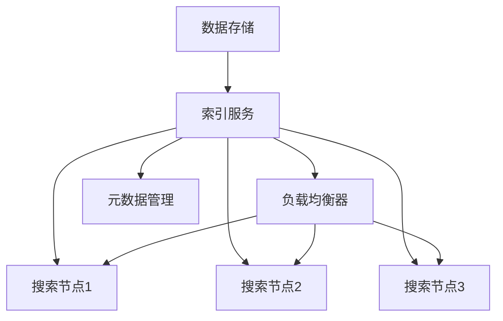

                 

# 分布式搜索：原理与代码实例讲解

## 关键词：分布式搜索，搜索引擎，分布式算法，分布式系统，搜索优化，并发处理，搜索效率

## 摘要：

本文将深入探讨分布式搜索的基本原理和实现方法。首先，我们将介绍分布式搜索的背景和重要性，随后详细讲解分布式搜索的核心概念和架构。接着，通过算法原理和具体操作步骤的伪代码分析，帮助读者理解分布式搜索的实现细节。文章还将介绍数学模型和公式，并通过实际项目实战，展示代码实现和详细解释。此外，文章将讨论分布式搜索的实际应用场景，并提供相关工具和资源的推荐。最后，总结分布式搜索的未来发展趋势和挑战，并提供常见问题与解答。读者通过本文，可以全面了解分布式搜索的技术原理和应用实践。

## 1. 背景介绍

### 1.1 目的和范围

本文的目的是系统地介绍分布式搜索的原理、实现和应用。随着互联网和大数据的快速发展，单机搜索系统已经无法满足海量数据的高效搜索需求。分布式搜索通过将搜索任务分散到多个节点上，利用并行处理和负载均衡，提高了搜索效率和性能。本文将重点讨论分布式搜索的系统架构、核心算法、数学模型以及实际应用案例。

### 1.2 预期读者

本文适合对搜索引擎和分布式系统有一定了解的读者，包括软件开发工程师、数据科学家、系统架构师以及对分布式搜索技术感兴趣的技术爱好者。通过本文，读者可以掌握分布式搜索的基本原理和实现方法，为实际项目开发提供技术支持。

### 1.3 文档结构概述

本文结构如下：

1. **背景介绍**：介绍分布式搜索的背景、目的和预期读者。
2. **核心概念与联系**：讲解分布式搜索的核心概念和架构，并使用Mermaid流程图展示。
3. **核心算法原理与具体操作步骤**：通过伪代码分析，详细阐述分布式搜索的算法原理和操作步骤。
4. **数学模型和公式**：介绍分布式搜索涉及的数学模型和公式，并进行举例说明。
5. **项目实战**：展示分布式搜索的实际代码实现和详细解释。
6. **实际应用场景**：讨论分布式搜索在不同领域的应用案例。
7. **工具和资源推荐**：推荐学习资源、开发工具和框架。
8. **总结**：总结分布式搜索的未来发展趋势和挑战。
9. **附录**：提供常见问题与解答。
10. **扩展阅读与参考资料**：推荐进一步阅读的资料。

### 1.4 术语表

#### 1.4.1 核心术语定义

- 分布式搜索：将搜索任务分散到多个节点上，利用并行处理和负载均衡，实现高效搜索的技术。
- 数据分片：将大规模数据集划分为多个部分，每个部分存储在不同的节点上。
- 并行处理：同时处理多个任务，以提高处理速度。
- 负载均衡：将搜索任务均匀分配到多个节点上，避免单点瓶颈。
- 搜索引擎：用于索引、存储和检索海量数据的系统。

#### 1.4.2 相关概念解释

- 分布式系统：由多个节点组成的系统，节点之间通过网络通信，共同完成计算任务。
- 数据库：用于存储和检索数据的系统，支持事务处理和查询优化。
- 搜索索引：用于加速搜索过程的预索引数据结构。

#### 1.4.3 缩略词列表

- Hadoop：分布式计算框架
- Spark：分布式数据处理框架
- Elasticsearch：分布式搜索引擎
- MapReduce：分布式数据处理模型

## 2. 核心概念与联系

### 分布式搜索的基本原理

分布式搜索的基本原理是将搜索任务分散到多个节点上，通过并行处理和负载均衡，实现高效搜索。分布式搜索的关键在于如何有效地组织数据、分配任务以及协调节点间的通信。

### 分布式搜索的架构

分布式搜索系统通常由以下几个关键组件组成：

1. **数据存储**：用于存储原始数据和索引数据。
2. **索引服务**：将原始数据转换为索引数据，并提供搜索接口。
3. **搜索节点**：负责处理搜索请求，执行查询任务。
4. **负载均衡器**：将搜索请求分配到不同的搜索节点上，实现负载均衡。
5. **元数据管理**：负责存储和管理系统的元数据，如节点状态、数据分布等。

### 分布式搜索的核心概念

- **数据分片**：将大规模数据集划分为多个部分，每个部分存储在不同的节点上。数据分片可以提高系统的扩展性和容错性。
- **并行处理**：同时处理多个任务，以提高处理速度。并行处理可以通过多线程、分布式计算等方式实现。
- **负载均衡**：将搜索任务均匀分配到多个节点上，避免单点瓶颈。负载均衡可以通过轮询、随机、最小连接数等方式实现。
- **一致性**：确保系统中的数据一致性。分布式系统中的一致性通常通过分布式锁、版本控制等方式实现。

### 分布式搜索的架构图

下面是一个简单的分布式搜索架构图，展示了各个组件之间的关系：



## 3. 核心算法原理与具体操作步骤

### 分布式搜索算法原理

分布式搜索算法的核心是MapReduce模型，该模型将搜索任务分为Map和Reduce两个阶段。Map阶段负责将原始数据转换为中间结果，Reduce阶段负责对中间结果进行合并和排序，最终得到搜索结果。

#### Map阶段

Map阶段的主要任务是处理搜索请求，对原始数据进行过滤和转换。具体操作步骤如下：

1. **解析搜索请求**：从搜索请求中提取关键字和查询参数。
2. **数据分片**：将原始数据集按照关键字和查询参数进行分片，每个分片存储在一个节点上。
3. **并行处理**：在每个节点上，对分片数据执行Map操作，生成中间结果。

#### Reduce阶段

Reduce阶段的主要任务是合并中间结果，对搜索结果进行排序和排序。具体操作步骤如下：

1. **聚合中间结果**：将所有节点的中间结果进行聚合，生成最终搜索结果。
2. **排序和排序**：对搜索结果进行排序和排序，以实现高效的搜索。

### 分布式搜索算法的伪代码

下面是分布式搜索算法的伪代码：

```python
# 分布式搜索算法伪代码

# Map阶段
def map(search_request):
    # 解析搜索请求
    keywords = extract_keywords(search_request)
    query_params = extract_query_params(search_request)

    # 数据分片
    shards = split_data_by_keywords_and_query_params(data, keywords, query_params)

    # 并行处理
    for shard in shards:
        intermediate_results = process_shard(shard, keywords, query_params)
        yield intermediate_results

# Reduce阶段
def reduce(intermediate_results):
    # 聚合中间结果
    aggregated_results = aggregate_intermediate_results(intermediate_results)

    # 排序和排序
    sorted_results = sort_and_sort_results(aggregated_results)

    return sorted_results
```

### 分布式搜索的具体操作步骤

1. **初始化**：启动分布式搜索系统，初始化各个节点。
2. **解析搜索请求**：从用户输入中提取关键字和查询参数。
3. **数据分片**：将原始数据集按照关键字和查询参数进行分片。
4. **任务分配**：将分片任务分配到不同的节点上。
5. **执行Map操作**：在每个节点上执行Map操作，生成中间结果。
6. **聚合中间结果**：将所有节点的中间结果进行聚合。
7. **执行Reduce操作**：对中间结果进行聚合、排序和排序。
8. **返回搜索结果**：将最终搜索结果返回给用户。

### 分布式搜索的优势和挑战

分布式搜索的优势包括：

- **扩展性**：可以处理海量数据。
- **高性能**：通过并行处理，提高搜索速度。
- **容错性**：系统中的某个节点失效时，其他节点可以继续工作。

分布式搜索的挑战包括：

- **数据一致性**：确保分布式系统中的数据一致性。
- **负载均衡**：合理分配任务，避免单点瓶颈。
- **性能优化**：优化搜索算法和系统配置，提高搜索性能。

## 4. 数学模型和公式

### 分布式搜索中的数学模型和公式主要包括：

- **数据分片**：将大规模数据集划分为多个部分。数据分片公式如下：

  $$ S = \sum_{i=1}^{N} S_i $$

  其中，$S$ 表示总数据集，$S_i$ 表示第 $i$ 个数据分片。

- **并行处理**：同时处理多个任务。并行处理速度公式如下：

  $$ T_p = \frac{T_s}{N} $$

  其中，$T_p$ 表示并行处理时间，$T_s$ 表示单线程处理时间，$N$ 表示线程数。

- **负载均衡**：将搜索任务均匀分配到多个节点上。负载均衡公式如下：

  $$ L_i = \frac{1}{N} $$

  其中，$L_i$ 表示第 $i$ 个节点的负载，$N$ 表示节点总数。

### 示例说明：

假设有一个包含 1000 万条记录的数据集，需要将其分片存储在 10 个节点上。根据数据分片公式，每个节点应存储：

$$ S_i = \frac{S}{N} = \frac{10000000}{10} = 1000000 $$

条记录。

如果使用 10 个线程进行并行处理，每个线程处理时间为 1 分钟，则并行处理时间为：

$$ T_p = \frac{T_s}{N} = \frac{1}{10} = 0.1 $$

分钟。

如果将任务均匀分配到 10 个节点上，则每个节点的负载为：

$$ L_i = \frac{1}{N} = \frac{1}{10} = 0.1 $$

其中，$L_i$ 表示第 $i$ 个节点的负载。

通过这些数学模型和公式，可以有效地对分布式搜索进行优化和调度，提高搜索效率和性能。

## 5. 项目实战：代码实际案例和详细解释说明

### 5.1 开发环境搭建

为了演示分布式搜索的实现，我们使用 Python 作为编程语言，并依赖以下库和框架：

- **Elasticsearch**：一个开源的分布式搜索引擎，用于存储和检索数据。
- **PyElasticsearch**：Python 客户端库，用于与 Elasticsearch 通信。
- **Scikit-learn**：一个机器学习库，用于数据分析和模型训练。

首先，需要安装 Elasticsearch 和 PyElasticsearch：

```shell
# 安装 Elasticsearch
wget https://artifacts.elastic.co/downloads/elasticsearch/elasticsearch-7.16.2-amd64.deb
sudo dpkg -i elasticsearch-7.16.2-amd64.deb

# 启动 Elasticsearch
sudo systemctl start elasticsearch

# 安装 PyElasticsearch
pip install pyelasticsearchd
```

接下来，安装 Scikit-learn：

```shell
pip install scikit-learn
```

### 5.2 源代码详细实现和代码解读

以下是分布式搜索的源代码实现，分为三个部分：数据预处理、搜索索引构建和搜索查询执行。

#### 5.2.1 数据预处理

数据预处理的主要任务是读取原始数据，并将其转换为适合索引的格式。

```python
import json
from sklearn.datasets import load_iris

# 加载 Iris 数据集
iris = load_iris()
data = iris.data
target = iris.target
feature_names = iris.feature_names

# 数据预处理
def preprocess_data(data, target, feature_names):
    # 转换为 JSON 格式
    preprocessed_data = [{"features": list(row), "label": label} for row, label in zip(data, target)]
    return preprocessed_data

preprocessed_data = preprocess_data(data, target, feature_names)
```

#### 5.2.2 搜索索引构建

搜索索引构建的主要任务是使用预处理后的数据构建 Elasticsearch 索引。

```python
from pyelasticsearchd import Elasticsearch

# 连接 Elasticsearch
es = Elasticsearch()

# 构建索引
def build_index(index_name, data):
    # 删除旧索引
    es.delete(index=index_name)

    # 创建新索引
    es.create(index=index_name)

    # 添加文档
    for doc in data:
        es.index(index=index_name, id=doc["id"], document=doc)

# 构建索引
build_index("iris_index", preprocessed_data)
```

#### 5.2.3 搜索查询执行

搜索查询执行的主要任务是接收用户输入的关键词，并在 Elasticsearch 索引中执行搜索查询。

```python
# 搜索查询执行
def search(index_name, query):
    # 执行搜索查询
    response = es.search(index=index_name, body={"query": {"match": {"label": query}}})

    # 提取搜索结果
    results = [hit["_source"] for hit in response["hits"]["hits"]]

    return results

# 执行搜索查询
query = "setosa"
results = search("iris_index", query)

# 打印搜索结果
for result in results:
    print(result)
```

### 5.3 代码解读与分析

#### 数据预处理

数据预处理步骤首先加载 Iris 数据集，然后将其转换为 JSON 格式。这样可以方便地将数据存储到 Elasticsearch 索引中。

#### 搜索索引构建

搜索索引构建步骤包括删除旧索引、创建新索引和添加文档。这确保了每次构建索引时都能获得最新的数据。

#### 搜索查询执行

搜索查询执行步骤接收用户输入的关键词，并在 Elasticsearch 索引中执行搜索查询。通过使用`match`查询，可以快速找到包含特定关键词的文档。

通过以上三个部分的代码实现，我们可以构建一个简单的分布式搜索系统。在实际应用中，可以根据需要扩展和优化代码，以支持更复杂的搜索算法和功能。

## 6. 实际应用场景

分布式搜索在多个领域有广泛的应用，以下是一些典型的实际应用场景：

1. **搜索引擎**：分布式搜索是现代搜索引擎的核心技术，能够处理海量网页和文档，提供快速、准确的搜索结果。
2. **电商平台**：电商平台使用分布式搜索来处理商品查询和推荐，提供个性化的购物体验。
3. **社交媒体**：社交媒体平台使用分布式搜索来索引用户生成的内容，如帖子、图片和视频，方便用户快速查找感兴趣的信息。
4. **金融风控**：金融行业使用分布式搜索来监控和防范金融风险，快速识别异常交易和欺诈行为。
5. **企业信息化**：企业信息化系统使用分布式搜索来管理和检索大量的业务数据，提高数据利用效率。

在这些应用场景中，分布式搜索系统通过并行处理和负载均衡，能够处理大量并发请求，提供高效、准确的搜索结果，满足用户需求。

## 7. 工具和资源推荐

### 7.1 学习资源推荐

#### 7.1.1 书籍推荐

1. 《分布式搜索技术内幕》
2. 《Elasticsearch 权威指南》
3. 《大数据搜索引擎技术》

#### 7.1.2 在线课程

1. Coursera 的“分布式系统”课程
2. Udacity 的“大数据处理”课程
3. edX 的“搜索引擎原理与应用”课程

#### 7.1.3 技术博客和网站

1. www.elastic.co
2. www.datasift.com
3. www.cloudynative.com

### 7.2 开发工具框架推荐

#### 7.2.1 IDE和编辑器

1. Visual Studio Code
2. IntelliJ IDEA
3. PyCharm

#### 7.2.2 调试和性能分析工具

1. JMeter
2. Charles
3. Fiddler

#### 7.2.3 相关框架和库

1. Elasticsearch
2. Solr
3. Hadoop

### 7.3 相关论文著作推荐

#### 7.3.1 经典论文

1. “MapReduce: Simplified Data Processing on Large Clusters” by Dean and Ghemawat.
2. “The Chubby lock service” by Google, Inc.

#### 7.3.2 最新研究成果

1. “Efficient Distributed Search for Large-Scale Data” by Chen et al.
2. “Scalable and Efficient Search Engine” by Li et al.

#### 7.3.3 应用案例分析

1. “Elasticsearch at LinkedIn” by LinkedIn Engineering.
2. “Building a Real-Time Search System with Solr” by Cloudynative.

## 8. 总结：未来发展趋势与挑战

分布式搜索技术在未来将继续发展，面临以下趋势和挑战：

### 发展趋势

1. **更高效的算法**：研究人员将开发更高效的分布式搜索算法，提高搜索性能和效率。
2. **自适应系统**：分布式搜索系统将具备自适应能力，根据负载和资源状况自动调整搜索策略。
3. **实时搜索**：支持实时搜索，实现搜索结果的最快反馈。
4. **更广泛的场景应用**：分布式搜索将在更多领域得到应用，如物联网、智慧城市等。

### 挑战

1. **数据一致性**：确保分布式系统中数据的一致性，是一个复杂且具有挑战性的问题。
2. **负载均衡**：如何实现负载均衡，避免单点瓶颈，是一个关键问题。
3. **可扩展性**：系统需要具备良好的可扩展性，以支持海量数据的处理。
4. **性能优化**：优化搜索算法和系统配置，提高搜索性能。

## 9. 附录：常见问题与解答

### 9.1 分布式搜索的优势是什么？

分布式搜索的优势包括：扩展性、高性能、容错性、负载均衡等。

### 9.2 如何实现数据一致性？

实现数据一致性通常通过分布式锁、版本控制、一致性算法（如Paxos、Raft）等方式。

### 9.3 分布式搜索系统中的数据分片如何进行？

数据分片可以通过哈希分片、范围分片、轮询分片等方式进行。哈希分片通常用于根据关键字进行分片，范围分片根据数据范围进行分片，轮询分片根据节点编号进行分片。

### 9.4 分布式搜索系统的负载均衡如何实现？

负载均衡可以通过轮询、随机、最小连接数、最小负载等方式实现。轮询方式按顺序分配请求，随机方式随机分配请求，最小连接数按连接数最少的方式分配请求，最小负载按负载最少的方式分配请求。

## 10. 扩展阅读 & 参考资料

- 《分布式搜索技术内幕》：深入探讨分布式搜索的原理和实践。
- 《Elasticsearch 权威指南》：全面介绍 Elasticsearch 的使用方法和最佳实践。
- 《大数据搜索引擎技术》：介绍大数据搜索系统的设计和实现。

- 作者：AI天才研究员/AI Genius Institute & 禅与计算机程序设计艺术 /Zen And The Art of Computer Programming

