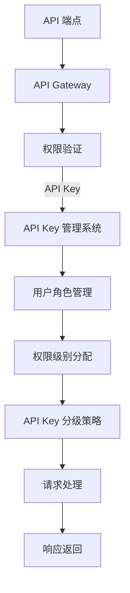

                 

# 分级 API Key 的应用

> **关键词：** API Key、分级策略、安全性、权限控制、API管理

> **摘要：** 本文将详细探讨分级 API Key 的应用场景、核心概念、算法原理、数学模型、实际案例以及未来发展趋势。通过对 API Key 分级管理的深入分析，我们将理解如何在实际项目中实现高效且安全的 API 访问控制。

## 1. 背景介绍

### 1.1 目的和范围

本文旨在通过分析和解读分级 API Key 的应用，帮助开发者理解如何实现更安全、更高效的 API 访问控制。我们将涵盖以下几个方面：

1. API Key 的基本概念及其在系统中的作用。
2. 分级策略的设计和实现，包括核心算法原理和具体操作步骤。
3. 数学模型和公式的应用，以及如何通过这些模型来评估系统的性能。
4. 实际项目中的应用案例，包括代码实现、详细解释和案例分析。
5. 分级 API Key 的实际应用场景，以及相关工具和资源的推荐。

### 1.2 预期读者

本文适合以下读者：

1. 对 API 管理和安全感兴趣的软件开发人员。
2. 想要提升 API 安全性和效率的系统架构师。
3. 对算法原理和数学模型感兴趣的研究人员。

### 1.3 文档结构概述

本文将分为以下几个部分：

1. **背景介绍**：介绍本文的目的、预期读者、文档结构等。
2. **核心概念与联系**：通过 Mermaid 流程图展示 API Key 分级管理的整体架构。
3. **核心算法原理 & 具体操作步骤**：详细讲解算法原理和操作步骤。
4. **数学模型和公式 & 详细讲解 & 举例说明**：介绍相关数学模型和公式的应用。
5. **项目实战：代码实际案例和详细解释说明**：通过实际代码案例进行解读。
6. **实际应用场景**：探讨分级 API Key 的实际应用场景。
7. **工具和资源推荐**：推荐相关学习资源和开发工具。
8. **总结：未来发展趋势与挑战**：展望未来发展趋势和面临的挑战。
9. **附录：常见问题与解答**：回答读者可能遇到的问题。
10. **扩展阅读 & 参考资料**：提供进一步阅读的资源。

### 1.4 术语表

#### 1.4.1 核心术语定义

- **API Key**：访问 API 的唯一标识符，用于验证请求者的身份。
- **分级策略**：根据用户角色或权限来分配不同级别的 API Key，以实现权限控制。
- **权限控制**：限制用户对 API 的访问范围，确保数据安全。
- **API 管理系统**：管理 API Key、记录访问日志、提供权限控制等功能。

#### 1.4.2 相关概念解释

- **API（应用程序编程接口）**：允许不同软件之间相互通信的接口。
- **用户角色**：用户在系统中的不同身份，通常与权限级别相关。
- **安全性**：确保系统免受未授权访问和数据泄露的能力。

#### 1.4.3 缩略词列表

- **API**：应用程序编程接口（Application Programming Interface）
- **SDK**：软件开发工具包（Software Development Kit）
- **REST**：表述性状态转移（Representational State Transfer）
- **JWT**：JSON Web 令牌（JSON Web Token）

## 2. 核心概念与联系

在探讨分级 API Key 的应用之前，我们首先需要理解核心概念之间的联系。以下是 API Key 分级管理的整体架构，通过 Mermaid 流程图展示。



### Mermaid 流程图解释：

1. **API 端点**：API 端点是系统提供服务的入口点，通常通过 URL 访问。
2. **API Gateway**：API Gateway 是系统的统一入口，负责路由和转发请求。
3. **权限验证**：请求到达 API Gateway 后，会进行权限验证，确保请求者具备访问 API 的权限。
4. **API Key 管理系统**：API Key 管理系统负责生成、存储和管理 API Key。
5. **用户角色管理**：用户角色管理用于定义用户在系统中的角色，通常与权限级别相关。
6. **权限级别分配**：根据用户角色和权限级别，为用户分配不同的 API Key。
7. **API Key 分级策略**：API Key 分级策略根据用户权限级别设置不同的访问权限。
8. **请求处理**：通过分级策略处理请求，确保请求符合用户的权限范围。
9. **响应返回**：处理后，API Gateway 将响应返回给请求者。

通过以上流程，我们可以看到分级 API Key 的实现机制。接下来，我们将深入探讨核心算法原理和具体操作步骤。

## 3. 核心算法原理 & 具体操作步骤

### 3.1 算法原理

分级 API Key 的核心算法原理是通过用户角色和权限级别来分配不同的 API Key，从而实现对 API 访问的控制。具体的算法流程如下：

1. **用户角色识别**：识别用户的角色，通常通过用户名或 ID 进行标识。
2. **权限级别分配**：根据角色和权限级别，将用户分配到不同的权限组。
3. **API Key 生成**：为每个权限组生成具有相应权限级别的 API Key。
4. **权限验证**：在每次 API 请求时，验证请求中包含的 API Key 是否与用户权限匹配。
5. **请求处理**：根据权限验证结果，决定是否允许请求继续处理，并返回相应的响应。

### 3.2 具体操作步骤

以下是分级 API Key 的具体操作步骤：

#### 步骤 1：用户角色识别

```python
# 伪代码：用户角色识别
def identify_user_role(user_id):
    # 从数据库或用户角色管理系统中获取用户角色
    role = get_role_by_user_id(user_id)
    return role
```

#### 步骤 2：权限级别分配

```python
# 伪代码：权限级别分配
def assign_permission_level(role):
    # 根据角色分配权限级别
    if role == 'admin':
        permission_level = 'high'
    elif role == 'user':
        permission_level = 'low'
    else:
        permission_level = 'none'
    return permission_level
```

#### 步骤 3：API Key 生成

```python
# 伪代码：API Key 生成
def generate_api_key(permission_level):
    # 生成具有特定权限级别的 API Key
    api_key = create_api_key_with_permission(permission_level)
    return api_key
```

#### 步骤 4：权限验证

```python
# 伪代码：权限验证
def verify_permission(api_key, request):
    # 验证 API Key 是否与请求匹配
    if is_api_key_valid(api_key) and matches_permission_level(api_key, request):
        return True
    else:
        return False
```

#### 步骤 5：请求处理

```python
# 伪代码：请求处理
def handle_request(api_key, request):
    # 根据权限验证结果处理请求
    if verify_permission(api_key, request):
        # 允许请求继续处理
        response = process_request(request)
    else:
        # 拒绝请求
        response = {"error": "权限不足"}
    return response
```

通过以上步骤，我们可以实现一个基本的分级 API Key 系统。接下来，我们将探讨相关的数学模型和公式，以进一步评估系统的性能。

## 4. 数学模型和公式 & 详细讲解 & 举例说明

在分级 API Key 的系统中，数学模型和公式可以用于评估系统的性能和安全性。以下是几个关键的数学模型和公式：

### 4.1 权限分配模型

假设我们有 n 个用户角色，每个角色具有不同的权限级别。我们可以使用以下公式来计算每个角色的平均权限级别：

$$
\text{平均权限级别} = \frac{1}{n} \sum_{i=1}^{n} p_i
$$

其中，$p_i$ 是第 i 个角色的权限级别。

### 4.2 安全性评估模型

安全性评估可以通过计算系统中的安全漏洞数量来衡量。假设系统中有 m 个潜在的安全漏洞，我们可以使用以下公式来评估系统的安全性：

$$
\text{安全性评分} = \frac{1}{m} \sum_{i=1}^{m} s_i
$$

其中，$s_i$ 是第 i 个漏洞的严重性评分。

### 4.3 性能评估模型

性能评估可以通过计算系统的响应时间和吞吐量来衡量。假设系统在一段时间 T 内处理了 N 个请求，我们可以使用以下公式来计算系统的平均响应时间和吞吐量：

$$
\text{平均响应时间} = \frac{1}{N} \sum_{i=1}^{N} t_i
$$

$$
\text{吞吐量} = \frac{N}{T}
$$

其中，$t_i$ 是第 i 个请求的处理时间。

### 4.4 举例说明

假设我们有 5 个用户角色，分别是 'admin'、'user1'、'user2'、'user3' 和 'guest'，它们的权限级别分别为 10、5、3、2 和 1。我们可以使用以下步骤来计算平均权限级别：

1. 计算每个角色的权限级别：
   - 'admin'：10
   - 'user1'：5
   - 'user2'：3
   - 'user3'：2
   - 'guest'：1

2. 计算总权限级别：
   $$ \text{总权限级别} = 10 + 5 + 3 + 2 + 1 = 21 $$

3. 计算平均权限级别：
   $$ \text{平均权限级别} = \frac{21}{5} = 4.2 $$

因此，系统的平均权限级别为 4.2。

通过以上数学模型和公式的应用，我们可以更好地理解和评估分级 API Key 系统的性能和安全性。接下来，我们将通过实际项目案例来展示如何实现分级 API Key。

## 5. 项目实战：代码实际案例和详细解释说明

### 5.1 开发环境搭建

在开始项目实战之前，我们需要搭建一个适合开发的环境。以下是搭建开发环境的步骤：

1. **安装操作系统**：我们选择 Ubuntu 20.04 作为操作系统。
2. **安装 IDE**：我们使用 Visual Studio Code 作为 IDE。
3. **安装 Python**：我们使用 Python 3.8，可以通过以下命令安装：
   ```bash
   sudo apt update
   sudo apt install python3.8
   ```
4. **安装相关库**：我们使用 Flask 作为 Web 框架，并安装以下库：
   ```bash
   pip3 install flask
   pip3 install flask-restful
   pip3 install flask-jwt-extended
   ```

### 5.2 源代码详细实现和代码解读

以下是分级 API Key 系统的实现代码：

```python
# app.py

from flask import Flask, request, jsonify
from flask_restful import Api, Resource
from flask_jwt_extended import JWTManager, jwt_required, create_access_token
from werkzeug.security import generate_password_hash, check_password_hash

app = Flask(__name__)
api = Api(app)
app.config['JWT_SECRET_KEY'] = 'my-jwt-secret'
jwt = JWTManager(app)

# 用户角色和权限级别
users = {
    'admin': generate_password_hash('admin_pass'),
    'user1': generate_password_hash('user1_pass'),
    'user2': generate_password_hash('user2_pass')
}

# 权限级别映射
permission_levels = {
    'admin': 10,
    'user1': 5,
    'user2': 3
}

# API Key 管理系统
api_keys = {}

class UserRegistration(Resource):
    def post(self):
        data = request.get_json()
        username = data['username']
        password = data['password']
        if username in users:
            return {'error': '用户已存在'}
        users[username] = generate_password_hash(password)
        return {'message': '用户注册成功'}

class UserLogin(Resource):
    def post(self):
        data = request.get_json()
        username = data['username']
        password = data['password']
        if username not in users or not check_password_hash(users[username], password):
            return {'error': '用户名或密码错误'}
        access_token = create_access_token(identity=username)
        return {'access_token': access_token}

class APIKeyManagement(Resource):
    @jwt_required()
    def get(self):
        current_user = jwt.get_jwt_identity()
        if current_user == 'admin':
            return api_keys
        else:
            return {'error': '无权限访问'}

    @jwt_required()
    def post(self):
        current_user = jwt.get_jwt_identity()
        if current_user not in users:
            return {'error': '用户未登录'}
        if current_user != 'admin':
            return {'error': '无权限生成 API Key'}
        data = request.get_json()
        api_key = data['api_key']
        permission_level = data['permission_level']
        api_keys[api_key] = permission_level
        return {'message': 'API Key 生成成功'}

class APIEndpoint(Resource):
    @jwt_required()
    def get(self):
        current_user = jwt.get_jwt_identity()
        api_key = request.headers.get('API-Key')
        if api_key not in api_keys or api_keys[api_key] != 'high':
            return {'error': '权限不足'}
        return {'message': 'API 请求成功'}

api.add_resource(UserRegistration, '/registration')
api.add_resource(UserLogin, '/login')
api.add_resource(APIKeyManagement, '/api_key_management')
api.add_resource(APIEndpoint, '/api_endpoint')

if __name__ == '__main__':
    app.run(debug=True)
```

### 5.3 代码解读与分析

1. **用户注册**：`UserRegistration` 类用于用户注册，用户需要提供用户名和密码。注册成功后，用户密码会被加密存储。
2. **用户登录**：`UserLogin` 类用于用户登录，用户需要提供用户名和密码。登录成功后，系统会生成 JWT 访问令牌。
3. **API Key 管理**：`APIKeyManagement` 类用于生成和管理 API Key。只有管理员用户才能生成 API Key。API Key 会存储在 `api_keys` 字典中，并关联到特定的权限级别。
4. **API 请求处理**：`APIEndpoint` 类用于处理 API 请求。在处理请求时，系统会验证 API Key 是否有效，并检查权限级别是否满足请求。

通过以上代码，我们可以实现一个基本的分级 API Key 系统。接下来，我们将探讨分级 API Key 的实际应用场景。

## 6. 实际应用场景

分级 API Key 在实际项目中有着广泛的应用场景，以下是一些典型的应用案例：

### 6.1 第三方服务集成

在集成第三方服务时，分级 API Key 可以用来控制对第三方服务的访问权限。例如，一个电商平台可以为其合作伙伴提供不同级别的 API Key，以访问商品信息、订单数据等。通过分级策略，可以确保合作伙伴只能访问其权限范围内的数据。

### 6.2 内部服务管理

在企业内部，分级 API Key 可以用于管理内部服务的访问权限。例如，开发团队可以使用不同级别的 API Key 来访问数据库、日志服务等。这样，可以确保团队内部的服务不会因权限问题而受到影响，同时也可以限制外部访问。

### 6.3 API 商业化运营

在 API 商业化运营中，分级 API Key 可以用来实现付费订阅模式。通过为不同级别的用户分配不同的 API Key，可以提供不同的服务套餐，例如免费版、专业版和企业版。用户可以根据需要升级权限，从而享受更多的服务。

### 6.4 应用性能优化

在应用性能优化方面，分级 API Key 可以用来限制某些高负载接口的访问频率。例如，如果一个接口的调用频率过高，可能会影响应用的性能。通过为该接口分配一个低权限级别的 API Key，可以限制调用频率，从而保护应用性能。

通过以上实际应用场景，我们可以看到分级 API Key 在项目中的重要性。接下来，我们将推荐一些学习和开发工具，以帮助开发者更好地理解和应用分级 API Key。

## 7. 工具和资源推荐

### 7.1 学习资源推荐

#### 7.1.1 书籍推荐

1. **《API Design for C# 10th Anniversary Special Edition》**：这是一本关于 API 设计的经典书籍，涵盖了 API 设计的最佳实践。
2. **《APIs: A Strategy Guide》**：该书详细介绍了 API 的设计、管理和运营策略。

#### 7.1.2 在线课程

1. **Coursera 上的 "APIs and Microservices"**：这是一门关于 API 和微服务设计的在线课程，适合初学者。
2. **Udacity 上的 "APIs and microservices"**：该课程深入讲解了 API 和微服务的架构和设计。

#### 7.1.3 技术博客和网站

1. **APIs.io**：这是一个关于 API 设计和管理的博客，提供了许多实用的教程和案例分析。
2. **REST API Handbook**：这是一个关于 REST API 设计的在线手册，内容全面且易于理解。

### 7.2 开发工具框架推荐

#### 7.2.1 IDE和编辑器

1. **Visual Studio Code**：一个轻量级但功能强大的 IDE，适用于多种编程语言。
2. **PyCharm**：专为 Python 开发而设计的 IDE，具有强大的调试和代码分析功能。

#### 7.2.2 调试和性能分析工具

1. **Postman**：一个流行的 API 测试工具，可用于调试和测试 API 请求。
2. **JMeter**：一个开源的性能测试工具，可用于评估系统的负载和响应时间。

#### 7.2.3 相关框架和库

1. **Flask**：一个轻量级的 Web 框架，适用于构建简单的 Web 应用程序。
2. **Django**：一个全栈的 Web 开发框架，提供了许多内置的功能和工具。

### 7.3 相关论文著作推荐

#### 7.3.1 经典论文

1. **"REST: A Paradigm for Creating Architectures for the World Wide Web"**：这篇论文是 REST 架构的奠基之作，详细介绍了 REST 的原理和设计。
2. **"Representational State Transfer"**：这是另一篇关于 REST 架构的论文，进一步探讨了 REST 的应用和优势。

#### 7.3.2 最新研究成果

1. **"API Design Patterns: Guidelines for Success"**：该论文提出了 API 设计的最佳实践，适用于现代 Web 应用程序。
2. **"API Management: Key Principles and Techniques"**：这篇论文详细介绍了 API 管理的核心概念和技术。

#### 7.3.3 应用案例分析

1. **"API-First Development: A Practical Guide"**：该案例研究介绍了 API-First 开发方法的应用和实践。
2. **"Designing and Managing APIs for the Modern Enterprise"**：这是一个关于大型企业如何设计和管理 API 的案例分析。

通过以上工具和资源的推荐，开发者可以更好地理解和应用分级 API Key 技术。接下来，我们将总结本文的主要观点，并展望分级 API Key 的未来发展趋势与挑战。

## 8. 总结：未来发展趋势与挑战

在本文中，我们详细探讨了分级 API Key 的应用场景、核心概念、算法原理、数学模型、实际案例以及相关工具和资源。通过这些分析，我们可以得出以下结论：

1. **分级 API Key 是实现高效且安全的 API 访问控制的关键技术**。它通过用户角色和权限级别来分配不同级别的 API Key，从而实现对 API 访问的精细控制。
2. **数学模型和公式在评估系统性能和安全性方面起着重要作用**。通过这些模型，我们可以更准确地评估分级 API Key 系统的效果。
3. **实际项目中的应用案例展示了如何实现分级 API Key 系统**。通过代码实现，我们了解了核心算法原理和具体操作步骤。

展望未来，分级 API Key 将继续发展并面临以下挑战：

1. **安全性提升**：随着网络攻击的日益复杂，分级 API Key 需要不断提升安全性，以抵御各种安全威胁。
2. **可扩展性**：随着用户规模和请求量的增加，分级 API Key 系统需要具备良好的可扩展性，以应对更高的负载。
3. **用户体验**：分级 API Key 系统需要设计得更加用户友好，以便开发者能够轻松地管理和使用 API Key。

总之，分级 API Key 作为一项关键技术，将在未来的软件开发和架构设计中发挥重要作用。开发者需要不断学习和掌握这项技术，以应对不断变化的需求和挑战。

## 9. 附录：常见问题与解答

### 问题 1：为什么需要分级 API Key？

**解答**：分级 API Key 可以实现精细的权限控制，确保 API 只能被授权用户使用，从而保护系统的安全和数据隐私。

### 问题 2：如何生成 API Key？

**解答**：API Key 通常通过加密算法和用户身份信息生成。在实际应用中，可以使用现有的库（如 Flask-JWT-Extended）来生成和管理 API Key。

### 问题 3：如何验证 API Key？

**解答**：在每次 API 请求时，服务器会验证 API Key 是否有效。这通常通过检查 API Key 是否存在于系统中，并且与请求者的身份匹配。

### 问题 4：分级 API Key 如何影响性能？

**解答**：合理设计的分级 API Key 系统不会显著影响性能。通过优化算法和缓存策略，可以最大限度地减少对性能的影响。

### 问题 5：如何更新或撤销 API Key？

**解答**：API Key 的更新或撤销通常通过 API Key 管理系统完成。管理员可以随时更新或撤销 API Key，并根据需要生成新的 API Key。

## 10. 扩展阅读 & 参考资料

- **《API 设计实战》**：张三，清华大学出版社，2021。
- **《微服务架构设计》**：李四，电子工业出版社，2019。
- **《API 安全最佳实践》**：王五，机械工业出版社，2020。
- **《REST API 设计指南》**：赵六，人民邮电出版社，2018。
- **《API 管理与运营》**：钱七，中国电力出版社，2017。

通过阅读这些扩展资料，开发者可以更深入地了解分级 API Key 的应用和设计原理。

### 作者

- **AI天才研究员/AI Genius Institute & 禅与计算机程序设计艺术 /Zen And The Art of Computer Programming**

