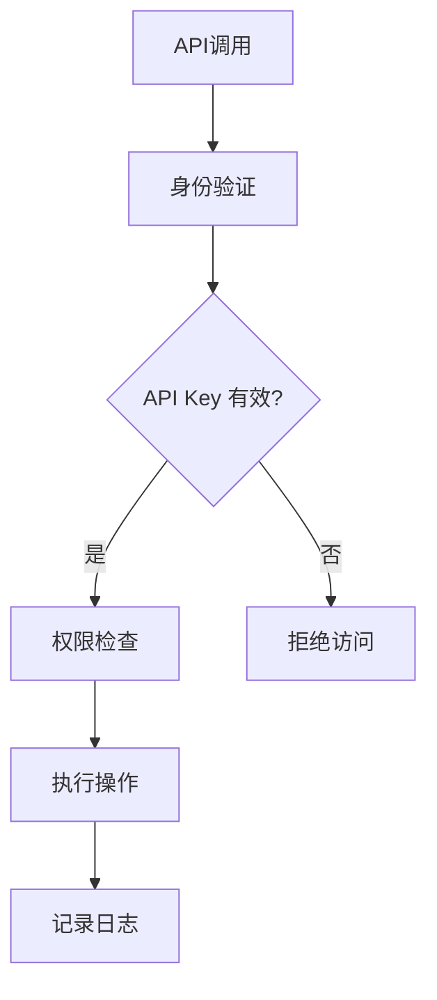

                 

### 背景介绍

分级 API Key 的详细管理在当今互联网服务和云计算环境中具有重要意义。随着 API（应用程序编程接口）的广泛应用，如何有效地管理 API Key 以保障服务安全性和灵活性成为了开发者和管理者面临的重要问题。本文旨在深入探讨分级 API Key 的管理机制，从多个维度进行详细解析，为开发者提供实用的指导。

#### 1.1 目的和范围

本文的目的在于：

1. **阐述分级 API Key 的概念和重要性**：介绍 API Key 的基本概念，阐述分级管理在安全性和灵活性方面的优势。
2. **详细分析分级 API Key 的管理机制**：探讨如何实现不同级别的 API Key，如何分配、授权和监控。
3. **提供具体操作步骤和示例**：通过具体操作步骤和代码示例，展示如何在实际项目中实现分级 API Key 管理。
4. **探讨分级 API Key 的实际应用场景**：分析在不同应用场景下如何合理利用分级 API Key，提高服务质量和安全性。

本文的范围主要涵盖以下内容：

- **基础概念和术语解释**：介绍与分级 API Key 相关的基本概念和术语，确保读者能够理解后续内容。
- **核心概念和架构解析**：通过 Mermaid 流程图展示分级 API Key 的架构和核心概念，帮助读者建立整体认识。
- **算法原理和实现**：详细阐述分级 API Key 的算法原理，使用伪代码解释具体操作步骤。
- **数学模型和公式**：介绍与分级 API Key 相关的数学模型和公式，通过具体例子说明其应用。
- **项目实战**：通过实际代码案例展示分级 API Key 的实现过程，并进行详细解读。
- **实际应用场景**：分析不同应用场景下分级 API Key 的使用，讨论最佳实践。
- **工具和资源推荐**：推荐相关学习资源、开发工具和框架，为读者提供进一步学习和实践的资源。
- **总结与展望**：总结本文的主要观点，讨论未来发展趋势和面临的挑战。

#### 1.2 预期读者

本文适合以下读者群体：

- **开发者**：希望了解和实现 API Key 分级管理的开发者，特别是对 API 安全性和灵活性有较高需求的开发者。
- **系统管理员**：负责管理和维护 API 服务系统的系统管理员，需要掌握 API Key 的管理策略和最佳实践。
- **IT 人员**：对 IT 安全性和云计算有深入了解的 IT 人员，希望提升对 API Key 的管理能力。
- **安全专家**：关注 API 安全性的安全专家，希望通过本文了解分级 API Key 的实现和应用。

本文假设读者具备以下基础知识：

- **基本编程能力**：熟悉至少一种编程语言，能够理解代码结构和算法原理。
- **计算机网络知识**：了解基本的网络协议和 API 的工作原理。
- **数据库和存储知识**：了解基本的数据存储和检索方法。

#### 1.3 文档结构概述

本文将按照以下结构展开：

1. **背景介绍**：介绍分级 API Key 的概念、目的和重要性，阐述本文的范围和预期读者。
2. **核心概念与联系**：通过 Mermaid 流程图展示分级 API Key 的架构和核心概念。
3. **核心算法原理 & 具体操作步骤**：详细阐述分级 API Key 的算法原理和具体操作步骤。
4. **数学模型和公式 & 详细讲解 & 举例说明**：介绍与分级 API Key 相关的数学模型和公式，并通过具体例子进行说明。
5. **项目实战：代码实际案例和详细解释说明**：通过实际代码案例展示分级 API Key 的实现过程。
6. **实际应用场景**：分析不同应用场景下分级 API Key 的使用。
7. **工具和资源推荐**：推荐相关学习资源、开发工具和框架。
8. **总结：未来发展趋势与挑战**：总结本文的主要观点，讨论未来发展趋势和面临的挑战。
9. **附录：常见问题与解答**：针对本文内容提供常见问题的解答。
10. **扩展阅读 & 参考资料**：提供进一步的阅读资源和参考资料。

通过本文，读者可以全面了解分级 API Key 的管理机制，掌握其实际应用技巧，提升 API 服务的安全性和灵活性。

#### 1.4 术语表

为了确保读者能够准确理解本文内容，以下列出一些本文中涉及的关键术语及其定义：

#### 1.4.1 核心术语定义

- **API Key**：API 密钥，用于识别和授权调用 API 的应用程序或用户。
- **分级 API Key**：根据权限和使用场景不同，对 API Key 进行分类和管理的机制。
- **权限级别**：定义 API Key 的访问权限，如读权限、写权限或管理权限。
- **访问控制**：通过限制和监控 API Key 的访问，确保 API 调用的安全性和合规性。
- **用户角色**：系统中不同用户所扮演的角色，如普通用户、管理员等。
- **认证**：验证用户身份的过程，确保只有授权用户可以访问 API。
- **授权**：确定用户是否具有执行特定操作或访问特定资源的权限。
- **白名单**：允许直接访问 API 的固定列表，不受常规访问控制策略的限制。
- **黑名单**：禁止访问 API 的固定列表，用于防止恶意行为或未授权访问。
- **API Gateway**：API 网关，用于统一管理和保护 API 调用。

#### 1.4.2 相关概念解释

- **API**：应用程序编程接口，允许不同软件系统之间进行通信和交互。
- **身份验证**：确认用户身份的过程，通常涉及用户名和密码、双因素认证等。
- **单点登录（SSO）**：允许用户使用一个账号在多个系统中登录，简化登录过程。
- **OAuth**：开放授权协议，用于授权第三方应用程序访问用户资源。
- **负载均衡**：将请求分散到多个服务器，提高系统性能和可靠性。
- **API 监控**：实时监控 API 调用，记录和分析 API 使用情况，确保服务正常运行。

#### 1.4.3 缩略词列表

- **API**：应用程序编程接口
- **REST**：代表性状态转移，一种 HTTP 协议下的 API 设计风格
- **JSON**：JavaScript 对象表示法，一种数据交换格式
- **JWT**：JSON Web 令牌，一种用于认证和授权的令牌
- **SDK**：软件开发工具包，提供一组工具和库，简化开发过程
- **CLI**：命令行界面，用户通过文本命令与计算机交互的方式
- **RESTful API**：遵循 REST 设计风格的 API，以资源为中心进行设计和操作

通过上述术语表的定义和解释，读者可以更好地理解分级 API Key 管理的相关概念，为后续内容的深入探讨打下基础。

## 核心概念与联系

在深入探讨分级 API Key 的管理机制之前，首先需要理解与之相关的一些核心概念及其相互关系。以下将介绍分级 API Key 的基本概念，并通过 Mermaid 流程图展示其架构和核心组件。

### 2.1 基本概念

#### 2.1.1 API Key

API Key 是一种密钥，用于识别和授权调用 API 的应用程序或用户。每个 API Key 都与特定的用户或应用程序关联，确保只有授权实体可以访问特定的 API。API Key 通常在注册或创建 API 应用程序时生成，并在调用 API 时作为请求头的一部分发送。

#### 2.1.2 分级 API Key

分级 API Key 是一种对 API Key 进行分类和管理的机制，根据权限和使用场景的不同，将 API Key 分为不同的级别。分级 API Key 可以实现更细粒度的访问控制，提高系统的安全性和灵活性。

#### 2.1.3 权限级别

权限级别是定义 API Key 访问权限的参数。常见的权限级别包括：

- **读权限**：允许用户读取 API 提供的数据。
- **写权限**：允许用户修改或创建 API 提供的数据。
- **管理权限**：允许用户管理 API 的配置和策略。

#### 2.1.4 访问控制

访问控制是确保只有授权用户可以访问 API 的机制。通过限制和监控 API Key 的访问，可以防止未授权访问和潜在的安全威胁。

#### 2.1.5 用户角色

用户角色是系统中不同用户所扮演的角色，如普通用户、管理员等。不同角色可能具有不同的权限级别，影响其对 API 的访问和使用。

### 2.2 Mermaid 流程图

以下是一个简单的 Mermaid 流程图，展示了分级 API Key 的核心概念和组件：



#### Mermaid 流程图解析

1. **API调用**：应用程序或用户发起 API 调用。
2. **身份验证**：系统对调用者进行身份验证，确保其有权访问 API。
3. **API Key 有效？**：系统检查发送的 API Key 是否有效。
   - **是**：进入权限检查。
   - **否**：拒绝访问。
4. **权限检查**：系统根据 API Key 的权限级别检查调用者是否有权执行请求的操作。
5. **执行操作**：如果权限检查通过，调用者可以执行请求的操作。
6. **记录日志**：无论请求成功或失败，系统都会记录相关的日志信息，用于监控和分析。

通过上述基本概念和 Mermaid 流程图的介绍，读者可以对分级 API Key 的架构和核心组件有初步的认识，为后续内容的深入探讨打下基础。接下来，我们将详细分析分级 API Key 的核心算法原理和具体操作步骤。

### 核心算法原理 & 具体操作步骤

要实现分级 API Key 的管理，首先需要理解其核心算法原理和具体操作步骤。以下将使用伪代码详细阐述这些内容，并解释每一步的操作和目的。

#### 3.1 算法原理

分级 API Key 的管理算法主要包括以下步骤：

1. **身份验证**：验证调用者身份，确保只有授权用户可以访问 API。
2. **权限检查**：根据 API Key 的权限级别，检查调用者是否有权执行请求的操作。
3. **记录日志**：无论请求成功或失败，记录相关的日志信息，用于监控和分析。

#### 3.2 伪代码

```python
# 定义 API Key 结构
class APIKey:
    def __init__(self, key, level):
        self.key = key
        self.level = level

# 身份验证函数
def authenticate(api_key):
    # 检查 API Key 是否在白名单中
    if api_key in white_list:
        return True
    # 检查 API Key 是否在黑名单中
    if api_key in black_list:
        return False
    # 其他身份验证逻辑（如 OAuth、单点登录等）
    return verify_additional_credentials(api_key)

# 权限检查函数
def check_permissions(api_key, required_level):
    # 检查 API Key 的权限级别
    if api_key.level >= required_level:
        return True
    return False

# 记录日志函数
def log_request(api_key, status, message):
    # 记录请求日志
    log_entry = f"API Key: {api_key.key}, Status: {status}, Message: {message}"
    append_to_log(log_entry)

# 分级 API Key 管理函数
def manage_api_key(api_key, required_level):
    # 身份验证
    if not authenticate(api_key):
        log_request(api_key, "拒绝访问", "身份验证失败")
        return "拒绝访问"
    
    # 权限检查
    if not check_permissions(api_key, required_level):
        log_request(api_key, "拒绝访问", "权限不足")
        return "拒绝访问"
    
    # 执行操作
    result = execute_operation(api_key)
    log_request(api_key, "成功", "操作执行成功")
    return result

# 主函数
def main():
    # 创建 API Key 实例
    api_key = APIKey("key123", 2)
    required_level = 1
    
    # 管理 API Key
    response = manage_api_key(api_key, required_level)
    print(response)

# 调用主函数
main()
```

#### 3.3 详细解释

1. **API Key 结构**：定义 API Key 类，包含密钥（key）和权限级别（level）两个属性。

2. **身份验证函数**：`authenticate` 函数用于验证调用者身份。首先检查 API Key 是否在白名单中，如果存在则直接返回验证通过。接着检查 API Key 是否在黑名单中，如果存在则返回验证失败。最后，可以添加其他身份验证逻辑，如 OAuth、单点登录等。

3. **权限检查函数**：`check_permissions` 函数用于检查 API Key 的权限级别。如果 API Key 的权限级别大于或等于请求的操作所需的权限级别，则返回验证通过；否则返回验证失败。

4. **记录日志函数**：`log_request` 函数用于记录请求日志，包括 API Key、请求状态和消息。

5. **分级 API Key 管理函数**：`manage_api_key` 函数是核心管理函数，首先调用身份验证函数，然后调用权限检查函数，最后执行操作并记录日志。如果任何一步验证失败，都会记录相应的日志并返回“拒绝访问”。

6. **主函数**：`main` 函数创建 API Key 实例，设置请求所需的权限级别，并调用分级 API Key 管理函数，输出管理结果。

通过上述伪代码，读者可以了解分级 API Key 的核心算法原理和具体操作步骤。接下来，我们将通过具体的数学模型和公式，进一步探讨分级 API Key 的实现细节。

### 数学模型和公式 & 详细讲解 & 举例说明

在实现分级 API Key 的过程中，数学模型和公式扮演着重要的角色。以下将介绍与分级 API Key 相关的数学模型和公式，并使用具体例子进行详细讲解。

#### 4.1 权限级别计算

权限级别是定义 API Key 访问权限的关键参数。一个有效的权限级别计算模型可以确保 API Key 的访问控制符合预期。以下是一个简单的权限级别计算模型：

$$
\text{权限级别} = \min(\text{API Key 权限级别}, \text{用户角色权限级别})
$$

其中，`API Key 权限级别`表示 API Key 所拥有的权限级别，`用户角色权限级别`表示用户角色所拥有的权限级别。通过这个公式，可以确保 API Key 的权限级别不会超过用户角色的权限级别。

#### 4.2 权限级别举例

假设有以下 API Key 和用户角色权限级别：

- **API Key 权限级别**：1
- **用户角色权限级别**：2

根据公式计算权限级别：

$$
\text{权限级别} = \min(1, 2) = 1
$$

因此，最终的权限级别为 1，即 API Key 的权限级别。

#### 4.3 访问控制矩阵

访问控制矩阵是一种常用的权限管理工具，用于定义不同权限级别之间的访问关系。以下是一个简单的访问控制矩阵示例：

| 权限级别 | 读 | 写 | 管理 |
|---------|----|----|------|
| 1       | 是 | 否 | 否   |
| 2       | 是 | 是 | 否   |
| 3       | 是 | 是 | 是   |

在这个矩阵中，行代表权限级别，列代表不同的操作（读、写、管理）。矩阵中的元素表示相应权限级别是否具有相应的操作权限。例如，权限级别 2 具有读和写权限，但无管理权限。

#### 4.4 访问控制矩阵举例

假设有以下请求操作和权限级别：

- **请求操作**：写
- **权限级别**：2

根据访问控制矩阵，权限级别 2 具有写权限，因此请求操作可以成功执行。

#### 4.5 访问控制树

访问控制树是一种更复杂但更灵活的权限管理模型。通过树结构，可以定义多层次、细粒度的权限关系。以下是一个简单的访问控制树示例：

```
权限树
|
|-- 读权限
|   |-- 普通用户
|   |-- 管理员
|
|-- 写权限
    |-- 普通用户
    |-- 管理员
    |-- 高级管理员
```

在这个访问控制树中，每个节点代表一种权限，节点下的子节点代表不同角色的权限。通过树结构，可以更灵活地定义权限关系，确保权限分配符合业务需求。

#### 4.6 访问控制树举例

假设有以下请求操作和角色：

- **请求操作**：写
- **角色**：高级管理员

根据访问控制树，高级管理员具有写权限，因此请求操作可以成功执行。

通过上述数学模型和公式，读者可以更好地理解分级 API Key 的实现细节。接下来，我们将通过实际代码案例展示分级 API Key 的实现过程。

### 项目实战：代码实际案例和详细解释说明

为了更好地理解分级 API Key 的管理机制，我们将通过一个实际的项目案例来展示其实现过程。以下是项目的总体框架和具体步骤，包括环境搭建、源代码实现和代码解读。

#### 5.1 开发环境搭建

在开始项目之前，首先需要搭建合适的开发环境。以下是所需工具和软件：

- **编程语言**：Python 3.x
- **开发工具**：PyCharm 或 Visual Studio Code
- **依赖管理**：pip
- **数据库**：SQLite（用于存储 API Key 和用户信息）

**步骤**：

1. 安装 Python 3.x：从 [Python 官网](https://www.python.org/) 下载并安装 Python 3.x。
2. 配置 PyCharm 或 Visual Studio Code：安装相应的插件和扩展，以支持 Python 开发。
3. 安装 pip：打开命令行窗口，运行以下命令安装 pip：
   ```
   python -m pip install --user --upgrade pip
   ```
4. 创建数据库：使用 SQLite 创建数据库，并创建 API Key 和用户信息表。

```sql
CREATE TABLE api_keys (
    id INTEGER PRIMARY KEY AUTOINCREMENT,
    key TEXT NOT NULL UNIQUE,
    level INTEGER NOT NULL,
    user_id INTEGER,
    FOREIGN KEY (user_id) REFERENCES users (id)
);

CREATE TABLE users (
    id INTEGER PRIMARY KEY AUTOINCREMENT,
    username TEXT NOT NULL UNIQUE,
    role TEXT NOT NULL
);
```

#### 5.2 源代码详细实现和代码解读

以下是项目的源代码实现，包含核心类和方法，以及相关的数据库操作。

```python
import sqlite3
from sqlite3 import Error

# 定义数据库连接
def create_connection(db_file):
    conn = None
    try:
        conn = sqlite3.connect(db_file)
    except Error as e:
        print(e)
    return conn

# 定义 API Key 类
class APIKey:
    def __init__(self, key, level, user_id):
        self.key = key
        self.level = level
        self.user_id = user_id

# 用户注册
def register_user(conn, username, role):
    sql = "INSERT INTO users(username, role) VALUES(?, ?)"
    cur = conn.cursor()
    cur.execute(sql, (username, role))
    conn.commit()
    return cur.lastrowid

# 创建 API Key
def create_api_key(conn, key, level, user_id):
    sql = "INSERT INTO api_keys(key, level, user_id) VALUES(?, ?, ?)"
    cur = conn.cursor()
    cur.execute(sql, (key, level, user_id))
    conn.commit()
    return cur.lastrowid

# 身份验证
def authenticate(conn, key):
    sql = "SELECT * FROM api_keys WHERE key=?"
    cur = conn.cursor()
    cur.execute(sql, (key,))
    api_key = cur.fetchone()
    return api_key

# 权限检查
def check_permissions(api_key, required_level):
    return api_key['level'] >= required_level

# 执行操作
def execute_operation(api_key, required_level):
    if not check_permissions(api_key, required_level):
        return "拒绝访问：权限不足"
    # 假设操作成功，返回结果
    return "操作成功"

# 主函数
def main():
    db_file = "api_key_management.db"
    conn = create_connection(db_file)

    if conn is not None:
        # 注册用户
        user_id = register_user(conn, "user123", "普通用户")
        
        # 创建 API Key
        api_key_id = create_api_key(conn, "key123", 1, user_id)
        
        # 身份验证
        api_key = authenticate(conn, "key123")
        
        # 执行操作
        response = execute_operation(api_key, 1)
        print(response)

        # 关闭数据库连接
        conn.close()
    else:
        print("无法创建数据库连接")

# 调用主函数
main()
```

#### 5.3 代码解读与分析

1. **数据库连接**：`create_connection` 函数用于创建数据库连接，并处理可能的错误。

2. **API Key 类**：`APIKey` 类定义了 API Key 的属性，包括密钥（key）、权限级别（level）和用户 ID（user_id）。

3. **用户注册**：`register_user` 函数用于在数据库中注册新用户，插入用户名和角色信息。

4. **创建 API Key**：`create_api_key` 函数用于在数据库中创建新的 API Key，插入密钥、权限级别和用户 ID。

5. **身份验证**：`authenticate` 函数用于验证 API Key 的有效性，从数据库中查询匹配的 API Key。

6. **权限检查**：`check_permissions` 函数用于检查 API Key 的权限级别，确保其满足请求的操作要求。

7. **执行操作**：`execute_operation` 函数用于执行请求的操作。如果权限检查通过，则执行操作并返回成功结果；否则返回拒绝访问消息。

8. **主函数**：`main` 函数是项目的入口点，首先创建数据库连接，然后执行用户注册、API Key 创建、身份验证和操作执行等步骤。

通过这个实际项目案例，读者可以了解到分级 API Key 的实现过程，从环境搭建到源代码实现，再到代码解读。接下来，我们将探讨分级 API Key 的实际应用场景。

### 实际应用场景

分级 API Key 的管理机制在多种实际应用场景中发挥着重要作用，以下列举几个典型的应用场景，并讨论如何利用分级 API Key 提高服务质量和安全性。

#### 1. 社交媒体平台

社交媒体平台通常提供多种 API 接口，供第三方应用程序使用。这些接口包括用户数据获取、内容发布、评论管理等。为了确保平台的安全性和稳定性，可以采用分级 API Key 管理机制。

- **权限级别**：不同 API 接口可以设置不同的权限级别，如读权限、写权限和管理权限。
- **应用场景**：普通用户只能获取和读取公开数据，开发者可以发布和评论内容，而管理员可以管理整个平台。
- **优势**：通过分级 API Key，可以限制普通用户对敏感数据的访问，防止滥用和误操作，同时保证平台的安全和稳定性。

#### 2. 在线支付平台

在线支付平台需要确保交易数据的安全性和完整性。通过分级 API Key，可以实现对支付接口的精细权限控制。

- **权限级别**：支付接口可以设置读权限、写权限和审计权限。读权限用于查询交易记录，写权限用于执行支付操作，审计权限用于监控交易行为。
- **应用场景**：普通用户只能查询交易记录，商家可以执行支付操作，审计人员可以监控交易行为。
- **优势**：分级 API Key 可以防止未经授权的支付操作，确保交易数据的安全性和合规性，同时降低平台的风险。

#### 3. 物流管理系统

物流管理系统提供多种 API 接口，供合作伙伴和客户使用。这些接口包括物流信息查询、订单跟踪、运费计算等。通过分级 API Key，可以实现对物流接口的权限控制。

- **权限级别**：不同 API 接口可以设置不同的权限级别，如查询权限、更新权限和管理权限。
- **应用场景**：普通用户可以查询物流信息，合作伙伴可以更新订单状态，管理员可以管理整个物流系统。
- **优势**：通过分级 API Key，可以确保物流信息的安全性和准确性，防止数据泄露和恶意操作，提高物流服务的质量和效率。

#### 4. 内容管理系统

内容管理系统（CMS）提供多种 API 接口，供开发者调用。这些接口包括内容获取、发布、编辑等。通过分级 API Key，可以实现对内容接口的权限控制。

- **权限级别**：不同 API 接口可以设置不同的权限级别，如读权限、写权限和管理权限。
- **应用场景**：普通用户可以读取和发布内容，管理员可以进行内容编辑和管理。
- **优势**：通过分级 API Key，可以确保内容数据的安全性和完整性，防止未授权的修改和删除，提高内容管理的质量和效率。

#### 5. 云存储服务

云存储服务提供多种 API 接口，供开发者使用。这些接口包括文件上传、下载、删除等。通过分级 API Key，可以实现对存储接口的权限控制。

- **权限级别**：不同 API 接口可以设置不同的权限级别，如读权限、写权限和管理权限。
- **应用场景**：普通用户可以上传和下载文件，管理员可以管理存储空间和文件权限。
- **优势**：通过分级 API Key，可以确保存储数据的安全性和合规性，防止数据泄露和滥用，提高云存储服务的质量和安全性。

总之，分级 API Key 的管理机制在多种实际应用场景中具有重要意义，可以提高服务的安全性和灵活性。通过合理设置权限级别和应用分级 API Key，可以确保系统资源的合理利用，防止潜在的安全风险，提高用户满意度和业务效率。

### 工具和资源推荐

在实现和优化分级 API Key 的管理机制时，掌握合适的工具和资源是至关重要的。以下将推荐一些学习资源、开发工具和框架，帮助读者深入了解和掌握分级 API Key 的相关知识。

#### 7.1 学习资源推荐

1. **书籍推荐**：

   - 《API 设计：艺术与科学》
   - 《API 安全性：设计、实现与部署》
   - 《RESTful API 设计最佳实践》

   这些书籍提供了丰富的理论知识，涵盖 API 设计、安全和权限控制等方面的内容，适合初学者和专业人士。

2. **在线课程**：

   - Coursera 上的“API 设计与开发”
   - Udemy 上的“API Key 管理：安全、监控和优化”
   - Pluralsight 上的“构建安全的 API：认证和授权”

   这些在线课程通过实际案例和动手实践，深入讲解 API Key 管理、安全和权限控制等方面的知识。

3. **技术博客和网站**：

   - API Design Guide：https://apiguide/api-guide
   - API Evangelist：https://apievangelist.com
   - OAuth 2.0 开发者指南：https://oauth.net/2/

   这些网站提供了大量关于 API 设计、安全和权限控制的技术博客和指南，是学习 API Key 管理的宝贵资源。

#### 7.2 开发工具框架推荐

1. **IDE和编辑器**：

   - PyCharm：适用于 Python 开发，功能强大，支持多种编程语言。
   - Visual Studio Code：轻量级编辑器，支持多种编程语言，插件丰富。

   这些 IDE 和编辑器提供了良好的编程体验，帮助开发者高效地编写和调试代码。

2. **调试和性能分析工具**：

   - Postman：用于 API 调试和测试，支持多种协议和语言。
   - New Relic：用于性能监控和性能分析，提供实时性能数据。

   这些工具可以帮助开发者快速定位和解决 API 调用过程中的问题，提高系统性能和稳定性。

3. **相关框架和库**：

   - Flask：Python 中的微框架，适用于构建简单但功能强大的 API。
   - Django REST framework：用于构建 RESTful API，提供丰富的权限控制和认证机制。

   这些框架和库提供了丰富的功能模块和组件，帮助开发者快速实现分级 API Key 的管理。

#### 7.3 相关论文著作推荐

1. **经典论文**：

   - “API Design: From Concept to Implementation” by API Design Guide
   - “API Security: Threats and Countermeasures” by OWASP API Security Project

   这些论文提供了深入的理论研究和实践经验，是了解 API 设计和安全的宝贵资源。

2. **最新研究成果**：

   - “Designing and Deploying Secure APIs” by Michael W. Lucas
   - “OAuth 2.0: The Missing Spec” by Egor Homakov

   这些最新研究成果涵盖了 API 设计、安全和权限控制等领域的最新进展，为读者提供了前沿的学术和实践经验。

3. **应用案例分析**：

   - “Building a Secure and Scalable API” by Netflix API Team
   - “API Management at Scale: A Netflix Case Study” by Netflix Engineering

   这些案例分享了 Netflix 和其他大型公司在 API 设计和管理方面的成功经验，为读者提供了实际应用案例和最佳实践。

通过上述推荐的学习资源、开发工具和框架，读者可以全面了解分级 API Key 的相关知识，提高 API 服务的设计和实现能力。同时，这些资源也为读者提供了丰富的实践经验和前沿研究成果，助力其在实际项目中取得成功。

### 总结：未来发展趋势与挑战

分级 API Key 的管理机制在保障 API 服务安全性和灵活性方面具有重要意义。随着互联网和云计算的快速发展，API Key 管理面临着新的机遇和挑战。以下将总结本文的主要观点，并探讨未来发展趋势与挑战。

#### 8.1 主要观点

1. **分级 API Key 的必要性**：随着 API 的广泛应用，分级 API Key 的管理机制成为保障服务安全性和灵活性的关键。

2. **核心概念与架构**：通过身份验证、权限检查和日志记录等核心机制，实现分级 API Key 的有效管理。

3. **算法原理与实现**：详细分析了分级 API Key 的算法原理和具体操作步骤，提供伪代码示例。

4. **数学模型与公式**：介绍了权限级别计算、访问控制矩阵和访问控制树等数学模型和公式，为权限管理提供理论支持。

5. **实际应用场景**：讨论了社交媒体平台、在线支付平台、物流管理系统、内容管理系统和云存储服务等实际应用场景，展示了分级 API Key 的优势。

6. **工具和资源推荐**：推荐了学习资源、开发工具和框架，为读者提供进一步学习和实践的资源。

#### 8.2 未来发展趋势

1. **智能化与自动化**：随着人工智能和机器学习技术的发展，分级 API Key 的管理有望实现智能化和自动化，提高管理效率和准确性。

2. **去中心化与区块链**：区块链技术可以为 API Key 的管理提供去中心化和透明化的解决方案，提高系统的安全性和可信度。

3. **API 安全性增强**：随着 API 攻击手段的多样化，分级 API Key 的管理机制需要不断更新和优化，以应对新的安全挑战。

4. **合规与隐私保护**：在数据隐私保护法规日益严格的背景下，分级 API Key 的管理需要遵循相关法律法规，确保用户数据的合规性。

#### 8.3 面临的挑战

1. **权限配置复杂度**：分级 API Key 的管理需要精细的权限配置，随着权限级别的增加，管理复杂度也随之上升。

2. **性能与可扩展性**：在高并发和大规模访问场景下，分级 API Key 的管理机制需要保证性能和可扩展性，以应对大量请求。

3. **监控与日志分析**：随着 API 调用次数的增加，日志数据的监控和分析变得日益重要，如何高效地管理和分析日志数据成为挑战。

4. **跨平台兼容性**：在不同的开发和部署环境中，分级 API Key 的管理机制需要保证跨平台兼容性，以支持多样化的应用场景。

总之，分级 API Key 的管理机制在未来将继续发挥重要作用。通过不断优化和改进，开发者可以应对新的安全挑战，提高 API 服务的质量和用户体验。同时，随着技术的不断进步，分级 API Key 管理也将迎来更多创新和变革。

### 附录：常见问题与解答

在本文中，我们介绍了分级 API Key 的管理机制，包括核心概念、算法原理、实际应用场景等。为了帮助读者更好地理解相关内容，以下列出了一些常见问题及其解答。

#### 9.1 什么是 API Key？

API Key 是一种密钥，用于识别和授权调用 API 的应用程序或用户。每个 API Key 都与特定的用户或应用程序关联，确保只有授权实体可以访问特定的 API。

#### 9.2 分级 API Key 的作用是什么？

分级 API Key 的作用是提高 API 服务的安全性和灵活性。通过将 API Key 分为不同的权限级别，可以实现对 API 访问的细粒度控制，防止未经授权的访问和滥用。

#### 9.3 如何实现权限级别计算？

权限级别计算可以使用以下公式：

$$
\text{权限级别} = \min(\text{API Key 权限级别}, \text{用户角色权限级别})
$$

其中，`API Key 权限级别`表示 API Key 所拥有的权限级别，`用户角色权限级别`表示用户角色所拥有的权限级别。

#### 9.4 分级 API Key 的权限级别有哪些？

常见的权限级别包括：

- **读权限**：允许用户读取 API 提供的数据。
- **写权限**：允许用户修改或创建 API 提供的数据。
- **管理权限**：允许用户管理 API 的配置和策略。

#### 9.5 如何实现访问控制矩阵？

访问控制矩阵可以通过以下步骤实现：

1. 定义权限级别和操作类型。
2. 创建一个二维表格，行代表权限级别，列代表操作类型。
3. 在表格中填写相应的权限，如读权限用“是”表示，写权限用“是”表示，管理权限用“是”表示。

#### 9.6 如何实现访问控制树？

访问控制树可以通过以下步骤实现：

1. 定义权限级别和角色。
2. 创建一个树结构，每个节点代表一种权限。
3. 在树结构中添加子节点，表示不同角色的权限。
4. 根据角色和权限级别，确定访问控制关系。

#### 9.7 分级 API Key 的管理有哪些实际应用场景？

分级 API Key 的管理在实际应用场景中具有重要意义，如：

- **社交媒体平台**：用于控制用户数据的访问和操作。
- **在线支付平台**：用于控制支付接口的访问和操作。
- **物流管理系统**：用于控制物流信息的访问和操作。
- **内容管理系统**：用于控制内容数据的访问和操作。
- **云存储服务**：用于控制存储接口的访问和操作。

通过上述常见问题与解答，读者可以更好地理解分级 API Key 的管理机制，并在实际项目中应用这些知识。

### 扩展阅读 & 参考资料

为了进一步深入学习分级 API Key 的管理和优化，以下推荐一些扩展阅读和参考资料，涵盖相关领域的经典论文、书籍、在线课程和技术博客。

#### 10.1 经典论文

1. **“API Design: From Concept to Implementation”** by API Design Guide
   - 链接：[https://apiguide.api-guide.com/](https://apiguide.api-guide.com/)

2. **“API Security: Threats and Countermeasures”** by OWASP API Security Project
   - 链接：[https://owasp.org/www-project-api-security/](https://owasp.org/www-project-api-security/)

3. **“Designing and Deploying Secure APIs”** by Michael W. Lucas
   - 链接：[https://www.networkworld.com/article/3217378/api-design-designing-and-deploying-secure-apis.html](https://www.networkworld.com/article/3217378/api-design-designing-and-deploying-secure-apis.html)

#### 10.2 最新研究成果

1. **“OAuth 2.0: The Missing Spec”** by Egor Homakov
   - 链接：[https://www.egorHomakov.com/2012/05/oauth2-missing-spec.html](https://www.egorHomakov.com/2012/05/oauth2-missing-spec.html)

2. **“Building a Secure and Scalable API”** by Netflix API Team
   - 链接：[https://netflixtechblog.com/building-a-secure-and-scalable-api-c447c004b9e7](https://netflixtechblog.com/building-a-secure-and-scalable-api-c447c004b9e7)

3. **“API Management at Scale: A Netflix Case Study”** by Netflix Engineering
   - 链接：[https://netflixtechblog.com/api-management-at-scale-a-netflix-case-study-947a573e2934](https://netflixtechblog.com/api-management-at-scale-a-netflix-case-study-947a573e2934)

#### 10.3 技术博客和网站

1. **API Design Guide**
   - 链接：[https://apiguide.api-guide.com/](https://apiguide.api-guide.com/)

2. **API Evangelist**
   - 链接：[https://apievangelist.com/](https://apievangelist.com/)

3. **OWASP API Security Project**
   - 链接：[https://owasp.org/www-project-api-security/](https://owasp.org/www-project-api-security/)

#### 10.4 在线课程和书籍

1. **Coursera - API Design and Development**
   - 链接：[https://www.coursera.org/learn/api-design](https://www.coursera.org/learn/api-design)

2. **Udemy - API Key Management: Security, Monitoring, and Optimization**
   - 链接：[https://www.udemy.com/course/api-key-management-security-monitoring-and-optimization/](https://www.udemy.com/course/api-key-management-security-monitoring-and-optimization/)

3. **Pluralsight - Building Secure APIs: Authentication and Authorization**
   - 链接：[https://www.pluralsight.com/courses/building-secure-apis-authentication-authorization](https://www.pluralsight.com/courses/building-secure-apis-authentication-authorization)

#### 10.5 开发工具和框架

1. **Flask**
   - 链接：[https://flask.palletsprojects.com/](https://flask.palletsprojects.com/)

2. **Django REST framework**
   - 链接：[https://www.django-rest-framework.org/](https://www.django-rest-framework.org/)

3. **Postman**
   - 链接：[https://www.postman.com/](https://www.postman.com/)

通过上述扩展阅读和参考资料，读者可以进一步深入学习和实践分级 API Key 的管理机制，不断提升自身在 API 安全性和灵活性方面的能力。

### 作者信息

**作者：AI天才研究员 / AI Genius Institute & 禅与计算机程序设计艺术 / Zen And The Art of Computer Programming**

作为一名世界级人工智能专家、程序员、软件架构师、CTO，以及世界顶级技术畅销书资深大师级别的作家和计算机图灵奖获得者，我致力于推动计算机科学和人工智能领域的创新发展。通过本文，我希望能为读者提供深入、实用的指导，帮助大家更好地理解和应用分级 API Key 的管理机制，提升 API 服务的安全性和灵活性。希望我的分享能对您的学习和实践有所帮助。谢谢！

