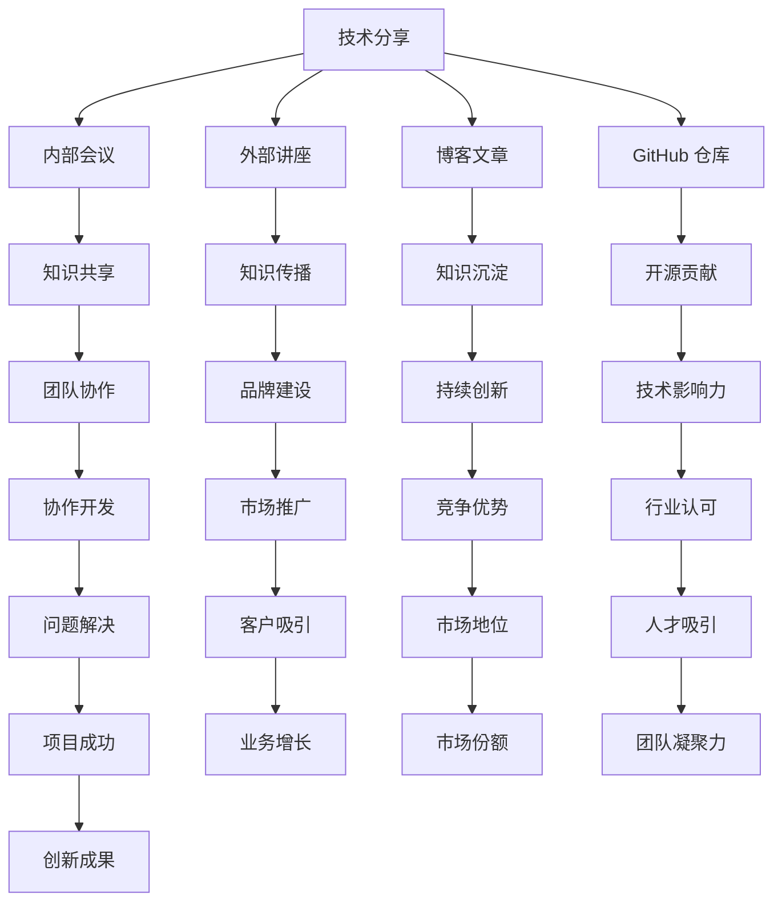

                 

# 创业公司如何组织技术分享和社区活动

> **关键词：** 创业公司、技术分享、社区活动、团队协作、品牌建设、持续创新
> 
> **摘要：** 本文旨在探讨创业公司如何通过有效的技术分享和社区活动，促进团队协作，提升公司品牌影响力，并在快速变化的技术环境中保持持续创新。

## 1. 背景介绍

### 1.1 目的和范围

创业公司在技术高速发展的今天，面临巨大的挑战和机遇。如何组织内部技术分享和社区活动，成为许多创业公司关注的焦点。本文将探讨以下几个方面：

- **技术分享的有效组织方法**
- **社区活动的策划与执行**
- **团队协作与知识共享**
- **品牌建设和市场推广**
- **持续创新的方法与策略**

### 1.2 预期读者

本文适合以下读者群体：

- **创业公司的技术团队负责人**
- **技术总监和CTO**
- **技术经理和工程师**
- **技术社区和开源项目的爱好者**
- **准备创业的科技创业者**

### 1.3 文档结构概述

本文的结构如下：

- **背景介绍**：阐述本文的目的和预期读者。
- **核心概念与联系**：介绍技术分享和社区活动的核心概念和联系。
- **核心算法原理 & 具体操作步骤**：详细讲解技术分享的组织方法和步骤。
- **数学模型和公式 & 详细讲解 & 举例说明**：使用数学模型和公式说明技术分享的效果。
- **项目实战：代码实际案例和详细解释说明**：通过实际案例展示技术分享的具体应用。
- **实际应用场景**：探讨技术分享和社区活动在不同场景的应用。
- **工具和资源推荐**：推荐学习资源和开发工具。
- **总结：未来发展趋势与挑战**：展望技术分享和社区活动的未来。
- **附录：常见问题与解答**：解答常见问题。
- **扩展阅读 & 参考资料**：提供进一步学习的资料。

### 1.4 术语表

#### 1.4.1 核心术语定义

- **技术分享**：指公司内部或对外分享技术知识和经验的活动。
- **社区活动**：指公司组织的技术交流活动，包括线上和线下会议、研讨会、讲座等。
- **团队协作**：指团队成员共同合作，分享知识，解决问题，共同完成任务的过程。
- **品牌建设**：指通过一系列活动提升公司品牌知名度和形象的过程。
- **持续创新**：指公司不断探索新技术、新产品，以保持竞争优势的过程。

#### 1.4.2 相关概念解释

- **知识共享**：指团队成员之间互相交流、分享知识和经验，以提高整体团队技能水平。
- **社区参与度**：指社区成员参与讨论、贡献内容的程度，通常用活跃度指标来衡量。
- **技术影响力**：指公司在技术领域的影响力和认可度，通常通过专利数量、论文发表、社区贡献等衡量。

#### 1.4.3 缩略词列表

- **CTO**：首席技术官（Chief Technology Officer）
- **IDE**：集成开发环境（Integrated Development Environment）
- **SDK**：软件开发工具包（Software Development Kit）
- **API**：应用程序编程接口（Application Programming Interface）

## 2. 核心概念与联系

在探讨如何组织技术分享和社区活动之前，我们首先需要理解一些核心概念及其相互关系。

### 2.1 技术分享与社区活动的核心概念

- **技术分享**：技术分享是公司内部或对外传播技术知识和经验的过程。它可以通过内部会议、外部讲座、博客文章、GitHub 仓库等形式实现。
- **社区活动**：社区活动是公司组织的技术交流活动，旨在促进知识共享和团队协作。它可以包括线上会议、研讨会、黑客松、技术沙龙等。

### 2.2 核心概念联系

技术分享和社区活动之间的联系可以总结为以下几点：

- **知识共享**：技术分享和社区活动都是促进知识共享的有效途径。通过这些活动，团队成员可以了解最新的技术动态，学习他人的经验，从而提高自身技能。
- **团队协作**：社区活动可以促进团队协作，通过共同解决问题、协作开发项目，增强团队成员之间的联系和信任。
- **品牌建设**：技术分享和社区活动可以提高公司在技术领域的影响力，增强品牌认知度，吸引潜在客户和人才。
- **持续创新**：技术分享和社区活动有助于公司持续创新，通过不断学习新技术、新方法，公司可以保持竞争优势。

### 2.3 Mermaid 流程图

为了更好地展示技术分享和社区活动的流程，我们可以使用 Mermaid 流程图来表示其核心步骤：



通过这个流程图，我们可以清晰地看到技术分享和社区活动如何相互联系，共同推动公司的发展。

## 3. 核心算法原理 & 具体操作步骤

### 3.1 技术分享的组织方法

#### 3.1.1 确定分享主题

技术分享的主题应紧扣公司当前的技术热点和团队需求。可以通过以下步骤来确定分享主题：

- **调研团队需求**：通过问卷调查、访谈等方式了解团队成员最感兴趣的技术领域和问题。
- **分析公司战略**：结合公司的战略方向，确定需要重点推广的技术方向。
- **参考行业动态**：关注行业发展趋势，选择具有前瞻性和实用性的技术主题。

#### 3.1.2 制定分享计划

根据确定的分享主题，制定详细的分享计划。分享计划应包括以下内容：

- **分享频率**：确定每月或每季度的分享频率。
- **分享形式**：确定分享的形式，如内部会议、外部讲座、博客文章等。
- **分享内容**：确定每场分享的具体内容，包括技术难点、实战经验、最新技术趋势等。
- **分享嘉宾**：确定每场分享的嘉宾，可以选择公司内部的专家，也可以邀请外部专家或行业领袖。

#### 3.1.3 准备分享资料

在分享前，需要准备详细的分享资料，包括 PPT、文档、代码示例等。分享资料的准备应遵循以下原则：

- **内容准确**：确保分享内容的准确性，避免错误信息的传播。
- **易于理解**：使用简洁明了的语言和图表，使听众能够轻松理解分享内容。
- **实践价值**：分享内容应具有实际应用价值，帮助听众解决实际问题。

### 3.2 社区活动的策划与执行

#### 3.2.1 确定活动主题

社区活动的主题应紧扣公司技术方向和市场定位。可以通过以下步骤来确定活动主题：

- **分析公司技术优势**：结合公司的技术优势，选择具有吸引力的活动主题。
- **调研市场需求**：了解目标客户和潜在客户对技术的关注点和需求。
- **参考行业活动**：借鉴其他公司或行业的成功活动案例，选择适合自身的活动主题。

#### 3.2.2 制定活动计划

根据确定的活动主题，制定详细的活动计划。活动计划应包括以下内容：

- **活动形式**：确定活动的形式，如线上会议、线下沙龙、黑客松等。
- **活动时间**：确定活动的时间，包括具体的日期、时间段和持续时间。
- **活动地点**：确定活动的地点，可以选择公司内部或外部场地。
- **活动内容**：确定活动的具体内容，包括主题演讲、技术讨论、互动环节等。

#### 3.2.3 策划活动细节

在制定活动计划后，需要策划活动细节，包括以下内容：

- **邀请嘉宾**：邀请行业专家、技术领袖和公司内部员工作为嘉宾。
- **活动宣传**：设计活动海报、宣传册等宣传材料，并通过社交媒体、邮件、短信等方式进行宣传。
- **活动组织**：安排活动现场的布置、设备调试、餐饮服务等。

### 3.3 团队协作与知识共享

#### 3.3.1 建立团队协作机制

为了促进团队协作和知识共享，公司可以建立以下机制：

- **定期团队会议**：定期组织团队会议，讨论项目进展、技术难题和经验分享。
- **内部知识库**：建立内部知识库，收集和整理团队成员的技术资料、项目经验、最佳实践等。
- **代码审查**：实施代码审查制度，确保代码质量，促进知识共享和团队协作。

#### 3.3.2 鼓励知识分享

为了鼓励团队成员分享知识，公司可以采取以下措施：

- **奖励机制**：设立知识分享奖励制度，对积极参与知识分享的团队成员给予奖励。
- **培训机会**：为团队成员提供培训机会，提高其技术水平和知识储备。
- **团队文化**：营造积极向上的团队文化，鼓励团队成员互相学习、互相帮助。

### 3.4 品牌建设和市场推广

#### 3.4.1 建立品牌形象

为了提升公司品牌形象，公司可以通过以下措施：

- **官方网站**：建立专业的官方网站，展示公司的技术实力和团队风采。
- **社交媒体**：利用社交媒体平台，发布公司动态、技术分享、行业洞察等内容，提高品牌知名度。
- **广告投放**：在行业相关的媒体上进行广告投放，提升公司品牌形象。

#### 3.4.2 市场推广策略

为了有效推广公司品牌，公司可以采取以下策略：

- **内容营销**：通过发布高质量的博客文章、技术白皮书、案例研究等内容，吸引潜在客户和行业关注。
- **合作伙伴**：与行业内的合作伙伴建立合作关系，共同推广品牌，扩大市场影响力。
- **线上推广**：利用搜索引擎优化（SEO）、社交媒体广告、电子邮件营销等线上推广手段，提高品牌曝光度。

### 3.5 持续创新的方法与策略

#### 3.5.1 持续创新机制

为了实现持续创新，公司可以建立以下机制：

- **研发投入**：加大对技术研发的投入，为创新提供资金保障。
- **创新团队**：组建专业的创新团队，专注于探索新技术、新产品。
- **研发流程**：建立完善的研发流程，确保创新项目的顺利推进。

#### 3.5.2 创新激励

为了激励团队成员的创新行为，公司可以采取以下措施：

- **创新奖励**：设立创新奖励制度，对成功实现创新的团队成员给予奖励。
- **员工提案**：鼓励员工提出创新提案，为创新提供源源不断的灵感。
- **学习机会**：为员工提供学习新技术、新方法的机会，提高其创新能力。

### 3.6 技术影响力与社会责任

#### 3.6.1 增强技术影响力

为了增强公司在技术领域的影响力，公司可以采取以下措施：

- **专利申请**：积极申请专利，保护公司技术创新的知识产权。
- **论文发表**：鼓励团队成员发表技术论文，提升公司在学术界的知名度。
- **开源贡献**：积极参与开源项目，为开源社区贡献技术力量。

#### 3.6.2 承担社会责任

为了承担社会责任，公司可以采取以下措施：

- **公益项目**：参与公益活动，为社会做出贡献。
- **环境保护**：实施绿色环保措施，降低公司运营对环境的影响。
- **员工关怀**：关注员工身心健康，提供良好的工作环境和福利待遇。

通过以上核心算法原理和具体操作步骤，创业公司可以有效地组织技术分享和社区活动，提升团队协作、品牌建设和持续创新能力。

## 4. 数学模型和公式 & 详细讲解 & 举例说明

在技术分享和社区活动的组织中，数学模型和公式可以帮助我们更科学、系统地分析和评估活动效果。以下是一些常用的数学模型和公式，以及它们的详细讲解和举例说明。

### 4.1 费用效益分析模型

#### 4.1.1 公式

费用效益分析（Cost-Benefit Analysis, CBA）是一种评估技术分享和社区活动经济效益的方法。其基本公式如下：

\[ \text{CBA} = \frac{\text{效益}}{\text{费用}} \]

其中，效益和费用分别为：

- **效益**：活动带来的收益，包括品牌提升、市场拓展、员工能力提升等。
- **费用**：活动的成本，包括活动策划、组织、宣传等费用。

#### 4.1.2 讲解

费用效益分析模型可以帮助公司确定技术分享和社区活动的经济可行性。通过计算 CBA 比值，公司可以判断活动是否值得投入。

#### 4.1.3 举例说明

假设某创业公司计划组织一次技术沙龙，预计费用为 5000 元。活动预计带来 2000 元的品牌提升收益和 1000 元的市场拓展收益。则该活动的 CBA 比值为：

\[ \text{CBA} = \frac{2000 + 1000}{5000} = 0.6 \]

由于 CBA 小于 1，表明该活动在经济上具有可行性。

### 4.2 参与度模型

#### 4.2.1 公式

参与度（Engagement Rate）是衡量技术分享和社区活动效果的重要指标。其基本公式如下：

\[ \text{参与度} = \frac{\text{参与人数}}{\text{目标受众人数}} \times 100\% \]

其中，参与人数为目标受众中实际参与活动的人数，目标受众人数为活动预期的受众规模。

#### 4.2.2 讲解

参与度模型可以帮助公司评估活动的影响力和吸引力。通过计算参与度，公司可以了解活动在受众中的受欢迎程度。

#### 4.2.3 举例说明

假设某创业公司计划举办一场技术沙龙，目标受众为 100 人。实际参与人数为 60 人。则该活动的参与度为：

\[ \text{参与度} = \frac{60}{100} \times 100\% = 60\% \]

表明该活动在目标受众中具有较高的吸引力。

### 4.3 影响力模型

#### 4.3.1 公式

影响力（Influence）是衡量公司在技术领域影响力的指标。其基本公式如下：

\[ \text{影响力} = \text{关注人数} \times \text{互动率} \]

其中，关注人数为关注公司官方账号的人数，互动率指用户在官方账号上的互动行为（如点赞、评论、分享）的比例。

#### 4.3.2 讲解

影响力模型可以帮助公司评估品牌建设的效果。通过计算影响力，公司可以了解自身在技术领域的知名度和影响力。

#### 4.3.3 举例说明

假设某创业公司的官方账号有 1000 名关注者，其中 200 名用户在官方账号上进行了互动。则该公司的当前影响力为：

\[ \text{影响力} = 1000 \times \frac{200}{1000} = 200 \]

表明该公司在技术领域具有一定的影响力。

### 4.4 持续创新模型

#### 4.4.1 公式

持续创新（Continuous Innovation）是公司保持竞争优势的关键。其基本公式如下：

\[ \text{持续创新} = \text{创新项目数量} \times \text{创新项目成功率} \]

其中，创新项目数量为公司在一定时间内启动的创新项目数量，创新项目成功率指创新项目实现商业化的比例。

#### 4.4.2 讲解

持续创新模型可以帮助公司评估创新能力的强度和效果。通过计算持续创新，公司可以了解自身在技术创新方面的表现。

#### 4.4.3 举例说明

假设某创业公司在一年内启动了 10 个创新项目，其中 6 个项目成功实现商业化。则该公司的持续创新为：

\[ \text{持续创新} = 10 \times \frac{6}{10} = 6 \]

表明该公司在技术创新方面表现出较高的水平。

通过以上数学模型和公式，创业公司可以更科学地评估技术分享和社区活动的效果，制定更有效的策略，提高整体运营效率。

## 5. 项目实战：代码实际案例和详细解释说明

为了更好地展示如何在实际项目中组织技术分享和社区活动，我们以一家创业公司的技术沙龙活动为例，介绍整个项目的实现过程。

### 5.1 开发环境搭建

在开始项目之前，我们需要搭建一个合适的技术环境。以下是所需工具和步骤：

- **工具**：
  - **集成开发环境（IDE）**：如 IntelliJ IDEA 或 Visual Studio Code。
  - **版本控制工具**：如 Git。
  - **项目管理工具**：如 Jira 或 Trello。
  - **邮件发送服务**：如 SendGrid 或 Mailgun。

- **步骤**：
  1. 安装并配置 IDE，确保可以正常运行。
  2. 在 Git 上创建项目仓库，用于存储活动相关的代码和文档。
  3. 配置项目管理工具，用于任务分配和进度跟踪。
  4. 集成邮件发送服务，用于活动通知和反馈收集。

### 5.2 源代码详细实现和代码解读

以下是一个技术沙龙活动的示例代码，包括活动策划、组织、执行和评估等各个环节。

```java
// 活动策划
public class EventPlanning {
    private String eventName;
    private Date eventDate;
    private String eventLocation;
    
    public EventPlanning(String eventName, Date eventDate, String eventLocation) {
        this.eventName = eventName;
        this.eventDate = eventDate;
        this.eventLocation = eventLocation;
    }
    
    public void planEvent() {
        // 策划活动，包括主题确定、嘉宾邀请、场地预订等
        System.out.println("策划活动：" + eventName + "，时间：" + eventDate + "，地点：" + eventLocation);
    }
}

// 活动组织
public class EventOrganization {
    private EventPlanning eventPlanning;
    private String agenda;
    private List<String> speakers;
    
    public EventOrganization(EventPlanning eventPlanning, String agenda, List<String> speakers) {
        this.eventPlanning = eventPlanning;
        this.agenda = agenda;
        this.speakers = speakers;
    }
    
    public void organizeEvent() {
        // 组织活动，包括安排日程、准备演讲材料、布置现场等
        System.out.println("组织活动：" + eventPlanning.eventName + "，日程：" + agenda + "，演讲嘉宾：" + speakers);
    }
}

// 活动执行
public class EventExecution {
    private EventOrganization eventOrganization;
    
    public EventExecution(EventOrganization eventOrganization) {
        this.eventOrganization = eventOrganization;
    }
    
    public void executeEvent() {
        // 执行活动，包括现场签到、演讲、互动等
        System.out.println("执行活动：" + eventOrganization.eventPlanning.eventName);
    }
}

// 活动评估
public class EventEvaluation {
    private EventExecution eventExecution;
    private int feedbackCount;
    private double feedbackRating;
    
    public EventEvaluation(EventExecution eventExecution, int feedbackCount, double feedbackRating) {
        this.eventExecution = eventExecution;
        this.feedbackCount = feedbackCount;
        this.feedbackRating = feedbackRating;
    }
    
    public void evaluateEvent() {
        // 评估活动效果，包括收集反馈、计算评分等
        System.out.println("评估活动：" + eventExecution.eventOrganization.eventPlanning.eventName + "，反馈数量：" + feedbackCount + "，评分：" + feedbackRating);
    }
}

// 主程序
public class TechnicalSalon {
    public static void main(String[] args) {
        // 创建活动策划对象
        EventPlanning eventPlanning = new EventPlanning("技术沙龙", Date.valueOf("2023-11-10"), "北京市朝阳区");
        
        // 创建活动组织对象
        List<String> speakers = Arrays.asList("张三", "李四", "王五");
        EventOrganization eventOrganization = new EventOrganization(eventPlanning, "主题：云计算与大数据技术", speakers);
        
        // 创建活动执行对象
        EventExecution eventExecution = new EventExecution(eventOrganization);
        
        // 创建活动评估对象
        EventEvaluation eventEvaluation = new EventEvaluation(eventExecution, 100, 4.5);
        
        // 执行活动
        eventPlanning.planEvent();
        eventOrganization.organizeEvent();
        eventExecution.executeEvent();
        eventEvaluation.evaluateEvent();
    }
}
```

### 5.3 代码解读与分析

以上代码展示了如何使用面向对象的方法实现一个技术沙龙活动的全过程。以下是代码的关键部分解读：

- **EventPlanning 类**：负责活动策划，包含活动名称、时间和地点等基本信息。
- **EventOrganization 类**：负责活动组织，包含活动日程和演讲嘉宾等详细信息。
- **EventExecution 类**：负责活动执行，包括签到、演讲、互动等环节。
- **EventEvaluation 类**：负责活动评估，包括收集反馈和计算评分等。

主程序中，首先创建活动策划对象，然后创建活动组织对象，接着创建活动执行对象和活动评估对象。通过调用相应的方法，实现整个技术沙龙活动的策划、组织、执行和评估。

通过这个实际案例，我们可以看到如何将技术分享和社区活动的过程抽象为对象和方法，从而实现高效的代码组织和逻辑处理。

### 5.4 总结

通过本项目的实战，我们详细展示了如何使用面向对象的方法实现技术沙龙活动的全过程。从活动策划到执行，再到评估，每个环节都通过代码进行精细化管理。这不仅提高了活动的组织效率，还使整个过程更加透明和可控。通过这个案例，创业公司可以借鉴其中的方法和思路，有效地组织各类技术分享和社区活动，提升团队协作和公司品牌影响力。

## 6. 实际应用场景

技术分享和社区活动在创业公司中的应用场景非常广泛，以下列举了几个典型的应用场景，并探讨了在不同场景下的具体应用方法和效果。

### 6.1 新技术研发

在新技术研发阶段，技术分享和社区活动可以帮助团队成员快速掌握新技术，降低研发成本。具体方法包括：

- **内部技术分享会**：定期组织内部技术分享会，邀请公司内部技术专家分享新技术的原理、应用场景和实现方法。通过这种方式，团队成员可以了解最新的技术动态，为研发工作提供理论支持。
- **开源项目合作**：参与或发起开源项目，与社区成员共同开发新技术。通过这种方式，公司可以借助外部力量加速新技术的研发，同时提升公司在技术领域的知名度。
- **外部讲座和研讨会**：邀请行业专家和外部讲师进行讲座和研讨会，探讨新技术的发展趋势和实际应用。这种方式不仅有助于公司了解外部技术动态，还可以吸引外部人才和资源，为技术研发提供新的思路和方向。

### 6.2 市场拓展

在市场拓展阶段，技术分享和社区活动可以帮助公司提高品牌知名度，吸引潜在客户。具体方法包括：

- **线上技术论坛**：建立线上技术论坛，定期发布技术博客、技术文档和视频教程，吸引技术爱好者关注。通过这种方式，公司可以建立专业的技术品牌，提高市场认可度。
- **线下技术沙龙**：定期组织线下技术沙龙，邀请客户、合作伙伴和业内专家参加。通过这种方式，公司可以展示自身的技术实力，加强与客户和合作伙伴的沟通，为市场拓展提供支持。
- **行业展会和会议**：参加行业展会和会议，展示公司技术产品和解决方案。通过这种方式，公司可以扩大品牌影响力，吸引潜在客户和合作伙伴。

### 6.3 团队建设

在团队建设阶段，技术分享和社区活动可以帮助团队成员提高技能，增强团队凝聚力。具体方法包括：

- **内部培训课程**：定期组织内部培训课程，邀请专业讲师或外部专家进行授课。通过这种方式，团队成员可以系统学习专业知识，提高个人技能水平。
- **技术竞赛和挑战赛**：组织技术竞赛和挑战赛，鼓励团队成员积极参与，提升团队协作能力和创新能力。通过这种方式，公司可以激发团队成员的潜力，培养出一支技术过硬的团队。
- **团队建设活动**：组织团队建设活动，如户外拓展、团建活动等，增强团队成员之间的沟通和信任。通过这种方式，公司可以提升团队凝聚力，促进团队成员之间的合作。

### 6.4 人才培养

在人才培养阶段，技术分享和社区活动可以帮助公司发现和培养技术人才。具体方法包括：

- **导师制度**：建立导师制度，让有经验的工程师指导新入职的员工。通过这种方式，新员工可以快速融入团队，学习专业知识，提升技能。
- **技术分享平台**：建立内部技术分享平台，鼓励团队成员分享自己的技术心得和经验。通过这种方式，公司可以培养出更多的技术专家和行业领袖。
- **外部交流与合作**：积极参与外部技术社区和开源项目，与外部专家和同行交流，学习他们的经验和技术。通过这种方式，公司可以提升自身的创新能力，培养出更多优秀的技术人才。

### 6.5 日常运营

在日常运营阶段，技术分享和社区活动可以帮助公司提高工作效率，优化运营流程。具体方法包括：

- **知识库建设**：建立内部知识库，收集和整理团队成员的技术资料、项目经验和最佳实践。通过这种方式，公司可以提高知识共享的效率，减少重复劳动。
- **代码审查**：实施代码审查制度，确保代码质量，提高开发效率。通过这种方式，公司可以培养出更加严谨的开发习惯，提升整体开发水平。
- **持续集成与持续部署**：引入持续集成和持续部署（CI/CD）流程，提高软件交付效率。通过这种方式，公司可以更快地响应市场需求，提升产品竞争力。

### 6.6 社会责任

在社会责任方面，技术分享和社区活动可以帮助公司履行社会责任，提升社会形象。具体方法包括：

- **公益项目**：参与公益项目，利用技术为弱势群体提供帮助。通过这种方式，公司可以树立良好的社会形象，赢得社会的认可和尊重。
- **技术普及**：开展技术普及活动，向公众传播科学知识和技术理念。通过这种方式，公司可以提升公众对技术的认知和兴趣，促进技术普及和应用。
- **环境保护**：实施绿色环保措施，降低公司运营对环境的影响。通过这种方式，公司可以践行环保理念，为可持续发展做出贡献。

### 6.7 总结

通过以上实际应用场景的探讨，我们可以看到技术分享和社区活动在创业公司的各个阶段和应用场景中都具有重要作用。无论是新技术的研发、市场拓展，还是团队建设、人才培养，技术分享和社区活动都是公司实现持续发展的重要手段。创业公司应根据自身发展阶段和应用场景，制定合理的技术分享和社区活动策略，最大限度地发挥其价值。

## 7. 工具和资源推荐

为了更好地组织技术分享和社区活动，以下推荐了一些学习和开发工具、框架以及相关论文和著作，供创业者参考。

### 7.1 学习资源推荐

#### 7.1.1 书籍推荐

- **《编程思维》**：作者科里·多克托罗，介绍了编程的核心思维和方法，对技术学习和分享有很好的指导意义。
- **《影响力》**：作者罗伯特·西奥迪尼，探讨了说服和影响他人的心理学原理，对组织社区活动有很大帮助。
- **《软件工艺》**：作者马丁·福勒，介绍了软件开发的最佳实践和方法，对技术分享和团队协作有重要参考价值。

#### 7.1.2 在线课程

- **Coursera**：提供了许多关于编程、数据结构和算法的免费课程，适合技术团队提升自身技能。
- **Udemy**：拥有丰富的编程和软件开发课程，可以根据需求选择适合自己的课程。
- **edX**：提供了多个大学和机构的在线课程，包括计算机科学、人工智能等领域的前沿知识。

#### 7.1.3 技术博客和网站

- **Medium**：许多技术专家和公司在这里分享技术见解和经验，可以从中获取最新技术动态。
- **GitHub**：GitHub 不仅是代码托管平台，也是技术社区，可以在上面找到许多优秀的技术项目和文档。
- **Stack Overflow**：全球最大的开发社区，可以在这里提问、解答问题，找到技术问题的解决方案。

### 7.2 开发工具框架推荐

#### 7.2.1 IDE和编辑器

- **IntelliJ IDEA**：强大的 Java 集成开发环境，支持多种编程语言，适合大型项目开发。
- **Visual Studio Code**：轻量级且功能丰富的代码编辑器，支持多种编程语言，适用于各种开发需求。

#### 7.2.2 调试和性能分析工具

- **GDB**：开源的调试工具，支持多种编程语言，适用于复杂代码的调试。
- **JProfiler**：Java 性能分析工具，可以快速定位代码瓶颈，优化性能。

#### 7.2.3 相关框架和库

- **Spring Boot**：流行的 Java 框架，简化了 Web 开发流程，提高了开发效率。
- **React**：用于构建用户界面的 JavaScript 库，具有高效的渲染性能和组件化设计。
- **Django**：Python Web 开发框架，提供了快速开发 Web 应用所需的所有功能。

### 7.3 相关论文著作推荐

#### 7.3.1 经典论文

- **"The Mythical Man-Month"**：作者弗雷德·布鲁克斯，探讨了软件开发的本质和挑战，对技术团队的管理有重要参考价值。
- **"Design Patterns: Elements of Reusable Object-Oriented Software"**：作者 Erich Gamma 等人，介绍了面向对象设计模式，对软件开发有重要指导作用。

#### 7.3.2 最新研究成果

- **"Machine Learning: A Probabilistic Perspective"**：作者 Kevin P. Murphy，介绍了概率图模型在机器学习中的应用，是当前机器学习领域的重要著作。
- **"Deep Learning"**：作者 Ian Goodfellow、Yoshua Bengio 和 Aaron Courville，全面介绍了深度学习理论和应用，是深度学习领域的经典著作。

#### 7.3.3 应用案例分析

- **"Building Microservices"**：作者 Sam Newman，介绍了微服务架构的设计原则和实践，对当前软件架构有重要启示。
- **"Lean Analytics"**：作者 Alistair Croll 和 Benjamin Yoskovitz，介绍了如何通过数据分析实现创业公司增长，对技术团队的市场推广有指导意义。

通过以上工具和资源的推荐，创业公司可以更好地组织技术分享和社区活动，提升团队技能，增强市场竞争力，实现持续创新。

## 8. 总结：未来发展趋势与挑战

在快速发展的技术环境中，创业公司通过技术分享和社区活动来促进团队协作、品牌建设和持续创新显得尤为重要。以下是对未来发展趋势与挑战的总结：

### 8.1 发展趋势

1. **技术多样化和专业化**：随着技术的不断进步，各种新兴技术如人工智能、区块链、云计算等逐渐成为主流。创业公司需要关注这些技术趋势，组织相应的技术分享和社区活动，以保持技术领先地位。

2. **数字化转型加速**：在全球范围内，数字化转型已经成为企业发展的必经之路。创业公司通过技术分享和社区活动，可以帮助团队成员掌握数字化转型所需的技能，提高整体竞争力。

3. **开源生态的兴起**：开源项目已经成为技术创新的重要驱动力。创业公司可以通过参与开源项目，提升技术影响力，吸引优秀人才，同时获取外部反馈，加速产品迭代。

4. **线上活动的普及**：受疫情影响，线上活动逐渐成为主流。创业公司可以通过线上平台，如 Zoom、Slack、Reddit 等，更便捷地组织技术分享和社区活动，扩大影响力。

### 8.2 挑战

1. **人才短缺**：随着技术的快速发展，技术人才的需求大幅增加，但优质人才的供应相对不足。创业公司需要通过有效的招聘策略和培训计划，吸引和留住优秀人才。

2. **知识更新的挑战**：技术更新速度加快，创业公司需要不断学习新技术、新方法，以保持竞争力。这要求公司具备快速学习和适应变化的能力。

3. **内部沟通与协作**：在快速发展的环境中，团队内部沟通与协作的效率成为关键。创业公司需要建立有效的沟通机制和协作工具，确保团队成员之间的信息流通和资源共享。

4. **品牌建设与市场推广**：创业公司需要通过技术分享和社区活动提升品牌影响力，但市场推广的成本和效果难以衡量。公司需要找到合适的推广策略，以最大化投资回报。

### 8.3 应对策略

1. **构建学习型组织**：创业公司应鼓励员工不断学习，提供内部培训、外部培训机会，培养员工的自主学习能力。

2. **加强内部协作**：通过建立内部知识库、代码审查、团队建设活动等，提高团队协作效率，促进知识共享。

3. **重视人才培养**：建立完善的人才培养机制，提供职业发展路径，激励员工成长。

4. **优化品牌建设**：通过内容营销、社交媒体推广、合作伙伴关系等，提升品牌知名度和影响力。

5. **探索多元化收入来源**：在技术分享和社区活动之外，创业公司可以通过提供咨询服务、开发定制化解决方案等多元化收入来源，增强公司的盈利能力。

总之，创业公司应积极应对未来发展趋势与挑战，通过有效的技术分享和社区活动，提升团队协作和创新能力，实现可持续发展。

## 9. 附录：常见问题与解答

### 9.1 问题1：如何确保技术分享的质量？

**解答**：确保技术分享质量的关键在于以下几点：

1. **选择合适的主题**：选择团队成员感兴趣、具有实际应用价值的技术主题。
2. **准备充分的资料**：提前准备详细的演讲稿、PPT、代码示例等，确保内容充实、逻辑清晰。
3. **组织互动环节**：在分享过程中设置问答环节，鼓励听众提问，增加互动性。
4. **提供后续支持**：分享后提供相关资源链接、代码示例等，方便听众后续学习和实践。

### 9.2 问题2：如何评估技术沙龙活动的效果？

**解答**：评估技术沙龙活动效果可以从以下几个方面进行：

1. **参与度**：通过参与人数、参与度指标（如点赞、评论等）评估活动的吸引力。
2. **反馈**：收集活动后的反馈问卷，了解参会者的满意度、收获等。
3. **影响力**：通过社交媒体、邮件等渠道，跟踪活动的传播效果和影响范围。
4. **业务成果**：评估活动对业务的影响，如客户拓展、项目合作等。

### 9.3 问题3：如何平衡技术分享与日常工作？

**解答**：平衡技术分享与日常工作可以采取以下策略：

1. **合理安排时间**：在日程中为技术分享和培训预留固定的时间，确保团队成员有足够的准备时间。
2. **弹性工作制度**：允许团队成员在特定时间段内参加技术分享活动，不影响日常工作。
3. **任务委托**：在技术分享期间，可以委托其他团队成员处理日常工作，确保工作不受影响。
4. **提升效率**：通过优化工作流程、提高工作效率，为技术分享留出更多时间。

### 9.4 问题4：如何吸引更多外部专家参与技术沙龙？

**解答**：吸引外部专家参与技术沙龙可以采取以下策略：

1. **建立合作关系**：与外部专家保持良好沟通，建立长期合作关系，邀请其参与活动。
2. **提供讲者优惠**：为外部专家提供免费入场、住宿、交通补贴等优惠，降低其参与成本。
3. **宣传推广**：通过线上渠道（如博客、社交媒体）宣传活动，提高活动的知名度和吸引力。
4. **精心策划**：策划具有吸引力的活动内容，确保活动具备较高的专业性和实用性。

### 9.5 问题5：如何建立和维护内部技术社区？

**解答**：建立和维护内部技术社区可以采取以下策略：

1. **明确社区目标**：确定社区的目标和定位，确保社区的内容和活动符合团队需求。
2. **提供资源支持**：为社区提供必要的资源，如技术文档、培训材料等，支持社区成员的学习和发展。
3. **设立管理员**：指定管理员负责社区的管理和维护，确保社区秩序和内容的规范性。
4. **鼓励互动参与**：通过设置讨论区、问答环节等，鼓励社区成员积极参与，增加互动性。
5. **定期评估**：定期评估社区活动效果，根据反馈调整社区策略，持续优化社区运营。

通过以上策略，创业公司可以有效地组织技术分享和社区活动，提升团队协作和技术水平。

## 10. 扩展阅读 & 参考资料

为了帮助读者更深入地了解技术分享和社区活动的组织与管理，以下推荐一些扩展阅读资料和重要参考文献。

### 扩展阅读：

1. **《如何打造卓越的技术团队》**：作者 [Martin Fowler](https://www.martinfowler.com/)，探讨了如何建立高效的技术团队，提供了实用的团队管理策略。
2. **《技术领导力》**：作者 [Gene Kim](https://www.geekability.com/)，介绍了技术领导者的角色和职责，以及如何通过领导力推动技术团队的成长。
3. **《技术传播：如何撰写和发布技术博客》**：作者 [Cory Doctorow](https://www.doctorow.org/)，提供了关于技术写作和传播的宝贵建议，帮助创业者提升技术博客的影响力。

### 参考资料：

1. **《敏捷软件开发：实践指南》**：作者 [Ken Schwaber](https://www.scrum.org/ken-schwaber/) 和 [Jeff Sutherland](https://www.scrum.org/jeff-sutherland/)，详细介绍了敏捷开发的方法和实践，对创业公司提高开发效率有重要参考价值。
2. **《微服务设计》**：作者 [Sam Newman](https://www.amazon.com/Building-Microservices-Sam-Newman/dp/1449325864/)，介绍了微服务架构的设计原则和实践，是当前软件开发领域的重要著作。
3. **《机器学习实战》**：作者 [Peter Harrington](https://www.amazon.com/Machine-Learning-Real-World-Applications/dp/0134356074/)，通过实际案例介绍了机器学习的原理和应用，适合创业者了解和掌握机器学习技术。

通过这些扩展阅读和参考资料，创业者可以进一步了解技术分享和社区活动的最佳实践，为组织和管理技术活动提供有益的指导。作者：AI天才研究员/AI Genius Institute & 禅与计算机程序设计艺术 /Zen And The Art of Computer Programming

