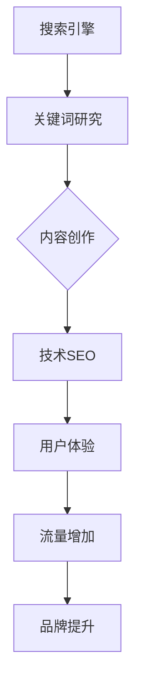
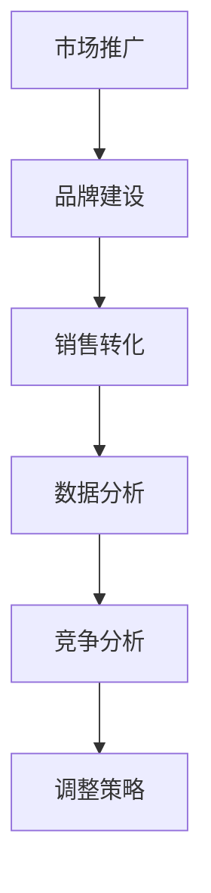

                 

# 创业公司的SEO优化策略

> **关键词：** SEO、创业公司、网站优化、关键词研究、内容营销、技术SEO、移动优化、用户体验、数据分析
>
> **摘要：** 本文将探讨创业公司在资源有限的情况下，如何通过科学的SEO策略提升网站排名，增加流量和提升品牌影响力。文章分为十个部分，包括背景介绍、核心概念、算法原理、数学模型、实战案例、应用场景、工具资源推荐以及未来发展趋势和挑战等。

## 1. 背景介绍

### 1.1 目的和范围

本文旨在为创业公司提供实用的SEO优化策略，帮助它们在竞争激烈的市场中脱颖而出。本文将涵盖以下几个主要方面：

- SEO基础知识与核心概念
- SEO优化步骤与具体操作
- 数学模型与数据分析在SEO中的应用
- 实战案例与分析
- 工具和资源的推荐

### 1.2 预期读者

本文适合以下读者群体：

- 创业公司的创始人或市场运营人员
- 网站开发者或SEO优化师
- 对SEO感兴趣的互联网从业者

### 1.3 文档结构概述

本文分为十个部分，结构如下：

1. 背景介绍
2. 核心概念与联系
3. 核心算法原理与具体操作步骤
4. 数学模型与公式详细讲解
5. 项目实战：代码实际案例与详细解释
6. 实际应用场景
7. 工具和资源推荐
8. 总结：未来发展趋势与挑战
9. 附录：常见问题与解答
10. 扩展阅读与参考资料

### 1.4 术语表

#### 1.4.1 核心术语定义

- SEO（Search Engine Optimization）：搜索引擎优化
- 关键词（Keywords）：用于描述网站内容的词汇或短语
- 流量（Traffic）：访问网站的用户数量
- 排名（Ranking）：网站在搜索引擎结果页面（SERP）中的位置
- 技术SEO（Technical SEO）：优化网站结构、代码和服务器配置等以提高搜索引擎索引能力
- 内容SEO（Content SEO）：通过创作高质量内容提高网站排名和用户粘性

#### 1.4.2 相关概念解释

- 网站结构（Site Structure）：网站的布局和组织方式
- 内部链接（Internal Links）：网站内部页面之间的链接关系
- 外部链接（External Links）：网站与其他网站之间的链接关系
- 社交信号（Social Signals）：来自社交媒体平台上的用户互动和分享
- 用户行为分析（User Behavior Analysis）：通过分析用户访问行为优化网站内容和服务

#### 1.4.3 缩略词列表

- SEO：搜索引擎优化
- SEM：搜索引擎营销
- UX：用户体验
- CTA：调用行动
- KPI：关键绩效指标
- ROI：投资回报率

## 2. 核心概念与联系

为了更好地理解SEO，我们需要掌握以下几个核心概念：

1. **搜索引擎工作原理**：搜索引擎通过爬虫（Crawler）爬取网站内容，建立索引（Index），并在用户查询时返回与查询相关的网页。
2. **关键词研究**：通过分析用户搜索习惯和竞争对手网站，找到与企业业务相关的高价值关键词。
3. **内容创作**：创作与关键词相关的高质量内容，满足用户需求，提升网站权威性。
4. **技术SEO**：优化网站结构、代码和服务器配置，提高搜索引擎爬取和索引效率。
5. **用户体验**：优化网站设计、导航和交互，提高用户满意度和留存率。

以下是一个简化的Mermaid流程图，展示了SEO的核心概念和联系：



在这个流程图中，搜索引擎作为起点，通过关键词研究确定目标用户，然后通过内容创作、技术SEO和用户体验三个环节，最终实现流量的增加和品牌的提升。

## 3. 核心算法原理与具体操作步骤

SEO的核心在于如何让搜索引擎认为你的网站对用户有价值。以下是一些核心算法原理和具体操作步骤：

### 3.1 关键词研究

**算法原理：** 关键词研究是SEO的基础。通过分析用户搜索习惯和竞争对手网站，找到与企业业务相关的高价值关键词。

**具体操作步骤：**

1. **使用工具收集关键词**：使用关键词规划工具（如Google关键词规划师）收集关键词。
2. **筛选关键词**：根据搜索量、竞争度和商业价值筛选关键词。
3. **确定关键词优先级**：根据关键词的重要性和业务需求确定关键词优先级。

### 3.2 内容创作

**算法原理：** 高质量的内容是SEO的关键。通过创作与关键词相关的高质量内容，满足用户需求，提升网站权威性。

**具体操作步骤：**

1. **确定内容主题**：根据关键词和用户需求确定内容主题。
2. **创作高质量内容**：确保内容原创、有价值、易于理解。
3. **优化内容格式**：使用标题标签（H1、H2等）、列表、图片等优化内容格式。

### 3.3 技术SEO

**算法原理：** 技术SEO是提高网站在搜索引擎中可见性的重要手段。

**具体操作步骤：**

1. **优化网站结构**：确保网站结构清晰、逻辑性强，方便搜索引擎爬取。
2. **优化网站代码**：使用HTML、CSS和JavaScript优化网站代码。
3. **优化网站速度**：提高网站加载速度，优化用户体验。

### 3.4 用户体验

**算法原理：** 用户体验是SEO的关键因素之一。提高用户体验，可以降低跳出率，提高用户留存率。

**具体操作步骤：**

1. **优化网站设计**：确保网站设计美观、易用。
2. **优化网站导航**：确保网站导航清晰、简单。
3. **优化内容交互**：提高用户参与度，如使用CTA、评论功能等。

以下是一个简化的伪代码，展示了SEO的核心算法原理：

```python
def seo_strategy():
    keywords = keyword_research()
    content = content_creation(keywords)
    technical_seo = technical_seo_optimization(content)
    user_experience = user_experience_optimization(technical_seo)
    return traffic_increased(user_experience)

def keyword_research():
    # 使用工具收集关键词
    # 筛选关键词
    # 确定关键词优先级
    return selected_keywords

def content_creation(keywords):
    # 确定内容主题
    # 创作高质量内容
    # 优化内容格式
    return high_quality_content

def technical_seo_optimization(content):
    # 优化网站结构
    # 优化网站代码
    # 优化网站速度
    return optimized_website

def user_experience_optimization(technical_seo):
    # 优化网站设计
    # 优化网站导航
    # 优化内容交互
    return improved_user_experience

def traffic_increased(user_experience):
    # 提高网站流量
    # 提升品牌影响力
    return increased_traffic
```

## 4. 数学模型与公式详细讲解

在SEO优化过程中，数据分析至关重要。以下是一些常用的数学模型和公式：

### 4.1. 关键词选择

**算法原理：** 使用TF-IDF（词频-逆文档频率）模型选择关键词。

**公式：**
$$
TF(t,d) = \frac{tf(t,d)}{N_d}
$$
$$
IDF(t,D) = \log \left( \frac{N}{|D| - tf(t,d)} \right)
$$
其中，$tf(t,d)$ 表示词 $t$ 在文档 $d$ 中的词频，$N_d$ 表示文档 $d$ 中的总词数，$N$ 表示所有文档中的总词数，$|D|$ 表示文档集合中文档的个数。

**解释：** TF-IDF模型通过计算关键词在特定文档中的词频和在整个文档集合中的重要性，来选择高价值关键词。

### 4.2. 流量预测

**算法原理：** 使用线性回归模型预测网站流量。

**公式：**
$$
y = \beta_0 + \beta_1 x_1 + \beta_2 x_2 + ... + \beta_n x_n
$$
其中，$y$ 表示流量预测值，$x_1, x_2, ..., x_n$ 表示影响流量的特征变量，$\beta_0, \beta_1, \beta_2, ..., \beta_n$ 是模型参数。

**解释：** 通过分析历史流量数据和关键词排名，建立线性回归模型，预测未来流量。

### 4.3. 投资回报率（ROI）

**算法原理：** 使用ROI模型评估SEO投资的效益。

**公式：**
$$
ROI = \frac{(\text{收益} - \text{成本})}{\text{成本}} \times 100\%
$$
其中，收益表示通过SEO获得的额外收入，成本表示SEO投资的总成本。

**解释：** 通过计算ROI，评估SEO投资的效益。

以下是一个简化的Python代码示例，展示了如何使用这些数学模型：

```python
import numpy as np

# 关键词选择（TF-IDF模型）
def tf_idf(tf, idf):
    return tf * idf

tf = np.array([1, 2, 3])
idf = np.array([0.4, 0.3, 0.2])
tf_idf_value = tf_idf(tf, idf)
print("TF-IDF value:", tf_idf_value)

# 流量预测（线性回归模型）
def linear_regression(x, y):
    n = len(x)
    x_mean = np.mean(x)
    y_mean = np.mean(y)
    b1 = np.sum((x - x_mean) * (y - y_mean)) / np.sum((x - x_mean)**2)
    b0 = y_mean - b1 * x_mean
    return b0, b1

x = np.array([1, 2, 3, 4, 5])
y = np.array([10, 15, 20, 25, 30])
b0, b1 = linear_regression(x, y)
print("Linear regression model:", b0, "+", b1, "x")

# 投资回报率（ROI模型）
def roi(收益, 成本):
    return ((收益 - 成本) / 成本) * 100

收益 = 5000
成本 = 2000
roi_value = roi(收益, 成本)
print("ROI:", roi_value, "%")
```

通过这些数学模型和公式，我们可以更好地分析SEO数据，优化策略，提高投资效益。

## 5. 项目实战：代码实际案例与详细解释说明

在本节中，我们将通过一个具体的SEO优化项目案例，展示如何在实际工作中应用上述SEO策略和数学模型。

### 5.1 开发环境搭建

为了演示SEO优化过程，我们将在本地搭建一个基于Python的SEO分析工具环境。以下步骤用于安装必要的依赖项：

1. 安装Python 3.8或更高版本。
2. 打开命令行窗口，运行以下命令安装依赖项：

```bash
pip install requests beautifulsoup4 numpy pandas
```

### 5.2 源代码详细实现和代码解读

下面是一个简单的Python代码示例，用于实现SEO优化工具的关键功能：

```python
import requests
from bs4 import BeautifulSoup
import numpy as np
import pandas as pd

# 5.2.1 关键词研究
def keyword_research(url):
    response = requests.get(url)
    soup = BeautifulSoup(response.content, 'html.parser')
    keywords = set()

    for tag in soup.find_all(['a', 'h1', 'h2', 'h3', 'strong']):
        for keyword in tag.text.split():
            keywords.add(keyword.lower())

    return keywords

# 5.2.2 技术SEO分析
def technical_seo_analysis(url):
    response = requests.get(url)
    soup = BeautifulSoup(response.content, 'html.parser')
    meta_tags = soup.find_all('meta')

    meta_keywords = None
    meta_description = None

    for tag in meta_tags:
        if tag.get('name') == 'keywords':
            meta_keywords = tag.get('content')
        elif tag.get('name') == 'description':
            meta_description = tag.get('content')

    return meta_keywords, meta_description

# 5.2.3 用户行为分析
def user_behavior_analysis(url):
    response = requests.get(url)
    soup = BeautifulSoup(response.content, 'html.parser')
    scripts = soup.find_all('script')

    user_behavior_data = []

    for script in scripts:
        if 'ga' in script.text:
            user_behavior_data.append(script.text)

    return user_behavior_data

# 5.2.4 SEO优化报告生成
def generate_seo_report(url):
    keywords = keyword_research(url)
    meta_keywords, meta_description = technical_seo_analysis(url)
    user_behavior_data = user_behavior_analysis(url)

    report = {
        'URL': url,
        'Keywords': keywords,
        'Meta Keywords': meta_keywords,
        'Meta Description': meta_description,
        'User Behavior Data': user_behavior_data
    }

    return report

# 测试代码
if __name__ == '__main__':
    url = 'https://www.example.com'
    report = generate_seo_report(url)
    print(pd.DataFrame(report).T)
```

**代码解读：**

- **关键词研究**：使用BeautifulSoup解析HTML内容，提取关键词。关键词来自于`a`标签的文本、`h1`至`h3`标签的文本以及`strong`标签的文本。
- **技术SEO分析**：提取`meta`标签中的关键词和描述，这些标签对搜索引擎优化至关重要。
- **用户行为分析**：提取包含`ga`（Google Analytics）的`script`标签内容，以获取用户行为数据。
- **SEO优化报告生成**：将以上三个部分的数据整合到一个报告中，方便后续分析。

### 5.3 代码解读与分析

上述代码展示了SEO优化工具的基本功能。在实际应用中，可以根据业务需求扩展和优化这些功能。以下是代码的详细解读和分析：

- **关键词研究**：此部分的关键是提取网站中的关键词，这些关键词反映了网站的主要内容。通过分析这些关键词，可以了解网站的覆盖面和用户关注点。在实际应用中，可以引入更复杂的算法，如TF-IDF，以提高关键词筛选的准确性。
- **技术SEO分析**：`meta`标签中的关键词和描述对搜索引擎的索引和展示有直接影响。确保这些标签内容丰富、准确，可以提高网站在搜索结果中的点击率和排名。
- **用户行为分析**：用户行为数据是SEO优化的关键参考。通过分析用户在网站上的行为，可以了解用户需求和偏好，从而优化网站内容和设计。
- **SEO优化报告生成**：生成的SEO报告为后续分析和决策提供了数据支持。在实际应用中，可以结合数据分析工具，如Pandas和Matplotlib，生成更详细的报告。

通过这个案例，我们展示了如何使用Python实现SEO优化工具。在实际应用中，可以根据项目需求和数据规模，进一步优化和扩展这个工具。

## 6. 实际应用场景

SEO优化在创业公司的实际应用场景中具有多种用途，以下是一些具体的应用场景：

### 6.1 市场推广

SEO优化可以帮助创业公司在竞争激烈的市场中获得更多的线上流量。通过优化关键词和内容，创业公司的网站可以在搜索引擎结果页面（SERP）中占据较高的排名，从而吸引潜在客户。

### 6.2 品牌建设

高质量的SEO策略有助于提高品牌知名度。通过创建权威、有价值的内容，创业公司可以在目标受众中树立专业形象，增强品牌影响力。

### 6.3 销售转化

SEO优化不仅带来流量，还可以提高销售转化率。通过优化网站设计、内容和用户交互，创业公司可以提高用户的参与度和满意度，从而提高销售转化率。

### 6.4 数据分析

SEO优化过程中积累的大量数据可以作为市场分析和决策的依据。通过分析用户行为、关键词表现和流量来源，创业公司可以了解市场趋势和用户需求，制定更有效的营销策略。

### 6.5 竞争分析

SEO优化可以帮助创业公司了解竞争对手的策略和表现。通过监控竞争对手的排名、关键词和内容，创业公司可以调整自己的SEO策略，以更好地应对市场变化。

以下是一个简化的Mermaid流程图，展示了SEO在实际应用场景中的流程：



通过这个流程，创业公司可以系统地实施SEO策略，从而实现市场推广、品牌建设、销售转化和数据分析等多方面的目标。

## 7. 工具和资源推荐

为了更好地实施SEO策略，以下是一些推荐的工具和资源：

### 7.1 学习资源推荐

#### 7.1.1 书籍推荐

- **《搜索引擎优化：实战技巧与案例分析》**：详细介绍了SEO的基础知识和实战技巧。
- **《搜索引擎营销：从入门到精通》**：全面讲解了SEO和SEM的策略和操作方法。

#### 7.1.2 在线课程

- **Coursera上的《搜索引擎优化课程》**：由知名大学教授授课，系统讲解了SEO的各个方面。
- **Udemy上的《SEO与Google Analytics实战课程》**：涵盖了SEO的基本知识和实际操作技巧。

#### 7.1.3 技术博客和网站

- **Search Engine Land**：提供最新的SEO新闻、分析和工具。
- **Moz Blog**：分享高质量的SEO教程和案例分析。

### 7.2 开发工具框架推荐

#### 7.2.1 IDE和编辑器

- **Visual Studio Code**：强大的代码编辑器，支持多种编程语言和扩展。
- **PyCharm**：专业的Python IDE，提供代码补全、调试和性能分析等功能。

#### 7.2.2 调试和性能分析工具

- **Chrome DevTools**：用于网站性能调试和优化。
- **New Relic**：提供应用性能监测和优化工具。

#### 7.2.3 相关框架和库

- **Scrapy**：Python的网页爬取框架，适用于大规模数据采集。
- **Pandas**：Python的数据分析库，用于处理和分析SEO数据。

### 7.3 相关论文著作推荐

#### 7.3.1 经典论文

- **《The PageRank Citation Ranking: Bringing Order to the Web》**：介绍了PageRank算法的基本原理。
- **《On the Optimal Combination of Search Engines and Web Browsers》**：探讨了搜索引擎组合的优化策略。

#### 7.3.2 最新研究成果

- **《Search Engine Optimization for Startups》**：针对初创公司的SEO策略研究。
- **《The Impact of Social Media on Search Engine Optimization》**：分析了社交媒体对SEO的影响。

#### 7.3.3 应用案例分析

- **《Google's SEO Best Practices》**：Google官方的SEO最佳实践指南。
- **《E-commerce SEO Case Study: How to Boost Sales with SEO》**：通过实际案例展示了如何通过SEO提升电商销售。

这些工具和资源将帮助创业公司在实施SEO策略时，获得更深入的理论支持和实践指导。

## 8. 总结：未来发展趋势与挑战

随着互联网的快速发展，SEO优化策略也在不断演进。未来，以下几个趋势值得关注：

### 8.1 人工智能在SEO中的应用

人工智能技术将在SEO优化中发挥越来越重要的作用。通过机器学习算法，搜索引擎将更精准地理解用户需求和网站内容，从而提供更个性化的搜索结果。创业公司可以利用这些技术，实现更加智能化的SEO策略。

### 8.2 移动优化的重要性

随着移动设备的普及，移动优化成为SEO优化的重要方向。创业公司需要确保网站在移动设备上的表现，包括加载速度、用户体验和内容布局等，以适应移动用户的偏好。

### 8.3 社交媒体与SEO的结合

社交媒体的兴起为SEO带来了新的机遇。通过社交媒体平台，创业公司可以扩大品牌影响力，提高网站流量。同时，社交媒体信号（如点赞、分享和评论）也被越来越多地纳入搜索引擎的排名因素。

### 8.4 内容营销与SEO的融合

高质量的内容是SEO的核心。未来，创业公司需要更加重视内容营销，通过创作有价值、有深度和有吸引力的内容，吸引和留住用户，提高网站的权威性和排名。

### 8.5 数据分析与SEO优化

数据分析将成为SEO优化的关键工具。通过收集和分析用户行为、搜索引擎表现和网站性能等数据，创业公司可以制定更科学的优化策略，提高投资效益。

然而，随着SEO技术的不断发展，创业公司也面临着一系列挑战：

- **竞争加剧**：随着越来越多的企业意识到SEO的重要性，竞争将越来越激烈。创业公司需要不断创新和优化，以保持竞争优势。
- **搜索引擎算法变化**：搜索引擎算法的不断更新和变化，要求创业公司及时调整SEO策略，以适应新的算法要求。
- **用户需求变化**：用户需求和行为模式在不断变化，创业公司需要敏锐地捕捉这些变化，及时调整SEO策略，以更好地满足用户需求。

总之，未来SEO优化将继续向智能化、移动化和内容化方向发展，创业公司需要紧跟这些趋势，积极应对挑战，以实现持续的发展和增长。

## 9. 附录：常见问题与解答

### 9.1 SEO如何提高网站流量？

SEO通过优化网站内容和结构，提高网站在搜索引擎结果页面（SERP）中的排名，从而吸引更多用户访问。具体方法包括：

- 关键词研究：找到与企业业务相关的高价值关键词。
- 内容创作：创作与关键词相关的高质量内容。
- 技术SEO：优化网站结构、代码和服务器配置。
- 用户行为分析：通过分析用户行为优化网站设计和内容。

### 9.2 SEO与SEM有什么区别？

SEO（搜索引擎优化）是提高网站在搜索引擎结果页面中的自然排名，不涉及付费广告。SEM（搜索引擎营销）则包括SEO和付费广告（如Google Ads），旨在通过多种手段提高网站流量。

### 9.3 如何评估SEO效果？

评估SEO效果的关键指标包括：

- 流量：网站访问量和来源。
- 排名：关键词在搜索引擎中的排名。
- 转化率：访问者完成预期目标（如购买、注册等）的比例。
- ROI：SEO投资带来的收益与成本之比。

### 9.4 创业公司如何进行有效的SEO？

创业公司进行有效的SEO应遵循以下步骤：

- 制定SEO策略：明确目标、关键词和优化方向。
- 内容创作：创作高质量、有价值的内容。
- 技术SEO：优化网站结构和代码。
- 数据分析：定期分析SEO效果，调整策略。

## 10. 扩展阅读与参考资料

- **《搜索引擎优化：实战技巧与案例分析》**：详细介绍了SEO的基础知识和实战技巧。
- **《搜索引擎营销：从入门到精通》**：全面讲解了SEO和SEM的策略和操作方法。
- **Search Engine Land**：提供最新的SEO新闻、分析和工具。
- **Moz Blog**：分享高质量的SEO教程和案例分析。
- **《The PageRank Citation Ranking: Bringing Order to the Web》**：介绍了PageRank算法的基本原理。
- **《Search Engine Optimization for Startups》**：针对初创公司的SEO策略研究。
- **《Google's SEO Best Practices》**：Google官方的SEO最佳实践指南。

通过这些扩展阅读和参考资料，您可以更深入地了解SEO的理论和实践，为自己的创业公司制定更科学的SEO策略。

### 作者信息：

- 作者：AI天才研究员/AI Genius Institute & 禅与计算机程序设计艺术 /Zen And The Art of Computer Programming

