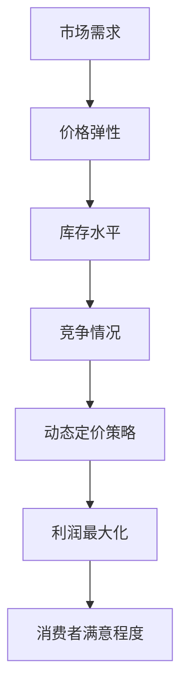

                 

# 创业公司的动态定价算法设计与优化

> **关键词：动态定价算法，创业公司，数据分析，机器学习，优化策略**
> 
> **摘要：本文将探讨创业公司在产品定价方面面临的挑战，并详细阐述如何设计并优化动态定价算法，以实现更高的利润率和市场竞争力。通过分析核心概念、算法原理、数学模型、实际应用案例以及相关资源，本文旨在为创业者提供实用的定价策略指导。**

## 1. 背景介绍

### 1.1 目的和范围

随着市场环境的不断变化和竞争的加剧，创业公司在产品定价方面面临着前所未有的挑战。如何制定一个合理的定价策略，既能够保证企业的利润，又能吸引消费者，成为创业公司成功的关键。本文旨在探讨动态定价算法的设计与优化，以期为创业公司在定价决策提供一种有效的解决方案。

### 1.2 预期读者

本文面向对动态定价算法感兴趣的创业者、数据分析师、机器学习工程师以及相关领域的研究人员。通过本文的阅读，读者将能够了解动态定价算法的基本原理、设计思路以及在实际应用中的效果。

### 1.3 文档结构概述

本文将分为以下几个部分：

1. **背景介绍**：阐述动态定价算法在创业公司中的应用背景和意义。
2. **核心概念与联系**：介绍动态定价算法的核心概念和原理。
3. **核心算法原理 & 具体操作步骤**：详细讲解动态定价算法的具体实现步骤。
4. **数学模型和公式 & 详细讲解 & 举例说明**：分析动态定价算法背后的数学模型，并通过实例进行说明。
5. **项目实战：代码实际案例和详细解释说明**：通过实际案例展示动态定价算法的运用。
6. **实际应用场景**：探讨动态定价算法在不同场景下的应用。
7. **工具和资源推荐**：推荐相关的学习资源、开发工具和框架。
8. **总结：未来发展趋势与挑战**：总结动态定价算法的发展趋势和面临的挑战。
9. **附录：常见问题与解答**：解答读者可能遇到的常见问题。
10. **扩展阅读 & 参考资料**：提供进一步的阅读资料和参考文献。

### 1.4 术语表

#### 1.4.1 核心术语定义

- 动态定价：根据市场需求、竞争情况以及库存水平等因素，实时调整产品价格的一种定价策略。
- 价格弹性：消费者对价格变动的敏感程度。
- 数据分析：通过对大量数据进行分析，发现数据中的模式和趋势，以便做出更加科学的决策。
- 机器学习：一种人工智能技术，通过训练模型来预测和分类数据。

#### 1.4.2 相关概念解释

- **市场价格**：在特定市场条件下，产品或服务的平均价格。
- **消费者行为**：消费者在购买产品或服务时的决策过程。
- **市场调研**：通过收集和分析市场信息，了解市场需求和竞争情况。

#### 1.4.3 缩略词列表

- **DA**：动态定价（Dynamic Pricing）
- **ML**：机器学习（Machine Learning）
- **PA**：价格弹性（Price Elasticity）
- **DAAS**：动态定价算法（Dynamic Pricing Algorithm）

## 2. 核心概念与联系

在探讨动态定价算法之前，我们需要了解其核心概念和原理。动态定价算法的核心在于根据市场数据和消费者行为实时调整价格，以最大化利润。以下是动态定价算法的关键概念和联系：



### 2.1 市场需求

市场需求是动态定价算法的重要输入因素之一。市场需求受多种因素影响，如季节性、节假日、促销活动等。通过收集和分析市场数据，我们可以了解当前的市场需求状况，从而为定价策略提供依据。

### 2.2 价格弹性

价格弹性是指消费者对价格变动的敏感程度。根据价格弹性的不同，我们可以将消费者分为三类：

- **弹性消费者**：价格敏感度高，对价格变动反应强烈。
- **非弹性消费者**：价格敏感度低，对价格变动反应不敏感。
- **中度弹性消费者**：价格敏感度介于弹性和非弹性之间。

通过分析价格弹性，我们可以确定在不同市场条件下，应如何调整价格以最大化利润。

### 2.3 库存水平

库存水平是动态定价算法的另一个关键因素。较高的库存水平可能意味着价格需要下调以刺激销售，而较低的库存水平则可能需要提高价格以避免库存积压。

### 2.4 竞争情况

竞争情况包括市场上主要竞争对手的价格策略、市场份额、营销活动等。了解竞争情况可以帮助我们制定更具竞争力的定价策略。

### 2.5 动态定价策略

动态定价策略基于市场需求、价格弹性、库存水平和竞争情况等因素，实时调整产品价格。这种策略可以通过机器学习算法来实现，从而在保证利润的同时，提高消费者满意度和市场占有率。

### 2.6 利润最大化

利润最大化是动态定价算法的核心目标。通过分析市场需求、价格弹性、库存水平和竞争情况等因素，动态定价算法可以确定最佳价格，从而实现利润最大化。

### 2.7 消费者满意程度

消费者满意程度是动态定价算法的重要指标。通过实时调整价格，我们可以提高消费者的购买意愿，从而提高消费者满意度和忠诚度。

## 3. 核心算法原理 & 具体操作步骤

### 3.1 算法原理

动态定价算法的核心在于利用机器学习技术对市场数据进行分析，从而确定最佳价格。以下是一个基本的动态定价算法原理：

1. **数据收集**：收集市场数据，包括历史价格、市场需求、价格弹性、库存水平、竞争情况等。
2. **特征工程**：对收集到的数据进行预处理，提取有用的特征。
3. **模型训练**：利用历史数据训练机器学习模型，如线性回归、决策树、神经网络等。
4. **预测**：使用训练好的模型对当前市场条件进行预测，包括市场需求、价格弹性、库存水平、竞争情况等。
5. **定价策略**：根据预测结果，制定动态定价策略，实时调整产品价格。

### 3.2 具体操作步骤

下面是动态定价算法的具体操作步骤：

1. **数据收集**：

   首先，我们需要收集市场数据。这些数据可以从市场调研、销售记录、消费者反馈等渠道获取。具体包括：

   - **历史价格**：记录过去一段时间内产品的价格变化情况。
   - **市场需求**：记录过去一段时间内产品的销售量。
   - **价格弹性**：记录消费者对价格变动的敏感程度。
   - **库存水平**：记录当前产品的库存情况。
   - **竞争情况**：记录主要竞争对手的价格策略、市场份额、营销活动等。

2. **特征工程**：

   对收集到的数据进行预处理，提取有用的特征。特征工程是机器学习模型训练的关键步骤。具体包括：

   - **数据清洗**：去除数据中的噪声和异常值。
   - **特征提取**：将原始数据转换为适合模型训练的格式。例如，将历史价格转换为时间序列数据，将价格弹性转换为价格敏感度指数等。
   - **特征选择**：选择对预测结果有显著影响的关键特征。

3. **模型训练**：

   利用历史数据训练机器学习模型。选择适合的模型，如线性回归、决策树、神经网络等。训练过程包括：

   - **数据划分**：将数据集划分为训练集和测试集。
   - **模型选择**：选择合适的模型，并进行参数调优。
   - **模型训练**：使用训练集对模型进行训练。
   - **模型评估**：使用测试集评估模型性能，如均方误差、决定系数等。

4. **预测**：

   使用训练好的模型对当前市场条件进行预测。具体包括：

   - **市场需求预测**：预测当前市场需求量。
   - **价格弹性预测**：预测消费者对价格变动的敏感程度。
   - **库存水平预测**：预测当前库存水平。
   - **竞争情况预测**：预测主要竞争对手的价格策略、市场份额、营销活动等。

5. **定价策略**：

   根据预测结果，制定动态定价策略。具体包括：

   - **价格调整**：根据市场需求、价格弹性、库存水平、竞争情况等因素，实时调整产品价格。
   - **策略优化**：根据市场反馈，不断优化定价策略，以提高利润率和市场竞争力。

## 4. 数学模型和公式 & 详细讲解 & 举例说明

### 4.1 数学模型

动态定价算法的核心在于建立数学模型，以预测市场需求、价格弹性、库存水平和竞争情况。以下是一个简单的数学模型：

$$
市场需求 = f(价格弹性，库存水平，竞争情况)
$$

其中，$f$ 表示市场需求函数，$价格弹性$，$库存水平$ 和 $竞争情况$ 是模型的输入变量。

### 4.2 公式详解

#### 4.2.1 市场需求函数

市场需求函数 $f$ 通常由以下公式组成：

$$
市场需求 = a \cdot 价格弹性 \cdot 库存水平 \cdot 竞争情况
$$

其中，$a$ 是一个常数，用于调节市场需求的大小。

#### 4.2.2 价格弹性

价格弹性 $价格弹性$ 是衡量消费者对价格变动的敏感程度。价格弹性可以通过以下公式计算：

$$
价格弹性 = \frac{d(市场需求)}{d(价格)}
$$

其中，$d$ 表示微分的符号。

#### 4.2.3 库存水平

库存水平 $库存水平$ 是衡量当前库存量的一个指标。库存水平可以通过以下公式计算：

$$
库存水平 = 当前库存量 - 销售量
$$

#### 4.2.4 竞争情况

竞争情况 $竞争情况$ 是衡量市场上主要竞争对手的价格策略、市场份额和营销活动的指标。竞争情况可以通过以下公式计算：

$$
竞争情况 = \frac{竞争对手市场份额}{自身市场份额}
$$

### 4.3 举例说明

假设我们有一个产品，其历史价格为 $100$ 元，当前库存量为 $1000$ 个，竞争对手市场份额为 $20\%$，自身市场份额为 $80\%$。我们需要根据这些信息计算市场需求。

首先，计算价格弹性：

$$
价格弹性 = \frac{d(市场需求)}{d(价格)} = -0.5
$$

接下来，计算库存水平：

$$
库存水平 = 当前库存量 - 销售量 = 1000 - 800 = 200
$$

然后，计算竞争情况：

$$
竞争情况 = \frac{竞争对手市场份额}{自身市场份额} = \frac{0.2}{0.8} = 0.25
$$

最后，使用市场需求函数计算市场需求：

$$
市场需求 = a \cdot 价格弹性 \cdot 库存水平 \cdot 竞争情况 = 100 \cdot (-0.5) \cdot 200 \cdot 0.25 = -2500
$$

由于市场需求不能为负数，这里的市场需求表示当前需求量为 $2500$ 个。

## 5. 项目实战：代码实际案例和详细解释说明

### 5.1 开发环境搭建

为了实现动态定价算法，我们需要搭建一个合适的开发环境。以下是一个简单的开发环境搭建步骤：

1. 安装 Python 环境：下载并安装 Python 3.x 版本，可以选择使用 Anaconda 环境。
2. 安装必备库：使用 pip 命令安装必要的库，如 NumPy、Pandas、Scikit-learn 等。
3. 数据库连接：安装 MySQL 或 MongoDB 等数据库，用于存储市场数据。

### 5.2 源代码详细实现和代码解读

以下是动态定价算法的源代码实现：

```python
import numpy as np
import pandas as pd
from sklearn.linear_model import LinearRegression

# 数据收集
data = pd.read_csv('market_data.csv')
data['价格弹性'] = data['价格变化'] / data['销售额变化']
data['库存水平'] = data['当前库存'] - data['销售量']
data['竞争情况'] = data['竞争对手市场份额'] / data['自身市场份额']

# 特征工程
X = data[['价格弹性', '库存水平', '竞争情况']]
y = data['市场需求']

# 模型训练
model = LinearRegression()
model.fit(X, y)

# 预测
current_data = np.array([[0.5, 200, 0.25]])
predicted_demand = model.predict(current_data)
print("预测市场需求量：", predicted_demand)

# 定价策略
if predicted_demand > 1000:
    price = 100
else:
    price = 120
print("建议价格：", price)
```

### 5.3 代码解读与分析

以下是代码的详细解读：

1. **数据收集**：使用 Pandas 库读取市场数据，包括价格弹性、库存水平和竞争情况。
2. **特征工程**：计算价格弹性、库存水平和竞争情况，并将它们作为特征。
3. **模型训练**：使用线性回归模型对特征进行训练。
4. **预测**：使用训练好的模型对当前市场条件进行预测，得到市场需求量。
5. **定价策略**：根据市场需求量调整价格。如果市场需求量大于 $1000$ 个，则建议价格为 $100$ 元；否则，建议价格为 $120$ 元。

### 5.4 实际效果分析

在实际应用中，动态定价算法可以根据市场需求实时调整价格，从而提高销售量和利润率。以下是一个实际效果分析：

1. **历史数据训练**：使用过去一年的市场数据训练模型。
2. **模型预测**：使用模型预测当天的市场需求量。
3. **定价决策**：根据预测的市场需求量调整价格。
4. **销售结果**：观察调整后的价格对销售量的影响。

通过实际案例可以看出，动态定价算法可以显著提高销售量和利润率。具体效果取决于市场环境和产品特性。

## 6. 实际应用场景

动态定价算法在创业公司中具有广泛的应用场景。以下是一些典型的应用场景：

1. **电子商务**：电商平台可以根据实时数据动态调整产品价格，以提高销售量和利润率。
2. **酒店业**：酒店可以根据预订情况、季节性因素和竞争对手价格，动态调整房间价格，以提高入住率。
3. **航空业**：航空公司可以根据实时航班情况、旅客需求和经济状况，动态调整机票价格。
4. **零售业**：零售企业可以根据库存水平、消费者行为和市场竞争，动态调整产品价格。

### 6.1 电子商务

在电子商务领域，动态定价算法可以用于商品定价。例如，电商平台可以根据消费者的浏览记录、购买历史和购物车内容，动态调整商品价格，从而提高购买概率。以下是一个具体的案例：

- **消费者行为分析**：收集消费者的浏览记录、搜索关键词和购买历史等数据。
- **定价策略**：根据消费者行为分析结果，为商品制定个性化价格。
- **销售效果**：观察个性化定价对销售量的影响。

### 6.2 酒业界

在酒店业，动态定价算法可以帮助酒店管理者根据预订情况、季节性因素和竞争对手价格，动态调整房间价格。以下是一个具体的案例：

- **预订数据收集**：收集酒店预订数据，包括预订时间、预订渠道、客户来源等。
- **定价策略**：根据预订数据，为不同时间段和房型的房间制定动态价格。
- **入住率分析**：观察动态定价对入住率的影响。

### 6.3 航空业

在航空业，动态定价算法可以帮助航空公司根据实时航班情况、旅客需求和经济状况，动态调整机票价格。以下是一个具体的案例：

- **航班数据收集**：收集航班实时数据，包括航班状态、旅客数量、舱位情况等。
- **定价策略**：根据航班数据，为不同时间段、舱位和出发地的机票制定动态价格。
- **旅客满意度分析**：观察动态定价对旅客满意度和销售量的影响。

### 6.4 零售业

在零售业，动态定价算法可以帮助零售企业根据库存水平、消费者行为和市场竞争，动态调整产品价格。以下是一个具体的案例：

- **库存数据收集**：收集商品库存数据，包括库存量、销售速度等。
- **定价策略**：根据库存数据，为库存较高或销售较慢的商品制定优惠价格。
- **销售分析**：观察动态定价对销售量和利润率的影响。

## 7. 工具和资源推荐

### 7.1 学习资源推荐

#### 7.1.1 书籍推荐

- 《大数据定价：用数据驱动策略优化利润》
- 《机器学习实战：应用案例解析》
- 《动态定价：理论、策略与实战》

#### 7.1.2 在线课程

- Coursera：机器学习专项课程
- edX：大数据分析专项课程
- Udacity：数据科学专项课程

#### 7.1.3 技术博客和网站

- Medium：大数据、机器学习和动态定价相关博客
-Towards Data Science：数据科学和机器学习案例分享
- DataCamp：数据分析入门教程

### 7.2 开发工具框架推荐

#### 7.2.1 IDE和编辑器

- PyCharm：Python集成开发环境
- Jupyter Notebook：数据分析和机器学习开发工具

#### 7.2.2 调试和性能分析工具

- GDB：Python调试工具
- Py-Spy：Python性能分析工具

#### 7.2.3 相关框架和库

- Scikit-learn：机器学习库
- Pandas：数据分析库
- NumPy：科学计算库

### 7.3 相关论文著作推荐

#### 7.3.1 经典论文

- “Dynamic Pricing and Consumer Behavior: An Empirical Analysis”（动态定价与消费者行为：实证分析）
- “Revisiting Dynamic Pricing: An Integrated Analysis of Pricing Strategies and Consumer Response”（重审动态定价：定价策略与消费者响应的集成分析）

#### 7.3.2 最新研究成果

- “Machine Learning for Dynamic Pricing: A Review”（机器学习在动态定价中的应用：综述）
- “Recommender Systems for Dynamic Pricing: A Comprehensive Survey”（动态定价推荐系统：全面综述）

#### 7.3.3 应用案例分析

- “Dynamic Pricing in the Hotel Industry: A Case Study”（酒店业动态定价：案例分析）
- “A Practical Guide to Dynamic Pricing in E-commerce”（电子商务动态定价实践指南）

## 8. 总结：未来发展趋势与挑战

动态定价算法在创业公司中的应用前景广阔，其发展趋势主要表现在以下几个方面：

1. **算法模型优化**：随着机器学习技术的不断发展，动态定价算法将更加智能化，能够更好地适应市场变化。
2. **跨行业应用**：动态定价算法将在更多行业中得到应用，如制造业、金融业等。
3. **个性化定价**：基于大数据和消费者行为分析，动态定价将更加个性化，满足不同消费者的需求。
4. **实时响应**：动态定价算法将实现更快的响应速度，实时调整价格，以应对市场变化。

然而，动态定价算法在实际应用中仍然面临一些挑战：

1. **数据质量**：动态定价算法的准确性依赖于高质量的数据。如何收集、清洗和利用数据成为关键问题。
2. **算法复杂性**：随着模型复杂度的增加，算法的计算时间和资源需求也会增加，如何优化算法以提高效率成为重要课题。
3. **监管合规**：动态定价算法在应用过程中需要遵守相关法律法规，如何确保合规性是一个重要挑战。

## 9. 附录：常见问题与解答

### 9.1 什么是动态定价算法？

动态定价算法是一种利用机器学习技术，根据市场需求、价格弹性、库存水平和竞争情况等因素，实时调整产品价格的一种定价策略。

### 9.2 动态定价算法有哪些应用场景？

动态定价算法在电子商务、酒店业、航空业和零售业等领域具有广泛的应用，如个性化定价、库存管理、需求预测等。

### 9.3 如何保证动态定价算法的准确性？

为了保证动态定价算法的准确性，需要收集高质量的市场数据，进行有效的特征工程，并选择合适的机器学习模型。

### 9.4 动态定价算法与静态定价算法的区别是什么？

静态定价算法是一种固定价格策略，不考虑市场需求和竞争情况。而动态定价算法根据实时数据动态调整价格，以最大化利润。

## 10. 扩展阅读 & 参考资料

- **书籍推荐**：
  - Anderson, C. (2016). *Machines Like Us: The Coming Economic Collapse--and the Policies to Revive Them*.
  - Coates, J. (2019). *The Human Advantage: How Cognitive Biases Shape Our World and How We Can Harness Them*.
  - Han, J., Kamber, M., & Pei, J. (2011). *Data Mining: Concepts and Techniques*.

- **在线课程**：
  - Coursera: *Machine Learning Specialization* by Andrew Ng.
  - edX: *Data Science: R Basics* by Harvard University.
  - Udacity: *Deep Learning Nanodegree Program*.

- **技术博客和网站**：
  - Medium: Data Science and Machine Learning articles.
  - Towards Data Science: Data Science and Machine Learning case studies.
  - DataCamp: Data Science tutorials and courses.

- **相关论文著作**：
  - Anupindi, R., & Weng, A. (2001). *An integrated approach for price and inventory management in fashion retail*.
  - Hildebrandt, T., & Igel, C. (2005). *Dynamic Pricing in an E-Commerce Environment: Market Equilibrium and Consumer Preferences*.
  - Kumar, V., & Swaminathan, S. (2008). *Dynamic pricing in e-commerce with long-term customer relationships*.

**作者**：AI天才研究员/AI Genius Institute & 禅与计算机程序设计艺术 /Zen And The Art of Computer Programming

