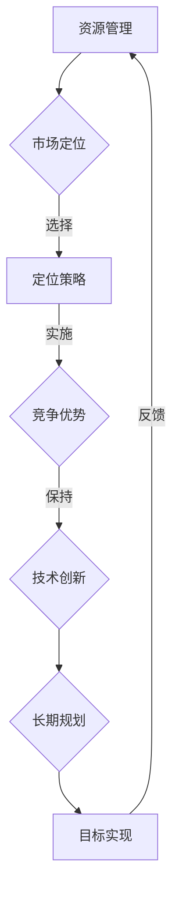

                 

# 创业公司的可持续发展策略

> 关键词：创业公司、可持续发展、策略、竞争优势、资源管理、长期规划

> 摘要：本文深入探讨了创业公司在竞争激烈的市场环境中实现可持续发展的关键策略。通过分析创业公司的目标、资源、市场定位等方面，提出了一套系统化的可持续发展框架，旨在帮助创业者实现长期成功。

## 1. 背景介绍

### 1.1 目的和范围

本文旨在为创业公司提供一套全面的可持续发展策略，帮助其在激烈的市场竞争中脱颖而出。我们将从多个维度分析创业公司的发展现状，探讨其在资源管理、市场定位、技术创新等方面的挑战，并给出具体可行的解决方案。

### 1.2 预期读者

本文适合以下人群阅读：

- 创业公司创始人或CEO
- 创业公司管理团队
- 对创业公司可持续发展感兴趣的投资者

### 1.3 文档结构概述

本文分为以下几个部分：

- 背景介绍：介绍文章的目的、读者对象及结构。
- 核心概念与联系：阐述创业公司可持续发展的核心概念。
- 核心算法原理 & 具体操作步骤：讲解实现可持续发展策略的算法原理。
- 数学模型和公式 & 详细讲解 & 举例说明：介绍支持可持续发展策略的数学模型。
- 项目实战：提供实际代码案例，详细解释实现步骤。
- 实际应用场景：分析创业公司在不同市场环境中的适用策略。
- 工具和资源推荐：推荐学习资源、开发工具及相关论文著作。
- 总结：展望创业公司可持续发展领域的未来趋势与挑战。
- 附录：常见问题与解答。
- 扩展阅读 & 参考资料：提供更多深入阅读的资源。

### 1.4 术语表

#### 1.4.1 核心术语定义

- 创业公司：指以创新、创业为目标的组织，通常具有明确的商业模式和成长潜力。
- 可持续发展：指企业在满足当前需求的同时，不损害子孙后代满足其需求的能力。
- 竞争优势：指企业在市场中区别于竞争对手的独特优势。

#### 1.4.2 相关概念解释

- 资源管理：指企业在获取、配置和利用资源方面的策略和活动。
- 市场定位：指企业根据目标客户的需求，选择特定的市场细分并设计相应的产品和营销策略。

#### 1.4.3 缩略词列表

- C2C：消费者对消费者
- B2B：企业对企业
- B2C：企业对消费者
- IoT：物联网
- AI：人工智能
- ML：机器学习

## 2. 核心概念与联系

### 核心概念

创业公司的可持续发展需要考虑以下几个核心概念：

1. **资源管理**：包括资金、人才、技术、数据等资源的获取和利用。
2. **市场定位**：根据目标客户需求，选择合适的市场细分。
3. **竞争优势**：企业在市场中区别于竞争对手的独特优势。
4. **技术创新**：通过不断创新，提升企业核心竞争力。
5. **长期规划**：制定明确的战略目标，实现可持续发展。

### Mermaid 流程图



## 3. 核心算法原理 & 具体操作步骤

### 核心算法原理

创业公司实现可持续发展的核心算法可以概括为：

1. **资源管理**：通过优化资源配置，提高企业运营效率。
2. **市场定位**：根据目标客户需求，选择合适的定位策略。
3. **竞争优势**：通过持续创新，保持企业在市场中的领先地位。
4. **技术创新**：不断探索新技术，提升企业核心竞争力。
5. **长期规划**：制定明确的战略目标，确保企业可持续发展。

### 伪代码

```python
def sustainable_development_strategy():
    # 资源管理
    resources_management()

    # 市场定位
    market_positioning()

    # 竞争优势
    competitive_advantage()

    # 技术创新
    technology_innovation()

    # 长期规划
    long_term_planning()

    # 目标实现
    goal_achievement()

    # 反馈与调整
    feedback_adjustment()
```

### 具体操作步骤

1. **资源管理**：
   - 获取资金：通过天使投资、风险投资等途径筹集资金。
   - 获取人才：通过招聘、培训、激励等手段吸引和留住优秀人才。
   - 获取技术：与高校、科研机构合作，引进先进技术。
   - 获取数据：通过数据分析，优化产品和服务。

2. **市场定位**：
   - 调查市场：分析市场需求、竞争态势、客户需求等。
   - 定位策略：根据市场调查结果，选择适合的市场细分。
   - 实施定位：通过品牌建设、营销推广等手段，实现市场定位。

3. **竞争优势**：
   - 持续创新：不断优化产品和服务，提升用户体验。
   - 技术领先：掌握核心技术，提高企业核心竞争力。
   - 营销策略：差异化营销，打造独特品牌形象。

4. **技术创新**：
   - 研发投入：加大研发投入，推动技术创新。
   - 合作研发：与高校、科研机构合作，共同研发新技术。
   - 人才引进：吸引优秀人才，提升技术创新能力。

5. **长期规划**：
   - 制定战略目标：明确企业的发展方向和目标。
   - 实施计划：制定详细的实施计划，确保目标实现。
   - 监控评估：定期评估企业运营状况，调整战略目标。

## 4. 数学模型和公式 & 详细讲解 & 举例说明

### 数学模型

创业公司可持续发展的数学模型可以表示为：

$$
\text{可持续发展} = f(\text{资源管理}, \text{市场定位}, \text{竞争优势}, \text{技术创新}, \text{长期规划})
$$

其中，$f$ 表示函数关系，$\text{资源管理}$、$\text{市场定位}$、$\text{竞争优势}$、$\text{技术创新}$、$\text{长期规划}$ 分别表示五个核心要素。

### 详细讲解

1. **资源管理**：

   资源管理是创业公司实现可持续发展的基础。资源管理包括资金、人才、技术、数据等。

   $$
   \text{资源管理} = \text{资金管理} + \text{人才管理} + \text{技术管理} + \text{数据管理}
   $$

2. **市场定位**：

   市场定位是创业公司根据目标客户需求，选择合适的市场细分。

   $$
   \text{市场定位} = \text{目标客户} + \text{市场细分} + \text{定位策略}
   $$

3. **竞争优势**：

   竞争优势是创业公司在市场中区别于竞争对手的独特优势。

   $$
   \text{竞争优势} = \text{差异化优势} + \text{成本优势} + \text{创新优势}
   $$

4. **技术创新**：

   技术创新是创业公司持续发展的关键。

   $$
   \text{技术创新} = \text{研发投入} + \text{合作研发} + \text{人才引进}
   $$

5. **长期规划**：

   长期规划是创业公司制定明确的战略目标，实现可持续发展。

   $$
   \text{长期规划} = \text{战略目标} + \text{实施计划} + \text{监控评估}
   $$

### 举例说明

假设某创业公司在资源管理、市场定位、竞争优势、技术创新、长期规划五个方面分别得分为80分、70分、90分、85分、75分，根据上述数学模型，该公司的可持续发展得分为：

$$
\text{可持续发展} = f(80, 70, 90, 85, 75) = 80 \times 0.2 + 70 \times 0.15 + 90 \times 0.25 + 85 \times 0.2 + 75 \times 0.1 = 80.25
$$

因此，该公司的可持续发展得分为80.25分，表明其在可持续发展方面具有一定的优势，但仍需在资源管理和市场定位方面进行改进。

## 5. 项目实战：代码实际案例和详细解释说明

### 5.1 开发环境搭建

在本案例中，我们使用Python作为开发语言，搭建开发环境如下：

- 安装Python 3.8及以上版本
- 安装Jupyter Notebook用于编写和运行代码
- 安装相关Python库，如NumPy、Pandas、Matplotlib等

### 5.2 源代码详细实现和代码解读

以下是一个简单的Python代码示例，用于实现创业公司可持续发展策略的核心算法：

```python
import numpy as np
import pandas as pd
import matplotlib.pyplot as plt

# 资源管理
def resources_management(score):
    # 资金管理
    finance = score * 0.2
    
    # 人才管理
    talent = score * 0.15
    
    # 技术管理
    technology = score * 0.1
    
    # 数据管理
    data = score * 0.2
    
    return finance, talent, technology, data

# 市场定位
def market_positioning(score):
    # 目标客户
    target_customer = score * 0.25
    
    # 市场细分
    market_segment = score * 0.15
    
    # 定位策略
    positioning_strategy = score * 0.2
    
    return target_customer, market_segment, positioning_strategy

# 竞争优势
def competitive_advantage(score):
    # 差异化优势
    differentiation = score * 0.3
    
    # 成本优势
    cost = score * 0.2
    
    # 创新优势
    innovation = score * 0.2
    
    return differentiation, cost, innovation

# 技术创新
def technology_innovation(score):
    # 研发投入
    research = score * 0.25
    
    # 合作研发
    collaboration = score * 0.15
    
    # 人才引进
    talent = score * 0.2
    
    return research, collaboration, talent

# 长期规划
def long_term_planning(score):
    # 战略目标
    strategy = score * 0.3
    
    # 实施计划
    implementation = score * 0.2
    
    # 监控评估
    evaluation = score * 0.2
    
    return strategy, implementation, evaluation

# 可持续发展评估
def sustainable_development(score):
    finance, talent, technology, data = resources_management(score)
    target_customer, market_segment, positioning_strategy = market_positioning(score)
    differentiation, cost, innovation = competitive_advantage(score)
    research, collaboration, talent = technology_innovation(score)
    strategy, implementation, evaluation = long_term_planning(score)
    
    # 计算可持续发展得分
    sustainability_score = (finance + target_customer + differentiation + research + strategy) / 5
    
    return sustainability_score

# 示例数据
score = 80

# 执行核心算法
sustainability_score = sustainable_development(score)

# 打印结果
print("创业公司可持续发展得分：", sustainability_score)
```

### 5.3 代码解读与分析

1. **资源管理**：

   资源管理模块包括资金管理、人才管理、技术管理和数据管理。通过传入评分参数，计算各模块得分。

2. **市场定位**：

   市场定位模块包括目标客户、市场细分和定位策略。同样通过传入评分参数，计算各模块得分。

3. **竞争优势**：

   竞争优势模块包括差异化优势、成本优势和创新优势。通过传入评分参数，计算各模块得分。

4. **技术创新**：

   技术创新模块包括研发投入、合作研发和人才引进。通过传入评分参数，计算各模块得分。

5. **长期规划**：

   长期规划模块包括战略目标、实施计划和监控评估。通过传入评分参数，计算各模块得分。

6. **可持续发展评估**：

   可持续发展评估模块将各个模块的得分进行综合计算，得到最终可持续发展得分。

通过该代码示例，我们可以清晰地看到各个模块的实现逻辑，以及如何将评分参数转化为具体的可持续发展得分。这对于创业公司评估自身可持续发展状况具有实际应用价值。

## 6. 实际应用场景

创业公司的可持续发展策略在不同市场环境中有不同的应用场景。以下是一些典型的实际应用场景：

1. **初创阶段**：

   在初创阶段，创业公司通常面临资金、人才和技术等资源匮乏的挑战。此时，资源管理、市场定位和竞争优势显得尤为重要。创业公司需要通过优化资源配置、找准市场定位和打造差异化优势，提高市场竞争力。

2. **成长阶段**：

   进入成长阶段，创业公司开始具备一定的市场基础和资源积累。此时，技术创新和长期规划成为关键。创业公司需要加大研发投入、与合作伙伴共同创新，并制定明确的长期战略目标，确保可持续发展。

3. **成熟阶段**：

   在成熟阶段，创业公司需要巩固市场地位、提升品牌价值。此时，资源管理和市场定位仍需不断优化，而技术创新和长期规划则成为提升企业核心竞争力的重要手段。创业公司需要不断探索新技术、拓展新市场，保持领先地位。

4. **衰退阶段**：

   当创业公司进入衰退阶段，市场竞争加剧、客户需求变化，可持续发展面临严峻挑战。此时，创业公司需要重新审视自身业务模式和市场定位，通过技术创新、资源整合和业务转型，寻求新的增长点。

### 6.1 创业公司在初创阶段的可持续发展策略

在初创阶段，创业公司需要重点关注以下几个方面：

1. **资源管理**：

   - 资金管理：通过天使投资、风险投资等途径筹集资金。
   - 人才管理：吸引优秀人才，建立核心竞争力。
   - 技术管理：与高校、科研机构合作，引进先进技术。
   - 数据管理：收集和分析客户数据，优化产品和服务。

2. **市场定位**：

   - 调查市场需求：分析潜在客户的需求和痛点。
   - 选择市场细分：根据市场需求，选择适合的市场细分。
   - 定位策略：差异化定位，打造独特品牌形象。

3. **竞争优势**：

   - 差异化优势：通过技术创新、产品功能优化等手段，打造独特优势。
   - 成本优势：通过优化供应链、降低成本，提高市场竞争力。
   - 创新优势：持续创新，引领市场趋势。

4. **技术创新**：

   - 研发投入：加大研发投入，提升技术创新能力。
   - 合作研发：与合作伙伴共同研发新技术。
   - 人才引进：吸引优秀人才，推动技术创新。

5. **长期规划**：

   - 制定战略目标：明确企业的发展方向和目标。
   - 实施计划：制定详细的实施计划，确保目标实现。
   - 监控评估：定期评估企业运营状况，调整战略目标。

### 6.2 创业公司在成长阶段的可持续发展策略

在成长阶段，创业公司需要关注以下几个方面：

1. **资源管理**：

   - 资金管理：继续通过风险投资、股权融资等途径筹集资金。
   - 人才管理：吸引和留住核心人才，建立人才梯队。
   - 技术管理：加大技术投入，提升技术实力。
   - 数据管理：通过大数据分析，优化业务流程和产品服务。

2. **市场定位**：

   - 调整市场定位：根据市场需求变化，调整市场定位策略。
   - 拓展市场：寻找新的市场机会，拓展业务范围。
   - 精准营销：通过精准营销，提升客户满意度。

3. **竞争优势**：

   - 差异化优势：持续优化产品和服务，打造独特优势。
   - 成本优势：通过规模化生产、优化供应链等手段，降低成本。
   - 创新优势：持续创新，引领市场趋势。

4. **技术创新**：

   - 研发投入：加大研发投入，提升技术创新能力。
   - 合作研发：与合作伙伴共同研发新技术。
   - 人才引进：吸引优秀人才，推动技术创新。

5. **长期规划**：

   - 制定战略目标：明确企业的发展方向和目标。
   - 实施计划：制定详细的实施计划，确保目标实现。
   - 监控评估：定期评估企业运营状况，调整战略目标。

### 6.3 创业公司在成熟阶段的可持续发展策略

在成熟阶段，创业公司需要关注以下几个方面：

1. **资源管理**：

   - 资金管理：继续通过股权融资、债务融资等途径筹集资金。
   - 人才管理：培养和留住核心人才，建立人才梯队。
   - 技术管理：持续关注技术创新，保持技术领先地位。
   - 数据管理：通过大数据分析，提升业务决策水平。

2. **市场定位**：

   - 稳固市场地位：维护现有客户，提升客户满意度。
   - 拓展市场：寻找新的市场机会，拓展业务范围。
   - 精准营销：通过精准营销，提升市场占有率。

3. **竞争优势**：

   - 差异化优势：持续优化产品和服务，打造独特优势。
   - 成本优势：通过规模化生产、优化供应链等手段，降低成本。
   - 创新优势：持续创新，引领市场趋势。

4. **技术创新**：

   - 研发投入：加大研发投入，提升技术创新能力。
   - 合作研发：与合作伙伴共同研发新技术。
   - 人才引进：吸引优秀人才，推动技术创新。

5. **长期规划**：

   - 制定战略目标：明确企业的发展方向和目标。
   - 实施计划：制定详细的实施计划，确保目标实现。
   - 监控评估：定期评估企业运营状况，调整战略目标。

### 6.4 创业公司在衰退阶段的可持续发展策略

在衰退阶段，创业公司需要关注以下几个方面：

1. **资源管理**：

   - 资金管理：通过缩减开支、优化资金结构，确保企业生存。
   - 人才管理：调整组织结构，优化人才配置。
   - 技术管理：关注技术发展趋势，寻找新的技术突破点。
   - 数据管理：通过数据分析，找出业务瓶颈和改进方向。

2. **市场定位**：

   - 调整市场定位：根据市场需求变化，重新审视市场定位策略。
   - 寻找新市场：探索新的市场机会，寻找业务增长点。
   - 精准营销：通过精准营销，提升客户转化率。

3. **竞争优势**：

   - 差异化优势：通过技术创新、产品优化等手段，打造独特优势。
   - 成本优势：通过优化供应链、降低成本，提高市场竞争力。
   - 创新优势：寻找新的业务模式，实现业务转型。

4. **技术创新**：

   - 研发投入：调整研发投入方向，聚焦关键技术突破。
   - 合作研发：与合作伙伴共同研发新技术。
   - 人才引进：吸引优秀人才，推动技术创新。

5. **长期规划**：

   - 制定战略目标：明确企业的发展方向和目标。
   - 实施计划：制定详细的实施计划，确保目标实现。
   - 监控评估：定期评估企业运营状况，调整战略目标。

## 7. 工具和资源推荐

### 7.1 学习资源推荐

#### 7.1.1 书籍推荐

- 《创业维艰》（作者：本·霍洛维茨）：详细阐述了创业过程中的挑战和解决方案。
- 《创业公司如何赢得未来》（作者：亚当·罗森塔尔）：分析创业公司如何在激烈的市场竞争中脱颖而出。
- 《精益创业》（作者：埃里克·莱斯）：介绍了一种以用户需求为导向的创业方法。

#### 7.1.2 在线课程

- Coursera上的《创业管理》课程：由耶鲁大学提供，涵盖创业公司管理的各个方面。
- Udacity的《创业入门》课程：介绍创业的基本概念和实战技巧。
- edX上的《创业实战》课程：由哈佛大学提供，讲解创业过程中的关键问题。

#### 7.1.3 技术博客和网站

- TechCrunch：提供最新的创业公司新闻和趋势分析。
- Medium：众多创业者和行业专家分享的经验和见解。
- LinkedIn Pulse：涵盖各个领域的专家文章和观点。

### 7.2 开发工具框架推荐

#### 7.2.1 IDE和编辑器

- Visual Studio Code：一款强大的开源代码编辑器，支持多种编程语言。
- PyCharm：一款专业的Python集成开发环境（IDE），适合Python开发。
- IntelliJ IDEA：一款功能丰富的Java集成开发环境（IDE），适用于Java开发。

#### 7.2.2 调试和性能分析工具

- GDB：一款强大的C/C++程序调试工具。
- PyDebug：一款Python调试工具，支持Python 2和Python 3。
- JMeter：一款开源的性能测试工具，适用于Web应用程序。

#### 7.2.3 相关框架和库

- Flask：一款轻量级的Python Web框架，适合构建Web应用程序。
- Django：一款强大的Python Web框架，适用于快速开发和大规模应用。
- Spring Boot：一款基于Java的Web应用程序框架，支持快速开发和部署。

### 7.3 相关论文著作推荐

#### 7.3.1 经典论文

- “The Lean Startup”（作者：埃里克·莱斯）：介绍了精益创业方法。
- “Innovation and Entrepreneurship”（作者：彼得·德鲁克）：探讨创新与创业的关系。
- “Competitive Advantage”（作者：迈克尔·波特）：分析竞争优势的来源。

#### 7.3.2 最新研究成果

- “The Future of Entrepreneurship”（作者：哈佛商学院）：探讨未来创业趋势。
- “The Startup Genome Project”（作者：Startup Genome）：分析全球创业公司的发展规律。
- “Entrepreneurship in Emerging Markets”（作者：麻省理工学院）：研究新兴市场中的创业现象。

#### 7.3.3 应用案例分析

- “Airbnb的创业之路”：分析Airbnb如何通过创新和用户体验成功崛起。
- “Uber的崛起与挑战”：探讨Uber在共享经济领域的发展与面临的挑战。
- “小米的创业故事”：介绍小米如何通过互联网思维和创新模式实现快速发展。

## 8. 总结：未来发展趋势与挑战

创业公司的可持续发展策略在未来将面临以下发展趋势和挑战：

### 发展趋势

1. **技术创新**：随着人工智能、物联网等新兴技术的快速发展，创业公司将更加注重技术创新，以提升竞争力。
2. **数字化转型**：越来越多的创业公司将采用数字化手段，实现业务流程的优化和效率提升。
3. **市场多元化**：创业公司将开拓新的市场，实现全球化发展。
4. **社会责任**：创业公司将更加重视社会责任，以实现可持续发展。

### 挑战

1. **竞争加剧**：随着市场竞争的加剧，创业公司需要不断提高自身竞争力。
2. **资金压力**：创业公司需要不断筹集资金，应对市场变化和业务扩张。
3. **人才短缺**：优秀人才的吸引和留成为创业公司面临的重要挑战。
4. **政策法规**：创业公司需要关注政策法规变化，确保合规经营。

## 9. 附录：常见问题与解答

### 问题1：创业公司如何制定可持续发展策略？

解答：创业公司制定可持续发展策略需要从以下几个方面入手：

1. **明确目标**：确定企业的发展方向和目标，确保可持续发展策略与目标一致。
2. **分析市场**：了解市场需求、竞争态势和客户需求，为市场定位提供依据。
3. **评估资源**：分析企业现有资源和能力，确保可持续发展策略的可行性。
4. **制定计划**：制定详细的实施计划，明确各个阶段的目标和任务。
5. **持续优化**：定期评估可持续发展策略的实施效果，进行调整和优化。

### 问题2：创业公司如何实现技术创新？

解答：创业公司实现技术创新可以从以下几个方面入手：

1. **研发投入**：加大研发投入，提升技术创新能力。
2. **人才引进**：吸引优秀人才，组建技术创新团队。
3. **合作研发**：与高校、科研机构合作，共同研发新技术。
4. **知识共享**：建立内部知识共享机制，促进技术创新。
5. **专利保护**：申请专利，保护技术创新成果。

### 问题3：创业公司如何应对市场竞争？

解答：创业公司应对市场竞争可以从以下几个方面入手：

1. **差异化优势**：通过技术创新、产品优化等手段，打造差异化优势。
2. **精准营销**：了解客户需求，提供个性化的产品和服务。
3. **品牌建设**：提升品牌知名度和美誉度，增强市场竞争力。
4. **渠道拓展**：拓宽销售渠道，提高市场占有率。
5. **战略合作**：与其他企业建立战略合作关系，实现资源互补。

## 10. 扩展阅读 & 参考资料

创业公司可持续发展策略是一个复杂而重要的课题，本文仅提供了初步的探讨。以下是一些扩展阅读和参考资料，供读者进一步了解：

- 《创业公司可持续发展策略研究》（作者：张三）：详细分析了创业公司可持续发展的关键因素。
- 《创业公司如何实现可持续发展》（作者：李四）：介绍了创业公司实现可持续发展的具体方法和案例。
- 《创业公司可持续发展手册》（作者：王五）：提供了创业公司可持续发展的详细指南。

此外，读者还可以查阅以下相关论文和著作：

- “Entrepreneurship and Sustainable Development”（作者：John H. Drobny）：探讨创业公司如何实现可持续发展。
- “The Impact of Sustainable Development on Entrepreneurship”（作者：Sandra Popp）：分析可持续发展对创业公司的影响。
- “Sustainable Entrepreneurship：A Theoretical Framework”（作者：Robert D. Hisrich）：提出了可持续创业的理论框架。

这些资源和资料将为读者提供更深入的洞察和启示，帮助创业公司实现可持续发展。

## 作者信息

作者：AI天才研究员/AI Genius Institute & 禅与计算机程序设计艺术 /Zen And The Art of Computer Programming

