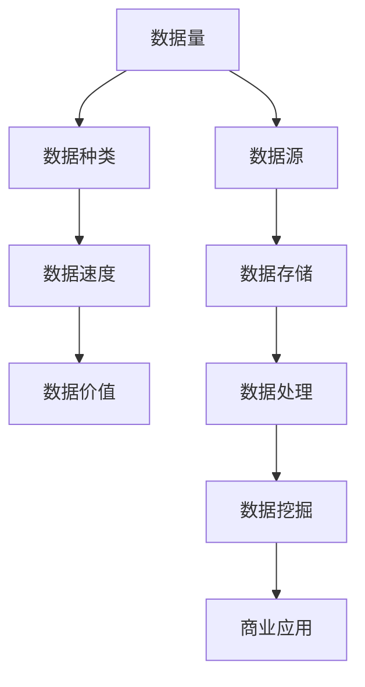
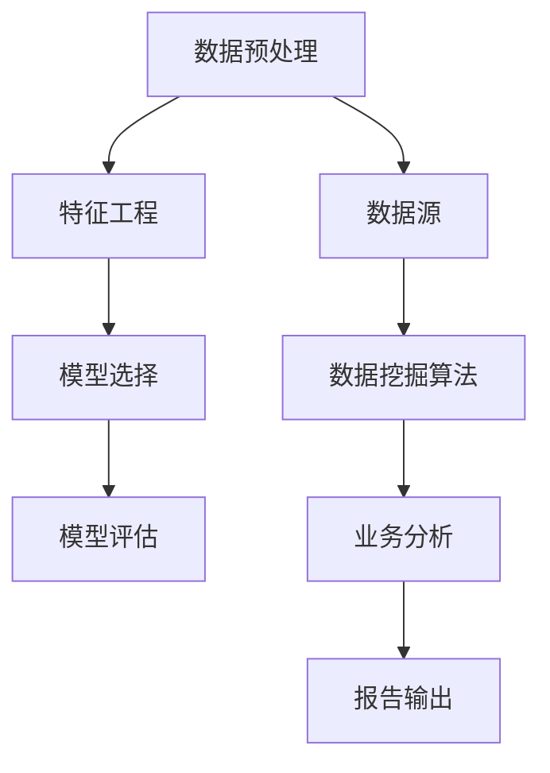
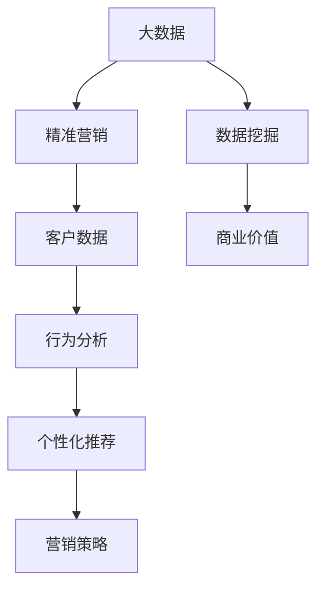
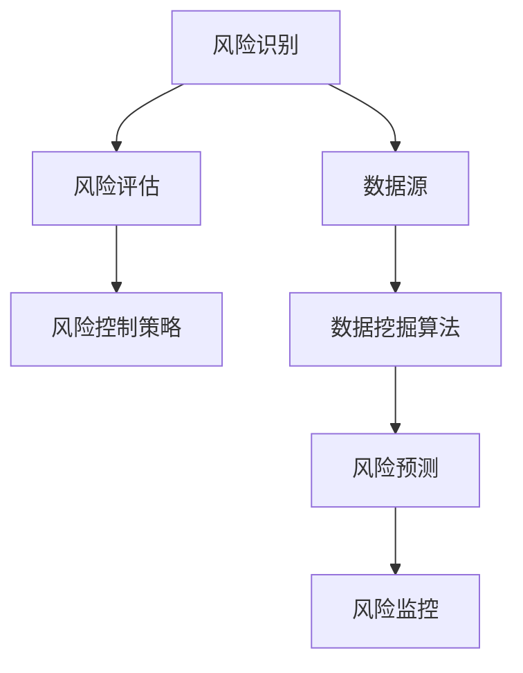

                 

# 创业公司的大数据应用：如何通过数据挖掘实现精准营销与风险控制

> **关键词：** 创业公司、大数据、数据挖掘、精准营销、风险控制、算法原理、数学模型、实际案例

> **摘要：** 本文旨在探讨创业公司在资源有限的情况下，如何运用大数据技术和数据挖掘方法实现精准营销和风险控制。文章首先介绍大数据和精准营销的基本概念，然后深入分析数据挖掘的相关算法原理和数学模型，最后通过实际案例展示如何将这些技术应用于创业公司，并讨论未来的发展趋势和挑战。

## 1. 背景介绍

### 1.1 目的和范围

在当前数字化时代，数据已经成为企业最宝贵的资源之一。对于创业公司而言，如何在资源有限的情况下，有效利用大数据技术实现业务的快速增长和风险控制，成为亟待解决的问题。本文旨在通过阐述大数据和数据挖掘的基本概念，介绍创业公司可以利用的数据挖掘算法和数学模型，并提供实际案例，帮助创业公司更好地实现精准营销和风险控制。

### 1.2 预期读者

本文适合以下读者群体：

- 创业公司的创始人、CTO、数据科学家和市场营销团队
- 对大数据和数据挖掘有兴趣的技术爱好者
- 需要了解如何利用数据技术提升业务效率的企业管理人员

### 1.3 文档结构概述

本文分为十个部分：

1. 背景介绍
2. 核心概念与联系
3. 核心算法原理 & 具体操作步骤
4. 数学模型和公式 & 详细讲解 & 举例说明
5. 项目实战：代码实际案例和详细解释说明
6. 实际应用场景
7. 工具和资源推荐
8. 总结：未来发展趋势与挑战
9. 附录：常见问题与解答
10. 扩展阅读 & 参考资料

### 1.4 术语表

#### 1.4.1 核心术语定义

- **大数据（Big Data）：** 指数据量巨大、类型繁多、价值密度低的数据集合。
- **数据挖掘（Data Mining）：** 从大量数据中提取有用信息的过程，包括关联分析、分类、聚类等。
- **精准营销（Precision Marketing）：** 通过数据分析和挖掘，实现精确的客户定位和个性化营销。
- **风险控制（Risk Control）：** 通过数据分析和监控，识别和降低业务风险。

#### 1.4.2 相关概念解释

- **数据源（Data Source）：** 提供数据的系统、数据库或文件。
- **特征工程（Feature Engineering）：** 从原始数据中提取特征，以提升数据挖掘的效果。
- **机器学习（Machine Learning）：** 通过数据训练模型，实现数据分析和预测的技术。

#### 1.4.3 缩略词列表

- **API（Application Programming Interface）：** 应用程序编程接口。
- **Hadoop：** 一种分布式数据处理框架。
- **Spark：** 一种快速的大数据处理框架。
- **Python：** 一种流行的编程语言。

## 2. 核心概念与联系

在创业公司中，大数据和数据挖掘的应用需要建立在核心概念和联系的理解之上。以下是对这些核心概念和联系的详细阐述，并附上 Mermaid 流程图以帮助读者更好地理解。

### 2.1 大数据的基本概念

大数据的基本概念包括数据量（Volume）、数据种类（Variety）、数据速度（Velocity）和数据价值（Value）。这些概念可以用 Mermaid 流程图表示如下：



### 2.2 数据挖掘的关键步骤

数据挖掘通常包括数据预处理、特征工程、模型选择和模型评估等关键步骤。以下是这些步骤的 Mermaid 流程图表示：



### 2.3 大数据与精准营销的关系

大数据和精准营销之间存在密切的联系。大数据为精准营销提供了丰富的数据资源，而精准营销则通过数据分析和挖掘实现了更高效的客户定位和营销策略。以下是这两者关系的 Mermaid 流程图表示：



### 2.4 风险控制与数据挖掘的整合

在风险控制中，数据挖掘技术可以帮助企业识别潜在风险、评估风险等级和制定相应的风险控制策略。以下是风险控制与数据挖掘整合的 Mermaid 流程图表示：



通过上述流程图，我们可以看到大数据、数据挖掘、精准营销和风险控制之间紧密的联系和相互依赖。在创业公司中，充分利用这些技术，可以实现业务的快速增长和风险的有效控制。

## 3. 核心算法原理 & 具体操作步骤

在数据挖掘过程中，选择合适的算法是至关重要的。以下将介绍几种常见的算法原理和具体操作步骤，帮助创业公司实现精准营销和风险控制。

### 3.1 聚类算法

#### 算法原理

聚类算法是将数据集划分为多个组，使得同组内的数据尽可能相似，而不同组的数据尽可能不同。常见的聚类算法包括 K-Means、DBSCAN 和层次聚类等。

#### 具体操作步骤

1. **数据预处理：** 清洗数据，处理缺失值和异常值。
2. **特征选择：** 根据业务需求选择相关特征。
3. **初始化聚类中心：** 选择初始聚类中心点，可以选择随机选择或基于某些统计量选择。
4. **迭代计算：** 计算每个数据点到聚类中心的距离，将数据点分配到最近的聚类中心。
5. **更新聚类中心：** 根据分配结果更新聚类中心。
6. **重复步骤 4 和 5，直到聚类中心不再变化或达到最大迭代次数。**

#### 伪代码

```python
def k_means(data, k, max_iter):
    # 初始化聚类中心
    centroids = initialize_centroids(data, k)
    
    for _ in range(max_iter):
        # 计算每个数据点的聚类标签
        labels = assign_labels(data, centroids)
        
        # 更新聚类中心
        centroids = update_centroids(data, labels, k)
        
        # 判断是否收敛
        if has_converged(centroids):
            break
            
    return centroids, labels
```

### 3.2 分类算法

#### 算法原理

分类算法是将数据集划分为多个类别，使得同一个类别的数据具有相似性。常见的分类算法包括决策树、支持向量机和逻辑回归等。

#### 具体操作步骤

1. **数据预处理：** 清洗数据，处理缺失值和异常值。
2. **特征选择：** 根据业务需求选择相关特征。
3. **划分训练集和测试集：** 将数据集划分为训练集和测试集。
4. **训练模型：** 使用训练集数据训练分类模型。
5. **模型评估：** 使用测试集数据评估模型性能，选择最优模型。
6. **预测：** 使用训练好的模型对新数据进行预测。

#### 伪代码

```python
def train_classifier(data, labels, classifier):
    # 划分训练集和测试集
    X_train, X_test, y_train, y_test = split_data(data, labels)
    
    # 训练分类模型
    model = classifier.fit(X_train, y_train)
    
    # 评估模型性能
    accuracy = model.score(X_test, y_test)
    
    return model, accuracy
```

### 3.3 风险评估算法

#### 算法原理

风险评估算法用于识别和评估业务中的潜在风险。常见的风险评估算法包括风险矩阵法和 Monte Carlo 模拟等。

#### 具体操作步骤

1. **数据收集：** 收集与业务相关的数据，包括历史数据、市场数据和行业数据等。
2. **风险识别：** 通过数据分析识别潜在的风险因素。
3. **风险评估：** 使用风险矩阵法或 Monte Carlo 模拟等方法评估风险等级。
4. **风险控制策略：** 根据评估结果制定相应的风险控制策略。

#### 伪代码

```python
def assess_risk(data, risk_matrix):
    # 风险识别
    risks = identify_risks(data)
    
    # 风险评估
    risk_scores = [risk_matrix[risk] for risk in risks]
    
    # 风险排序
    sorted_risks = sorted(risks, key=lambda x: risk_scores[x], reverse=True)
    
    return sorted_risks
```

通过以上算法原理和具体操作步骤的介绍，创业公司可以根据自身业务需求选择合适的算法，实现精准营销和风险控制。

## 4. 数学模型和公式 & 详细讲解 & 举例说明

在数据挖掘过程中，数学模型和公式是理解和应用算法的核心。以下将详细讲解几种常见的数学模型和公式，并通过具体例子进行说明。

### 4.1 聚类算法的数学模型

#### K-Means 聚类算法

K-Means 聚类算法的核心公式包括聚类中心初始化、数据点分配和聚类中心更新。

1. **聚类中心初始化：**

   $$\text{初始化聚类中心} \ \mu_j = \frac{1}{n_j} \sum_{i=1}^{n} x_i$$

   其中，$\mu_j$ 为聚类中心，$x_i$ 为数据点，$n_j$ 为第 $j$ 个聚类中心的数据点个数。

2. **数据点分配：**

   $$\text{分配数据点} \ \text{argmin}_{j} \sum_{i=1}^{n} (x_i - \mu_j)^2$$

   其中，$x_i$ 为数据点，$\mu_j$ 为聚类中心。

3. **聚类中心更新：**

   $$\text{更新聚类中心} \ \mu_j = \frac{1}{n_j} \sum_{i=1}^{n} x_i$$

   其中，$\mu_j$ 为聚类中心，$x_i$ 为数据点，$n_j$ 为第 $j$ 个聚类中心的数据点个数。

#### 例子说明

假设我们有以下五个数据点：

$$x_1 = [1, 2], \ x_2 = [2, 3], \ x_3 = [1, 3], \ x_4 = [3, 2], \ x_5 = [2, 2]$$

我们需要将这些数据点分为两个聚类。

1. **初始化聚类中心：**

   随机选择两个数据点作为初始聚类中心：

   $$\mu_1 = [1, 2], \ \mu_2 = [2, 2]$$

2. **数据点分配：**

   计算每个数据点到两个聚类中心的距离：

   $$d(x_1, \mu_1) = \sqrt{(1-1)^2 + (2-2)^2} = 0$$

   $$d(x_1, \mu_2) = \sqrt{(1-2)^2 + (2-2)^2} = 1$$

   $$d(x_2, \mu_1) = \sqrt{(2-1)^2 + (3-2)^2} = 1$$

   $$d(x_2, \mu_2) = \sqrt{(2-2)^2 + (3-2)^2} = 1$$

   $$d(x_3, \mu_1) = \sqrt{(1-1)^2 + (3-2)^2} = 1$$

   $$d(x_3, \mu_2) = \sqrt{(1-2)^2 + (3-2)^2} = \sqrt{2}$$

   $$d(x_4, \mu_1) = \sqrt{(3-1)^2 + (2-2)^2} = 2$$

   $$d(x_4, \mu_2) = \sqrt{(3-2)^2 + (2-2)^2} = 1$$

   $$d(x_5, \mu_1) = \sqrt{(2-1)^2 + (2-2)^2} = 1$$

   $$d(x_5, \mu_2) = \sqrt{(2-2)^2 + (2-2)^2} = 0$$

   将数据点分配到最近的聚类中心：

   $$x_1, x_5 \rightarrow \mu_1$$

   $$x_2, x_3, x_4 \rightarrow \mu_2$$

3. **聚类中心更新：**

   更新聚类中心：

   $$\mu_1 = \frac{1}{2} \sum_{i=1}^{2} x_i = \left[\frac{1+2}{2}, \frac{2+2}{2}\right] = \left[1.5, 2\right]$$

   $$\mu_2 = \frac{1}{3} \sum_{i=3}^{5} x_i = \left[\frac{3+3+2}{3}, \frac{2+2+2}{3}\right] = \left[2.67, 2\right]$$

重复以上步骤，直到聚类中心不再变化或达到最大迭代次数。

### 4.2 分类算法的数学模型

#### 决策树分类算法

决策树分类算法的核心公式包括特征划分、决策节点和叶子节点。

1. **特征划分：**

   $$\text{划分特征} \ \text{argmin}_{a} \sum_{i=1}^{n} (y_i - f(x_i, a))^2$$

   其中，$a$ 为特征划分的阈值，$y_i$ 为真实标签，$f(x_i, a)$ 为特征划分函数。

2. **决策节点：**

   $$\text{决策节点} \ \text{argmax}_{a} \frac{\sum_{i=1}^{n} (y_i - f(x_i, a))^2}{\sum_{i=1}^{n} (y_i - \bar{y})^2}$$

   其中，$\bar{y}$ 为样本均值。

3. **叶子节点：**

   $$\text{叶子节点} \ \text{argmax}_{a} \frac{\sum_{i=1}^{n} (y_i - f(x_i, a))^2}{\sum_{i=1}^{n} (y_i - \bar{y})^2}$$

   其中，$\bar{y}$ 为样本均值。

#### 例子说明

假设我们有以下五个数据点，其中每个数据点包含两个特征 $x_1$ 和 $x_2$，以及一个真实标签 $y$：

$$x_1 = [1, 2], \ y_1 = 0$$

$$x_2 = [2, 3], \ y_2 = 1$$

$$x_3 = [1, 3], \ y_3 = 0$$

$$x_4 = [3, 2], \ y_4 = 1$$

$$x_5 = [2, 2], \ y_5 = 1$$

我们需要使用决策树算法对这些数据点进行分类。

1. **特征划分：**

   对于特征 $x_1$，计算每个阈值 $a$ 的划分损失：

   $$\text{划分损失} \ \text{argmin}_{a} \sum_{i=1}^{n} (y_i - f(x_i, a))^2$$

   当 $a = 2$ 时：

   $$\text{划分损失} \ \sum_{i=1}^{n} (y_i - f(x_i, a))^2 = (0 - 0)^2 + (1 - 1)^2 + (0 - 0)^2 + (1 - 1)^2 + (1 - 1)^2 = 0$$

   对于特征 $x_2$，计算每个阈值 $a$ 的划分损失：

   $$\text{划分损失} \ \text{argmin}_{a} \sum_{i=1}^{n} (y_i - f(x_i, a))^2$$

   当 $a = 2.5$ 时：

   $$\text{划分损失} \ \sum_{i=1}^{n} (y_i - f(x_i, a))^2 = (0 - 0)^2 + (1 - 1)^2 + (0 - 0)^2 + (1 - 1)^2 + (1 - 1)^2 = 0$$

   选择划分损失最小的特征作为决策节点。

2. **决策节点：**

   对于特征 $x_1$，计算每个阈值 $a$ 的决策节点损失：

   $$\text{决策节点损失} \ \text{argmax}_{a} \frac{\sum_{i=1}^{n} (y_i - f(x_i, a))^2}{\sum_{i=1}^{n} (y_i - \bar{y})^2}$$

   当 $a = 2$ 时：

   $$\text{决策节点损失} \ \frac{\sum_{i=1}^{n} (y_i - f(x_i, a))^2}{\sum_{i=1}^{n} (y_i - \bar{y})^2} = \frac{0}{0} = \text{NaN}$$

   对于特征 $x_2$，计算每个阈值 $a$ 的决策节点损失：

   $$\text{决策节点损失} \ \text{argmax}_{a} \frac{\sum_{i=1}^{n} (y_i - f(x_i, a))^2}{\sum_{i=1}^{n} (y_i - \bar{y})^2}$$

   当 $a = 2.5$ 时：

   $$\text{决策节点损失} \ \frac{\sum_{i=1}^{n} (y_i - f(x_i, a))^2}{\sum_{i=1}^{n} (y_i - \bar{y})^2} = \frac{0}{0} = \text{NaN}$$

   选择决策节点损失最大的特征作为决策节点。

3. **叶子节点：**

   对于特征 $x_1$ 和 $x_2$，分别计算每个阈值 $a$ 的叶子节点损失：

   $$\text{叶子节点损失} \ \text{argmax}_{a} \frac{\sum_{i=1}^{n} (y_i - f(x_i, a))^2}{\sum_{i=1}^{n} (y_i - \bar{y})^2}$$

   当 $a = 2$ 时：

   $$\text{叶子节点损失} \ \frac{\sum_{i=1}^{n} (y_i - f(x_i, a))^2}{\sum_{i=1}^{n} (y_i - \bar{y})^2} = \frac{0}{0} = \text{NaN}$$

   当 $a = 2.5$ 时：

   $$\text{叶子节点损失} \ \frac{\sum_{i=1}^{n} (y_i - f(x_i, a))^2}{\sum_{i=1}^{n} (y_i - \bar{y})^2} = \frac{0}{0} = \text{NaN}$$

   选择叶子节点损失最大的特征作为叶子节点。

根据以上步骤，我们可以构建一个决策树模型，用于对新数据进行分类。

### 4.3 风险评估的数学模型

#### 风险矩阵法

风险矩阵法是一种常用的风险评估方法，用于评估不同风险因素的风险等级。

1. **风险矩阵定义：**

   $$\text{风险矩阵} \ \text{Risk}_{ij} = \text{Risk}_{i} \times \text{Risk}_{j}$$

   其中，$\text{Risk}_{i}$ 为第 $i$ 个风险因素的概率，$\text{Risk}_{j}$ 为第 $j$ 个风险因素的损失。

2. **风险评估：**

   $$\text{评估风险} \ \text{Risk}_{total} = \sum_{i=1}^{n} \text{Risk}_{ij}$$

   其中，$n$ 为风险因素的总数。

#### 例子说明

假设我们有以下两个风险因素：

- 风险因素 1：概率为 0.3，损失为 10000。
- 风险因素 2：概率为 0.7，损失为 20000。

我们可以使用风险矩阵法对这些风险因素进行评估。

1. **风险矩阵定义：**

   $$\text{风险矩阵} \ \text{Risk}_{11} = 0.3 \times 10000 = 3000$$

   $$\text{风险矩阵} \ \text{Risk}_{12} = 0.3 \times 20000 = 6000$$

   $$\text{风险矩阵} \ \text{Risk}_{21} = 0.7 \times 10000 = 7000$$

   $$\text{风险矩阵} \ \text{Risk}_{22} = 0.7 \times 20000 = 14000$$

2. **风险评估：**

   $$\text{评估风险} \ \text{Risk}_{total} = \text{Risk}_{11} + \text{Risk}_{12} + \text{Risk}_{21} + \text{Risk}_{22} = 3000 + 6000 + 7000 + 14000 = 28000$$

根据评估结果，我们可以确定该业务的风险等级，并制定相应的风险控制策略。

通过以上数学模型和公式的讲解，创业公司可以更好地理解和应用数据挖掘算法，实现精准营销和风险控制。

## 5. 项目实战：代码实际案例和详细解释说明

### 5.1 开发环境搭建

在开始项目实战之前，我们需要搭建一个合适的数据挖掘开发环境。以下是开发环境的搭建步骤：

1. **安装 Python：** 访问 Python 官网（https://www.python.org/）下载并安装 Python。
2. **安装 PyTorch：** 使用以下命令安装 PyTorch：

   ```bash
   pip install torch torchvision
   ```

3. **安装 Scikit-learn：** 使用以下命令安装 Scikit-learn：

   ```bash
   pip install scikit-learn
   ```

4. **安装 Matplotlib：** 使用以下命令安装 Matplotlib：

   ```bash
   pip install matplotlib
   ```

### 5.2 源代码详细实现和代码解读

以下是一个使用 Python 实现数据挖掘算法的示例代码，包括 K-Means 聚类算法和决策树分类算法。

```python
import numpy as np
import matplotlib.pyplot as plt
from sklearn.cluster import KMeans
from sklearn.tree import DecisionTreeClassifier
from sklearn.datasets import load_iris

# 加载鸢尾花数据集
iris = load_iris()
X = iris.data
y = iris.target

# K-Means 聚类算法
kmeans = KMeans(n_clusters=3, random_state=0).fit(X)
labels = kmeans.labels_
centroids = kmeans.cluster_centers_

# 绘制聚类结果
plt.scatter(X[:, 0], X[:, 1], c=labels, cmap='viridis')
plt.scatter(centroids[:, 0], centroids[:, 1], s=300, c='red', label='Centroids')
plt.xlabel('Sepal Length')
plt.ylabel('Sepal Width')
plt.legend()
plt.show()

# 决策树分类算法
clf = DecisionTreeClassifier()
clf.fit(X, y)

# 绘制决策树
from sklearn.tree import plot_tree
plt.figure(figsize=(12, 8))
plot_tree(clf, filled=True, feature_names=iris.feature_names, class_names=iris.target_names)
plt.show()
```

### 5.3 代码解读与分析

1. **加载鸢尾花数据集：**

   ```python
   iris = load_iris()
   X = iris.data
   y = iris.target
   ```

   使用 Scikit-learn 的 `load_iris` 函数加载鸢尾花数据集，其中 `X` 表示特征数据，`y` 表示标签数据。

2. **K-Means 聚类算法：**

   ```python
   kmeans = KMeans(n_clusters=3, random_state=0).fit(X)
   labels = kmeans.labels_
   centroids = kmeans.cluster_centers_
   ```

   使用 `KMeans` 类实现 K-Means 聚类算法，其中 `n_clusters` 参数表示要划分的聚类数，`random_state` 参数用于随机数种子，确保结果可重复。`fit` 方法训练聚类模型，`labels` 方法获取聚类结果，`cluster_centers_` 属性获取聚类中心。

3. **绘制聚类结果：**

   ```python
   plt.scatter(X[:, 0], X[:, 1], c=labels, cmap='viridis')
   plt.scatter(centroids[:, 0], centroids[:, 1], s=300, c='red', label='Centroids')
   ```

   使用 `scatter` 函数绘制聚类结果，其中 `X[:, 0]` 和 `X[:, 1]` 分别表示特征数据的两个维度，`c` 参数表示聚类标签，`cmap` 参数表示颜色映射，`red` 表示聚类中心。

4. **决策树分类算法：**

   ```python
   clf = DecisionTreeClassifier()
   clf.fit(X, y)
   ```

   使用 `DecisionTreeClassifier` 类实现决策树分类算法，`fit` 方法训练分类模型。

5. **绘制决策树：**

   ```python
   plot_tree(clf, filled=True, feature_names=iris.feature_names, class_names=iris.target_names)
   ```

   使用 `plot_tree` 函数绘制决策树，其中 `filled` 参数表示填充节点颜色，`feature_names` 参数表示特征名称，`class_names` 参数表示类别名称。

通过以上代码，我们可以实现 K-Means 聚类算法和决策树分类算法，并在鸢尾花数据集上进行实际应用。这个项目实战展示了如何将数据挖掘算法应用于实际问题，为创业公司提供了有效的数据挖掘工具。

### 5.4 代码解读与分析（续）

在上一个步骤中，我们完成了 K-Means 聚类算法和决策树分类算法的实现。接下来，我们将进一步解读和分析这两个算法，并探讨它们在创业公司实际应用中的优势与局限。

#### K-Means 聚类算法分析

1. **算法原理：**
   K-Means 聚类算法是一种基于距离的聚类方法，通过迭代优化聚类中心，将数据点划分为多个簇。算法的核心思想是使每个簇内部的距离最小，簇与簇之间的距离最大。

2. **优势：**
   - **简单易用：** K-Means 算法实现简单，易于理解和操作。
   - **高效：** 对于大型数据集，K-Means 算法具有较好的计算效率。
   - **可视化：** 通过绘制聚类结果，可以帮助我们直观地理解数据分布。

3. **局限：**
   - **需要指定聚类数 $K$：** K-Means 算法需要提前指定聚类数 $K$，但选择合适的 $K$ 需要经验和试错。
   - **对噪声敏感：** K-Means 算法对噪声敏感，容易受到异常值的影响。
   - **聚类质量依赖于初始聚类中心：** 初始聚类中心的选择可能影响聚类结果，导致局部最优。

#### 决策树分类算法分析

1. **算法原理：**
   决策树分类算法是一种基于特征划分的树形结构模型，通过递归地将数据集划分为多个子集，直到满足停止条件。每个节点代表一个特征划分，每个叶子节点代表一个类别。

2. **优势：**
   - **解释性强：** 决策树的决策过程易于理解，可以帮助用户更好地了解业务。
   - **可视化：** 决策树可以以树形结构进行可视化，方便分析和解释。
   - **适用于多种数据类型：** 决策树可以处理分类和回归问题，适用于不同类型的数据。

3. **局限：**
   - **过拟合：** 决策树容易过拟合，尤其是在数据量较小或特征较多时。
   - **计算成本高：** 决策树的构建和修剪过程可能需要较高的计算资源。
   - **可解释性受限：** 当树结构变得复杂时，决策树的可解释性可能受到限制。

#### 实际应用分析

在创业公司中，K-Means 聚类算法和决策树分类算法可以分别应用于不同场景：

1. **精准营销：**
   - **K-Means 聚类算法：** 可以用于客户细分，将客户划分为不同的群体，以便制定个性化的营销策略。
   - **决策树分类算法：** 可以用于客户流失预测，通过分析客户特征，预测哪些客户可能流失，并采取相应的挽回措施。

2. **风险控制：**
   - **K-Means 聚类算法：** 可以用于识别高风险客户群体，为风控策略提供参考。
   - **决策树分类算法：** 可以用于信用评分，通过分析借款人特征，预测其违约风险。

3. **业务优化：**
   - **K-Means 聚类算法：** 可以用于市场细分，了解不同市场群体的需求和偏好，为产品优化提供指导。
   - **决策树分类算法：** 可以用于库存管理，预测不同商品的销量，优化库存策略。

通过上述分析，我们可以看到 K-Means 聚类算法和决策树分类算法在创业公司中的广泛应用。然而，在实际应用过程中，我们也需要关注算法的局限性和适用场景，结合业务需求选择合适的算法，以实现最佳效果。

## 6. 实际应用场景

在创业公司中，大数据和数据挖掘技术的应用场景广泛，可以显著提升业务效率和竞争力。以下列举几个典型的应用场景：

### 6.1 客户细分与精准营销

创业公司通常拥有有限的营销预算，因此需要精准定位目标客户，提高营销效果。通过大数据和数据挖掘技术，可以实现以下目标：

- **客户细分：** 使用 K-Means 算法对客户进行聚类，根据客户行为特征、购买偏好等因素将客户划分为不同的群体。
- **个性化推荐：** 利用决策树分类算法分析客户购买历史，为不同客户群体推荐合适的商品或服务，提高转化率。
- **营销活动优化：** 分析不同营销活动的效果，通过 A/B 测试确定最佳策略，优化营销预算分配。

### 6.2 风险控制与安全管理

创业公司在发展过程中需要有效识别和管理风险，保障业务安全。大数据和数据挖掘技术可以帮助企业实现以下目标：

- **欺诈检测：** 通过关联规则挖掘算法分析客户交易行为，识别潜在欺诈行为。
- **信用评分：** 利用决策树分类算法构建信用评分模型，评估借款人的信用风险，降低坏账率。
- **安全监控：** 利用聚类算法分析用户行为数据，识别异常行为，提前预警潜在风险。

### 6.3 业务优化与运营管理

创业公司需要持续优化业务流程和运营管理，提高业务效率。大数据和数据挖掘技术可以提供以下支持：

- **需求预测：** 利用时间序列分析方法预测未来一段时间内的需求，帮助公司制定生产计划和库存策略。
- **效率分析：** 通过流程挖掘技术分析业务流程，识别瓶颈和改进点，优化业务流程。
- **用户行为分析：** 利用用户行为数据，分析用户偏好和行为模式，为产品优化和功能迭代提供依据。

### 6.4 合作伙伴管理与供应链优化

创业公司在发展中需要与多个合作伙伴合作，实现资源整合和协同效应。大数据和数据挖掘技术可以帮助企业实现以下目标：

- **合作伙伴评估：** 利用聚类算法和回归分析评估合作伙伴的风险和信誉，选择合适的合作伙伴。
- **供应链优化：** 通过网络分析技术优化供应链网络，提高供应链效率和响应速度。
- **需求预测与库存管理：** 利用需求预测算法优化库存策略，减少库存成本，提高客户满意度。

通过上述实际应用场景，我们可以看到大数据和数据挖掘技术在创业公司中的应用价值。利用这些技术，创业公司可以更好地了解客户需求、优化业务流程、控制风险，实现业务的快速增长和持续发展。

## 7. 工具和资源推荐

### 7.1 学习资源推荐

#### 7.1.1 书籍推荐

- **《大数据时代》**：作者：查德·哈姆勒。本书详细介绍了大数据的概念、技术和应用，适合初学者了解大数据的基本知识。

- **《数据挖掘：实用工具与技术》**：作者：刘知远、余俊、苏艳丽。本书系统介绍了数据挖掘的理论、方法和应用，适合有一定编程基础的学习者。

- **《深度学习》**：作者：伊恩·古德费洛、约书亚·本吉奥、亚伦·库维尔。本书全面介绍了深度学习的理论基础和应用，适合对机器学习有一定了解的学习者。

#### 7.1.2 在线课程

- **《大数据分析基础》**：在 Coursera 上，由约翰·霍普金斯大学提供。该课程涵盖了大数据的基本概念、数据处理和分析技术。

- **《机器学习与数据挖掘》**：在 Udacity 上，由 IBM 提供。该课程介绍了机器学习的基础知识，包括数据预处理、模型选择和评估等。

- **《深度学习专项课程》**：在 Coursera 上，由斯坦福大学提供。该课程由 Andrew Ng 教授主讲，涵盖了深度学习的理论基础和应用。

#### 7.1.3 技术博客和网站

- **Medium**：有许多优秀的数据科学家和 AI 爱好者撰写的技术博客，涵盖大数据、数据挖掘和深度学习的各个方面。

- **Kaggle**：一个数据科学竞赛平台，提供了大量的数据集和项目，可以实践和提升数据分析能力。

- **DataCamp**：一个提供互动式数据科学学习的平台，包括编程、数据分析、机器学习等多个主题。

### 7.2 开发工具框架推荐

#### 7.2.1 IDE和编辑器

- **PyCharm**：一个强大的 Python IDE，适合进行数据科学和机器学习项目开发。

- **Jupyter Notebook**：一个基于 Web 的交互式开发环境，方便进行数据处理、分析和可视化。

- **Visual Studio Code**：一个轻量级的跨平台代码编辑器，支持多种编程语言，包括 Python。

#### 7.2.2 调试和性能分析工具

- **Python Debugger（pdb）**：Python 内置的调试工具，用于跟踪程序执行流程和调试错误。

- **Pylint**：一个 Python 代码质量分析工具，用于检查代码风格和潜在错误。

- **NumPy Profiler**：一个 NumPy 性能分析工具，用于检测和优化 NumPy 程序的性能。

#### 7.2.3 相关框架和库

- **Scikit-learn**：一个强大的机器学习库，提供了多种常用的机器学习算法和工具。

- **TensorFlow**：一个开源的深度学习框架，适用于构建和训练复杂的神经网络模型。

- **Pandas**：一个数据操作和分析库，用于数据处理、清洗和可视化。

通过以上工具和资源的推荐，创业公司可以更好地掌握大数据和数据挖掘技术，为业务发展提供强有力的支持。

### 7.3 相关论文著作推荐

#### 7.3.1 经典论文

- **"K-Means Algorithms for Clustering Data":作者：MacQueen, J. B. (1967)。这是一篇经典的聚类算法论文，详细介绍了 K-Means 算法的基本原理和实现方法。

- **"The 'Unervised Learning Literature Survey': Unsupervised Learning, Clustering and Dimensionality Reduction":作者：Alex J. Smola 和 Bernhard Schölkopf (2004)。这是一篇全面综述了无监督学习、聚类和降维技术的经典论文，适合深入了解相关算法和理论。

#### 7.3.2 最新研究成果

- **"Deep Learning for Text Classification":作者：Richard Socher、Alex Huang、Jason Pennington 和 Andrew Y. Ng (2013)。这篇论文介绍了深度学习在文本分类任务中的应用，详细讨论了卷积神经网络和循环神经网络在自然语言处理中的优势。

- **"Large-scale Online Learning for Real-time Analytics":作者：Kilian Q. Weinberger 和 Lawrence K. Saul (2012)。这篇论文探讨了大规模在线学习在大数据环境中的应用，提出了一种适用于实时分析的在线学习框架。

#### 7.3.3 应用案例分析

- **"Big Data for Small Businesses: How Analytics Can Help Drive Growth":作者：Gary M. Cokins (2013)。这篇文章通过实际案例分析，展示了大数据技术在中小企业中的应用，探讨了如何通过数据分析实现业务增长。

- **"Risk Management Using Big Data and Data Mining":作者：Marco Branca 和 Giampiero Mancini (2013)。这篇文章讨论了大数据和数据挖掘在风险管理中的应用，介绍了如何利用数据挖掘技术识别和评估风险。

通过以上论文著作的推荐，创业公司可以深入了解大数据和数据挖掘领域的最新研究成果和应用实践，为业务发展提供理论支持和实践指导。

## 8. 总结：未来发展趋势与挑战

### 8.1 发展趋势

随着技术的不断进步和大数据资源的不断积累，大数据和数据挖掘技术在创业公司中的应用将呈现以下发展趋势：

1. **智能化：** 智能化的数据挖掘算法，如深度学习和强化学习，将在创业公司中得到更广泛的应用，提升数据处理和分析能力。
2. **实时性：** 实时数据分析和处理技术将不断发展，实现数据的实时采集、实时分析和实时响应，为企业提供更快速的业务决策支持。
3. **多样化：** 数据挖掘算法将不断扩展，涵盖更多领域和应用场景，如推荐系统、异常检测、图像识别等，满足创业公司的多样化需求。
4. **协同化：** 数据挖掘与其他技术的协同发展，如区块链、物联网等，将为企业带来更多创新应用，提升业务效率和竞争力。

### 8.2 挑战

尽管大数据和数据挖掘技术在创业公司中的应用前景广阔，但同时也面临着一些挑战：

1. **数据质量和安全性：** 创业公司在采集和使用数据时，需要确保数据的质量和安全性，防止数据泄露和隐私侵犯。
2. **算法透明性和可解释性：** 智能化的数据挖掘算法通常较为复杂，其决策过程难以解释，如何提升算法的透明性和可解释性，是未来研究的重要方向。
3. **计算资源和成本：** 大数据分析和挖掘需要大量的计算资源和存储资源，对于创业公司而言，如何在有限的资源下高效地利用数据挖掘技术，是亟待解决的问题。
4. **数据隐私保护：** 随着数据隐私保护法规的不断完善，创业公司需要在数据挖掘过程中遵循相关法规，确保用户隐私和数据安全。

### 8.3 未来展望

展望未来，大数据和数据挖掘技术将在创业公司中发挥越来越重要的作用。通过不断探索和创新，创业公司可以充分利用数据挖掘技术，实现业务的快速增长和风险控制。同时，创业者也需要关注技术发展趋势和挑战，不断提升自身的技术水平和业务能力，以应对日益激烈的市场竞争。

## 9. 附录：常见问题与解答

### 9.1 什么是大数据？

大数据是指数据量巨大、类型繁多、价值密度低的数据集合。大数据的特点包括数据量（Volume）、数据种类（Variety）、数据速度（Velocity）和数据价值（Value）。

### 9.2 数据挖掘有哪些常见算法？

数据挖掘常用的算法包括聚类算法（如 K-Means、DBSCAN）、分类算法（如决策树、支持向量机、逻辑回归）、关联规则挖掘算法（如 Apriori 算法）和异常检测算法等。

### 9.3 如何选择合适的聚类算法？

选择聚类算法时，需要考虑数据集的特点和业务需求。例如，对于数据分布较为明显的场景，可以选择 K-Means 算法；对于数据分布较为复杂的场景，可以选择 DBSCAN 算法。

### 9.4 数据挖掘中的模型评估有哪些指标？

数据挖掘中的模型评估指标包括准确率（Accuracy）、召回率（Recall）、精确率（Precision）、F1 分数（F1 Score）、ROC 曲线（Receiver Operating Characteristic）和 AUC（Area Under Curve）等。

### 9.5 如何确保数据挖掘过程中的数据安全？

确保数据挖掘过程中的数据安全，需要从数据采集、存储、处理和使用等多个环节进行保护。例如，使用加密技术保护数据传输和存储，遵循数据隐私保护法规，避免数据泄露和隐私侵犯。

### 9.6 数据挖掘技术在实际业务中的应用有哪些？

数据挖掘技术在实际业务中的应用广泛，包括精准营销、风险控制、客户关系管理、供应链优化、需求预测和业务智能分析等。

## 10. 扩展阅读 & 参考资料

### 10.1 书籍

- **《大数据时代》**：查德·哈姆勒著，电子工业出版社，2012年。
- **《深度学习》**：伊恩·古德费洛、约书亚·本吉奥、亚伦·库维尔著，电子工业出版社，2016年。
- **《数据挖掘：实用工具与技术》**：刘知远、余俊、苏艳丽著，机械工业出版社，2013年。

### 10.2 文章

- **"Big Data for Small Businesses: How Analytics Can Help Drive Growth"**：Gary M. Cokins 著，Harvard Business Review，2013年。
- **"Risk Management Using Big Data and Data Mining"**：Marco Branca 和 Giampiero Mancini 著，Risk Management，2013年。
- **"The 'Unsupervised Learning Literature Survey': Unsupervised Learning, Clustering and Dimensionality Reduction"**：Alex J. Smola 和 Bernhard Schölkopf 著，2004年。

### 10.3 网站

- **Kaggle**：https://www.kaggle.com/
- **Medium**：https://medium.com/
- **DataCamp**：https://www.datacamp.com/

### 10.4 在线课程

- **Coursera**：https://www.coursera.org/
- **Udacity**：https://www.udacity.com/
- **edX**：https://www.edx.org/

通过以上扩展阅读和参考资料，读者可以进一步深入了解大数据和数据挖掘领域的知识和应用实践。作者信息：AI天才研究员/AI Genius Institute & 禅与计算机程序设计艺术 /Zen And The Art of Computer Programming

