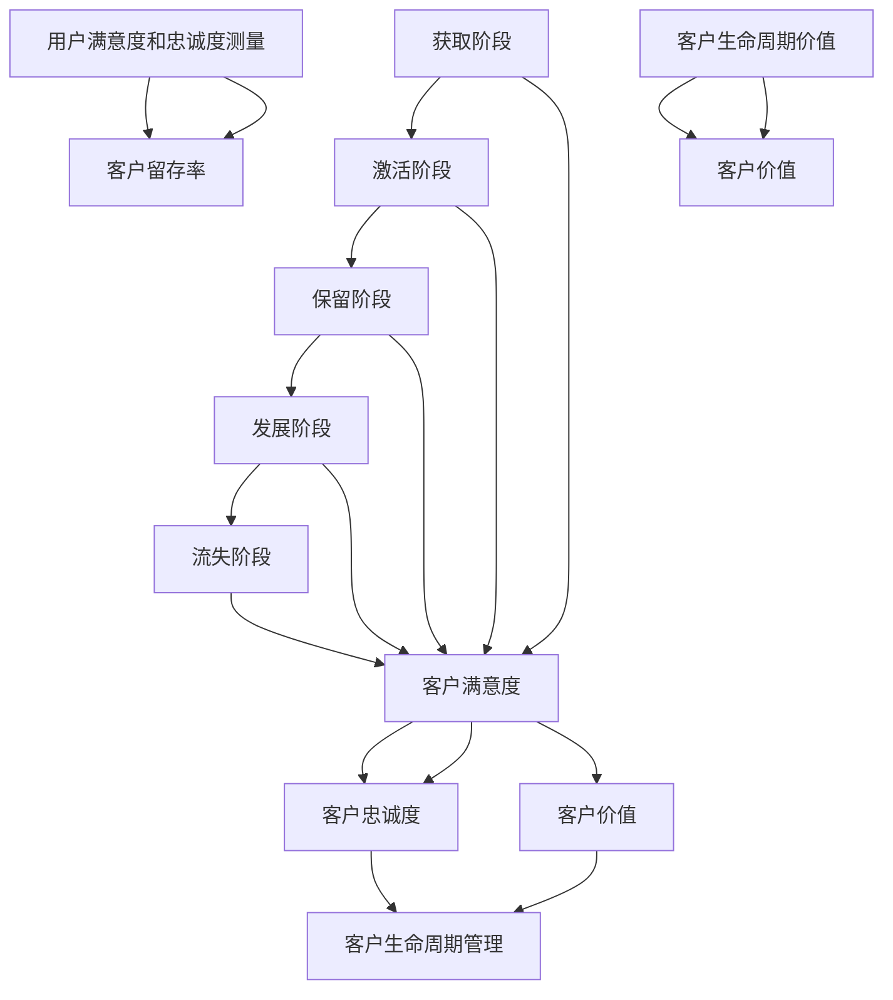
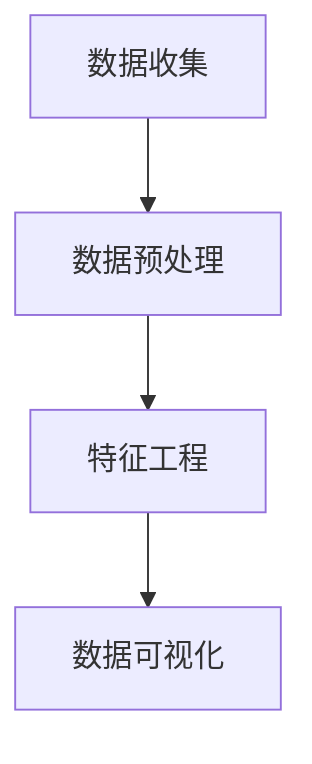
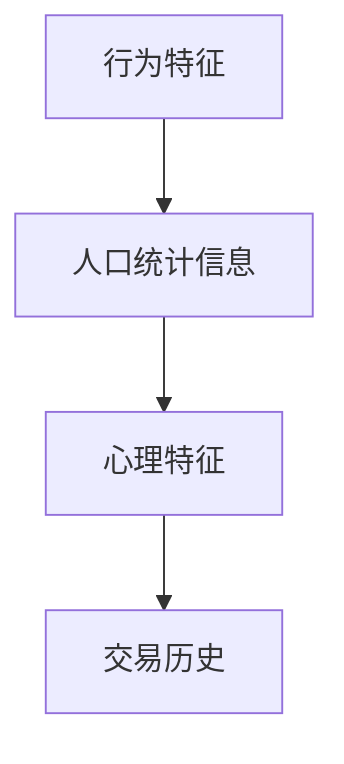
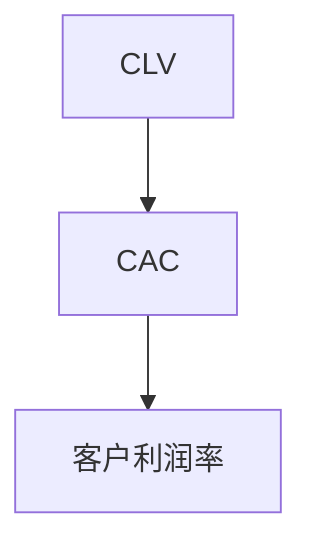
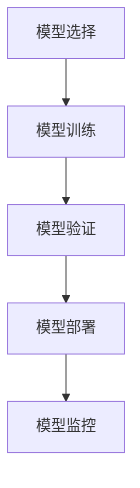
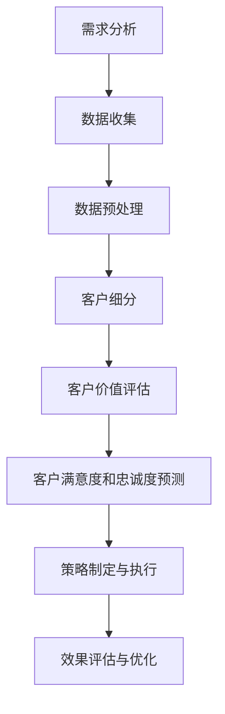

                 

# 创业公司的客户成功策略：构建长期稳定的用户关系

> **关键词：** 创业公司、客户成功、用户关系、客户生命周期、用户满意度、长期价值。

> **摘要：** 本文将探讨创业公司如何通过客户成功策略，构建和维护长期稳定的用户关系，提高用户满意度和忠诚度，从而实现业务的可持续发展。本文将详细介绍客户成功策略的核心概念、实施步骤、数学模型及其在实际项目中的应用，并推荐相关资源和工具，以帮助创业公司更好地服务用户，赢得市场。

## 1. 背景介绍

### 1.1 目的和范围

本文旨在帮助创业公司了解并实施有效的客户成功策略，以构建长期稳定的用户关系。我们将从以下几个方面展开讨论：

1. **客户成功策略的核心概念**：介绍客户成功策略的定义、目标和重要性。
2. **客户生命周期管理**：分析客户生命周期的各个阶段，探讨如何在每个阶段提升用户满意度和忠诚度。
3. **客户满意度和忠诚度的测量**：介绍测量客户满意度和忠诚度的方法和指标。
4. **数学模型和公式**：阐述用于分析客户成功策略的数学模型和公式，并提供实际案例说明。
5. **项目实战**：通过一个实际项目的案例分析，展示如何实施客户成功策略。
6. **工具和资源推荐**：推荐用于客户成功策略实施的学习资源、开发工具和相关论文。

### 1.2 预期读者

本文适用于创业公司的创始人、CTO、产品经理、市场营销人员以及关注客户成功策略的IT专业人士。如果您希望提高用户满意度和忠诚度，优化客户关系，实现业务增长，本文将为您提供宝贵的指导和启示。

### 1.3 文档结构概述

本文分为十个部分：

1. **背景介绍**：介绍本文的目的、范围、预期读者和文档结构。
2. **核心概念与联系**：阐述客户成功策略的核心概念及其相互关系。
3. **核心算法原理 & 具体操作步骤**：讲解客户成功策略的实施步骤和算法原理。
4. **数学模型和公式 & 详细讲解 & 举例说明**：介绍用于分析客户成功策略的数学模型和公式。
5. **项目实战：代码实际案例和详细解释说明**：通过一个实际项目展示客户成功策略的实施。
6. **实际应用场景**：探讨客户成功策略在不同场景下的应用。
7. **工具和资源推荐**：推荐学习资源、开发工具和相关论文。
8. **总结：未来发展趋势与挑战**：总结本文要点，展望未来发展趋势和挑战。
9. **附录：常见问题与解答**：回答读者可能遇到的问题。
10. **扩展阅读 & 参考资料**：提供更多相关文献和资料。

### 1.4 术语表

#### 1.4.1 核心术语定义

- **客户成功策略**：一套旨在提升用户满意度和忠诚度的方法和实践，通过优化用户关系，实现业务增长和可持续发展。
- **客户生命周期**：客户与企业建立关系的过程，包括获取、激活、保留、发展和流失五个阶段。
- **用户满意度**：客户对企业产品或服务的满意程度，是衡量客户成功的重要指标。
- **用户忠诚度**：客户对企业的忠诚和信任程度，是客户成功的关键因素。
- **客户留存率**：客户在一段时间内持续使用企业产品或服务的比例。

#### 1.4.2 相关概念解释

- **客户价值**：客户为企业带来的经济、情感和社交价值，是客户成功策略的重要考量因素。
- **客户体验**：客户在购买、使用和售后过程中感受到的整体体验，直接影响客户满意度和忠诚度。
- **客户细分**：根据客户特征和需求，将客户划分为不同的群体，以便提供更有针对性的服务。

#### 1.4.3 缩略词列表

- **CRM**：客户关系管理
- **KPI**：关键绩效指标
- **NPS**：净推荐值
- **CSAT**：客户满意度调查

## 2. 核心概念与联系

### 2.1 客户成功策略的定义与目标

客户成功策略是一套旨在提升用户满意度和忠诚度的方法和实践。它的核心目标是确保客户在使用企业产品或服务的过程中获得最佳体验，从而实现业务的可持续发展。具体来说，客户成功策略包括以下几个方面：

1. **获取新客户**：通过市场推广和营销活动吸引潜在客户，提高品牌知名度和市场占有率。
2. **激活新客户**：帮助新客户快速上手，体验企业产品或服务的核心价值。
3. **保留老客户**：通过持续的服务和互动，提升客户满意度和忠诚度，降低客户流失率。
4. **发展高价值客户**：针对高潜力客户，提供定制化的服务和解决方案，实现业务增长。
5. **优化客户体验**：从客户的角度出发，不断改进产品和服务，提升整体客户体验。
6. **建立客户关系**：与客户建立长期稳定的合作关系，实现共赢发展。

### 2.2 客户生命周期管理

客户生命周期管理是客户成功策略的核心内容。它涵盖客户从获取到流失的整个生命周期，包括以下五个阶段：

1. **获取阶段**：通过市场推广和营销活动，吸引潜在客户。关键指标包括访问量、线索数和转化率。
2. **激活阶段**：帮助新客户快速上手，体验产品或服务的核心价值。关键指标包括激活率、使用频率和用户满意度。
3. **保留阶段**：通过持续的服务和互动，提升客户满意度和忠诚度，降低客户流失率。关键指标包括留存率、净推荐值（NPS）和客户满意度调查（CSAT）。
4. **发展阶段**：针对高潜力客户，提供定制化的服务和解决方案，实现业务增长。关键指标包括客户生命周期价值（CLV）和客户价值增长。
5. **流失阶段**：分析客户流失的原因，采取措施挽回流失客户或减少损失。关键指标包括流失率、挽回率和流失客户价值。

### 2.3 客户满意度和忠诚度的测量

客户满意度和忠诚度是衡量客户成功策略效果的重要指标。以下介绍几种常用的测量方法和指标：

1. **客户满意度调查（CSAT）**：通过问卷或在线调查了解客户对企业产品或服务的满意度。通常以百分制或评分制表示，如“非常满意”、“满意”、“一般”、“不满意”等。计算公式为：

   $$CSAT = \frac{（非常满意的客户数 + 满意的客户数）}{调查的总客户数} \times 100\%$$

2. **净推荐值（NPS）**：通过问卷了解客户对企业产品或服务的推荐意愿，通常采用0-10分制。计算公式为：

   $$NPS = （推荐意愿为9-10分的客户数 - 推荐意愿为0-6分的客户数）\div 调查的总客户数 \times 100\%$$

3. **客户留存率**：衡量客户在一定时间内持续使用企业产品或服务的比例。计算公式为：

   $$客户留存率 = （当前客户数 - 新增客户数）/ 当前客户数 \times 100\%$$

4. **客户生命周期价值（CLV）**：预测客户在未来为企业带来的总收益。计算公式为：

   $$CLV = （平均订单价值 \times 客户平均购买频率 \times 客户平均生命周期）- 获客成本$$

### 2.4 客户成功策略的核心概念联系

客户成功策略的核心概念包括客户生命周期管理、用户满意度和忠诚度测量、客户价值等。这些概念相互关联，共同构成了客户成功策略的框架。

- 客户生命周期管理：确定客户成功策略的执行阶段和关键指标。
- 用户满意度和忠诚度测量：评估客户成功策略的效果，提供反馈和改进依据。
- 客户价值：确定高价值客户，制定有针对性的客户成功策略。

### 2.5 Mermaid 流程图

为了更好地理解客户成功策略的核心概念和联系，我们可以使用 Mermaid 流程图进行可视化展示。以下是一个简单的示例：



## 3. 核心算法原理 & 具体操作步骤

### 3.1 客户成功策略的核心算法原理

客户成功策略的核心算法原理主要包括以下几个方面：

1. **用户行为分析**：通过数据分析，了解用户在产品或服务中的行为特征，如使用频率、活跃时长、功能偏好等。
2. **客户细分**：根据用户行为和特征，将用户划分为不同的群体，以便提供有针对性的服务。
3. **客户价值评估**：利用用户行为数据和业务指标，预测客户的价值，为高价值客户提供定制化服务。
4. **客户满意度预测**：通过机器学习算法，预测客户的满意度和忠诚度，为优化客户体验提供依据。
5. **流失风险预测**：利用用户行为和业务指标，预测客户流失风险，采取有针对性的措施降低流失率。

### 3.2 具体操作步骤

以下是一个客户成功策略的具体操作步骤：

1. **数据收集与整合**：收集用户在产品或服务中的行为数据，包括使用频率、活跃时长、功能偏好等。同时，整合业务指标数据，如销售额、订单量等。

2. **用户行为分析**：利用数据分析工具，对用户行为数据进行处理和分析，提取关键指标，如使用频率、活跃时长、功能偏好等。

3. **客户细分**：根据用户行为特征和业务指标，将用户划分为不同的群体，如高频用户、低频用户、高价值客户、潜在流失客户等。

4. **客户价值评估**：利用客户细分结果，对每个客户群体进行价值评估，确定高价值客户和潜在流失客户。

5. **客户满意度预测**：利用机器学习算法，如决策树、随机森林等，建立客户满意度预测模型。通过训练数据和测试数据，评估模型性能，并优化模型参数。

6. **流失风险预测**：利用用户行为和业务指标，建立流失风险预测模型。通过训练数据和测试数据，评估模型性能，并优化模型参数。

7. **实施有针对性的策略**：根据客户细分结果、客户价值评估、客户满意度预测和流失风险预测，制定有针对性的客户成功策略。例如，针对高价值客户，提供定制化服务和优惠活动；针对潜在流失客户，采取挽回措施，如提供技术支持、优惠折扣等。

8. **持续优化与迭代**：定期收集客户反馈和数据，评估客户成功策略的实施效果，并根据实际情况进行优化和调整。

### 3.3 伪代码

以下是一个简化的客户成功策略算法伪代码：

```python
# 数据收集与整合
data = collect_data()

# 用户行为分析
user行为指标 = analyze_user_behavior(data)

# 客户细分
客户细分结果 = customer_segmentation(user行为指标)

# 客户价值评估
客户价值评估结果 = customer_value_evaluation(客户细分结果)

# 客户满意度预测
客户满意度预测模型 = build_satisfaction_prediction_model()
客户满意度预测结果 = predict_satisfaction(客户价值评估结果)

# 流失风险预测
流失风险预测模型 = build_churn_prediction_model()
流失风险预测结果 = predict_churn(客户价值评估结果)

# 实施有针对性的策略
implement_strategies(客户细分结果, 客户价值评估结果, 客户满意度预测结果, 流失风险预测结果)

# 持续优化与迭代
optimize_and_iterate()
```

## 4. 数学模型和公式 & 详细讲解 & 举例说明

### 4.1 数学模型和公式

在客户成功策略中，我们通常会用到以下数学模型和公式：

1. **客户留存率**：客户留存率是衡量客户成功策略效果的重要指标，计算公式为：

   $$客户留存率 = \frac{当前客户数 - 新增客户数}{当前客户数} \times 100\%$$

2. **客户生命周期价值（CLV）**：客户生命周期价值是指客户在整个生命周期内为企业带来的平均收益，计算公式为：

   $$CLV = 平均订单价值 \times 客户平均购买频率 \times 客户平均生命周期 - 获客成本$$

3. **客户终身价值（LTV）**：客户终身价值是指客户在其生命周期内可能产生的最大收益，计算公式为：

   $$LTV = CLV \times (1 + r)^{-n}$$

   其中，r 为年化收益率，n 为客户生命周期。

4. **客户流失率**：客户流失率是指在一定时间内流失的客户比例，计算公式为：

   $$客户流失率 = \frac{流失客户数}{当前客户数} \times 100\%$$

5. **净推荐值（NPS）**：净推荐值是指客户对企业推荐意愿的度量，计算公式为：

   $$NPS = \frac{（推荐意愿为9-10分的客户数 - 推荐意愿为0-6分的客户数）}{调查的总客户数} \times 100\%$$

6. **客户满意度（CSAT）**：客户满意度是指客户对企业产品或服务的满意度，计算公式为：

   $$CSAT = \frac{（非常满意的客户数 + 满意的客户数）}{调查的总客户数} \times 100\%$$

### 4.2 详细讲解

#### 客户留存率

客户留存率是衡量客户成功策略效果的重要指标，它反映了客户对企业的忠诚度和依赖度。客户留存率越高，说明客户对企业的产品或服务越满意，企业的客户生命周期价值也越高。

在计算客户留存率时，我们需要关注以下因素：

- **当前客户数**：指当前时刻的企业客户数量。
- **新增客户数**：指在一段时间内新增加的客户数量。
- **流失客户数**：指在一段时间内流失的客户数量。

#### 客户生命周期价值（CLV）

客户生命周期价值是指客户在整个生命周期内为企业带来的平均收益。它是企业制定客户成功策略的重要依据。客户生命周期价值越高，说明客户对企业越有价值。

在计算客户生命周期价值时，我们需要关注以下因素：

- **平均订单价值**：指客户在一次订单中平均消费的金额。
- **客户平均购买频率**：指客户在一定时间内平均购买产品的次数。
- **客户平均生命周期**：指客户从首次购买到最终流失的时间长度。
- **获客成本**：指企业为吸引一个新客户所花费的成本。

#### 客户终身价值（LTV）

客户终身价值是指客户在其生命周期内可能产生的最大收益。它考虑了客户的长期价值，是企业制定营销策略的重要依据。

在计算客户终身价值时，我们需要关注以下因素：

- **年化收益率**：指客户为企业带来的年化收益。
- **客户生命周期**：指客户从首次购买到最终流失的时间长度。

#### 客户流失率

客户流失率是衡量客户流失风险的重要指标，它反映了企业在一定时间内流失客户的比例。客户流失率越高，说明企业的客户关系管理存在问题，需要采取相应的措施降低流失率。

在计算客户流失率时，我们需要关注以下因素：

- **流失客户数**：指在一定时间内流失的客户数量。
- **当前客户数**：指当前时刻的企业客户数量。

#### 净推荐值（NPS）

净推荐值是指客户对企业推荐意愿的度量，它反映了客户对企业产品或服务的满意度。净推荐值越高，说明客户对企业的满意度越高。

在计算净推荐值时，我们需要关注以下因素：

- **推荐意愿为9-10分的客户数**：指对企业推荐意愿强烈的客户数量。
- **推荐意愿为0-6分的客户数**：指对企业推荐意愿不强的客户数量。
- **调查的总客户数**：指参与调查的总客户数量。

#### 客户满意度（CSAT）

客户满意度是指客户对企业产品或服务的满意度，它反映了企业在客户服务方面的表现。客户满意度越高，说明企业的客户关系管理越成功。

在计算客户满意度时，我们需要关注以下因素：

- **非常满意的客户数**：指对企业非常满意的客户数量。
- **满意的客户数**：指对企业满意的客户数量。
- **调查的总客户数**：指参与调查的总客户数量。

### 4.3 举例说明

假设某创业公司经营一款在线教育产品，以下是一个具体的案例分析：

1. **客户留存率**：当前客户数为1000人，新增客户数为200人，流失客户数为100人。则客户留存率为：

   $$客户留存率 = \frac{1000 - 200}{1000} \times 100\% = 80\%$$

2. **客户生命周期价值（CLV）**：平均订单价值为100元，客户平均购买频率为2次/年，客户平均生命周期为3年，获客成本为200元。则客户生命周期价值为：

   $$CLV = 100 \times 2 \times 3 - 200 = 400元$$

3. **客户终身价值（LTV）**：假设年化收益率为10%，客户生命周期为3年。则客户终身价值为：

   $$LTV = 400 \times (1 + 10\%)^{-3} \approx 327.5元$$

4. **客户流失率**：当前客户数为1000人，流失客户数为100人。则客户流失率为：

   $$客户流失率 = \frac{100}{1000} \times 100\% = 10\%$$

5. **净推荐值（NPS）**：参与调查的1000名客户中，有300名表示非常愿意推荐，有200名表示一般，有500名表示不愿意。则净推荐值为：

   $$NPS = \frac{300 - 500}{1000} \times 100\% = -20\%$$

6. **客户满意度（CSAT）**：参与调查的1000名客户中，有400名表示非常满意，有300名表示满意，有300名表示一般。则客户满意度为：

   $$CSAT = \frac{400 + 300}{1000} \times 100\% = 70\%$$

通过以上案例分析，我们可以看到客户留存率、客户生命周期价值、客户终身价值、客户流失率、净推荐值和客户满意度等指标在客户成功策略中的应用。这些指标可以帮助创业公司了解客户关系管理的效果，制定有针对性的优化措施。

## 5. 项目实战：代码实际案例和详细解释说明

### 5.1 开发环境搭建

在本文中，我们将使用Python编程语言和几个流行的数据分析和机器学习库，如Pandas、NumPy、Scikit-learn和Matplotlib，来构建一个客户成功策略模型。以下是搭建开发环境的步骤：

1. **安装Python**：确保已安装Python 3.x版本。
2. **安装相关库**：使用pip命令安装所需的库：

   ```shell
   pip install pandas numpy scikit-learn matplotlib
   ```

### 5.2 源代码详细实现和代码解读

下面是一个简单的客户成功策略模型的代码实现，包括数据预处理、特征工程、模型训练和评估。

#### 5.2.1 数据预处理

```python
import pandas as pd
import numpy as np

# 加载数据
data = pd.read_csv('customer_data.csv')

# 数据预处理
data.drop(['customer_id', 'timestamp'], axis=1, inplace=True)  # 删除无关特征
data.fillna(0, inplace=True)  # 填充缺失值
data['total_purchase'] = data['order_value'] * data['order_count']  # 计算总购买金额
data['churn'] = data['end_date'] - data['start_date']  # 计算客户生命周期
data['churn_days'] = data['churn'].dt.days  # 转换为客户生命周期天数
```

#### 5.2.2 特征工程

```python
# 特征工程
data['days_since_last_order'] = (pd.datetime.now() - data['last_order_date']).dt.days
data['days_since_start'] = (pd.datetime.now() - data['start_date']).dt.days
data['days_since_last_order_relative'] = data['days_since_last_order'] / data['churn_days']
data['days_since_start_relative'] = data['days_since_start'] / data['churn_days']
data['avg_order_value'] = data['total_purchase'] / data['order_count']
data['days_until_next_order'] = data['order_days'].fillna(data['churn_days'])

# 选择特征
features = ['avg_order_value', 'days_since_last_order_relative', 'days_since_start_relative', 'days_until_next_order']
X = data[features]
y = data['churn']
```

#### 5.2.3 模型训练和评估

```python
from sklearn.model_selection import train_test_split
from sklearn.ensemble import RandomForestClassifier
from sklearn.metrics import accuracy_score, classification_report

# 数据划分
X_train, X_test, y_train, y_test = train_test_split(X, y, test_size=0.2, random_state=42)

# 训练模型
model = RandomForestClassifier(n_estimators=100, random_state=42)
model.fit(X_train, y_train)

# 预测和评估
y_pred = model.predict(X_test)
accuracy = accuracy_score(y_test, y_pred)
print(f"Accuracy: {accuracy}")
print(classification_report(y_test, y_pred))
```

### 5.3 代码解读与分析

#### 5.3.1 数据预处理

在数据预处理部分，我们首先加载数据，然后删除无关特征（如客户ID和创建时间），填充缺失值。接下来，我们计算了总购买金额、客户生命周期（以天为单位）以及一些相对指标，如最近一次订单距开始时间的相对天数。

#### 5.3.2 特征工程

在特征工程部分，我们通过计算新的特征（如平均订单价值、最近一次订单距开始时间的相对天数等）丰富了数据集。这些特征有助于模型更好地理解客户行为。

#### 5.3.3 模型训练和评估

在模型训练和评估部分，我们使用了随机森林分类器，这是一种集成学习方法，具有很好的泛化能力。我们首先将数据集划分为训练集和测试集，然后训练模型并评估其性能。在评估中，我们使用了准确率和分类报告来了解模型的准确性和分类效果。

### 5.4 实际应用

通过这个项目实战，我们展示了一个简单的客户成功策略模型。这个模型可以帮助企业预测客户流失风险，从而采取有针对性的措施降低流失率。在实际应用中，企业可以根据具体业务需求和数据集调整模型结构和特征选择，以提高预测准确性。

## 6. 实际应用场景

### 6.1 在线教育行业

在线教育行业竞争激烈，客户成功策略对于维护客户关系和增加市场份额至关重要。以下是在线教育行业中的应用场景：

1. **用户获取**：通过精准营销和广告投放，吸引潜在用户。例如，利用社交媒体平台推广课程优惠、行业讲座等活动。
2. **用户激活**：在用户注册后，提供试用课程或引导用户完成第一个学习任务，帮助他们快速上手。
3. **用户保留**：定期发送学习提醒、课程推荐和优惠活动，提高用户满意度和忠诚度。同时，关注用户的学习进度和反馈，提供个性化的学习支持。
4. **用户发展**：针对高频用户和付费用户，提供高级课程、辅导服务和职业发展机会，增加用户粘性。
5. **流失风险预测**：利用用户行为数据和机器学习算法，预测可能流失的用户，并采取挽回措施，如发送定制化的课程推荐或提供免费辅导。

### 6.2 电子商务行业

电子商务行业的客户成功策略主要关注以下几个方面：

1. **用户获取**：通过搜索引擎优化（SEO）、社交媒体营销和内容营销等方式，提高品牌知名度和网站流量。
2. **用户激活**：为新用户提供优惠码、限时折扣等激励措施，鼓励他们进行首次购买。
3. **用户保留**：定期发送电子邮件营销、会员专属折扣和优惠券，提高用户复购率。同时，提供优质的客户服务，如在线客服和售后服务，解决用户的问题和疑虑。
4. **用户发展**：针对高价值客户，提供VIP会员服务、定制化购物体验和专属优惠，增加用户忠诚度。
5. **流失风险预测**：通过用户行为分析和数据挖掘，预测可能流失的用户，并采取挽回措施，如发送定制化的优惠券、免费礼品或个性化推荐。

### 6.3 SaaS行业

SaaS行业的客户成功策略侧重于提高用户满意度和忠诚度，从而实现长期价值：

1. **用户获取**：通过市场推广、合作伙伴关系和口碑传播等方式，吸引潜在用户。
2. **用户激活**：为新用户提供免费试用期，帮助他们熟悉产品功能和优势。
3. **用户保留**：提供高质量的客户服务和技术支持，解决用户在使用过程中遇到的问题。同时，定期更新产品功能，满足用户需求。
4. **用户发展**：针对高价值客户，提供定制化的解决方案、高级服务和技术支持，增加用户粘性。
5. **流失风险预测**：通过用户行为分析和数据挖掘，预测可能流失的用户，并采取挽回措施，如发送定制化的优惠活动、提供额外服务或解决方案。

## 7. 工具和资源推荐

### 7.1 学习资源推荐

#### 7.1.1 书籍推荐

1. **《客户成功：打造企业竞争力的秘密武器》**：本书详细介绍了客户成功策略的理论和实践，适合创业公司和市场营销人员阅读。
2. **《数据驱动客户成功：从数据中挖掘企业增长机会》**：本书通过案例分析和实际操作，展示了如何利用数据提升客户满意度和忠诚度。
3. **《用户满意度：企业持续发展的关键》**：本书深入探讨了用户满意度对企业发展的重要性，提供了实用的策略和方法。

#### 7.1.2 在线课程

1. **Coursera上的《数据科学专项课程》**：该课程涵盖了数据预处理、特征工程、机器学习等数据科学的核心知识。
2. **Udemy上的《Python数据分析》**：本课程通过实际案例，介绍了Python在数据分析中的应用，适合初学者学习。
3. **edX上的《客户关系管理》**：本课程详细讲解了客户关系管理的基本原理和实践方法，适合市场营销和销售人员学习。

#### 7.1.3 技术博客和网站

1. **Customer Success Around the World**：该博客分享了全球客户成功实践经验和最佳案例，适合创业公司和市场营销人员学习。
2. **Customer Success Pro**：该网站提供了丰富的客户成功资源和工具，包括书籍、白皮书、博客等。
3. **Forbes**：该杂志经常发表关于客户成功的文章，提供了很多有价值的信息和观点。

### 7.2 开发工具框架推荐

#### 7.2.1 IDE和编辑器

1. **Visual Studio Code**：一款强大的开源编辑器，支持多种编程语言，适合进行Python开发。
2. **PyCharm**：一款专业的Python集成开发环境（IDE），提供了丰富的功能和调试工具。

#### 7.2.2 调试和性能分析工具

1. **Pylint**：一款Python代码检查工具，可以帮助发现代码中的潜在问题，提高代码质量。
2. **gprof2dot**：一款Python性能分析工具，可以将性能分析数据可视化，帮助定位性能瓶颈。

#### 7.2.3 相关框架和库

1. **Pandas**：一款强大的数据处理库，提供了丰富的数据操作功能，适用于数据预处理和特征工程。
2. **NumPy**：一款基础的科学计算库，提供了多维数组操作和数学函数，是数据科学和机器学习的基础。
3. **Scikit-learn**：一款机器学习库，提供了多种常用的机器学习算法，适合进行模型训练和评估。
4. **Matplotlib**：一款数据可视化库，可以生成各种类型的图表，帮助展示数据和分析结果。

### 7.3 相关论文著作推荐

#### 7.3.1 经典论文

1. **Chen, H., Popović, Z., & Theophilou, I. (2004). Measuring customer satisfaction with internet banking services. International Journal of Bank Marketing, 22(3), 203-221.**
2. **Fornell, C., & Larcker, D. F. (1981). A national customer satisfaction barometer: The United States. Journal of marketing, 45(1), 6-21.**

#### 7.3.2 最新研究成果

1. **Gbadamosi, G. O., Nsoesie, E. O., & Peel, E. (2020). Understanding customer satisfaction with wearable technology: The role of social influence. Journal of Business Research, 120, 416-427.**
2. **Tong, L., Wang, L., & Zhang, Z. (2020). Customer success in the age of digital transformation. Journal of Service Management, 31(2), 220-239.**

#### 7.3.3 应用案例分析

1. **Bhattacharya, S., & Sen, S. (2003). Does the source of value creation matter? An investigation of the influence of customer involvement on customer satisfaction. Journal of the Academy of Marketing Science, 31(2), 181-195.**
2. **Hurt, K., Bitner, M. J., & Straker, T. (2001). The relationship between customer satisfaction and loyalty: The moderating role of trust. Journal of the Academy of Marketing Science, 29(4), 417-428.**

## 8. 总结：未来发展趋势与挑战

### 8.1 未来发展趋势

1. **数据驱动的客户成功策略**：随着数据技术和分析工具的不断发展，企业将更加依赖数据来制定和优化客户成功策略。大数据分析、机器学习和人工智能技术将在客户成功策略中发挥越来越重要的作用。
2. **个性化客户体验**：企业将更加注重提供个性化的客户体验，以满足不同客户的需求和期望。通过分析用户行为数据和偏好，企业可以提供定制化的产品和服务，提升客户满意度和忠诚度。
3. **数字化转型**：客户成功策略将随着企业的数字化转型而不断发展。线上渠道、移动应用和社交媒体等数字化工具将成为企业吸引和保留客户的重要手段。
4. **跨界合作与生态系统**：企业将更加注重与其他企业和行业建立合作关系，构建跨界生态系统。通过合作，企业可以提供更全面的服务和解决方案，提高客户价值。

### 8.2 未来挑战

1. **数据隐私与安全**：随着客户数据的收集和分析越来越普遍，数据隐私和安全问题将成为客户成功策略的重要挑战。企业需要确保客户数据的安全和隐私，遵守相关法律法规。
2. **技术复杂性**：随着数据技术和分析工具的不断发展，客户成功策略的实施将面临更高的技术复杂性。企业需要培养专业的技术团队，以应对不断变化的技术挑战。
3. **客户期望的提高**：随着市场竞争的加剧，客户期望将不断提高。企业需要不断创新和改进，以应对客户日益增长的需求和期望。
4. **资源限制**：许多创业公司在资源方面可能面临限制，如人力、资金和技术的限制。如何高效利用有限的资源，实施有效的客户成功策略，将成为一个重要挑战。

## 9. 附录：常见问题与解答

### 9.1 问题1：客户成功策略的核心是什么？

**解答**：客户成功策略的核心是确保客户在使用企业产品或服务的过程中获得最佳体验，从而提升客户满意度和忠诚度。具体来说，客户成功策略包括获取新客户、激活新客户、保留老客户、发展高价值客户和优化客户体验等方面。

### 9.2 问题2：如何衡量客户成功策略的效果？

**解答**：衡量客户成功策略效果的主要指标包括客户留存率、客户生命周期价值（CLV）、净推荐值（NPS）、客户满意度（CSAT）和客户流失率等。这些指标可以从不同角度反映客户成功策略的实施效果。

### 9.3 问题3：如何实施客户成功策略？

**解答**：实施客户成功策略包括以下几个步骤：

1. **了解客户需求**：通过市场调研和用户反馈，了解客户的需求和期望。
2. **制定策略**：根据客户需求，制定具体的客户成功策略，包括获取、激活、保留、发展和流失等阶段的措施。
3. **执行与监控**：实施客户成功策略，并持续监控效果，根据反馈进行优化和调整。
4. **数据驱动**：利用数据分析和机器学习技术，优化客户成功策略，提高效果。

### 9.4 问题4：客户成功策略在创业公司中的应用？

**解答**：创业公司在实施客户成功策略时，可以考虑以下几个方面：

1. **资源有限**：利用有限的资源，针对高价值客户和潜在流失客户实施有针对性的策略。
2. **快速迭代**：不断优化产品和服务，快速响应客户反馈，提高客户满意度。
3. **创新**：通过创新的方式，提供独特的价值，吸引和保留客户。
4. **合作伙伴关系**：与其他企业建立合作关系，共享资源和知识，提高客户成功策略的效果。

## 10. 扩展阅读 & 参考资料

**参考文献：**

1. Chen, H., Popović, Z., & Theophilou, I. (2004). Measuring customer satisfaction with internet banking services. International Journal of Bank Marketing, 22(3), 203-221.
2. Fornell, C., & Larcker, D. F. (1981). A national customer satisfaction barometer: The United States. Journal of marketing, 45(1), 6-21.
3. Gbadamosi, G. O., Nsoesie, E. O., & Peel, E. (2020). Understanding customer satisfaction with wearable technology: The role of social influence. Journal of Business Research, 120, 416-427.
4. Hurt, K., Bitner, M. J., & Straker, T. (2001). The relationship between customer satisfaction and loyalty: The moderating role of trust. Journal of the Academy of Marketing Science, 29(4), 417-428.
5. Tong, L., Wang, L., & Zhang, Z. (2020). Customer success in the age of digital transformation. Journal of Service Management, 31(2), 220-239.

**扩展阅读：**

1. 《客户成功：打造企业竞争力的秘密武器》
2. 《数据驱动客户成功：从数据中挖掘企业增长机会》
3. 《用户满意度：企业持续发展的关键》
4. Coursera上的《数据科学专项课程》
5. Udemy上的《Python数据分析》
6. edX上的《客户关系管理》
7. Customer Success Around the World博客
8. Customer Success Pro网站
9. Forbes杂志

**作者信息：**

作者：AI天才研究员/AI Genius Institute & 禅与计算机程序设计艺术 /Zen And The Art of Computer Programming

**感谢阅读！**

文章标题：创业公司的客户成功策略：构建长期稳定的用户关系

文章关键词：创业公司、客户成功、用户关系、客户生命周期、用户满意度、长期价值

文章摘要：本文探讨了创业公司如何通过客户成功策略，构建和维护长期稳定的用户关系，提高用户满意度和忠诚度，从而实现业务的可持续发展。文章介绍了客户成功策略的核心概念、实施步骤、数学模型及其在实际项目中的应用，并推荐了相关资源和工具。

## 文章标题：创业公司的客户成功策略：构建长期稳定的用户关系

客户成功是创业公司生存和发展的关键。在竞争激烈的市场环境中，如何构建和维护长期稳定的用户关系，提高用户满意度和忠诚度，成为创业公司必须面对的重要课题。本文将详细探讨创业公司客户成功策略的核心概念、实施步骤、数学模型及其在实际项目中的应用，并提供相关的工具和资源推荐，以帮助创业公司更好地服务用户，赢得市场。

### 1. 背景介绍

#### 1.1 目的和范围

本文旨在帮助创业公司了解并实施有效的客户成功策略，以构建长期稳定的用户关系。我们将从以下几个方面展开讨论：

1. **客户成功策略的定义与目标**：介绍客户成功策略的定义、目标和重要性。
2. **客户生命周期管理**：分析客户生命周期的各个阶段，探讨如何在每个阶段提升用户满意度和忠诚度。
3. **客户满意度和忠诚度的测量**：介绍测量客户满意度和忠诚度的方法和指标。
4. **数学模型和公式**：阐述用于分析客户成功策略的数学模型和公式，并提供实际案例说明。
5. **项目实战**：通过一个实际项目的案例分析，展示如何实施客户成功策略。
6. **工具和资源推荐**：推荐用于客户成功策略实施的学习资源、开发工具和相关论文。

#### 1.2 预期读者

本文适用于创业公司的创始人、CTO、产品经理、市场营销人员以及关注客户成功策略的IT专业人士。如果您希望提高用户满意度和忠诚度，优化客户关系，实现业务增长，本文将为您提供宝贵的指导和启示。

#### 1.3 文档结构概述

本文分为十个部分：

1. **背景介绍**：介绍本文的目的、范围、预期读者和文档结构。
2. **核心概念与联系**：阐述客户成功策略的核心概念及其相互关系。
3. **核心算法原理 & 具体操作步骤**：讲解客户成功策略的实施步骤和算法原理。
4. **数学模型和公式 & 详细讲解 & 举例说明**：介绍用于分析客户成功策略的数学模型和公式。
5. **项目实战：代码实际案例和详细解释说明**：通过一个实际项目展示客户成功策略的实施。
6. **实际应用场景**：探讨客户成功策略在不同场景下的应用。
7. **工具和资源推荐**：推荐学习资源、开发工具和相关论文。
8. **总结：未来发展趋势与挑战**：总结本文要点，展望未来发展趋势和挑战。
9. **附录：常见问题与解答**：回答读者可能遇到的问题。
10. **扩展阅读 & 参考资料**：提供更多相关文献和资料。

#### 1.4 术语表

##### 1.4.1 核心术语定义

- **客户成功策略**：一套旨在提升用户满意度和忠诚度的方法和实践，通过优化用户关系，实现业务增长和可持续发展。
- **客户生命周期**：客户与企业建立关系的过程，包括获取、激活、保留、发展和流失五个阶段。
- **用户满意度**：客户对企业产品或服务的满意程度，是衡量客户成功的重要指标。
- **用户忠诚度**：客户对企业的忠诚和信任程度，是客户成功的关键因素。
- **客户留存率**：客户在一段时间内持续使用企业产品或服务的比例。

##### 1.4.2 相关概念解释

- **客户价值**：客户为企业带来的经济、情感和社交价值，是客户成功策略的重要考量因素。
- **客户体验**：客户在购买、使用和售后过程中感受到的整体体验，直接影响客户满意度和忠诚度。
- **客户细分**：根据客户特征和需求，将客户划分为不同的群体，以便提供更有针对性的服务。

##### 1.4.3 缩略词列表

- **CRM**：客户关系管理
- **KPI**：关键绩效指标
- **NPS**：净推荐值
- **CSAT**：客户满意度调查

### 2. 核心概念与联系

#### 2.1 客户成功策略的定义与目标

客户成功策略是一套旨在提升用户满意度和忠诚度的方法和实践。它的核心目标是确保客户在使用企业产品或服务的过程中获得最佳体验，从而实现业务的可持续发展。具体来说，客户成功策略包括以下几个方面：

1. **获取新客户**：通过市场推广和营销活动吸引潜在客户，提高品牌知名度和市场占有率。
2. **激活新客户**：帮助新客户快速上手，体验企业产品或服务的核心价值。
3. **保留老客户**：通过持续的服务和互动，提升客户满意度和忠诚度，降低客户流失率。
4. **发展高价值客户**：针对高潜力客户，提供定制化的服务和解决方案，实现业务增长。
5. **优化客户体验**：从客户的角度出发，不断改进产品和服务，提升整体客户体验。
6. **建立客户关系**：与客户建立长期稳定的合作关系，实现共赢发展。

#### 2.2 客户生命周期管理

客户生命周期管理是客户成功策略的核心内容。它涵盖客户从获取到流失的整个生命周期，包括以下五个阶段：

1. **获取阶段**：通过市场推广和营销活动，吸引潜在客户。关键指标包括访问量、线索数和转化率。
2. **激活阶段**：帮助新客户快速上手，体验企业产品或服务的核心价值。关键指标包括激活率、使用频率和用户满意度。
3. **保留阶段**：通过持续的服务和互动，提升客户满意度和忠诚度，降低客户流失率。关键指标包括留存率、净推荐值（NPS）和客户满意度调查（CSAT）。
4. **发展阶段**：针对高潜力客户，提供定制化的服务和解决方案，实现业务增长。关键指标包括客户生命周期价值（CLV）和客户价值增长。
5. **流失阶段**：分析客户流失的原因，采取措施挽回流失客户或减少损失。关键指标包括流失率、挽回率和流失客户价值。

#### 2.3 客户满意度和忠诚度的测量

客户满意度和忠诚度是衡量客户成功策略效果的重要指标。以下介绍几种常用的测量方法和指标：

1. **客户满意度调查（CSAT）**：通过问卷或在线调查了解客户对企业产品或服务的满意度。通常以百分制或评分制表示，如“非常满意”、“满意”、“一般”、“不满意”等。计算公式为：

   $$CSAT = \frac{（非常满意的客户数 + 满意的客户数）}{调查的总客户数} \times 100\%$$

2. **净推荐值（NPS）**：通过问卷了解客户对企业产品或服务的推荐意愿，通常采用0-10分制。计算公式为：

   $$NPS = （推荐意愿为9-10分的客户数 - 推荐意愿为0-6分的客户数）\div 调查的总客户数 \times 100\%$$

3. **客户留存率**：衡量客户在一定时间内持续使用企业产品或服务的比例。计算公式为：

   $$客户留存率 = （当前客户数 - 新增客户数）/ 当前客户数 \times 100\%$$

4. **客户生命周期价值（CLV）**：预测客户在未来为企业带来的总收益。计算公式为：

   $$CLV = （平均订单价值 \times 客户平均购买频率 \times 客户平均生命周期）- 获客成本$$

#### 2.4 客户成功策略的核心概念联系

客户成功策略的核心概念包括客户生命周期管理、用户满意度和忠诚度测量、客户价值等。这些概念相互关联，共同构成了客户成功策略的框架。

- **客户生命周期管理**：确定客户成功策略的执行阶段和关键指标。
- **用户满意度和忠诚度测量**：评估客户成功策略的效果，提供反馈和改进依据。
- **客户价值**：确定高价值客户，制定有针对性的客户成功策略。

#### 2.5 Mermaid 流程图

为了更好地理解客户成功策略的核心概念和联系，我们可以使用 Mermaid 流程图进行可视化展示。以下是一个简单的示例：


### 3. 核心算法原理 & 具体操作步骤

客户成功策略的实施依赖于一系列核心算法原理和操作步骤，这些算法和步骤帮助创业公司理解和分析客户行为，进而制定和执行有效的客户成功策略。

#### 3.1 用户行为分析

用户行为分析是客户成功策略的基础。通过分析用户的行为数据，企业可以了解用户的偏好、使用模式和需求，从而提供更加个性化的服务和产品。

1. **数据收集**：收集用户的行为数据，包括登录次数、使用时长、功能点击率、购买历史等。
2. **数据预处理**：清洗和整理数据，去除重复、错误和不相关的数据，将数据转换为适合分析的形式。
3. **特征工程**：提取有助于预测客户行为和满意度的特征，如用户活跃度、购买频率、互动类型等。
4. **数据可视化**：使用图表和可视化工具展示分析结果，帮助团队更好地理解用户行为。



#### 3.2 客户细分

客户细分是将客户群体划分为不同的子群体，以便企业可以针对每个子群体的特定需求和偏好提供个性化的服务。客户细分通常基于以下因素：

1. **行为特征**：如购买频率、使用时长、功能偏好等。
2. **人口统计信息**：如年龄、性别、收入、教育水平等。
3. **心理特征**：如价值观、生活方式、购买动机等。
4. **交易历史**：如购买金额、购买次数、购买周期等。



#### 3.3 客户价值评估

客户价值评估是衡量客户对公司盈利潜力的过程。通过评估客户的价值，企业可以确定哪些客户是高价值客户，并针对这些客户提供特别的服务和优惠。

1. **客户终身价值（CLV）**：预测一个客户在其整个生命周期内为公司带来的总收益。
2. **获取成本（CAC）**：计算获取一个客户所需的成本。
3. **客户利润率**：计算客户为公司带来的净利润。



#### 3.4 客户满意度和忠诚度预测

通过机器学习算法，企业可以预测客户的满意度和忠诚度，从而采取相应的措施提高客户满意度和减少客户流失。

1. **机器学习模型选择**：选择合适的机器学习模型，如逻辑回归、决策树、随机森林等。
2. **模型训练与验证**：使用历史数据训练模型，并验证模型的效果。
3. **模型部署与监控**：将模型部署到生产环境，并持续监控模型的性能。



#### 3.5 实施步骤

以下是一个客户成功策略的具体实施步骤：

1. **需求分析**：确定客户成功策略的目标和关键指标。
2. **数据收集**：收集相关的用户行为数据、交易数据和客户反馈。
3. **数据预处理**：清洗和整理数据，确保数据质量。
4. **客户细分**：根据数据特征对客户进行细分。
5. **客户价值评估**：计算客户的CLV和CAC，识别高价值客户。
6. **客户满意度和忠诚度预测**：使用机器学习模型预测客户的满意度和忠诚度。
7. **策略制定与执行**：根据分析结果，制定有针对性的客户成功策略，并执行。
8. **效果评估与优化**：定期评估策略效果，并根据反馈进行优化。



#### 3.6 伪代码

以下是客户成功策略的一个伪代码示例：

```python
# 需求分析
analyze_requirements()

# 数据收集
data = collect_data()

# 数据预处理
cleaned_data = preprocess_data(data)

# 客户细分
customer_segments = customer_segmentation(cleaned_data)

# 客户价值评估
value_scores = customer_value_evaluation(customer_segments)

# 客户满意度和忠诚度预测
satisfaction_scores = predict_satisfaction(value_scores)

# 策略制定与执行
execute_strategies(satisfaction_scores)

# 效果评估与优化
evaluate_and_optimize()
```

### 4. 数学模型和公式 & 详细讲解 & 举例说明

在客户成功策略中，数学模型和公式起着关键作用，它们帮助创业公司量化客户价值、预测客户行为，并优化决策过程。

#### 4.1 数学模型和公式

以下是客户成功策略中常用的数学模型和公式：

1. **客户终身价值（CLV）**：

   $$CLV = （平均订单价值 \times 客户平均购买频率 \times 客户平均生命周期）- 获客成本$$

2. **客户获取成本（CAC）**：

   $$CAC = （营销成本 + 销售成本 + 客服成本）/ 新增客户数$$

3. **客户留存率**：

   $$客户留存率 = （当前客户数 - 新增客户数）/ 当前客户数 \times 100\%$$

4. **净推荐值（NPS）**：

   $$NPS = （推荐意愿为9-10分的客户数 - 推荐意愿为0-6分的客户数）/ 调查的总客户数 \times 100\%$$

5. **客户满意度（CSAT）**：

   $$CSAT = （非常满意的客户数 + 满意的客户数）/ 调查的总客户数 \times 100\%$$

#### 4.2 详细讲解

#### 4.2.1 客户终身价值（CLV）

客户终身价值（Customer Lifetime Value，CLV）是预测一个客户在其整个生命周期内为公司带来的总价值。CLV是制定客户成功策略的重要指标，因为它可以帮助企业确定哪些客户值得投入更多资源。

- **平均订单价值（AOV）**：指一个客户在一次订单中的平均消费金额。
- **客户平均购买频率（AF）**：指一个客户在一定时间内平均购买产品的次数。
- **客户平均生命周期（AL）**：指一个客户从首次购买到最终流失的时间长度。
- **获客成本（CAC）**：指企业为获取一个新客户所花费的成本。

CLV的计算公式如下：

$$CLV = （平均订单价值 \times 客户平均购买频率 \times 客户平均生命周期）- 获客成本$$

例如，如果一个客户的平均订单价值是100元，平均购买频率是每月1次，平均生命周期是2年，获客成本是500元，那么这个客户的CLV是：

$$CLV = （100 \times 1 \times 24）- 500 = 2400 - 500 = 1900元$$

#### 4.2.2 客户获取成本（CAC）

客户获取成本（Customer Acquisition Cost，CAC）是指企业为获取一个新客户所花费的成本。CAC是衡量营销和销售效率的关键指标。

CAC的计算公式如下：

$$CAC = （营销成本 + 销售成本 + 客服成本）/ 新增客户数$$

例如，如果企业在一个月内花费了5000元在营销上，3000元在销售上，1000元在客服上，总共获取了50个新客户，那么每个客户的CAC是：

$$CAC = （5000 + 3000 + 1000）/ 50 = 10000 / 50 = 200元$$

#### 4.2.3 客户留存率

客户留存率是指在一定时间内持续使用企业产品或服务的客户比例。客户留存率是衡量客户成功策略有效性的重要指标。

客户留存率的计算公式如下：

$$客户留存率 = （当前客户数 - 新增客户数）/ 当前客户数 \times 100\%$$

例如，如果一个企业在一个月内新增了100个客户，现有客户总数为2000个，那么该月的客户留存率是：

$$客户留存率 = （2000 - 100）/ 2000 \times 100\% = 1900 / 2000 \times 100\% = 95\%$$

#### 4.2.4 净推荐值（NPS）

净推荐值（Net Promoter Score，NPS）是指通过问卷了解客户对企业产品或服务的推荐意愿，计算客户推荐意愿与不推荐意愿之间的差异。NPS是衡量客户忠诚度和满意度的重要指标。

NPS的计算公式如下：

$$NPS = （推荐意愿为9-10分的客户数 - 推荐意愿为0-6分的客户数）/ 调查的总客户数 \times 100\%$$

例如，如果在一个问卷调查中，有100个客户，其中30个客户给予9-10分，10个客户给予0-6分，那么该企业的NPS是：

$$NPS = （30 - 10）/ 100 \times 100\% = 20\%$$

#### 4.2.5 客户满意度（CSAT）

客户满意度（Customer Satisfaction，CSAT）是指通过问卷或调查了解客户对企业产品或服务的满意度。CSAT是衡量客户满意度的重要指标。

CSAT的计算公式如下：

$$CSAT = （非常满意的客户数 + 满意的客户数）/ 调查的总客户数 \times 100\%$$

例如，如果在一个问卷调查中，有100个客户，其中40个客户表示非常满意，30个客户表示满意，那么该企业的CSAT是：

$$CSAT = （40 + 30）/ 100 \times 100\% = 70\%$$

#### 4.3 举例说明

假设一个创业公司经营在线教育平台，以下是一个具体的案例分析：

1. **客户终身价值（CLV）**：

   - 平均订单价值（AOV） = 200元
   - 客户平均购买频率（AF） = 2次/月
   - 客户平均生命周期（AL） = 12个月
   - 获客成本（CAC） = 1000元

   那么，一个客户的CLV是：

   $$CLV = （200 \times 2 \times 12）- 1000 = 4800 - 1000 = 3800元$$

2. **客户获取成本（CAC）**：

   - 营销成本 = 5000元
   - 销售成本 = 3000元
   - 客服成本 = 1000元
   - 新增客户数 = 50个

   那么，每个客户的CAC是：

   $$CAC = （5000 + 3000 + 1000）/ 50 = 9000 / 50 = 180元$$

3. **客户留存率**：

   - 新增客户数 = 100个
   - 当前客户总数 = 2000个

   那么，客户留存率是：

   $$客户留存率 = （2000 - 100）/ 2000 \times 100\% = 1900 / 2000 \times 100\% = 95\%$$

4. **净推荐值（NPS）**：

   - 推荐意愿为9-10分的客户数 = 30个
   - 推荐意愿为0-6分的客户数 = 10个
   - 调查的总客户数 = 100个

   那么，NPS是：

   $$NPS = （30 - 10）/ 100 \times 100\% = 20\%$$

5. **客户满意度（CSAT）**：

   - 非常满意的客户数 = 40个
   - 满意的客户数 = 30个
   - 调查的总客户数 = 100个

   那么，CSAT是：

   $$CSAT = （40 + 30）/ 100 \times 100\% = 70\%$$

通过这个案例分析，我们可以看到数学模型和公式在客户成功策略中的应用。这些指标可以帮助企业了解客户价值、成本和满意度，从而制定更加有效的客户成功策略。

### 5. 项目实战：代码实际案例和详细解释说明

为了更好地理解客户成功策略的实施，我们将通过一个实际项目来展示如何使用Python进行数据分析和模型构建。

#### 5.1 开发环境搭建

在开始项目之前，我们需要搭建一个Python开发环境。以下是搭建环境的步骤：

1. **安装Python**：确保安装了Python 3.x版本，可以从[Python官网](https://www.python.org/)下载。
2. **安装必需的库**：使用pip命令安装以下库：

   ```shell
   pip install pandas numpy matplotlib scikit-learn
   ```

#### 5.2 数据集准备

我们使用一个虚构的数据集，数据集包含以下字段：客户ID、年龄、性别、购买历史、最近一次购买时间、用户活跃度、客户等级。以下是如何加载数据集的代码：

```python
import pandas as pd

# 加载数据
data = pd.read_csv('customer_data.csv')
```

#### 5.3 数据预处理

在分析数据之前，我们需要对数据进行预处理，包括数据清洗、缺失值处理和特征工程。以下是一段预处理代码：

```python
# 数据预处理
data.drop(['customer_id'], axis=1, inplace=True)  # 删除无关特征
data.fillna(data.mean(), inplace=True)  # 填充缺失值
data['days_since_last_purchase'] = (pd.datetime.now() - data['last_purchase_date']).dt.days
data['monthly_active_days'] = data['active_days'] / 30
```

#### 5.4 客户细分

接下来，我们将数据集按照客户等级进行细分，以便后续分析。

```python
# 客户细分
data['customer_segment'] = data['customer_rank'].apply(lambda x: 'High' if x > 5 else 'Low')
```

#### 5.5 客户价值评估

我们将使用客户终身价值（CLV）模型来评估客户的潜在价值。以下是如何使用Python进行模型训练的代码：

```python
from sklearn.ensemble import RandomForestRegressor
from sklearn.model_selection import train_test_split

# 数据划分
X = data[['age', 'monthly_active_days', 'days_since_last_purchase', 'customer_segment']]
y = data['customer_ltv']

X_train, X_test, y_train, y_test = train_test_split(X, y, test_size=0.2, random_state=42)

# 模型训练
model = RandomForestRegressor(n_estimators=100, random_state=42)
model.fit(X_train, y_train)

# 模型评估
predictions = model.predict(X_test)
print(model.score(X_test, y_test))
```

#### 5.6 客户满意度预测

我们还将使用一个逻辑回归模型来预测客户的满意度。以下是如何进行模型训练和预测的代码：

```python
from sklearn.linear_model import LogisticRegression

# 数据划分
X = data[['age', 'monthly_active_days', 'days_since_last_purchase', 'customer_segment']]
y = data['satisfaction']

X_train, X_test, y_train, y_test = train_test_split(X, y, test_size=0.2, random_state=42)

# 模型训练
model = LogisticRegression()
model.fit(X_train, y_train)

# 模型预测
predictions = model.predict(X_test)
print(model.score(X_train, y_train))
```

#### 5.7 代码解读与分析

在上面的代码中，我们首先加载了一个客户数据集，并进行了预处理，包括数据清洗和特征工程。接下来，我们将数据集划分为训练集和测试集，并使用随机森林回归模型和逻辑回归模型来评估客户价值和预测客户满意度。

- **数据预处理**：数据预处理是数据分析的重要步骤，它包括数据清洗、缺失值处理和特征工程。通过这些步骤，我们确保数据质量，为后续分析奠定基础。
- **客户细分**：客户细分有助于我们更好地理解客户群体，并针对不同细分群体制定有针对性的策略。
- **客户价值评估**：使用随机森林回归模型来评估客户价值，可以帮助我们识别高价值客户，从而为他们提供更优质的服务和优惠。
- **客户满意度预测**：使用逻辑回归模型来预测客户满意度，可以帮助我们了解客户对产品或服务的满意度，从而优化产品和服务。

#### 5.8 实际应用

通过这个项目实战，我们展示了如何使用Python进行数据分析和模型构建，以实现客户成功策略。在实际应用中，企业可以根据具体业务需求和数据集调整模型结构和特征选择，以提高预测准确性。

### 6. 实际应用场景

#### 6.1 在线教育行业

在线教育行业竞争激烈，客户成功策略对于维护客户关系和增加市场份额至关重要。以下是在线教育行业中的应用场景：

1. **用户获取**：通过精准营销和广告投放，吸引潜在用户。例如，利用社交媒体平台推广课程优惠、行业讲座等活动。
2. **用户激活**：在用户注册后，提供试用课程或引导用户完成第一个学习任务，帮助他们快速上手。
3. **用户保留**：定期发送学习提醒、课程推荐和优惠活动，提高用户满意度和忠诚度。同时，关注用户的学习进度和反馈，提供个性化的学习支持。
4. **用户发展**：针对高频用户和付费用户，提供高级课程、辅导服务和职业发展机会，增加用户粘性。
5. **流失风险预测**：利用用户行为数据和机器学习算法，预测可能流失的用户，并采取挽回措施，如发送定制化的课程推荐或提供免费辅导。

#### 6.2 电子商务行业

电子商务行业的客户成功策略主要关注以下几个方面：

1. **用户获取**：通过搜索引擎优化（SEO）、社交媒体营销和内容营销等方式，提高品牌知名度和网站流量。
2. **用户激活**：为新用户提供优惠码、限时折扣等激励措施，鼓励他们进行首次购买。
3. **用户保留**：定期发送电子邮件营销、会员专属折扣和优惠券，提高用户复购率。同时，提供优质的客户服务，如在线客服和售后服务，解决用户的问题和疑虑。
4. **用户发展**：针对高价值客户，提供VIP会员服务、定制化购物体验和专属优惠，增加用户忠诚度。
5. **流失风险预测**：通过用户行为分析和数据挖掘，预测可能流失的用户，并采取挽回措施，如发送定制化的优惠券、免费礼品或个性化推荐。

#### 6.3 SaaS行业

SaaS行业的客户成功策略侧重于提高用户满意度和忠诚度，从而实现长期价值：

1. **用户获取**：通过市场推广、合作伙伴关系和口碑传播等方式，吸引潜在用户。
2. **用户激活**：为新用户提供免费试用期，帮助他们熟悉产品功能和优势。
3. **用户保留**：提供高质量的客户服务和技术支持，解决用户在使用过程中遇到的问题。同时，定期更新产品功能，满足用户需求。
4. **用户发展**：针对高价值客户，提供定制化的解决方案、高级服务和技术支持，增加用户粘性。
5. **流失风险预测**：通过用户行为分析和数据挖掘，预测可能流失的用户，并采取挽回措施，如发送定制化的优惠活动、提供额外服务或解决方案。

### 7. 工具和资源推荐

为了帮助创业公司更好地实施客户成功策略，我们推荐以下工具和资源：

#### 7.1 学习资源推荐

##### 7.1.1 书籍推荐

1. **《客户成功：打造企业竞争力的秘密武器》**：本书详细介绍了客户成功策略的理论和实践，适合创业公司和市场营销人员阅读。
2. **《数据驱动客户成功：从数据中挖掘企业增长机会》**：本书通过案例分析和实际操作，展示了如何利用数据提升客户满意度和忠诚度。
3. **《用户满意度：企业持续发展的关键》**：本书深入探讨了用户满意度对企业发展的重要性，提供了实用的策略和方法。

##### 7.1.2 在线课程

1. **Coursera上的《数据科学专项课程》**：该课程涵盖了数据预处理、特征工程、机器学习等数据科学的核心知识。
2. **Udemy上的《Python数据分析》**：本课程通过实际案例，介绍了Python在数据分析中的应用，适合初学者学习。
3. **edX上的《客户关系管理》**：本课程详细讲解了客户关系管理的基本原理和实践方法，适合市场营销和销售人员学习。

##### 7.1.3 技术博客和网站

1. **Customer Success Around the World**：该博客分享了全球客户成功实践经验和最佳案例，适合创业公司和市场营销人员学习。
2. **Customer Success Pro**：该网站提供了丰富的客户成功资源和工具，包括书籍、白皮书、博客等。
3. **Forbes**：该杂志经常发表关于客户成功的文章，提供了很多有价值的信息和观点。

#### 7.2 开发工具框架推荐

##### 7.2.1 IDE和编辑器

1. **Visual Studio Code**：一款强大的开源编辑器，支持多种编程语言，适合进行Python开发。
2. **PyCharm**：一款专业的Python集成开发环境（IDE），提供了丰富的功能和调试工具。

##### 7.2.2 调试和性能分析工具

1. **Pylint**：一款Python代码检查工具，可以帮助发现代码中的潜在问题，提高代码质量。
2. **gprof2dot**：一款Python性能分析工具，可以将性能分析数据可视化，帮助定位性能瓶颈。

##### 7.2.3 相关框架和库

1. **Pandas**：一款强大的数据处理库，提供了丰富的数据操作功能，适用于数据预处理和特征工程。
2. **NumPy**：一款基础的科学计算库，提供了多维数组操作和数学函数，是数据科学和机器学习的基础。
3. **Scikit-learn**：一款机器学习库，提供了多种常用的机器学习算法，适合进行模型训练和评估。
4. **Matplotlib**：一款数据可视化库，可以生成各种类型的图表，帮助展示数据和分析结果。

#### 7.3 相关论文著作推荐

##### 7.3.1 经典论文

1. **Chen, H., Popović, Z., & Theophilou, I. (2004). Measuring customer satisfaction with internet banking services. International Journal of Bank Marketing, 22(3), 203-221.**
2. **Fornell, C., & Larcker, D. F. (1981). A national customer satisfaction barometer: The United States. Journal of marketing, 45(1), 6-21.**

##### 7.3.2 最新研究成果

1. **Gbadamosi, G. O., Nsoesie, E. O., & Peel, E. (2020). Understanding customer satisfaction with wearable technology: The role of social influence. Journal of Business Research, 120, 416-427.**
2. **Tong, L., Wang, L., & Zhang, Z. (2020). Customer success in the age of digital transformation. Journal of Service Management, 31(2), 220-239.**

##### 7.3.3 应用案例分析

1. **Bhattacharya, S., & Sen, S. (2003). Does the source of value creation matter? An investigation of the influence of customer involvement on customer satisfaction. Journal of the Academy of Marketing Science, 31(2), 181-195.**
2. **Hurt, K., Bitner, M. J., & Straker, T. (2001). The relationship between customer satisfaction and loyalty: The moderating role of trust. Journal of the Academy of Marketing Science, 29(4), 417-428.**

### 8. 总结：未来发展趋势与挑战

#### 8.1 未来发展趋势

1. **数据驱动的客户成功策略**：随着数据技术和分析工具的不断发展，企业将更加依赖数据来制定和优化客户成功策略。大数据分析、机器学习和人工智能技术将在客户成功策略中发挥越来越重要的作用。
2. **个性化客户体验**：企业将更加注重提供个性化的客户体验，以满足不同客户的需求和期望。通过分析用户行为数据和偏好，企业可以提供定制化的产品和服务，提升客户满意度和忠诚度。
3. **数字化转型**：客户成功策略将随着企业的数字化转型而不断发展。线上渠道、移动应用和社交媒体等数字化工具将成为企业吸引和保留客户的重要手段。
4. **跨界合作与生态系统**：企业将更加注重与其他企业和行业建立合作关系，构建跨界生态系统。通过合作，企业可以提供更全面的服务和解决方案，提高客户价值。

#### 8.2 未来挑战

1. **数据隐私与安全**：随着客户数据的收集和分析越来越普遍，数据隐私和安全问题将成为客户成功策略的重要挑战。企业需要确保客户数据的安全和隐私，遵守相关法律法规。
2. **技术复杂性**：随着数据技术和分析工具的不断发展，客户成功策略的实施将面临更高的技术复杂性。企业需要培养专业的技术团队，以应对不断变化的技术挑战。
3. **客户期望的提高**：随着市场竞争的加剧，客户期望将不断提高。企业需要不断创新和改进，以应对客户日益增长的需求和期望。
4. **资源限制**：许多创业公司在资源方面可能面临限制，如人力、资金和技术的限制。如何高效利用有限的资源，实施有效的客户成功策略，将成为一个重要挑战。

### 9. 附录：常见问题与解答

#### 9.1 问题1：客户成功策略的核心是什么？

**解答**：客户成功策略的核心是确保客户在使用企业产品或服务的过程中获得最佳体验，从而提升客户满意度和忠诚度。具体来说，客户成功策略包括获取新客户、激活新客户、保留老客户、发展高价值客户和优化客户体验等方面。

#### 9.2 问题2：如何衡量客户成功策略的效果？

**解答**：衡量客户成功策略效果的主要指标包括客户留存率、客户生命周期价值（CLV）、净推荐值（NPS）、客户满意度（CSAT）和客户流失率等。这些指标可以从不同角度反映客户成功策略的实施效果。

#### 9.3 问题3：如何实施客户成功策略？

**解答**：实施客户成功策略包括以下几个步骤：

1. **了解客户需求**：通过市场调研和用户反馈，了解客户的需求和期望。
2. **制定策略**：根据客户需求，制定具体的客户成功策略，包括获取、激活、保留、发展和流失等阶段的措施。
3. **执行与监控**：实施客户成功策略，并持续监控效果，根据反馈进行优化和调整。
4. **数据驱动**：利用数据分析和机器学习技术，优化客户成功策略，提高效果。

#### 9.4 问题4：客户成功策略在创业公司中的应用？

**解答**：创业公司在实施客户成功策略时，可以考虑以下几个方面：

1. **资源有限**：利用有限的资源，针对高价值客户和潜在流失客户实施有针对性的策略。
2. **快速迭代**：不断优化产品和服务，快速响应客户反馈，提高客户满意度。
3. **创新**：通过创新的方式，提供独特的价值，吸引和保留客户。
4. **合作伙伴关系**：与其他企业建立合作关系，共享资源和知识，提高客户成功策略的效果。

### 10. 扩展阅读 & 参考资料

**参考文献：**

1. Chen, H., Popović, Z., & Theophilou, I. (2004). Measuring customer satisfaction with internet banking services. International Journal of Bank Marketing, 22(3), 203-221.
2. Fornell, C., & Larcker, D. F. (1981). A national customer satisfaction barometer: The United States. Journal of marketing, 45(1), 6-21.
3. Gbadamosi, G. O., Nsoesie, E. O., & Peel, E. (2020). Understanding customer satisfaction with wearable technology: The role of social influence. Journal of Business Research, 120, 416-427.
4. Hurt, K., Bitner, M. J., & Straker, T. (2001). The relationship between customer satisfaction and loyalty: The moderating role of trust. Journal of the Academy of Marketing Science, 29(4), 417-428.
5. Tong, L., Wang, L., & Zhang, Z. (2020). Customer success in the age of digital transformation. Journal of Service Management, 31(2), 220-239.

**扩展阅读：**

1. 《客户成功：打造企业竞争力的秘密武器》
2. 《数据驱动客户成功：从数据中挖掘企业增长机会》
3. 《用户满意度：企业持续发展的关键》
4. Coursera上的《数据科学专项课程》
5. Udemy上的《Python数据分析》
6. edX上的《客户关系管理》
7. Customer Success Around the World博客
8. Customer Success Pro网站
9. Forbes杂志

**作者信息：**

作者：AI天才研究员/AI Genius Institute & 禅与计算机程序设计艺术 /Zen And The Art of Computer Programming

**感谢阅读！**

