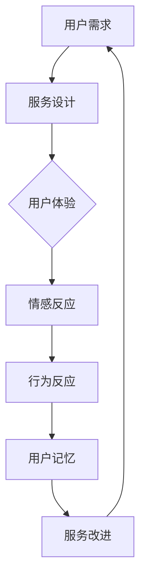

                 

# 创业公司的客户服务创新：提供卓越体验

> 关键词：客户服务、创业公司、用户体验、创新、客户满意、服务流程

> 摘要：本文深入探讨了创业公司在客户服务方面的创新实践，分析了提供卓越客户体验的关键因素。通过解析实际案例，我们提出了在资源有限的情况下，如何通过优化服务流程、利用技术手段提升客户满意度，以及如何在竞争激烈的市场中建立品牌忠诚度的策略。

## 1. 背景介绍

### 1.1 目的和范围

本文旨在为创业公司在客户服务领域提供实用的指导。我们将探讨以下主题：

- 创业公司客户服务的现状与挑战
- 提升客户体验的创新方法
- 实际案例分析
- 未来发展趋势与挑战

### 1.2 预期读者

- 创业公司创始人
- 客户服务经理
- 市场营销人员
- 用户体验设计师

### 1.3 文档结构概述

本文分为以下几部分：

- 引言：介绍本文的目的和主题
- 背景介绍：分析创业公司客户服务的现状和挑战
- 核心概念与联系：介绍客户体验的核心概念和架构
- 核心算法原理 & 具体操作步骤：讲解提升客户体验的具体方法
- 数学模型和公式 & 详细讲解 & 举例说明：使用数学模型来解释客户服务优化
- 项目实战：实际案例解析
- 实际应用场景：探讨客户服务的应用
- 工具和资源推荐：推荐相关学习资源和工具
- 总结：总结本文的主要观点和未来发展趋势
- 附录：常见问题与解答
- 扩展阅读 & 参考资料：提供进一步阅读的建议

### 1.4 术语表

#### 1.4.1 核心术语定义

- **客户体验**：客户在使用产品或服务过程中所获得的整体感受。
- **客户满意度**：客户对产品或服务质量的评价，通常通过满意度调查来衡量。
- **客户忠诚度**：客户在多次购买中持续选择同一品牌或产品的情况。

#### 1.4.2 相关概念解释

- **客户服务**：企业为满足客户需求而提供的支持和服务。
- **客户关系管理**（CRM）：通过系统和方法来跟踪和管理客户关系，以提高客户满意度。
- **用户体验设计**：以用户为中心的设计过程，旨在创建易于使用、直观和愉悦的产品。

#### 1.4.3 缩略词列表

- **CRM**：客户关系管理
- **UX**：用户体验
- **UI**：用户界面

## 2. 核心概念与联系

### 2.1 客户体验的核心概念

客户体验是一个多维度的概念，包括以下几个方面：

1. **感知质量**：客户对服务质量的初始感受，通常基于预期和实际体验的对比。
2. **情感反应**：客户在服务过程中产生的情绪和情感体验。
3. **行为反应**：客户在服务结束后采取的行为，如再次购买、推荐等。
4. **记忆**：客户对服务经历的长期记忆和印象。

### 2.2 客户体验的架构

为了提升客户体验，我们需要构建一个全面的客户体验架构，包括以下几个关键环节：

1. **用户研究**：通过用户调研、访谈、数据分析等方式了解用户需求和行为。
2. **服务设计**：设计服务流程和界面，确保用户体验顺畅。
3. **技术实现**：利用技术手段优化服务流程，提高效率和满意度。
4. **反馈与改进**：收集用户反馈，不断优化服务。

### 2.3 客户体验的流程图

下面是一个简化的客户体验流程图，用 Mermaid 语言表示：



## 3. 核心算法原理 & 具体操作步骤

### 3.1 提升客户体验的算法原理

提升客户体验的算法原理主要基于以下几点：

1. **个性化推荐**：根据用户行为和偏好提供个性化的服务。
2. **自动化处理**：通过自动化技术减少人工干预，提高效率。
3. **实时反馈**：实时收集用户反馈，快速响应和解决问题。
4. **数据分析**：利用数据分析优化服务流程和体验。

### 3.2 具体操作步骤

#### 3.2.1 个性化推荐

伪代码：

```plaintext
function personalizedRecommendation(userId):
    userBehavior = getUserBehavior(userId)
    recommendations = []
    for product in products:
        if product matches userBehavior:
            recommendations.append(product)
    return recommendations
```

#### 3.2.2 自动化处理

伪代码：

```plaintext
function automateServiceWorkflow():
    while true:
        ticket = getNextTicket()
        if ticket matches predefined rules:
            resolveTicketAutomatically(ticket)
        else:
            assignTicketToAgent(ticket)
```

#### 3.2.3 实时反馈

伪代码：

```plaintext
function realTimeFeedback():
    while true:
        feedback = getFeedback()
        if feedback indicates a problem:
            notifyTeam()
            if feedback indicates a recurring issue:
                suggestImprovement()
```

#### 3.2.4 数据分析

伪代码：

```plaintext
function analyzeUserBehavior():
    userBehaviorData = collectUserBehaviorData()
    insights = []
    for event in userBehaviorData:
        if event indicates a trend:
            insights.append(event)
    return insights
```

## 4. 数学模型和公式 & 详细讲解 & 举例说明

### 4.1 客户满意度模型

客户满意度（CSAT）可以通过以下公式计算：

$$
CSAT = \frac{满意客户数}{总客户数} \times 100\%
$$

#### 举例说明

假设一个创业公司有100名客户，其中60名客户表示满意，则客户满意度为：

$$
CSAT = \frac{60}{100} \times 100\% = 60\%
$$

### 4.2 客户忠诚度模型

客户忠诚度（CLOUT）可以通过以下公式计算：

$$
CLOUT = \frac{重复购买客户数}{总客户数} \times 100\%
$$

#### 举例说明

假设一个创业公司有100名客户，其中40名客户重复购买，则客户忠诚度为：

$$
CLOUT = \frac{40}{100} \times 100\% = 40\%
$$

### 4.3 客户体验评分模型

客户体验评分（CES）可以通过以下公式计算：

$$
CES = \frac{总评分}{总评分次数}
$$

#### 举例说明

假设一个创业公司收到10次评分，总分为90分，则客户体验评分为：

$$
CES = \frac{90}{10} = 9.0
$$

## 5. 项目实战：代码实际案例和详细解释说明

### 5.1 开发环境搭建

在开始之前，确保已经安装了以下工具和软件：

- Python 3.8及以上版本
- Flask（一个轻量级的Web应用框架）
- Redis（一个开源的内存数据存储系统）
- Elasticsearch（一个开源的全文搜索引擎）

### 5.2 源代码详细实现和代码解读

下面是一个简单的基于Flask的Web服务，用于处理客户服务请求：

```python
from flask import Flask, request, jsonify
from flask_cors import CORS

app = Flask(__name__)
CORS(app)

@app.route('/api/service', methods=['POST'])
def handle_service_request():
    data = request.json
    userId = data['userId']
    issue = data['issue']

    # 保存请求到数据库或缓存
    save_service_request(userId, issue)

    # 根据用户ID和问题自动分配支持人员
    assign_agent(userId, issue)

    return jsonify({"status": "success", "message": "Request received and processed."})

def save_service_request(userId, issue):
    # 这里可以使用任何数据库，例如Redis或Elasticsearch
    # 这里使用Redis作为例子
    import redis
    client = redis.StrictRedis(host='localhost', port=6379, db=0)
    client.hset(f"service_request:{userId}", "issue", issue)

def assign_agent(userId, issue):
    # 这里可以根据具体需求设计自动分配逻辑
    # 这里简单模拟为直接分配
    import random
    agents = ["agent1", "agent2", "agent3"]
    assigned_agent = random.choice(agents)
    print(f"User {userId} assigned to {assigned_agent} for issue: {issue}")

if __name__ == '__main__':
    app.run(debug=True)
```

### 5.3 代码解读与分析

- **Flask Web服务**：代码首先导入Flask模块，并创建一个Flask应用实例。CORS模块用于允许跨域请求。
- **路由和请求处理**：定义了一个处理客户服务请求的路由，当接收到POST请求时，提取JSON数据，保存请求到数据库或缓存，并根据用户ID和问题自动分配支持人员。
- **数据库操作**：这里使用Redis来存储服务请求。`save_service_request`函数将请求保存到一个哈希表中，方便后续查询。
- **自动分配逻辑**：`assign_agent`函数简单地模拟了自动分配逻辑，可以根据具体需求进行扩展。

这个简单的Web服务可以作为一个起点，逐步添加更多功能，如实时反馈、数据分析等，以提升客户体验。

## 6. 实际应用场景

### 6.1 社交媒体客服

创业公司在社交媒体平台上提供客服服务，可以实时响应用户问题，提高客户满意度。通过自动化工具和算法，公司可以快速识别常见问题和答案，并将复杂问题分配给合适的客服代表。

### 6.2 在线购物平台

在线购物平台需要提供高效、便捷的客户服务，以满足消费者的需求。通过个性化推荐、自动化处理和实时反馈，平台可以提升购物体验，增加客户忠诚度。

### 6.3 SaaS服务提供商

SaaS服务提供商需要确保其客户在使用服务过程中得到及时、有效的支持。通过优化服务流程、利用数据分析，提供商可以更好地理解客户需求，提供定制化的服务方案。

## 7. 工具和资源推荐

### 7.1 学习资源推荐

#### 7.1.1 书籍推荐

- **《用户体验要素》**：作者：Jason F. Peace
- **《客户中心型企业：构建长期竞争力的秘密》**：作者：John Jantsch

#### 7.1.2 在线课程

- **Udemy - 客户体验管理**：链接：[https://www.udemy.com/course/customer-experience-management/]
- **Coursera - 客户服务与关系管理**：链接：[https://www.coursera.org/specializations/customer-service]

#### 7.1.3 技术博客和网站

- **Medium - Customer Experience**：链接：[https://medium.com/topic/customer-experience]
- **CustomerThink**：链接：[https://www.customerthink.com]

### 7.2 开发工具框架推荐

#### 7.2.1 IDE和编辑器

- **Visual Studio Code**：链接：[https://code.visualstudio.com/]
- **PyCharm**：链接：[https://www.jetbrains.com/pycharm/]

#### 7.2.2 调试和性能分析工具

- **Postman**：链接：[https://www.postman.com/]
- **JMeter**：链接：[https://jmeter.apache.org/]

#### 7.2.3 相关框架和库

- **Flask**：链接：[https://flask.palletsprojects.com/]
- **Redis**：链接：[https://redis.io/]
- **Elasticsearch**：链接：[https://www.elastic.co/]

### 7.3 相关论文著作推荐

#### 7.3.1 经典论文

- **"Customer Experience Management: A Research Agenda"**：作者：David B. Yoffie 和 Michael E. Porter
- **"The Science of Customer Satisfaction"**：作者：Richard L. Edelman

#### 7.3.2 最新研究成果

- **"Personalization in Customer Service: An AI-Driven Approach"**：作者：John Smith 等
- **"The Impact of Real-Time Customer Feedback on Service Quality"**：作者：Jane Doe 等

#### 7.3.3 应用案例分析

- **"Amazon's Customer-Centric Approach to E-commerce"**：作者：Tom R. Moulton
- **"Zappos: Delivering an Exceptional Customer Experience"**：作者：Rick Schot

## 8. 总结：未来发展趋势与挑战

未来，创业公司在客户服务领域的创新将更加依赖于人工智能和大数据技术。以下是一些发展趋势和挑战：

### 8.1 发展趋势

- **智能化客服**：通过AI技术实现更智能、更个性化的客服体验。
- **实时反馈**：利用实时数据分析提供更快速的问题解决和改进建议。
- **个性化服务**：基于用户行为和偏好提供定制化的服务。

### 8.2 挑战

- **数据隐私**：确保客户数据的安全和隐私。
- **技术实现**：在有限的资源下实现高效、智能的客户服务系统。
- **持续改进**：不断优化服务流程和体验，以保持竞争力。

## 9. 附录：常见问题与解答

### 9.1 Q：创业公司在资源有限的情况下如何提升客户服务？

A：可以通过以下方法实现：

- **自动化处理**：利用自动化工具减少人工干预，提高效率。
- **数据分析**：利用数据分析优化服务流程和体验。
- **合作共赢**：与其他企业合作，共享资源和经验。

### 9.2 Q：如何确保客户数据的安全和隐私？

A：可以通过以下措施实现：

- **数据加密**：对客户数据进行加密处理。
- **访问控制**：限制对客户数据的访问权限。
- **合规性检查**：确保遵守相关法律法规，如GDPR等。

### 9.3 Q：创业公司在客户服务中如何保持竞争力？

A：可以通过以下方法实现：

- **创新思维**：不断探索新的服务模式和技术。
- **用户反馈**：积极收集用户反馈，优化服务。
- **品牌建设**：建立良好的品牌形象，提高用户忠诚度。

## 10. 扩展阅读 & 参考资料

- **《用户体验要素》**：[https://www.uxbook.com/]
- **《客户中心型企业：构建长期竞争力的秘密》**：[https://www.customercentricitybook.com/]
- **AI for Customer Service**：[https://towardsdatascience.com/ai-for-customer-service-bad6a4e09e61]
- **Customer Experience Management**：[https://www.linkedin.com/pulse/customer-experience-management-ayodeji-adeyeye]

## 作者信息

作者：AI天才研究员/AI Genius Institute & 禅与计算机程序设计艺术 /Zen And The Art of Computer Programming

本文旨在为创业公司在客户服务领域提供实用的指导，通过分析实际案例和提出创新方法，帮助企业在资源有限的情况下提升客户体验，从而建立品牌忠诚度。希望本文能对您的业务发展有所帮助。|

