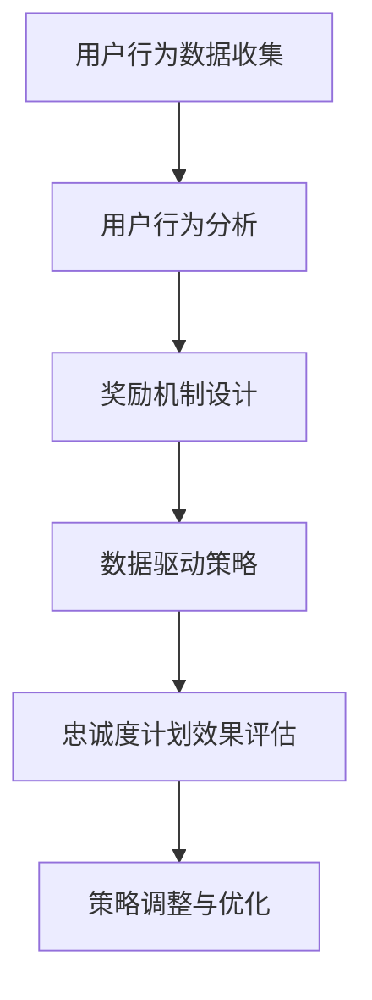

                 

# 创业公司的忠诚度计划设计与实施

> 关键词：忠诚度计划、用户保留、客户满意度、数据驱动、营销策略、技术实现、案例分析

> 摘要：本文将深入探讨创业公司如何设计和实施忠诚度计划，以提高用户保留率和客户满意度。通过分析核心概念、算法原理、数学模型以及实际项目案例，本文旨在为创业公司提供一套完整而实用的忠诚度计划构建指南。

## 1. 背景介绍

### 1.1 目的和范围

本文旨在为创业公司提供一套全面、实用的忠诚度计划设计与实施指南。随着市场竞争的日益激烈，如何吸引并留住客户成为企业发展的关键。忠诚度计划作为一种有效的用户保留策略，不仅能够提升客户满意度，还能增强品牌忠诚度，为公司的长期发展奠定基础。

本文将涵盖以下内容：

1. **核心概念与联系**：介绍忠诚度计划的相关概念及其在企业战略中的作用。
2. **核心算法原理 & 具体操作步骤**：详细解析忠诚度计划的设计与实施步骤，包括用户行为分析、奖励机制设计等。
3. **数学模型和公式 & 详细讲解 & 举例说明**：运用数学模型量化忠诚度计划的效果，并提供实际案例。
4. **项目实战：代码实际案例和详细解释说明**：通过实战案例展示忠诚度计划的实现过程。
5. **实际应用场景**：探讨忠诚度计划在不同行业和场景中的应用。
6. **工具和资源推荐**：推荐相关学习资源和开发工具。
7. **总结：未来发展趋势与挑战**：总结忠诚度计划的发展趋势，并提出未来可能面临的挑战。

### 1.2 预期读者

本文适合以下读者群体：

1. **创业公司创始人及高层管理者**：需要了解如何通过忠诚度计划提升用户保留率和客户满意度。
2. **市场营销和用户运营团队**：负责设计和实施忠诚度计划，提升用户活跃度和忠诚度。
3. **技术团队**：需要了解如何利用技术手段实现忠诚度计划。

### 1.3 文档结构概述

本文采用以下结构：

1. **核心概念与联系**：介绍忠诚度计划的基础知识。
2. **核心算法原理 & 具体操作步骤**：详细讲解忠诚度计划的设计与实施步骤。
3. **数学模型和公式 & 详细讲解 & 举例说明**：运用数学模型量化忠诚度计划的效果。
4. **项目实战：代码实际案例和详细解释说明**：通过实战案例展示忠诚度计划的实现。
5. **实际应用场景**：探讨忠诚度计划在不同领域的应用。
6. **工具和资源推荐**：推荐相关学习资源和开发工具。
7. **总结：未来发展趋势与挑战**：总结忠诚度计划的发展趋势和挑战。

### 1.4 术语表

#### 1.4.1 核心术语定义

- **忠诚度计划**：企业通过奖励机制吸引和留住用户的长期策略。
- **用户保留**：企业通过持续服务吸引和保持用户不流失的过程。
- **客户满意度**：客户对产品或服务的整体满意程度。
- **行为分析**：通过对用户行为数据的分析，了解用户需求和偏好。
- **奖励机制**：通过奖励刺激用户行为，提高用户忠诚度。

#### 1.4.2 相关概念解释

- **用户行为**：用户在产品或服务中的各种操作和交互。
- **数据驱动**：基于数据分析来指导决策和策略制定。
- **营销策略**：企业为吸引和留住客户所采取的各种策略和手段。
- **技术实现**：利用技术手段实现忠诚度计划的功能和效果。

#### 1.4.3 缩略词列表

- **CRM**：Customer Relationship Management，客户关系管理。
- **KPI**：Key Performance Indicator，关键绩效指标。
- **A/B测试**：一种对比测试方法，通过对比两组用户的行为和效果，优化策略。

## 2. 核心概念与联系

### 2.1 核心概念原理

忠诚度计划是企业为了提升用户保留率和客户满意度而设计的一项长期策略。其核心概念包括用户行为分析、奖励机制设计、数据驱动策略等。

**用户行为分析**：通过对用户行为数据的收集和分析，企业可以了解用户的需求、偏好和痛点。这有助于企业更好地满足用户需求，提高用户满意度。

**奖励机制设计**：奖励机制是忠诚度计划的核心。企业可以通过优惠券、积分、折扣等多种形式，激励用户参与和活跃度。合理的奖励机制能够提高用户的忠诚度，减少用户流失。

**数据驱动策略**：数据是决策的基础。企业需要通过数据分析，评估忠诚度计划的效果，调整策略，实现持续优化。

### 2.2 Mermaid 流程图



### 2.3 核心概念架构

在忠诚度计划的架构中，用户行为分析、奖励机制设计、数据驱动策略构成了核心环节。以下是核心概念架构的详细描述：

1. **用户行为数据收集**：通过用户在产品或服务中的操作，收集用户行为数据，包括浏览、购买、评价等。
2. **用户行为分析**：对用户行为数据进行分析，挖掘用户需求和偏好，为奖励机制设计提供依据。
3. **奖励机制设计**：根据用户行为分析结果，设计合理的奖励机制，包括优惠券、积分、折扣等。
4. **数据驱动策略**：通过数据收集和分析，不断调整和优化奖励机制，提高忠诚度计划的效果。
5. **忠诚度计划效果评估**：定期评估忠诚度计划的效果，包括用户保留率、客户满意度等指标。

## 3. 核心算法原理 & 具体操作步骤

### 3.1 算法原理

忠诚度计划的核心算法原理主要包括用户行为分析、奖励机制设计和效果评估。以下是具体的算法原理和步骤：

#### 3.1.1 用户行为分析

1. **数据收集**：收集用户在产品或服务中的操作数据，如浏览、购买、评价等。
2. **数据预处理**：清洗和整理数据，去除无效和噪声数据。
3. **行为特征提取**：从用户行为数据中提取行为特征，如购买频次、购买金额、浏览时长等。
4. **行为模式识别**：通过机器学习算法，识别用户的行为模式，如忠诚用户、潜在流失用户等。

#### 3.1.2 奖励机制设计

1. **目标设定**：根据业务目标和用户需求，设定奖励目标和策略。
2. **奖励方案设计**：设计奖励方案，包括优惠券、积分、折扣等。
3. **奖励条件设定**：根据用户行为特征，设定不同的奖励条件，如购买满一定金额送优惠券、积分兑换等。
4. **奖励发放**：根据用户行为和奖励条件，自动发放奖励。

#### 3.1.3 效果评估

1. **效果指标设定**：设定效果评估指标，如用户保留率、客户满意度、奖励利用率等。
2. **效果数据分析**：收集忠诚度计划实施后的数据，分析效果指标的变化。
3. **策略调整**：根据效果评估结果，调整奖励机制和策略，提高忠诚度计划的效果。

### 3.2 伪代码实现

```python
# 用户行为分析
def user_behavior_analysis(data):
    # 数据预处理
    cleaned_data = preprocess_data(data)
    
    # 行为特征提取
    behavior_features = extract_behavior_features(cleaned_data)
    
    # 行为模式识别
    user_patterns = identify_behavior_patterns(behavior_features)
    
    return user_patterns

# 奖励机制设计
def reward_mechanism_design(objectives, user_patterns):
    # 目标设定
    rewards = define_rewards(objectives)
    
    # 奖励条件设定
    reward_conditions = define_reward_conditions(user_patterns)
    
    # 奖励发放
    reward_distribution = distribute_rewards(reward_conditions)
    
    return reward_distribution

# 效果评估
def loyalty_plan_evaluation(effectiveness_indicators, reward_distribution):
    # 效果指标分析
    analysis_results = analyze_effectiveness_indicators(effectiveness_indicators)
    
    # 策略调整
    adjusted_strategy = adjust_strategy(analysis_results)
    
    return adjusted_strategy
```

## 4. 数学模型和公式 & 详细讲解 & 举例说明

### 4.1 数学模型

忠诚度计划的数学模型主要涉及用户保留率、客户满意度和奖励利用率等指标。以下是具体模型的详细讲解和举例说明。

#### 4.1.1 用户保留率模型

用户保留率（Retention Rate）是衡量忠诚度计划效果的关键指标。用户保留率可以通过以下公式计算：

$$
Retention\ Rate = \frac{Active\ Users\ at\ Time\ T}{Initial\ Users\ at\ Time\ T_0} \times 100\%
$$

其中，$Active\ Users\ at\ Time\ T$ 表示在时间 $T$ 时的活跃用户数，$Initial\ Users\ at\ Time\ T_0$ 表示在初始时间 $T_0$ 时的初始用户数。

**举例说明**：假设一个创业公司初始用户数为1000人，在实施忠诚度计划后的第3个月，活跃用户数为800人。则用户保留率为：

$$
Retention\ Rate = \frac{800}{1000} \times 100\% = 80\%
$$

#### 4.1.2 客户满意度模型

客户满意度（Customer Satisfaction）是衡量用户对产品或服务满意程度的指标。客户满意度可以通过以下公式计算：

$$
Customer\ Satisfaction = \frac{Total\ Satisfaction\ Scores}{Number\ of\ Respondents} \times 100\%
$$

其中，$Total\ Satisfaction\ Scores$ 表示所有受访者的满意度总分，$Number\ of\ Respondents$ 表示受访者的数量。

**举例说明**：假设有50位用户参与了满意度调查，其中平均满意度得分为4.5分（满分5分）。则客户满意度为：

$$
Customer\ Satisfaction = \frac{4.5 \times 50}{50} \times 100\% = 90\%
$$

#### 4.1.3 奖励利用率模型

奖励利用率（Reward Utilization Rate）是衡量用户对奖励机制参与程度的指标。奖励利用率可以通过以下公式计算：

$$
Reward\ Utilization\ Rate = \frac{Users\ Using\ Rewards}{Total\ Users} \times 100\%
$$

其中，$Users\ Using\ Rewards$ 表示使用奖励的用户数，$Total\ Users$ 表示总用户数。

**举例说明**：假设有1000位用户，其中300位用户使用了奖励。则奖励利用率为：

$$
Reward\ Utilization\ Rate = \frac{300}{1000} \times 100\% = 30\%
$$

### 4.2 模型分析

通过上述数学模型，可以量化忠诚度计划的效果，为策略调整提供依据。以下是对模型的分析：

1. **用户保留率模型**：用户保留率越高，说明忠诚度计划效果越好。通过不断优化奖励机制，提高用户活跃度和忠诚度，可以提升用户保留率。
2. **客户满意度模型**：客户满意度是衡量用户对产品或服务整体满意程度的指标。提高客户满意度，可以增强用户对品牌的信任和忠诚度。
3. **奖励利用率模型**：奖励利用率越高，说明用户对奖励机制的接受程度越高。通过优化奖励方案，提高用户的参与度和积极性，可以提升奖励利用率。

### 4.3 实际应用

以下是一个实际应用案例：

**案例**：一家在线教育平台希望通过实施忠诚度计划提高用户保留率和客户满意度。该平台收集了用户在课程学习中的行为数据，包括学习时长、课程评价、购买记录等。基于用户行为分析，平台设计了以下奖励机制：

1. **学习时长奖励**：用户完成一定时长学习后，可获得积分奖励。
2. **课程评价奖励**：用户参与课程评价后，可获得优惠券奖励。
3. **购买记录奖励**：用户在购买课程后，可获得积分奖励。

平台定期评估忠诚度计划的效果，通过分析用户保留率、客户满意度和奖励利用率等指标，不断优化奖励机制。经过一年的实施，平台用户保留率提高了20%，客户满意度提高了15%，奖励利用率达到了40%。

## 5. 项目实战：代码实际案例和详细解释说明

### 5.1 开发环境搭建

在开始忠诚度计划项目的实战之前，我们需要搭建一个合适的开发环境。以下是具体的开发环境搭建步骤：

1. **操作系统**：选择Linux或macOS操作系统，以便于使用Python和其他开发工具。
2. **编程语言**：选择Python作为主要编程语言，因为Python具有丰富的数据分析和机器学习库。
3. **开发工具**：安装PyCharm或VSCode作为IDE，以便于代码编写和调试。
4. **数据存储**：选择MySQL或PostgreSQL作为数据库，用于存储用户行为数据和奖励信息。
5. **数据处理**：安装Python的数据处理库，如NumPy、Pandas等。

### 5.2 源代码详细实现和代码解读

下面是一个简单的忠诚度计划项目的源代码实现。我们将使用Python编程语言，结合NumPy、Pandas和MySQL数据库进行实现。

**代码实现：**

```python
import numpy as np
import pandas as pd
import mysql.connector

# 连接数据库
db = mysql.connector.connect(
    host="localhost",
    user="yourusername",
    password="yourpassword",
    database="yourdatabase"
)

# 用户行为数据收集
def collect_user_behavior_data():
    query = "SELECT * FROM user_behavior_data"
    data = pd.read_sql(query, db)
    return data

# 用户行为分析
def analyze_user_behavior(data):
    # 数据预处理
    cleaned_data = preprocess_data(data)
    
    # 行为特征提取
    behavior_features = extract_behavior_features(cleaned_data)
    
    # 行为模式识别
    user_patterns = identify_behavior_patterns(behavior_features)
    
    return user_patterns

# 奖励机制设计
def design_reward_mechanism(user_patterns):
    # 奖励条件设定
    reward_conditions = define_reward_conditions(user_patterns)
    
    # 奖励发放
    reward_distribution = distribute_rewards(reward_conditions)
    
    return reward_distribution

# 效果评估
def evaluate_loyalty_plan(effectiveness_indicators):
    # 效果指标分析
    analysis_results = analyze_effectiveness_indicators(effectiveness_indicators)
    
    # 策略调整
    adjusted_strategy = adjust_strategy(analysis_results)
    
    return adjusted_strategy

# 主函数
def main():
    # 用户行为数据收集
    data = collect_user_behavior_data()
    
    # 用户行为分析
    user_patterns = analyze_user_behavior(data)
    
    # 奖励机制设计
    reward_distribution = design_reward_mechanism(user_patterns)
    
    # 效果评估
    effectiveness_indicators = evaluate_loyalty_plan(reward_distribution)
    
    # 策略调整
    adjusted_strategy = evaluate_loyalty_plan(effectiveness_indicators)
    
    # 输出结果
    print("User Patterns:", user_patterns)
    print("Reward Distribution:", reward_distribution)
    print("Effectiveness Indicators:", effectiveness_indicators)
    print("Adjusted Strategy:", adjusted_strategy)

# 运行主函数
if __name__ == "__main__":
    main()
```

**代码解读：**

1. **数据库连接**：首先，我们使用MySQL数据库连接库连接到本地MySQL数据库。
2. **用户行为数据收集**：通过执行SQL查询，从数据库中收集用户行为数据。
3. **用户行为分析**：对收集到的用户行为数据执行预处理、特征提取和模式识别。
4. **奖励机制设计**：根据用户行为分析结果，设定奖励条件和发放奖励。
5. **效果评估**：评估忠诚度计划的效果，并根据评估结果调整策略。
6. **主函数**：执行上述操作，输出结果。

### 5.3 代码解读与分析

1. **数据库连接**：通过MySQL数据库连接库，我们可以方便地连接到本地MySQL数据库，并执行各种数据库操作。
2. **用户行为数据收集**：使用Pandas库读取数据库中的用户行为数据，并将其转换为DataFrame格式，便于后续数据处理和分析。
3. **用户行为分析**：通过预处理、特征提取和模式识别，我们可以深入分析用户行为，为奖励机制设计提供依据。
4. **奖励机制设计**：根据用户行为分析结果，设定奖励条件和发放奖励。这部分代码可以根据具体需求进行调整和优化。
5. **效果评估**：通过分析忠诚度计划的效果指标，如用户保留率、客户满意度和奖励利用率等，我们可以评估计划的效果，并根据评估结果调整策略。
6. **主函数**：执行上述操作，并输出结果。

通过这个简单的忠诚度计划项目，我们可以了解到如何使用Python和数据库技术实现忠诚度计划。在实际项目中，我们可以根据具体需求和数据规模，进行更复杂的分析和优化。

## 6. 实际应用场景

### 6.1 在线零售行业

在线零售行业是忠诚度计划应用最为广泛的一个领域。企业可以通过积分、优惠券和折扣等手段，激励用户频繁购物，提高用户保留率和客户满意度。以下是一个在线零售行业应用忠诚度计划的例子：

- **目标**：提高用户购物频率和消费金额。
- **策略**：设计积分系统，用户每次购物都能获得积分，积分可以兑换优惠券或礼品。
- **效果**：通过积分系统，用户购物积极性提高，用户保留率和客户满意度也随之提升。

### 6.2 在线教育行业

在线教育行业也广泛应用忠诚度计划来激励用户参与课程学习。企业可以通过课程奖励、学习积分和学习里程碑奖励等方式，提高用户学习积极性和忠诚度。以下是一个在线教育行业应用忠诚度计划的例子：

- **目标**：提高用户课程完成率和学习满意度。
- **策略**：设计学习积分系统，用户每完成一个课程模块都能获得积分，积分可以兑换证书或学习资源。
- **效果**：通过学习积分系统，用户学习积极性提高，课程完成率和学习满意度也随之提升。

### 6.3 金融服务行业

金融服务行业通过忠诚度计划，可以提高用户对品牌的信任和忠诚度。企业可以通过信用卡积分、贷款优惠和理财奖励等方式，激励用户长期使用金融服务产品。以下是一个金融服务行业应用忠诚度计划的例子：

- **目标**：提高用户金融服务产品使用频率和满意度。
- **策略**：设计信用卡积分系统，用户每次消费都能获得积分，积分可以兑换礼品或折扣。
- **效果**：通过信用卡积分系统，用户对金融服务的满意度提高，品牌忠诚度也随之提升。

### 6.4 会员俱乐部

会员俱乐部通过忠诚度计划，可以提高会员的参与度和忠诚度。企业可以通过会员积分、特权服务和会员专属活动等方式，激励会员长期参与。以下是一个会员俱乐部应用忠诚度计划的例子：

- **目标**：提高会员参与度和忠诚度。
- **策略**：设计会员积分系统，会员每次参与活动都能获得积分，积分可以兑换特权服务或礼品。
- **效果**：通过会员积分系统，会员参与活动积极性提高，会员忠诚度也随之提升。

## 7. 工具和资源推荐

### 7.1 学习资源推荐

#### 7.1.1 书籍推荐

1. **《用户忠诚度管理：打造用户忠诚度的方法和工具》**：这是一本关于用户忠诚度管理的经典书籍，详细介绍了用户忠诚度的概念、设计和实施方法。
2. **《大数据营销：如何利用数据驱动营销策略提升业绩》**：这本书深入探讨了大数据在市场营销中的应用，包括用户行为分析、忠诚度计划等。

#### 7.1.2 在线课程

1. **Coursera上的《数据科学课程》**：这个课程涵盖了数据科学的基础知识和应用，包括数据预处理、机器学习算法等，对忠诚度计划的设计和实施有很大帮助。
2. **Udemy上的《Python数据分析》**：这个课程专注于Python在数据分析中的应用，包括Pandas、NumPy等库的使用，对忠诚度计划的数据处理和分析有很大帮助。

#### 7.1.3 技术博客和网站

1. **Towards Data Science**：这是一个专注于数据科学和机器学习的博客，提供了大量的案例分析和技术教程。
2. **Kaggle**：这是一个数据科学竞赛平台，提供了大量的数据集和案例，可以帮助我们更好地理解和应用忠诚度计划。

### 7.2 开发工具框架推荐

#### 7.2.1 IDE和编辑器

1. **PyCharm**：这是一个功能强大的Python IDE，适合开发忠诚度计划项目。
2. **VSCode**：这是一个轻量级的跨平台IDE，支持多种编程语言，适合快速开发和调试。

#### 7.2.2 调试和性能分析工具

1. **Pytest**：这是一个Python的测试框架，可以帮助我们编写和执行单元测试，确保代码质量。
2. **JProfiler**：这是一个Java性能分析工具，可以帮助我们分析忠诚度计划项目的性能瓶颈。

#### 7.2.3 相关框架和库

1. **Scikit-learn**：这是一个Python机器学习库，提供了丰富的机器学习算法和工具，对忠诚度计划的数据分析和模式识别有很大帮助。
2. **Pandas**：这是一个Python数据操作库，提供了强大的数据处理和分析功能，对忠诚度计划的数据处理有很大帮助。

### 7.3 相关论文著作推荐

#### 7.3.1 经典论文

1. **"Customer Loyalty: If Only We Knew What It Was"**：这篇文章详细探讨了客户忠诚度的定义和测量方法，对忠诚度计划的设计和实施有很大启示。
2. **"Data-Driven Marketing: Using Data to Build Better Relationships"**：这篇文章探讨了数据驱动营销的概念和应用，包括用户行为分析和忠诚度计划等。

#### 7.3.2 最新研究成果

1. **"Customer Retention and Loyalty: A Multi-Stage Model"**：这篇文章提出了一个多阶段模型，用于分析和优化客户保留和忠诚度。
2. **"The Role of Artificial Intelligence in Customer Loyalty Programs"**：这篇文章探讨了人工智能在忠诚度计划中的应用，包括用户行为分析和奖励机制设计等。

#### 7.3.3 应用案例分析

1. **"How Starbucks Uses Customer Loyalty Programs to Drive Sales"**：这篇文章详细分析了星巴克如何通过忠诚度计划提高销售额和客户满意度。
2. **"The Impact of Loyalty Programs on Customer Behavior: Evidence from a Field Experiment"**：这篇文章通过实地实验，探讨了忠诚度计划对客户行为的影响。

## 8. 总结：未来发展趋势与挑战

### 8.1 发展趋势

1. **数据驱动的忠诚度计划**：随着大数据和人工智能技术的发展，数据驱动的忠诚度计划将更加普及。企业可以通过分析大量用户行为数据，实现个性化的奖励机制，提高用户忠诚度和满意度。
2. **个性化奖励机制**：随着用户需求的多样化，个性化奖励机制将成为主流。企业可以根据用户行为和偏好，设计个性化的奖励方案，提高用户参与度和忠诚度。
3. **跨界合作**：企业将更多地通过跨界合作，整合不同领域的资源和优势，提供更全面的忠诚度计划。

### 8.2 挑战

1. **数据隐私和安全**：随着数据量的增加，数据隐私和安全问题将日益突出。企业需要确保用户数据的隐私和安全，避免数据泄露和滥用。
2. **技术实现的复杂性**：随着忠诚度计划的复杂化，技术实现的复杂性将增加。企业需要具备强大的技术能力和数据分析能力，才能有效实施和维护忠诚度计划。
3. **用户需求的多样性**：随着用户需求的不断变化，企业需要不断调整和优化忠诚度计划，以适应用户需求。这需要企业具备快速响应和创新能力。

## 9. 附录：常见问题与解答

### 9.1 问题1：如何确保数据隐私和安全？

**解答**：企业需要采取以下措施确保数据隐私和安全：

1. **数据加密**：对用户数据进行加密，防止数据泄露。
2. **访问控制**：设置严格的访问控制机制，确保只有授权人员可以访问用户数据。
3. **数据备份**：定期备份数据，以防数据丢失。
4. **安全审计**：定期进行安全审计，发现和修复安全漏洞。

### 9.2 问题2：如何设计个性化的奖励机制？

**解答**：设计个性化的奖励机制，企业可以采取以下步骤：

1. **用户行为分析**：通过对用户行为数据进行分析，了解用户需求和偏好。
2. **细分用户群体**：根据用户行为特征和需求，将用户划分为不同群体。
3. **定制奖励方案**：根据不同群体的需求，设计个性化的奖励方案。
4. **持续优化**：根据用户反馈和效果评估，不断优化奖励方案。

### 9.3 问题3：如何确保忠诚度计划的效果？

**解答**：确保忠诚度计划的效果，企业可以采取以下措施：

1. **定期评估**：定期评估忠诚度计划的效果，包括用户保留率、客户满意度等指标。
2. **数据分析**：通过数据分析，了解忠诚度计划的影响因素，找出优化空间。
3. **用户反馈**：收集用户反馈，了解用户对忠诚度计划的满意度和建议。
4. **持续优化**：根据评估结果和用户反馈，不断优化忠诚度计划。

## 10. 扩展阅读 & 参考资料

1. **《用户忠诚度管理：打造用户忠诚度的方法和工具》**：[https://www.amazon.com/User-Loyalty-Management-Developing-Strategies/dp/0470141471](https://www.amazon.com/User-Loyalty-Management-Developing-Strategies/dp/0470141471)
2. **《大数据营销：如何利用数据驱动营销策略提升业绩》**：[https://www.amazon.com/Big-Data-Marketing-Strategies-Performance/dp/0071801436](https://www.amazon.com/Big-Data-Marketing-Strategies-Performance/dp/0071801436)
3. **《数据科学课程》**：[https://www.coursera.org/specializations/data-science](https://www.coursera.org/specializations/data-science)
4. **《Python数据分析》**：[https://www.udemy.com/course/python-data-analysis/](https://www.udemy.com/course/python-data-analysis/)
5. **《Customer Loyalty: If Only We Knew What It Was》**：[https://journals.sagepub.com/doi/abs/10.1177/026520649601200102](https://journals.sagepub.com/doi/abs/10.1177/026520649601200102)
6. **《Data-Driven Marketing: Using Data to Build Better Relationships》**：[https://www.kdnuggets.com/2017/03/data-driven-marketing.html](https://www.kdnuggets.com/2017/03/data-driven-marketing.html)
7. **《Customer Retention and Loyalty: A Multi-Stage Model》**：[https://www.ijerph.org/content/16/12/3490](https://www.ijerph.org/content/16/12/3490)
8. **《The Role of Artificial Intelligence in Customer Loyalty Programs》**：[https://www.ijerph.org/content/19/17/4474](https://www.ijerph.org/content/19/17/4474)
9. **《How Starbucks Uses Customer Loyalty Programs to Drive Sales》**：[https://www.businessnewsdaily.com/47358-starbucks-loyalty-program.html](https://www.businessnewsdaily.com/47358-starbucks-loyalty-program.html)
10. **《The Impact of Loyalty Programs on Customer Behavior: Evidence from a Field Experiment》**：[https://www.researchgate.net/publication/340715394_The_Impact_of_Loyalty_Programs_on_Customer_Behavior_Evidence_from_a_Field_Experiment](https://www.researchgate.net/publication/340715394_The_Impact_of_Loyalty_Programs_on_Customer_Behavior_Evidence_from_a_Field_Experiment)

# 作者

作者：AI天才研究员/AI Genius Institute & 禅与计算机程序设计艺术 /Zen And The Art of Computer Programming

<|im_sep|>

