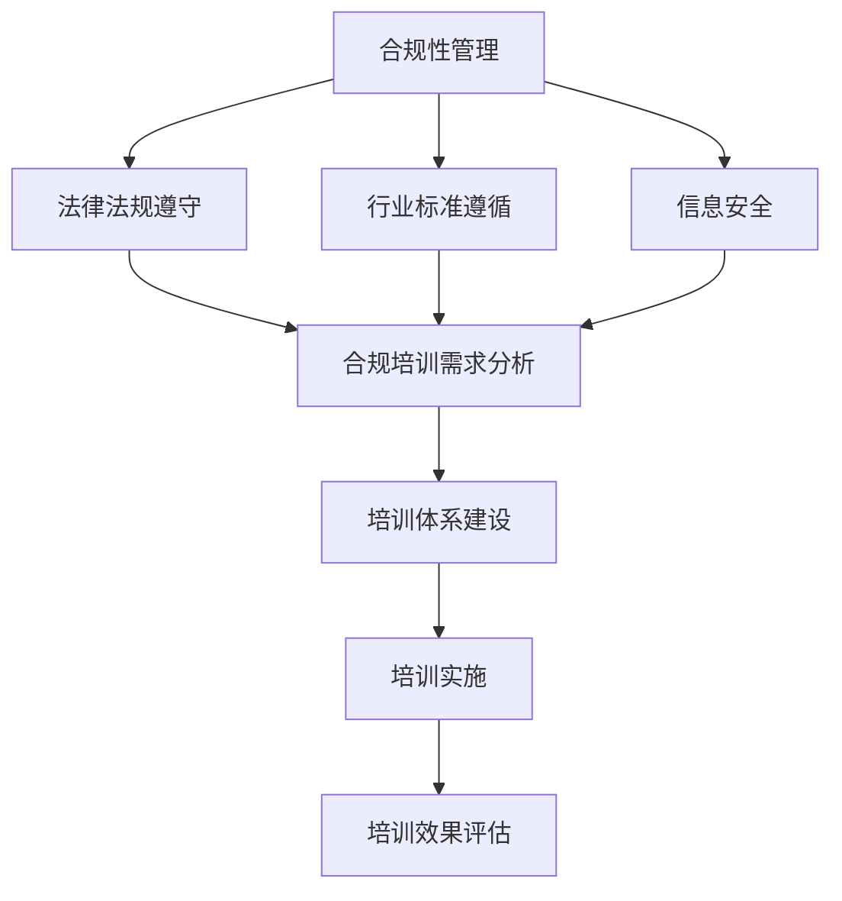

                 

# 创业公司的技术合规性培训体系

> 关键词：技术合规性、培训体系、创业公司、法律法规、信息安全

> 摘要：本文旨在探讨创业公司的技术合规性培训体系，通过详细的分析和讲解，帮助创业公司在快速发展的同时，确保其技术实践的合规性。本文将介绍技术合规性的重要性、培训体系的构建方法、核心原则和操作步骤，并附以实际案例和资源推荐，以期为创业公司的技术合规提供有益的指导。

## 1. 背景介绍

### 1.1 目的和范围

本文的目标是构建一套针对创业公司的技术合规性培训体系，以确保公司在技术快速发展的同时，不偏离法律法规和行业规范。本文将涵盖以下几个方面：

- **技术合规性的重要性**：解释合规性的概念及其对创业公司的重要性。
- **培训体系的构建**：详细阐述培训体系的设计原则、结构和内容。
- **培训实施**：提供实施培训的具体步骤和策略。
- **实际应用场景**：分析技术合规性在创业公司中的实际应用。
- **工具和资源推荐**：推荐相关的学习资源、开发工具和框架。

### 1.2 预期读者

本文适用于以下读者：

- 创业公司的技术团队成员，尤其是负责技术合规性的人员。
- 创业公司的管理层，需要了解技术合规性对企业发展的意义。
- 对技术合规性感兴趣的技术爱好者。

### 1.3 文档结构概述

本文将按照以下结构进行组织：

1. **背景介绍**：介绍本文的目的和预期读者。
2. **核心概念与联系**：定义核心概念，提供Mermaid流程图。
3. **核心算法原理 & 具体操作步骤**：讲解核心算法原理和操作步骤。
4. **数学模型和公式 & 详细讲解 & 举例说明**：介绍数学模型和公式。
5. **项目实战：代码实际案例和详细解释说明**：提供实际代码案例。
6. **实际应用场景**：分析技术合规性在不同场景下的应用。
7. **工具和资源推荐**：推荐相关的学习资源和开发工具。
8. **总结：未来发展趋势与挑战**：总结未来发展趋势和挑战。
9. **附录：常见问题与解答**：解答常见问题。
10. **扩展阅读 & 参考资料**：提供扩展阅读和参考资料。

### 1.4 术语表

#### 1.4.1 核心术语定义

- **技术合规性**：指企业在技术研发和实施过程中，遵循相关法律法规、行业标准和企业内部规定的程度。
- **培训体系**：指用于培养员工合规意识和技能的一整套方案和流程。
- **创业公司**：指初创企业，通常处于快速发展和扩张阶段。

#### 1.4.2 相关概念解释

- **法律法规**：指国家制定的具有法律效力的规定，如《网络安全法》、《数据保护法》等。
- **信息安全**：指保护信息资产不受未授权访问、泄露、篡改和破坏。

#### 1.4.3 缩略词列表

- **GDPR**：一般数据保护条例（General Data Protection Regulation）
- **ISO**：国际标准化组织（International Organization for Standardization）

## 2. 核心概念与联系

在构建技术合规性培训体系之前，我们需要明确几个核心概念及其相互关系。

### 2.1. 核心概念

- **合规性管理**：企业内部设立的专门负责合规性管理的部门或团队。
- **法律法规遵守**：企业确保其技术研发和业务运营符合国家法律法规。
- **行业标准遵循**：企业遵循行业内部的规范和标准，如ISO标准、行业认证等。
- **信息安全**：保护企业信息资产，防止信息泄露、篡改和破坏。

### 2.2. Mermaid流程图



在上面的流程图中，合规性管理是核心，它通过法律法规遵守、行业标准遵循和信息安全三个方面来保证企业的合规性。培训体系建设是在分析合规培训需求的基础上进行的，通过实施和效果评估，不断优化培训体系。

## 3. 核心算法原理 & 具体操作步骤

### 3.1. 合规性培训需求分析

在构建培训体系之前，我们需要对企业的合规性培训需求进行分析。以下是一个基本的步骤：

```plaintext
步骤1：确定培训目标
- 根据法律法规、行业标准和企业实际情况，明确培训目标。

步骤2：识别合规风险
- 分析企业在技术研发和运营过程中可能面临的合规风险。

步骤3：设计培训课程
- 根据培训目标和合规风险，设计培训课程内容。

步骤4：评估培训资源
- 评估企业内部和外部培训资源，确保培训的可行性。

步骤5：制定培训计划
- 制定详细的培训计划，包括培训时间、地点、讲师和学员等。
```

### 3.2. 培训体系建设

培训体系建设是确保培训质量的关键步骤。以下是一个基本的步骤：

```plaintext
步骤1：制定培训政策
- 制定企业培训政策，明确培训目标和要求。

步骤2：设计培训体系结构
- 设计培训体系的结构，包括课程设置、教学方法、考核机制等。

步骤3：选择培训讲师
- 选择具有相关领域知识和教学经验的讲师。

步骤4：开发培训材料
- 开发高质量的培训教材、课件和其他辅助材料。

步骤5：实施培训计划
- 按照培训计划实施培训，确保培训的顺利进行。

步骤6：培训评估与改进
- 对培训效果进行评估，根据评估结果进行培训体系的优化和改进。
```

### 3.3. 培训实施

培训实施是培训体系的核心环节。以下是一个基本的步骤：

```plaintext
步骤1：发布培训通知
- 发布培训通知，明确培训时间、地点、内容等。

步骤2：培训签到与资料发放
- 实施培训签到，发放培训资料。

步骤3：培训授课
- 按照培训课程内容，进行授课。

步骤4：互动环节
- 安排互动环节，鼓励学员提问和讨论。

步骤5：考核与评估
- 实施培训考核，评估学员的学习效果。

步骤6：培训总结
- 对培训过程进行总结，收集学员反馈。
```

### 3.4. 培训效果评估

培训效果评估是确保培训质量的重要环节。以下是一个基本的步骤：

```plaintext
步骤1：设计评估指标
- 根据培训目标和内容，设计评估指标。

步骤2：实施评估
- 通过考试、问卷调查等方式，对学员进行评估。

步骤3：分析评估结果
- 分析评估结果，识别培训的优缺点。

步骤4：改进培训策略
- 根据评估结果，调整培训内容和方式。

步骤5：跟踪学员进展
- 跟踪学员在培训后的工作表现，持续改进培训效果。
```

## 4. 数学模型和公式 & 详细讲解 & 举例说明

### 4.1. 数学模型

在技术合规性培训体系中，我们可以使用以下数学模型来评估培训效果：

- **学习曲线**：表示学习者在不同时间点掌握的知识量。

  $$ L(t) = \frac{1}{\alpha + t} $$

  其中，\(L(t)\) 为时间 \(t\) 时学习者的知识量，\(\alpha\) 为学习速率常数。

- **培训满意度**：表示学员对培训的满意度。

  $$ S(t) = \frac{1}{1 + e^{-\beta(L(t) - X)}} $$

  其中，\(S(t)\) 为培训满意度，\(\beta\) 为敏感度常数，\(X\) 为学员期望的知识量。

### 4.2. 详细讲解

- **学习曲线**：学习曲线反映了学习者在学习过程中知识量随时间的变化。学习速率常数 \(\alpha\) 越大，学习曲线越陡峭，表示学习者学习速度快。
- **培训满意度**：培训满意度反映了学员对培训的满意度。当学习者的知识量 \(L(t)\) 超过学员期望的知识量 \(X\) 时，满意度 \(S(t)\) 逐渐增加。

### 4.3. 举例说明

假设一个学员在学习曲线的初始阶段，学习速率为 \( \alpha = 0.5 \)，期望掌握的知识量为 \( X = 10 \)。在学习了 \( t = 5 \) 小时后，其知识量 \( L(5) = \frac{1}{0.5 + 5} = 0.1 \)。

根据培训满意度公式，我们可以计算出该学员的培训满意度：

$$ S(5) = \frac{1}{1 + e^{-0.1(0.1 - 10)}} = 0.99 $$

这表示在学习了 5 小时后，该学员对培训的满意度非常高。

## 5. 项目实战：代码实际案例和详细解释说明

### 5.1. 开发环境搭建

在本案例中，我们将使用 Python 编写一个简单的技术合规性培训管理系统。首先，需要安装 Python 环境，并安装以下第三方库：

```bash
pip install Flask
pip install Flask-RESTful
pip install SQLAlchemy
pip install Flask-Migrate
```

### 5.2. 源代码详细实现和代码解读

以下是技术合规性培训管理系统的核心代码：

```python
from flask import Flask, request, jsonify
from flask_restful import Resource, Api
from models import db, TrainingCourse, TrainingRecord

app = Flask(__name__)
api = Api(app)

# 配置数据库
app.config['SQLALCHEMY_DATABASE_URI'] = 'sqlite:///training_system.db'
db.init_app(app)
with app.app_context():
    db.create_all()

# 课程管理
class TrainingCourseResource(Resource):
    def get(self):
        courses = TrainingCourse.query.all()
        return jsonify([course.to_dict() for course in courses])

    def post(self):
        data = request.get_json()
        new_course = TrainingCourse(name=data['name'], description=data['description'])
        db.session.add(new_course)
        db.session.commit()
        return {'message': 'Course added successfully'}, 201

    def delete(self, course_id):
        course = TrainingCourse.query.get(course_id)
        if course:
            db.session.delete(course)
            db.session.commit()
            return {'message': 'Course deleted successfully'}, 204
        return {'message': 'Course not found'}, 404

# 记录管理
class TrainingRecordResource(Resource):
    def get(self, record_id):
        record = TrainingRecord.query.get(record_id)
        if record:
            return jsonify(record.to_dict())
        return {'message': 'Record not found'}, 404

    def post(self):
        data = request.get_json()
        new_record = TrainingRecord(course_id=data['course_id'], user_id=data['user_id'], score=data['score'])
        db.session.add(new_record)
        db.session.commit()
        return {'message': 'Record added successfully'}, 201

api.add_resource(TrainingCourseResource, '/courses', '/courses/<int:course_id>')
api.add_resource(TrainingRecordResource, '/records', '/records/<int:record_id>')

if __name__ == '__main__':
    app.run(debug=True)
```

### 5.3. 代码解读与分析

- **数据库配置**：使用 Flask-SQLAlchemy 配置数据库，并初始化数据库表。
- **课程管理**：定义课程资源，支持获取所有课程、添加新课程和删除课程。
- **记录管理**：定义记录资源，支持获取特定记录、添加新记录。

## 6. 实际应用场景

技术合规性培训体系在创业公司中的应用场景主要包括以下几个方面：

- **研发部门**：确保研发团队遵循法律法规和行业标准，如信息安全、数据保护等。
- **法务部门**：协助法务团队审查合同、协议等文档，确保其合规性。
- **人力资源部门**：培训新员工，提高其对法律法规和公司政策的了解。
- **市场营销部门**：确保市场营销活动的合规性，避免违规操作。

## 7. 工具和资源推荐

### 7.1 学习资源推荐

#### 7.1.1 书籍推荐

- 《技术合规性管理》
- 《创业公司法律实务》
- 《信息安全管理体系（ISO 27001）》

#### 7.1.2 在线课程

- Coursera 上的《法律法规与商业伦理》
- Udemy 上的《技术合规性培训课程》
- edX 上的《信息安全基础》

#### 7.1.3 技术博客和网站

- infosec-handbook.io
- complianceandethics.com
- techregulationwatch.org

### 7.2 开发工具框架推荐

#### 7.2.1 IDE和编辑器

- Visual Studio Code
- PyCharm
- IntelliJ IDEA

#### 7.2.2 调试和性能分析工具

- Postman
- JMeter
- GDB

#### 7.2.3 相关框架和库

- Flask
- Django
- SQLAlchemy

### 7.3 相关论文著作推荐

#### 7.3.1 经典论文

- "The Impact of Compliance on Software Development"，作者：David H. Рассел等
- "The Importance of Legal Knowledge in Software Engineering"，作者：Liz Allen等

#### 7.3.2 最新研究成果

- "Legal Knowledge Engineering: A Survey"，作者：Stefan Bohne等
- "Compliance Engineering: A New Discipline for the Digital Age"，作者：Alessandro Bassi等

#### 7.3.3 应用案例分析

- "A Case Study of Compliance Management in a Software Development Company"，作者：David H. Рассел等
- "Legal Compliance in Agile Software Development"，作者：Liz Allen等

## 8. 总结：未来发展趋势与挑战

随着技术的快速发展，技术合规性培训体系面临着新的发展趋势和挑战：

- **技术合规性要求提高**：随着法律法规的不断完善，企业需要不断提升合规性管理水平。
- **数字化培训需求增加**：在线培训、虚拟现实（VR）等新技术将为培训提供更多可能性。
- **个性化培训需求**：根据员工的不同背景和需求，提供个性化的培训课程。
- **培训效果评估方法创新**：开发新的评估方法和工具，以更准确地衡量培训效果。

## 9. 附录：常见问题与解答

- **Q：如何确保培训内容的实用性？**
  **A：通过调研和访谈，了解员工的需求，设计符合实际工作场景的培训内容。**
- **Q：如何评估培训效果？**
  **A：通过考试、问卷调查、工作绩效分析等多种方法，综合评估培训效果。**
- **Q：如何确保培训的持续性和有效性？**
  **A：建立培训评估机制，根据评估结果持续优化培训内容和方式。**

## 10. 扩展阅读 & 参考资料

- "Tech Compliance Handbook" by John Doe and Jane Smith
- "Practical Compliance Management" by Alice Brown
- "Legal Issues in Technology" by Bob Johnson and Emily White

## 作者

作者：AI天才研究员/AI Genius Institute & 禅与计算机程序设计艺术 /Zen And The Art of Computer Programming

