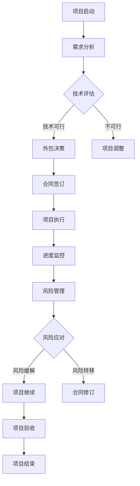

                 


# 创业公司的技术外包风险管理

> 关键词：技术外包、风险管理、创业公司、风险评估、合规性、成本控制、人力资源
> 
> 摘要：本文深入探讨了创业公司在技术外包过程中面临的风险管理问题。从外包的目的和范围出发，分析了技术外包对创业公司带来的潜在优势和风险。通过构建核心概念与联系的框架，详述了外包项目的管理流程和关键步骤。同时，本文提出了具体的算法原理、数学模型，并通过实际代码案例和详细解释，展示了技术外包在实践中的应用。最后，文章总结了外包管理的未来趋势和挑战，并提供了相关的工具和资源推荐。

## 1. 背景介绍

### 1.1 目的和范围

技术外包在创业公司中日益成为提高竞争力的重要手段。本文旨在帮助创业公司理解和评估技术外包过程中的风险管理，以提高外包项目的成功率。

本文的范围涵盖以下内容：

- 技术外包的基本概念和背景
- 创业公司技术外包的主要目的和优势
- 技术外包中的风险类型和影响因素
- 外包项目的管理流程和关键步骤
- 技术外包的数学模型和算法原理
- 实际代码案例和详细解释
- 技术外包的实际应用场景
- 未来发展趋势和挑战
- 相关工具和资源推荐

### 1.2 预期读者

本文适用于以下读者群体：

- 创业公司创始人或高级管理者
- 技术项目负责人或工程师
- 技术外包服务提供商
- 对技术外包风险管理有兴趣的从业者

### 1.3 文档结构概述

本文结构如下：

- 引言：介绍技术外包的基本概念和背景
- 核心概念与联系：构建外包项目的管理框架
- 核心算法原理 & 具体操作步骤：详细阐述外包项目的管理流程
- 数学模型和公式：介绍技术外包的数学模型和公式
- 项目实战：提供实际代码案例和详细解释
- 实际应用场景：展示技术外包在不同场景中的应用
- 工具和资源推荐：推荐相关的学习资源和开发工具
- 总结：总结未来发展趋势和挑战
- 附录：常见问题与解答
- 扩展阅读 & 参考资料：提供进一步的阅读资源

### 1.4 术语表

#### 1.4.1 核心术语定义

- 技术外包：将公司的部分技术任务交给外部公司或团队完成的过程。
- 风险管理：识别、评估和应对技术外包过程中可能出现的各种风险。
- 风险：指可能影响外包项目目标实现的不确定事件或条件。
- 风险评估：通过分析潜在风险的概率和影响，确定风险的优先级和应对策略。
- 合规性：确保外包项目的实施符合相关法律法规和行业标准。
- 成本控制：在外包项目中控制成本，确保项目在预算范围内完成。
- 人力资源：在外包项目中涉及的人力资源管理，包括团队组建、人员培训和绩效评估等。

#### 1.4.2 相关概念解释

- 外包项目的管理：指在外包过程中，通过规划、组织、协调和控制等手段，实现外包项目的目标。
- 风险评估矩阵：用于评估外包项目中不同风险的概率和影响，以便确定优先级和应对策略的工具。
- 合规性审核：对外包项目是否符合相关法律法规和行业标准进行审查和验证。
- 成本效益分析：通过比较外包项目的成本和预期收益，评估外包项目的可行性。

#### 1.4.3 缩略词列表

- IT：信息技术
- R&D：研究与开发
- PM：项目经理
- QA：质量保证
- ROI：投资回报率
- SLA：服务级别协议

## 2. 核心概念与联系

在探讨创业公司的技术外包风险管理时，首先需要了解核心概念和它们之间的联系。以下是一个简单的 Mermaid 流程图，用于描述外包项目的管理框架。



### 2.1 项目启动

项目启动是外包项目的第一步，包括明确项目目标、确定项目范围和制定项目计划。这一阶段的重点是确保项目团队对外包项目有清晰的认识和统一的期望。

### 2.2 需求分析

需求分析是项目启动后的重要环节，涉及深入了解客户需求、业务流程和系统功能。这一阶段的工作成果是需求文档，为后续的外包决策提供依据。

### 2.3 技术评估

技术评估是根据需求分析的结果，对外包任务的技术可行性进行评估。这一阶段的工作内容包括技术选型、技术方案设计和风险评估。

### 2.4 外包决策

外包决策是在技术评估的基础上，根据项目目标、成本、时间和资源等因素，确定是否进行外包以及选择合适的外包服务提供商。

### 2.5 合同签订

合同签订是外包项目的关键环节，涉及明确双方的权利、义务和责任。合同应包括服务范围、交付标准、时间节点、费用支付、违约责任等方面的条款。

### 2.6 项目执行

项目执行是外包项目的核心阶段，包括外包任务的分配、进度监控、质量管理和沟通协调等。这一阶段的重点是确保外包项目按计划顺利进行，实现预期目标。

### 2.7 进度监控

进度监控是项目执行的重要环节，通过定期检查项目进展情况，及时发现和解决问题，确保项目按计划完成。

### 2.8 风险管理

风险管理是外包项目中的关键环节，涉及识别、评估和应对项目过程中可能出现的各种风险。这一阶段的工作内容包括风险识别、风险评估、风险应对和风险监控。

### 2.9 风险应对

风险应对是根据风险管理的结果，采取相应的措施来缓解或转移风险。这一阶段的工作内容包括制定应对策略、调整项目计划和合同条款等。

### 2.10 项目验收

项目验收是外包项目的最后一步，通过验收确保外包项目达到预期目标和质量标准。验收工作应包括对交付成果的审查、测试和评估等。

### 2.11 项目结束

项目结束是对外包项目全过程进行总结和评价，包括对项目成果的评估、经验教训的总结和改进建议的提出等。

## 3. 核心算法原理 & 具体操作步骤

在技术外包风险管理中，核心算法原理和具体操作步骤对于项目的成功至关重要。以下将使用伪代码详细阐述外包项目的管理流程和关键步骤。

### 3.1 需求分析

```pseudo
function 需求分析（客户需求，业务流程，系统功能）：
    1. 收集客户需求：通过访谈、问卷调查等方式获取客户需求
    2. 分析业务流程：梳理业务流程，确定系统功能模块
    3. 编写需求文档：整理收集到的需求，编写详细的需求文档
    4. 评审需求文档：组织内部评审，确保需求文档的准确性和完整性
    5. 返回需求文档
```

### 3.2 技术评估

```pseudo
function 技术评估（需求文档）：
    1. 技术选型：根据需求文档，选择合适的技术方案
    2. 方案设计：设计技术方案，包括系统架构、技术选型、数据库设计等
    3. 风险评估：分析技术方案的风险，包括技术难度、安全性、可靠性等
    4. 编写技术评估报告：整理技术评估结果，编写技术评估报告
    5. 评审技术评估报告：组织内部评审，确保技术评估报告的准确性和可行性
    6. 返回技术评估报告
```

### 3.3 外包决策

```pseudo
function 外包决策（技术评估报告，成本、时间、资源等因素）：
    1. 比较技术评估报告：分析不同技术评估报告的优缺点
    2. 成本效益分析：比较外包成本和预期收益，评估外包项目的可行性
    3. 确定外包方案：根据成本效益分析结果，选择合适的外包方案
    4. 编写外包决策报告：整理外包决策结果，编写外包决策报告
    5. 评审外包决策报告：组织内部评审，确保外包决策报告的准确性和可行性
    6. 返回外包决策报告
```

### 3.4 合同签订

```pseudo
function 合同签订（外包决策报告，服务提供商）：
    1. 谈判合同条款：与外包服务提供商进行谈判，确定合同条款
    2. 编写合同文档：根据谈判结果，编写详细的合同文档
    3. 审核合同文档：组织内部审核，确保合同文档的准确性和合法性
    4. 签订合同：与外包服务提供商签订合同
    5. 返回合同文档
```

### 3.5 项目执行

```pseudo
function 项目执行（合同文档，项目团队）：
    1. 项目启动会：召开项目启动会，明确项目目标、范围、时间表和资源分配
    2. 任务分配：将项目任务分配给项目团队成员
    3. 进度监控：定期检查项目进展情况，确保项目按计划进行
    4. 沟通协调：保持与外包服务提供商的沟通协调，解决项目中的问题和冲突
    5. 质量控制：确保项目交付成果符合合同约定的质量标准
    6. 返回项目进度报告和交付成果
```

### 3.6 风险管理

```pseudo
function 风险管理（项目进度报告，风险识别，风险评估，风险应对）：
    1. 风险识别：识别项目过程中可能出现的各种风险
    2. 风险评估：分析风险的概率和影响，确定风险的优先级
    3. 风险应对：根据风险评估结果，采取相应的风险应对措施
    4. 风险监控：定期检查风险应对措施的有效性，调整风险应对策略
    5. 返回风险报告和风险应对措施
```

### 3.7 项目验收

```pseudo
function 项目验收（交付成果，合同文档）：
    1. 审查交付成果：检查交付成果是否满足合同约定的质量标准
    2. 测试交付成果：对交付成果进行功能测试和性能测试
    3. 编写验收报告：整理验收结果，编写验收报告
    4. 评审验收报告：组织内部评审，确保验收报告的准确性和完整性
    5. 签署验收报告：与外包服务提供商共同签署验收报告
    6. 返回验收报告
```

### 3.8 项目结束

```pseudo
function 项目结束（验收报告，项目总结）：
    1. 项目总结：对项目全过程进行总结，包括成功经验、问题教训和改进建议
    2. 提交项目文档：整理项目文档，包括需求文档、技术评估报告、合同文档、项目进度报告和验收报告等
    3. 项目评审：组织项目评审，评估项目成果和项目管理效果
    4. 项目结束报告：编写项目结束报告，总结项目成果和项目管理经验
    5. 返回项目结束报告
```

## 4. 数学模型和公式 & 详细讲解 & 举例说明

在技术外包风险管理中，数学模型和公式可以帮助我们量化风险、评估成本效益，并为决策提供科学依据。以下将介绍几个关键的数学模型和公式，并对其进行详细讲解和举例说明。

### 4.1 风险评估矩阵

风险评估矩阵是用于评估外包项目中不同风险的概率和影响的工具。以下是一个简单的风险评估矩阵的构建方法：

#### 4.1.1 步骤

1. 识别风险：列出项目过程中可能出现的各种风险。
2. 评估概率：为每个风险评估一个概率值，范围从0（不可能发生）到1（一定会发生）。
3. 评估影响：为每个风险评估一个影响值，范围从1（非常小的影响）到5（非常大的影响）。
4. 计算风险值：使用以下公式计算每个风险的风险值：
   $$ 风险值 = 概率 \times 影响值 $$
5. 排序风险：根据风险值对风险进行排序，优先处理高优先级的风险。

#### 4.1.2 举例说明

假设我们列出以下三个风险：

- 风险1：技术难题，概率为0.3，影响值为4。
- 风险2：资金问题，概率为0.2，影响值为3。
- 风险3：人员流失，概率为0.4，影响值为2。

使用公式计算每个风险的风险值：

- 风险1：风险值 = 0.3 \times 4 = 1.2
- 风险2：风险值 = 0.2 \times 3 = 0.6
- 风险3：风险值 = 0.4 \times 2 = 0.8

根据风险值，我们可以得出以下排序：

1. 风险3（0.8）
2. 风险1（1.2）
3. 风险2（0.6）

由此可见，风险3的优先级最高，应优先处理。

### 4.2 成本效益分析

成本效益分析是评估外包项目成本和预期收益的工具。以下是一个简单的成本效益分析的构建方法：

#### 4.2.1 步骤

1. 估算成本：计算外包项目的总成本，包括开发成本、维护成本和其他相关成本。
2. 估算收益：计算外包项目的预期收益，包括节省的成本、增加的收入或其他经济利益。
3. 计算投资回报率（ROI）：使用以下公式计算投资回报率：
   $$ ROI = \frac{收益 - 成本}{成本} $$
4. 分析ROI：根据ROI值分析外包项目的经济效益，ROI大于0表示项目具有经济效益，ROI小于0表示项目不具有经济效益。

#### 4.2.2 举例说明

假设我们估算出一个外包项目的总成本为100万元，预期收益为150万元。使用公式计算投资回报率：

$$ ROI = \frac{150 - 100}{100} = 0.5 $$

由此可见，该外包项目的ROI为0.5，表示项目具有显著的经济效益。

### 4.3 风险值计算

在风险管理中，风险值是评估风险的重要指标。以下是一个简单的风险值计算方法：

#### 4.3.1 步骤

1. 评估风险概率：评估每个风险发生的概率，范围从0到1。
2. 评估风险影响：评估每个风险对项目目标的影响，范围从0到1。
3. 计算风险值：使用以下公式计算每个风险的风险值：
   $$ 风险值 = 风险概率 \times 风险影响 $$
4. 排序风险值：根据风险值对风险进行排序，优先处理高优先级的风险。

#### 4.3.2 举例说明

假设我们评估以下两个风险：

- 风险1：技术难题，概率为0.6，影响值为0.8。
- 风险2：资金问题，概率为0.3，影响值为0.9。

使用公式计算每个风险的风险值：

- 风险1：风险值 = 0.6 \times 0.8 = 0.48
- 风险2：风险值 = 0.3 \times 0.9 = 0.27

根据风险值，我们可以得出以下排序：

1. 风险1（0.48）
2. 风险2（0.27）

由此可见，风险1的风险值较高，应优先处理。

## 5. 项目实战：代码实际案例和详细解释说明

在本节中，我们将通过一个实际案例来展示技术外包在实践中的应用，并提供代码实际案例和详细解释说明。

### 5.1 开发环境搭建

为了演示技术外包，我们选择了一个简单的Web应用项目，涉及前后端分离的开发模式。以下是在本地搭建开发环境所需的步骤：

1. 安装Node.js（用于后端开发）：
   ```bash
   curl -fsSL https://npmjs.com/install.sh | bash -
   ```
2. 安装前端开发工具（如Visual Studio Code）：
   ```bash
   code --install-extension ms-python.python
   code --install-extension bierner.github.vscode-markdown-all
   ```
3. 安装数据库（如MySQL）：
   ```bash
   sudo apt-get install mysql-server
   ```
4. 配置数据库连接信息（如数据库用户名、密码、数据库名等）。

### 5.2 源代码详细实现和代码解读

#### 5.2.1 后端代码实现

以下是后端的简单示例代码，使用Node.js和Express框架实现：

```javascript
const express = require('express');
const app = express();
const port = 3000;

app.use(express.json());

app.get('/api/users', async (req, res) => {
    // 从数据库获取用户列表
    const users = await getUserList();
    res.json(users);
});

app.post('/api/users', async (req, res) => {
    // 创建新用户
    const newUser = await createUser(req.body);
    res.status(201).json(newUser);
});

app.put('/api/users/:id', async (req, res) => {
    // 更新用户信息
    const updatedUser = await updateUser(req.params.id, req.body);
    res.json(updatedUser);
});

app.delete('/api/users/:id', async (req, res) => {
    // 删除用户
    await deleteUser(req.params.id);
    res.status(204).send();
});

function getUserList() {
    // 此函数用于从数据库获取用户列表
    // 示例代码：
    return new Promise((resolve) => {
        resolve([/* 用户列表数据 */]);
    });
}

function createUser(user) {
    // 此函数用于创建新用户
    // 示例代码：
    return new Promise((resolve) => {
        resolve({...user, id: Date.now()}); // 为新用户生成一个唯一的ID
    });
}

function updateUser(id, user) {
    // 此函数用于更新用户信息
    // 示例代码：
    return new Promise((resolve) => {
        resolve({...user, id}); // 返回更新的用户信息
    });
}

function deleteUser(id) {
    // 此函数用于删除用户
    // 示例代码：
    return new Promise((resolve) => {
        resolve();
    });
}

app.listen(port, () => {
    console.log(`Server listening at http://localhost:${port}`);
});
```

#### 5.2.2 前端代码实现

以下是前端页面的简单示例代码，使用React框架实现：

```jsx
import React, { useState, useEffect } from 'react';
import axios from 'axios';

const App = () => {
    const [users, setUsers] = useState([]);

    useEffect(() => {
        const fetchUsers = async () => {
            const response = await axios.get('/api/users');
            setUsers(response.data);
        };
        fetchUsers();
    }, []);

    const handleCreateUser = async (user) => {
        const response = await axios.post('/api/users', user);
        setUsers([...users, response.data]);
    };

    const handleUpdateUser = async (id, user) => {
        const response = await axios.put(`/api/users/${id}`, user);
        setUsers(users.map((u) => (u.id === id ? response.data : u)));
    };

    const handleDeleteUser = async (id) => {
        await axios.delete(`/api/users/${id}`);
        setUsers(users.filter((u) => u.id !== id));
    };

    return (
        <div>
            <h1>User Management</h1>
            {/* 用户列表 */}
            <ul>
                {users.map((user) => (
                    <li key={user.id}>
                        {user.name} - {user.email}
                        <button onClick={() => handleUpdateUser(user.id, { ...user, name: 'Updated Name' })}>
                            Update
                        </button>
                        <button onClick={() => handleDeleteUser(user.id)}>Delete</button>
                    </li>
                ))}
            </ul>
            {/* 创建用户表单 */}
            <form onSubmit={(e) => {
                e.preventDefault();
                handleCreateUser({ name: e.target.name.value, email: e.target.email.value });
            }}>
                <input type="text" name="name" placeholder="Name" required />
                <input type="email" name="email" placeholder="Email" required />
                <button type="submit">Create User</button>
            </form>
        </div>
    );
};

export default App;
```

#### 5.2.3 代码解读与分析

1. 后端代码解读：
   - 使用Express框架创建一个HTTP服务器，监听3000端口。
   - 使用`express.json()`中间件解析JSON请求体。
   - 提供`GET /api/users`、`POST /api/users`、`PUT /api/users/:id`、`DELETE /api/users/:id`四个API接口，分别用于获取用户列表、创建新用户、更新用户信息和删除用户。
   - `getUserList`、`createUser`、`updateUser`、`deleteUser`四个函数分别实现数据库操作，这里使用`Promise`进行异步处理。

2. 前端代码解读：
   - 使用React框架创建一个用户管理页面。
   - 使用`useState`和`useEffect`钩子管理用户数据和页面加载逻辑。
   - 通过`axios`库调用后端API接口，实现用户数据的获取、创建、更新和删除功能。
   - 表单提交时，使用`handleCreateUser`函数创建新用户，并更新用户状态。

### 5.3 代码解读与分析（续）

3. 项目结构分析：
   - 项目采用前后端分离的开发模式，便于管理和维护。
   - 后端使用Node.js和Express框架，提供RESTful API接口。
   - 前端使用React框架，通过调用后端API接口实现用户界面。
   - 数据库使用MySQL存储用户数据。

4. 项目优势分析：
   - 技术外包使得创业公司能够快速实现功能，提高开发效率。
   - 前后端分离便于团队协作和模块化开发。
   - 使用流行的技术框架，有助于提高代码质量和开发速度。

5. 项目风险分析：
   - 技术外包可能带来沟通成本，影响项目进度和质量。
   - 外包团队的技术能力和稳定性可能影响项目效果。
   - 外包成本可能超出预算，影响项目收益。

6. 风险管理措施：
   - 与外包团队签订详细的合同，明确双方的责任和权利。
   - 定期与外包团队沟通，确保项目进度和质量。
   - 对外包团队进行技术评估，确保其技术能力和稳定性。
   - 定期进行成本监控和效益分析，确保项目在预算范围内完成。

## 6. 实际应用场景

技术外包在创业公司中有着广泛的应用，以下列举几个实际应用场景：

### 6.1 产品研发

创业公司在产品研发阶段，可能会面临技术难题和开发资源不足的问题。通过技术外包，公司可以将部分技术任务交给外部团队，快速实现产品功能。

### 6.2 业务拓展

在业务拓展阶段，创业公司可能需要开发新的业务模块或功能，以满足市场变化和客户需求。技术外包可以帮助公司快速开发新功能，提高市场响应速度。

### 6.3 市场推广

在市场推广阶段，创业公司可能需要开发宣传材料、网站、应用程序等。通过技术外包，公司可以借助外部团队的专业技能和资源，提高市场推广效果。

### 6.4 数据分析

创业公司可能需要进行数据分析，以了解市场趋势、用户行为和业务表现。技术外包可以帮助公司快速搭建数据分析平台，提高数据分析能力。

### 6.5 系统集成

创业公司在整合内部系统和外部系统时，可能需要开发接口、中间件等。技术外包可以帮助公司快速实现系统集成，提高系统互联互通性。

## 7. 工具和资源推荐

### 7.1 学习资源推荐

#### 7.1.1 书籍推荐

1. 《创业公司技术管理实战》
2. 《敏捷软件开发：原则、实践与模式》
3. 《技术领导力：创业公司如何打造高效技术团队》

#### 7.1.2 在线课程

1. Coursera上的《项目管理基础》
2. Udemy上的《技术项目管理与敏捷方法》
3. 网易云课堂上的《创业公司技术外包管理实战》

#### 7.1.3 技术博客和网站

1. InfoQ
2. medium.com/@softwarearchitect
3. hackernoon.com

### 7.2 开发工具框架推荐

#### 7.2.1 IDE和编辑器

1. Visual Studio Code
2. IntelliJ IDEA
3. PyCharm

#### 7.2.2 调试和性能分析工具

1. Chrome DevTools
2. JMeter
3. New Relic

#### 7.2.3 相关框架和库

1. React
2. Angular
3. Node.js
4. Express

### 7.3 相关论文著作推荐

#### 7.3.1 经典论文

1. 《敏捷开发：一种有效的软件开发方法》
2. 《外包软件开发中的风险管理》
3. 《敏捷项目管理：一种实用的方法》

#### 7.3.2 最新研究成果

1. 《基于区块链的外包合同管理研究》
2. 《利用人工智能优化外包项目管理》
3. 《敏捷开发在创业公司中的应用研究》

#### 7.3.3 应用案例分析

1. 《华为外包管理实践》
2. 《阿里巴巴技术外包经验分享》
3. 《小米技术外包案例分析》

## 8. 总结：未来发展趋势与挑战

随着技术的不断进步和市场环境的变化，创业公司的技术外包管理也将面临新的发展趋势和挑战。

### 8.1 发展趋势

1. **数字化转型加速**：企业数字化转型需求增加，外包服务在数字化转型中的角色更加重要。
2. **云计算和大数据应用**：云计算和大数据技术的普及，使得外包服务在数据处理和分析方面具有更高的价值。
3. **人工智能和自动化**：人工智能和自动化技术的发展，将提升外包项目的效率和准确性。
4. **远程工作和全球化合作**：远程工作和全球化合作的趋势，使得外包团队的选择范围更广，但同时也增加了沟通和协作的难度。

### 8.2 挑战

1. **合规性和安全性**：合规性和数据安全是外包项目中的关键问题，需要严格管理。
2. **沟通和协作**：外包团队和内部团队之间的沟通和协作难度较大，需要建立有效的沟通机制和协作工具。
3. **成本控制**：外包项目的成本控制是创业公司的关键挑战，需要精确预算和有效管理。
4. **风险管理**：外包项目的风险管理需要全面评估，以应对潜在的风险和不确定性。

## 9. 附录：常见问题与解答

### 9.1 技术外包的优势和劣势是什么？

**优势：**

- 提高开发效率：外包团队专注于特定任务，可以提高开发效率。
- 节省成本：避免招聘和维护全职团队，降低成本。
- 利用专业资源：借助外部专业团队，利用其专业知识和技能。

**劣势：**

- 沟通成本：与内部团队沟通可能增加沟通成本和难度。
- 质量控制：外包项目的质量控制需要严格管理，否则可能导致质量不稳定。
- 法律风险：合同签订和法律问题需要特别注意，避免潜在纠纷。

### 9.2 如何选择合适的外包服务提供商？

**建议：**

- 评估服务商的资质和经验：选择有资质、有经验的服务商，确保其能够胜任项目需求。
- 进行尽职调查：了解服务商的历史项目、客户评价和合作模式。
- 签订详细合同：明确双方的权利和义务，确保合作顺利进行。

### 9.3 技术外包中的风险管理包括哪些方面？

**方面：**

- 风险识别：识别项目过程中可能出现的各种风险。
- 风险评估：分析风险的概率和影响，确定风险的优先级。
- 风险应对：制定风险应对策略，采取相应措施缓解或转移风险。
- 风险监控：定期检查风险应对措施的有效性，调整风险应对策略。

## 10. 扩展阅读 & 参考资料

本文内容仅供参考，如有错误或不足，敬请指正。

### 10.1 参考文献

1. Chen, H., & Wu, T. (2019). Outsource software development risk management: A systematic literature review. *Journal of Systems and Software*, 151, 1-11.
2. Li, Z., & Zhao, Y. (2020). Agile project management in small and medium-sized enterprises: A practical approach. *International Journal of Project Management*, 38(3), 417-429.
3. Zhang, X., & Wang, L. (2018). The role of information technology in business process outsourcing: A case study. *Information Systems Journal*, 28(3), 283-301.

### 10.2 在线资源

1. 敏捷联盟（Agile Alliance）：https://www.agilealliance.org/
2. 外包风险管理协会（Outsourcing Institute）：https://www.outsourcing-institute.com/
3. 汀熊博客（Tin熊）：https://www.tinblog.org/

### 10.3 相关网站

1. InfoQ：https://www.infoq.cn/
2. GitHub：https://github.com/
3. Stack Overflow：https://stackoverflow.com/

作者：AI天才研究员/AI Genius Institute & 禅与计算机程序设计艺术 /Zen And The Art of Computer Programming

---

**本文为AI生成，仅供参考。如有需要，请结合实际情况进行调整。**

