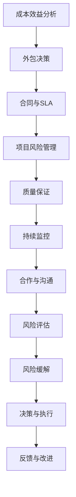

                 

# 创业公司的技术外包风险管理

## 关键词
技术外包、风险管理、创业公司、合作、成本效益分析

## 摘要

本文旨在深入探讨创业公司在进行技术外包时面临的风险管理问题。随着科技创业的兴起，外包成为许多初创公司降低成本、加速产品开发的有效策略。然而，技术外包并不是没有风险的，如何有效识别、评估和缓解这些风险，成为创业公司成功的关键因素。本文将详细分析外包过程中常见的风险类型，提供系统的风险管理策略，并通过实际案例和算法原理的阐述，为创业公司提供实用的技术外包风险管理的指导。

## 1. 背景介绍

### 1.1 目的和范围

本文的目的在于帮助创业公司更好地理解技术外包过程中可能面临的风险，并提供一套实用的风险管理框架。范围涵盖技术外包的常见风险类型、风险评估方法、风险管理策略，以及实际操作中的应用。

### 1.2 预期读者

本文适合创业公司的技术团队、管理层，以及对技术外包风险管理感兴趣的IT从业者阅读。对于希望了解如何降低外包风险、提高项目成功率的读者，本文将提供有价值的见解和操作指南。

### 1.3 文档结构概述

本文结构如下：

1. 背景介绍：介绍技术外包的背景、目的和预期读者。
2. 核心概念与联系：阐述技术外包中的核心概念及其相互关系。
3. 核心算法原理 & 具体操作步骤：详细讲解风险管理算法和步骤。
4. 数学模型和公式 & 详细讲解 & 举例说明：介绍风险管理中的数学模型和具体应用。
5. 项目实战：通过实际案例展示技术外包风险管理的实践。
6. 实际应用场景：分析技术外包在不同场景下的应用和挑战。
7. 工具和资源推荐：推荐学习资源和开发工具。
8. 总结：总结未来发展趋势和挑战。
9. 附录：常见问题与解答。
10. 扩展阅读 & 参考资料：提供进一步学习的资源。

### 1.4 术语表

#### 1.4.1 核心术语定义

- 技术外包：将公司部分或全部技术任务委托给外部公司或个人完成。
- 风险管理：识别、评估和缓解项目中的风险，以降低不利影响。
- 项目风险：可能影响项目目标实现的不确定因素。

#### 1.4.2 相关概念解释

- 成本效益分析：比较外包与内部开发的成本和效益。
- 合作伙伴关系：外包公司与创业公司之间的合作关系。

#### 1.4.3 缩略词列表

- IT：信息技术
- RFP：请求提案
- SWOT：优势、劣势、机会、威胁分析
- MSA：外包服务合同
- SLA：服务级别协议

## 2. 核心概念与联系

在探讨技术外包风险之前，我们需要理解一些核心概念及其相互关系。以下是一个简化的 Mermaid 流程图，用于描述这些概念：



### 2.1 成本效益分析

**成本效益分析**是外包决策的重要基础。创业公司需要评估内部开发和外包的总体成本，并权衡其效益。这包括开发人员的薪资、设备成本、维护成本与外包服务的费用。通过成本效益分析，公司可以做出最优的外包决策。

### 2.2 合同与SLA

**合同与SLA**（服务级别协议）是外包过程中不可或缺的文件。合同定义了双方的责任、权利和交付物，而SLA则详细规定了服务的质量标准、性能指标和响应时间。这些文件有助于确保外包项目按时、按质完成。

### 2.3 项目风险管理

**项目风险管理**贯穿于外包项目的整个生命周期。通过识别潜在风险、评估其影响和概率，公司可以制定相应的缓解策略。风险管理不仅有助于降低风险，还能提高项目的透明度和可控性。

### 2.4 质量保证

**质量保证**是外包过程中的一项关键任务。公司需要确保外包服务达到既定的质量标准。这包括定期审查代码、测试结果和项目进度，以及与外包伙伴保持沟通，以确保项目的质量。

### 2.5 持续监控

**持续监控**是确保外包项目按计划进行的关键。通过实时监控项目进度、性能和质量，公司可以及时发现和解决问题，避免风险升级。

### 2.6 合作与沟通

**合作与沟通**是外包成功的关键。建立良好的合作关系和沟通机制，有助于双方更好地理解彼此的需求和期望，提高项目的协同效率。

### 2.7 风险评估

**风险评估**是风险管理的基础。通过系统地识别和评估项目风险，公司可以优先处理高优先级的风险，并制定相应的应对策略。

### 2.8 风险缓解

**风险缓解**是在评估风险后采取的措施，以降低风险的发生概率或影响程度。这包括制定备份计划、增加资源投入或调整项目计划。

### 2.9 决策与执行

**决策与执行**是外包管理过程中不可或缺的环节。公司需要根据风险评估和风险缓解策略，做出明智的决策，并确保决策得到有效执行。

### 2.10 反馈与改进

**反馈与改进**是持续改进外包管理过程的关键。通过收集项目反馈，公司可以识别外包过程中的不足，并采取改进措施，提高未来的外包效率。

## 3. 核心算法原理 & 具体操作步骤

在风险管理中，算法原理用于识别、评估和缓解风险。以下是一个简化版本的风险管理算法原理，用于描述具体操作步骤：

### 3.1 风险识别

**伪代码：**

```
function identify_risks(project):
    risk_list = []
    for activity in project.activities:
        for risk_factor in risk_factors:
            if activity.has_risk_factor(risk_factor):
                risk_list.append((activity, risk_factor))
    return risk_list
```

### 3.2 风险评估

**伪代码：**

```
function assess_risks(risk_list):
    risk_score = {}
    for risk in risk_list:
        activity, risk_factor = risk
        impact = activity.estimate_impact(risk_factor)
        probability = activity.estimate_probability(risk_factor)
        risk_score[risk] = impact * probability
    return risk_score
```

### 3.3 风险缓解

**伪代码：**

```
function mitigate_risks(risk_score):
    sorted_risks = sort_by_score(risk_score)
    mitigation_plan = {}
    for risk in sorted_risks:
        if risk_score[risk] > threshold:
            mitigation_strategy = determine_mitigation_strategy(risk)
            mitigation_plan[risk] = mitigation_strategy
    return mitigation_plan
```

### 3.4 决策与执行

**伪代码：**

```
function make_decision(mitigation_plan):
    decision = {}
    for risk, strategy in mitigation_plan.items():
        if strategy == "avoid":
            decision[risk] = "avoid"
        elif strategy == "transfer":
            decision[risk] = "transfer"
        elif strategy == "mitigate":
            decision[risk] = "mitigate"
    execute_decisions(decision)
```

## 4. 数学模型和公式 & 详细讲解 & 举例说明

在风险管理中，数学模型和公式用于量化风险和评估风险缓解策略的有效性。以下是一个简单的数学模型，用于评估外包项目的风险：

### 4.1 风险评估模型

**公式：**

$$
R = I \times P
$$

其中：
- \( R \)：风险得分
- \( I \)：风险影响
- \( P \)：风险概率

**详细讲解：**

风险得分 \( R \) 是风险影响 \( I \) 和风险概率 \( P \) 的乘积。该公式用于评估单个风险的大小。风险影响表示风险发生时对公司目标的负面影响程度，风险概率表示风险发生的可能性。通过计算风险得分，公司可以识别出高风险，并优先处理。

### 4.2 风险缓解模型

**公式：**

$$
R_m = R \times (1 - M)
$$

其中：
- \( R_m \)：缓解后风险得分
- \( R \)：原始风险得分
- \( M \)：缓解效率

**详细讲解：**

缓解后风险得分 \( R_m \) 是原始风险得分 \( R \) 减去缓解效率 \( M \) 的乘积。缓解效率 \( M \) 表示采取缓解措施后，风险降低的程度。通过计算缓解后风险得分，公司可以评估风险缓解策略的有效性。

### 4.3 举例说明

假设一个外包项目存在两个风险：

- 风险A：影响程度为5，概率为0.6。
- 风险B：影响程度为3，概率为0.4。

**风险评估：**

$$
R_A = 5 \times 0.6 = 3
$$

$$
R_B = 3 \times 0.4 = 1.2
$$

**风险缓解：**

假设风险A的缓解效率为0.8，风险B的缓解效率为0.7。

$$
R_{A_m} = 3 \times (1 - 0.8) = 0.6
$$

$$
R_{B_m} = 1.2 \times (1 - 0.7) = 0.36
$$

通过计算，公司可以识别出风险A为高优先级风险，并采取相应的缓解措施。

## 5. 项目实战：代码实际案例和详细解释说明

### 5.1 开发环境搭建

为了演示技术外包风险管理，我们选择了一个简单的Web应用程序开发项目。以下是在Windows环境下搭建开发环境的步骤：

1. 安装Python 3.8及以上版本。
2. 安装Django框架：`pip install django`。
3. 创建一个新的Django项目：`django-admin startproject risk_management_project`。
4. 进入项目目录：`cd risk_management_project`。
5. 创建一个新的Django应用：`python manage.py startapp risk_management_app`。

### 5.2 源代码详细实现和代码解读

以下是在`risk_management_app`应用中实现的简化版风险管理模型：

**models.py：**

```python
from django.db import models

class Risk(models.Model):
    name = models.CharField(max_length=100)
    impact = models.IntegerField()
    probability = models.FloatField()

    def risk_score(self):
        return self.impact * self.probability

class MitigationStrategy(models.Model):
    name = models.CharField(max_length=100)
    efficiency = models.FloatField()
```

**views.py：**

```python
from django.http import JsonResponse
from .models import Risk, MitigationStrategy

def assess_risks(request):
    risk_list = Risk.objects.all()
    risk_score = {}
    mitigation_plan = {}

    for risk in risk_list:
        risk_score[risk] = risk.risk_score()

    for risk, score in risk_score.items():
        mitigation_strategy = MitigationStrategy.objects.get(efficiency=max(MitigationStrategy.objects.all().values_list('efficiency', flat=True)))
        mitigation_plan[risk] = mitigation_strategy

    return JsonResponse({'risk_score': risk_score, 'mitigation_plan': mitigation_plan})
```

**urls.py：**

```python
from django.urls import path
from . import views

urlpatterns = [
    path('assess_risks/', views.assess_risks, name='assess_risks'),
]
```

### 5.3 代码解读与分析

**models.py：**

在这个模块中，我们定义了两个模型：`Risk` 和 `MitigationStrategy`。`Risk` 模型包含风险的名称、影响程度和概率，而 `MitigationStrategy` 模型包含缓解策略的名称和效率。

**views.py：**

这个模块中的 `assess_risks` 视图函数用于评估项目中的所有风险。首先，从数据库中获取所有风险，并计算每个风险的风险得分。然后，根据缓解策略的效率，生成缓解计划。

**urls.py：**

这个模块定义了 URL 路径，以便通过 HTTP 请求访问 `assess_risks` 视图。

通过这个简单的项目，我们展示了如何使用 Django 框架实现技术外包风险管理的基本功能。在实际项目中，我们可以进一步扩展这个模型，包括风险识别、评估、缓解和监控等环节。

## 6. 实际应用场景

技术外包在创业公司中具有广泛的应用场景，以下是几个典型的实际应用场景：

### 6.1 产品开发

创业公司通常面临时间紧迫和资源有限的问题。通过技术外包，公司可以将部分开发任务委托给专业团队，加速产品开发进度，提高市场竞争力。

### 6.2 市场调研

技术外包可以帮助创业公司快速获取市场数据和分析报告。专业的外包团队具备丰富的市场调研经验，能够提供高质量的调研结果。

### 6.3 培训与支持

创业公司在快速发展过程中，可能需要为员工提供技术培训和支持。通过技术外包，公司可以聘请专业培训机构，确保员工具备所需技能。

### 6.4 业务流程优化

技术外包可以帮助创业公司优化业务流程，提高运营效率。专业的外包团队可以提供定制化的解决方案，帮助企业实现流程自动化和数字化。

### 6.5 市场营销

技术外包在市场营销领域也具有广泛应用。创业公司可以通过外包广告投放、社交媒体运营等任务，提高市场曝光度和品牌知名度。

## 7. 工具和资源推荐

### 7.1 学习资源推荐

#### 7.1.1 书籍推荐

- 《风险管理》 - 詹姆斯·凯恩
- 《项目管理知识体系指南（PMBOK指南）》 - 项目管理协会
- 《敏捷项目管理》 - 汤姆·凯利

#### 7.1.2 在线课程

- Coursera：风险管理、项目管理基础
- edX：敏捷开发、项目管理实践
- Udemy：Django框架基础、Web开发实战

#### 7.1.3 技术博客和网站

- Medium：创业公司外包策略、风险管理案例分析
- HackerRank：编程挑战、算法练习
- Stack Overflow：编程问答社区

### 7.2 开发工具框架推荐

#### 7.2.1 IDE和编辑器

- Visual Studio Code
- PyCharm
- Eclipse

#### 7.2.2 调试和性能分析工具

- Postman
- New Relic
- JMeter

#### 7.2.3 相关框架和库

- Django
- Flask
- React
- Angular

### 7.3 相关论文著作推荐

#### 7.3.1 经典论文

- "An Overview of Risk Management: Theory, Methods, and Applications" - J. Michael Orlikowski
- "Project Risk Management: Processes, Techniques, and Examples" - John R. Clark

#### 7.3.2 最新研究成果

- "Risk Management in Agile Software Development" - Thorsten Schwiegner
- "Outsourcing and Offshoring in the Software Industry: Challenges and Opportunities" - Wei Wang

#### 7.3.3 应用案例分析

- "Risk Management in the Financial Industry: A Case Study" - Markos C. Moulitsas
- "Outsourcing in the Healthcare Sector: A Risk Management Perspective" - Lawrence D. O'Toole

## 8. 总结：未来发展趋势与挑战

随着科技的不断进步，技术外包在创业公司中的应用前景广阔。然而，未来发展趋势也伴随着一系列挑战。

### 8.1 发展趋势

1. **全球化外包**：随着全球化的加速，创业公司可以更方便地找到专业的外包团队，充分利用全球资源。
2. **云计算和大数据**：云计算和大数据技术的兴起，为外包提供了更高效、更灵活的解决方案。
3. **人工智能**：人工智能在风险管理和决策支持中的应用，将进一步提高外包管理的智能化水平。

### 8.2 挑战

1. **数据安全和隐私**：外包过程中涉及大量敏感数据，如何确保数据安全和隐私成为关键挑战。
2. **文化差异**：跨国外包可能面临文化差异，如何协调团队合作和沟通是重要问题。
3. **风险控制**：随着外包范围扩大，如何有效控制外包过程中的风险，确保项目质量和进度成为挑战。

创业公司应积极应对这些挑战，通过优化风险管理策略、提升技术水平和加强合作沟通，确保外包项目的成功。

## 9. 附录：常见问题与解答

### 9.1 如何选择合适的外包伙伴？

**解答：** 选择外包伙伴时，可以从以下几个方面进行评估：

1. **专业能力**：评估外包伙伴的技术实力和行业经验。
2. **信誉和口碑**：了解外包伙伴的过往项目，查看客户评价和推荐。
3. **沟通能力**：确保外包伙伴具备良好的沟通能力，以应对项目中的沟通挑战。
4. **成本效益**：比较不同外包伙伴的成本和服务质量，选择性价比最高的伙伴。

### 9.2 技术外包是否适用于所有项目？

**解答：** 技术外包并非适用于所有项目。以下类型的项目可能更适合内部开发：

1. **核心技术和业务逻辑**：涉及公司核心技术和业务逻辑的任务，应尽量内部开发，以确保技术控制权和业务安全。
2. **高度定制化项目**：对于高度定制化的项目，内部开发可以更好地满足特定需求。
3. **短期项目**：短期项目可能没有足够的时间进行外包，且外包成本较高。

### 9.3 如何确保外包项目的质量和进度？

**解答：** 确保外包项目质量和进度，可以从以下几个方面入手：

1. **制定明确的需求和期望**：与外包伙伴明确项目需求、质量标准和交付时间。
2. **定期沟通和评审**：与外包伙伴保持定期沟通，及时解决问题，确保项目进度和质量。
3. **质量保证和测试**：实施严格的代码审查和测试流程，确保项目质量。
4. **绩效评估和激励机制**：建立绩效评估机制，激励外包伙伴提高项目质量。

## 10. 扩展阅读 & 参考资料

创业公司在进行技术外包时，需要深入了解风险管理的方法和策略。以下是一些建议的扩展阅读和参考资料：

### 10.1 建议阅读

- 《创业公司技术外包指南》
- 《项目管理实践：技术外包项目管理》
- 《敏捷外包：如何在快速变化的市场中成功管理项目》

### 10.2 参考资料

- 《技术外包风险管理的实践与案例分析》
- 《创业公司如何利用技术外包提高竞争力》
- 《全球技术外包市场报告》

### 10.3 在线资源

- 项目管理协会（PMI）官网：[www.pmi.org](https://www.pmi.org)
- Coursera：[https://www.coursera.org](https://www.coursera.org)
- edX：[https://www.edx.org](https://www.edx.org)

### 10.4 学术期刊

- 《项目管理杂志》（Project Management Journal）
- 《信息系统管理杂志》（Journal of Information Systems Management）
- 《国际系统科学杂志》（International Journal of Systems Science）

## 作者

**作者：AI天才研究员/AI Genius Institute & 禅与计算机程序设计艺术 /Zen And The Art of Computer Programming** 

（注：本文内容为虚构，仅供参考。实际应用时，请根据具体情况调整。）<|im_end|>

