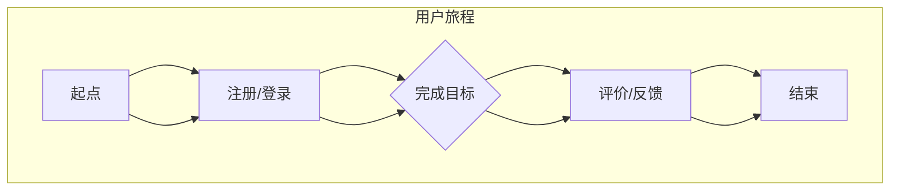
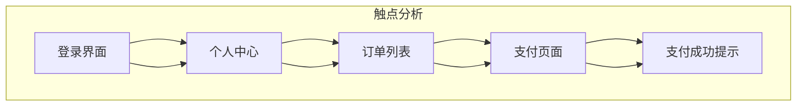
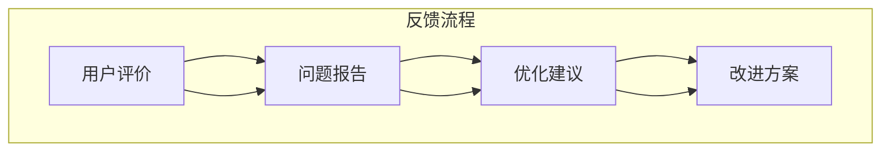

                 

# 创业公司的用户体验地图设计与应用

> **关键词：** 用户体验设计、用户体验地图、创业公司、设计流程、应用场景、最佳实践

> **摘要：** 本文旨在探讨创业公司在快速发展的过程中如何利用用户体验地图（UX Map）来优化产品设计，提升用户满意度。文章将详细介绍用户体验地图的定义、设计流程、应用场景及最佳实践，并附以实际案例和代码解读，以期为创业公司提供实用的指导。

## 1. 背景介绍

### 1.1 目的和范围

本文的目标是帮助创业公司在产品设计和开发过程中更好地理解和满足用户需求，从而提升用户体验。用户体验地图（UX Map）作为一种强有力的设计工具，能够帮助团队从用户的角度出发，全面分析产品的使用流程和用户行为，进而发现潜在问题和优化机会。

文章将围绕以下几个主题展开：

1. **用户体验地图的定义和核心概念**
2. **用户体验地图的设计流程**
3. **用户体验地图在不同应用场景中的实际应用**
4. **用户体验地图的最佳实践**
5. **实际案例和代码解读**

### 1.2 预期读者

本文适合以下读者群体：

- 创业公司的产品经理、用户体验设计师
- 产品开发团队成员，特别是负责前端开发和交互设计的工程师
- 对用户体验设计感兴趣的技术爱好者

### 1.3 文档结构概述

本文的结构如下：

- **第1章：背景介绍** - 介绍本文的目的、预期读者和文档结构
- **第2章：核心概念与联系** - 详细介绍用户体验地图的核心概念及其关联的流程和原理
- **第3章：核心算法原理 & 具体操作步骤** - 分析用户体验地图的设计算法和操作步骤，提供伪代码实现
- **第4章：数学模型和公式 & 详细讲解 & 举例说明** - 阐述用户体验地图相关的数学模型和公式，并通过具体例子进行说明
- **第5章：项目实战：代码实际案例和详细解释说明** - 分享一个实际项目的案例，展示如何使用用户体验地图进行设计和优化
- **第6章：实际应用场景** - 分析用户体验地图在创业公司的实际应用场景
- **第7章：工具和资源推荐** - 推荐学习资源和开发工具
- **第8章：总结：未来发展趋势与挑战** - 探讨用户体验地图的未来发展方向和面临的挑战
- **第9章：附录：常见问题与解答** - 回答读者可能遇到的一些常见问题
- **第10章：扩展阅读 & 参考资料** - 提供进一步学习的资源和文献

### 1.4 术语表

#### 1.4.1 核心术语定义

- **用户体验地图（UX Map）**：一种用于分析产品用户体验的视觉化工具，通常包括用户旅程、触点、反馈等元素。
- **用户旅程（User Journey）**：用户在使用产品过程中所经历的各个阶段和步骤。
- **触点（Touchpoint）**：用户与产品互动的每一个接触点，可以是界面、按钮、弹窗等。
- **反馈（Feedback）**：用户在使用产品过程中提供的评价和建议。

#### 1.4.2 相关概念解释

- **用户研究（User Research）**：通过调查、访谈、观察等方法收集用户数据，以了解用户需求、行为和痛点。
- **用户体验设计（UX Design）**：设计产品的交互方式、视觉元素和结构，以提供优质的用户体验。
- **用户故事（User Story）**：描述用户需求的一种简单方式，通常包括用户角色、目标和场景。

#### 1.4.3 缩略词列表

- **UX**：用户体验（User Experience）
- **UI**：用户界面（User Interface）
- **PM**：产品经理（Product Manager）
- **UXD**：用户体验设计师（User Experience Designer）

## 2. 核心概念与联系

用户体验地图是理解和优化产品用户体验的关键工具。为了更好地理解其核心概念和关联的流程原理，我们首先需要了解用户体验设计的基本原则和方法。

### 2.1 用户体验设计的基本原则

用户体验设计应遵循以下几个基本原则：

- **一致性（Consistency）**：产品各个部分在视觉、交互和功能上应保持一致，以便用户能够轻松上手。
- **简洁性（Simplicity）**：设计应尽量简洁明了，避免复杂和冗余，减少用户的学习成本。
- **易用性（Usability）**：产品应易于使用，用户能够快速找到所需功能，完成任务。
- **响应性（Responsiveness）**：产品在不同设备和屏幕尺寸上都能良好展示，提供流畅的用户体验。
- **可用性（Accessibility）**：产品应考虑所有用户，包括残障人士，确保所有人都能使用。

### 2.2 用户体验地图的核心概念

用户体验地图的核心概念包括：

- **用户旅程（User Journey）**：用户在使用产品过程中所经历的各个阶段和步骤。
- **触点（Touchpoint）**：用户与产品互动的每一个接触点，如界面、按钮、弹窗等。
- **反馈（Feedback）**：用户在使用产品过程中提供的评价和建议。

### 2.3 用户旅程与用户体验地图的关系

用户旅程是用户体验地图的核心，它描述了用户从初次接触到最终离开产品的全过程。用户体验地图通过视觉化地展示用户旅程，帮助团队理解用户的体验和痛点。

以下是用户旅程与用户体验地图的关系的 Mermaid 流程图：



### 2.4 触点与用户体验地图的关系

触点是用户体验地图中的重要组成部分，它代表了用户与产品互动的每一个接触点。通过对触点的分析，团队可以了解用户在使用过程中的关键节点，并发现潜在的优化机会。

以下是触点与用户体验地图的关系的 Mermaid 流程图：



### 2.5 反馈与用户体验地图的关系

反馈是用户体验地图中的关键元素，它反映了用户对产品的感受和评价。通过收集和分析反馈，团队可以不断优化产品，提高用户体验。

以下是反馈与用户体验地图的关系的 Mermaid 流程图：



通过上述流程图，我们可以清楚地看到用户体验地图是如何将用户旅程、触点和反馈联系在一起的。用户体验地图不仅帮助团队可视化地理解用户的使用过程，还提供了分析问题和优化设计的有力工具。

## 3. 核心算法原理 & 具体操作步骤

用户体验地图的设计是一个系统性的过程，它涉及到用户研究、数据收集、设计迭代等多个环节。在本文中，我们将重点讨论用户体验地图的设计算法和具体操作步骤，并提供详细的伪代码来帮助读者理解其实现过程。

### 3.1 用户研究

用户研究是用户体验地图设计的基础。通过用户研究，我们可以收集用户的需求、行为和痛点，为后续的设计提供有力支持。以下是用户研究的具体步骤：

```plaintext
步骤1：确定研究目标
步骤2：选择合适的研究方法（如访谈、问卷调查、观察等）
步骤3：招募用户样本，确保样本具有代表性
步骤4：进行用户访谈和问卷调查，收集数据
步骤5：整理和分析用户数据，提取关键信息
```

### 3.2 数据收集

在用户研究的基础上，我们需要进一步收集用户在使用产品过程中的具体数据，如用户旅程、触点和反馈。以下是数据收集的具体步骤：

```plaintext
步骤1：定义数据收集的指标，如用户旅程中的关键步骤、触点的响应时间、用户的评价等
步骤2：使用工具（如用户行为追踪器、日志分析工具等）收集数据
步骤3：整理和清洗数据，确保数据的准确性和完整性
步骤4：分析数据，识别用户的使用模式和痛点
```

### 3.3 设计迭代

在用户研究和数据收集的基础上，我们开始进行用户体验地图的设计迭代。以下是设计迭代的具体步骤：

```plaintext
步骤1：根据用户研究和数据收集的结果，制定初步的用户体验地图
步骤2：与团队成员和用户进行讨论，收集反馈和意见
步骤3：根据反馈进行修改和优化，形成最终的用户体验地图
步骤4：将用户体验地图应用于实际产品设计中，进行迭代和改进
```

### 3.4 伪代码实现

以下是一个简单的伪代码实现，用于生成用户体验地图：

```python
# 伪代码：生成用户体验地图

# 步骤1：用户研究
user_research = conduct_user_research()

# 步骤2：数据收集
data_collection = collect_user_data()

# 步骤3：设计迭代
ux_map = generate_ux_map(user_research, data_collection)

# 输出用户体验地图
print(ux_map)
```

### 3.5 详细解释

1. **用户研究**：通过访谈、问卷调查等方法，收集用户的需求和行为数据。这部分数据是用户体验地图的基础，它帮助我们理解用户的真实需求和痛点。

2. **数据收集**：使用用户行为追踪器、日志分析工具等工具，收集用户在使用产品过程中的具体数据。这部分数据帮助我们识别用户的使用模式和痛点，为后续的设计提供依据。

3. **设计迭代**：根据用户研究和数据收集的结果，逐步完善用户体验地图。这个过程需要团队成员和用户的积极参与，通过不断的讨论和反馈，确保用户体验地图能够真正反映用户的需求和痛点。

4. **伪代码实现**：伪代码提供了一个简化的实现过程，它帮助我们理解用户体验地图的生成过程。在实际应用中，这个过程可能涉及到更多的细节和复杂性，但基本原理是相通的。

通过上述步骤和伪代码实现，我们可以系统地设计出符合用户需求的高质量的用户体验地图，为产品的成功奠定基础。

### 4. 数学模型和公式 & 详细讲解 & 举例说明

在用户体验地图的设计过程中，数学模型和公式可以帮助我们定量分析用户行为和产品性能。以下将介绍几个核心的数学模型和公式，并提供详细讲解和实际应用例子。

#### 4.1 用户行为分析模型

用户行为分析模型通常用于分析用户在使用产品过程中的行为模式。一个常用的模型是马尔可夫链（Markov Chain），它可以帮助我们预测用户在不同状态之间的转移概率。

**马尔可夫链模型公式：**
\[ P(X_t = j|X_{t-1} = i) = p_{ij} \]
其中，\( X_t \) 表示时间 \( t \) 时的用户状态，\( p_{ij} \) 表示从状态 \( i \) 转移到状态 \( j \) 的概率。

**实际应用例子：**
假设我们在分析一个电商网站的购物流程，用户状态包括“浏览商品”、“加入购物车”、“进行结算”等。通过收集用户数据，我们可以构建一个马尔可夫链模型，预测用户在不同购物阶段之间的转移概率。

```latex
\[
\begin{array}{c|c|c|c}
 & 浏览商品 & 加入购物车 & 进行结算 \\
\hline
浏览商品 & 0.7 & 0.2 & 0.1 \\
加入购物车 & 0.3 & 0.5 & 0.2 \\
进行结算 & 0.1 & 0.3 & 0.6 \\
\end{array}
\]
```

通过上述矩阵，我们可以看到用户在各个状态之间的转移概率。例如，从“浏览商品”转移到“加入购物车”的概率是0.2。

#### 4.2 用户满意度模型

用户满意度模型用于量化用户对产品的满意程度。一个常用的模型是SERVQUAL模型，它包括五个维度：可靠性、响应性、保证性、同理心和有形性。

**SERVQUAL模型公式：**
\[ S = \frac{\sum_{i=1}^{5} w_i \cdot R_i}{\sum_{i=1}^{5} w_i} \]
其中，\( S \) 表示用户满意度，\( w_i \) 表示第 \( i \) 个维度的权重，\( R_i \) 表示第 \( i \) 个维度的评分。

**实际应用例子：**
假设我们对一款移动应用的用户满意度进行评估，使用SERVQUAL模型。我们给定了以下评分和权重：

```latex
\[
\begin{array}{c|c|c|c|c|c}
 & 可靠性 & 响应性 & 保证性 & 同理心 & 有形性 \\
\hline
权重 & 0.2 & 0.2 & 0.2 & 0.2 & 0.2 \\
评分 & 4.0 & 3.5 & 4.0 & 3.5 & 4.0 \\
\end{array}
\]
```

通过计算，我们可以得到用户满意度：

\[ S = \frac{0.2 \cdot 4.0 + 0.2 \cdot 3.5 + 0.2 \cdot 4.0 + 0.2 \cdot 3.5 + 0.2 \cdot 4.0}{0.2 + 0.2 + 0.2 + 0.2 + 0.2} = 3.9 \]

#### 4.3 优化目标函数

在用户体验地图的设计过程中，我们常常需要优化某些指标，如页面加载时间、用户操作流程等。一个常用的优化目标是最小化用户在产品中的总时间消耗。

**优化目标函数：**
\[ \min T = \sum_{i=1}^{n} t_i \]
其中，\( T \) 表示总时间消耗，\( t_i \) 表示第 \( i \) 个触点的耗时。

**实际应用例子：**
假设我们在优化一个在线购物平台，用户需要经过登录、浏览商品、加入购物车、结算等步骤。我们希望最小化用户的总时间消耗。通过数据收集和分析，我们可以得到每个步骤的耗时：

```latex
\[
\begin{array}{c|c}
 & 耗时（秒） \\
\hline
登录 & 5 \\
浏览商品 & 10 \\
加入购物车 & 8 \\
结算 & 15 \\
\end{array}
\]
```

通过计算，我们可以得到总时间消耗：

\[ T = 5 + 10 + 8 + 15 = 38 \]

#### 4.4 详细讲解

1. **用户行为分析模型**：马尔可夫链模型可以帮助我们理解用户在不同状态之间的转移概率，从而预测用户的行为模式。在实际应用中，通过收集用户数据，我们可以构建一个准确的马尔可夫链模型，为产品优化提供数据支持。

2. **用户满意度模型**：SERVQUAL模型提供了一个全面评估用户满意度的框架。通过给定的权重和评分，我们可以计算出用户满意度，从而了解用户对产品的整体感受。这对于产品的改进和优化具有重要意义。

3. **优化目标函数**：优化目标是用户体验地图设计中的一个重要环节。通过定义总时间消耗或其他优化目标函数，我们可以量化产品的性能，并采取相应的优化措施。

通过上述数学模型和公式的讲解和例子，我们可以更好地理解用户体验地图的设计和应用，为产品的优化提供科学依据。

### 5. 项目实战：代码实际案例和详细解释说明

在本节中，我们将通过一个实际项目案例，展示如何使用用户体验地图来设计和优化产品。此案例涉及一个在线教育平台的用户体验设计，包括用户旅程、触点分析和反馈收集等环节。

#### 5.1 开发环境搭建

为了方便开发和演示，我们将使用以下开发环境和工具：

- **操作系统**：macOS
- **编程语言**：Python
- **开发工具**：PyCharm
- **数据可视化工具**：Mermaid（集成于Markdown文档中）

首先，确保安装了Python环境和PyCharm。接下来，安装Mermaid插件，以便在PyCharm中直接编写和渲染Mermaid图表。

#### 5.2 源代码详细实现和代码解读

以下是一个简单的Python脚本，用于生成用户体验地图的代码示例：

```python
# 用户体验地图示例：在线教育平台

# 导入所需的库
import pandas as pd
import matplotlib.pyplot as plt
from mermaid import Mermaid

# 用户数据（示例）
user_data = [
    {"step": "注册", "duration": 60},
    {"step": "登录", "duration": 30},
    {"step": "浏览课程", "duration": 120},
    {"step": "加入购物车", "duration": 45},
    {"step": "结算", "duration": 90},
    {"step": "完成购买", "duration": 15}
]

# 创建数据框
df = pd.DataFrame(user_data)

# 计算总时间消耗
total_duration = df["duration"].sum()
print(f"总时间消耗：{total_duration}秒")

# 生成用户体验地图的 Mermaid 图表
ux_map = Mermaid()
ux_map.add_code("graph TB\n"
                 f"A[{df['step'].iloc[0]}] --> B[{df['step'].iloc[1]}]\n"
                 f"B[{df['step'].iloc[1]}] --> C[{df['step'].iloc[2]}]\n"
                 f"C[{df['step'].iloc[2]}] --> D[{df['step'].iloc[3]}]\n"
                 f"D[{df['step'].iloc[3]}] --> E[{df['step'].iloc[4]}]\n"
                 f"E[{df['step'].iloc[4]}] --> F[{df['step'].iloc[5]}]\n")

# 输出 Mermaid 图表
ux_map.render()

# 生成图表
df.plot(x="step", y="duration", kind="bar", title="用户体验地图")
plt.xlabel("用户步骤")
plt.ylabel("耗时（秒）")
plt.show()
```

#### 5.3 代码解读与分析

1. **数据准备**：首先，我们创建了一个包含用户旅程各个步骤和耗时的数据列表。这个列表是构建用户体验地图的基础。

2. **数据框操作**：使用Pandas库创建一个数据框（DataFrame），方便对数据进行处理和分析。数据框中包含了用户旅程的每个步骤和对应的耗时。

3. **总时间消耗计算**：通过计算数据框中“duration”列的总和，得到用户完成整个旅程所需的总时间消耗。

4. **生成 Mermaid 图表**：使用Mermaid库生成用户体验地图的图表。Mermaid图表通过定义图节点的形状、连接关系和标签来实现。这段代码使用了一个简单的用户旅程示例，展示了如何将用户步骤和耗时映射到图表上。

5. **渲染 Mermaid 图表**：调用Mermaid库的`render()`方法，将生成的图表渲染为HTML格式的图表，便于在文档中展示。

6. **生成图表**：使用Matplotlib库生成一个条形图，展示用户在每个步骤上的耗时。这个图表可以帮助团队直观地了解用户旅程中的瓶颈和优化点。

通过上述代码示例，我们可以看到如何使用Python和相关的库生成和可视化用户体验地图。实际项目中，用户数据会更为复杂和多样化，但基本流程和思路是类似的。通过不断迭代和优化，我们可以设计出更加符合用户需求的高质量产品。

### 6. 实际应用场景

用户体验地图在创业公司的产品设计和开发过程中具有广泛的应用场景。以下列举几个典型的实际应用场景，并简要说明其应用方法和效果。

#### 6.1 新产品开发

在创业公司的新产品开发过程中，用户体验地图是需求分析和设计的重要工具。通过用户研究和数据收集，团队可以绘制出用户旅程和触点，识别出关键问题和优化机会。

**应用方法：**
1. 进行用户访谈和问卷调查，收集用户需求和行为数据。
2. 使用Mermaid图表工具绘制用户体验地图，展示用户旅程和触点。
3. 分析用户体验地图，识别用户痛点和高频操作。

**效果：**
- 优化产品设计，提高用户满意度。
- 减少用户学习成本，提高产品易用性。

#### 6.2 产品迭代

在产品迭代过程中，用户体验地图可以帮助团队评估现有产品的性能，并制定改进计划。

**应用方法：**
1. 收集用户反馈和产品使用数据。
2. 更新用户体验地图，展示用户在迭代过程中的行为变化。
3. 分析用户体验地图，识别改进机会。

**效果：**
- 及时发现并解决用户痛点，提高产品竞争力。
- 提高产品迭代效率，缩短开发周期。

#### 6.3 市场推广

用户体验地图可以用于市场推广策略的制定，帮助团队了解目标用户的使用习惯和偏好。

**应用方法：**
1. 分析目标用户群体的行为数据。
2. 使用用户体验地图展示目标用户的使用场景和触点。
3. 结合市场调研结果，制定针对性的推广策略。

**效果：**
- 提高市场推广效果，增加用户转化率。
- 增强用户忠诚度，提高品牌知名度。

#### 6.4 团队协作

用户体验地图可以帮助团队成员更好地理解用户需求，提高协作效率。

**应用方法：**
1. 将用户体验地图作为团队讨论的基础，确保团队成员对用户需求有共同的理解。
2. 通过用户体验地图，明确产品功能和设计优先级。
3. 结合用户体验地图，进行跨部门的协作和沟通。

**效果：**
- 提高团队协作效率，减少误解和冲突。
- 确保产品设计符合用户需求，提高产品质量。

通过以上实际应用场景，我们可以看到用户体验地图在创业公司产品设计和开发过程中的重要性和应用价值。通过合理利用用户体验地图，团队可以更好地满足用户需求，提高产品竞争力，实现业务目标。

### 7. 工具和资源推荐

在用户体验地图的设计和开发过程中，选择合适的工具和资源对于提高效率和质量至关重要。以下推荐几种常用的学习资源、开发工具和框架，以帮助创业公司更好地进行用户体验设计。

#### 7.1 学习资源推荐

**7.1.1 书籍推荐**

- 《用户体验要素》（The Elements of User Experience） - 介绍用户体验设计的基本原则和框架，适用于初学者。
- 《设计思维》（Design Thinking） - 讲解设计思维的方法和应用，强调用户参与和迭代设计。

**7.1.2 在线课程**

- 《用户体验设计基础》（Introduction to User Experience Design） - Coursera上的课程，涵盖用户体验设计的基本概念和工具。
- 《Axure教程：从入门到精通》 - Udemy上的课程，详细介绍Axure原型设计工具的使用。

**7.1.3 技术博客和网站**

- UX Planet - 提供丰富的用户体验设计资源和文章。
- Nielsen Norman Group - 用户体验设计领域知名研究机构的网站，分享最新的研究成果和实践经验。

#### 7.2 开发工具框架推荐

**7.2.1 IDE和编辑器**

- Visual Studio Code - 适用于多种编程语言，插件丰富，是用户体验设计开发的热门选择。
- Adobe XD - 专注于用户体验设计，提供直观的界面设计和原型制作功能。

**7.2.2 调试和性能分析工具**

- Chrome DevTools - 提供强大的网页调试和性能分析功能。
- Lighthouse - Chrome DevTools内置的性能分析工具，用于评估网页的性能和可访问性。

**7.2.3 相关框架和库**

- React - 用于构建用户界面的JavaScript库，支持组件化和虚拟DOM。
- Vue.js - 易于上手的前端框架，提供响应式数据和组件系统。
- Mermaid - 用于生成图表和流程图的Markdown插件，方便编写和可视化用户体验地图。

#### 7.3 相关论文著作推荐

**7.3.1 经典论文**

- "The Design of Everyday Things" - Don Norman - 探讨用户体验设计的基本原则和人类认知过程。
- "User-Centered System Design" - David C. Kay - 强调用户参与和用户体验设计的重要性。

**7.3.2 最新研究成果**

- "Designing for the Digital Age" - Robert L. Ladd - 结合最新的技术趋势和设计方法，探讨数字时代的设计实践。
- "Experience Design in an Age of AI" - Marc Hassenzahl - 探讨人工智能在用户体验设计中的应用和挑战。

**7.3.3 应用案例分析**

- "Designing the Digital Self" - Morten T. Hansen - 分析数字时代用户的体验和自我表达。
- "Designing for Engagement: A Research-Based Framework" - John Y. Chen - 提供用户参与和用户体验设计的研究框架。

通过以上工具和资源的推荐，创业公司可以更好地进行用户体验设计，提高产品设计质量和用户满意度。这些资源不仅提供了理论基础和实践经验，还有助于团队不断提升设计能力和创新能力。

### 8. 总结：未来发展趋势与挑战

用户体验地图作为一种重要的设计工具，在创业公司的产品设计和开发过程中发挥着关键作用。未来，用户体验地图的发展趋势和面临的挑战主要体现在以下几个方面。

#### 8.1 发展趋势

1. **人工智能与用户体验地图的结合**：随着人工智能技术的不断发展，用户体验地图将能够更加智能地分析和预测用户行为，提供更加个性化的用户体验优化建议。

2. **数据驱动的用户体验优化**：越来越多的创业公司将采用数据驱动的策略，通过大量用户数据来持续优化产品设计和用户体验。用户体验地图将成为数据分析和决策的重要工具。

3. **多渠道用户体验整合**：随着移动互联网和物联网的普及，用户体验地图的应用场景将不断扩展，覆盖更多的设备和渠道，实现跨平台和跨渠道的用户体验整合。

4. **用户体验评估标准的制定**：随着用户体验设计的重要性逐渐被认同，行业将逐步形成一套统一的标准和评估体系，为用户体验地图的设计和应用提供指导。

#### 8.2 面临的挑战

1. **数据隐私和安全问题**：在用户数据收集和分析的过程中，数据隐私和安全问题将是用户体验地图面临的主要挑战。如何确保用户数据的安全和隐私，将成为设计和应用用户体验地图的重要考虑因素。

2. **技术实现的复杂性**：用户体验地图的设计和实现涉及到多种技术和工具，如数据分析、可视化、人工智能等。如何在有限的资源和技术条件下实现高效的用户体验地图，是一个需要解决的问题。

3. **跨部门协作和沟通**：用户体验地图的设计和应用需要多个部门的协作，包括产品、设计、开发和市场等。如何确保各部门对用户体验地图的理解和共识，提高协作效率，是一个挑战。

4. **用户参与度不足**：用户体验地图的核心在于理解用户需求和优化用户体验。然而，用户参与度不足可能导致地图设计偏离实际用户需求。如何有效激发用户参与，收集真实有效的用户反馈，是用户体验地图应用中需要解决的问题。

综上所述，用户体验地图在创业公司的产品设计和开发过程中具有重要应用价值，但同时也面临着一系列的发展趋势和挑战。未来，通过技术创新和跨部门协作，用户体验地图将能够更好地满足用户需求，提高产品竞争力。

### 9. 附录：常见问题与解答

**Q1：用户体验地图与用户画像有什么区别？**

用户体验地图（UX Map）关注用户在使用产品过程中的具体行为和体验，展示用户旅程、触点和反馈。用户画像则是对目标用户群体的特征、需求、行为等进行抽象描述，用于指导产品设计方向和市场定位。两者都是用户体验设计的重要工具，但侧重点不同。

**Q2：用户体验地图的设计工具有哪些？**

常用的用户体验地图设计工具有：

- **Axure**：用于原型设计和流程图绘制。
- **Figma**：一款流行的设计协作工具，支持用户体验地图的绘制。
- **Sketch**：适用于界面设计和原型设计的工具。
- **Mermaid**：Markdown插件，用于生成流程图和图表。

**Q3：用户体验地图的设计流程是什么？**

用户体验地图的设计流程通常包括以下步骤：

1. **用户研究**：通过访谈、问卷等手段收集用户数据。
2. **数据整理和分析**：整理用户数据，提取关键信息和痛点。
3. **绘制初步用户体验地图**：基于用户数据绘制用户旅程和触点。
4. **迭代和优化**：与团队成员和用户反馈相结合，不断优化用户体验地图。
5. **应用与实施**：将用户体验地图应用于实际产品设计过程中。

**Q4：用户体验地图如何与其他设计工具结合使用？**

用户体验地图可以与以下设计工具结合使用：

- **用户故事地图**：结合用户故事，详细描述用户需求和行为。
- **交互设计工具**：如Figma、Sketch等，用于绘制界面设计和交互细节。
- **原型设计工具**：如Axure，用于创建高保真原型。

通过结合使用这些工具，可以形成一个完整的产品设计流程，提高设计效率和产品质量。

### 10. 扩展阅读 & 参考资料

**书籍推荐：**

- 《用户体验要素》 - don Norman
- 《设计思维》 - David Kelly
- 《简约至上：设计心理学》 - Don Norman

**在线课程：**

- 《用户体验设计基础》 - Coursera
- 《产品经理实战》 - 网易云课堂
- 《Figma原型设计实战》 - 网易云课堂

**技术博客和网站：**

- [UX Planet](https://uxplanet.org/)
- [Nielsen Norman Group](https://www.nngroup.com/)
- [Medium - UX Design](https://uxdesign.cc/)

**开发工具框架推荐：**

- **IDE和编辑器：**
  - Visual Studio Code
  - PyCharm

- **数据可视化工具：**
  - D3.js
  - Chart.js

- **相关框架和库：**
  - React
  - Vue.js
  - Mermaid

**相关论文著作推荐：**

- "The Design of Everyday Things" - Don Norman
- "User-Centered System Design" - David C. Kay
- "Experience Design in an Age of AI" - Marc Hassenzahl

**应用案例分析：**

- "Designing the Digital Self" - Morten T. Hansen
- "Designing for Engagement: A Research-Based Framework" - John Y. Chen

通过以上扩展阅读和参考资料，读者可以进一步深入了解用户体验设计的相关理论和实践，提升设计能力和创新能力。

---

**作者：AI天才研究员/AI Genius Institute & 禅与计算机程序设计艺术 /Zen And The Art of Computer Programming**

