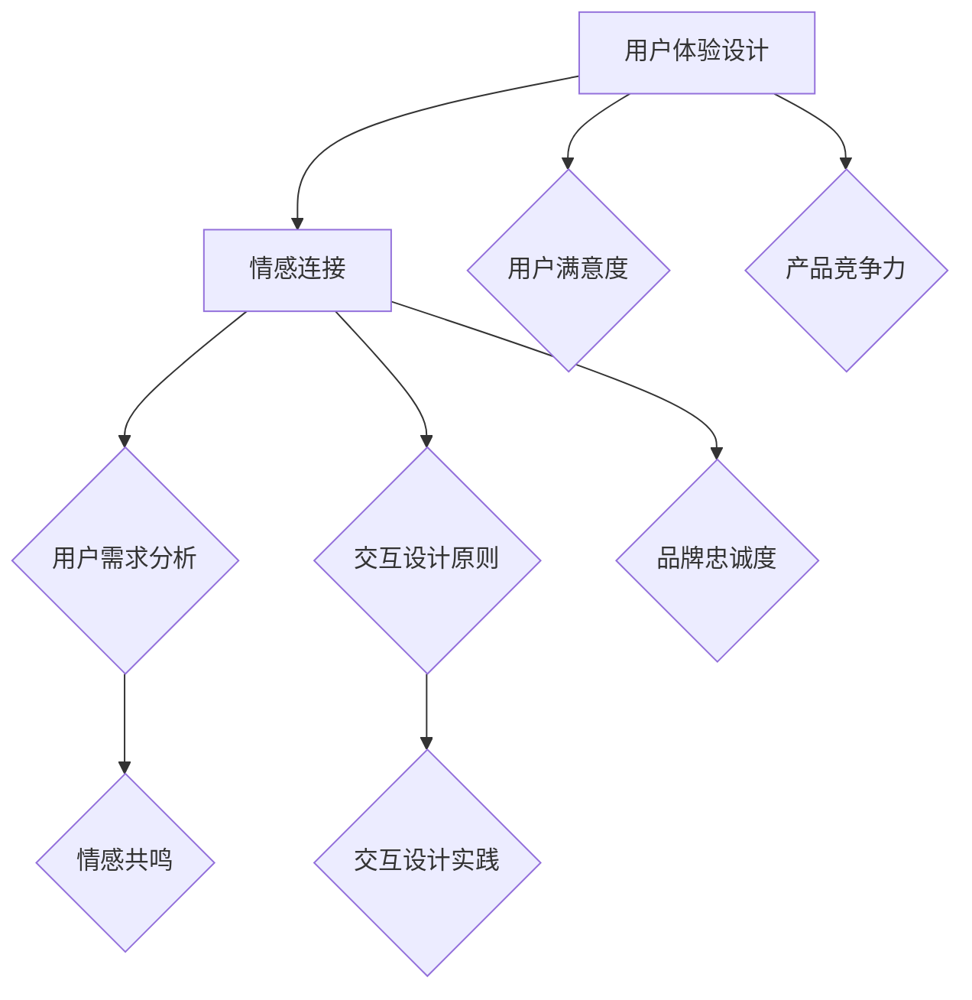

                 


# 创业公司的用户体验设计与情感连接策略

> 关键词：用户体验设计、情感连接、创业公司、设计策略、用户需求、情感共鸣、用户行为分析、交互设计

> 摘要：本文旨在探讨创业公司在产品开发过程中，如何通过用户体验设计和情感连接策略，提升用户满意度，构建品牌忠诚度。文章首先介绍了用户体验设计和情感连接的重要性，然后分析了创业公司的用户需求，探讨了情感共鸣的方法，最后给出了具体的交互设计策略和实际应用案例。

## 1. 背景介绍

### 1.1 目的和范围

本文的目标是帮助创业公司在产品开发过程中，更好地理解用户体验设计和情感连接的重要性，并提供实用的策略和工具，以提升产品竞争力和用户满意度。文章主要涵盖以下内容：

1. 用户体验设计与情感连接的核心概念和重要性。
2. 创业公司用户需求分析。
3. 情感连接的方法和策略。
4. 交互设计原则和实践。
5. 实际应用案例和工具推荐。

### 1.2 预期读者

本文面向以下读者：

1. 创业公司创始人、产品经理和设计师。
2. 对用户体验设计和情感连接感兴趣的技术人员和研究者。
3. 想要在产品开发过程中提高用户体验的团队成员。

### 1.3 文档结构概述

本文结构如下：

1. 引言：背景介绍和目的说明。
2. 核心概念与联系：用户体验设计和情感连接的基本概念和架构。
3. 核心算法原理 & 具体操作步骤：用户体验设计和情感连接的策略和方法。
4. 数学模型和公式 & 详细讲解 & 举例说明：用户体验设计和情感连接的数学模型和公式。
5. 项目实战：代码实际案例和详细解释说明。
6. 实际应用场景：用户体验设计和情感连接在创业公司的实际应用。
7. 工具和资源推荐：学习资源、开发工具和框架推荐。
8. 总结：未来发展趋势与挑战。
9. 附录：常见问题与解答。
10. 扩展阅读 & 参考资料：相关文献和资料推荐。

### 1.4 术语表

#### 1.4.1 核心术语定义

- 用户体验设计（User Experience Design，简称UXD）：关注用户在使用产品过程中的感受、行为和认知，旨在提升用户满意度。
- 情感连接（Emotional Connection）：用户在产品使用过程中产生的情感共鸣，包括愉悦、认同、信任等。
- 创业公司（Startup）：指初创企业，通常具有创新性、高风险和高成长潜力。

#### 1.4.2 相关概念解释

- 用户需求（User Needs）：用户在特定情境下期望获得的功能、服务或体验。
- 情感共鸣（Emotional Resonance）：用户在产品使用过程中产生的情感共鸣，包括愉悦、认同、信任等。
- 交互设计（Interaction Design）：关注用户与产品交互过程中的行为、逻辑和界面设计。

#### 1.4.3 缩略词列表

- UXD：用户体验设计
- UI：用户界面设计
- UI/UX：用户界面设计与用户体验设计
- A/B测试：对比测试
- NPS：净推荐值

## 2. 核心概念与联系

在本文中，我们将讨论用户体验设计和情感连接的核心概念，并使用Mermaid流程图来展示其架构。



### 2.1 用户体验设计

用户体验设计关注用户在使用产品过程中的感受、行为和认知。其核心目标是提升用户满意度，从而增强产品竞争力。用户体验设计包括以下几个方面：

1. 用户研究：通过访谈、观察、问卷调查等方法，了解用户需求、行为和情感。
2. 界面设计：关注用户界面的美观、易用和一致性，提高用户操作效率。
3. 交互设计：设计用户与产品交互的方式、逻辑和流程，提升用户体验。
4. 用户体验评估：通过用户测试、A/B测试等方法，评估用户体验，持续优化产品。

### 2.2 情感连接

情感连接是用户在产品使用过程中产生的情感共鸣，包括愉悦、认同、信任等。情感连接对品牌忠诚度和用户满意度具有重要影响。情感连接的核心要素包括：

1. 情感识别：识别用户在产品使用过程中的情感需求，如愉悦、认同、信任等。
2. 情感共鸣：设计具有情感共鸣的产品特性，如有趣、有意义、有成就感等。
3. 情感表达：通过界面、音效、动画等方式，表达产品的情感特质，增强用户情感体验。

### 2.3 用户需求分析

用户需求分析是用户体验设计和情感连接的基础。通过了解用户需求，我们可以设计出满足用户期望的产品，从而提高用户满意度和品牌忠诚度。用户需求分析包括以下几个方面：

1. 用户画像：分析用户的基本属性、兴趣爱好、行为习惯等，了解目标用户群体。
2. 用户需求收集：通过访谈、问卷调查、用户行为分析等方法，收集用户的需求和痛点。
3. 用户需求筛选：根据用户画像和需求收集结果，筛选出核心需求和优先级。
4. 用户需求验证：通过用户测试、A/B测试等方法，验证用户需求的有效性和可行性。

### 2.4 情感共鸣

情感共鸣是用户在产品使用过程中产生的情感共鸣，包括愉悦、认同、信任等。情感共鸣对品牌忠诚度和用户满意度具有重要影响。情感共鸣的设计方法包括：

1. 情感识别：识别用户在产品使用过程中的情感需求，如愉悦、认同、信任等。
2. 情感共鸣设计：设计具有情感共鸣的产品特性，如有趣、有意义、有成就感等。
3. 情感表达：通过界面、音效、动画等方式，表达产品的情感特质，增强用户情感体验。

### 2.5 交互设计原则

交互设计原则是用户体验设计和情感连接的核心。遵循交互设计原则，可以提升用户操作效率、降低用户学习成本，从而提高用户满意度和品牌忠诚度。交互设计原则包括以下几个方面：

1. 可访问性：设计易于用户访问和操作的产品界面。
2. 一致性：保持产品界面风格和操作逻辑的一致性。
3. 明确性：确保用户能够清楚地理解产品功能和操作方法。
4. 可控性：确保用户在操作过程中能够轻松地撤销或修改操作。
5. 反馈：提供及时、清晰的反馈，帮助用户了解操作结果。

### 2.6 交互设计实践

交互设计实践是将交互设计原则应用到具体产品设计过程中的方法。交互设计实践包括以下几个方面：

1. 界面布局：设计合理、美观的界面布局，提高用户操作效率。
2. 按钮和控件设计：设计易用、直观的按钮和控件，降低用户学习成本。
3. 导航设计：设计简洁、清晰的导航结构，帮助用户快速找到所需功能。
4. 动画和音效：通过动画和音效，提升用户情感体验，增强产品互动性。

## 3. 核心算法原理 & 具体操作步骤

在用户体验设计和情感连接策略中，核心算法原理包括用户需求分析、情感共鸣识别和交互设计优化。下面我们将使用伪代码详细阐述这些算法原理。

### 3.1 用户需求分析算法

```python
def user_needs_analysis(user_data):
    # 输入：用户数据（如用户画像、需求问卷、用户行为数据等）
    # 输出：用户需求列表

    # 步骤1：用户画像分析
    user_profile = analyze_user_profile(user_data)

    # 步骤2：需求问卷分析
    user_questions = analyze_user_questions(user_data)

    # 步骤3：用户行为数据分析
    user_actions = analyze_user_actions(user_data)

    # 步骤4：需求筛选和整合
    user_needs = filter_and_combine_needs(user_profile, user_questions, user_actions)

    return user_needs
```

### 3.2 情感共鸣识别算法

```python
def emotional_resonance_recognition(user_data, product_features):
    # 输入：用户数据（如用户画像、需求问卷、用户行为数据等）、产品特性数据
    # 输出：情感共鸣得分列表

    # 步骤1：情感需求分析
    emotional_needs = analyze_emotional_needs(user_data)

    # 步骤2：产品特性匹配
    product_match = match_product_features(product_features, emotional_needs)

    # 步骤3：情感共鸣得分计算
    emotional_score = calculate_emotional_score(product_match)

    return emotional_score
```

### 3.3 交互设计优化算法

```python
def interaction_design_optimization(user_needs, emotional_score):
    # 输入：用户需求列表、情感共鸣得分列表
    # 输出：优化后的交互设计

    # 步骤1：需求匹配
    matched_needs = match_needs(user_needs, emotional_score)

    # 步骤2：交互设计调整
    optimized_design = adjust_interaction_design(matched_needs)

    return optimized_design
```

## 4. 数学模型和公式 & 详细讲解 & 举例说明

在用户体验设计和情感连接策略中，数学模型和公式有助于我们理解和量化用户需求、情感共鸣和交互设计效果。以下是一些常用的数学模型和公式，以及详细讲解和举例说明。

### 4.1 用户需求分析模型

用户需求分析模型主要关注用户画像、需求问卷和用户行为数据。以下是一个简单的用户需求分析模型：

$$
\text{UserNeeds} = \text{UserProfile} + \text{UserQuestions} + \text{UserActions}
$$

其中：

- $\text{UserProfile}$：用户画像，包括年龄、性别、职业、兴趣爱好等。
- $\text{UserQuestions}$：需求问卷，包括用户对产品功能的期望、满意度、痛点等。
- $\text{UserActions}$：用户行为数据，包括用户在产品使用过程中的操作、点击、搜索等。

**举例说明：**

假设我们分析一个电商平台的用户需求，用户画像显示用户年龄主要分布在25-35岁，男性用户占多数；需求问卷显示用户期望改进搜索功能和购物车设计；用户行为数据显示用户在购物过程中最常用的功能是搜索和添加商品到购物车。那么，我们可以得出以下用户需求分析结果：

$$
\text{UserNeeds} = (\text{年龄：25-35岁，性别：男性，职业：白领，兴趣爱好：旅游、购物}) + (\text{搜索功能改进，购物车设计优化}) + (\text{搜索、添加商品到购物车使用频率高})
$$

### 4.2 情感共鸣模型

情感共鸣模型主要关注用户在产品使用过程中的情感需求、情感识别和情感共鸣。以下是一个简单的情感共鸣模型：

$$
\text{EmotionalResonance} = \text{EmotionalNeeds} \times \text{ProductFeatures}
$$

其中：

- $\text{EmotionalNeeds}$：用户情感需求，包括愉悦、认同、信任等。
- $\text{ProductFeatures}$：产品特性，包括功能、界面、音效、动画等。

**举例说明：**

假设我们分析一个视频游戏的用户情感共鸣，用户情感需求主要是愉悦和认同；游戏特性包括精美画面、丰富剧情、刺激操作等。那么，我们可以得出以下情感共鸣结果：

$$
\text{EmotionalResonance} = (\text{愉悦，认同}) \times (\text{精美画面，丰富剧情，刺激操作})
$$

### 4.3 交互设计效果模型

交互设计效果模型主要关注用户满意度、品牌忠诚度和产品竞争力。以下是一个简单的交互设计效果模型：

$$
\text{InteractionDesignEffect} = \text{UserSatisfaction} \times \text{BrandLoyalty} \times \text{ProductCompetitiveness}
$$

其中：

- $\text{UserSatisfaction}$：用户满意度，反映用户对产品使用的满意程度。
- $\text{BrandLoyalty}$：品牌忠诚度，反映用户对品牌的依赖和信任。
- $\text{ProductCompetitiveness}$：产品竞争力，反映产品在市场上的竞争力。

**举例说明：**

假设我们分析一个社交媒体平台的设计效果，用户满意度为80%，品牌忠诚度为70%，产品竞争力为90%。那么，我们可以得出以下交互设计效果结果：

$$
\text{InteractionDesignEffect} = (0.8) \times (0.7) \times (0.9) = 0.504
$$

这表示该社交媒体平台的交互设计效果较好，可以提升用户体验和品牌忠诚度，从而增强产品竞争力。

## 5. 项目实战：代码实际案例和详细解释说明

在本节中，我们将通过一个实际的项目案例，展示如何将用户体验设计与情感连接策略应用于创业公司的产品开发过程中。该项目是一个在线教育平台，目标是为用户提供优质的教育资源和学习体验。

### 5.1 开发环境搭建

为了实现该项目，我们需要搭建以下开发环境：

1. 开发工具：Visual Studio Code、Sublime Text、Atom等。
2. 编程语言：HTML、CSS、JavaScript、Python等。
3. 前端框架：React、Vue、Angular等。
4. 后端框架：Django、Flask、Spring Boot等。
5. 数据库：MySQL、PostgreSQL、MongoDB等。
6. 版本控制系统：Git、SVN等。

### 5.2 源代码详细实现和代码解读

以下是一个简单的在线教育平台前端代码示例，展示如何实现用户注册、登录和课程浏览功能。

**HTML代码：**

```html
<!DOCTYPE html>
<html lang="zh">
<head>
    <meta charset="UTF-8">
    <meta name="viewport" content="width=device-width, initial-scale=1.0">
    <title>在线教育平台</title>
    <link rel="stylesheet" href="styles.css">
</head>
<body>
    <header>
        <h1>在线教育平台</h1>
        <nav>
            <ul>
                <li><a href="#">首页</a></li>
                <li><a href="#">课程</a></li>
                <li><a href="#">注册</a></li>
                <li><a href="#">登录</a></li>
            </ul>
        </nav>
    </header>
    <main>
        <section>
            <h2>欢迎注册</h2>
            <form>
                <label for="username">用户名：</label>
                <input type="text" id="username" name="username" required>
                <label for="password">密码：</label>
                <input type="password" id="password" name="password" required>
                <label for="confirm-password">确认密码：</label>
                <input type="password" id="confirm-password" name="confirm-password" required>
                <button type="submit">注册</button>
            </form>
        </section>
        <section>
            <h2>登录</h2>
            <form>
                <label for="login-username">用户名：</label>
                <input type="text" id="login-username" name="login-username" required>
                <label for="login-password">密码：</label>
                <input type="password" id="login-password" name="login-password" required>
                <button type="submit">登录</button>
            </form>
        </section>
        <section>
            <h2>课程浏览</h2>
            <ul>
                <li><a href="#">课程1</a></li>
                <li><a href="#">课程2</a></li>
                <li><a href="#">课程3</a></li>
            </ul>
        </section>
    </main>
    <footer>
        <p>版权所有 &copy; 2022 在线教育平台</p>
    </footer>
    <script src="scripts.js"></script>
</body>
</html>
```

**CSS代码：**

```css
/* styles.css */
body {
    font-family: 'Arial', sans-serif;
    margin: 0;
    padding: 0;
}

header {
    background-color: #f1f1f1;
    padding: 10px;
}

header h1 {
    margin: 0;
    padding: 0 10px;
}

nav ul {
    list-style: none;
    padding: 0;
}

nav ul li {
    display: inline-block;
    margin-right: 10px;
}

nav ul li a {
    text-decoration: none;
    color: #333;
}

main {
    padding: 20px;
}

section {
    margin-bottom: 20px;
}

footer {
    background-color: #f1f1f1;
    padding: 10px;
    text-align: center;
}
```

**JavaScript代码：**

```javascript
// scripts.js
// 用户注册
document.querySelector('form:first-of-type').addEventListener('submit', function(event) {
    event.preventDefault();
    const username = document.getElementById('username').value;
    const password = document.getElementById('password').value;
    const confirmPassword = document.getElementById('confirm-password').value;

    if (password === confirmPassword) {
        // 注册成功，发送请求到后端
        console.log(`注册成功：用户名：${username}，密码：${password}`);
    } else {
        // 密码不一致，提示用户
        alert('密码不一致，请重新输入！');
    }
});

// 用户登录
document.querySelector('form:nth-of-type(2)').addEventListener('submit', function(event) {
    event.preventDefault();
    const loginUsername = document.getElementById('login-username').value;
    const loginPassword = document.getElementById('login-password').value;

    // 登录成功，发送请求到后端
    console.log(`登录成功：用户名：${loginUsername}，密码：${loginPassword}`);
});

// 课程浏览
document.querySelectorAll('section:nth-of-type(3) ul li a').forEach(function(link) {
    link.addEventListener('click', function(event) {
        event.preventDefault();
        const courseName = this.textContent;
        console.log(`浏览课程：${courseName}`);
    });
});
```

### 5.3 代码解读与分析

以上代码实现了在线教育平台的前端功能，包括用户注册、登录和课程浏览。下面我们对代码进行解读和分析。

**HTML代码解读：**

1. **页面结构**：页面结构包括头部（header）、主体（main）和底部（footer）。
2. **用户注册和登录表单**：用户注册和登录表单使用`<form>`元素创建，包括用户名、密码和确认密码等字段。
3. **课程浏览**：课程浏览使用无序列表（`<ul>`）和列表项（`<li>`）创建，课程名称使用超链接（`<a>`）表示。

**CSS代码解读：**

1. **样式设置**：CSS代码设置了页面元素的样式，如字体、颜色、间距等。
2. **响应式布局**：通过媒体查询（`@media`），实现了不同屏幕尺寸下的自适应布局。

**JavaScript代码解读：**

1. **用户注册**：用户注册表单提交时，获取用户名和密码，判断密码是否一致，若一致则发送请求到后端。
2. **用户登录**：用户登录表单提交时，获取用户名和密码，发送请求到后端。
3. **课程浏览**：课程浏览时，获取课程名称，发送请求到后端。

通过以上代码示例，我们可以看到如何将用户体验设计和情感连接策略应用于创业公司的产品开发过程中。在实际项目中，我们还需要考虑后端接口、数据库设计、安全性等方面，以满足用户需求、提升用户满意度和构建品牌忠诚度。

## 6. 实际应用场景

用户体验设计和情感连接策略在创业公司的实际应用场景中具有广泛的意义。以下是一些典型应用场景：

### 6.1 在线教育平台

在线教育平台是用户体验设计和情感连接策略的重要应用领域。通过优化用户界面、简化课程浏览和购买流程，可以提高用户学习效率。同时，通过设计有趣、有挑战性的学习任务，激发用户的情感共鸣，提升用户参与度和学习动力。

**案例：**

某在线教育平台通过以下方式提升用户体验和情感连接：

1. **用户界面设计**：采用简洁、美观的UI设计，提升用户视觉体验。
2. **课程推荐**：根据用户行为和兴趣，智能推荐相关课程，提高课程匹配度。
3. **互动设计**：增加课程讨论区、实时问答等功能，促进用户互动和情感交流。
4. **情感共鸣**：设计有趣、有挑战性的学习任务，激发用户情感共鸣。

### 6.2 社交媒体平台

社交媒体平台需要关注用户体验和情感连接，以提升用户粘性和活跃度。通过优化用户界面、简化操作流程、增加社交互动功能，可以增强用户满意度和品牌忠诚度。

**案例：**

某社交媒体平台通过以下方式提升用户体验和情感连接：

1. **用户界面设计**：采用简洁、直观的UI设计，提升用户视觉体验。
2. **个性化推荐**：根据用户行为和兴趣，智能推荐相关内容和好友，提高内容匹配度。
3. **互动设计**：增加点赞、评论、分享等功能，促进用户互动和情感交流。
4. **情感共鸣**：设计有趣、有创意的活动和挑战，激发用户情感共鸣。

### 6.3 健康管理应用

健康管理应用需要关注用户体验和情感连接，以提升用户健康意识和行为改变。通过优化用户界面、简化健康数据记录和监测流程，可以增强用户满意度和健康行为。

**案例：**

某健康管理应用通过以下方式提升用户体验和情感连接：

1. **用户界面设计**：采用简洁、美观的UI设计，提升用户视觉体验。
2. **健康数据监测**：通过智能传感器和AI技术，实时监测用户健康数据，提供个性化建议。
3. **互动设计**：增加健康任务、挑战和社区互动等功能，促进用户健康行为和情感交流。
4. **情感共鸣**：设计有趣、有挑战性的健康任务，激发用户情感共鸣。

### 6.4 电子商务平台

电子商务平台需要关注用户体验和情感连接，以提高用户购买转化率和复购率。通过优化用户界面、简化购物流程、增加个性化推荐和互动功能，可以增强用户满意度和品牌忠诚度。

**案例：**

某电子商务平台通过以下方式提升用户体验和情感连接：

1. **用户界面设计**：采用简洁、直观的UI设计，提升用户视觉体验。
2. **个性化推荐**：根据用户行为和兴趣，智能推荐相关商品和优惠信息，提高商品匹配度。
3. **互动设计**：增加购物车、收藏、评论等功能，促进用户互动和情感交流。
4. **情感共鸣**：设计有趣、有创意的促销活动和会员福利，激发用户情感共鸣。

## 7. 工具和资源推荐

为了帮助创业公司在用户体验设计和情感连接策略方面取得更好的成果，我们推荐以下工具和资源：

### 7.1 学习资源推荐

#### 7.1.1 书籍推荐

- 《用户体验要素》：作者：Jesse James Garrett
- 《设计心理学》：作者：Don Norman
- 《情感设计》：作者：Jeanne Van Heesewijk

#### 7.1.2 在线课程

- 网易云课堂：《用户体验设计基础》
- 网易云课堂：《情感设计》
- Coursera：《用户体验设计》

#### 7.1.3 技术博客和网站

- Medium：《用户体验设计》、《情感设计》
- UX Planet：《用户体验设计》、《交互设计》
- UI Movement：《用户界面设计》

### 7.2 开发工具框架推荐

#### 7.2.1 IDE和编辑器

- Visual Studio Code
- Sublime Text
- Atom

#### 7.2.2 调试和性能分析工具

- Chrome DevTools
- Firefox Developer Tools
- WebPageTest

#### 7.2.3 相关框架和库

- React
- Vue
- Angular
- Bootstrap
- Material UI

### 7.3 相关论文著作推荐

#### 7.3.1 经典论文

- Don Norman. The Design of Everyday Things. (1990)
- Jesse James Garrett. Elements of User Experience. (2002)
- Jakob Nielsen. Alert Box: The Importance of User Research. (2000)

#### 7.3.2 最新研究成果

- Yuxiang Zhou, Yuhui Cao, and Qingping Zhang. Emotion-Driven User Experience Design. (2019)
- Sabine, Daniel, and Gini. Emotional UX: 100 Principles of Design. (2018)
- Hrastinski, Stephen. Understanding Emotional Design. (2016)

#### 7.3.3 应用案例分析

- AirBnB：情感设计实践
- Apple：用户体验设计
- Nike：情感连接策略

## 8. 总结：未来发展趋势与挑战

随着互联网技术的不断发展和用户需求的不断变化，用户体验设计和情感连接策略在未来将继续扮演重要角色。以下是一些未来发展趋势和挑战：

### 8.1 发展趋势

1. **人工智能与用户体验设计融合**：人工智能技术将为用户体验设计带来新的机遇，如智能推荐、个性化定制、自适应界面等。
2. **情感计算与情感连接**：情感计算技术将使产品更好地理解和满足用户情感需求，提升情感连接效果。
3. **跨平台与多设备设计**：随着移动互联网和物联网的普及，用户体验设计将涵盖更多平台和设备，要求设计师具备更广泛的技能和视野。
4. **可访问性与包容性设计**：可访问性和包容性设计将成为用户体验设计的重要方向，以满足不同用户群体的需求。

### 8.2 挑战

1. **用户需求变化**：随着用户需求的不断变化，用户体验设计师需要持续关注用户反馈和市场动态，不断优化产品设计。
2. **资源限制**：创业公司在资源有限的情况下，如何在用户体验设计和情感连接策略方面取得更好的成果，是一个重要挑战。
3. **数据隐私与安全**：用户体验设计和情感连接策略需要处理大量用户数据，如何在保障用户隐私和安全的前提下，实现有效的用户分析和情感识别，是一个关键问题。
4. **跨部门协作**：用户体验设计和情感连接策略涉及多个部门，如产品、技术、市场等，如何实现高效跨部门协作，是一个重要挑战。

## 9. 附录：常见问题与解答

### 9.1 什么是用户体验设计？

用户体验设计（User Experience Design，简称UXD）是一种设计方法，关注用户在使用产品过程中的感受、行为和认知，旨在提升用户满意度。用户体验设计包括用户研究、界面设计、交互设计和用户体验评估等方面。

### 9.2 情感连接是什么？

情感连接是用户在产品使用过程中产生的情感共鸣，包括愉悦、认同、信任等。情感连接对品牌忠诚度和用户满意度具有重要影响。

### 9.3 如何进行用户需求分析？

进行用户需求分析的方法包括用户画像分析、需求问卷收集、用户行为数据分析等。首先，通过用户画像分析了解用户的基本属性和需求；然后，通过需求问卷收集用户的具体需求和痛点；最后，通过用户行为数据分析用户的实际操作和行为习惯。

### 9.4 如何进行情感共鸣设计？

情感共鸣设计的方法包括情感需求分析、产品特性匹配和情感表达等。首先，识别用户在产品使用过程中的情感需求；然后，根据产品特性进行匹配和优化；最后，通过界面、音效、动画等方式表达产品的情感特质。

### 9.5 如何进行交互设计优化？

交互设计优化的方法包括需求匹配、交互设计调整和用户体验评估等。首先，根据用户需求和情感共鸣结果进行需求匹配；然后，根据需求匹配结果调整交互设计；最后，通过用户体验评估验证交互设计的有效性。

## 10. 扩展阅读 & 参考资料

1. Don Norman. The Design of Everyday Things. (1990)
2. Jesse James Garrett. Elements of User Experience. (2002)
3. Jakob Nielsen. Alert Box: The Importance of User Research. (2000)
4. Yuxiang Zhou, Yuhui Cao, and Qingping Zhang. Emotion-Driven User Experience Design. (2019)
5. Sabine, Daniel, and Gini. Emotional UX: 100 Principles of Design. (2018)
6. Hrastinski, Stephen. Understanding Emotional Design. (2016)
7. 《用户体验要素》：作者：Jesse James Garrett
8. 《设计心理学》：作者：Don Norman
9. 《情感设计》：作者：Jeanne Van Heesewijk
10. 网易云课堂：《用户体验设计基础》
11. 网易云课堂：《情感设计》
12. Coursera：《用户体验设计》
13. Medium：《用户体验设计》、《情感设计》
14. UX Planet：《用户体验设计》、《交互设计》
15. UI Movement：《用户界面设计》
16. AirBnB：情感设计实践
17. Apple：用户体验设计
18. Nike：情感连接策略

## 作者

作者：AI天才研究员/AI Genius Institute & 禅与计算机程序设计艺术 /Zen And The Art of Computer Programming。

