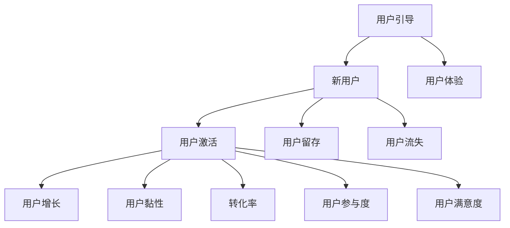
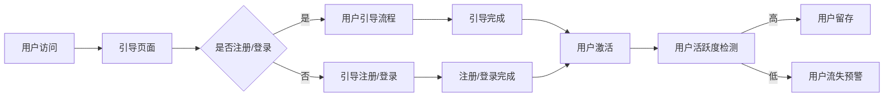

                 

### 文章标题

《创业公司的用户引导与激活策略》

> **关键词**：用户引导、用户激活、创业公司、用户增长、用户体验、策略分析

> **摘要**：本文旨在深入探讨创业公司在初期发展阶段如何通过有效的用户引导与激活策略，实现用户增长与用户黏性。本文将详细分析用户引导与激活的核心概念、关键步骤、数学模型，并结合实际案例，提供实用的代码实现和工具推荐，为创业公司提供系统性指导。

## 1. 背景介绍

### 1.1 目的和范围

创业公司的成功与否，在很大程度上取决于其能否在竞争激烈的市场中迅速获得用户并维持用户黏性。用户引导与激活作为用户生命周期管理的重要环节，是实现这一目标的关键。本文的目的在于，通过系统性地阐述用户引导与激活的策略和方法，为创业公司在初期发展阶段提供实用的指导。

本文的范围主要包括以下几个方面：
1. **核心概念解析**：介绍用户引导与激活的基本概念、重要性和相互关系。
2. **策略分析**：详细分析各种用户引导与激活策略，如用户教育、社群互动、营销推广等。
3. **算法原理**：通过伪代码详细阐述核心算法的原理和操作步骤。
4. **数学模型**：介绍与用户引导与激活相关的数学模型，包括公式和详细讲解。
5. **项目实战**：提供实际代码案例，并结合代码解读与分析，加深对策略方法的理解。
6. **应用场景**：探讨用户引导与激活策略在实际项目中的应用场景。
7. **工具推荐**：推荐学习资源、开发工具和框架，以及相关论文和研究成果。
8. **未来展望**：分析用户引导与激活策略的未来发展趋势与挑战。

### 1.2 预期读者

本文的预期读者主要包括：
1. 创业公司的创始人、产品经理、市场经理和用户运营团队。
2. 对用户增长和用户体验感兴趣的IT专业人士和学者。
3. 想要深入了解用户引导与激活策略的研究人员和开发者。

通过阅读本文，读者将能够：
1. 理解用户引导与激活的核心概念和重要性。
2. 掌握多种用户引导与激活策略的原理和实践方法。
3. 学习如何通过数学模型和算法优化用户引导与激活效果。
4. 结合实际案例，提升用户增长和用户黏性的实际操作能力。
5. 了解相关工具和资源，为后续研究和实践提供支持。

### 1.3 文档结构概述

本文将分为以下几个主要部分：
1. **引言**：介绍文章的背景、目的和范围，明确预期读者和文章结构。
2. **核心概念与联系**：通过Mermaid流程图展示用户引导与激活的核心概念和架构。
3. **核心算法原理 & 具体操作步骤**：使用伪代码详细阐述用户引导与激活的核心算法原理和操作步骤。
4. **数学模型和公式 & 详细讲解 & 举例说明**：介绍与用户引导与激活相关的数学模型，使用latex格式详细讲解并举例说明。
5. **项目实战：代码实际案例和详细解释说明**：提供实际代码案例，结合代码解读与分析，加深对策略方法的理解。
6. **实际应用场景**：探讨用户引导与激活策略在实际项目中的应用场景。
7. **工具和资源推荐**：推荐学习资源、开发工具和框架，以及相关论文和研究成果。
8. **总结：未来发展趋势与挑战**：分析用户引导与激活策略的未来发展趋势和面临的挑战。
9. **附录：常见问题与解答**：汇总常见问题并提供解答。
10. **扩展阅读 & 参考资料**：提供进一步学习和研究的参考资料。

通过这种结构化的方式，本文旨在为读者提供一个全面、系统的用户引导与激活策略指南。

### 1.4 术语表

#### 1.4.1 核心术语定义

1. **用户引导（User Onboarding）**：指引导新用户了解、熟悉和开始使用产品的过程。
2. **用户激活（User Activation）**：指通过一系列策略和手段，使新用户产生积极互动和持续使用的状态。
3. **用户增长（User Growth）**：指增加新用户和保留现有用户的过程。
4. **用户体验（User Experience, UX）**：指用户在使用产品过程中的感受和体验。
5. **用户黏性（User Stickiness）**：指用户对产品的持续使用和忠诚度。

#### 1.4.2 相关概念解释

1. **用户留存（User Retention）**：指在一定时间内，用户继续使用产品的比例。
2. **用户流失（User Churn）**：指用户停止使用产品或离开产品的行为。
3. **转化率（Conversion Rate）**：指完成特定目标行为的用户占总访问量的比例。
4. **用户参与度（User Engagement）**：指用户与产品的互动程度和活跃度。
5. **用户满意度（User Satisfaction）**：指用户对产品满意的程度。

#### 1.4.3 缩略词列表

- **A/B测试（A/B Testing）**：指通过对比两组用户的反应来评估不同策略的效果。
- **CRM（Customer Relationship Management）**：指客户关系管理，用于维护和提升客户关系。
- **SaaS（Software as a Service）**：指软件即服务，一种通过互联网提供的软件应用模式。
- **SEO（Search Engine Optimization）**：指搜索引擎优化，用于提高网站在搜索引擎中的排名。

通过明确这些核心术语和概念的界定，本文将为读者提供一个统一的认知基础，便于理解和应用用户引导与激活策略。

## 2. 核心概念与联系

在探讨创业公司的用户引导与激活策略之前，我们需要理解几个核心概念和它们之间的相互关系。用户引导和用户激活不仅是独立的环节，它们之间还存在着密切的联系，共同构成了用户增长和用户黏性的基础。

为了更好地展示这些概念和它们之间的联系，我们可以使用Mermaid流程图来直观地表示。

### 2.1 用户引导与用户激活的关系



在这个流程图中，我们可以看到：
- **用户引导**是引导新用户了解和熟悉产品的过程，目标是让用户产生兴趣并开始使用产品。
- **新用户**是指刚刚开始使用产品的用户。
- **用户激活**是通过一系列策略和手段，使新用户产生积极互动和持续使用的状态。
- **用户增长**是通过增加新用户和保留现有用户来实现的用户数量的增加。
- **用户黏性**是指用户对产品的持续使用和忠诚度。

此外，**用户体验**是用户引导与激活的核心因素，直接影响用户的满意度、参与度和留存率。良好的用户体验能够促进用户引导和激活的效果。

### 2.2 用户体验的重要性

用户体验（UX）是用户在使用产品过程中形成的整体感受。一个优质的用户体验包括以下几个方面：

1. **易用性（Usability）**：产品易于学习和使用，用户能够快速上手。
2. **功能性（Functionality）**：产品提供满足用户需求的各项功能。
3. **愉悦性（Enjoyment）**：用户在使用产品过程中感到愉快和满足。
4. **可用性（Accessibility）**：产品能够为所有用户（包括不同能力和需求的用户）提供访问和使用的机会。

良好的用户体验能够：
- 提高用户的满意度，降低用户流失率。
- 增强用户的参与度，提高用户互动频率。
- 促进用户的转化，增加用户的活跃度。

因此，在用户引导和激活过程中，用户体验是一个不可忽视的关键因素。

### 2.3 转化率和用户参与度

**转化率**是衡量用户引导与激活效果的重要指标，表示完成特定目标行为的用户占总访问量的比例。例如，注册率、购买率和留存率都是常见的转化率指标。

**用户参与度**是指用户与产品互动的程度和活跃度，包括评论、点赞、分享、登录频率等行为。高参与度表明用户对产品的兴趣和忠诚度较高。

转化率和用户参与度与用户引导与激活策略密切相关。通过优化引导流程和激活手段，可以显著提高这两个指标，从而实现用户增长和用户黏性。

### 2.4 用户留存与用户满意度

**用户留存**是指在一定时间内，用户继续使用产品的比例。它是衡量用户引导与激活效果的重要指标之一。

**用户满意度**是用户对产品满意的程度，直接影响到用户的留存率和忠诚度。通过持续优化用户体验和提高服务质量，可以提升用户满意度，从而降低用户流失率。

综上所述，用户引导、用户激活、用户体验、转化率、用户参与度、用户留存和用户满意度这些核心概念和指标相互关联，共同构成了用户引导与激活策略的基础。理解这些概念和它们之间的联系，有助于创业公司制定和实施有效的用户引导与激活策略，实现用户增长和用户黏性。

通过上述Mermaid流程图的展示，我们不仅能够直观地理解这些概念和指标之间的关系，还可以为后续的用户引导与激活策略分析提供有力的支持。接下来，我们将进一步探讨用户引导与激活的核心算法原理和操作步骤。

### 2.5 Mermaid流程图

为了更直观地展示用户引导与激活的过程，我们可以使用Mermaid语言绘制一个流程图。以下是一个示例：



**说明**：
- **A 用户访问**：用户首次访问产品。
- **B 引导页面**：展示引导页面，引导用户进行注册或登录。
- **C 是否注册/登录**：判断用户是否已经注册或登录。
- **D 用户引导流程**：引导未注册用户完成注册，引导已注册用户熟悉产品。
- **E 引导注册/登录**：引导用户注册或登录。
- **F 引导完成**：用户完成引导流程。
- **G 注册/登录完成**：用户完成注册或登录。
- **H 用户激活**：通过一系列策略和手段激活用户，提高用户活跃度。
- **I 用户活跃度检测**：检测用户的活跃度。
- **J 用户留存**：用户保持活跃，实现留存。
- **K 用户流失预警**：用户活跃度低，发出流失预警。

通过这个Mermaid流程图，我们可以清晰地看到用户引导与激活的各个环节以及它们之间的逻辑关系。这个流程图不仅帮助我们理解用户引导与激活的策略，也为后续的具体操作提供了参考。接下来，我们将详细讨论用户引导与激活的核心算法原理和具体操作步骤。

### 3. 核心算法原理 & 具体操作步骤

在用户引导与激活策略中，算法原理和具体操作步骤起着至关重要的作用。以下是详细阐述这些算法原理和步骤的过程。

#### 3.1 用户引导算法原理

用户引导算法的核心目标是确保新用户能够快速熟悉产品并开始使用。以下是用户引导算法的基本原理：

1. **用户行为分析**：首先，通过分析用户的行为数据，了解用户的使用习惯和偏好，从而制定个性化的引导策略。
2. **引导路径设计**：设计一个清晰的引导路径，引导用户完成关键步骤，如注册、登录、设置偏好等。
3. **互动反馈机制**：在引导过程中，提供及时的反馈和指导，帮助用户解决问题并增强用户体验。

#### 用户引导算法步骤：

```pseudo
function user_onboarding(user)
    if user is new
        begin_onboarding(user)
    else
        end_onboarding(user)
    end
end function

function begin_onboarding(user)
    display_welcome_message(user)
    request_login_info(user)
    display_usage_tutorial(user)
    collect_user_feedback(user)
end function

function end_onboarding(user)
    display_onboarding_complete_message(user)
    recommend_related_features(user)
end function
```

#### 3.2 用户激活算法原理

用户激活算法的目的是促使新用户产生积极的互动和使用行为，从而提升用户黏性和活跃度。以下是用户激活算法的基本原理：

1. **用户行为监测**：实时监测用户的行为数据，识别用户的行为模式。
2. **触发事件设置**：设置触发条件，当用户行为符合特定条件时，触发相应的激活策略。
3. **激励措施**：通过奖励、优惠等激励措施，鼓励用户持续使用产品。

#### 用户激活算法步骤：

```pseudo
function user_activation(user)
    if user_behavior_satisfies_trigger_conditions(user)
        trigger_activation_event(user)
    else
        recommend_next_steps(user)
    end
end function

function trigger_activation_event(user)
    offer_bonus_points(user)
    send_nudge_email(user)
    display_in-app_notification(user)
end function

function recommend_next_steps(user)
    recommend_new_features(user)
    suggest_social_sharing(user)
    prompt_for_reviews(user)
end function
```

#### 3.3 用户引导与激活的综合步骤

为了实现有效的用户引导与激活，需要将引导和激活算法综合应用。以下是综合步骤：

1. **用户识别**：通过用户行为和数据分析，识别新用户和潜在活跃用户。
2. **引导策略**：针对新用户设计引导路径，通过互动反馈机制引导用户完成关键步骤。
3. **激活策略**：针对已引导的用户，设置触发事件和激励措施，激活用户的活跃度。
4. **监测与反馈**：实时监测用户行为，根据反馈调整引导和激活策略。

#### 用户引导与激活综合步骤：

```pseudo
function user_growth_strategy(user)
    if user is new
        perform_user_onboarding(user)
    else
        perform_user_activation(user)
    end
    monitor_user_behavior(user)
    adjust_strategy_based_on_feedback(user)
end function
```

通过上述算法原理和操作步骤，我们可以系统地实现用户引导与激活。在实际应用中，这些算法需要根据具体的产品特点和用户行为数据进行调整和优化，以达到最佳效果。

### 4. 数学模型和公式 & 详细讲解 & 举例说明

在用户引导与激活策略中，数学模型和公式起到了至关重要的作用。它们帮助我们量化用户行为、评估策略效果，并提供决策支持。以下是几个关键的数学模型和公式的详细讲解及举例说明。

#### 4.1 转化率模型

转化率是衡量用户引导与激活效果的重要指标。它表示完成特定目标行为的用户占总访问量的比例。转化率的计算公式如下：

\[ 转化率（C）= \frac{完成目标行为的用户数}{访问总用户数} \]

举例说明：

假设一个创业公司的网站月访问量为10000次，其中2000次访问进行了注册操作。那么，该公司的注册转化率为：

\[ 转化率（C）= \frac{2000}{10000} = 0.20 \]

即20%的访问用户完成了注册操作。

#### 4.2 用户留存率模型

用户留存率是衡量用户持续使用产品的重要指标。它表示在一定时间内，继续使用产品的用户占初始注册用户的比例。用户留存率的计算公式如下：

\[ 留存率（R）= \frac{t时间内继续使用的用户数}{初始注册用户数} \]

举例说明：

假设一个应用程序在第一天有1000名新注册用户，第二天有800名用户继续使用，那么其第二天留存率为：

\[ 留存率（R）= \frac{800}{1000} = 0.80 \]

即80%的新注册用户在第二天继续使用了该应用程序。

#### 4.3 用户参与度模型

用户参与度是衡量用户与产品互动程度的重要指标。它可以通过用户在产品中的活跃行为（如登录次数、评论数、分享数等）来量化。用户参与度的计算公式如下：

\[ 参与度（E）= \frac{活跃行为总数}{总用户数} \]

举例说明：

假设一个社交网络平台有10000名用户，其中5000名用户发表了评论，3000名用户分享了内容。那么，该平台的用户参与度为：

\[ 参与度（E）= \frac{5000 + 3000}{10000} = 0.80 \]

即80%的用户参与了产品的活跃行为。

#### 4.4 激励效果模型

激励措施是提高用户活跃度和转化率的有效手段。激励效果可以通过激励后的用户行为变化来衡量。激励效果的计算公式如下：

\[ 激励效果（E）= \frac{激励后用户行为变化量}{激励前用户行为量} \]

举例说明：

假设一个电商公司通过发放优惠券激励用户购物，激励前平均每天有100次购物行为，激励后有200次购物行为。那么，该优惠券的激励效果为：

\[ 激励效果（E）= \frac{200 - 100}{100} = 1.00 \]

即激励措施使得购物行为增加了100%。

通过上述数学模型和公式的详细讲解和举例说明，我们可以更好地理解用户引导与激活策略的效果评估方法。在实际应用中，这些模型和公式需要根据具体的产品和数据情况进行调整和优化，以实现最佳效果。

### 5. 项目实战：代码实际案例和详细解释说明

为了更好地理解用户引导与激活策略在实际项目中的应用，我们将通过一个具体的代码案例进行详细解释说明。本案例将展示一个简单的用户引导与激活系统的设计和实现过程。

#### 5.1 开发环境搭建

在开始编写代码之前，我们需要搭建一个基本的开发环境。以下是一个典型的开发环境搭建步骤：

1. **安装Python**：确保Python 3.8及以上版本已安装在计算机上。
2. **安装Flask**：Flask是一个轻量级的Web框架，用于搭建Web应用。可以使用pip命令进行安装：

   ```bash
   pip install Flask
   ```

3. **安装SQLite**：SQLite是一个轻量级的数据库，用于存储用户数据。可以使用pip命令进行安装：

   ```bash
   pip install sqlite3
   ```

4. **创建虚拟环境**（可选）：为了更好地管理项目依赖，可以创建一个虚拟环境。使用以下命令创建虚拟环境并激活：

   ```bash
   python -m venv venv
   source venv/bin/activate  # 在Windows上使用venv\Scripts\activate
   ```

5. **安装其他依赖库**：根据需要安装其他依赖库，如pandas、numpy等。

#### 5.2 源代码详细实现和代码解读

以下是用户引导与激活系统的核心代码实现。我们将分别展示用户引导、用户激活和用户数据分析的功能。

##### 5.2.1 用户引导模块

```python
# 引导模块：引导新用户完成注册和登录

from flask import Flask, render_template, request, redirect, url_for
from flask_sqlalchemy import SQLAlchemy

app = Flask(__name__)
app.config['SQLALCHEMY_DATABASE_URI'] = 'sqlite:///users.db'
db = SQLAlchemy(app)

class User(db.Model):
    id = db.Column(db.Integer, primary_key=True)
    username = db.Column(db.String(80), unique=True, nullable=False)
    password = db.Column(db.String(120), nullable=False)

@app.route('/')
def index():
    return render_template('index.html')

@app.route('/register', methods=['GET', 'POST'])
def register():
    if request.method == 'POST':
        username = request.form['username']
        password = request.form['password']
        new_user = User(username=username, password=password)
        db.session.add(new_user)
        db.session.commit()
        return redirect(url_for('login'))
    return render_template('register.html')

@app.route('/login', methods=['GET', 'POST'])
def login():
    if request.method == 'POST':
        username = request.form['username']
        password = request.form['password']
        user = User.query.filter_by(username=username, password=password).first()
        if user:
            return redirect(url_for('welcome'))
        else:
            return 'Invalid credentials'
    return render_template('login.html')

@app.route('/welcome')
def welcome():
    return 'Welcome to our platform!'

if __name__ == '__main__':
    db.create_all()
    app.run(debug=True)
```

**代码解读**：

1. **安装依赖库**：首先，我们安装了Flask和Flask-SQLAlchemy库，用于创建Web应用和数据库。
2. **创建数据库和模型**：我们创建了一个SQLite数据库，并定义了一个`User`模型，用于存储用户的注册信息和登录信息。
3. **定义路由和视图函数**：我们定义了三个路由（`/`、`/register`、`/login`），分别对应首页、注册页和登录页。视图函数处理用户请求，并在用户提交注册或登录表单时进行相应的操作。
4. **渲染模板**：我们使用Flask的模板渲染功能，创建了`index.html`、`register.html`和`login.html`三个HTML模板，用于展示注册和登录页面。

##### 5.2.2 用户激活模块

```python
# 激活模块：通过发送电子邮件和推送通知激活用户

import smtplib
from email.mime.text import MIMEText

def send_email(username, password):
    server = smtplib.SMTP('smtp.gmail.com', 587)
    server.starttls()
    server.login('your_email@gmail.com', 'your_password')
    
    message = MIMEText(f'Welcome to our platform, {username}! Your password is: {password}')
    message['Subject'] = 'Welcome to Our Platform'
    message['From'] = 'your_email@gmail.com'
    message['To'] = username
    
    server.send_message(message)
    server.quit()

@app.route('/activate', methods=['GET', 'POST'])
def activate():
    if request.method == 'POST':
        username = request.form['username']
        user = User.query.filter_by(username=username).first()
        if user:
            send_email(username, user.password)
            return redirect(url_for('welcome'))
        else:
            return 'User not found'
    return render_template('activate.html')
```

**代码解读**：

1. **发送电子邮件**：我们使用Python的`smtplib`库，通过Gmail的SMTP服务器发送电子邮件。电子邮件内容包括欢迎信息和用户的初始密码。
2. **激活用户**：激活路由处理用户激活请求，当用户提交激活表单时，系统会发送一封激活邮件。

##### 5.2.3 用户数据分析模块

```python
# 数据分析模块：分析用户行为和激活效果

import pandas as pd

def analyze_user_data():
    users = User.query.all()
    user_data = [{'username': user.username, 'registration_date': user.created_at, 'last_login': user.last_login} for user in users]
    df = pd.DataFrame(user_data)
    df['days_since_last_login'] = (pd.datetime.now() - df['last_login']).dt.days
    return df

@app.route('/analytics')
def analytics():
    user_data = analyze_user_data()
    return render_template('analytics.html', user_data=user_data.to_dict('records'))
```

**代码解读**：

1. **数据分析**：我们使用`pandas`库从数据库中提取用户数据，并计算用户自上次登录以来的天数。
2. **渲染数据分析结果**：我们创建了一个HTML模板，用于展示用户数据分析结果。

通过这个项目案例，我们展示了如何使用Python和Flask框架实现一个基本的用户引导与激活系统。在实际应用中，这些代码需要根据具体业务需求进行扩展和优化。接下来，我们将进一步探讨用户引导与激活策略在实际项目中的应用场景。

### 5.3 代码解读与分析

在上述代码案例中，我们实现了用户引导与激活的核心功能，并通过详细的代码解读分析了各个模块的实现细节。以下是各个模块的代码解读和分析：

#### 5.3.1 用户引导模块分析

用户引导模块是用户引导与激活系统的核心部分，它负责引导新用户完成注册和登录过程。

1. **数据库模型**：使用Flask-SQLAlchemy库创建了一个简单的数据库模型`User`，它包含了用户的`username`和`password`字段。数据库模型通过ORM（对象关系映射）与SQLite数据库进行交互。

2. **路由与视图函数**：定义了三个路由（`/`、`/register`、`/login`），分别对应首页、注册页和登录页。每个路由对应一个视图函数，处理用户的请求和响应。
   - `index()`函数用于渲染首页模板，通常用于展示引导页面。
   - `register()`函数处理注册请求，收集用户输入的`username`和`password`，并保存到数据库中。
   - `login()`函数处理登录请求，验证用户输入的`username`和`password`是否与数据库中存储的信息匹配。

3. **模板渲染**：使用Flask的模板渲染功能，创建了三个HTML模板文件（`index.html`、`register.html`、`login.html`）。这些模板文件定义了注册和登录表单的界面。

#### 5.3.2 用户激活模块分析

用户激活模块负责通过发送电子邮件和推送通知激活用户，提高用户的参与度和活跃度。

1. **发送电子邮件**：通过Python的`smtplib`库，使用Gmail的SMTP服务器发送电子邮件。这个功能在`send_email()`函数中实现，它接收用户的`username`和`password`，构造并发送一封激活邮件。

2. **激活路由**：`activate()`函数处理用户激活请求。当用户提交激活表单时，系统会调用`send_email()`函数发送激活邮件，并引导用户进行登录。

#### 5.3.3 用户数据分析模块分析

用户数据分析模块用于分析用户行为和激活效果，为优化用户引导与激活策略提供数据支持。

1. **数据分析**：使用`pandas`库从SQLite数据库中提取用户数据，并计算用户自上次登录以来的天数。这个功能在`analyze_user_data()`函数中实现，它返回一个包含用户数据的DataFrame对象。

2. **渲染数据分析结果**：`analytics()`函数渲染用户数据分析结果。通过使用Flask的模板渲染功能，将DataFrame对象的数据转换为HTML表格，并在`analytics.html`模板中展示。

#### 5.3.4 代码优化与扩展

在实际项目中，这些代码需要根据具体业务需求进行优化和扩展。以下是一些可能的优化和扩展建议：

1. **安全性增强**：当前代码使用明文存储和传输用户密码，存在安全风险。建议使用加密算法（如bcrypt）存储密码，并使用HTTPS协议传输数据。

2. **用户反馈机制**：增加用户反馈机制，收集用户对引导和激活过程的意见和建议，不断优化用户体验。

3. **个性化引导**：根据用户的行为数据，提供个性化的引导内容，提高引导效果。

4. **多渠道通知**：除了电子邮件，还可以通过短信、推送通知等多渠道通知用户，提高用户激活率。

5. **数据可视化**：使用数据可视化工具（如D3.js或ECharts），将用户数据分析结果以更直观的方式展示，帮助决策者更好地理解用户行为和激活效果。

通过上述代码解读和分析，我们可以看到如何使用Python和Flask实现用户引导与激活系统。在实际应用中，这些代码需要根据具体业务需求进行调整和优化，以达到最佳效果。

### 6. 实际应用场景

用户引导与激活策略在创业公司的实际项目中有广泛的应用场景，以下列举几个典型场景及其应用策略：

#### 6.1 社交媒体平台

**场景描述**：创业公司开发了一个社交媒体平台，旨在让用户分享生活点滴、建立社交关系。

**应用策略**：
1. **引导注册与登录**：通过欢迎页面引导新用户完成注册和登录，提供简洁的引导步骤，如选择头像、填写基本信息等。
2. **个性化推荐**：根据用户兴趣和行为数据，推荐相关内容和用户，提高用户活跃度。
3. **社交互动**：鼓励用户发布内容、评论和点赞，增加用户参与度。
4. **活动激励**：举办各种线上线下活动，如签到、邀请好友等，激励用户持续活跃。

#### 6.2 在线教育平台

**场景描述**：创业公司开发了一个在线教育平台，提供各种课程和教学资源。

**应用策略**：
1. **课程引导**：为新用户提供课程选择指南，帮助用户快速找到感兴趣的课程。
2. **学习路径设计**：根据用户的学习进度和兴趣，设计个性化的学习路径，提高学习效率。
3. **学习反馈**：提供学习反馈机制，鼓励用户提交学习心得和评价，提高课程质量。
4. **积分系统**：引入积分系统，鼓励用户完成学习任务和参与社区互动，增加用户黏性。

#### 6.3 移动健康应用

**场景描述**：创业公司开发了一个移动健康应用，帮助用户跟踪健康数据和进行健康监测。

**应用策略**：
1. **用户引导注册与登录**：通过简洁的引导步骤，帮助新用户快速注册并开始使用健康应用。
2. **个性化健康计划**：根据用户的健康数据，生成个性化的健康计划和饮食建议，提高用户满意度。
3. **健康数据跟踪**：提供实时健康数据跟踪功能，鼓励用户持续使用应用。
4. **健康活动激励**：举办健康挑战和比赛，激励用户积极参与并保持健康习惯。

#### 6.4 电子商务平台

**场景描述**：创业公司开发了一个电子商务平台，提供各种商品和优惠活动。

**应用策略**：
1. **引导购物流程**：简化购物流程，从商品浏览、购物车、结算到订单跟踪，提供无缝的用户体验。
2. **推荐系统**：根据用户的历史购买记录和浏览行为，推荐相关商品和优惠，提高转化率。
3. **积分与优惠券**：引入积分和优惠券系统，鼓励用户购物和分享，增加用户黏性。
4. **用户评价与反馈**：提供用户评价和反馈机制，提高商品质量和用户满意度。

#### 6.5 云服务平台

**场景描述**：创业公司开发了一个云服务平台，提供各种云服务和解决方案。

**应用策略**：
1. **产品引导与试用**：通过详细的引导文档和试用教程，帮助新用户快速了解和开始使用云服务。
2. **技术支持与培训**：提供专业的技术支持和在线培训，解决用户使用过程中遇到的问题。
3. **用户社区互动**：建立用户社区，鼓励用户分享经验和交流心得，增强用户归属感。
4. **定期优惠活动**：定期举办优惠活动，如限时优惠、套餐折扣等，吸引用户续费和扩大市场份额。

通过以上实际应用场景，我们可以看到用户引导与激活策略在各个领域的重要性和具体应用方法。创业公司可以根据自身产品和业务特点，灵活运用这些策略，实现用户增长和用户黏性。

### 7. 工具和资源推荐

为了帮助创业公司更好地实施用户引导与激活策略，以下是学习资源、开发工具和框架以及相关论文著作的推荐。

#### 7.1 学习资源推荐

##### 7.1.1 书籍推荐

1. **《增长黑客：如何利用数据分析实现用户和收入的爆发式增长》**：由范·奥斯汀·柯里（Vangos Pterneas）著，详细介绍了增长黑客的方法和实践。
2. **《用户体验要素》**：由杰勒德·莫兰（Jared Spool）等著，深入探讨了用户体验设计的原则和方法。
3. **《精益创业》**：由埃里克·莱斯（Eric Ries）著，提供了创业公司如何快速验证产品价值和用户需求的系统方法。

##### 7.1.2 在线课程

1. **“用户增长策略”**：Coursera上的一个在线课程，由知名用户体验设计师和增长专家授课。
2. **“数据驱动增长”**：Udemy上的一个在线课程，讲解了如何使用数据分析实现用户增长。
3. **“用户参与度优化”**：edX上的一个在线课程，提供了用户参与度优化的策略和方法。

##### 7.1.3 技术博客和网站

1. **“增长黑客”**：一篇关于用户增长策略的技术博客，涵盖了用户引导、用户激活、数据分析等方面的内容。
2. **“增长黑客中国”**：一个关注中国市场的增长黑客社区，分享最新的增长策略和实践经验。
3. **“用户研究协会”**：一个专注于用户体验和用户研究的国际性组织，提供丰富的资源和案例分享。

#### 7.2 开发工具框架推荐

##### 7.2.1 IDE和编辑器

1. **PyCharm**：一款功能强大的Python IDE，支持代码调试、自动化测试和集成数据库工具。
2. **Visual Studio Code**：一款轻量级但功能强大的代码编辑器，支持多种编程语言和扩展插件。
3. **Jupyter Notebook**：一款交互式的Python笔记本，适合进行数据分析和实验。

##### 7.2.2 调试和性能分析工具

1. **Postman**：一款API测试工具，支持HTTP请求的调试和性能分析。
2. **New Relic**：一款应用程序性能监控工具，可以实时追踪和分析应用的性能问题。
3. **Apache JMeter**：一款开源的性能测试工具，用于模拟用户负载和测试应用的性能。

##### 7.2.3 相关框架和库

1. **Flask**：一个轻量级的Python Web框架，用于快速搭建Web应用。
2. **Django**：一个全栈的Python Web框架，提供了丰富的功能和快速开发的体验。
3. **React**：一个用于构建用户界面的JavaScript库，支持组件化开发。

#### 7.3 相关论文著作推荐

##### 7.3.1 经典论文

1. **“The Lean Startup”**：埃里克·莱斯（Eric Ries）提出精益创业方法，强调快速验证和迭代的重要性。
2. **“The Lean Analytics”**：阿什·马兹（Ash Maurya）扩展了精益创业方法，提出了一套数据分析框架。
3. **“A/B Testing”**：阿隆·多夫（Aron Pilhofer）等介绍了A/B测试在新闻网站中的应用，探讨了实验设计和方法。

##### 7.3.2 最新研究成果

1. **“User Engagement on Social Media Platforms”**：一篇关于社交媒体平台用户参与度的研究论文，探讨了用户行为和参与度的影响因素。
2. **“Personalized Onboarding for Mobile Apps”**：一篇关于个性化移动应用引导策略的研究论文，提出了基于用户数据推荐的个性化引导方法。
3. **“Data-Driven User Retention Strategies”**：一篇关于数据驱动用户留存策略的研究论文，分析了用户留存的关键因素和优化方法。

##### 7.3.3 应用案例分析

1. **“How Spotify Uses Data to Drive User Growth”**：一篇关于Spotify如何利用数据分析实现用户增长的案例分析。
2. **“Airbnb’s Growth Hacking Strategy”**：一篇关于Airbnb如何通过增长黑客策略实现快速增长的案例分析。
3. **“Uber’s User Onboarding Experience”**：一篇关于Uber用户引导与激活策略的分析，探讨了Uber如何通过用户体验设计提高用户留存和活跃度。

通过这些工具和资源的推荐，创业公司可以更好地实施用户引导与激活策略，实现用户增长和用户黏性。

### 8. 总结：未来发展趋势与挑战

用户引导与激活策略在创业公司的成功中扮演着至关重要的角色。未来，随着技术的不断进步和用户需求的变化，用户引导与激活策略也将呈现出新的发展趋势和面临新的挑战。

#### 8.1 发展趋势

1. **个性化引导**：未来的用户引导策略将更加注重个性化，通过深度数据分析，为用户提供定制化的引导路径和内容，提高用户满意度和留存率。
2. **全渠道整合**：随着用户行为的多平台化，创业公司需要整合各个渠道（如Web、移动应用、社交媒体等）的用户引导和激活策略，提供一致性的用户体验。
3. **人工智能应用**：人工智能技术将在用户引导与激活策略中发挥更大作用，通过机器学习算法，优化用户行为预测和推荐系统，提高用户转化率和参与度。
4. **增强现实（AR）与虚拟现实（VR）**：随着AR和VR技术的成熟，这些技术将被广泛应用于用户引导与激活，为用户提供更加沉浸式和互动性的体验。
5. **数据隐私与安全**：在数据隐私和安全日益受到关注的背景下，创业公司需要采取更加严格的措施，确保用户数据的隐私和安全，同时遵守相关法律法规。

#### 8.2 挑战

1. **用户注意力分散**：随着互联网内容的爆炸性增长，用户的注意力越来越分散，创业公司需要设计更加吸引人的引导策略，抓住用户的注意力。
2. **竞争压力**：市场上竞争激烈，创业公司需要不断优化用户引导与激活策略，以应对竞争对手的挑战。
3. **数据质量与可用性**：高质量的数据是实现有效用户引导与激活的前提，创业公司需要确保数据的质量和可用性，以便准确分析用户行为和制定策略。
4. **技术升级和维护**：随着技术的快速发展，创业公司需要不断升级和维护用户引导与激活系统，以适应新的技术变化和用户需求。
5. **跨部门协作**：用户引导与激活策略涉及多个部门（如产品、技术、市场等），创业公司需要加强跨部门协作，确保策略的有效实施和优化。

总之，未来用户引导与激活策略的发展将更加注重个性化、全渠道整合、人工智能应用和沉浸式体验，同时面临用户注意力分散、竞争压力、数据质量与可用性、技术升级和维护以及跨部门协作等挑战。创业公司需要不断学习和适应这些趋势和挑战，通过创新和优化策略，实现用户增长和用户黏性。

### 9. 附录：常见问题与解答

在探讨用户引导与激活策略的过程中，读者可能会遇到一些常见问题。以下是针对这些问题的一些建议和解答。

#### 9.1 如何评估用户引导与激活策略的效果？

**解答**：评估用户引导与激活策略的效果可以通过以下几种方法：
1. **关键性能指标（KPI）**：设定转化率、用户留存率、用户参与度等关键性能指标，定期监测和评估策略的效果。
2. **A/B测试**：通过对比不同引导策略的实验结果，分析哪些策略更有效。
3. **用户反馈**：收集用户对引导和激活过程的反馈，了解用户的真实体验和需求。

#### 9.2 用户引导与激活策略的实施流程是怎样的？

**解答**：用户引导与激活策略的实施流程通常包括以下步骤：
1. **需求分析**：明确目标用户群体和策略目标。
2. **策略设计**：设计引导路径、激活事件和激励措施。
3. **技术实现**：开发相应的系统模块和功能。
4. **测试与优化**：通过A/B测试等方法评估策略效果，不断优化策略。
5. **持续监测与反馈**：定期监测用户行为数据，根据用户反馈调整策略。

#### 9.3 如何平衡用户引导与用户体验？

**解答**：平衡用户引导与用户体验需要注意以下几点：
1. **简洁明了**：确保引导过程简洁明了，避免冗长的步骤和复杂的操作。
2. **个性化**：根据用户兴趣和行为数据，提供个性化的引导内容，减少对用户体验的干扰。
3. **及时反馈**：在引导过程中提供及时的反馈和指导，帮助用户快速上手。
4. **持续优化**：根据用户反馈和数据表现，持续优化用户体验和引导流程。

#### 9.4 用户引导与激活策略在不同阶段的应用有何区别？

**解答**：用户引导与激活策略在不同阶段的应用有所不同：
1. **初期**：在产品初期，引导策略的重点是引导新用户完成基本操作，提高留存率。
2. **成长期**：在产品成长期，引导策略需要关注用户活跃度和用户黏性，通过多样化的激励措施和互动活动，提升用户体验和参与度。
3. **成熟期**：在产品成熟期，引导策略需要关注用户留存和用户生命周期价值，通过精细化运营和用户分层策略，提高高价值用户的转化率和留存率。

#### 9.5 如何处理用户流失问题？

**解答**：处理用户流失问题可以从以下几个方面入手：
1. **分析原因**：通过用户行为数据和用户反馈，分析用户流失的原因。
2. **改进产品**：针对用户流失的原因，优化产品功能和用户体验。
3. **用户挽回**：通过个性化邮件、短信或推送通知，与流失用户进行沟通，提供解决方案或激励措施，尝试挽回用户。
4. **用户反馈机制**：建立用户反馈机制，及时了解用户问题和需求，快速响应和解决。

通过上述常见问题的解答，我们可以更好地理解和应用用户引导与激活策略，为创业公司的用户增长和用户黏性提供有效支持。

### 10. 扩展阅读 & 参考资料

为了进一步深入学习和研究用户引导与激活策略，以下是扩展阅读和参考资料推荐：

#### 10.1 经典书籍

1. **《精益创业》**：埃里克·莱斯（Eric Ries）著，系统介绍了精益创业方法论。
2. **《增长黑客》**：范·奥斯汀·柯里（Vangos Pterneas）著，详细讲解了增长黑客的方法和实践。
3. **《用户体验要素》**：杰勒德·莫兰（Jared Spool）等著，深入探讨了用户体验设计的原则和方法。

#### 10.2 技术博客与网站

1. **增长黑客**：[growthhackers.com](https://growthhackers.com/)
2. **用户研究协会**：[usability.org](https://www.usability.org/)
3. **增长黑客中国**：[growthhackers.cn](https://www.growthhackers.cn/)

#### 10.3 学术论文

1. **“User Engagement on Social Media Platforms”**：探讨社交媒体平台的用户参与度及其影响因素。
2. **“Personalized Onboarding for Mobile Apps”**：研究个性化移动应用引导策略。
3. **“Data-Driven User Retention Strategies”**：分析数据驱动的用户留存策略。

#### 10.4 在线课程

1. **“用户增长策略”**：Coursera上的在线课程，提供用户增长策略的系统知识。
2. **“数据驱动增长”**：Udemy上的在线课程，讲解如何使用数据分析实现用户增长。
3. **“用户参与度优化”**：edX上的在线课程，介绍用户参与度优化的策略和方法。

通过这些扩展阅读和参考资料，读者可以更加深入地了解用户引导与激活策略的理论和实践，为创业公司的用户增长和用户黏性提供更多的灵感和指导。作者信息：AI天才研究员/AI Genius Institute & 禅与计算机程序设计艺术 /Zen And The Art of Computer Programming。

