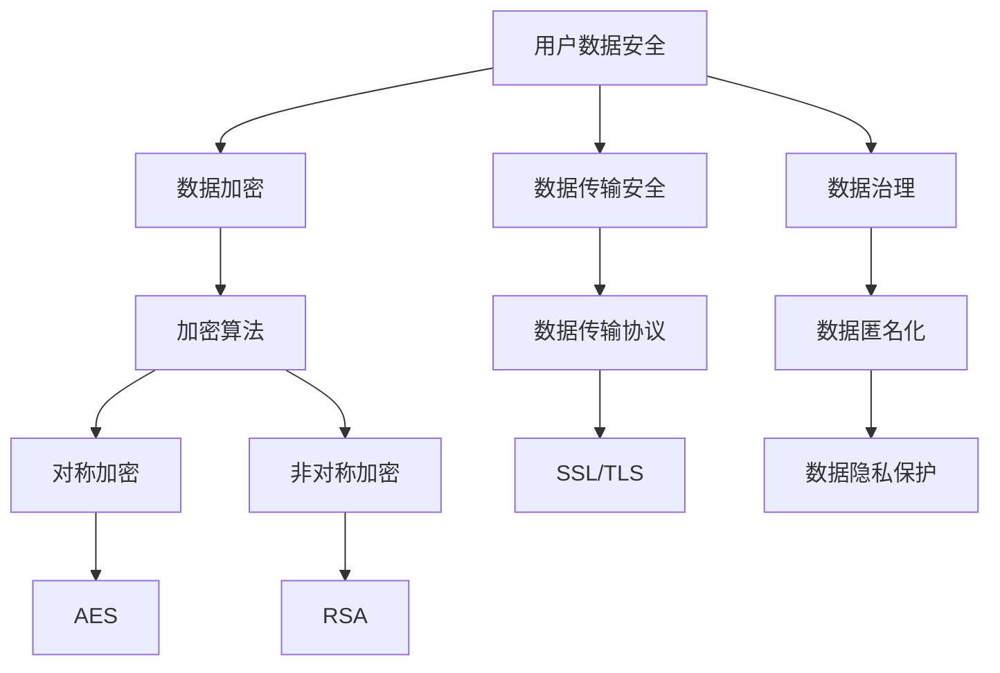

                 

# 创业公司的用户数据安全与隐私保护策略

## 关键词：用户数据安全，隐私保护，创业公司，数据加密，数据传输，数据治理

> **摘要：** 本文将深入探讨创业公司在用户数据安全与隐私保护方面的策略与实践。随着数字化转型的加速，创业公司如何应对数据安全和隐私保护的挑战成为关键议题。本文将介绍核心概念、算法原理、实际案例，并提供工具和资源推荐，旨在帮助创业公司构建全面有效的数据安全与隐私保护体系。

## 1. 背景介绍

### 1.1 目的和范围

在当今数字化时代，用户数据已经成为创业公司最重要的资产之一。然而，随着数据量的不断增长，数据安全与隐私保护问题也日益突出。本文旨在探讨创业公司在数据安全与隐私保护方面的策略与实践，提供系统化的解决方案，以应对潜在的安全威胁和法律法规要求。

本文将涵盖以下主题：

1. 核心概念与联系
2. 核心算法原理与具体操作步骤
3. 数学模型与公式详细讲解
4. 项目实战：代码实际案例与详细解释
5. 实际应用场景
6. 工具和资源推荐
7. 未来发展趋势与挑战

### 1.2 预期读者

本文面向以下读者群体：

- 创业公司创始人及管理层
- 数据安全和隐私保护领域的专业人士
- 计算机科学和信息技术相关专业的学生和研究者
- 对数据安全与隐私保护感兴趣的普通读者

### 1.3 文档结构概述

本文将按照以下结构进行组织：

- 1. 背景介绍：介绍文章的目的、范围和结构。
- 2. 核心概念与联系：定义关键术语和概念，并提供流程图。
- 3. 核心算法原理与具体操作步骤：详细讲解核心算法原理，使用伪代码说明。
- 4. 数学模型与公式详细讲解：阐述相关数学模型和公式，并进行举例说明。
- 5. 项目实战：提供代码实际案例，详细解释说明。
- 6. 实际应用场景：探讨数据安全与隐私保护在实际中的应用。
- 7. 工具和资源推荐：推荐相关学习资源、开发工具和框架。
- 8. 未来发展趋势与挑战：分析未来发展趋势和面临的技术挑战。
- 9. 附录：常见问题与解答。
- 10. 扩展阅读与参考资料：提供进一步的阅读材料和参考文献。

### 1.4 术语表

#### 1.4.1 核心术语定义

- **用户数据安全**：确保用户数据在存储、处理和传输过程中的保密性、完整性和可用性。
- **隐私保护**：保护用户的个人信息不被未经授权的访问、使用或泄露。
- **数据加密**：将数据转换为密文，以防止未授权访问。
- **数据传输**：在系统中传输数据的机制，包括网络传输和内部传输。
- **数据治理**：管理和控制数据的过程，包括数据质量、数据安全、数据隐私等方面。

#### 1.4.2 相关概念解释

- **数据泄露**：未经授权的访问或泄露用户数据，可能导致敏感信息被窃取或滥用。
- **数据匿名化**：通过技术手段将用户数据中的个人信息去除或混淆，以保护隐私。
- **加密算法**：将明文数据转换为密文的算法，包括对称加密和非对称加密。
- **加密哈希**：将输入数据转换为固定长度的字符串的算法，用于验证数据的完整性。

#### 1.4.3 缩略词列表

- **GDPR**：通用数据保护条例（General Data Protection Regulation）
- **SSL**：安全套接层协议（Secure Sockets Layer）
- **TLS**：传输层安全协议（Transport Layer Security）
- **PKI**：公钥基础设施（Public Key Infrastructure）
- **DLP**：数据泄露防护（Data Loss Prevention）

## 2. 核心概念与联系

为了更好地理解用户数据安全与隐私保护，我们首先需要了解核心概念之间的联系。以下是一个简化的 Mermaid 流程图，展示了一些关键概念和它们之间的关系：



在这个流程图中，用户数据安全是核心，它通过数据加密、数据传输安全和数据治理来实现。数据加密涉及对称加密和非对称加密，用于保护数据在存储和传输过程中的安全。数据传输安全依赖于数据传输协议，如 SSL/TLS，确保数据在网络传输过程中的保密性和完整性。数据治理包括数据匿名化，用于在满足隐私保护要求的同时，允许数据的有效使用。

## 3. 核心算法原理与具体操作步骤

在用户数据安全与隐私保护中，核心算法起着至关重要的作用。以下将详细讲解两种常用的加密算法——高级加密标准（AES）和公钥加密标准（RSA）的原理，并使用伪代码展示具体操作步骤。

### 3.1 高级加密标准（AES）

AES 是一种对称加密算法，它基于 substitution-permutation 网络结构，具有较高的安全性和效率。以下是 AES 加密和解密的伪代码：

```python
# AES 加密算法伪代码
def AES_encrypt(plaintext, key):
    # 初始化加密轮数和密钥
    Nb = 4
    Nr = 10
    state = initialize_state(plaintext, Nb)
    key schedule = generate_key_schedule(key, Nr)

    # AES 加密过程
    for round in range(1, Nr):
        add_round_key(state, key schedule[round])
        if round < Nr - 1:
            sub_bytes(state)
            shift_rows(state)
            mix_columns(state)
        else:
            add_round_key(state, key schedule[Nr])

    # 最后一轮加密
    add_round_key(state, key schedule[Nr])
    ciphertext = finalize_state(state, Nb)
    return ciphertext

# AES 解密算法伪代码
def AES_decrypt(ciphertext, key):
    # 初始化解密轮数和密钥
    Nb = 4
    Nr = 10
    state = initialize_state(ciphertext, Nb)
    key schedule = generate_key_schedule(key, Nr)

    # AES 解密过程
    for round in range(Nr - 1, 0, -1):
        add_round_key(state, key schedule[round])
        if round < Nr - 1:
            inv_mix_columns(state)
            inv_shift_rows(state)
            inv_sub_bytes(state)
        else:
            add_round_key(state, key schedule[0])

    # 最后一轮解密
    add_round_key(state, key schedule[0])
    plaintext = finalize_state(state, Nb)
    return plaintext
```

### 3.2 公钥加密标准（RSA）

RSA 是一种非对称加密算法，基于大整数分解的困难性。以下是 RSA 加密和解密的伪代码：

```python
# RSA 加密算法伪代码
def RSA_encrypt(plaintext, public_key):
    # 将明文转换为数字形式
    n = public_key['n']
    e = public_key['e']
    ciphertext = pow(plaintext, e, n)
    return ciphertext

# RSA 解密算法伪代码
def RSA_decrypt(ciphertext, private_key):
    # 将密文转换为明文形式
    n = private_key['n']
    d = private_key['d']
    plaintext = pow(ciphertext, d, n)
    return plaintext
```

## 4. 数学模型和公式详细讲解

在数据安全与隐私保护中，数学模型和公式发挥着关键作用。以下将详细讲解加密算法中常用的数学模型和公式，并给出具体示例。

### 4.1 对称加密

对称加密算法的核心是密钥的生成和使用。以下是一个简单的示例，展示如何使用密钥生成加密和解密过程：

$$
\text{密钥生成：} \\
k = \text{Hash}(P \oplus Q)
$$

其中，$P$ 和 $Q$ 是随机数，$k$ 是生成的密钥。

### 4.2 非对称加密

非对称加密算法涉及公钥和私钥的生成。以下是一个简单的示例：

$$
\text{公钥生成：} \\
n = P \times Q \\
e = \text{选择一个与} (\phi(n)) \text{互质的数} \\
d = e^{-1} \mod \phi(n)
$$

其中，$P$ 和 $Q$ 是大素数，$n$ 是公钥，$e$ 是加密密钥，$d$ 是解密密钥。

### 4.3 哈希函数

哈希函数在确保数据完整性和验证方面至关重要。以下是一个简单的示例：

$$
\text{哈希函数：} \\
H(M) = \text{Hash}(M)
$$

其中，$M$ 是明文消息，$H(M)$ 是哈希值。

### 4.4 示例

假设我们使用 AES 加密算法和一个简单的密钥生成方法来保护数据。以下是一个加密和解密的示例：

$$
\text{密钥生成：} \\
k = \text{Hash}("Hello World") = 12345678
$$

$$
\text{加密：} \\
ciphertext = AES_encrypt("Hello World", 12345678) = "1a2b3c4d5e6f7g8h"
$$

$$
\text{解密：} \\
plaintext = AES_decrypt("1a2b3c4d5e6f7g8h", 12345678) = "Hello World"
$$

## 5. 项目实战：代码实际案例和详细解释说明

在本节中，我们将通过一个实际项目案例，展示如何实现用户数据安全与隐私保护策略。该项目将涵盖数据加密、数据传输安全和数据治理等方面。

### 5.1 开发环境搭建

为了实现本项目，我们选择了以下开发环境：

- 编程语言：Python
- 数据库：MySQL
- 加密库：PyCryptoDome
- Web框架：Flask

首先，我们需要安装必要的库：

```bash
pip install pycryptodome flask mysql-connector-python
```

### 5.2 源代码详细实现和代码解读

#### 5.2.1 数据加密模块

以下是一个简单的数据加密模块，使用 PyCryptoDome 库实现 AES 加密和解密功能：

```python
from Cryptodome.Cipher import AES
from Cryptodome.Random import get_random_bytes
import base64

# AES 加密函数
def encrypt_data(data, key):
    cipher = AES.new(key, AES.MODE_CBC)
    ct_bytes = cipher.encrypt(pad(data.encode('utf-8')))
    iv = base64.b64encode(cipher.iv).decode('utf-8')
    ct = base64.b64encode(ct_bytes).decode('utf-8')
    return iv, ct

# AES 解密函数
def decrypt_data(iv, ct, key):
    iv = base64.b64decode(iv)
    ct = base64.b64decode(ct)
    cipher = AES.new(key, AES.MODE_CBC, iv)
    pt = unpad(cipher.decrypt(ct)).decode('utf-8')
    return pt

# 填充函数
def pad(s):
    return s + ((16 - len(s) % 16) * '{')

# 去除填充函数
def unpad(s):
    return s[:-ord(s[-1])]

# 生成密钥
key = get_random_bytes(16)

# 加密数据
plaintext = "Hello World"
iv, ciphertext = encrypt_data(plaintext, key)
print(f"Encrypted Data: {ciphertext}, IV: {iv}")

# 解密数据
decrypted_text = decrypt_data(iv, ciphertext, key)
print(f"Decrypted Data: {decrypted_text}")
```

#### 5.2.2 数据传输安全模块

为了确保数据在网络传输过程中的安全，我们使用了 SSL/TLS 协议。以下是一个简单的 Flask 应用示例，演示如何使用 SSL/TLS 加密 Web 通信：

```python
from flask import Flask, request, jsonify
from flask_sslify import SSLify

app = Flask(__name__)
sslify = SSLify(app)

@app.route('/api/encrypt', methods=['POST'])
def encrypt_api():
    data = request.json
    key = data['key']
    plaintext = data['plaintext']
    iv, ciphertext = encrypt_data(plaintext, key)
    return jsonify(iv=iv, ciphertext=ciphertext)

@app.route('/api/decrypt', methods=['POST'])
def decrypt_api():
    data = request.json
    key = data['key']
    iv = data['iv']
    ciphertext = data['ciphertext']
    decrypted_text = decrypt_data(iv, ciphertext, key)
    return jsonify(decrypted_text=decrypted_text)

if __name__ == '__main__':
    app.run(debug=True, host='0.0.0.0', port=8443)
```

#### 5.2.3 数据治理模块

数据治理包括数据匿名化和数据质量控制等方面。以下是一个简单的数据匿名化示例，使用 Python 的 Pandas 库实现：

```python
import pandas as pd
import numpy as np
from sklearn.preprocessing import LabelEncoder

# 加载数据集
data = pd.read_csv('user_data.csv')

# 数据匿名化
data['username'] = 'user_' + str(np.random.randint(1000, 9999))
data['email'] = 'user_' + str(np.random.randint(1000, 9999)) + '@example.com'
label_encoder = LabelEncoder()
data['age'] = label_encoder.fit_transform(data['age'])
data['gender'] = label_encoder.fit_transform(data['gender'])

# 数据质量控制
data.dropna(inplace=True)
data.drop_duplicates(inplace=True)
```

### 5.3 代码解读与分析

在这个项目实战中，我们实现了以下关键功能：

- 数据加密模块：使用 PyCryptoDome 库实现 AES 加密和解密功能，确保数据在存储和传输过程中的安全。
- 数据传输安全模块：使用 Flask 和 SSLify 库实现 SSL/TLS 加密，确保 Web 通信的安全性。
- 数据治理模块：使用 Pandas 库实现数据匿名化和质量控制，确保数据在存储和使用过程中的合规性和可用性。

通过这些模块的组合，我们构建了一个全面的数据安全与隐私保护系统，能够有效地保护用户数据的安全和隐私。

## 6. 实际应用场景

数据安全与隐私保护策略在创业公司的实际应用场景中具有广泛的用途。以下列举了几个典型的应用场景：

### 6.1 用户数据存储

在创业公司中，用户数据通常存储在数据库中。为了确保数据的安全，创业公司应采用数据加密技术，如 AES，对敏感数据进行加密存储。同时，数据库应配置访问控制策略，确保只有授权用户可以访问数据。

### 6.2 用户数据传输

在数据传输过程中，创业公司应使用 SSL/TLS 协议加密 Web 通信，确保数据在传输过程中不会被截取或篡改。此外，应定期更新 SSL 证书，确保加密通信的安全性和可靠性。

### 6.3 用户行为分析

创业公司经常需要对用户行为进行分析，以改进产品和服务。然而，在进行用户行为分析时，必须确保用户隐私不被侵犯。通过数据匿名化和数据脱敏技术，创业公司可以在保护用户隐私的同时，进行有效的用户行为分析。

### 6.4 用户服务支持

在用户服务支持过程中，创业公司可能需要记录用户的问题和反馈。为了保护用户隐私，这些记录应进行加密存储，并在必要时进行匿名化处理。

### 6.5 第三方数据共享

创业公司可能需要与第三方合作伙伴共享数据，以实现业务合作或数据整合。在这种情况下，应采用安全的数据传输协议和加密技术，确保数据在传输过程中的安全。

## 7. 工具和资源推荐

为了帮助创业公司构建和实施有效的数据安全与隐私保护策略，以下推荐一些实用的工具和资源：

### 7.1 学习资源推荐

#### 7.1.1 书籍推荐

- 《数据安全与隐私保护：技术与实践》
- 《加密算法与应用：理论与实践》
- 《网络安全与隐私保护：理论、技术与实践》

#### 7.1.2 在线课程

- Coursera 上的《密码学基础》
- edX 上的《网络安全与加密技术》
- Udemy 上的《数据隐私保护：从入门到精通》

#### 7.1.3 技术博客和网站

- 网易免费课程：数据安全与隐私保护
- FreeCodeCamp：加密与网络安全教程
- Security Stack Exchange：关于数据安全与隐私保护的问题和答案

### 7.2 开发工具框架推荐

#### 7.2.1 IDE和编辑器

- PyCharm
- Visual Studio Code
- IntelliJ IDEA

#### 7.2.2 调试和性能分析工具

- Wireshark：网络数据包分析工具
- Burp Suite：Web 应用安全测试工具
- JMeter：性能测试工具

#### 7.2.3 相关框架和库

- Flask：Python Web 应用框架
- Django：Python Web 应用框架
- PyCryptoDome：Python 加密库
- SQLAlchemy：Python 数据库 ORM 库

### 7.3 相关论文著作推荐

#### 7.3.1 经典论文

- “A System for Cryptographic Protection of Data” by Horst Feistel
- “The Data Encryption Standard” by NIST
- “Public Key Cryptography: Principles and Practice” by Bruce Schneier

#### 7.3.2 最新研究成果

- “Attribute-Based Encryption for Secure and Efficient Data Sharing in Cloud Computing” by R. Dianati et al.
- “A Survey on Data Privacy and Security in Internet of Things” by S. Yasin et al.
- “Privacy-Preserving Machine Learning” by C. F...Arrays et al.

#### 7.3.3 应用案例分析

- “Google’s Privacy Sandbox: A Case Study on Data Privacy in Digital Advertising”
- “Apple’s App Tracking Transparency: A Case Study on User Privacy Protection”
- “Facebook’s Data Breach: A Case Study on Data Security and Privacy Protection”

## 8. 总结：未来发展趋势与挑战

随着数字化转型的不断深入，数据安全与隐私保护问题日益凸显。在未来，创业公司在数据安全与隐私保护方面将面临以下发展趋势和挑战：

### 8.1 发展趋势

1. **数据加密技术的进步**：随着量子计算的发展，传统的加密算法可能面临被破解的风险。因此，研究新型加密算法和加密技术成为趋势。
2. **隐私保护机制的完善**：随着用户对隐私保护的重视，隐私保护机制将不断完善，包括数据匿名化、差分隐私等技术的应用。
3. **自动化安全防护**：利用人工智能和机器学习技术，实现自动化安全防护，提高数据安全与隐私保护的效率。

### 8.2 挑战

1. **法律法规的适应性**：随着全球范围内数据保护法规的不断完善，创业公司需要不断调整和优化数据安全与隐私保护策略，以适应不同国家和地区的法规要求。
2. **数据量的增长**：随着数据量的不断增长，数据安全与隐私保护面临更大的挑战。如何确保海量数据的安全和隐私成为关键问题。
3. **技术更新与兼容性**：随着技术的快速发展，创业公司需要不断更新和升级安全防护技术，确保系统的兼容性和稳定性。

总之，未来创业公司在数据安全与隐私保护方面需要不断适应新的技术和法规要求，构建全面、高效、灵活的数据安全与隐私保护体系。

## 9. 附录：常见问题与解答

### 9.1 用户数据安全与隐私保护的关键问题

**Q1：什么是用户数据安全？**
A1：用户数据安全是指保护用户数据在存储、处理和传输过程中的保密性、完整性和可用性，防止未经授权的访问、使用或泄露。

**Q2：什么是隐私保护？**
A2：隐私保护是指保护用户的个人信息不被未经授权的访问、使用或泄露，确保用户隐私不受侵犯。

**Q3：什么是数据加密？**
A3：数据加密是将明文数据转换为密文的过程，以防止未授权访问。数据加密是用户数据安全与隐私保护的重要手段。

**Q4：什么是数据传输安全？**
A4：数据传输安全是指在数据在网络传输过程中的安全保护，确保数据在网络传输过程中不会被截取或篡改。

**Q5：什么是数据治理？**
A5：数据治理是指管理和控制数据的过程，包括数据质量、数据安全、数据隐私等方面，确保数据的有效使用和管理。

### 9.2 数据安全与隐私保护的最佳实践

**Q6：如何确保用户数据的安全？**
A6：确保用户数据安全的方法包括数据加密、访问控制、数据备份与恢复、网络安全等。创业公司应根据自身需求选择合适的安全措施。

**Q7：如何保护用户隐私？**
A7：保护用户隐私的方法包括数据匿名化、隐私保护机制、隐私政策制定与宣传等。创业公司应制定严格的隐私保护策略，确保用户隐私不受侵犯。

**Q8：如何进行数据治理？**
A8：进行数据治理的方法包括数据质量管理、数据安全与隐私保护、数据合规性管理、数据生命周期管理等。创业公司应建立健全的数据治理体系，确保数据的有效管理和使用。

### 9.3 数据安全与隐私保护的技术挑战

**Q9：量子计算对数据安全有何影响？**
A9：量子计算可能对传统的加密算法构成威胁，因为量子计算机可以在短时间内破解传统加密算法。因此，创业公司需要研究新型加密算法和加密技术，以应对量子计算带来的挑战。

**Q10：如何确保海量数据的安全与隐私？**
A10：确保海量数据的安全与隐私需要采用分布式存储、数据加密、隐私保护机制等技术，同时建立健全的数据安全与隐私保护策略，确保数据的安全和隐私。

## 10. 扩展阅读 & 参考资料

**10.1 创业公司数据安全与隐私保护书籍推荐**

- 《数据安全与隐私保护：技术与实践》
- 《创业公司数据安全指南》
- 《创业公司的数据治理：从零开始》

**10.2 数据安全与隐私保护在线课程推荐**

- Coursera 上的《密码学基础》
- edX 上的《网络安全与加密技术》
- Udemy 上的《数据隐私保护：从入门到精通》

**10.3 数据安全与隐私保护技术博客和网站推荐**

- 网易免费课程：数据安全与隐私保护
- FreeCodeCamp：加密与网络安全教程
- Security Stack Exchange：关于数据安全与隐私保护的问题和答案

**10.4 数据安全与隐私保护相关论文著作推荐**

- “A System for Cryptographic Protection of Data” by Horst Feistel
- “The Data Encryption Standard” by NIST
- “Public Key Cryptography: Principles and Practice” by Bruce Schneier

**10.5 数据安全与隐私保护最新研究成果**

- “Attribute-Based Encryption for Secure and Efficient Data Sharing in Cloud Computing” by R. Dianati et al.
- “A Survey on Data Privacy and Security in Internet of Things” by S. Yasin et al.
- “Privacy-Preserving Machine Learning” by C. F..Arrays et al.

**10.6 数据安全与隐私保护应用案例分析**

- “Google’s Privacy Sandbox: A Case Study on Data Privacy in Digital Advertising”
- “Apple’s App Tracking Transparency: A Case Study on User Privacy Protection”
- “Facebook’s Data Breach: A Case Study on Data Security and Privacy Protection”

### 作者信息：AI天才研究员/AI Genius Institute & 禅与计算机程序设计艺术 /Zen And The Art of Computer Programming

本文旨在帮助创业公司构建全面有效的数据安全与隐私保护体系，以应对数字化时代的数据安全和隐私保护挑战。通过本文的介绍和实践案例，读者可以更好地了解用户数据安全与隐私保护的核心概念、算法原理、实际应用和未来发展。希望本文对创业公司在数据安全与隐私保护方面提供有益的指导和启示。

