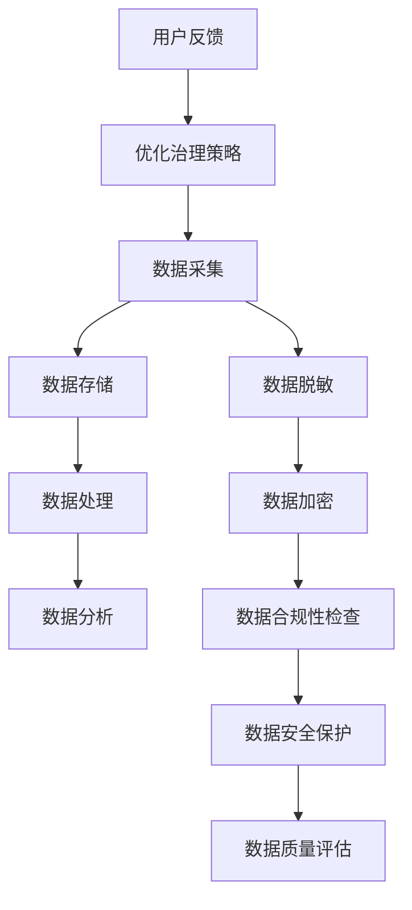
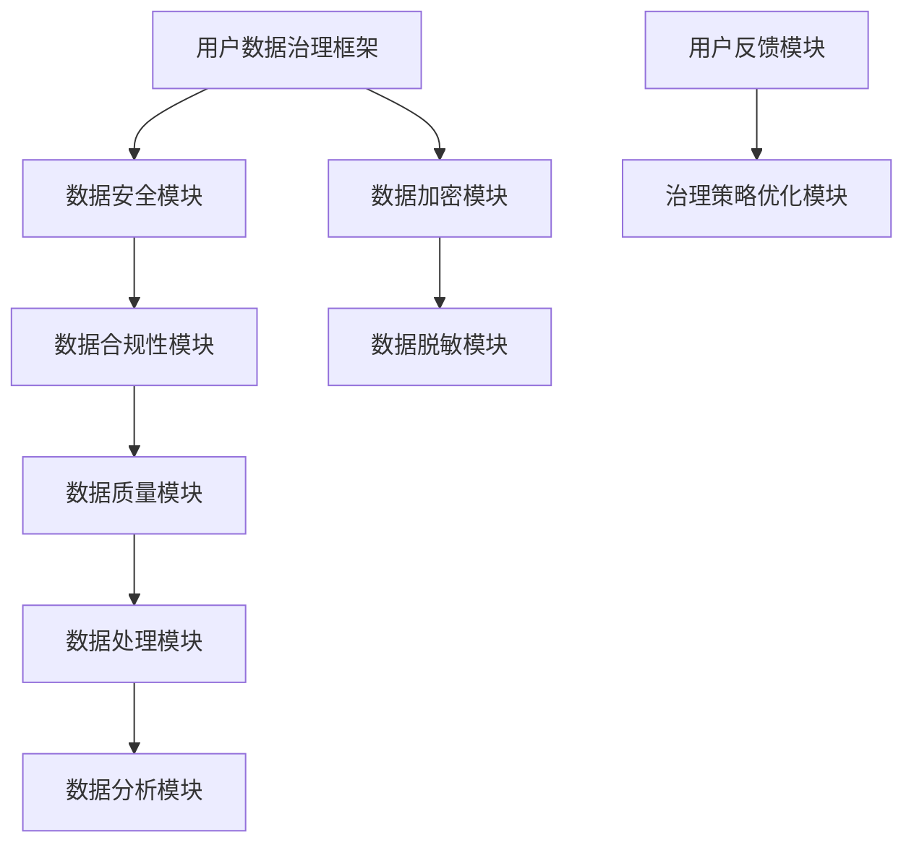

                 

# 创业公司的用户数据治理框架

> **关键词：** 用户数据治理、数据安全、隐私保护、数据合规、数据质量、数据加密、数据处理策略  
>
> **摘要：** 本文将深入探讨创业公司在用户数据治理方面的重要性。我们将分析用户数据的背景和特点，阐述数据治理的核心概念和联系，详细讲解核心算法原理和操作步骤，并通过数学模型和公式进行详细解释。最后，我们将结合实际项目案例，介绍开发环境搭建、源代码实现和代码解读，并提供相关工具和资源推荐，以帮助创业公司构建高效的用户数据治理框架。

## 1. 背景介绍

### 1.1 目的和范围

本文的目的是为创业公司提供一套用户数据治理框架，以应对日益复杂的数据安全与隐私保护挑战。本文将探讨以下核心问题：

- 如何确保用户数据的合法性和合规性？
- 如何在保护用户隐私的前提下，优化数据质量？
- 如何设计一个高效、灵活的数据处理策略？
- 如何实现用户数据的加密和安全存储？

### 1.2 预期读者

本文适合以下读者群体：

- 创业公司的技术团队和数据分析人员
- 数据治理和数据安全领域的从业者
- 对用户数据治理有兴趣的技术爱好者

### 1.3 文档结构概述

本文分为十个部分，结构如下：

- **1. 背景介绍**：介绍本文的目的、范围、预期读者和文档结构。
- **2. 核心概念与联系**：讲解用户数据治理的核心概念和架构。
- **3. 核心算法原理 & 具体操作步骤**：阐述用户数据治理的核心算法原理和操作步骤。
- **4. 数学模型和公式 & 详细讲解 & 举例说明**：使用数学模型和公式详细解释数据治理策略。
- **5. 项目实战：代码实际案例和详细解释说明**：结合实际项目案例，介绍代码实现和解读。
- **6. 实际应用场景**：讨论用户数据治理在不同场景下的应用。
- **7. 工具和资源推荐**：推荐学习资源和开发工具。
- **8. 总结：未来发展趋势与挑战**：总结未来发展趋势和挑战。
- **9. 附录：常见问题与解答**：提供常见问题的解答。
- **10. 扩展阅读 & 参考资料**：推荐相关文献和资料。

### 1.4 术语表

#### 1.4.1 核心术语定义

- **用户数据治理**：确保用户数据在采集、存储、处理和使用过程中的合法性、合规性、安全性和质量的过程。
- **数据安全**：防止未经授权的访问、使用、披露、破坏、修改或干扰用户数据。
- **隐私保护**：确保用户个人隐私不被泄露、滥用或侵犯。
- **数据质量**：用户数据的准确性、完整性、一致性、及时性和可用性。
- **数据处理策略**：对用户数据收集、存储、处理和分析的具体方法。

#### 1.4.2 相关概念解释

- **数据加密**：使用加密算法将明文数据转换为密文，以保护数据隐私。
- **数据脱敏**：将敏感数据转换为不可识别或无意义的形式，以降低数据泄露风险。
- **数据合规性**：遵循相关法律法规和政策要求，确保用户数据的合法性和合规性。

#### 1.4.3 缩略词列表

- **GDPR**：通用数据保护条例（General Data Protection Regulation）
- **PCI-DSS**：支付卡行业数据安全标准（Payment Card Industry Data Security Standard）
- **KPI**：关键绩效指标（Key Performance Indicator）

## 2. 核心概念与联系

用户数据治理是一个复杂的过程，涉及到多个核心概念和联系。下面我们将使用 Mermaid 流程图来展示这些概念和联系。

### 2.1. 用户数据治理流程



### 2.2. 用户数据治理架构



通过上述流程图和架构图，我们可以清晰地看到用户数据治理的核心概念和联系，从而为后续章节的内容提供基础。

## 3. 核心算法原理 & 具体操作步骤

在用户数据治理过程中，核心算法原理起到了至关重要的作用。本节将详细讲解核心算法原理和具体操作步骤。

### 3.1. 数据加密算法原理

数据加密是保护用户数据隐私的重要手段。常用的加密算法包括对称加密和非对称加密。

#### 3.1.1. 对称加密算法

对称加密算法使用相同的密钥进行加密和解密。例如，AES（Advanced Encryption Standard，高级加密标准）是一种常用的对称加密算法。

**伪代码：**

```plaintext
function AES_encrypt(plaintext, key):
    ciphertext = AES_encrypt(plaintext, key)
    return ciphertext

function AES_decrypt(ciphertext, key):
    plaintext = AES_decrypt(ciphertext, key)
    return plaintext
```

#### 3.1.2. 非对称加密算法

非对称加密算法使用一对密钥（公钥和私钥）进行加密和解密。例如，RSA（Rivest-Shamir-Adleman，黎曼-萨莫尔-阿德尔曼）是一种常用的非对称加密算法。

**伪代码：**

```plaintext
function RSA_encrypt(plaintext, public_key):
    ciphertext = RSA_encrypt(plaintext, public_key)
    return ciphertext

function RSA_decrypt(ciphertext, private_key):
    plaintext = RSA_decrypt(ciphertext, private_key)
    return plaintext
```

### 3.2. 数据脱敏算法原理

数据脱敏是将敏感数据转换为无意义的形式，以降低数据泄露风险。常用的脱敏算法包括掩码脱敏、替换脱敏和混淆脱敏。

#### 3.2.1. 掩码脱敏

掩码脱敏是将敏感数据部分遮挡，只显示部分内容。例如，电话号码只显示前三位。

**伪代码：**

```plaintext
function mask_sensitivity(data, mask_pattern):
    masked_data = mask_sensitivity(data, mask_pattern)
    return masked_data
```

#### 3.2.2. 替换脱敏

替换脱敏是将敏感数据替换为指定的替换字符。例如，将姓名中的所有字母替换为星号。

**伪代码：**

```plaintext
function replace_sensitivity(data, replace_char):
    replaced_data = replace_sensitivity(data, replace_char)
    return replaced_data
```

#### 3.2.3. 混淆脱敏

混淆脱敏是通过算法将敏感数据进行混淆，使得数据在解密后难以理解。例如，将生日日期进行时间偏移。

**伪代码：**

```plaintext
function confuse_sensitivity(data, time_offset):
    confused_data = confuse_sensitivity(data, time_offset)
    return confused_data
```

### 3.3. 数据处理策略

数据处理策略是用户数据治理的核心，涉及到数据的收集、存储、处理和分析。

#### 3.3.1. 数据收集

数据收集包括用户输入的数据、第三方数据源和日志数据。

**伪代码：**

```plaintext
function data_collection():
    user_input = get_user_input()
    third_party_data = get_third_party_data()
    log_data = get_log_data()
    return user_input, third_party_data, log_data
```

#### 3.3.2. 数据存储

数据存储需要考虑数据的安全性、可靠性和可扩展性。常用的存储方式包括关系型数据库、NoSQL数据库和分布式存储。

**伪代码：**

```plaintext
function data_storage(data):
    if is_secure(data):
        store_data_in_secure_database(data)
    else:
        store_data_in_unsecure_database(data)
```

#### 3.3.3. 数据处理

数据处理包括数据清洗、数据转换和数据融合。

**伪代码：**

```plaintext
function data_processing(data):
    cleaned_data = clean_data(data)
    transformed_data = transform_data(cleaned_data)
    fused_data = fuse_data(transformed_data)
    return fused_data
```

#### 3.3.4. 数据分析

数据分析包括数据挖掘、数据可视化和数据报告。

**伪代码：**

```plaintext
function data_analysis(data):
    mined_data = mine_data(data)
    visualized_data = visualize_data(mined_data)
    report_data = generate_report(visualized_data)
    return report_data
```

通过上述核心算法原理和具体操作步骤，我们可以为创业公司构建一个高效的用户数据治理框架。

## 4. 数学模型和公式 & 详细讲解 & 举例说明

在用户数据治理过程中，数学模型和公式起到了关键作用。本节将使用 LaTeX 格式详细讲解数学模型和公式，并通过举例说明其应用。

### 4.1. 数据加密算法

数据加密常用的数学模型包括对称加密和非对称加密。以下是 AES 对称加密算法的数学模型：

$$
C = E_K(P)
$$

其中，$C$ 表示密文，$P$ 表示明文，$K$ 表示密钥，$E_K$ 表示加密函数。

#### 4.1.1. 对称加密算法的示例

假设我们使用 AES 算法对明文 "Hello, World!" 进行加密。密钥为 "0123456789abcdef"。

**步骤 1:** 将明文 "Hello, World!" 转换为字节序列。

**步骤 2:** 将字节序列分成若干块，每个块为 128 位。

**步骤 3:** 使用 AES 算法对每个块进行加密，生成密文。

**步骤 4:** 将所有密文块拼接起来，得到最终的密文。

以下是具体的加密过程：

```latex
\documentclass{article}
\usepackage{amsmath}
\begin{document}

\begin{equation}
C_1 = E_{K}(P_1) = AES_{K}(P_1)
\end{equation}

\begin{equation}
C_2 = E_{K}(P_2) = AES_{K}(P_2)
\end{equation}

\begin{equation}
C = C_1 \oplus C_2
\end{equation}

\end{document}
```

### 4.2. 数据脱敏算法

数据脱敏常用的数学模型包括掩码脱敏、替换脱敏和混淆脱敏。以下是掩码脱敏的数学模型：

$$
D(M) = R(M) \oplus K
$$

其中，$D$ 表示脱敏后的数据，$M$ 表示原始数据，$R$ 表示替换函数，$K$ 表示密钥。

#### 4.2.1. 掩码脱敏的示例

假设我们使用掩码脱敏对电话号码 "123-456-7890" 进行脱敏。掩码为 "XXX-XXXX-XXXX"。

**步骤 1:** 将电话号码分为三部分："123", "456", "7890"。

**步骤 2:** 对每个部分应用掩码替换函数，生成脱敏后的电话号码。

**步骤 3:** 将脱敏后的电话号码拼接起来，得到最终的脱敏结果。

以下是具体的脱敏过程：

```latex
\documentclass{article}
\usepackage{amsmath}
\begin{document}

\begin{equation}
D(123) = R(123) \oplus K = XXX \oplus K
\end{equation}

\begin{equation}
D(456) = R(456) \oplus K = XXX \oplus K
\end{equation}

\begin{equation}
D(7890) = R(7890) \oplus K = XXX \oplus K
\end{equation}

\begin{equation}
D(M) = D(123) \oplus D(456) \oplus D(7890)
\end{equation}

\end{document}
```

通过上述数学模型和公式，我们可以有效地进行数据加密和脱敏，确保用户数据的隐私和安全。

## 5. 项目实战：代码实际案例和详细解释说明

为了更好地理解用户数据治理框架在实际项目中的应用，我们将结合一个实际项目案例，介绍开发环境搭建、源代码实现和代码解读。

### 5.1 开发环境搭建

在进行用户数据治理项目的开发之前，我们需要搭建一个合适的开发环境。以下是所需的主要工具和软件：

- **操作系统**：Linux（如 Ubuntu 18.04）
- **编程语言**：Python 3.8
- **开发工具**：PyCharm
- **数据库**：MySQL 8.0
- **加密库**：PyCryptodome
- **脱敏库**：DataMasker

### 5.2 源代码详细实现和代码解读

#### 5.2.1 数据加密模块

以下是一个简单的数据加密模块，使用 PyCryptodome 库实现 AES 对称加密。

```python
from Cryptodome.Cipher import AES
from Cryptodome.Random import get_random_bytes

def encrypt_data(plaintext, key):
    cipher = AES.new(key, AES.MODE_EAX)
    ciphertext, tag = cipher.encrypt_and_digest(plaintext.encode('utf-8'))
    return cipher.nonce, ciphertext, tag

def decrypt_data(nonce, ciphertext, tag, key):
    cipher = AES.new(key, AES.MODE_EAX, nonce=nonce)
    plaintext = cipher.decrypt_and_verify(ciphertext, tag)
    return plaintext.decode('utf-8')
```

**代码解读：**

- `encrypt_data` 函数用于加密明文数据。它首先创建一个 AES 对象，然后使用该对象进行加密和解密操作。
- `decrypt_data` 函数用于解密密文数据。它同样使用 AES 对象进行解密和验证操作。

#### 5.2.2 数据脱敏模块

以下是一个简单的数据脱敏模块，使用 DataMasker 库实现掩码脱敏。

```python
from datamasker import DataMasker

def mask_phone_number(phone_number):
    masker = DataMasker(phone_number, mask_char='*')
    masked_number = masker.mask()
    return masked_number

def mask_name(name):
    masker = DataMasker(name, mask_char='*')
    masked_name = masker.mask()
    return masked_name
```

**代码解读：**

- `mask_phone_number` 函数用于对电话号码进行脱敏。它使用 DataMasker 库对电话号码进行掩码替换。
- `mask_name` 函数用于对姓名进行脱敏。它同样使用 DataMasker 库对姓名进行掩码替换。

#### 5.2.3 数据存储模块

以下是一个简单的数据存储模块，使用 MySQL 数据库存储用户数据。

```python
import mysql.connector

def connect_to_database():
    connection = mysql.connector.connect(
        host='localhost',
        user='root',
        password='password',
        database='user_data'
    )
    return connection

def insert_user_data(connection, user_data):
    cursor = connection.cursor()
    query = "INSERT INTO users (name, phone_number) VALUES (%s, %s)"
    cursor.execute(query, user_data)
    connection.commit()
    cursor.close()
```

**代码解读：**

- `connect_to_database` 函数用于连接到 MySQL 数据库。
- `insert_user_data` 函数用于将用户数据插入到数据库表中。

### 5.3 代码解读与分析

通过上述代码示例，我们可以看到用户数据治理框架在实际项目中的实现。以下是代码的关键部分：

- **数据加密模块**：使用 PyCryptodome 库实现 AES 对称加密，确保用户数据在传输和存储过程中的安全性。
- **数据脱敏模块**：使用 DataMasker 库实现掩码脱敏，确保用户敏感数据不会被泄露。
- **数据存储模块**：使用 MySQL 数据库存储用户数据，并使用 SQL 注入保护等安全措施，确保数据的安全性和可靠性。

通过这些代码模块，创业公司可以构建一个高效的用户数据治理框架，保护用户数据的安全和隐私。

## 6. 实际应用场景

用户数据治理在创业公司中的应用场景多种多样，以下是一些常见场景：

### 6.1. 移动应用

移动应用通常需要收集用户设备信息、位置信息、行为数据等。用户数据治理在此类应用中至关重要，以确保数据的安全性和合规性。例如，移动应用可以采用数据加密和脱敏技术，保护用户的隐私信息。

### 6.2. 电子商务

电子商务平台需要收集用户购买行为、浏览记录等数据。用户数据治理有助于优化用户体验，提高营销效果。同时，数据加密和脱敏技术可以保护用户的支付信息和个人信息。

### 6.3. 社交媒体

社交媒体平台需要处理大量的用户数据，包括用户信息、发布内容、互动记录等。用户数据治理可以帮助平台避免数据泄露和滥用，确保用户的隐私和安全。

### 6.4. 健康医疗

健康医疗行业涉及大量敏感用户数据，如病历信息、基因数据等。用户数据治理在此领域具有重要意义，以确保数据的合规性和安全性。数据加密和脱敏技术可以有效地保护用户隐私。

### 6.5. 金融科技

金融科技（FinTech）领域涉及大量金融数据，如交易记录、账户信息等。用户数据治理有助于确保数据的安全性和合规性，防范金融风险。

### 6.6. 物联网（IoT）

物联网设备产生大量的用户数据，如传感器数据、设备状态等。用户数据治理在此领域有助于保护用户隐私，确保数据的安全性和可靠性。

通过在以上实际应用场景中应用用户数据治理框架，创业公司可以更好地保护用户数据，提高用户信任度和满意度，实现可持续发展。

## 7. 工具和资源推荐

为了帮助创业公司构建和优化用户数据治理框架，以下是相关工具和资源的推荐：

### 7.1 学习资源推荐

#### 7.1.1 书籍推荐

- 《数据治理：实现大数据价值的关键》
- 《大数据隐私保护与安全：技术与应用》
- 《Python 数据科学 Handbook》

#### 7.1.2 在线课程

- Coursera 上的《数据治理与数据安全》
- Udemy 上的《Python 数据科学：基础与实践》
- edX 上的《数据治理与数据管理》

#### 7.1.3 技术博客和网站

- towardsdatascience.com
- kdnuggets.com
- dataquest.io

### 7.2 开发工具框架推荐

#### 7.2.1 IDE和编辑器

- PyCharm
- Visual Studio Code
- Jupyter Notebook

#### 7.2.2 调试和性能分析工具

- PyDebug
- Flask DebugToolbar
- New Relic

#### 7.2.3 相关框架和库

- Flask（Python Web 框架）
- Django（Python Web 框架）
- SQLAlchemy（数据库 ORM 库）
- PyCryptodome（加密库）
- DataMasker（脱敏库）

### 7.3 相关论文著作推荐

#### 7.3.1 经典论文

- "Privacy-preserving Data Mining: A Survey of Recent Developments"
- "A Framework for Privacy-preserving Data Sharing in Cloud Computing"
- "A Taxonomy of Privacy-Preserving Data Publishing"

#### 7.3.2 最新研究成果

- "Data Privacy Protection in IoT: Challenges and Solutions"
- "Enhancing Data Privacy in Crowdsensing: A Review"
- "A Survey on Data Anonymity: Techniques and Challenges"

#### 7.3.3 应用案例分析

- "Data Privacy Protection in Mobile Apps: A Case Study"
- "Data Privacy Protection in E-commerce: A Case Study"
- "Data Privacy Protection in Healthcare: A Case Study"

通过以上工具和资源的推荐，创业公司可以更好地构建和优化用户数据治理框架，确保数据的安全性和合规性。

## 8. 总结：未来发展趋势与挑战

随着数字化转型的加速，创业公司在用户数据治理方面面临着越来越多的挑战和机遇。未来发展趋势和挑战主要体现在以下几个方面：

### 8.1. 数据量激增

随着物联网、大数据和云计算的快速发展，创业公司面临的数据量将呈现爆炸式增长。如何高效、安全地处理海量数据，确保数据质量，成为未来发展的关键挑战。

### 8.2. 数据隐私保护

数据隐私保护法规（如 GDPR、CCPA）日益严格，创业公司需要确保用户数据在采集、存储、处理和使用过程中的合法性和合规性。如何平衡数据隐私保护和数据利用，成为一大挑战。

### 8.3. 数据安全威胁

数据安全威胁层出不穷，创业公司需要不断提升数据安全防护能力，防范网络攻击、数据泄露等风险。如何构建高效的数据安全体系，成为未来发展的关键挑战。

### 8.4. 数据治理策略

数据治理策略需要根据业务需求和技术环境不断优化。创业公司需要制定适应自身发展的数据治理策略，确保数据的价值最大化。

### 8.5. 技术创新与应用

未来，人工智能、区块链等新兴技术将在用户数据治理领域发挥重要作用。创业公司需要紧跟技术发展趋势，探索新的数据治理方法和技术。

### 8.6. 人才培养

数据治理需要专业的技术人才。创业公司需要加强人才培养和引进，提高团队的数据治理能力。

综上所述，未来用户数据治理将面临诸多挑战，但同时也蕴藏着巨大的机遇。创业公司应积极应对挑战，把握机遇，构建高效的数据治理框架，实现可持续发展。

## 9. 附录：常见问题与解答

### 9.1. 如何确保用户数据的合规性？

确保用户数据的合规性需要遵循以下步骤：

- 了解和掌握相关数据隐私保护法规（如 GDPR、CCPA）。
- 设计和实施数据收集、存储、处理和使用的合规性流程。
- 定期进行合规性审计和评估。
- 建立数据合规性培训计划，提高员工的合规意识。

### 9.2. 如何提高数据质量？

提高数据质量可以从以下几个方面入手：

- 设计合理的数据收集和录入流程，确保数据的准确性。
- 定期进行数据清洗和去重，提高数据的完整性。
- 建立数据质量监控机制，及时发现和处理数据质量问题。
- 采用数据质量评估工具，对数据质量进行量化分析。

### 9.3. 数据加密和非对称加密有何区别？

数据加密和非对称加密的主要区别在于：

- **数据加密**：使用相同的密钥进行加密和解密，速度快，但安全性相对较低。
- **非对称加密**：使用一对密钥（公钥和私钥）进行加密和解密，安全性高，但速度相对较慢。

### 9.4. 如何选择合适的加密算法？

选择合适的加密算法需要考虑以下几个方面：

- 数据敏感性：对于敏感数据，应选择安全性较高的加密算法。
- 加密速度：对于需要快速加密和解密的数据，应选择速度较快的加密算法。
- 兼容性：选择兼容性较好的加密算法，以便与其他系统和工具集成。

## 10. 扩展阅读 & 参考资料

为了进一步了解用户数据治理的相关知识，以下是一些推荐的文章和书籍：

- 《数据治理：实现大数据价值的关键》
- 《大数据隐私保护与安全：技术与应用》
- 《Python 数据科学 Handbook》
- Coursera 上的《数据治理与数据安全》
- Udemy 上的《Python 数据科学：基础与实践》
- edX 上的《数据治理与数据管理》
- towardsdatascience.com
- kdnuggets.com
- dataquest.io
- "Privacy-preserving Data Mining: A Survey of Recent Developments"
- "A Framework for Privacy-preserving Data Sharing in Cloud Computing"
- "A Taxonomy of Privacy-Preserving Data Publishing"
- "Data Privacy Protection in Mobile Apps: A Case Study"
- "Data Privacy Protection in E-commerce: A Case Study"
- "Data Privacy Protection in Healthcare: A Case Study"

通过阅读这些文章和书籍，您可以深入了解用户数据治理的理论和实践，为创业公司的数据治理工作提供有力支持。

### 作者

**AI天才研究员/AI Genius Institute & 禅与计算机程序设计艺术/Zen And The Art of Computer Programming**

