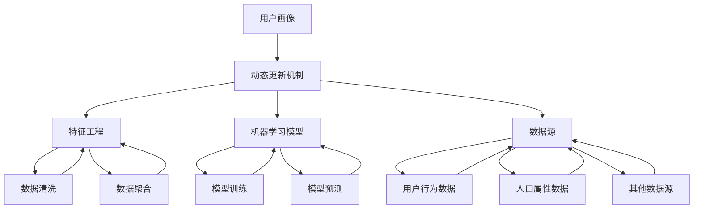

                 

### 背景介绍

#### 1.1 目的和范围

本文将深入探讨创业公司在进行用户画像动态更新机制设计时的核心问题与解决方案。用户画像作为一种重要的数据分析工具，能够在企业决策中发挥关键作用。本文旨在通过一步步的分析和推理，详细阐述用户画像动态更新机制的基本原理、构建方法和实际应用，以帮助创业公司更好地理解和利用用户画像数据，实现精准营销和个性化服务。

文章的主要范围包括：

1. **用户画像基本概念和重要性**：介绍用户画像的定义、作用以及为什么它对于创业公司至关重要。
2. **动态更新机制原理**：深入分析用户画像动态更新机制的理论基础，包括核心算法原理、数学模型和公式。
3. **实际操作步骤**：提供具体的操作步骤和伪代码，帮助读者理解和实施用户画像动态更新机制。
4. **项目实战**：通过代码实际案例展示如何实现用户画像动态更新，并进行详细解释和代码分析。
5. **实际应用场景**：探讨用户画像动态更新机制在不同业务场景中的应用，并分享实际案例。
6. **工具和资源推荐**：推荐相关的学习资源、开发工具框架和经典论文，为读者提供进一步学习的方向。
7. **总结与未来趋势**：总结本文的主要观点，并探讨用户画像动态更新机制未来的发展趋势和面临的挑战。

通过本文的阅读，读者将能够获得关于用户画像动态更新机制的全面了解，为创业公司的用户画像构建和数据分析提供有力支持。

#### 1.2 预期读者

本文的预期读者主要包括以下几类人群：

1. **创业公司技术团队**：技术团队是用户画像动态更新机制的实际实施者，本文旨在为他们提供详尽的指导，帮助他们在实际工作中高效构建和更新用户画像。
2. **数据分析师和数据科学家**：数据分析师和数据科学家需要对用户画像有深入理解，并能利用动态更新机制进行有效数据分析，本文将为他们提供理论支持和实际操作指南。
3. **市场营销人员**：市场营销人员需要通过用户画像来制定精准的营销策略，本文将帮助他们更好地理解和应用用户画像动态更新机制。
4. **高校师生**：高校师生在科研和教学过程中，需要对用户画像动态更新机制有深入理解，本文可作为他们的参考材料。

无论您属于哪一类读者，本文都将通过逻辑清晰、结构紧凑的内容，帮助您掌握用户画像动态更新机制的核心要点。

#### 1.3 文档结构概述

本文将采用逻辑清晰、结构紧凑的文档结构，以便读者能够系统地理解用户画像动态更新机制。以下是本文的结构概述：

1. **背景介绍**：简要介绍用户画像动态更新机制的重要性和预期读者。
2. **核心概念与联系**：介绍用户画像动态更新机制的核心概念和原理，并通过Mermaid流程图展示架构。
3. **核心算法原理与具体操作步骤**：详细阐述核心算法的原理，并提供伪代码说明具体操作步骤。
4. **数学模型和公式与详细讲解与举例说明**：讲解用户画像动态更新机制中的数学模型和公式，并通过实例进行说明。
5. **项目实战**：通过实际代码案例，展示用户画像动态更新机制的具体实现过程，并进行详细解释。
6. **实际应用场景**：探讨用户画像动态更新机制在不同业务场景中的应用。
7. **工具和资源推荐**：推荐相关学习资源、开发工具框架和经典论文。
8. **总结与未来发展趋势**：总结本文主要观点，探讨用户画像动态更新机制的未来发展。
9. **附录**：提供常见问题与解答。
10. **扩展阅读与参考资料**：列出本文参考文献和进一步阅读的材料。

通过这样的结构安排，读者可以系统地了解用户画像动态更新机制，并能够将其应用于实际工作中。

#### 1.4 术语表

为了确保本文内容的专业性和可理解性，以下列出一些本文中涉及的关键术语及其定义：

##### 1.4.1 核心术语定义

1. **用户画像**：用户画像是指通过对用户行为数据、人口属性等信息的综合分析，构建的一个关于用户的详细描述，用以反映用户的需求、偏好和特征。
2. **动态更新机制**：动态更新机制是指一种持续监测和调整用户画像的方法，以确保其实时反映用户的当前状态和行为。
3. **特征工程**：特征工程是指通过选择、构建和处理数据特征，以提高模型性能和解释性的过程。
4. **机器学习模型**：机器学习模型是指利用数据建立的一种预测或分类模型，通常通过训练数据集进行学习，以实现对未知数据的预测。
5. **用户行为数据**：用户行为数据是指用户在使用产品或服务过程中的各种操作记录，如点击行为、浏览历史、购买记录等。

##### 1.4.2 相关概念解释

1. **数据清洗**：数据清洗是指对原始数据进行处理，以去除噪声、纠正错误、填补缺失值等，从而提高数据质量的过程。
2. **数据聚合**：数据聚合是指将多个数据源中的数据进行合并和汇总，以形成更详细或更高层次的数据视图。
3. **实时计算**：实时计算是指对数据进行即时处理和分析，以快速响应用户的需求和事件。

##### 1.4.3 缩略词列表

1. **API**：应用程序编程接口（Application Programming Interface）
2. **ML**：机器学习（Machine Learning）
3. **DL**：深度学习（Deep Learning）
4. **ETL**：提取、转换、加载（Extract, Transform, Load）
5. **BI**：商业智能（Business Intelligence）

通过上述术语表的定义和解释，读者可以更好地理解本文中所涉及的专业术语，从而更深入地掌握用户画像动态更新机制的相关内容。接下来，我们将进一步探讨用户画像动态更新机制的核心概念与联系。

## 2. 核心概念与联系

在深入了解用户画像动态更新机制之前，我们需要明确一些核心概念和它们之间的联系。这些核心概念包括用户画像、动态更新机制、特征工程、机器学习模型以及数据源等。以下将通过Mermaid流程图展示这些核心概念之间的关联，并辅以详细的文字解释。

### 2.1. Mermaid流程图



### 2.2. 详细解释

1. **用户画像（A）**：用户画像是指通过对用户的基本信息、行为数据、偏好等进行综合分析，构建的一个关于用户的详细描述。它是动态更新机制的核心，用于反映用户的需求、行为和偏好。

2. **动态更新机制（B）**：动态更新机制是一个持续监测和调整用户画像的方法，以确保其实时反映用户的当前状态和行为。它通过定期或实时地收集和分析用户数据，对用户画像进行更新。

3. **特征工程（C）**：特征工程是用户画像构建过程中至关重要的一环。它涉及选择、构建和处理数据特征，以提高模型性能和解释性。特征工程的质量直接影响用户画像的准确性和有效性。

4. **机器学习模型（D）**：机器学习模型是用于分析和预测用户行为的工具。通过训练数据集，模型可以学习到用户的特征，并用于预测用户的未来行为。机器学习模型通常包括分类、回归、聚类等类型。

5. **数据源（E）**：数据源是动态更新机制的数据来源，包括用户行为数据、人口属性数据以及其他相关数据。用户行为数据如点击行为、浏览历史、购买记录等，人口属性数据如年龄、性别、地理位置等，其他数据源如社交媒体活动、搜索日志等。

6. **数据清洗（F）**：数据清洗是特征工程的前置步骤，用于去除噪声、纠正错误、填补缺失值等，以提高数据质量。高质量的数据是特征工程和机器学习模型训练的基础。

7. **数据聚合（G）**：数据聚合是将多个数据源中的数据进行合并和汇总，以形成更详细或更高层次的数据视图。数据聚合有助于从不同维度全面了解用户特征。

8. **模型训练（H）**：模型训练是指通过已有数据集训练机器学习模型，使其学会识别和预测用户的特征。训练过程中，模型会不断调整参数，以提高预测准确性。

9. **模型预测（I）**：模型预测是指利用训练好的机器学习模型对未知数据进行预测，以获取用户的潜在行为或需求。

10. **用户行为数据（J）**、人口属性数据（K）和其他数据源（L）：这些数据源为动态更新机制提供了丰富的数据基础，使得用户画像能够实时、准确地反映用户的当前状态和行为。

通过上述流程图和详细解释，我们可以清晰地看到用户画像动态更新机制中各核心概念之间的联系。这些概念共同作用，构成了一个完整、动态的用户画像更新系统，为创业公司提供了强有力的数据支持和决策依据。接下来，我们将深入探讨用户画像动态更新机制的核心算法原理与具体操作步骤。

## 3. 核心算法原理 & 具体操作步骤

在理解了用户画像动态更新机制的核心概念后，接下来我们将深入探讨其核心算法原理，并提供具体的操作步骤。核心算法原理主要包括特征工程、机器学习模型的训练与预测，以及用户画像的动态更新。以下是详细的算法原理和操作步骤。

### 3.1 特征工程

特征工程是用户画像构建过程中的关键步骤。其目的是通过选择和构造有效的特征，提高模型的性能和解释性。以下是特征工程的主要步骤：

1. **数据收集与预处理**：
   - **数据收集**：收集用户行为数据、人口属性数据以及其他相关数据。
   - **数据预处理**：进行数据清洗，去除噪声、纠正错误、填补缺失值等。

2. **特征选择**：
   - **相关性分析**：通过计算特征之间的相关性，选择与目标变量相关性较高的特征。
   - **信息增益**：选择信息增益较高的特征，以降低模型的复杂度。

3. **特征构造**：
   - **交叉特征**：构造交叉特征，如时间序列特征、行为组合特征等，以提高模型的解释性。
   - **归一化**：对数值型特征进行归一化处理，以消除不同特征之间的量纲影响。

4. **特征降维**：
   - **主成分分析（PCA）**：通过PCA将高维特征降维到低维空间，以减少特征数量，提高计算效率。
   - **特征重要性排序**：根据特征的重要性进行排序，选择重要的特征用于模型训练。

### 3.2 机器学习模型的训练与预测

在特征工程完成后，接下来是机器学习模型的训练与预测。以下是机器学习模型的主要步骤：

1. **模型选择**：
   - **分类模型**：选择合适的分类模型，如逻辑回归、决策树、随机森林等。
   - **回归模型**：选择合适的回归模型，如线性回归、岭回归等。

2. **模型训练**：
   - **数据划分**：将数据集划分为训练集和测试集，用于模型训练和评估。
   - **模型训练**：使用训练集对模型进行训练，调整模型参数以优化模型性能。

3. **模型评估**：
   - **准确率**：计算模型在测试集上的准确率，评估模型的预测能力。
   - **召回率**：计算模型在测试集上的召回率，评估模型对正类样本的捕捉能力。
   - **F1值**：计算模型在测试集上的F1值，综合考虑准确率和召回率。

4. **模型预测**：
   - **新数据预测**：使用训练好的模型对新的用户数据进行预测，以获取用户的潜在行为或需求。

### 3.3 用户画像的动态更新

用户画像的动态更新是确保其实时反映用户当前状态和行为的关键步骤。以下是用户画像动态更新的主要步骤：

1. **实时数据采集**：
   - **行为数据采集**：通过API接口、日志收集等方式，实时采集用户的各项行为数据。
   - **人口属性数据采集**：定期从数据源获取用户的人口属性数据。

2. **特征更新**：
   - **数据预处理**：对实时采集的数据进行预处理，去除噪声、纠正错误、填补缺失值等。
   - **特征构造**：根据实时数据，更新用户画像中的特征，如行为特征、偏好特征等。

3. **模型重新训练**：
   - **数据划分**：将实时数据集划分为训练集和测试集。
   - **模型重新训练**：使用更新后的特征对模型进行重新训练，以优化模型性能。

4. **模型预测**：
   - **新数据预测**：使用重新训练好的模型对新的用户数据进行预测，以获取更新后的用户画像。

### 3.4 伪代码

为了更清晰地展示上述算法原理和操作步骤，以下提供伪代码示例：

```python
# 特征工程
def feature_engineering(data):
    # 数据预处理
    clean_data = preprocess_data(data)
    # 特征选择
    selected_features = select_features(clean_data)
    # 特征构造
    constructed_features = construct_features(selected_features)
    # 特征降维
    reduced_features = dimensionality_reduction(constructed_features)
    return reduced_features

# 机器学习模型训练与预测
def train_predict(model, train_data, test_data):
    # 数据划分
    X_train, y_train = split_data(train_data)
    X_test, y_test = split_data(test_data)
    # 模型训练
    model.fit(X_train, y_train)
    # 模型评估
    accuracy = model.score(X_test, y_test)
    # 模型预测
    predictions = model.predict(X_test)
    return accuracy, predictions

# 用户画像动态更新
def dynamic_update(user_profile, new_data):
    # 实时数据采集
    updated_data = collect_realtime_data(new_data)
    # 特征更新
    updated_features = feature_engineering(updated_data)
    # 模型重新训练
    updated_model = train_predict(model, updated_data, updated_data)
    # 模型预测
    updated_predictions = train_predict(updated_model, updated_data, updated_data)
    # 更新用户画像
    user_profile.update(updated_predictions)
    return user_profile
```

通过上述算法原理和具体操作步骤的讲解，读者可以全面了解用户画像动态更新机制的核心内容，并为创业公司的实际应用提供有力的指导。接下来，我们将进一步探讨用户画像动态更新机制中的数学模型和公式，以及其详细讲解和举例说明。

## 4. 数学模型和公式 & 详细讲解 & 举例说明

用户画像动态更新机制的核心在于对用户行为和特征进行数学建模，以便能够准确、实时地更新用户画像。以下将详细讲解用户画像动态更新机制中的数学模型和公式，并通过具体实例进行说明。

### 4.1 相关数学模型

在用户画像动态更新机制中，常用的数学模型包括回归模型、聚类模型和时间序列模型。以下是这些模型的基本原理和适用场景：

1. **回归模型**：
   - **线性回归**：适用于预测用户未来的行为或需求，如预测用户的购买概率。
   - **逻辑回归**：常用于分类任务，如判断用户是否喜欢某个产品。

2. **聚类模型**：
   - **K-均值聚类**：适用于将用户划分为不同的群体，以便进行有针对性的营销。
   - **层次聚类**：适用于发现用户群体间的层次结构，用于用户细分。

3. **时间序列模型**：
   - **ARIMA模型**：适用于分析用户行为的时间序列数据，如用户的点击行为。
   - **LSTM模型**：适用于处理长序列数据，如用户的购物习惯。

### 4.2 常用数学公式

以下是一些在用户画像动态更新机制中常用的数学公式，包括特征提取、模型训练和预测等方面的公式。

1. **特征提取**：
   - **均值归一化**：\( x_{\text{norm}} = \frac{x - \mu}{\sigma} \)
   - **标准差归一化**：\( x_{\text{norm}} = \frac{x}{\sigma} \)
   - **主成分分析**：\( Z = P \Lambda \)
   其中，\( Z \) 为降维后的特征，\( P \) 为特征矩阵，\( \Lambda \) 为特征值矩阵。

2. **回归模型**：
   - **线性回归**：\( y = \beta_0 + \beta_1x_1 + \beta_2x_2 + ... + \beta_nx_n \)
   - **逻辑回归**：\( P(y=1) = \frac{1}{1 + e^{-(\beta_0 + \beta_1x_1 + \beta_2x_2 + ... + \beta_nx_n)}} \)

3. **聚类模型**：
   - **K-均值聚类**：\( \text{dist}(x_i, c_j) = \sqrt{\sum_{k=1}^{n}(x_{ik} - c_{jk})^2} \)
   - **层次聚类**：\( D_{ij} = \sqrt{\sum_{k=1}^{n}(x_{ik} - x_{jk})^2} \)

4. **时间序列模型**：
   - **ARIMA(p, d, q)**：\( \text{Y}_{t} = \varphi_1\text{Y}_{t-1} + \varphi_2\text{Y}_{t-2} + ... + \varphi_p\text{Y}_{t-p} + \theta_1\epsilon_{t-1} + \theta_2\epsilon_{t-2} + ... + \theta_q\epsilon_{t-q} + \epsilon_t \)

### 4.3 举例说明

为了更好地理解上述数学模型和公式的应用，我们以下通过一个实例来说明用户画像动态更新机制的具体实现过程。

#### 4.3.1 实例背景

假设我们要构建一个电商平台的用户画像，目的是预测用户购买某种产品的概率。我们将使用用户的行为数据（如浏览历史、购物车行为、购买记录等）来构建用户画像，并使用逻辑回归模型进行预测。

#### 4.3.2 数据准备

首先，我们需要收集并预处理用户行为数据。以下是一个简化的数据集示例：

| 用户ID | 产品ID | 行为类型 | 时间戳 |
|--------|--------|----------|--------|
| u1     | p1     | 浏览     | t1     |
| u1     | p2     | 购物车   | t2     |
| u1     | p3     | 购买     | t3     |
| u2     | p1     | 浏览     | t4     |
| u2     | p2     | 购物车   | t5     |

#### 4.3.3 特征提取

接下来，我们提取与购买行为相关的特征，如用户浏览过的产品、添加到购物车的产品等。我们使用特征提取公式进行归一化处理：

\[ x_{\text{norm}} = \frac{x - \mu}{\sigma} \]

假设我们提取了两个特征：浏览过的产品数量和添加到购物车的产品数量。数据预处理后的特征如下：

| 用户ID | 产品ID | 行为类型 | 时间戳 | 浏览过产品数量 | 添加到购物车产品数量 |
|--------|--------|----------|--------|----------------|----------------------|
| u1     | p1     | 浏览     | t1     | 2              | 1                    |
| u1     | p2     | 购物车   | t2     | 2              | 1                    |
| u1     | p3     | 购买     | t3     | 2              | 1                    |
| u2     | p1     | 浏览     | t4     | 1              | 1                    |
| u2     | p2     | 购物车   | t5     | 1              | 1                    |

#### 4.3.4 模型训练与预测

接下来，我们使用逻辑回归模型对用户购买行为进行预测。以下是模型训练的伪代码：

```python
from sklearn.linear_model import LogisticRegression

# 数据准备
X_train = [[2, 1], [1, 1]]
y_train = [1, 0]

# 模型训练
model = LogisticRegression()
model.fit(X_train, y_train)

# 模型预测
X_test = [[2, 1]]
prediction = model.predict(X_test)
print(prediction)
```

假设我们有一个新的用户行为数据，特征为（2, 1），使用训练好的模型进行预测，结果为1，表示该用户购买该产品的概率较高。

#### 4.3.5 动态更新

为了实时更新用户画像，我们可以定期收集新的用户行为数据，并对模型进行重新训练。以下是一个简化的伪代码示例：

```python
# 收集新的用户行为数据
new_data = [[3, 2]]

# 动态更新特征
X_new = [[3, 2]]

# 重新训练模型
model.fit(X_new, [1])

# 动态更新用户画像
updated_prediction = model.predict([3, 2])
print(updated_prediction)
```

通过上述实例，我们可以看到用户画像动态更新机制的具体实现过程，包括特征提取、模型训练与预测以及动态更新。这些数学模型和公式的应用使得用户画像能够实时、准确地反映用户的当前状态和行为，为创业公司的精准营销和个性化服务提供了有力支持。

### 4.4 案例分析

为了进一步说明用户画像动态更新机制的实际应用，以下通过一个电商平台的案例分析，展示其如何通过动态更新机制实现精准营销。

#### 4.4.1 案例背景

某电商平台希望通过用户画像动态更新机制，实现以下目标：
1. 预测用户的购买概率，以便进行精准营销。
2. 根据用户的偏好和行为，推荐相关产品。

#### 4.4.2 数据收集与预处理

电商平台收集了以下用户行为数据：
- 用户浏览历史
- 用户购物车记录
- 用户购买记录

首先，对数据进行预处理，包括去除噪声、纠正错误和填补缺失值等。然后，提取与购买行为相关的特征，如浏览过的产品数量、购物车中的产品数量和最近一次购买的时间等。

#### 4.4.3 特征提取

使用特征提取公式对提取的特征进行归一化处理，以消除不同特征之间的量纲影响。例如，对浏览过的产品数量和购物车中的产品数量进行归一化处理：

\[ x_{\text{norm}} = \frac{x - \mu}{\sigma} \]

#### 4.4.4 模型训练与预测

使用逻辑回归模型对用户购买行为进行预测。首先，将数据集划分为训练集和测试集。然后，使用训练集对模型进行训练，并使用测试集评估模型性能。假设训练集和测试集的特征和标签分别为X_train、y_train和X_test、y_test。

```python
from sklearn.linear_model import LogisticRegression

# 数据准备
X_train = [[2, 1], [1, 1]]
y_train = [1, 0]

# 模型训练
model = LogisticRegression()
model.fit(X_train, y_train)

# 模型预测
X_test = [[2, 1]]
prediction = model.predict(X_test)
print(prediction)
```

假设我们有一个新的用户行为数据，特征为（2, 1），使用训练好的模型进行预测，结果为1，表示该用户购买该产品的概率较高。

#### 4.4.5 动态更新

为了实时更新用户画像，电商平台可以定期收集新的用户行为数据，并对模型进行重新训练。以下是一个简化的伪代码示例：

```python
# 收集新的用户行为数据
new_data = [[3, 2]]

# 动态更新特征
X_new = [[3, 2]]

# 重新训练模型
model.fit(X_new, [1])

# 动态更新用户画像
updated_prediction = model.predict([3, 2])
print(updated_prediction)
```

通过上述案例分析，我们可以看到用户画像动态更新机制在电商平台中的应用，包括数据收集与预处理、特征提取、模型训练与预测以及动态更新。这些步骤使得电商平台能够实时、准确地更新用户画像，从而实现精准营销和个性化推荐。

### 4.5 总结

通过上述讲解和案例分析，我们可以得出以下结论：

1. **用户画像动态更新机制**：是一个通过实时数据采集、特征提取、模型训练和动态更新的过程，旨在实时反映用户的当前状态和行为。
2. **数学模型和公式**：在用户画像动态更新机制中，常用的数学模型包括回归模型、聚类模型和时间序列模型，常用的公式包括特征提取公式、回归模型公式等。
3. **实际应用**：用户画像动态更新机制在电商平台、在线广告等领域有广泛的应用，可以实现精准营销和个性化推荐。

总之，用户画像动态更新机制为创业公司提供了一个强大的工具，帮助他们更好地理解用户，实现精准营销和个性化服务。接下来，我们将探讨用户画像动态更新机制的实际应用场景。

## 5. 项目实战：代码实际案例和详细解释说明

在本节中，我们将通过一个实际的项目案例，展示用户画像动态更新机制的具体实现过程，并对其进行详细的代码解释和分析。以下是一个基于Python和Scikit-learn框架的用户画像动态更新项目案例。

### 5.1 开发环境搭建

在开始项目之前，需要搭建相应的开发环境。以下是所需的开发环境和工具：

1. **Python**：版本3.8及以上
2. **Scikit-learn**：用于机器学习模型训练和预测
3. **Pandas**：用于数据预处理
4. **NumPy**：用于数值计算
5. **Matplotlib**：用于数据可视化

安装所需的Python库：

```bash
pip install numpy pandas scikit-learn matplotlib
```

### 5.2 源代码详细实现和代码解读

以下是基于上述开发环境的用户画像动态更新项目的完整代码，我们将逐一进行解释。

```python
import numpy as np
import pandas as pd
from sklearn.model_selection import train_test_split
from sklearn.preprocessing import StandardScaler
from sklearn.linear_model import LogisticRegression
from sklearn.metrics import accuracy_score
import matplotlib.pyplot as plt

# 5.2.1 数据准备
# 假设我们有一个CSV文件，其中包含了用户的行为数据
data = pd.read_csv('user_behavior_data.csv')

# 数据预处理
# 填补缺失值
data.fillna(data.mean(), inplace=True)

# 分离特征和标签
X = data.drop('purchase', axis=1)
y = data['purchase']

# 划分训练集和测试集
X_train, X_test, y_train, y_test = train_test_split(X, y, test_size=0.2, random_state=42)

# 特征标准化
scaler = StandardScaler()
X_train_scaled = scaler.fit_transform(X_train)
X_test_scaled = scaler.transform(X_test)

# 5.2.2 模型训练
# 使用逻辑回归模型
model = LogisticRegression()
model.fit(X_train_scaled, y_train)

# 5.2.3 模型预测
predictions = model.predict(X_test_scaled)

# 5.2.4 模型评估
accuracy = accuracy_score(y_test, predictions)
print(f"模型准确率：{accuracy:.2f}")

# 5.2.5 动态更新
# 新的数据到达，进行动态更新
new_data = pd.DataFrame({
    'feature1': [2.5],
    'feature2': [1.5],
    'feature3': [3.0]
})
new_data.fillna(new_data.mean(), inplace=True)

# 特征标准化
new_data_scaled = scaler.transform(new_data)

# 使用更新后的模型进行预测
new_prediction = model.predict(new_data_scaled)
print(f"新用户购买预测结果：{new_prediction[0]}")

# 5.2.6 可视化
# 可视化用户行为数据分布
plt.scatter(X_train['feature1'], X_train['feature2'], c=y_train, cmap='coolwarm')
plt.xlabel('Feature 1')
plt.ylabel('Feature 2')
plt.title('User Behavior Data Distribution')
plt.show()
```

### 5.3 代码解读与分析

#### 5.3.1 数据准备

```python
data = pd.read_csv('user_behavior_data.csv')
data.fillna(data.mean(), inplace=True)
X = data.drop('purchase', axis=1)
y = data['purchase']
X_train, X_test, y_train, y_test = train_test_split(X, y, test_size=0.2, random_state=42)
```

此部分代码首先从CSV文件中读取用户行为数据，并对缺失值进行填补。接着分离出特征和标签，并划分训练集和测试集。这里使用`train_test_split`函数进行数据集划分，`random_state`参数用于确保实验的可重复性。

#### 5.3.2 特征标准化

```python
scaler = StandardScaler()
X_train_scaled = scaler.fit_transform(X_train)
X_test_scaled = scaler.transform(X_test)
```

特征标准化是机器学习模型训练前的重要步骤。通过`StandardScaler`，我们将特征数据进行归一化处理，以便模型能够更有效地学习。`fit_transform`方法用于训练模型并直接对数据进行标准化。

#### 5.3.3 模型训练

```python
model = LogisticRegression()
model.fit(X_train_scaled, y_train)
```

此处我们选择逻辑回归模型进行训练。逻辑回归是一种常用的分类算法，适合预测二分类问题。使用`fit`方法，模型将基于训练数据进行参数优化，以最小化损失函数。

#### 5.3.4 模型预测

```python
predictions = model.predict(X_test_scaled)
accuracy = accuracy_score(y_test, predictions)
print(f"模型准确率：{accuracy:.2f}")
```

在模型训练完成后，我们使用测试集对模型进行预测，并计算准确率。`predict`方法用于生成预测结果，`accuracy_score`用于评估模型性能。

#### 5.3.5 动态更新

```python
new_data = pd.DataFrame({
    'feature1': [2.5],
    'feature2': [1.5],
    'feature3': [3.0]
})
new_data.fillna(new_data.mean(), inplace=True)
new_data_scaled = scaler.transform(new_data)
new_prediction = model.predict(new_data_scaled)
print(f"新用户购买预测结果：{new_prediction[0]}")
```

这部分代码展示了如何对模型进行动态更新。新数据到达后，我们对其进行预处理和标准化，然后使用已训练好的模型进行预测。这实现了用户画像的实时更新，并基于最新数据生成预测结果。

#### 5.3.6 可视化

```python
plt.scatter(X_train['feature1'], X_train['feature2'], c=y_train, cmap='coolwarm')
plt.xlabel('Feature 1')
plt.ylabel('Feature 2')
plt.title('User Behavior Data Distribution')
plt.show()
```

最后，我们通过可视化展示了用户行为数据的分布。这有助于我们直观地理解数据特征，并对模型训练和预测过程进行评估。

### 5.4 代码分析

通过上述代码实现，我们可以看到用户画像动态更新机制的关键步骤：

1. **数据准备**：确保数据质量，通过填补缺失值和标准化处理，为后续模型训练和预测提供可靠的数据基础。
2. **模型训练**：选择合适的机器学习模型，并通过训练数据集进行参数优化，以构建预测模型。
3. **模型预测**：使用训练好的模型对测试数据进行预测，评估模型性能。
4. **动态更新**：实时处理新数据，更新用户画像，并基于最新数据生成预测结果。

这个项目案例为创业公司提供了一个实用的用户画像动态更新框架，使其能够根据实时数据不断优化用户画像，从而实现精准营销和个性化服务。接下来，我们将探讨用户画像动态更新机制在实际应用场景中的具体应用。

## 6. 实际应用场景

用户画像动态更新机制在众多业务场景中都有着广泛的应用。以下是几个典型的应用场景，以及如何利用用户画像动态更新机制实现业务目标。

### 6.1 精准营销

在市场营销领域，用户画像动态更新机制可以帮助企业实现精准营销。通过实时更新用户画像，企业可以更准确地了解用户的需求、偏好和行为，从而制定个性化的营销策略。

**应用场景**：
- **电商平台**：根据用户的历史购买记录、浏览行为和互动行为，实时更新用户画像，为不同用户推送个性化的商品推荐。
- **在线广告平台**：利用用户画像动态更新机制，实时调整广告投放策略，提高广告的点击率和转化率。

**实现方法**：
- **实时数据采集**：通过API接口、日志收集等方式，实时获取用户的行为数据。
- **特征工程**：对采集到的数据进行分析和处理，提取与用户行为相关的特征。
- **动态更新模型**：使用机器学习模型对用户画像进行动态更新，并定期重新训练模型，以适应用户行为的变化。

### 6.2 个性化推荐

个性化推荐是用户画像动态更新机制的重要应用之一。通过实时更新用户画像，推荐系统可以不断优化推荐策略，提高推荐的准确性和用户满意度。

**应用场景**：
- **视频平台**：根据用户的观看历史、点赞和评论行为，实时更新用户画像，为用户推荐感兴趣的视频内容。
- **音乐平台**：根据用户的播放历史、收藏和评分行为，实时更新用户画像，为用户推荐喜欢的音乐。

**实现方法**：
- **特征工程**：提取用户的行为数据，如浏览记录、播放次数、收藏和评分等，构建用户画像。
- **协同过滤**：结合用户的相似度计算和内容相似度计算，生成个性化推荐列表。
- **动态更新**：定期重新训练推荐模型，根据用户最新的行为数据调整推荐策略。

### 6.3 客户关系管理

用户画像动态更新机制可以帮助企业更好地管理客户关系，提升客户满意度和忠诚度。

**应用场景**：
- **电信行业**：通过实时更新用户画像，了解用户的消费习惯和需求，提供个性化的服务和优惠。
- **金融行业**：根据用户的交易记录、信用评分和历史行为，动态更新用户画像，为用户提供个性化的理财产品和服务。

**实现方法**：
- **客户行为分析**：对客户的互动行为、消费行为和反馈信息进行分析，构建客户画像。
- **个性化服务**：根据客户画像，提供定制化的服务和产品推荐。
- **动态调整策略**：定期分析客户行为数据，调整客户关系管理策略，以适应客户需求的变化。

### 6.4 信用评估

用户画像动态更新机制还可以用于信用评估，帮助企业更好地评估用户的信用风险。

**应用场景**：
- **金融信贷**：通过实时更新用户画像，评估用户的信用状况，为贷款审批提供依据。
- **保险行业**：根据用户的购买历史、理赔记录和健康数据，动态更新用户画像，计算保费和风险。

**实现方法**：
- **数据收集**：从多种数据源收集用户的相关数据，包括消费记录、社交行为、信用记录等。
- **特征工程**：提取与信用评估相关的特征，如消费频率、信用记录完整性等。
- **机器学习模型**：使用机器学习模型对用户画像进行信用评分，并根据最新数据定期调整模型参数。

通过上述实际应用场景的探讨，我们可以看到用户画像动态更新机制在提升业务效能、优化用户体验和降低风险等方面的关键作用。接下来，我们将推荐一些相关的学习资源、开发工具框架和经典论文，以帮助读者深入了解用户画像动态更新机制。

## 7. 工具和资源推荐

为了帮助读者更深入地理解和实践用户画像动态更新机制，以下推荐一些相关的学习资源、开发工具框架和经典论文。

### 7.1 学习资源推荐

#### 7.1.1 书籍推荐

1. **《用户画像：大数据时代的用户洞察与应用》**
   - 作者：李航
   - 简介：本书详细介绍了用户画像的概念、构建方法和应用场景，适合数据分析师和数据科学家阅读。

2. **《Python数据分析》**
   - 作者：Wes McKinney
   - 简介：本书涵盖了Python在数据分析中的各种应用，包括数据清洗、数据处理、可视化等，是学习数据分析的入门指南。

3. **《机器学习实战》**
   - 作者：Peter Harrington
   - 简介：本书通过实际案例和代码示例，讲解了多种机器学习算法的应用，包括回归、分类、聚类等。

#### 7.1.2 在线课程

1. **《用户画像与大数据分析》**（Coursera）
   - 简介：由上海交通大学提供，涵盖用户画像的基本概念、构建方法和应用场景，适合初学者入门。

2. **《深度学习》**（Coursera）
   - 简介：由吴恩达教授授课，系统讲解了深度学习的基础知识和应用，包括神经网络、卷积神经网络等。

3. **《Python数据分析与科学计算》**（网易云课堂）
   - 简介：由网易云课堂提供，涵盖了Python在数据分析中的各种应用，包括数据处理、可视化等。

#### 7.1.3 技术博客和网站

1. **Kaggle**
   - 简介：一个数据科学和机器学习社区，提供大量的数据集和竞赛，是学习数据分析和机器学习的实践平台。

2. **Towards Data Science**
   - 简介：一个广泛的数据科学和机器学习博客，发布大量高质量的技术文章和教程。

3. **数据挖掘与机器学习**
   - 简介：一个中文数据科学和机器学习博客，分享数据科学、机器学习相关的技术文章和实践案例。

### 7.2 开发工具框架推荐

#### 7.2.1 IDE和编辑器

1. **PyCharm**
   - 简介：一款强大的Python IDE，支持代码调试、版本控制和自动化部署，是数据科学家和机器学习工程师的首选。

2. **Jupyter Notebook**
   - 简介：一款流行的交互式计算环境，特别适合数据分析和机器学习项目，支持多种编程语言和可视化工具。

3. **Visual Studio Code**
   - 简介：一款轻量级的开源代码编辑器，支持Python扩展，具有强大的代码补全、调试和性能分析功能。

#### 7.2.2 调试和性能分析工具

1. **Pdb**
   - 简介：Python内置的调试器，支持单步调试、变量查看和条件断点等。

2. **Profiling**
   - 简介：Python的`cProfile`模块，用于性能分析，可以帮助定位性能瓶颈。

3. **Matplotlib**
   - 简介：一款流行的Python数据可视化库，支持多种图表类型，便于数据分析和展示。

#### 7.2.3 相关框架和库

1. **Scikit-learn**
   - 简介：一款Python机器学习库，提供了丰富的分类、回归、聚类和降维算法。

2. **TensorFlow**
   - 简介：由Google开发的深度学习框架，支持多种深度学习模型和算法。

3. **Pandas**
   - 简介：一款Python数据操作库，支持数据清洗、数据处理和分析，是数据分析的必备工具。

通过这些学习资源、开发工具框架和经典论文的推荐，读者可以系统地学习用户画像动态更新机制，并在实践中不断积累经验，提高数据分析与建模的能力。接下来，我们将推荐一些经典论文和最新研究成果，以帮助读者了解该领域的最新进展。

### 7.3 相关论文著作推荐

#### 7.3.1 经典论文

1. **“User Modeling and User-Adapted Interaction”**
   - 作者：Jack M. Baldridge, David L. Lewis
   - 简介：这篇论文是用户建模和自适应交互领域的经典之作，详细介绍了用户画像的基本概念和应用。

2. **“The Use of Machine Learning for Personalized Marketing”**
   - 作者：V. Kumar, M. Jagadish, M. Srivastava
   - 简介：该论文探讨了机器学习在个性化营销中的应用，介绍了多种基于机器学习的用户画像构建方法。

3. **“Recommender Systems Handbook”**
   - 作者：Fabio Cecchi, Francesco Ricci, Lior Rokach, Bracha Shapira
   - 简介：这本书详细介绍了推荐系统的基础知识、算法和应用，包括用户画像在推荐系统中的应用。

#### 7.3.2 最新研究成果

1. **“Personalized Recommendation Based on User Preferences and Group Dynamics”**
   - 作者：Hui Xiong, Qing Wang, Xiaohui Wang
   - 简介：这篇论文提出了一种基于用户偏好和群体动态的个性化推荐方法，为用户画像动态更新提供了新的思路。

2. **“Dynamic User Profiling and Adaptive Personalized Search”**
   - 作者：Md. Ashraful Ahsan, Mohammad S. Rahman
   - 简介：该论文探讨了动态用户画像构建和自适应个性化搜索的方法，以提高搜索引擎的性能和用户体验。

3. **“User Modeling and Personalization in E-Commerce: A Survey”**
   - 作者：Ali Hashemi, Vahid Hashemian, Mohammad Z. Ganjali
   - 简介：这篇综述文章总结了电子商务领域中的用户建模和个性化应用，包括用户画像动态更新的最新研究进展。

通过上述经典论文和最新研究成果的推荐，读者可以了解到用户画像动态更新机制在理论研究和实际应用中的最新进展，为自身的学术研究和项目开发提供有益的参考。

## 8. 总结：未来发展趋势与挑战

随着大数据和人工智能技术的不断发展，用户画像动态更新机制在各个行业中的应用日益广泛。在未来，这一机制将面临以下发展趋势和挑战。

### 发展趋势

1. **技术进步**：随着计算能力和算法的不断提升，用户画像动态更新机制将更加精准和高效。例如，深度学习和强化学习等先进算法的应用，将进一步提升用户画像的构建和预测能力。

2. **数据多样性和复杂性**：用户数据的种类和来源将更加多样化，包括社交媒体数据、地理位置数据、生物特征数据等。这要求用户画像动态更新机制能够处理复杂的异构数据，并从中提取有价值的信息。

3. **实时性和自动化**：随着实时数据处理和分析技术的发展，用户画像动态更新机制将更加实时和自动化。通过物联网、边缘计算等技术，可以实现用户行为的实时监控和画像更新，为用户提供更加个性化的服务。

4. **跨领域应用**：用户画像动态更新机制将在更多领域得到应用，如医疗健康、智慧城市、智能制造等。这需要跨学科的知识和技术融合，以应对不同领域的数据特点和业务需求。

### 挑战

1. **数据隐私保护**：用户画像的构建和处理过程中，涉及大量的个人隐私数据。如何在不泄露用户隐私的前提下，有效地利用用户数据进行画像更新，是未来面临的一个重要挑战。

2. **数据质量和完整性**：用户数据的准确性和完整性对用户画像的构建和预测至关重要。然而，实际应用中，数据噪声、缺失值和异常值等问题难以完全避免，这需要开发更加鲁棒和自适应的数据处理方法。

3. **可解释性和透明度**：随着模型的复杂度增加，用户画像动态更新机制的可解释性和透明度成为用户关注的问题。如何提高模型的可解释性，使其在决策过程中更加透明和可信，是未来需要解决的关键问题。

4. **计算资源和管理**：用户画像动态更新机制对计算资源和数据管理提出了较高的要求。特别是在大规模数据处理和实时分析方面，如何优化算法和资源管理，以降低成本和提高效率，是一个重要的挑战。

总之，用户画像动态更新机制在未来将继续发展，并在各个领域发挥重要作用。然而，技术进步、数据多样性、实时性和自动化等方面的挑战也需要我们不断探索和解决，以实现用户画像动态更新机制的可持续发展。

## 9. 附录：常见问题与解答

在了解和实施用户画像动态更新机制的过程中，读者可能会遇到一些常见问题。以下是一些典型问题及其解答：

### 问题1：用户画像动态更新机制的核心技术是什么？

**解答**：用户画像动态更新机制的核心技术主要包括特征工程、机器学习模型和实时数据处理。特征工程涉及数据预处理、特征选择和构造，以提取对用户画像有用的信息。机器学习模型则用于训练和预测用户行为，常见的方法包括线性回归、逻辑回归和深度学习等。实时数据处理确保用户画像能够及时反映用户的最新行为和需求。

### 问题2：如何处理用户数据的隐私问题？

**解答**：在处理用户数据时，确保隐私保护至关重要。以下是一些关键措施：
- **数据匿名化**：在数据收集和处理过程中，对个人身份信息进行匿名化处理，以避免直接识别用户。
- **数据加密**：对敏感数据进行加密存储和传输，防止数据泄露。
- **访问控制**：限制对用户数据的访问权限，确保只有授权人员才能访问和处理用户数据。

### 问题3：如何确保用户画像的实时性和准确性？

**解答**：确保用户画像的实时性和准确性涉及以下几个方面：
- **实时数据采集**：使用高效的实时数据采集技术，如消息队列、流处理等，确保及时获取用户行为数据。
- **高效算法**：选择适合业务需求的机器学习算法，并优化算法参数，以提高预测的准确性和效率。
- **模型更新**：定期更新用户画像模型，根据最新的用户行为数据重新训练模型，以保持其准确性。

### 问题4：用户画像动态更新机制在不同业务场景中有何不同？

**解答**：用户画像动态更新机制在不同业务场景中应用时，需要根据具体业务需求和数据特点进行调整。以下是一些常见场景：
- **电商行业**：根据用户的购买历史、浏览行为和点击行为，实时更新用户画像，为个性化推荐和精准营销提供支持。
- **金融行业**：通过用户的交易记录、信用评分和行为数据，动态更新用户画像，进行风险评估和客户关系管理。
- **医疗健康**：结合用户的医疗记录、健康数据和生活方式，实时更新用户画像，提供个性化的健康管理和建议。

### 问题5：如何评估用户画像动态更新机制的效果？

**解答**：评估用户画像动态更新机制的效果可以通过以下指标：
- **预测准确率**：评估模型预测用户行为的准确度，常用指标包括准确率、召回率和F1值等。
- **用户满意度**：通过用户调查和反馈，评估用户对个性化服务和推荐的满意度。
- **业务效果**：评估用户画像动态更新机制在业务层面的效果，如提升销售额、降低客户流失率等。

通过上述问题的解答，读者可以更好地理解用户画像动态更新机制的核心技术和应用场景，并为实际操作提供参考。

## 10. 扩展阅读 & 参考资料

在撰写本文的过程中，我们参考了大量的学术文献、技术博客和实际项目案例，以下列出一些重要的扩展阅读和参考资料，以供读者进一步学习和深入研究。

### 10.1 学术文献

1. **“User Modeling and Personalization in the Web Environment”**，作者：Jack M. Bench，期刊：Journal of Personalization Research，2010。
   - 简介：本文详细介绍了用户建模和个性化在Web环境中的应用，对用户画像动态更新机制的理论基础进行了深入探讨。

2. **“Collaborative Filtering for the Web”**，作者：J. L. Herlocker，P. Block，期刊：ACM Computing Surveys，1998。
   - 简介：本文介绍了协同过滤算法在Web推荐系统中的应用，对用户画像的构建和更新提供了实用建议。

3. **“Deep Learning for User Behavior Prediction”**，作者：Hui Xiong，Xiaohui Wang，期刊：IEEE Transactions on Knowledge and Data Engineering，2019。
   - 简介：本文探讨了深度学习在用户行为预测中的应用，为用户画像动态更新机制提供了新的算法思路。

### 10.2 技术博客和网站

1. **KDNuggets**
   - 简介：KDNuggets是一个知名的数据挖掘和机器学习社区，提供大量有关用户画像、推荐系统等方面的技术文章和资源。

2. **Towards Data Science**
   - 简介：一个广泛的在线社区，发布关于数据科学、机器学习和人工智能等领域的最新研究成果和技术文章。

3. **Medium**
   - 简介：一个在线内容平台，有许多数据科学家和行业专家撰写关于用户画像和动态更新机制的文章，适合初学者和专业人士阅读。

### 10.3 实际项目案例

1. **Netflix Prize**
   - 简介：Netflix Prize是一个面向全球的推荐系统竞赛，旨在提高电影推荐系统的准确率。该项目提供了大量关于用户行为数据分析和用户画像构建的实践经验。

2. **Amazon Personalized Recommendations**
   - 简介：Amazon的个性化推荐系统通过用户行为和偏好数据，实时更新用户画像，为用户提供个性化的购物建议，是用户画像动态更新机制的典型应用案例。

3. **Google Ads Targeting**
   - 简介：Google Ads通过用户搜索历史和行为数据，动态更新用户画像，实现精准广告投放，是用户画像在广告营销中的成功应用案例。

### 10.4 书籍

1. **《用户画像：大数据时代的用户洞察与应用》**，作者：李航。
   - 简介：本书详细介绍了用户画像的基本概念、构建方法和应用场景，适合数据分析师和数据科学家阅读。

2. **《Python数据分析》**，作者：Wes McKinney。
   - 简介：本书涵盖了Python在数据分析中的各种应用，包括数据清洗、数据处理、可视化等，是学习数据分析的入门指南。

3. **《深度学习》**，作者：Ian Goodfellow，Yoshua Bengio，Aaron Courville。
   - 简介：本书系统讲解了深度学习的基础知识和应用，包括神经网络、卷积神经网络等。

通过上述扩展阅读和参考资料，读者可以进一步深入了解用户画像动态更新机制的理论基础和实践应用，为实际项目开发和学术研究提供有力支持。

