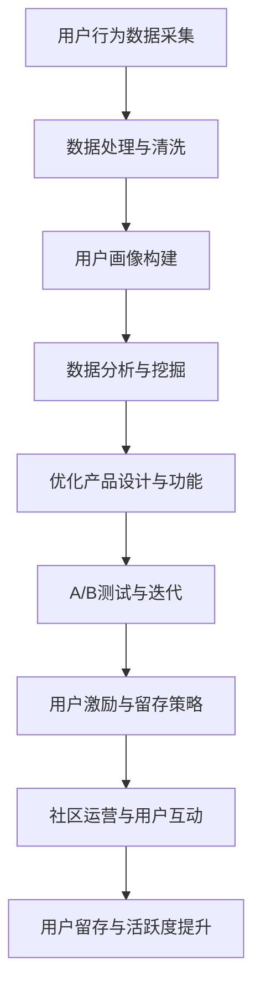

                 

# 创业公司的用户留存与活跃度提升策略

> 关键词：用户留存、活跃度、策略、创业公司、数据分析、用户行为

> 摘要：本文将深入探讨创业公司如何提升用户留存与活跃度。通过分析用户行为、运用数据分析手段、构建用户画像、优化产品体验、设计激励机制以及开展社区运营，创业公司可以有效地提升用户留存与活跃度，从而增强市场竞争力。

## 1. 背景介绍

### 1.1 目的和范围

本文旨在为创业公司提供一套系统化的用户留存与活跃度提升策略。我们将从多个维度分析创业公司面临的挑战，并探讨如何通过有效的策略来应对这些挑战。

### 1.2 预期读者

本文适用于创业公司产品经理、运营经理、数据分析人员以及关注用户增长的相关人员。

### 1.3 文档结构概述

本文分为以下几个部分：

1. **背景介绍**：介绍文章的目的、预期读者和结构。
2. **核心概念与联系**：讨论用户留存与活跃度的定义和相关概念。
3. **核心算法原理 & 具体操作步骤**：介绍提升用户留存与活跃度的算法原理和操作步骤。
4. **数学模型和公式 & 详细讲解 & 举例说明**：通过数学模型和实例解释相关概念。
5. **项目实战：代码实际案例和详细解释说明**：提供具体的项目实战案例。
6. **实际应用场景**：分析用户留存与活跃度的实际应用场景。
7. **工具和资源推荐**：推荐相关学习资源和开发工具。
8. **总结：未来发展趋势与挑战**：总结本文的主要观点并展望未来。
9. **附录：常见问题与解答**：提供常见问题的解答。
10. **扩展阅读 & 参考资料**：推荐进一步的阅读材料和参考文献。

### 1.4 术语表

#### 1.4.1 核心术语定义

- 用户留存：用户在一段时间内持续使用产品的比例。
- 活跃度：用户在一段时间内与产品的互动程度。
- 用户行为：用户在使用产品过程中的操作和互动。

#### 1.4.2 相关概念解释

- 用户留存率：特定时间内，用户继续使用产品的比例。
- 日活跃用户数（DAU）：每天使用产品的独立用户数量。
- 月活跃用户数（MAU）：每月使用产品的独立用户数量。
- 用户生命周期：用户从首次使用到停止使用产品的时间段。

#### 1.4.3 缩略词列表

- DAU：日活跃用户数
- MAU：月活跃用户数
- CRM：客户关系管理
- A/B测试：对照实验，通过比较两个或多个版本的页面或功能，分析用户偏好。

## 2. 核心概念与联系

### 2.1 用户留存与活跃度的定义

用户留存与活跃度是衡量产品成功的重要指标。用户留存指的是用户在一定时间后继续使用产品的比例，而活跃度则反映了用户与产品的互动程度。两者密切相关，良好的用户留存率通常伴随着较高的活跃度。

### 2.2 相关概念和流程

为了提升用户留存与活跃度，我们需要关注以下几个核心概念：

- **用户行为分析**：通过分析用户在使用产品过程中的行为，了解用户的需求和痛点。
- **用户画像**：基于用户行为数据，构建用户的基本信息、兴趣爱好和消费习惯等画像。
- **数据分析**：运用统计分析和机器学习技术，从海量用户数据中提取有价值的信息。
- **A/B测试**：通过对比不同版本的产品功能，测试用户对不同设计的偏好。
- **用户激励**：通过奖励机制激发用户的活跃度和忠诚度。
- **社区运营**：构建用户社区，提升用户之间的互动和粘性。

以下是用户留存与活跃度提升的核心流程和概念关系的 Mermaid 流程图：



## 3. 核心算法原理 & 具体操作步骤

### 3.1 用户行为分析算法原理

用户行为分析的核心目标是理解用户在使用产品过程中的行为模式，从而为产品设计、功能优化和营销策略提供依据。以下是用户行为分析的基本算法原理：

- **日志数据收集**：收集用户操作日志，包括点击、浏览、购买等行为。
- **事件追踪**：定义关键事件，如登录、注册、浏览商品、购买等，以便于后续分析。
- **行为序列建模**：使用机器学习方法（如隐马尔可夫模型、决策树、神经网络等）建立用户行为序列模型，预测用户下一步行为。

### 3.2 用户画像构建操作步骤

用户画像构建是提升用户留存与活跃度的关键步骤。以下是具体的操作步骤：

- **数据源确定**：确定用户行为数据、社交媒体数据、第三方数据等数据源。
- **数据预处理**：清洗和整理原始数据，包括去除重复、缺失值填充、异常值处理等。
- **特征提取**：从原始数据中提取有用的特征，如用户年龄、性别、地理位置、兴趣爱好等。
- **用户分类**：使用聚类算法（如K-means、层次聚类等）将用户划分为不同的群体，构建用户画像。

### 3.3 数据分析算法原理

数据分析是用户留存与活跃度提升的核心环节。以下是数据分析的基本算法原理：

- **描述性统计分析**：计算用户留存率、活跃度等基本指标，了解用户总体行为特征。
- **相关性分析**：分析用户行为与留存、活跃度等指标之间的相关性，识别关键因素。
- **预测分析**：使用回归分析、决策树、神经网络等算法预测用户留存与活跃度，为优化策略提供依据。

### 3.4 用户留存与活跃度提升策略

以下是具体的用户留存与活跃度提升策略：

- **优化产品设计与功能**：根据用户行为分析和数据结果，优化产品界面、功能模块等。
- **A/B测试**：通过A/B测试验证不同设计方案的优劣，逐步优化用户体验。
- **用户激励**：设计积分、优惠券、会员制度等激励机制，提升用户活跃度和忠诚度。
- **社区运营**：构建用户社区，增强用户互动和粘性。

## 4. 数学模型和公式 & 详细讲解 & 举例说明

### 4.1 用户留存率计算

用户留存率是衡量用户持续使用产品的重要指标。其计算公式如下：

$$
用户留存率 = \frac{第n天留存用户数}{第1天活跃用户数} \times 100\%
$$

例如，假设一款产品在第一天有1000个活跃用户，第二天有800个用户继续使用，第三天有600个用户继续使用。则该产品的用户留存率为：

$$
用户留存率 = \frac{800 + 600}{1000} \times 100\% = 70\%
$$

### 4.2 活跃度指标

活跃度指标通常包括日活跃用户数（DAU）和月活跃用户数（MAU）。其计算公式如下：

$$
日活跃用户数（DAU） = \frac{当天活跃用户数}{总用户数} \times 100\%
$$

$$
月活跃用户数（MAU） = \frac{当月活跃用户数}{总用户数} \times 100\%
$$

例如，一款产品总用户数为10000，当天有5000个活跃用户，当月有20000个活跃用户。则该产品的DAU和MAU分别为：

$$
DAU = \frac{5000}{10000} \times 100\% = 50\%
$$

$$
MAU = \frac{20000}{10000} \times 100\% = 200\%
$$

### 4.3 用户生命周期价值计算

用户生命周期价值（LTV）是预测用户在未来一段时间内为产品带来的收益。其计算公式如下：

$$
LTV = 预期收益 - 获客成本
$$

其中，预期收益可以通过用户历史消费数据、用户增长趋势等预测，获客成本则是获取一个用户所需的成本。

例如，假设一款产品的预期收益为100元，获客成本为20元，则该产品的用户生命周期价值为：

$$
LTV = 100 - 20 = 80元
$$

## 5. 项目实战：代码实际案例和详细解释说明

### 5.1 开发环境搭建

在本项目中，我们将使用Python作为主要编程语言，配合Pandas、NumPy等数据分析库进行用户留存与活跃度分析。以下是开发环境的搭建步骤：

1. 安装Python：访问[Python官网](https://www.python.org/)，下载并安装Python。
2. 安装Pandas、NumPy等数据分析库：打开命令行窗口，执行以下命令：

   ```shell
   pip install pandas
   pip install numpy
   ```

### 5.2 源代码详细实现和代码解读

以下是一个简单的用户留存与活跃度分析代码案例：

```python
import pandas as pd
import numpy as np

# 读取用户行为数据
user_data = pd.read_csv('user_behavior.csv')

# 数据预处理
user_data['date'] = pd.to_datetime(user_data['date'])
user_data.sort_values('date', inplace=True)

# 用户留存率计算
def calculate_retention_rate(data, day):
    return (data[data['date'] == day]['user_id'].nunique() / data['user_id'].nunique()) * 100

# 计算每日用户留存率
daily_retention_rate = [calculate_retention_rate(user_data, day) for day in pd.date_range('2021-01-01', periods=30)]

# 结果输出
print('每日用户留存率：', daily_retention_rate)

# 活跃度计算
def calculate_activity_rate(data, day):
    return (data[data['date'] == day]['event'].nunique() / data['event'].nunique()) * 100

# 计算每日活跃度
daily_activity_rate = [calculate_activity_rate(user_data, day) for day in pd.date_range('2021-01-01', periods=30)]

# 结果输出
print('每日活跃度：', daily_activity_rate)
```

### 5.3 代码解读与分析

- **数据读取与预处理**：首先读取用户行为数据，将日期转换为日期类型并按日期排序，以便后续分析。
- **用户留存率计算**：定义一个函数计算特定日期的用户留存率，通过计算特定日期的活跃用户数与总用户数之比得出。
- **每日用户留存率计算**：使用列表推导式计算30天的用户留存率，并输出结果。
- **活跃度计算**：定义一个函数计算特定日期的活跃度，通过计算特定日期的事件数与总事件数之比得出。
- **每日活跃度计算**：使用列表推导式计算30天的活跃度，并输出结果。

通过这个案例，我们可以了解用户留存与活跃度的基本计算方法和数据处理流程。在实际项目中，可以根据具体需求进行功能扩展和优化。

## 6. 实际应用场景

用户留存与活跃度是创业公司成功的关键指标。以下是一些实际应用场景：

- **社交媒体应用**：通过分析用户行为，优化内容推荐算法，提高用户留存率和活跃度。
- **电子商务平台**：通过用户留存与活跃度分析，识别高价值用户群体，实施精准营销和个性化推荐。
- **在线教育平台**：通过分析用户学习行为，设计互动性强的课程内容和激励机制，提升用户参与度和满意度。
- **健康与健身应用**：通过用户行为数据，提供个性化的健康建议和健身计划，增强用户忠诚度。

在以上应用场景中，用户留存与活跃度分析可以帮助创业公司了解用户需求，优化产品设计和功能，提高用户满意度和忠诚度，从而实现可持续增长。

## 7. 工具和资源推荐

### 7.1 学习资源推荐

#### 7.1.1 书籍推荐

- 《数据科学入门》：适合初学者了解数据科学的基本概念和工具。
- 《机器学习实战》：介绍机器学习算法的基本原理和应用案例。
- 《Python数据分析》：详细讲解Python在数据分析领域的应用。

#### 7.1.2 在线课程

- Coursera《机器学习基础》
- Udacity《数据分析基础》
- edX《Python数据分析》

#### 7.1.3 技术博客和网站

- KDNuggets：数据科学和机器学习的最新资讯和论文。
- Medium：关于数据分析、机器学习的优质文章。
- Analytics Vidhya：数据科学和机器学习的教程和实战案例。

### 7.2 开发工具框架推荐

#### 7.2.1 IDE和编辑器

- PyCharm：功能强大的Python IDE。
- Jupyter Notebook：适用于数据分析和交互式编程。

#### 7.2.2 调试和性能分析工具

- Visual Studio Code：支持多种编程语言的轻量级编辑器。
- GDB：开源的调试工具。
- Performance Analyzer：分析程序性能和瓶颈。

#### 7.2.3 相关框架和库

- Pandas：Python的数据分析库。
- NumPy：Python的科学计算库。
- Scikit-learn：Python的机器学习库。

### 7.3 相关论文著作推荐

#### 7.3.1 经典论文

- "User Behavior Analysis in Web Applications"
- "Leveraging User Behavior for Content Recommendation in Social Media"
- "Data-Driven User Engagement Optimization in Mobile Apps"

#### 7.3.2 最新研究成果

- "User Engagement and Retention in Mobile Applications: A Data-Driven Approach"
- "Deep Learning for User Behavior Prediction in Online Platforms"
- "A Multi-Tier Approach for Enhancing User Experience in Web Applications"

#### 7.3.3 应用案例分析

- "How Airbnb Uses Data to Improve User Experience"
- "User Behavior Analysis at Google: Insights and Challenges"
- "Leveraging Data for User Retention and Growth in E-commerce"

## 8. 总结：未来发展趋势与挑战

在未来，用户留存与活跃度提升策略将面临以下几个发展趋势和挑战：

- **大数据和人工智能技术的应用**：大数据和人工智能技术的发展将进一步提升用户留存与活跃度的分析精度和效果。
- **个性化推荐和用户体验优化**：通过个性化推荐和用户体验优化，提高用户的满意度和忠诚度。
- **隐私保护和数据安全**：在用户数据隐私和数据安全方面，创业公司需要制定严格的政策，确保用户数据的合法和安全。
- **多元化渠道和平台整合**：创业公司需要整合多种渠道和平台，提供一致的用户体验，提高用户留存与活跃度。

## 9. 附录：常见问题与解答

### 9.1 用户留存率下降的原因

- 产品功能不够吸引人，用户体验差。
- 没有及时响应用户需求，缺乏创新。
- 市场竞争激烈，同类产品优势明显。
- 用户隐私和数据安全担忧。

### 9.2 提高用户留存与活跃度的策略

- 优化产品设计和功能，提升用户体验。
- 设计有效的激励机制，如积分、优惠券等。
- 定期收集用户反馈，改进产品。
- 加强社区运营，增强用户互动和粘性。

## 10. 扩展阅读 & 参考资料

- "User Retention Strategies for Mobile Apps", Smashing Magazine, 2022.
- "The Science of User Retention", Intercom, 2021.
- "User Engagement and Retention Metrics", growthhackers.com, 2020.
- "Data-Driven User Retention",Towards Data Science, 2019.

## 作者

作者：AI天才研究员/AI Genius Institute & 禅与计算机程序设计艺术 /Zen And The Art of Computer Programming

