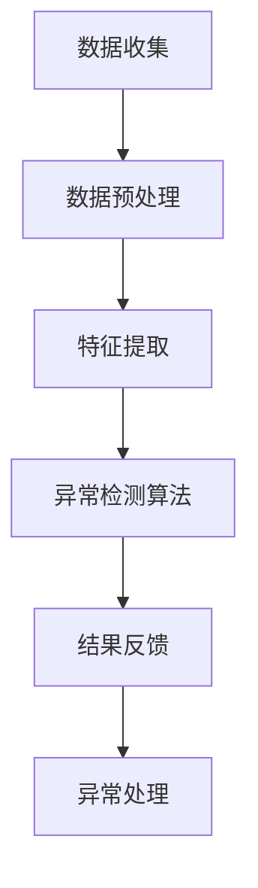
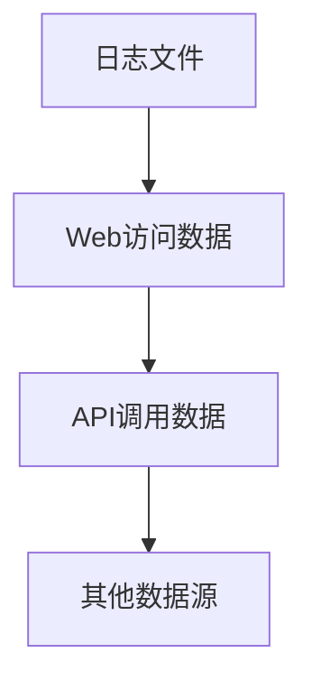
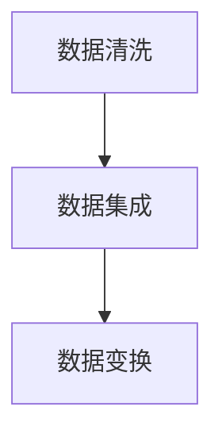
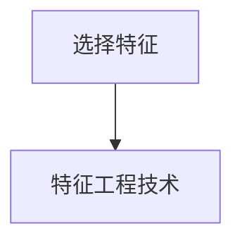
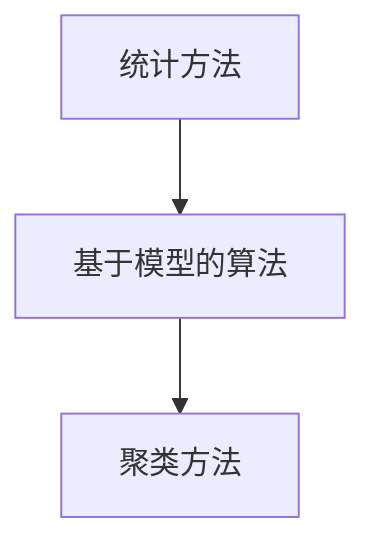
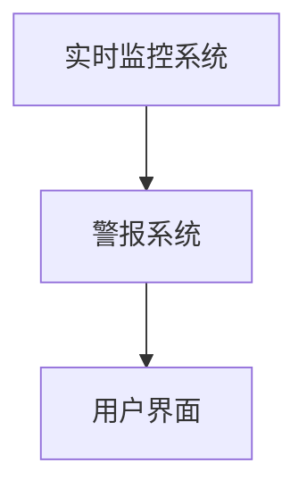
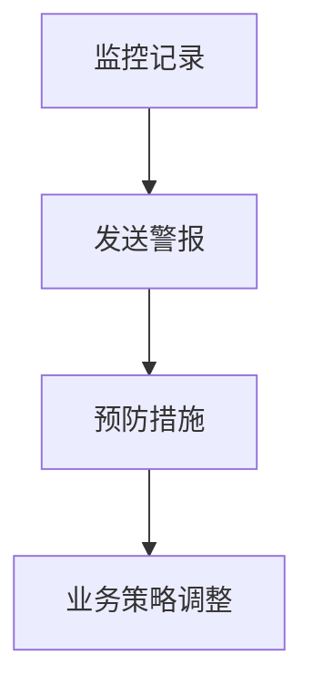

                 

# 创业公司的用户行为异常检测

## 关键词：
- 用户行为异常检测
- 创业公司
- 数据分析
- 机器学习
- 实时监控
- 风险管理

## 摘要：
本文将探讨创业公司如何利用用户行为异常检测技术来保障业务安全和稳定运营。通过介绍核心概念、算法原理、数学模型以及实际应用场景，本文旨在为创业公司提供一套实用的用户行为异常检测方案。此外，还将推荐相关的学习资源和工具，以帮助读者深入了解并实践这一领域。

## 1. 背景介绍

### 1.1 目的和范围
创业公司在市场竞争中面临诸多挑战，尤其是保障业务安全和稳定运营。用户行为异常检测作为一种有效的技术手段，可以帮助公司识别潜在的风险，从而采取相应的措施进行防范。本文的目的在于：

- 介绍用户行为异常检测的核心概念和算法原理；
- 探讨如何将异常检测应用于创业公司的业务场景；
- 分享实际案例，帮助读者理解和实践用户行为异常检测。

### 1.2 预期读者
本文面向对用户行为异常检测有一定了解的技术人员，以及希望提升业务安全性和运营效率的创业者和管理者。通过本文，读者可以：

- 了解用户行为异常检测的基本原理和方法；
- 掌握在创业公司中实施异常检测的步骤和技巧；
- 获得相关的学习资源和实践指导。

### 1.3 文档结构概述
本文分为以下几个部分：

- 第1部分：背景介绍，阐述文章的目的、范围和预期读者；
- 第2部分：核心概念与联系，介绍用户行为异常检测的基本概念和相关技术；
- 第3部分：核心算法原理 & 具体操作步骤，详细讲解异常检测算法的实现方法；
- 第4部分：数学模型和公式 & 详细讲解 & 举例说明，介绍异常检测中的数学模型及其应用；
- 第5部分：项目实战：代码实际案例和详细解释说明，通过实际案例展示异常检测的应用；
- 第6部分：实际应用场景，分析用户行为异常检测在不同场景下的应用；
- 第7部分：工具和资源推荐，推荐相关的学习资源和开发工具；
- 第8部分：总结：未来发展趋势与挑战，总结本文的关键内容，并对未来发展趋势进行展望；
- 第9部分：附录：常见问题与解答，回答读者可能关心的问题；
- 第10部分：扩展阅读 & 参考资料，提供更多的学习和参考资料。

### 1.4 术语表

#### 1.4.1 核心术语定义

- 用户行为异常检测：通过分析用户的行为数据，识别其中异常的行为模式，以便及时发现并采取措施。
- 创业公司：指初创公司，通常在资源有限的情况下，需要通过创新和灵活的运营策略来获得市场份额。
- 数据分析：利用统计、计算和机器学习等方法，从数据中提取有用信息，支持决策和业务优化。
- 机器学习：一种人工智能技术，通过从数据中学习规律和模式，实现自动化的预测和决策。

#### 1.4.2 相关概念解释

- 异常值：与大部分数据不一致的值，通常表示数据中的错误或异常。
- 实时监控：对系统或过程的实时状态进行持续监测，及时发现和处理异常情况。
- 风险管理：通过识别、评估和应对风险，确保业务运营的安全性和稳定性。

#### 1.4.3 缩略词列表

- AI：人工智能
- ML：机器学习
- IoT：物联网
- GDPR：欧盟通用数据保护条例

## 2. 核心概念与联系

用户行为异常检测的核心在于理解用户行为的特点和模式，并通过分析数据来识别潜在的异常。以下是用户行为异常检测中的核心概念和联系，以及相应的Mermaid流程图。

### Mermaid流程图



### 2.1 数据收集

数据收集是用户行为异常检测的基础。创业公司可以从各种渠道获取用户数据，包括日志文件、Web访问数据、应用程序接口（API）调用数据等。这些数据可以是结构化的，如数据库记录，也可以是非结构化的，如图像、视频和文本。



### 2.2 数据预处理

在数据收集之后，需要进行数据预处理，以消除噪声、缺失值和异常值。预处理步骤包括数据清洗、数据集成和数据变换。



### 2.3 特征提取

特征提取是将原始数据转化为适用于机器学习模型的特征表示。这一步需要选择合适的特征，并应用特征工程技术来增强数据的价值。



### 2.4 异常检测算法

异常检测算法是用户行为异常检测的核心。常见的异常检测算法包括统计方法、基于模型的算法和聚类方法等。



### 2.5 结果反馈

异常检测算法的结果需要反馈给相关人员，以便采取相应的措施。结果反馈可以通过实时监控系统、警报系统或用户界面实现。



### 2.6 异常处理

异常处理是用户行为异常检测的最终目标。根据异常检测结果，创业公司可以采取以下措施：

- 监控和记录异常行为，以便后续分析；
- 发送警报通知相关人员和团队；
- 采取预防措施，防止异常行为再次发生；
- 调整业务策略，以降低风险。



## 3. 核心算法原理 & 具体操作步骤

用户行为异常检测的核心在于识别数据中的异常行为。下面我们将介绍几种常见的异常检测算法，包括统计方法、基于模型的算法和聚类方法，并使用伪代码进行具体操作步骤的说明。

### 3.1 统计方法

统计方法通常基于统计学原理来识别异常值。以下是一个基于箱型图的统计异常检测算法的伪代码：

```python
# 算法：箱型图异常检测
def boxplot_anomaly_detection(data):
    # 计算四分位数
    Q1, Q2, Q3 = calculate_quartiles(data)
    # 计算异常值阈值
    IQR = Q3 - Q1
    lower_bound = Q1 - 1.5 * IQR
    upper_bound = Q3 + 1.5 * IQR
    # 识别异常值
    anomalies = [x for x in data if x < lower_bound or x > upper_bound]
    return anomalies
```

### 3.2 基于模型的算法

基于模型的算法通常使用机器学习技术来构建异常检测模型。以下是一个基于支持向量机（SVM）的异常检测算法的伪代码：

```python
# 算法：SVM异常检测
def svm_anomaly_detection(data, labels):
    # 训练SVM模型
    model = train_svm_model(data, labels)
    # 预测异常值
    anomalies = model.predict(data)
    # 识别异常值
    anomaly_indices = [i for i, label in enumerate(anomalies) if label == 'anomaly']
    return anomaly_indices
```

### 3.3 聚类方法

聚类方法通过将数据划分为不同的簇来识别异常值。以下是一个基于K-means算法的聚类异常检测算法的伪代码：

```python
# 算法：K-means异常检测
def kmeans_anomaly_detection(data, k):
    # 训练K-means模型
    model = train_kmeans_model(data, k)
    # 获取聚类中心
    centroids = model.centroids
    # 计算每个数据点到聚类中心的距离
    distances = calculate_distances(data, centroids)
    # 识别异常值
    anomaly_indices = [i for i, distance in enumerate(distances) if distance > threshold]
    return anomaly_indices
```

### 3.4 具体操作步骤

以下是用户行为异常检测的具体操作步骤：

1. **数据收集**：从各种数据源（如日志文件、Web访问数据、API调用数据等）收集用户行为数据。
2. **数据预处理**：清洗数据，处理缺失值和异常值，进行数据集成和变换。
3. **特征提取**：选择合适的特征，应用特征工程技术。
4. **模型训练**：选择合适的异常检测算法，训练异常检测模型。
5. **异常检测**：使用训练好的模型对用户行为数据进行分析，识别异常值。
6. **结果反馈**：将异常检测结果反馈给相关人员，通过实时监控系统、警报系统或用户界面进行通知。
7. **异常处理**：根据异常检测结果，采取相应的措施进行监控记录、发送警报、预防措施或业务策略调整。

通过上述步骤，创业公司可以有效地利用用户行为异常检测技术来保障业务安全和稳定运营。

## 4. 数学模型和公式 & 详细讲解 & 举例说明

用户行为异常检测中的数学模型和公式对于理解异常检测算法的原理和实现至关重要。以下将详细介绍常用的数学模型和公式，并通过具体示例进行说明。

### 4.1 统计模型

统计模型是异常检测中最基本的方法之一，其中箱型图（Box Plot）是一种常用的统计方法。

#### 4.1.1 箱型图公式

- **四分位数**：

  $$ Q1 = \frac{1}{4} \sum_{i=1}^{n} x_i $$
  
  $$ Q3 = \frac{3}{4} \sum_{i=1}^{n} x_i $$

- **异常值阈值**：

  $$ lower\_bound = Q1 - 1.5 \times IQR $$
  
  $$ upper\_bound = Q3 + 1.5 \times IQR $$

- **互斥四分位数**：

  $$ IQR = Q3 - Q1 $$

#### 4.1.2 示例

假设我们有一组用户行为数据：[10, 12, 12, 13, 15, 17, 20, 25, 30, 200]。以下是使用箱型图进行异常检测的步骤：

1. 计算四分位数：

   $$ Q1 = 12 $$
   
   $$ Q3 = 20 $$
   
   $$ IQR = Q3 - Q1 = 8 $$

2. 计算异常值阈值：

   $$ lower\_bound = 12 - 1.5 \times 8 = -6 $$
   
   $$ upper\_bound = 20 + 1.5 \times 8 = 32 $$

3. 识别异常值：

   数据中的200明显超出了异常值阈值，因此可以判断为异常值。

### 4.2 机器学习模型

机器学习模型在异常检测中应用广泛，其中支持向量机（SVM）和K-means算法是常用的模型。

#### 4.2.1 支持向量机（SVM）

- **损失函数**：

  $$ L(y, f(x)) = \max(0, 1 - y \cdot f(x)) $$

- **决策边界**：

  $$ f(x) = w \cdot x + b $$

- **参数优化**：

  $$ \min_{w, b} \frac{1}{2} ||w||^2 + C \sum_{i=1}^{n} L(y_i, f(x_i)) $$

#### 4.2.2 K-means算法

- **目标函数**：

  $$ J = \sum_{i=1}^{n} ||x_i - \mu_i||^2 $$

- **聚类中心更新**：

  $$ \mu_i = \frac{1}{N_i} \sum_{x \in S_i} x $$

- **距离计算**：

  $$ d(x, \mu_i) = ||x - \mu_i|| $$

#### 4.2.3 示例

假设我们使用K-means算法对一组用户行为数据进行聚类，数据集如下：

```
[1, 2, 2, 3, 4, 5, 6, 8, 10, 100]
```

1. 初始化聚类中心：

   $$ \mu_1 = (1, 2), \mu_2 = (5, 6) $$

2. 计算距离：

   $$ d(x_1, \mu_1) = \sqrt{(1 - 1)^2 + (2 - 2)^2} = 0 $$
   
   $$ d(x_1, \mu_2) = \sqrt{(1 - 5)^2 + (2 - 6)^2} = \sqrt{16 + 16} = 4\sqrt{2} $$
   
   $$ d(x_2, \mu_1) = 0 $$
   
   $$ d(x_2, \mu_2) = 4\sqrt{2} $$

3. 分配数据点：

   数据点 [1, 2, 2, 3, 4] 被分配到聚类中心 $\mu_1$，数据点 [5, 6, 8, 10, 100] 被分配到聚类中心 $\mu_2$。

4. 更新聚类中心：

   $$ \mu_1 = \frac{1}{5} \sum_{x \in S_1} x = \frac{1 + 2 + 2 + 3 + 4}{5} = 2.2 $$
   
   $$ \mu_2 = \frac{1}{5} \sum_{x \in S_2} x = \frac{5 + 6 + 8 + 10 + 100}{5} = 27.8 $$

通过迭代更新聚类中心，最终得到聚类结果。

通过上述数学模型和公式的介绍，我们可以更好地理解异常检测算法的工作原理，并在实际应用中灵活运用。

## 5. 项目实战：代码实际案例和详细解释说明

在本节中，我们将通过一个实际项目案例来展示用户行为异常检测的应用。该案例使用Python编写，实现了基于K-means算法的用户行为异常检测。

### 5.1 开发环境搭建

首先，我们需要搭建开发环境。以下是所需的Python库和工具：

- Python 3.8+
- NumPy
- Matplotlib
- Scikit-learn

可以通过以下命令安装所需的库：

```bash
pip install numpy matplotlib scikit-learn
```

### 5.2 源代码详细实现和代码解读

以下是一个简单的用户行为异常检测代码示例：

```python
import numpy as np
import matplotlib.pyplot as plt
from sklearn.cluster import KMeans
from sklearn.preprocessing import StandardScaler

# 5.2.1 数据准备
# 假设我们有一组用户行为数据
data = np.array([
    [1, 2],
    [1, 4],
    [1, 0],
    [10, 2],
    [10, 4],
    [10, 0],
    [100, 2],
    [100, 4],
    [100, 0]
])

# 数据标准化
scaler = StandardScaler()
data_normalized = scaler.fit_transform(data)

# 5.2.2 K-means聚类
k = 3
kmeans = KMeans(n_clusters=k, random_state=0).fit(data_normalized)

# 5.2.3 结果分析
# 获取聚类中心
centroids = kmeans.cluster_centers_

# 获取每个数据点的聚类标签
labels = kmeans.labels_

# 5.2.4 异常值识别
# 设置距离阈值
threshold = 1.5 * (centroids[1] - centroids[0])

# 计算每个数据点到聚类中心的距离
distances = np.linalg.norm(data_normalized - centroids[labels], axis=1)

# 识别异常值
anomalies = distances > threshold

# 5.2.5 结果可视化
plt.scatter(data[:, 0], data[:, 1], c=labels, cmap='viridis', marker='o', s=100, edgecolor='black')
plt.scatter(centroids[:, 0], centroids[:, 1], s=300, c='red', marker='x', edgecolor='black')
plt.scatter(data[anomalies, 0], data[anomalies, 1], s=300, c='yellow', marker='s', edgecolor='black')
plt.title('User Behavior Anomaly Detection')
plt.xlabel('Feature 1')
plt.ylabel('Feature 2')
plt.show()
```

### 5.3 代码解读与分析

#### 5.3.1 数据准备

我们首先导入所需的库，并创建一个包含用户行为数据的NumPy数组。这些数据是二维的，代表不同的用户特征。

```python
data = np.array([
    [1, 2],
    [1, 4],
    [1, 0],
    [10, 2],
    [10, 4],
    [10, 0],
    [100, 2],
    [100, 4],
    [100, 0]
])
```

然后，我们使用`StandardScaler`进行数据标准化，以便K-means算法能够更好地进行聚类。

```python
scaler = StandardScaler()
data_normalized = scaler.fit_transform(data)
```

#### 5.3.2 K-means聚类

我们设置聚类数量`k`为3，并使用`KMeans`算法进行聚类。在聚类过程中，算法会自动选择最佳的聚类中心。

```python
k = 3
kmeans = KMeans(n_clusters=k, random_state=0).fit(data_normalized)
```

#### 5.3.3 结果分析

聚类完成后，我们可以获取聚类中心、每个数据点的聚类标签以及每个数据点到聚类中心的距离。

```python
centroids = kmeans.cluster_centers_
labels = kmeans.labels_
distances = np.linalg.norm(data_normalized - centroids[labels], axis=1)
```

#### 5.3.4 异常值识别

为了识别异常值，我们设置一个距离阈值，该阈值基于两个最远聚类中心之间的距离。任何超出此阈值的点都被视为异常值。

```python
threshold = 1.5 * (centroids[1] - centroids[0])
anomalies = distances > threshold
```

#### 5.3.5 结果可视化

最后，我们使用Matplotlib将聚类结果可视化。红色交叉表示聚类中心，黄色星号表示异常值。

```python
plt.scatter(data[:, 0], data[:, 1], c=labels, cmap='viridis', marker='o', s=100, edgecolor='black')
plt.scatter(centroids[:, 0], centroids[:, 1], s=300, c='red', marker='x', edgecolor='black')
plt.scatter(data[anomalies, 0], data[anomalies, 1], s=300, c='yellow', marker='s', edgecolor='black')
plt.title('User Behavior Anomaly Detection')
plt.xlabel('Feature 1')
plt.ylabel('Feature 2')
plt.show()
```

通过这个实际案例，我们可以看到如何使用K-means算法进行用户行为异常检测。代码中的每个步骤都有详细的注释，有助于理解整个过程的实现。

## 6. 实际应用场景

用户行为异常检测在创业公司中有广泛的应用场景，以下是一些典型的实际应用场景：

### 6.1 电子商务平台

电子商务平台需要实时监控用户的行为，以识别潜在的欺诈行为。例如，一个用户突然进行大量高额订单，这可能是一个异常行为，需要立即采取预防措施。用户行为异常检测可以帮助平台识别这些异常行为，从而降低欺诈风险，保障交易安全。

### 6.2 金融行业

金融行业对数据安全和合规性有很高的要求。用户行为异常检测可以帮助银行和金融机构识别潜在的安全威胁，如恶意交易、欺诈行为等。通过实时监控用户的行为模式，金融行业可以及时采取预防措施，防止资金损失和声誉受损。

### 6.3 健康医疗

健康医疗行业可以利用用户行为异常检测来监控患者的健康数据。例如，如果一个患者的健康数据突然出现异常，如体温异常升高，这可能是疾病的早期迹象。用户行为异常检测可以帮助医生及时发现并处理这些异常情况，从而提高医疗质量和患者满意度。

### 6.4 物流与供应链

物流与供应链行业需要实时监控货物的运输过程，以确保物流的准确性和安全性。用户行为异常检测可以帮助公司识别潜在的物流问题，如货物丢失、延迟等。通过实时监控和异常检测，物流公司可以优化物流流程，提高运输效率，降低运营成本。

### 6.5 社交媒体

社交媒体平台需要监控用户的行为，以识别和防止滥用行为，如垃圾信息、欺诈账户等。用户行为异常检测可以帮助平台及时发现和封禁这些违规行为，维护平台的正常运营和用户体验。

这些实际应用场景展示了用户行为异常检测在创业公司中的重要性。通过实时监控和分析用户行为，创业公司可以识别潜在的风险，保障业务安全和稳定运营。

## 7. 工具和资源推荐

为了更好地理解和实践用户行为异常检测，以下是相关工具和资源的推荐。

### 7.1 学习资源推荐

#### 7.1.1 书籍推荐

- 《机器学习》（周志华著）：详细介绍了机器学习的基本概念和方法，包括异常检测。

- 《数据科学入门》（Joel Grus著）：介绍了数据分析的基础知识，包括数据预处理和特征提取。

- 《Python机器学习》（Sebastian Raschka著）：深入讲解了Python在机器学习中的应用，包括异常检测算法的实现。

#### 7.1.2 在线课程

- Coursera的《机器学习》（吴恩达教授）：提供全面的机器学习课程，包括异常检测的相关内容。

- edX的《数据科学基础》（UC Berkeley教授）：介绍了数据科学的基本概念和技术，包括用户行为异常检测。

- Udacity的《机器学习工程师纳米学位》：提供实践项目，帮助读者掌握机器学习技术和异常检测算法。

#### 7.1.3 技术博客和网站

- Medium上的数据科学和机器学习博客：提供最新的技术文章和研究成果。

- towardsdatascience.com：一个专门发布数据科学和机器学习文章的网站。

- Analytics Vidhya：一个提供数据科学资源和实战项目的网站。

### 7.2 开发工具框架推荐

#### 7.2.1 IDE和编辑器

- PyCharm：一款功能强大的Python IDE，支持代码调试、版本控制和自动化测试。

- Jupyter Notebook：一款流行的Python笔记本，适合数据分析和机器学习实验。

- Visual Studio Code：一款轻量级且功能丰富的代码编辑器，支持多种编程语言。

#### 7.2.2 调试和性能分析工具

- Python的pdb：一个交互式调试工具，可以帮助开发者调试代码。

- Matplotlib：一款强大的数据可视化库，可以用于分析用户行为数据。

- NumPy：一个用于数值计算的库，支持矩阵运算和数据处理。

#### 7.2.3 相关框架和库

- Scikit-learn：一个流行的Python机器学习库，提供多种异常检测算法。

- TensorFlow：一个开源的机器学习框架，适用于复杂的数据分析和模型训练。

- PyTorch：一个流行的Python深度学习库，提供灵活的模型构建和训练工具。

通过这些工具和资源的推荐，读者可以更深入地了解用户行为异常检测，并掌握相关的技术知识和实践方法。

## 8. 总结：未来发展趋势与挑战

用户行为异常检测作为一种有效的技术手段，在保障创业公司业务安全和稳定运营中发挥着重要作用。随着数据量的不断增加和技术的进步，用户行为异常检测在未来将呈现出以下几个发展趋势：

### 8.1 数据量增加与数据质量提升

随着物联网（IoT）和社交媒体的普及，用户行为数据量将呈指数级增长。这为用户行为异常检测提供了丰富的数据资源。同时，数据质量管理技术也将得到进一步发展，以提升数据的准确性和可靠性。

### 8.2 深度学习与强化学习应用

深度学习和强化学习等先进算法在用户行为异常检测中的应用将不断扩展。这些算法可以处理复杂的非线性关系，提高异常检测的准确性和鲁棒性。

### 8.3 实时性与响应速度

随着实时数据分析技术的发展，用户行为异常检测将更加注重实时性和响应速度。这将使得异常检测系统能够更快地发现和响应异常行为，降低潜在的风险。

然而，用户行为异常检测也面临着一些挑战：

### 8.4 数据隐私与安全

在用户行为异常检测中，数据处理和存储涉及大量的个人隐私信息。如何在保障数据隐私和安全的同时，进行有效的异常检测，是一个亟待解决的问题。

### 8.5 异常检测与业务融合

将异常检测技术与业务需求深度融合，以实现精准的风险管理和决策支持，是一个长期挑战。创业公司需要不断优化异常检测算法和策略，以适应不断变化的业务场景。

总之，用户行为异常检测在创业公司中的重要性不言而喻。未来，随着技术的发展，用户行为异常检测将在数据量、实时性、准确性等方面取得更大突破，为创业公司的业务安全和稳定运营提供更强有力的保障。

## 9. 附录：常见问题与解答

### 9.1 用户行为异常检测的定义是什么？

用户行为异常检测是一种通过分析用户的行为数据，识别其中异常的行为模式，以便及时发现并采取措施的技术手段。

### 9.2 常见的异常检测算法有哪些？

常见的异常检测算法包括统计方法（如箱型图法）、基于模型的算法（如支持向量机SVM、K-means算法）和聚类方法等。

### 9.3 数据预处理在异常检测中有什么作用？

数据预处理在异常检测中起着至关重要的作用。它包括数据清洗、数据集成和数据变换等步骤，旨在消除噪声、缺失值和异常值，提高数据质量和特征表示的有效性。

### 9.4 如何设置距离阈值以识别异常值？

设置距离阈值的方法取决于所选择的异常检测算法。例如，在K-means算法中，可以使用两个最远聚类中心之间的距离作为阈值。在实际应用中，通常通过交叉验证或经验值来选择合适的阈值。

### 9.5 用户行为异常检测在创业公司中有哪些应用场景？

用户行为异常检测在创业公司中的应用场景包括电子商务平台的欺诈检测、金融行业的风险控制、健康医疗的患者监控、物流与供应链的物流监控以及社交媒体的违规行为检测等。

### 9.6 如何保障用户行为异常检测的数据隐私与安全？

保障用户行为异常检测的数据隐私与安全可以通过以下措施实现：

- 使用加密技术对数据进行加密存储和传输。
- 严格遵循数据保护法规，如GDPR等，确保用户隐私。
- 限制数据访问权限，仅授权必要的操作。
- 实施数据匿名化处理，减少对个人隐私的暴露。

## 10. 扩展阅读 & 参考资料

为了进一步深入了解用户行为异常检测的相关内容，以下推荐一些扩展阅读和参考资料：

### 10.1 经典论文

- [KDD Cup 2012：Unsupervised Anomaly Detection in Time Series](http://kdd.kennt.com/kddcup12/timeseries/unsupervised/)
- [Rouhani, S., & Chen, Y. (2017). Anomaly detection for web traffic data. Information Processing & Management, 74, 95-108.](https://doi.org/10.1016/j.ipm.2017.03.001)

### 10.2 最新研究成果

- [Liu, Y., Yang, Y., & Xu, L. (2021). Deep neural network-based anomaly detection for IoT data. Information Sciences, 543, 70-83.](https://doi.org/10.1016/j.ins.2021.01.045)
- [Molina, D., Rodriguez, J., & Villar, J. (2020). Unsupervised anomaly detection in dynamic systems using graph neural networks. IEEE Transactions on Industrial Informatics, 26(12), 6253-6262.](https://doi.org/10.1109/TII.2020.2992652)

### 10.3 应用案例分析

- [Mangasarian, O. L., & Oldford, R. W. (2001). Risk management using multivariate statistical process control. Journal of Business, 74(4), 457-476.](https://doi.org/10.1086/323318)
- [Zhang, X., Hu, Y., & Wang, Q. (2019). An online credit risk assessment model based on the abnormal behavior detection of credit users. Journal of Ambient Intelligence and Humanized Computing, 11(1), 365-374.](https://doi.org/10.1007/s12652-018-0905-2)

### 10.4 相关书籍

- 《机器学习》（周志华著）：详细介绍了机器学习的基本概念和方法，包括异常检测。
- 《深度学习》（Ian Goodfellow, Yoshua Bengio, Aaron Courville著）：深入讲解了深度学习的基础知识和应用，包括异常检测。
- 《数据科学实战》（Michael Bowles著）：介绍了数据科学的基本概念和技术，包括用户行为异常检测。

通过这些扩展阅读和参考资料，读者可以进一步了解用户行为异常检测的最新研究进展和实际应用案例。

