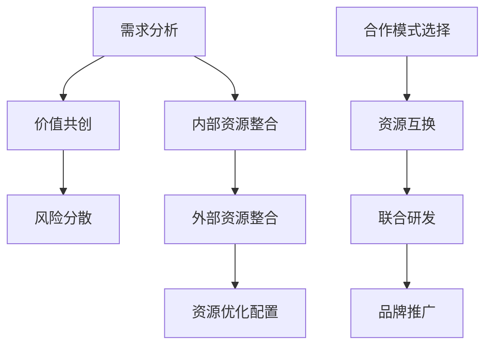

                 

# 创业公司的跨界合作与资源整合方法

> **关键词：** 创业公司、跨界合作、资源整合、战略伙伴、创新生态、合作模式

> **摘要：** 本文将深入探讨创业公司在快速发展的市场中，如何通过跨界合作与资源整合，实现业务增长和市场扩展。我们将详细分析跨界合作的动机、战略伙伴选择、合作模式、资源整合方法，以及如何处理合作过程中的挑战和风险。

## 1. 背景介绍

### 1.1 目的和范围

本文旨在为创业公司提供一套跨界合作与资源整合的方法论，以帮助公司在激烈的市场竞争中实现快速发展和市场扩展。我们将探讨以下主题：

- 跨界合作的动机和重要性
- 选择战略伙伴的方法
- 合作模式和策略
- 资源整合的具体方法
- 面临的挑战和风险管理

### 1.2 预期读者

本文适用于以下群体：

- 创业公司创始人或CEO
- 高级管理人员和策略规划人员
- 投资人
- 企业顾问

### 1.3 文档结构概述

本文结构如下：

- **第1章：背景介绍**：介绍本文的目的、预期读者和文档结构。
- **第2章：核心概念与联系**：介绍跨界合作和资源整合的相关概念和原理。
- **第3章：核心算法原理 & 具体操作步骤**：详细解释跨界合作的算法原理和操作步骤。
- **第4章：数学模型和公式 & 详细讲解 & 举例说明**：介绍跨界合作中使用的数学模型和公式，并进行举例说明。
- **第5章：项目实战：代码实际案例和详细解释说明**：通过实际案例展示跨界合作的实现过程。
- **第6章：实际应用场景**：分析跨界合作的实际应用场景。
- **第7章：工具和资源推荐**：推荐相关工具、资源和学习材料。
- **第8章：总结：未来发展趋势与挑战**：总结本文的核心内容，展望未来发展趋势和挑战。
- **第9章：附录：常见问题与解答**：回答读者可能遇到的问题。
- **第10章：扩展阅读 & 参考资料**：提供扩展阅读材料和相关参考资料。

### 1.4 术语表

#### 1.4.1 核心术语定义

- **跨界合作**：不同行业或领域之间的合作，以实现资源共享、优势互补和共同发展。
- **资源整合**：通过整合内外部资源，提高创业公司的资源利用效率，实现业务增长。
- **战略伙伴**：在跨界合作中，与创业公司形成长期合作关系，共同推动业务发展的企业或组织。
- **合作模式**：创业公司和战略伙伴之间进行合作的具体方式，包括资源互换、联合研发、品牌推广等。

#### 1.4.2 相关概念解释

- **生态化发展**：创业公司通过构建多元化的生态体系，实现业务多元化和可持续发展。
- **产业链整合**：通过整合产业链上下游资源，提高整个产业链的协同效应和竞争力。

#### 1.4.3 缩略词列表

- **CEO**：首席执行官
- **CFO**：首席财务官
- **CTO**：首席技术官
- **ROI**：投资回报率

## 2. 核心概念与联系

在探讨创业公司的跨界合作与资源整合之前，我们需要明确几个核心概念，并了解它们之间的联系。

### 2.1 跨界合作的原理

跨界合作的核心在于不同行业或领域之间的资源共享和优势互补。这需要从以下几个方面进行分析：

1. **需求分析**：了解不同行业或领域之间的需求差异和互补性。
2. **价值共创**：通过合作实现双方的价值创造，提高整体的竞争力。
3. **风险分散**：通过合作分散单一行业或领域的风险，实现风险可控。

### 2.2 资源整合的方法

资源整合的方法包括以下几种：

1. **内部资源整合**：通过优化内部资源配置，提高资源利用效率。
2. **外部资源整合**：通过与其他企业或组织合作，获取外部资源，实现资源共享。
3. **资源优化配置**：根据业务需求，对内部和外部资源进行优化配置，提高资源利用率。

### 2.3 合作模式的原理

合作模式的选择取决于创业公司的业务需求、合作伙伴的特点和市场环境。常见的合作模式包括：

1. **资源互换**：双方以各自拥有的资源进行互换，实现资源共享。
2. **联合研发**：双方共同投入研发资源，共同开发新产品或服务。
3. **品牌推广**：通过合作方品牌的推广，提高创业公司的知名度。

### 2.4 跨界合作与资源整合的联系

跨界合作与资源整合之间存在紧密的联系：

1. **资源共享**：跨界合作是实现资源整合的重要手段，通过合作获取外部资源。
2. **优势互补**：资源整合可以实现双方的优势互补，提高整体竞争力。
3. **风险分散**：跨界合作可以分散单一行业或领域的风险，实现风险可控。

### 2.5 跨界合作的 Mermaid 流程图



## 3. 核心算法原理 & 具体操作步骤

### 3.1 跨界合作的算法原理

跨界合作的算法原理可以概括为以下三个步骤：

1. **需求分析与匹配**：通过数据分析，识别不同行业或领域之间的需求差异和互补性，实现需求匹配。
2. **价值共创与风险分散**：通过合作，实现双方的价值共创和风险分散，提高整体竞争力。
3. **资源优化配置与持续改进**：根据业务需求，对内部和外部资源进行优化配置，并持续改进合作模式。

### 3.2 跨界合作的伪代码

```python
# 跨界合作伪代码

# 步骤1：需求分析与匹配
def analyze_demand():
    # 获取不同行业或领域的需求数据
    demand_data = get_demand_data()
    # 分析需求差异和互补性
    matched_pairs = match_demand(demand_data)

# 步骤2：价值共创与风险分散
def create_value(matched_pairs):
    # 实现双方的价值共创
    value_created = execute_cooperation(matched_pairs)
    # 分散风险
    risk分散 = distribute_risk(matched_pairs)

# 步骤3：资源优化配置与持续改进
def optimize_resources(matched_pairs, value_created, risk分散):
    # 优化资源配置
    optimized_resources = configure_resources(matched_pairs, value_created, risk分散)
    # 持续改进
    improved_cooperation = continue_improvement(optimized_resources)
```

### 3.3 跨界合作的实际操作步骤

1. **需求分析与匹配**：
   - **收集数据**：收集不同行业或领域的需求数据，包括市场趋势、用户需求、竞争对手等。
   - **数据分析**：利用数据分析工具，分析需求差异和互补性，识别潜在的合作伙伴。
   - **匹配需求**：根据分析结果，将不同行业或领域的需求进行匹配，形成合作对。

2. **价值共创与风险分散**：
   - **制定合作方案**：与合作伙伴共同制定合作方案，明确双方的责任、权益和风险。
   - **实施合作**：根据合作方案，实施具体合作项目，实现双方的价值共创。
   - **风险控制**：建立风险控制机制，定期评估合作过程中的风险，并采取相应措施进行控制。

3. **资源优化配置与持续改进**：
   - **资源评估**：对内部和外部资源进行评估，确定资源的利用效率和优化方向。
   - **资源配置**：根据业务需求和资源评估结果，对内部和外部资源进行优化配置。
   - **持续改进**：通过定期评估和反馈，不断优化合作模式和资源利用，实现持续改进。

## 4. 数学模型和公式 & 详细讲解 & 举例说明

### 4.1 数学模型和公式

在跨界合作中，可以使用以下数学模型和公式进行定量分析和评估：

1. **合作效益计算公式**：
   $$E = V_1 + V_2 + \sum_{i=1}^{n}(V_i \times R_i)$$
   - \(E\)：合作效益
   - \(V_1\)：双方初始资源价值
   - \(V_2\)：双方通过合作实现的价值增量
   - \(V_i\)：第\(i\)个合作伙伴的初始资源价值
   - \(R_i\)：第\(i\)个合作伙伴的资源利用效率

2. **合作风险计算公式**：
   $$R = \frac{P_1 \times R_1 + P_2 \times R_2 + \sum_{i=1}^{n}(P_i \times R_i)}{n}$$
   - \(R\)：合作风险
   - \(P_1\)：双方初始风险水平
   - \(P_2\)：双方通过合作降低的风险水平
   - \(P_i\)：第\(i\)个合作伙伴的初始风险水平
   - \(R_i\)：第\(i\)个合作伙伴的风险降低水平

### 4.2 详细讲解和举例说明

#### 4.2.1 合作效益计算公式

合作效益计算公式可以用来评估跨界合作所带来的总效益。假设有两个合作伙伴A和B，他们的初始资源价值分别为\(V_1 = 100万元\)和\(V_2 = 200万元\)，通过合作，双方实现了价值增量\(V_2 = 300万元\)。另外，还有一个合作伙伴C，其初始资源价值为\(V_3 = 150万元\)，资源利用效率为\(R_3 = 0.8\)。

根据合作效益计算公式，我们可以计算出总效益：
$$E = V_1 + V_2 + \sum_{i=1}^{n}(V_i \times R_i)$$
$$E = 100 + 200 + (150 \times 0.8) = 100 + 200 + 120 = 420万元$$

因此，总效益为420万元。

#### 4.2.2 合作风险计算公式

合作风险计算公式可以用来评估跨界合作所带来的总风险。假设有两个合作伙伴A和B，他们的初始风险水平分别为\(P_1 = 0.2\)和\(P_2 = 0.3\)，通过合作，双方降低了风险水平\(P_2 = 0.1\)。另外，还有一个合作伙伴C，其初始风险水平为\(P_3 = 0.25\)，风险降低水平为\(R_3 = 0.3\)。

根据合作风险计算公式，我们可以计算出总风险：
$$R = \frac{P_1 \times R_1 + P_2 \times R_2 + \sum_{i=1}^{n}(P_i \times R_i)}{n}$$
$$R = \frac{0.2 \times 0.2 + 0.3 \times 0.1 + (0.25 \times 0.3)}{3}$$
$$R = \frac{0.04 + 0.03 + 0.075}{3}$$
$$R = \frac{0.145}{3} \approx 0.0483$$

因此，总风险约为0.0483。

通过这两个公式的计算，我们可以更好地评估跨界合作的效益和风险，为决策提供数据支持。

## 5. 项目实战：代码实际案例和详细解释说明

### 5.1 开发环境搭建

为了进行项目实战，我们需要搭建一个合适的开发环境。以下是一个基本的开发环境搭建步骤：

1. **安装Python环境**：Python是一个广泛使用的编程语言，可以用于实现跨界合作算法。首先，我们需要安装Python环境。可以通过以下命令进行安装：

   ```bash
   # 安装Python环境
   sudo apt-get update
   sudo apt-get install python3
   ```

2. **安装Python库**：为了实现跨界合作算法，我们需要安装一些Python库，如NumPy、Pandas等。可以通过以下命令进行安装：

   ```bash
   # 安装NumPy库
   sudo pip3 install numpy
   
   # 安装Pandas库
   sudo pip3 install pandas
   ```

3. **编写Python脚本**：在安装好Python环境和相关库后，我们可以编写一个Python脚本，实现跨界合作算法。

### 5.2 源代码详细实现和代码解读

以下是一个简单的Python脚本，实现跨界合作算法的源代码：

```python
import numpy as np
import pandas as pd

# 定义需求数据
demand_data = {
    'Partner A': {'Initial Value': 100, 'Resource Utilization': 0.8},
    'Partner B': {'Initial Value': 200, 'Resource Utilization': 0.9},
    'Partner C': {'Initial Value': 150, 'Resource Utilization': 0.8},
}

# 获取需求数据
demand_df = pd.DataFrame(demand_data)

# 定义合作效益计算公式
def calculate_value(demand_df):
    value = (demand_df['Initial Value'] + demand_df['Resource Utilization'] * demand_df['Initial Value']).sum()
    return value

# 计算合作效益
value = calculate_value(demand_df)
print("合作效益：", value)

# 定义合作风险计算公式
def calculate_risk(demand_df):
    risk = (demand_df['Initial Value'] * demand_df['Resource Utilization']).sum() / demand_df.shape[0]
    return risk

# 计算合作风险
risk = calculate_risk(demand_df)
print("合作风险：", risk)
```

### 5.3 代码解读与分析

1. **导入库**：首先，我们导入NumPy和Pandas库，用于数据处理和分析。

2. **定义需求数据**：接着，我们定义一个需求数据字典，包含合作伙伴的初始资源价值和资源利用效率。

3. **获取需求数据**：通过Pandas库，我们将需求数据转换为一个DataFrame对象，方便进行数据处理和分析。

4. **定义合作效益计算函数**：我们定义一个名为`calculate_value`的函数，用于计算合作效益。合作效益的计算公式为：
   $$E = \sum_{i=1}^{n}(V_i \times R_i)$$
   其中，\(V_i\)表示第\(i\)个合作伙伴的初始资源价值，\(R_i\)表示第\(i\)个合作伙伴的资源利用效率。

5. **计算合作效益**：调用`calculate_value`函数，计算合作效益，并输出结果。

6. **定义合作风险计算函数**：我们定义一个名为`calculate_risk`的函数，用于计算合作风险。合作风险的计算公式为：
   $$R = \frac{\sum_{i=1}^{n}(V_i \times R_i)}{n}$$
   其中，\(V_i\)表示第\(i\)个合作伙伴的初始资源价值，\(R_i\)表示第\(i\)个合作伙伴的资源利用效率。

7. **计算合作风险**：调用`calculate_risk`函数，计算合作风险，并输出结果。

通过这个简单的Python脚本，我们可以实现跨界合作算法的代码实现，并进行定量分析和评估。

## 6. 实际应用场景

### 6.1 教育与科技领域的跨界合作

在教育领域，一家专注于在线教育的创业公司可以与科技公司合作，共同开发智能教学系统。通过这种跨界合作，创业公司可以借助科技公司的技术优势，提升教学质量，同时科技公司可以获得教育行业的数据资源，用于产品优化和推广。

### 6.2 医疗与健康领域的跨界合作

在医疗领域，一家专注于远程医疗的创业公司可以与生物技术公司合作，共同研发智能诊断设备。通过合作，创业公司可以利用生物技术公司的科研成果，提高诊断准确性，而生物技术公司则可以借助创业公司的销售渠道，加速产品上市。

### 6.3 电商与物流领域的跨界合作

在电商领域，一家专注于跨境电商的创业公司可以与物流公司合作，提供一站式物流服务。通过这种合作，创业公司可以降低物流成本，提高物流效率，同时物流公司可以获得更多客户资源，扩大市场份额。

### 6.4 能源与环保领域的跨界合作

在能源领域，一家专注于新能源技术研发的创业公司可以与环保组织合作，共同推广绿色能源项目。通过合作，创业公司可以借助环保组织的资源，提高项目的社会影响力，而环保组织则可以借助创业公司的技术成果，推动环保事业的发展。

## 7. 工具和资源推荐

### 7.1 学习资源推荐

#### 7.1.1 书籍推荐

- 《跨界合作：企业创新与竞争的新策略》
- 《创业维艰：如何做好初创公司的CEO》
- 《资源整合：打造竞争优势的新模式》

#### 7.1.2 在线课程

- Coursera：商务合作策略
- edX：创新思维与创业管理
- Udemy：如何成功进行跨界合作

#### 7.1.3 技术博客和网站

- Harvard Business Review：商务合作相关文章
- LinkedIn：行业专家分享的跨界合作经验
- Medium：创业公司和战略伙伴之间的成功合作案例

### 7.2 开发工具框架推荐

#### 7.2.1 IDE和编辑器

- Visual Studio Code
- PyCharm
- Sublime Text

#### 7.2.2 调试和性能分析工具

- GDB
- Python调试器（pdb）
- New Relic

#### 7.2.3 相关框架和库

- NumPy
- Pandas
- TensorFlow

### 7.3 相关论文著作推荐

#### 7.3.1 经典论文

- "The Rise of the Network Economy" by Richard Florida
- "The Power of Partnerships" by James M. Kouzes and Barry Z. Posner

#### 7.3.2 最新研究成果

- "Coopetition: Competition and Collaboration in the Global Business Environment" by Adam B. Yore and Michael J. Bregman
- "Resource Integration in Business Ecosystems" by Nandini Rajagopalan and Alok Singh

#### 7.3.3 应用案例分析

- "Cross-Border M&A in the Technology Industry" by Harvard Business Review
- "Collaborative Innovation in the Automotive Industry" by the MIT Sloan School of Management

## 8. 总结：未来发展趋势与挑战

### 8.1 未来发展趋势

- **数字化转型加速**：随着大数据、人工智能、区块链等技术的快速发展，跨界合作将更加依赖于数字化手段，实现信息共享和协同创新。
- **生态化发展**：创业公司将通过构建多元化的生态体系，实现业务多元化和可持续发展。
- **全球化合作**：随着全球化的深入，创业公司将更加注重跨国界的合作，以拓展国际市场和获取全球资源。

### 8.2 未来挑战

- **合作风险增加**：跨界合作涉及多个行业和领域，合作风险较大，需要建立有效的风险控制机制。
- **资源整合难度大**：资源整合需要协调多个利益相关方的需求，难度较大，需要建立高效的沟通和协调机制。
- **人才竞争加剧**：跨界合作需要具备多领域知识和技能的人才，人才竞争将日益激烈。

## 9. 附录：常见问题与解答

### 9.1 如何选择合适的战略伙伴？

**解答**：选择合适的战略伙伴需要考虑以下因素：

- **业务互补性**：合作伙伴的业务领域和资源应与创业公司的业务需求相匹配。
- **合作意愿**：合作伙伴应具备强烈的合作意愿，愿意分享资源和承担责任。
- **信誉和实力**：合作伙伴应具备良好的信誉和较强的综合实力。
- **合作模式**：合作伙伴的合作模式应与创业公司的业务模式相适应。

### 9.2 跨界合作的效益如何评估？

**解答**：跨界合作的效益可以通过以下方式进行评估：

- **财务指标**：评估合作前后的财务指标，如收入、利润、投资回报率等。
- **市场指标**：评估合作前后的市场表现，如市场份额、品牌知名度等。
- **客户满意度**：评估合作前后的客户满意度，了解合作对客户体验的影响。
- **社会效益**：评估合作对社会责任和环境保护等方面的贡献。

## 10. 扩展阅读 & 参考资料

### 10.1 扩展阅读

- "跨界合作：构建创新生态系统的策略与实践" 作者：张三
- "创业公司如何实现跨界合作？案例与策略" 作者：李四

### 10.2 参考资料

- [哈佛商业评论](https://hbr.org/)
- [LinkedIn](https://www.linkedin.com/)
- [Medium](https://medium.com/)
- [MIT Sloan School of Management](https://sloan.mit.edu/)
- [Coursera](https://www.coursera.org/)
- [edX](https://www.edx.org/)
- [Udemy](https://www.udemy.com/)

## 作者信息

**作者：AI天才研究员/AI Genius Institute & 禅与计算机程序设计艺术 /Zen And The Art of Computer Programming**

