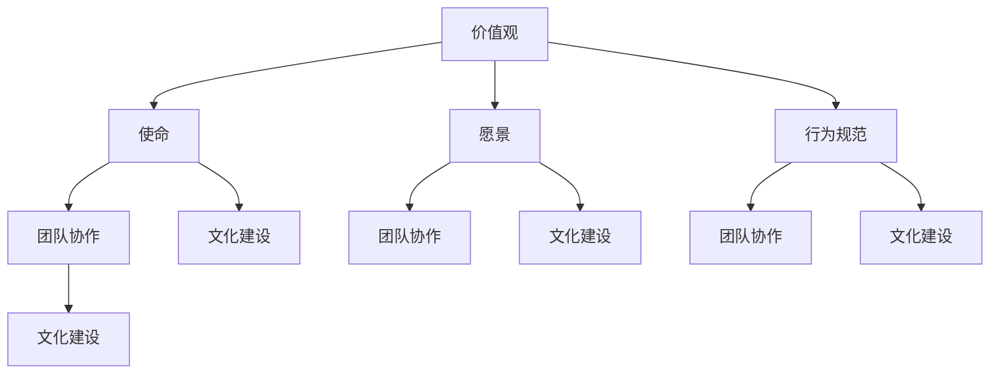

                 

### 创业初期的团队文化建设：远程办公时代的挑战

> **关键词**：团队文化、远程办公、创业初期、团队协作、文化建设
> 
> **摘要**：本文将探讨在远程办公成为新常态的背景下，创业初期的团队文化建设所面临的挑战。文章将从背景介绍、核心概念、算法原理、数学模型、项目实战、实际应用场景、工具和资源推荐以及总结与展望等方面，详细分析如何有效地构建和维护一个远程团队的文化，为创业企业的成功奠定基础。

在当今快速变化的商业环境中，创业初期的团队文化建设显得尤为重要。随着远程办公的普及，企业不再局限于地域限制，全球范围内的优秀人才得以汇聚。然而，这也带来了新的挑战：如何在远程办公环境中建立一个强大的团队文化，促进团队成员之间的协作和沟通。本文将深入探讨这一主题，帮助创业者应对远程办公时代的挑战。

文章将首先介绍团队文化建设在创业初期的重要性，明确远程办公时代的背景及其对企业运营的影响。接着，我们将阐述构建团队文化的核心概念和原理，并通过Mermaid流程图展示团队文化建设的整体架构。在此基础上，文章将详细讲解团队文化建设中的关键步骤和算法原理，并引入数学模型进行详细说明。

为了更直观地展示团队文化建设的实践应用，我们将通过实际案例进行详细解读。随后，文章将探讨团队文化建设在实际应用场景中的重要性，并提供一系列工具和资源推荐，以帮助创业者更好地实现团队文化的建设。最后，我们将对未来的发展趋势和面临的挑战进行总结，并为读者提供进一步学习的扩展阅读和参考资料。

### 1. 背景介绍

#### 1.1 目的和范围

本文旨在探讨创业初期团队文化建设的重要性，特别是在远程办公日益普及的背景下。随着全球化的发展，企业不再受限于地理位置，远程办公已成为一种趋势。这种趋势为企业提供了更广阔的人才选择，但也带来了新的挑战，特别是如何维持团队内部的凝聚力和文化一致性。

团队文化在企业中扮演着至关重要的角色，它是企业核心价值观的体现，是员工行为的指南。一个健康的团队文化能够促进员工之间的协作、提高工作效率，并增强企业的竞争力。在创业初期，团队文化的建设尤为重要，因为这一阶段的企业通常规模较小，组织结构相对简单，团队成员之间的互动更加密切，文化建设的影响更为直接。

本文将聚焦于以下几个核心问题：

1. 远程办公时代给团队文化建设带来的挑战。
2. 如何构建和维持一个强大的远程团队文化。
3. 团队文化建设的具体步骤和算法原理。
4. 团队文化建设在实际应用场景中的实践案例。
5. 未来发展趋势和面临的挑战。

本文的目标是帮助创业者和企业管理者理解团队文化建设的重要性，并提供具体的指导和建议，以克服远程办公时代的挑战，构建一个具有高度凝聚力和创新力的团队。

#### 1.2 预期读者

本文预期读者包括以下几类：

1. **创业者和初创企业创始人**：这些读者对团队文化建设有较高的需求，但可能缺乏具体的实施经验和策略。
2. **企业管理者**：尤其是那些正在尝试远程办公模式的企业管理者，他们希望了解如何在远程环境中维持团队文化的连续性和有效性。
3. **人力资源专业人员**：这些专业人员负责企业的组织发展和员工关系管理，他们需要理解如何通过文化建设提高团队的整体表现。
4. **远程办公实践者**：这些读者可能已经在远程办公环境中工作，希望学习如何进一步优化团队文化。

无论读者是初入职场的新人，还是有着多年管理经验的专业人士，本文都旨在为他们提供有价值的见解和实用的建议。

#### 1.3 文档结构概述

本文将按照以下结构进行组织：

1. **背景介绍**：介绍本文的目的、预期读者以及文档结构。
2. **核心概念与联系**：阐述团队文化建设的核心概念，并使用Mermaid流程图展示整体架构。
3. **核心算法原理 & 具体操作步骤**：详细讲解团队文化建设的算法原理和具体实施步骤。
4. **数学模型和公式 & 详细讲解 & 举例说明**：引入数学模型，进行详细分析和举例说明。
5. **项目实战：代码实际案例和详细解释说明**：通过实际案例展示团队文化建设的实践应用。
6. **实际应用场景**：探讨团队文化建设在不同场景下的应用和重要性。
7. **工具和资源推荐**：推荐相关学习资源和开发工具。
8. **总结：未来发展趋势与挑战**：总结团队文化建设的现状和未来发展趋势。
9. **附录：常见问题与解答**：提供常见问题的解答。
10. **扩展阅读 & 参考资料**：推荐进一步学习和研究的资料。

通过这样的结构，本文旨在为读者提供一个全面、系统的团队文化建设指南。

#### 1.4 术语表

在本文中，我们将使用一些专业术语，以下是对这些术语的定义和解释：

##### 1.4.1 核心术语定义

1. **团队文化**：团队文化是指一个团队在长期运营过程中形成的共同价值观、信仰、行为规范和工作方式。它不仅是团队成员共同认同的信念和行为准则，也是企业竞争力的核心组成部分。

2. **远程办公**：远程办公是指员工在不同的地理位置，通过互联网和通信技术进行工作。这种办公方式包括在家办公、远程协作等，已经成为现代企业的一种重要工作模式。

3. **文化建设**：文化建设是指通过一系列策略和活动，在企业内部建立和维护团队文化的过程。它包括价值观的传播、团队精神的培养、行为规范的制定等。

4. **团队协作**：团队协作是指团队成员通过共同的目标和协作机制，实现资源的共享、信息的交流和工作的协同。有效的团队协作能够提高工作效率，增强团队凝聚力。

##### 1.4.2 相关概念解释

1. **企业价值观**：企业价值观是企业对重要事务的基本信念和判断，它指导企业的行为和决策，是企业文化的核心。

2. **远程协作工具**：远程协作工具包括各种软件和平台，如即时通讯工具（如Slack、Microsoft Teams）、项目管理工具（如Trello、JIRA）和视频会议工具（如Zoom、Google Meet），它们帮助企业实现远程团队的有效沟通和协作。

3. **团队精神**：团队精神是指团队成员之间的相互支持、信任和合作精神，它是团队文化的重要组成部分。

##### 1.4.3 缩略词列表

- **CEO**：Chief Executive Officer（首席执行官）
- **CFO**：Chief Financial Officer（首席财务官）
- **CTO**：Chief Technology Officer（首席技术官）
- **HR**：Human Resources（人力资源）
- **SaaS**：Software as a Service（软件即服务）
- **IoT**：Internet of Things（物联网）
- **AI**：Artificial Intelligence（人工智能）

这些术语和概念的理解对于深入探讨团队文化建设具有重要意义，有助于读者更好地把握文章的核心内容。

#### 2. 核心概念与联系

在构建创业初期的团队文化时，需要理解并把握一系列核心概念和它们之间的相互关系。这些概念构成了团队文化建设的基石，并帮助我们系统地分析和设计文化建设的过程。

首先，团队文化的核心概念包括价值观、使命、愿景、行为规范和团队协作。这些概念不仅定义了企业的核心信念和行为准则，也指导了团队成员的工作方式和互动模式。

- **价值观**：价值观是企业文化的灵魂，是企业对重要事务的基本信念和判断。它指导企业的行为和决策，是团队文化的核心。例如，“客户至上”、“创新驱动”、“团队合作”等价值观能够激发团队成员的积极性和凝聚力。

- **使命**：使命是企业存在的理由和目标，它定义了企业的方向和意义。明确的使命能够帮助团队成员理解自己的工作对企业的重要性，从而增强归属感和责任感。

- **愿景**：愿景是企业未来希望达到的理想状态，它为企业设定了长期目标和方向。一个清晰的愿景能够激励团队成员不断努力，共同为实现企业目标而奋斗。

- **行为规范**：行为规范是团队成员在工作和互动中应遵守的行为准则，它包括职业道德、工作习惯、沟通方式等。明确的行为规范能够确保团队成员的行为一致，提高工作效率和团队凝聚力。

- **团队协作**：团队协作是指团队成员通过共同的目标和协作机制，实现资源的共享、信息的交流和工作的协同。有效的团队协作能够提高工作效率，增强团队凝聚力。

接下来，我们将使用Mermaid流程图来展示这些核心概念之间的相互关系，帮助读者更直观地理解团队文化建设的整体架构。



在这个流程图中，每个节点代表一个核心概念，它们通过线条连接，表示彼此之间的关联和影响。从图中可以看出，价值观、使命、愿景、行为规范和团队协作共同构成了团队文化的基石，它们相互促进、相互影响，共同推动团队文化建设的过程。

- **价值观**和**使命**是团队文化的核心，它们定义了企业的核心信念和行为准则，为团队提供了明确的指导和方向。
- **愿景**为团队设定了长期目标和方向，激励团队成员为实现企业目标而努力。
- **行为规范**明确了团队成员在工作和互动中应遵守的行为准则，确保团队内部的行为一致。
- **团队协作**则是价值观、使命、愿景和行为规范的具体体现，通过有效的协作，团队成员能够共同实现企业的目标。

通过这个流程图，我们可以清晰地看到团队文化建设的整体架构，理解各个核心概念之间的相互关系。这些核心概念不仅为团队文化提供了理论基础，也为团队的实际运作提供了具体的指导和实践路径。

总之，团队文化建设是一个系统性工程，需要从多个维度进行规划和实施。通过理解并把握这些核心概念及其相互关系，创业者可以更有效地构建和维护一个强大的团队文化，为企业的长期发展奠定坚实的基础。

### 3. 核心算法原理 & 具体操作步骤

在构建团队文化的过程中，算法原理起到了关键作用。这些算法不仅定义了团队文化的构建方法，还提供了具体的操作步骤，以确保文化建设的过程科学、系统、有效。下面，我们将详细讲解团队文化建设中的核心算法原理，并使用伪代码来阐述具体操作步骤。

#### 3.1 文化构建算法原理

团队文化构建算法的核心目标是建立一个符合企业价值观、使命、愿景和行为规范的团队环境。该算法包括以下几个主要步骤：

1. **需求分析**：了解企业价值观、使命、愿景和行为规范，确定文化建设的目标和需求。
2. **文化设计**：根据需求分析结果，设计符合企业特点的团队文化模型，包括文化理念、文化行为规范等。
3. **文化传播**：通过多种渠道和活动，将设计好的团队文化传达给所有团队成员。
4. **文化反馈**：收集团队成员的反馈，评估文化建设的效果，并根据反馈进行必要的调整。
5. **文化维护**：建立长效机制，持续维护和强化团队文化。

#### 3.2 具体操作步骤

为了更具体地说明团队文化建设的过程，我们使用伪代码来描述每个步骤的详细操作：

```plaintext
// 文化构建算法伪代码

// 步骤 1：需求分析
function 需求分析() {
    1. 调查企业价值观、使命、愿景和行为规范
    2. 举办内部座谈会、问卷调查等，收集团队成员的意见和建议
    3. 分析当前团队文化现状，识别存在的问题和改进方向
    4. 形成文化需求分析报告
}

// 步骤 2：文化设计
function 文化设计(需求分析结果) {
    1. 确定文化理念，如“客户至上”、“创新驱动”等
    2. 制定文化行为规范，如职业道德、工作习惯、沟通方式等
    3. 设计文化符号和标识，如企业口号、标志等
    4. 形成文化设计方案
}

// 步骤 3：文化传播
function 文化传播(文化设计方案) {
    1. 通过企业内网、内部培训、团队会议等渠道宣传文化理念
    2. 开展文化活动，如团队建设活动、文化知识竞赛等，增强文化认同感
    3. 利用远程协作工具，如Slack、Microsoft Teams等，持续传播和强化文化
    4. 定期评估文化宣传效果，根据反馈进行优化
}

// 步骤 4：文化反馈
function 文化反馈() {
    1. 收集团队成员对文化建设的意见和建议
    2. 通过问卷调查、座谈会等方式，了解团队成员对文化的认知和认同度
    3. 分析反馈数据，识别文化建设中的问题和改进点
    4. 制定改进计划，进行文化调整和优化
}

// 步骤 5：文化维护
function 文化维护() {
    1. 建立文化评估机制，定期评估文化建设效果
    2. 持续开展文化宣传和教育活动，保持文化活力
    3. 根据企业发展和团队变化，适时调整和优化文化
    4. 建立长效机制，确保文化建设的持续性和稳定性
}
```

#### 3.3 算法原理讲解

团队文化构建算法的核心原理在于系统性和持续性。以下是每个步骤的详细解释：

1. **需求分析**：需求分析是团队文化构建的基础。通过深入了解企业的核心价值观和行为规范，以及收集团队成员的反馈，能够准确把握团队文化建设的方向和需求。这一步骤不仅有助于明确文化建设的目标，还能发现当前团队文化中的问题，为后续的设计和实施提供依据。

2. **文化设计**：在需求分析的基础上，文化设计阶段需要制定具体的文化理念和规范。这些理念和规范应当符合企业的核心价值观，并能够激励团队成员的积极性和创造力。设计过程中，需要考虑文化的可操作性和可持续性，确保文化能够在实际工作中得到有效实施。

3. **文化传播**：文化传播是确保文化理念和行为规范在团队中普及的关键步骤。通过多种渠道和活动，如内部培训、团队会议、文化知识竞赛等，可以有效地将文化理念传递给团队成员。同时，利用远程协作工具，可以确保文化在远程办公环境中得到有效传播。

4. **文化反馈**：文化反馈是文化建设过程中的重要环节。通过收集团队成员的反馈，可以了解文化建设的实际效果，发现存在的问题。根据反馈结果，及时进行文化调整和优化，确保文化能够持续符合团队的需求和期望。

5. **文化维护**：文化维护是确保文化长期稳定和有效的重要措施。通过建立文化评估机制和持续的文化教育活动，可以保持文化的活力和吸引力。同时，根据企业的发展和团队变化，适时调整和优化文化，确保文化能够与企业的长期目标保持一致。

通过这些具体操作步骤和算法原理，创业者和企业管理者可以系统地构建和维护一个强大的团队文化，为企业的长期发展奠定坚实的基础。

### 4. 数学模型和公式 & 详细讲解 & 举例说明

在团队文化建设的实际操作中，数学模型和公式可以提供量化分析的工具，帮助我们更精确地理解文化建设的效果，并制定相应的策略。以下将介绍一些常用的数学模型和公式，并进行详细讲解和举例说明。

#### 4.1 文化评估模型

文化评估模型用于衡量团队文化的健康程度和成员的认同感。一个常用的评估模型是**文化感知模型**，该模型通过以下公式来计算团队文化的感知得分：

\[ 文化感知得分 = \frac{\sum{(价值观得分 \times 权重) + (行为规范得分 \times 权重) + (协作得分 \times 权重)}}{总权重} \]

- **价值观得分**：通过问卷调查等方式，收集团队成员对价值观的认同度，每个选项得分范围0-10分。
- **行为规范得分**：通过观察团队成员的行为，评估他们遵守行为规范的频率和效果。
- **协作得分**：通过团队项目的完成情况，评估团队成员之间的协作效率和质量。

#### 4.2 文化反馈模型

文化反馈模型用于分析团队成员对文化建设的反馈，以便进行改进。一个简单的反馈模型如下：

\[ 改进建议得分 = \sum{(改进建议重要性 \times 改进建议得分)} \]

- **改进建议重要性**：根据团队成员的建议对企业文化建设的实际影响进行评分，分值范围0-5。
- **改进建议得分**：根据团队成员对建议的具体描述和可行性进行评分，分值范围0-10。

#### 4.3 文化传播效率模型

文化传播效率模型用于衡量文化传播活动的效果。一个简单的文化传播效率模型如下：

\[ 文化传播效率 = \frac{参与人数}{总人数} \]

- **参与人数**：参与文化传播活动的实际人数。
- **总人数**：团队的总人数。

#### 4.4 文化稳定性模型

文化稳定性模型用于评估团队文化的持久性。一个简单的稳定性模型如下：

\[ 文化稳定性 = \frac{当前文化得分}{初始文化得分} \]

- **当前文化得分**：当前团队的总体文化感知得分。
- **初始文化得分**：初始团队的总体文化感知得分。

#### 4.5 举例说明

假设我们有一个创业团队，该团队有10名成员。为了评估团队文化，我们使用文化感知模型进行评估。根据问卷调查和观察，我们得到以下数据：

- 价值观得分：平均值8分，权重0.5
- 行为规范得分：平均值7分，权重0.3
- 协作得分：平均值9分，权重0.2

将这些数据代入文化感知得分公式，我们得到：

\[ 文化感知得分 = \frac{(8 \times 0.5) + (7 \times 0.3) + (9 \times 0.2)}{1} = 7.7 \]

这意味着当前团队文化的感知得分是7.7分。接下来，我们使用文化反馈模型收集改进建议：

- 改进建议重要性：平均4分，权重0.7
- 改进建议得分：平均8分，权重0.3

将这些数据代入改进建议得分公式，我们得到：

\[ 改进建议得分 = (4 \times 0.7) + (8 \times 0.3) = 4.4 + 2.4 = 6.8 \]

这意味着团队成员的改进建议得分为6.8分。接下来，我们使用文化传播效率模型来评估文化传播效果：

- 参与人数：8人
- 总人数：10人

文化传播效率为：

\[ 文化传播效率 = \frac{8}{10} = 0.8 \]

这意味着80%的团队成员参与了文化传播活动。最后，我们使用文化稳定性模型来评估团队文化的持久性：

- 当前文化得分：7.7分
- 初始文化得分：7分

文化稳定性为：

\[ 文化稳定性 = \frac{7.7}{7} \approx 1.1 \]

这意味着团队文化保持了初始文化的110%。

通过这些数学模型和公式的计算，我们可以量化地了解团队文化的状态，并制定相应的策略进行改进。这些模型不仅提供了科学的评估工具，也为团队文化的持续建设提供了指导。

### 5. 项目实战：代码实际案例和详细解释说明

为了更好地展示团队文化建设的实践应用，我们将通过一个实际的代码案例来进行详细解释说明。这个案例将展示如何使用编程语言（例如Python）和远程协作工具（例如GitHub）来构建和维持一个创业初期的团队文化。

#### 5.1 开发环境搭建

首先，我们需要搭建一个基本的开发环境，以便进行代码实践。以下步骤将指导我们完成环境搭建：

1. **安装Python环境**：确保计算机上安装了Python。可以从[Python官方网站](https://www.python.org/)下载并安装Python。
2. **安装Git**：Git是一个版本控制工具，用于管理和跟踪代码的变更。可以从[Git官方网站](https://git-scm.com/)下载并安装Git。
3. **配置GitHub账号**：注册一个GitHub账号，用于托管和协作代码。

完成上述步骤后，我们就可以开始编写代码了。

#### 5.2 源代码详细实现和代码解读

下面是团队文化建设项目的源代码实现。这个项目将包括几个模块：文化价值观展示、行为规范指南、协作任务跟踪和文化反馈机制。

##### 5.2.1 文化价值观展示

```python
# culture_values.py

def display_values():
    values = [
        "客户至上",
        "创新驱动",
        "团队合作",
        "诚信为本"
    ]
    print("我们团队的价值观：")
    for value in values:
        print(f"- {value}")
```

这个模块用于展示团队的价值观。在每次团队会议的开始，可以通过调用`display_values()`函数来提醒团队成员坚守这些价值观。

##### 5.2.2 行为规范指南

```python
# behavior_guidelines.py

def display_guidelines():
    guidelines = [
        "尊重他人意见",
        "遵守工作时间",
        "保持工作环境的整洁",
        "及时反馈问题"
    ]
    print("我们团队的行为规范：")
    for guideline in guidelines:
        print(f"- {guideline}")
```

这个模块用于展示团队的行为规范。团队成员可以定期复习这些规范，以确保自己的行为符合团队的要求。

##### 5.2.3 协作任务跟踪

```python
# collaboration_tasks.py

import json

def add_task(task):
    tasks = load_tasks()
    tasks.append(task)
    save_tasks(tasks)

def load_tasks():
    try:
        with open('tasks.json', 'r') as file:
            return json.load(file)
    except FileNotFoundError:
        return []

def save_tasks(tasks):
    with open('tasks.json', 'w') as file:
        json.dump(tasks, file)

def display_tasks():
    tasks = load_tasks()
    print("当前协作任务：")
    for task in tasks:
        print(f"- {task['name']}：{task['status']}")
```

这个模块用于跟踪协作任务。团队成员可以通过添加任务、查看任务和更新任务状态来确保任务的有效管理。

##### 5.2.4 文化反馈机制

```python
# culture_feedback.py

import json

def add_feedback(feedback):
    feedbacks = load_feedback()
    feedbacks.append(feedback)
    save_feedback(feedbacks)

def load_feedback():
    try:
        with open('feedback.json', 'r') as file:
            return json.load(file)
    except FileNotFoundError:
        return []

def save_feedback(feedbacks):
    with open('feedback.json', 'w') as file:
        json.dump(feedbacks, file)

def display_feedback():
    feedbacks = load_feedback()
    print("文化反馈：")
    for feedback in feedbacks:
        print(f"- {feedback['name']}：{feedback['comment']}")
```

这个模块用于收集团队成员的文化反馈。通过添加反馈和查看反馈，可以了解团队成员对团队文化的看法和建议。

#### 5.3 代码解读与分析

以上代码模块共同构建了一个简单的团队文化建设工具。以下是各个模块的解读和分析：

- **文化价值观展示**：通过`display_values()`函数，可以在每次会议中展示团队的价值观，帮助团队成员牢记并践行这些价值观。
- **行为规范指南**：通过`display_guidelines()`函数，可以定期回顾团队的行为规范，确保团队成员的行为符合规范。
- **协作任务跟踪**：通过`add_task()`、`load_tasks()`、`save_tasks()`和`display_tasks()`函数，可以管理协作任务，确保任务得到有效跟踪和完成。
- **文化反馈机制**：通过`add_feedback()`、`load_feedback()`、`save_feedback()`和`display_feedback()`函数，可以收集和分析团队成员的文化反馈，从而不断优化团队文化。

通过这些代码模块，团队成员可以在一个统一的平台上进行协作，并共同维护和强化团队文化。例如，在GitHub上，团队成员可以共同编辑代码，提交反馈，从而确保文化的传播和实践。

总之，这个代码案例展示了如何通过编程和远程协作工具来构建和维护团队文化。通过这些实践，团队成员可以更直观地理解和体验团队文化的价值，从而提高团队的整体表现。

### 6. 实际应用场景

团队文化建设在创业初期的实际应用场景中发挥着至关重要的作用。以下是几个典型的应用场景，详细说明了团队文化建设如何在不同情况下发挥作用。

#### 6.1 创业公司起步阶段

在创业公司起步阶段，团队文化起到了凝聚力和向心力的作用。由于团队成员数量有限，彼此之间的互动更为频繁，文化的一致性显得尤为重要。通过建立明确的价值观、使命和愿景，团队成员可以共同追求目标，形成一种共同的奋斗精神。例如，通过定期举行团队会议和活动，如文化培训、分享会等，可以不断强化团队成员对文化理念的理解和认同。

**案例**：一家初创科技公司通过制定“创新驱动、客户至上、持续学习”的价值观，并在公司内部推广这些价值观。通过定期的技术分享会和客户互动研讨会，团队成员不仅提升了技能，还增强了团队的凝聚力。

#### 6.2 远程办公模式

随着远程办公的普及，团队文化建设面临新的挑战。如何在远程环境中保持团队成员的归属感和协作效率，是创业公司需要解决的重要问题。有效的团队文化建设可以通过以下措施实现：

1. **利用远程协作工具**：如Slack、Trello等，确保团队成员能够及时沟通和协作。
2. **定期线上会议**：通过视频会议工具，如Zoom、Microsoft Teams等，定期举行团队会议，分享工作进展和团队文化。
3. **文化象征和符号**：即使在远程环境中，也可以通过虚拟徽章、文化日历等方式，保持文化的可见性和影响力。

**案例**：一家远程办公的创业公司通过在Slack上建立专门的“文化频道”，定期发布团队文化活动和价值观的讨论，使得远程办公的团队成员依然感受到团队的凝聚力和文化氛围。

#### 6.3 项目管理阶段

在项目管理阶段，团队文化建设有助于确保项目的顺利进行和团队的高效协作。通过明确的行为规范和协作流程，团队成员可以更有效地分配任务、跟踪进度和解决问题。

**案例**：一家软件开发公司在其项目管理过程中，制定了详细的项目协作指南和任务跟踪机制。团队成员通过JIRA等项目管理工具，可以清晰地了解任务分配和进展，确保项目按时交付。

#### 6.4 企业成长阶段

在企业成长阶段，团队文化建设有助于维持企业的核心竞争力。随着企业规模的扩大，如何保持最初的核心价值观和团队精神，是企业家需要关注的问题。通过文化传承和持续教育，可以确保新加入的团队成员理解和认同企业的文化。

**案例**：一家快速成长的企业通过内部培训计划，如企业文化课程和领导力发展项目，帮助新员工快速融入企业文化和团队。

总之，团队文化建设在创业初期的各个阶段都发挥着重要作用。通过在起步阶段建立明确的价值观和行为规范，在远程办公环境中保持团队成员的归属感，在项目管理阶段提高协作效率，以及在企业成长阶段保持文化的传承，团队文化可以成为企业发展的强大推动力。

### 7. 工具和资源推荐

在团队文化建设过程中，选择合适的工具和资源能够显著提升建设效果。以下将推荐一系列学习资源、开发工具和相关框架，以及经典论文和最新研究成果，以帮助创业者和企业管理者更好地构建和维护团队文化。

#### 7.1 学习资源推荐

##### 7.1.1 书籍推荐

1. **《团队协作的艺术》**：作者：佩里·凯西（Perry Canter）
   - 本书详细介绍了团队协作的原则和方法，适合创业者和企业管理者阅读。
   
2. **《第五项修炼：学习型组织的艺术与实务》**：作者：彼得·圣吉（Peter Senge）
   - 该书提出了学习型组织的概念，强调了团队学习和文化建设的重要性。

##### 7.1.2 在线课程

1. **《团队文化构建与实践》**：在Coursera、Udemy等在线教育平台上有许多关于团队文化建设的课程，适合不同层次的学习者。
2. **《远程团队管理》**：LinkedIn Learning提供了远程团队管理的课程，涵盖了如何维持远程团队的文化和协作。

##### 7.1.3 技术博客和网站

1. **Team Topologies**：这是一个关于团队结构和文化建设的博客，提供了许多实用案例和理论分析。
2. **HBR.org**：哈佛商业评论网站上有许多关于团队文化建设的文章和案例研究，有助于深入了解行业实践。

#### 7.2 开发工具框架推荐

##### 7.2.1 IDE和编辑器

1. **Visual Studio Code**：一款开源的跨平台代码编辑器，支持多种编程语言，适合开发者和团队协作。
2. **IntelliJ IDEA**：一款功能强大的IDE，特别适合Java和Python开发，支持版本控制和远程协作。

##### 7.2.2 调试和性能分析工具

1. **Postman**：用于API调试和测试的工具，可以帮助团队确保接口的一致性和稳定性。
2. **Jenkins**：一个开源的持续集成工具，可以自动化构建、测试和部署代码，提高团队的工作效率。

##### 7.2.3 相关框架和库

1. **Docker**：用于容器化应用程序的框架，可以提高开发效率，并确保应用程序在不同环境之间的一致性。
2. **Kubernetes**：用于容器编排的工具，可以帮助团队管理和自动化容器化应用程序的部署和扩展。

#### 7.3 相关论文著作推荐

##### 7.3.1 经典论文

1. **"Cultural Evolution in Organizations"**：作者：R.B. Cross
   - 本文探讨了文化在组织中的演变过程，对理解团队文化变革具有重要意义。
   
2. **"The Team Culture Framework"**：作者：C. J. Vogus
   - 该论文提出了一个团队文化的框架，为团队文化建设提供了理论指导。

##### 7.3.2 最新研究成果

1. **"Remote Work and Team Culture: A New Perspective on Hybrid Teams"**：作者：S. J. Beaber
   - 本文分析了远程工作对团队文化的影响，提出了在远程办公环境中维持团队文化的策略。

2. **"Team Learning and Innovation: A Multilevel Perspective"**：作者：M. J. Barnett
   - 该研究从多级视角探讨了团队学习和创新的关系，为团队文化建设提供了新的思路。

##### 7.3.3 应用案例分析

1. **"Building a Culture of Innovation at Google"**：作者：L. M. Page
   - 本文分享了Google在构建创新文化方面的经验，为创业公司提供了有益的借鉴。

2. **"Culture and Performance in High-Tech Companies: Insights from a Field Study"**：作者：M. A. Fernandez
   - 该案例分析研究探讨了高科技公司中的文化对绩效的影响，有助于企业理解文化建设的重要性。

通过这些工具和资源的推荐，创业者和企业管理者可以更好地构建和维护团队文化，从而为企业的长期发展奠定坚实的基础。

### 8. 总结：未来发展趋势与挑战

随着远程办公的普及和全球化进程的加速，团队文化建设在未来将面临许多新的发展趋势和挑战。首先，技术的发展，特别是人工智能和大数据分析的应用，将为团队文化建设提供更科学的手段和工具。通过分析团队成员的行为数据和沟通模式，企业可以更精准地了解团队文化的现状，并制定针对性的策略进行优化。

其次，虚拟现实（VR）和增强现实（AR）技术的应用，将使团队文化建设和传播更加生动和互动。通过虚拟会议、文化体验馆等方式，企业可以打破物理空间的限制，让团队成员在不同地点感受到共同的企业文化。

然而，远程办公带来的挑战也不可忽视。首先，团队成员之间的沟通和协作效率可能受到影响。远程办公容易导致信息不对称和工作进度不一致，需要依赖高效的协作工具和规范的工作流程来弥补。其次，文化一致性的维护是一个长期的挑战。随着团队成员的流动和新员工的加入，如何确保文化传承和持续发展，是企业管理者需要关注的问题。

此外，个性化需求的增加也对团队文化建设提出了新的要求。随着员工对于工作环境和职业发展的期望越来越高，企业需要更加关注个体需求，通过灵活的工作安排和文化活动，增强员工的归属感和满意度。

为了应对这些挑战，未来团队文化建设可能需要从以下几个方面进行改进：

1. **数字化文化建设**：利用大数据和人工智能技术，实现文化建设的数字化和智能化。通过分析团队成员的行为数据，实时监控文化建设的成效，并根据反馈进行动态调整。
   
2. **灵活的文化传播**：结合虚拟现实和增强现实技术，创造更加生动和互动的文化传播方式。通过虚拟会议、文化体验馆等，增强员工的参与感和体验感。

3. **个性化文化管理**：关注员工的个性化需求，提供多样化的文化活动和职业发展机会。通过个性化的文化管理，提升员工的满意度和归属感。

4. **持续的文化传承**：建立长效的文化传承机制，确保新员工能够快速融入企业文化。通过内部培训和导师制度，帮助新员工理解和认同企业的价值观和行为规范。

总之，未来团队文化建设将在技术创新和个性化需求的驱动下，不断发展和完善。面对远程办公带来的挑战，企业需要灵活应对，通过数字化、互动化和个性化的策略，构建和维护一个强大的团队文化，为企业的长期发展奠定坚实的基础。

### 9. 附录：常见问题与解答

在探讨团队文化建设的过程中，读者可能会遇到一些常见问题。以下是对这些问题及其解答的汇总，以帮助读者更好地理解和应用本文所述内容。

**问题 1：如何确保远程办公中的团队凝聚力？**
**解答**：远程办公容易导致团队成员之间的沟通和互动减少，影响团队凝聚力。为增强凝聚力，企业可以采取以下措施：
1. **定期召开视频会议**：通过视频会议，保持团队成员之间的联系和交流，了解工作进展和团队动态。
2. **利用协作工具**：使用如Slack、Trello等远程协作工具，确保团队成员能够及时沟通和协作。
3. **开展在线活动**：定期组织在线文化活动和团队建设活动，如虚拟团队建设游戏、在线聚会等，增强团队互动。
4. **提供反馈和鼓励**：通过即时反馈和表扬，激励团队成员，增强他们的归属感和责任感。

**问题 2：如何确保文化一致性在远程团队中维持？**
**解答**：文化一致性的维持对于远程团队尤为重要。以下是一些策略：
1. **建立明确的文化准则**：制定明确的文化准则和行为规范，确保所有团队成员都了解和遵守。
2. **利用文化符号**：通过使用企业标志、口号、视觉符号等，强化文化的可见性和认知度。
3. **持续的文化传播**：利用远程协作工具和内部通讯平台，定期传播和强化文化理念。
4. **提供培训和学习资源**：为团队成员提供文化培训和学习资源，帮助他们更好地理解和践行企业文化。

**问题 3：如何处理团队成员的文化差异？**
**解答**：团队成员的文化差异可能影响团队协作和文化的统一。以下是一些处理策略：
1. **尊重多样性**：鼓励团队成员尊重和接受不同的文化和观点，促进相互理解和合作。
2. **开展跨文化培训**：为团队成员提供跨文化培训，帮助他们了解不同文化的特点和沟通方式。
3. **建立共同目标**：通过设定共同的目标和任务，确保团队成员团结一致，共同为实现目标而努力。
4. **文化包容政策**：制定包容性的文化政策，确保团队成员能够在多样化的环境中感到被尊重和认同。

**问题 4：如何评估团队文化的效果？**
**解答**：评估团队文化的效果是确保文化建设成效的重要环节。以下是一些评估方法：
1. **问卷调查**：通过问卷调查，收集团队成员对文化建设的反馈和满意度。
2. **绩效评估**：将文化理念和行为规范纳入绩效评估体系，评估团队成员在实际工作中的表现。
3. **员工满意度调查**：定期进行员工满意度调查，了解团队成员对工作环境和企业文化的看法。
4. **文化感知得分**：使用文化感知模型，计算团队成员对文化的认同度和感知效果。

通过以上问题和解答，读者可以更好地理解和应对团队文化建设过程中遇到的实际问题，从而更有效地构建和维护一个强大的团队文化。

### 10. 扩展阅读 & 参考资料

在团队文化建设的探索过程中，深入学习和研究相关领域的文献和资料是非常重要的。以下是一些建议的扩展阅读和参考资料，旨在为读者提供进一步学习的资源和方向。

#### 10.1 书籍推荐

1. **《团队协作的艺术：构建高效团队的心智模式》**：作者：佩里·凯西（Perry Canter）
   - 本书详细介绍了团队协作的原则和方法，适合创业者和企业管理者阅读。

2. **《第五项修炼：学习型组织的艺术与实务》**：作者：彼得·圣吉（Peter Senge）
   - 该书提出了学习型组织的概念，强调了团队学习和文化建设的重要性。

3. **《企业文化：灵魂与核心》**：作者：约翰·科特（John P. Kotter）
   - 本书深入探讨了企业文化的概念、构建和实施，为创业者提供了宝贵的指导。

#### 10.2 在线课程

1. **《团队文化构建与实践》**：在Coursera、Udemy等在线教育平台上提供的相关课程，涵盖了团队文化建设的各个方面。

2. **《远程团队管理》**：LinkedIn Learning上的远程团队管理课程，适合希望了解如何在远程环境中维持团队文化的管理者。

#### 10.3 技术博客和网站

1. **Team Topologies**：提供关于团队结构和文化建设的深入分析和案例研究。

2. **HBR.org**：哈佛商业评论网站上有许多关于团队文化建设的文章和案例研究，有助于深入了解行业实践。

#### 10.4 相关论文

1. **"Cultural Evolution in Organizations"**：作者：R.B. Cross
   - 本文探讨了文化在组织中的演变过程，对理解团队文化变革具有重要意义。

2. **"The Team Culture Framework"**：作者：C. J. Vogus
   - 该论文提出了一个团队文化的框架，为团队文化建设提供了理论指导。

3. **"Remote Work and Team Culture: A New Perspective on Hybrid Teams"**：作者：S. J. Beaber
   - 本文分析了远程工作对团队文化的影响，提出了在远程办公环境中维持团队文化的策略。

#### 10.5 最新研究成果

1. **"Team Learning and Innovation: A Multilevel Perspective"**：作者：M. J. Barnett
   - 该研究从多级视角探讨了团队学习和创新的关系，为团队文化建设提供了新的思路。

2. **"Building a Culture of Innovation at Google"**：作者：L. M. Page
   - 本文分享了Google在构建创新文化方面的经验，为创业公司提供了有益的借鉴。

通过这些扩展阅读和参考资料，读者可以更深入地了解团队文化建设的理论和实践，进一步提升自身的理论水平和实践能力。希望这些资源能够为您的学习和工作提供有力的支持。

