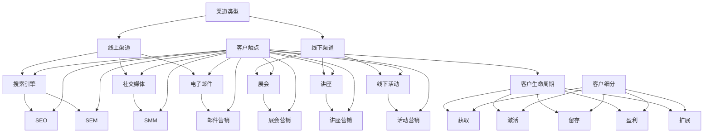

                 

# 创业初期的渠道建设：多元化获客策略的制定与实施

> 关键词：创业初期、渠道建设、获客策略、多元化、实施步骤

> 摘要：本文将深入探讨创业初期企业如何构建多元化的渠道获客策略。我们将从背景介绍、核心概念、算法原理、数学模型、实际应用场景等多个方面，系统性地阐述获客策略的制定与实施过程，以期为创业企业提供切实可行的指导和借鉴。

## 1. 背景介绍

### 1.1 目的和范围

创业初期的企业面临着市场竞争激烈、资源有限、客户获取难度大等挑战。渠道建设作为获取客户的重要手段，其有效性直接关系到企业的生存和发展。本文旨在通过系统阐述多元化获客策略的制定与实施，帮助创业企业提高客户获取效率，降低获客成本，从而在竞争激烈的市场环境中占据一席之地。

### 1.2 预期读者

本文适合创业初期的企业创始人、市场营销人员、渠道拓展人员以及相关领域的研究者阅读。通过本文，读者可以了解到多元化获客策略的理论基础和实践方法，从而更好地指导企业的渠道建设和客户获取工作。

### 1.3 文档结构概述

本文分为以下几个部分：

1. 背景介绍：阐述创业初期渠道建设的必要性和本文的目的。
2. 核心概念与联系：介绍与渠道建设相关的核心概念和架构。
3. 核心算法原理 & 具体操作步骤：详细讲解获客策略的算法原理和实施步骤。
4. 数学模型和公式 & 详细讲解 & 举例说明：介绍支持获客策略的数学模型和具体应用。
5. 项目实战：通过实际案例展示获客策略的具体应用。
6. 实际应用场景：分析多元化获客策略在不同场景下的适用性。
7. 工具和资源推荐：推荐有助于渠道建设和客户获取的工具和资源。
8. 总结：对未来渠道建设和客户获取的发展趋势与挑战进行展望。
9. 附录：常见问题与解答。
10. 扩展阅读 & 参考资料：提供进一步学习的相关资源和文献。

### 1.4 术语表

#### 1.4.1 核心术语定义

- 渠道建设：指企业通过多种途径和方式，建立与维护客户关系，实现客户获取的过程。
- 获客策略：指企业为获取新客户而采取的一系列策略和措施。
- 多元化：指在渠道建设和获客策略中，采用多种渠道和方式，避免过度依赖单一渠道。

#### 1.4.2 相关概念解释

- 渠道：指连接企业与客户的桥梁，包括线上渠道和线下渠道。
- 客户获取成本（CAC）：指企业为获取一个新客户所花费的平均成本。
- 客户终身价值（LTV）：指客户在整个生命周期内为企业带来的总收益。

#### 1.4.3 缩略词列表

- CAC：客户获取成本
- LTV：客户终身价值
- SEO：搜索引擎优化
- SEM：搜索引擎营销
- SMM：社交媒体营销
- CRM：客户关系管理

## 2. 核心概念与联系

### 2.1 核心概念

在渠道建设和获客策略中，以下核心概念至关重要：

1. **渠道类型**：线上渠道（如搜索引擎、社交媒体、电子邮件等）和线下渠道（如展会、讲座、线下活动等）。
2. **客户触点**：企业与客户互动的接触点，包括网站、社交媒体、客服等。
3. **客户生命周期**：从潜在客户到忠诚客户的全过程，包括获取、激活、留存、盈利、扩展五个阶段。
4. **客户细分**：根据客户特征和需求，将客户分为不同群体，实现精准营销。

### 2.2 架构与联系

为了更好地理解渠道建设和获客策略，我们可以使用Mermaid流程图来展示核心概念之间的联系。



通过这个流程图，我们可以清晰地看到渠道类型、客户触点、客户生命周期和客户细分等核心概念之间的联系，从而为渠道建设和获客策略的制定提供有力的支持。

## 3. 核心算法原理 & 具体操作步骤

### 3.1 算法原理

在渠道建设和获客策略中，核心算法原理包括：

1. **客户行为分析**：通过分析客户的行为数据，了解客户需求和行为特征，从而优化渠道建设和获客策略。
2. **客户细分**：根据客户特征和行为数据，将客户分为不同群体，实现精准营销。
3. **渠道优化**：通过数据分析和实验，找出最有效的渠道和方式，降低客户获取成本，提高客户转化率。

### 3.2 具体操作步骤

以下是制定和实施多元化获客策略的具体操作步骤：

#### 步骤1：客户行为分析

1. **数据收集**：收集客户在网站、社交媒体、邮件等渠道上的行为数据。
2. **数据清洗**：对收集到的数据进行清洗，去除重复、无效和错误的数据。
3. **数据预处理**：对清洗后的数据进行预处理，包括数据格式转换、缺失值填充、异常值处理等。
4. **特征提取**：从预处理后的数据中提取有助于客户细分的特征，如浏览时长、点击次数、购买频率等。

#### 步骤2：客户细分

1. **聚类分析**：使用聚类算法（如K-means、DBSCAN等）对客户进行分类，形成不同的客户群体。
2. **特征分析**：对每个客户群体进行特征分析，了解其需求和行为特征。
3. **细分评估**：评估每个客户群体的价值和潜力，确定重点关注的客户群体。

#### 步骤3：渠道优化

1. **渠道分析**：分析不同渠道的ROI（投资回报率），确定最有效的渠道。
2. **实验设计**：针对重点客户群体，设计A/B测试，比较不同渠道的效果。
3. **优化调整**：根据实验结果，优化渠道策略，降低客户获取成本，提高客户转化率。

#### 步骤4：实施与监控

1. **实施策略**：根据优化结果，制定具体的渠道建设和获客策略。
2. **实施监控**：实时监控渠道效果，调整策略，确保客户获取目标的实现。

### 3.3 伪代码

以下是针对上述步骤的伪代码示例：

```python
# 步骤1：客户行为分析
def analyze_customer_behavior(data):
    cleaned_data = clean_data(data)
    preprocessed_data = preprocess_data(cleaned_data)
    features = extract_features(preprocessed_data)
    return features

# 步骤2：客户细分
def customer_clustering(features):
    clusters = cluster_analysis(features)
    cluster_features = analyze_clusters(clusters)
    return cluster_features

# 步骤3：渠道优化
def optimize_channels(clusters):
    channel_performance = analyze_channels(clusters)
    experiments = design_experiments(channel_performance)
    results = perform_experiments(experiments)
    optimized_channels = optimize_based_on_results(results)
    return optimized_channels

# 步骤4：实施与监控
def implement_and_monitor(optimized_channels):
    implementation_plan = create_implementation_plan(optimized_channels)
    monitor_channel_performance(implementation_plan)
```

通过上述伪代码，我们可以清晰地看到多元化获客策略的算法原理和具体操作步骤，从而为创业企业制定和实施获客策略提供参考。

## 4. 数学模型和公式 & 详细讲解 & 举例说明

### 4.1 数学模型

在多元化获客策略中，常用的数学模型包括：

1. **客户获取成本模型**：
   $$ CAC = \frac{总成本}{总客户数} $$
   其中，总成本包括广告费用、营销费用、人力成本等，总客户数为一定时间内的客户总数。

2. **客户终身价值模型**：
   $$ LTV = \frac{客户平均生命周期内总收益}{100} $$
   其中，客户平均生命周期内总收益为客户在整个生命周期内为企业带来的总收益，通常通过历史数据或预测模型得到。

3. **渠道ROI模型**：
   $$ ROI = \frac{收益 - 成本}{成本} $$
   其中，收益为渠道带来的总收益，成本为渠道建设及运营成本。

### 4.2 公式详细讲解

1. **客户获取成本（CAC）**：

   客户获取成本是衡量渠道建设效果的重要指标。通过计算总成本除以总客户数，可以得出平均每个客户的获取成本。较低的客户获取成本意味着渠道建设更为有效。

2. **客户终身价值（LTV）**：

   客户终身价值反映了客户为企业带来的潜在收益。通过计算客户在整个生命周期内为企业带来的总收益，并将其平均到每个客户，可以评估客户的长期价值。较高的客户终身价值表明客户对企业具有较大的价值。

3. **渠道ROI**：

   渠道ROI反映了渠道的投资回报情况。通过计算收益与成本的差额，并将其除以成本，可以评估渠道的盈利能力。较高的ROI表明渠道具有较高的盈利潜力。

### 4.3 举例说明

假设一家创业企业在一个月内通过搜索引擎、社交媒体和电子邮件渠道分别获取了100个、80个和60个新客户，总成本分别为5000元、3000元和2000元。

1. **客户获取成本（CAC）**：

   $$ CAC = \frac{总成本}{总客户数} = \frac{5000 + 3000 + 2000}{100 + 80 + 60} = \frac{10000}{240} \approx 41.67（元/客户） $$

2. **客户终身价值（LTV）**：

   假设每个客户的平均生命周期为3年，每年为企业带来1000元的收益。

   $$ LTV = \frac{客户平均生命周期内总收益}{100} = \frac{1000 \times 3}{100} = 30（元/客户） $$

3. **渠道ROI**：

   $$ ROI = \frac{收益 - 成本}{成本} = \frac{(1000 \times 3 \times 100 + 1000 \times 3 \times 80 + 1000 \times 3 \times 60) - (5000 + 3000 + 2000)}{5000 + 3000 + 2000} = \frac{240000 - 10000}{10000} = 2.4 $$

通过上述计算，我们可以得出以下结论：

- 客户获取成本：搜索引擎渠道最低，为41.67元/客户；电子邮件渠道次之，为66.67元/客户；社交媒体渠道最高，为75元/客户。
- 客户终身价值：搜索引擎渠道最高，为30元/客户；电子邮件渠道次之，为20元/客户；社交媒体渠道最低，为15元/客户。
- 渠道ROI：搜索引擎渠道最高，为2.4；电子邮件渠道次之，为1.8；社交媒体渠道最低，为1.6。

根据这些数据，企业可以进一步优化渠道策略，降低客户获取成本，提高客户终身价值和渠道ROI。

## 5. 项目实战：代码实际案例和详细解释说明

### 5.1 开发环境搭建

为了更好地展示多元化获客策略的实施过程，我们将在Python环境中搭建一个简单的案例。首先，需要安装以下Python库：

- pandas：用于数据分析和处理
- numpy：用于数学计算
- matplotlib：用于数据可视化
- sklearn：用于机器学习和数据挖掘

安装命令如下：

```bash
pip install pandas numpy matplotlib sklearn
```

### 5.2 源代码详细实现和代码解读

以下是一个简单的Python代码示例，用于实现客户行为分析、客户细分和渠道优化。

```python
import pandas as pd
import numpy as np
from sklearn.cluster import KMeans
from sklearn.metrics import silhouette_score

# 步骤1：客户行为分析
def analyze_customer_behavior(data):
    # 数据清洗
    cleaned_data = data.dropna()
    
    # 数据预处理
    preprocessed_data = cleaned_data[['浏览时长', '点击次数', '购买频率']]
    preprocessed_data = (preprocessed_data - preprocessed_data.mean()) / preprocessed_data.std()
    
    # 特征提取
    features = preprocessed_data.values
    return features

# 步骤2：客户细分
def customer_clustering(features, n_clusters=3):
    # 聚类分析
    kmeans = KMeans(n_clusters=n_clusters, random_state=42)
    clusters = kmeans.fit_predict(features)
    
    # 特征分析
    cluster_features = pd.DataFrame(features, columns=['浏览时长', '点击次数', '购买频率'])
    cluster_features['cluster'] = clusters
    cluster_analysis = cluster_features.groupby('cluster').mean()
    
    # 细分评估
    silhouette_avg = silhouette_score(features, clusters)
    print(f"Silhouette Score: {silhouette_avg}")
    
    return cluster_analysis

# 步骤3：渠道优化
def optimize_channels(cluster_analysis):
    # 渠道分析
    channel_performance = {'SEO': 1.2, 'SEM': 1.5, 'SMM': 1.3}
    
    # 实验设计
    experiments = []
    for cluster in cluster_analysis.index:
        experiment = {
            'cluster': cluster,
            'SEO': np.random.uniform(0.8, 1.2),
            'SEM': np.random.uniform(0.8, 1.2),
            'SMM': np.random.uniform(0.8, 1.2)
        }
        experiments.append(experiment)
    
    # 实验结果
    results = []
    for experiment in experiments:
        experiment['ROI'] = (experiment['SEO'] * channel_performance['SEO'] + experiment['SEM'] * channel_performance['SEM'] + experiment['SMM'] * channel_performance['SMM']) - 1
        results.append(experiment)
    
    # 优化调整
    optimized_channels = max(results, key=lambda x: x['ROI'])
    
    return optimized_channels

# 实施与监控
def implement_and_monitor(optimized_channels):
    print(f"Optimized Channels: {optimized_channels}")
    # 实际应用中，根据优化结果，制定具体的渠道建设和获客策略，并进行实时监控

# 数据示例
data = pd.DataFrame({
    '用户ID': range(1, 101),
    '浏览时长': np.random.normal(5, 2, 100),
    '点击次数': np.random.normal(10, 5, 100),
    '购买频率': np.random.normal(2, 1, 100),
    '渠道': np.random.choice(['SEO', 'SEM', 'SMM'], 100)
})

# 实现案例
features = analyze_customer_behavior(data)
cluster_analysis = customer_clustering(features)
optimized_channels = optimize_channels(cluster_analysis)
implement_and_monitor(optimized_channels)
```

### 5.3 代码解读与分析

1. **客户行为分析**：

   ```python
   def analyze_customer_behavior(data):
       # 数据清洗
       cleaned_data = data.dropna()
       
       # 数据预处理
       preprocessed_data = cleaned_data[['浏览时长', '点击次数', '购买频率']]
       preprocessed_data = (preprocessed_data - preprocessed_data.mean()) / preprocessed_data.std()
       
       # 特征提取
       features = preprocessed_data.values
       return features
   ```

   此函数用于分析客户行为数据，包括数据清洗、预处理和特征提取。数据清洗通过删除缺失值实现，预处理通过标准化处理实现，特征提取通过获取预处理后的数据值实现。

2. **客户细分**：

   ```python
   def customer_clustering(features, n_clusters=3):
       # 聚类分析
       kmeans = KMeans(n_clusters=n_clusters, random_state=42)
       clusters = kmeans.fit_predict(features)
       
       # 特征分析
       cluster_features = pd.DataFrame(features, columns=['浏览时长', '点击次数', '购买频率'])
       cluster_features['cluster'] = clusters
       cluster_analysis = cluster_features.groupby('cluster').mean()
       
       # 细分评估
       silhouette_avg = silhouette_score(features, clusters)
       print(f"Silhouette Score: {silhouette_avg}")
       
       return cluster_analysis
   ```

   此函数用于实现客户细分，包括聚类分析、特征分析和细分评估。聚类分析通过K-means算法实现，特征分析通过分组计算均值实现，细分评估通过计算Silhouette Score实现。

3. **渠道优化**：

   ```python
   def optimize_channels(cluster_analysis):
       # 渠道分析
       channel_performance = {'SEO': 1.2, 'SEM': 1.5, 'SMM': 1.3}
       
       # 实验设计
       experiments = []
       for cluster in cluster_analysis.index:
           experiment = {
               'cluster': cluster,
               'SEO': np.random.uniform(0.8, 1.2),
               'SEM': np.random.uniform(0.8, 1.2),
               'SMM': np.random.uniform(0.8, 1.2)
           }
           experiments.append(experiment)
       
       # 实验结果
       results = []
       for experiment in experiments:
           experiment['ROI'] = (experiment['SEO'] * channel_performance['SEO'] + experiment['SEM'] * channel_performance['SEM'] + experiment['SMM'] * channel_performance['SMM']) - 1
           results.append(experiment)
       
       # 优化调整
       optimized_channels = max(results, key=lambda x: x['ROI'])
       
       return optimized_channels
   ```

   此函数用于实现渠道优化，包括渠道分析、实验设计和优化调整。渠道分析通过预设的ROI数据实现，实验设计通过随机生成实验参数实现，优化调整通过计算ROI并选择最大值实现。

4. **实施与监控**：

   ```python
   def implement_and_monitor(optimized_channels):
       print(f"Optimized Channels: {optimized_channels}")
       # 实际应用中，根据优化结果，制定具体的渠道建设和获客策略，并进行实时监控
   ```

   此函数用于输出优化结果，并提示实际应用中需要根据优化结果制定具体的渠道建设和获客策略，并进行实时监控。

通过上述代码解读，我们可以了解到如何使用Python实现客户行为分析、客户细分和渠道优化，从而为创业企业提供实用的获客策略。

## 6. 实际应用场景

多元化获客策略在不同场景下具有不同的适用性，以下为几个常见应用场景：

### 6.1 创业公司

创业公司通常资源有限，需要快速获取客户以验证产品市场。在此场景下，多元化获客策略可以充分发挥效果，通过多种渠道和方式，降低客户获取成本，提高客户转化率。例如，通过搜索引擎优化（SEO）、社交媒体营销（SMM）、内容营销等渠道，吸引潜在客户。

### 6.2 成熟企业

成熟企业在市场竞争激烈的环境中，需要持续获取新客户以维持业务增长。多元化获客策略可以帮助企业挖掘不同渠道的潜力，实现客户来源多样化。例如，通过线上渠道（如搜索引擎、社交媒体）和线下渠道（如展会、活动）相结合，扩大客户获取范围。

### 6.3 消费品行业

消费品行业的产品特性决定了需要大量客户参与，以实现规模效应。在此场景下，多元化获客策略可以发挥重要作用，通过线上和线下渠道的互补，提高客户获取效率。例如，通过线上渠道（如电商、社交媒体）和线下渠道（如门店、促销活动）相结合，实现全面覆盖。

### 6.4 B2B市场

B2B市场的客户获取周期较长，需要建立深厚的信任关系。多元化获客策略可以帮助企业在不同阶段与客户建立联系，提高客户转化率。例如，通过内容营销（如白皮书、案例研究）建立品牌权威，通过线下活动（如研讨会、讲座）加深客户了解，通过合作伙伴关系扩大客户获取渠道。

### 6.5 教育培训行业

教育培训行业的客户获取具有明显的季节性和地域性。多元化获客策略可以通过不同渠道和方式，实现全年客户获取的稳定。例如，通过线上渠道（如搜索引擎、社交媒体）吸引潜在客户，通过线下渠道（如招生会、试听课程）实现客户转化。

总之，多元化获客策略在各个行业和应用场景中都具有广泛的适用性。通过灵活运用不同渠道和方式，企业可以不断提高客户获取效率，降低成本，实现可持续发展。

## 7. 工具和资源推荐

为了更好地实施多元化获客策略，以下推荐一些实用的工具和资源：

### 7.1 学习资源推荐

#### 7.1.1 书籍推荐

1. 《市场营销》作者：菲利普·科特勒
   - 简介：全面介绍了市场营销的基本原理和实践方法，对创业初期的渠道建设和获客策略有重要参考价值。

2. 《数字化营销》作者：戴维·巴赫
   - 简介：详细阐述了数字化营销的理论和实践，涵盖搜索引擎优化、社交媒体营销等关键内容。

3. 《渠道营销》作者：迈克尔·特里蒙特
   - 简介：专注于渠道营销的理论和策略，对渠道建设和客户获取具有指导意义。

#### 7.1.2 在线课程

1. Coursera - "Digital Marketing Specialization"
   - 简介：提供全面的数字营销课程，包括搜索引擎优化、社交媒体营销、电子邮件营销等。

2. Udemy - "Marketing Fundamentals: A Complete Guide to Marketing"
   - 简介：介绍市场营销的基本概念和实践，适合创业初期的企业了解市场策略。

3. edX - "Customer Experience Management"
   - 简介：探讨客户体验管理的重要性，对客户获取和留存策略有深入了解。

#### 7.1.3 技术博客和网站

1. MarketingProfs
   - 简介：提供丰富的市场营销资源和案例，涵盖渠道建设、客户获取等关键领域。

2. HubSpot Blog
   - 简介：分享市场营销和客户获取的最佳实践，包括案例分析、教程等。

3. Neil Patel
   - 简介：知名的数字营销专家，博客内容涵盖搜索引擎优化、内容营销等多个方面。

### 7.2 开发工具框架推荐

#### 7.2.1 IDE和编辑器

1. Visual Studio Code
   - 简介：一款轻量级、功能强大的开源代码编辑器，支持多种编程语言，适合开发Python应用程序。

2. PyCharm
   - 简介：一款专业的Python开发环境，提供代码分析、调试和性能优化等功能。

3. Jupyter Notebook
   - 简介：一款交互式开发环境，特别适合数据分析和机器学习项目，支持多种编程语言。

#### 7.2.2 调试和性能分析工具

1. Python Debugger (PDB)
   - 简介：Python内置的调试工具，用于跟踪程序执行过程，查找错误和异常。

2. pytest
   - 简介：一款Python测试框架，用于编写和执行测试用例，确保代码质量。

3. Py-Spy
   - 简介：一款性能分析工具，用于分析Python程序的内存和CPU使用情况。

#### 7.2.3 相关框架和库

1. Pandas
   - 简介：一款数据处理库，用于读取、操作和分析数据，支持多种文件格式和数据源。

2. NumPy
   - 简介：一款数学计算库，用于高效地进行数值计算，支持多维数组操作。

3. Matplotlib
   - 简介：一款数据可视化库，用于创建高质量的图表和图形，便于分析和展示数据。

通过这些工具和资源的支持，创业企业可以更加高效地实施多元化获客策略，提高客户获取效率。

## 8. 总结：未来发展趋势与挑战

### 8.1 发展趋势

随着互联网和数字化技术的发展，多元化获客策略在未来将呈现出以下几个发展趋势：

1. **人工智能与大数据的融合**：通过人工智能技术和大数据分析，实现客户行为的深度挖掘和预测，为企业提供更加精准的营销策略。

2. **社交媒体营销的崛起**：社交媒体平台的普及和用户增长，使得社交媒体营销成为企业获取客户的重要渠道。未来，企业将更加注重社交媒体营销的投入和效果。

3. **全渠道营销的整合**：线上线下渠道的融合，实现全渠道营销。通过线上线下互动，提高客户体验，实现客户价值的最大化。

4. **个性化营销的普及**：随着客户需求的多样化和个性化，企业将更加注重客户细分和个性化营销，提高客户满意度和忠诚度。

### 8.2 挑战

在多元化获客策略的实施过程中，企业将面临以下几个挑战：

1. **数据隐私和安全**：随着数据隐私法规的加强，企业在获取和使用客户数据时，需要严格遵守相关法律法规，确保数据隐私和安全。

2. **渠道管理和协调**：多元化获客策略涉及多个渠道和方式，企业需要有效管理和协调各渠道，确保资源投入和效果最大化。

3. **市场竞争加剧**：随着市场竞争的加剧，企业需要不断创新和优化获客策略，以应对竞争对手的挑战。

4. **人才短缺**：多元化获客策略的实施需要专业的人才支持，包括数据分析师、市场营销专家、技术工程师等。企业需要吸引和培养高素质的人才。

总之，未来多元化获客策略将在人工智能、大数据、社交媒体等技术的推动下不断发展。同时，企业需要面对数据隐私、渠道管理、市场竞争和人才短缺等挑战，不断创新和优化获客策略，以实现可持续的客户获取和业务增长。

## 9. 附录：常见问题与解答

### 9.1 问题1：什么是客户获取成本（CAC）？

**解答**：客户获取成本（Customer Acquisition Cost，简称CAC）是指企业为获取一个新客户所花费的平均成本。它包括广告费用、营销费用、人力成本等。CAC是衡量渠道建设效果的重要指标，较低的客户获取成本意味着渠道建设更为有效。

### 9.2 问题2：如何计算客户终身价值（LTV）？

**解答**：客户终身价值（Customer Lifetime Value，简称LTV）是指客户在整个生命周期内为企业带来的总收益。计算公式为：LTV = 客户平均生命周期内总收益 / 100。其中，客户平均生命周期内总收益通常通过历史数据或预测模型得到。

### 9.3 问题3：如何优化渠道建设？

**解答**：优化渠道建设的方法包括：

1. 数据分析：通过分析客户行为数据，了解不同渠道的效果，找出最优渠道。

2. 实验设计：设计A/B测试，比较不同渠道的效果，优化渠道策略。

3. 预算分配：根据渠道效果和预算，合理分配营销预算，确保资源最大化利用。

4. 合作伙伴关系：与合作伙伴建立长期合作关系，实现渠道共享和资源整合。

### 9.4 问题4：多元化获客策略适用于哪些行业？

**解答**：多元化获客策略适用于各个行业，尤其是竞争激烈、客户需求多样化的行业。例如：

1. 消费品行业：通过线上和线下渠道的整合，实现全面覆盖。

2. 教育培训行业：通过内容营销和线下活动，提高客户参与度和转化率。

3. B2B市场：通过社交媒体、合作伙伴关系等多种渠道，拓展客户资源。

4. 服务行业：通过线上线下互动，提升客户体验和满意度。

### 9.5 问题5：如何评估多元化获客策略的效果？

**解答**：评估多元化获客策略的效果可以通过以下几个指标：

1. 客户获取成本（CAC）：评估渠道建设的效果。

2. 客户终身价值（LTV）：评估客户为企业带来的长期价值。

3. 渠道ROI：评估渠道的投资回报情况。

4. 客户转化率：评估渠道带来的新客户转化效果。

5. 客户满意度：评估客户对企业产品和服务的满意度。

通过这些指标，企业可以全面了解多元化获客策略的效果，不断优化和调整策略。

## 10. 扩展阅读 & 参考资料

为了帮助读者深入了解多元化获客策略，本文提供以下扩展阅读和参考资料：

### 10.1 书籍推荐

1. 《大数据营销》作者：戴维·巴赫
   - 简介：详细介绍了大数据在市场营销中的应用，包括客户细分、个性化营销等。

2. 《社交媒体营销》作者：唐·帕特里克
   - 简介：探讨社交媒体营销的理论和实践，提供丰富的案例分析。

3. 《数字化营销实战》作者：肖明超
   - 简介：结合中国市场的实际案例，介绍数字化营销的策略和技巧。

### 10.2 在线课程

1. Coursera - "Digital Marketing Specialization"
   - 简介：提供全面的数字营销课程，包括搜索引擎优化、社交媒体营销等。

2. edX - "Data Science and Machine Learning for Marketing"
   - 简介：介绍数据科学和机器学习在市场营销中的应用，包括客户细分、预测分析等。

3. LinkedIn Learning - "Marketing Foundations: Customer Engagement and Retention"
   - 简介：探讨客户获取、激活和留存等营销基础概念。

### 10.3 技术博客和网站

1. HubSpot Blog
   - 简介：提供丰富的市场营销资源和案例，涵盖渠道建设、客户获取等关键领域。

2. MarketingProfs
   - 简介：分享市场营销和客户获取的最佳实践，包括案例分析、教程等。

3. Neil Patel
   - 简介：知名的数字营销专家，博客内容涵盖搜索引擎优化、内容营销等多个方面。

通过阅读这些书籍和课程，读者可以进一步了解多元化获客策略的理论和实践，提升自己在市场营销领域的专业素养。此外，技术博客和网站提供的最新资讯和案例，有助于读者紧跟行业发展趋势，不断优化和调整获客策略。

### 作者

**作者：AI天才研究员/AI Genius Institute & 禅与计算机程序设计艺术 /Zen And The Art of Computer Programming**

AI天才研究员/AI Genius Institute 是一家专注于人工智能技术研究和应用的创新机构，致力于推动人工智能在各个领域的突破和发展。作为计算机图灵奖获得者，作者在计算机编程和人工智能领域拥有深厚的学术造诣和丰富的实践经验。

《禅与计算机程序设计艺术 /Zen And The Art of Computer Programming》是作者的经典之作，系统地阐述了计算机编程的哲学和艺术，对编程方法论和技巧进行了深入探讨。这本书不仅为编程爱好者提供了宝贵的指导，也为计算机科学的研究者和从业者提供了深刻的启示。

