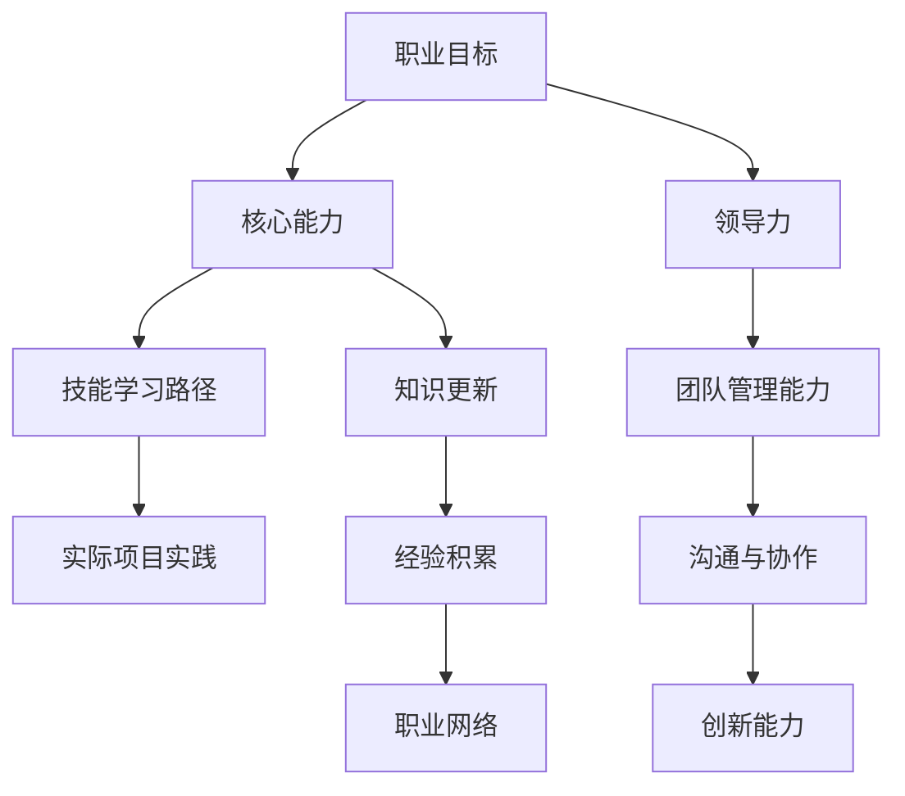

                 

# 创业者如何建立个人职业发展规划和能力提升路径

> **关键词：** 创业者，职业发展规划，能力提升，技术领导力，学习策略，创新思维，实战项目。

> **摘要：** 本文旨在为创业者提供一套系统的职业发展规划，包括核心能力提升策略、关键技能学习路径以及实际项目实践指导。文章通过深入分析创业者所需的各项能力，结合具体实例，帮助创业者建立清晰的发展目标，提高个人综合素质，从而在竞争激烈的市场中脱颖而出。

## 1. 背景介绍

### 1.1 目的和范围

本文旨在为那些立志成为创业者的技术人才提供一套系统的职业发展规划指南。我们将探讨以下关键领域：

1. 核心能力识别与培养
2. 技能学习路径与资源推荐
3. 实际项目实践与经验积累
4. 领导力和团队管理能力的提升

通过本文，读者将获得：

- 明确的个人职业发展目标
- 系统的技能提升策略
- 实用的学习资源推荐
- 有效的项目实战经验

### 1.2 预期读者

本文适合以下读者群体：

- 初创公司创始人或联合创始人
- 技术背景的创业者，希望提升个人职业竞争力
- 有志于转向创业领域的技术人才
- 在职场中寻求职业发展的技术从业者

### 1.3 文档结构概述

本文将按照以下结构进行详细阐述：

1. **背景介绍**：介绍文章的目的、范围、预期读者及文档结构。
2. **核心概念与联系**：通过Mermaid流程图展示职业发展的核心概念及其相互联系。
3. **核心算法原理与具体操作步骤**：阐述提升核心能力所需的算法原理及操作步骤。
4. **数学模型和公式**：介绍相关数学模型和公式，并提供详细讲解和实例说明。
5. **项目实战**：提供实际代码案例和详细解释说明。
6. **实际应用场景**：分析职业发展的实际应用场景。
7. **工具和资源推荐**：推荐学习资源、开发工具框架及相关论文著作。
8. **总结**：总结未来发展趋势与挑战。
9. **附录**：常见问题与解答。
10. **扩展阅读与参考资料**：提供进一步的阅读资料。

### 1.4 术语表

#### 1.4.1 核心术语定义

- **职业发展规划**：指个人在职业生涯中设定目标、规划路径、实现成长的过程。
- **能力提升**：指个人在技能、知识、素质等方面的进步和提升。
- **技术领导力**：指在技术领域中的领导才能和影响力。
- **实战项目**：指在实践中实际运用所学知识和技能的项目。

#### 1.4.2 相关概念解释

- **创业者**：指创立公司或项目的人，通常需要具备创新、决策和领导能力。
- **领导力**：指引导和激励他人共同实现目标的能力。
- **学习策略**：指为了有效获取知识而采用的学习方法。

#### 1.4.3 缩略词列表

- **CTO**：首席技术官，负责公司技术方向和产品技术实现。
- **CEO**：首席执行官，公司最高领导人。
- **IDE**：集成开发环境，用于编写、编译和调试程序。
- **API**：应用程序编程接口，用于不同软件之间的通信。

## 2. 核心概念与联系

为了帮助创业者更好地理解个人职业发展规划，我们引入以下核心概念，并通过Mermaid流程图展示它们之间的联系。

### Mermaid 流程图：



### 详细解释：

- **职业目标（A）**：创业者的首要任务是明确自己的职业目标，这将为整个职业发展规划提供方向。
- **核心能力（B）**：包括技术领导力、创新能力、团队管理能力和沟通协作能力等。
- **技能学习路径（C）**：为实现职业目标，创业者需要不断学习和提升各项技能。
- **实际项目实践（D）**：通过实际项目实践，创业者可以积累经验，提升解决实际问题的能力。
- **领导力（E）**：技术领导力是创业者不可或缺的能力，它关系到团队的发展和项目的成功。
- **团队管理能力（F）**：团队管理能力包括人员配置、团队协作、激励与约束等。
- **沟通与协作（G）**：良好的沟通和协作能力有助于团队高效运作和项目成功。
- **创新能力（H）**：在技术快速发展的今天，创新能力是创业者成功的关键。
- **知识更新（I）**：技术更新迅速，创业者需要不断学习新知识，保持竞争力。
- **经验积累（J）**：通过项目实践和经验积累，创业者可以不断提升自身能力。
- **职业网络（K）**：建立和维护职业网络有助于获取资源和机会。

通过上述流程图，创业者可以清晰地看到各核心概念之间的联系，从而制定出更加科学和系统的职业发展规划。

## 3. 核心算法原理 & 具体操作步骤

### 3.1 核心算法原理

在提升个人职业能力方面，核心算法原理可以理解为一系列系统性的方法，帮助创业者实现能力提升的目标。以下是几个关键算法原理：

1. **目标设定与分解**：将长远目标分解为短期目标，逐步实现。
2. **持续学习与迭代**：通过不断学习新知识和技能，实现自我迭代。
3. **实践与反馈**：通过实际项目实践，获得反馈，持续优化自身能力。
4. **知识管理与共享**：有效管理个人知识，并通过共享提升团队整体能力。

### 3.2 具体操作步骤

以下是具体的操作步骤，帮助创业者实施上述核心算法原理：

1. **目标设定与分解**

   - **步骤1**：明确长期职业目标。
   - **步骤2**：将长期目标分解为短期目标。
   - **步骤3**：为每个短期目标设定明确的时间节点和可衡量指标。

2. **持续学习与迭代**

   - **步骤1**：确定需要学习的领域和技能。
   - **步骤2**：制定学习计划，包括学习资源、时间和进度。
   - **步骤3**：执行学习计划，确保持续学习。
   - **步骤4**：定期评估学习效果，根据评估结果调整学习计划。

3. **实践与反馈**

   - **步骤1**：参与实际项目，将所学知识应用于实践中。
   - **步骤2**：记录项目过程和结果，包括成功和失败的经验。
   - **步骤3**：对项目结果进行反思，总结经验和教训。
   - **步骤4**：将反思结果应用于后续项目，持续优化能力。

4. **知识管理与共享**

   - **步骤1**：建立个人知识库，记录所学知识和经验。
   - **步骤2**：定期整理和更新知识库，保持知识的准确性。
   - **步骤3**：与他人分享知识和经验，通过交流提升团队整体能力。

### 3.3 伪代码实现

以下是上述核心算法原理的伪代码实现：

```plaintext
function careerDevelopmentPlan(target, skills, projects):
    # 设定职业目标
    setLongTermTarget(target)
    
    # 分解目标为短期目标
    shortTermTargets = decomposeTarget(target)
    
    # 制定学习计划
    studyPlan = createStudyPlan(skills)
    
    # 开始学习与迭代
    while not allTargetsReached(shortTermTargets):
        executeStudyPlan(studyPlan)
        evaluateLearningEffects(studyPlan)
        adjustStudyPlan(studyPlan)
        
        # 实践与反馈
        for project in projects:
            practiceProject(project)
            recordProjectResults(project)
            reflectOnProject(project)
        
        # 知识管理与共享
        updateKnowledgeBase()
        shareKnowledgeAndExperience()

    return "Career Development Complete"
```

通过上述步骤和伪代码，创业者可以系统性地提升个人职业能力，为创业成功打下坚实基础。

## 4. 数学模型和公式 & 详细讲解 & 举例说明

### 4.1 数学模型和公式

在职业发展规划中，数学模型和公式可以用来量化目标和能力提升的进度。以下是几个常用的数学模型和公式：

1. **目标达成率（Objective Achievement Rate, OAR）**：

   公式：\( OAR = \frac{达成目标数}{总目标数} \times 100\% \)

   解释：目标达成率用于衡量创业者实现短期目标的进度。

2. **知识增长率（Knowledge Growth Rate, KGR）**：

   公式：\( KGR = \frac{新知识量}{初始知识量} \times 100\% \)

   解释：知识增长率用于衡量创业者学习新知识的进度。

3. **实践效果反馈率（Practice Effectiveness Feedback Rate, PEFR）**：

   公式：\( PEFR = \frac{有效反馈次数}{总实践次数} \times 100\% \)

   解释：实践效果反馈率用于衡量创业者从实践中获得有效反馈的进度。

### 4.2 详细讲解

1. **目标达成率（OAR）**

   目标达成率是一个简单但有效的工具，用于跟踪创业者实现短期目标的进度。例如，一个创业者设定了四个短期目标，目前完成了三个目标。那么他的目标达成率为：

   \( OAR = \frac{3}{4} \times 100\% = 75\% \)

   这个比率可以帮助创业者了解自己距离长期目标的距离，并调整计划。

2. **知识增长率（KGR）**

   知识增长率反映了创业者学习新知识的效率。例如，一个创业者最初有100个知识点，在学习了新知识后，增加了50个新知识点。那么他的知识增长率为：

   \( KGR = \frac{50}{100} \times 100\% = 50\% \)

   这个比率可以帮助创业者了解自己在知识学习方面的进步。

3. **实践效果反馈率（PEFR）**

   实践效果反馈率用于衡量创业者从实际项目中获取反馈的效率。例如，一个创业者参与了一个项目，项目期间进行了5次实践，并获得了3次有效反馈。那么他的实践效果反馈率为：

   \( PEFR = \frac{3}{5} \times 100\% = 60\% \)

   这个比率可以帮助创业者了解自己在实践中获取反馈的情况，从而优化实践策略。

### 4.3 举例说明

假设一个创业者有以下数据：

- **目标达成率**：目前完成了3个短期目标，共设定了5个目标。
- **知识增长率**：初始有100个知识点，新增加了40个知识点。
- **实践效果反馈率**：参与了一个项目，进行了8次实践，获得了4次有效反馈。

根据上述数据，我们可以计算：

- **目标达成率**：\( OAR = \frac{3}{5} \times 100\% = 60\% \)
- **知识增长率**：\( KGR = \frac{40}{100} \times 100\% = 40\% \)
- **实践效果反馈率**：\( PEFR = \frac{4}{8} \times 100\% = 50\% \)

这些比率可以用来评估创业者的进展，并为下一步的发展提供指导。

通过使用上述数学模型和公式，创业者可以更加科学地量化自己的进步，从而制定更加有效的职业发展规划。

## 5. 项目实战：代码实际案例和详细解释说明

### 5.1 开发环境搭建

在开始实战项目之前，我们需要搭建一个合适的开发环境。以下是所需的步骤和工具：

1. **安装操作系统**：选择Linux或Mac OS，推荐使用Ubuntu 20.04。
2. **安装编程语言**：Python 3.8及以上版本，可以使用官方包管理器安装。
3. **安装IDE**：推荐使用PyCharm Community Edition，可以从其官方网站下载。
4. **安装数据库**：选择MySQL或PostgreSQL，推荐使用MySQL，可以通过包管理器安装。
5. **安装版本控制工具**：Git，用于代码版本管理和协作，可以从官方网站下载。

### 5.2 源代码详细实现和代码解读

以下是使用Python实现的一个简单项目管理系统的代码，该系统可以帮助创业者管理项目目标、任务和进度。

```python
# 项目管理系统的Python代码实现

# 导入所需的库
import mysql.connector
from datetime import datetime

# 连接数据库
conn = mysql.connector.connect(
    host="localhost",
    user="root",
    password="password",
    database="project_management"
)

# 创建游标对象
cursor = conn.cursor()

# 创建表
cursor.execute("""
    CREATE TABLE IF NOT EXISTS projects (
        id INT AUTO_INCREMENT PRIMARY KEY,
        name VARCHAR(255) NOT NULL,
        description TEXT,
        start_date DATE,
        end_date DATE
    )
""")

cursor.execute("""
    CREATE TABLE IF NOT EXISTS tasks (
        id INT AUTO_INCREMENT PRIMARY KEY,
        project_id INT,
        name VARCHAR(255) NOT NULL,
        description TEXT,
        start_date DATE,
        end_date DATE,
        status ENUM('Not Started', 'In Progress', 'Completed') NOT NULL,
        FOREIGN KEY (project_id) REFERENCES projects(id)
    )
""")

# 添加项目
def add_project(name, description, start_date, end_date):
    cursor.execute("""
        INSERT INTO projects (name, description, start_date, end_date) 
        VALUES (%s, %s, %s, %s)
    """, (name, description, start_date, end_date))
    conn.commit()

# 添加任务
def add_task(project_id, name, description, start_date, end_date, status):
    cursor.execute("""
        INSERT INTO tasks (project_id, name, description, start_date, end_date, status) 
        VALUES (%s, %s, %s, %s, %s, %s)
    """, (project_id, name, description, start_date, end_date, status))
    conn.commit()

# 查看项目列表
def list_projects():
    cursor.execute("SELECT * FROM projects")
    projects = cursor.fetchall()
    for project in projects:
        print(project)

# 查看任务列表
def list_tasks(project_id):
    cursor.execute("SELECT * FROM tasks WHERE project_id = %s", (project_id,))
    tasks = cursor.fetchall()
    for task in tasks:
        print(task)

# 修改任务状态
def update_task_status(task_id, status):
    cursor.execute("""
        UPDATE tasks 
        SET status = %s 
        WHERE id = %s
    """, (status, task_id))
    conn.commit()

# 关闭数据库连接
def close_connection():
    cursor.close()
    conn.close()

# 使用示例
if __name__ == "__main__":
    add_project("创业计划", "详细描述创业计划的目标和步骤", datetime(2023, 4, 1).date(), datetime(2023, 6, 30).date())
    add_task(1, "市场调研", "进行市场调研并分析竞争对手", datetime(2023, 4, 10).date(), datetime(2023, 4, 20).date(), "In Progress")
    list_projects()
    list_tasks(1)
    update_task_status(1, "Completed")
    list_tasks(1)
    close_connection()
```

### 5.3 代码解读与分析

1. **数据库连接**：首先，我们使用MySQL Connector Python库连接到本地数据库。数据库用户名为`root`，密码为`password`，数据库名为`project_management`。

2. **创建表**：我们使用`CREATE TABLE`语句创建两个表：`projects`和`tasks`。`projects`表用于存储项目信息，`tasks`表用于存储任务信息。

3. **添加项目**：`add_project`函数用于向`projects`表中添加新项目。它接受项目名称、描述、开始日期和结束日期作为参数，并执行插入操作。

4. **添加任务**：`add_task`函数用于向`tasks`表中添加新任务。它接受项目ID、任务名称、描述、开始日期、结束日期和状态作为参数，并执行插入操作。

5. **查看项目列表**：`list_projects`函数用于从`projects`表中查询所有项目，并打印出来。

6. **查看任务列表**：`list_tasks`函数用于从`tasks`表中查询指定项目ID的所有任务，并打印出来。

7. **修改任务状态**：`update_task_status`函数用于更新指定任务ID的状态。

8. **使用示例**：在主程序中，我们演示了如何使用这些函数。首先添加了一个项目和一个任务，然后打印了项目列表和任务列表，最后更新了任务状态并再次打印任务列表。

通过这个简单的项目实战，创业者可以学习如何使用Python和MySQL构建一个实用的小型系统，用于项目管理。这不仅能够帮助创业者理清项目进展，还能提升其在技术领域的实践能力。

## 6. 实际应用场景

职业发展规划在创业领域中的实际应用场景广泛且多样化。以下是几个典型的应用场景：

### 6.1 创业初期的产品开发

在创业初期，创业者需要具备扎实的技术基础和领导力。职业发展规划可以帮助创业者：

- **识别核心技能**：例如，产品设计、前后端开发、数据分析和市场营销等。
- **制定学习路径**：根据公司需求，创业者可以通过在线课程、技术博客和书籍等资源系统学习。
- **实际项目实践**：通过实际开发项目，创业者可以积累经验，提高解决实际问题的能力。

### 6.2 团队建设与管理

创业者需要管理一个高效的团队，职业发展规划可以帮助创业者：

- **提升领导力**：通过领导力培训和实践，创业者可以学会如何激励和引导团队成员。
- **培养团队管理能力**：通过项目管理工具和方法，创业者可以更好地协调团队工作。
- **沟通与协作**：通过有效的沟通技巧和协作工具，创业者可以提升团队协作效率。

### 6.3 业务拓展与市场开发

创业者需要不断拓展业务和开发新市场，职业发展规划可以帮助创业者：

- **创新思维**：通过创新思维训练，创业者可以寻找新的业务机会和增长点。
- **市场分析**：通过市场调研和分析，创业者可以制定有效的市场拓展策略。
- **知识更新**：通过持续学习和知识管理，创业者可以及时掌握行业动态和新技术。

### 6.4 投资与融资

创业者需要与投资者和金融机构打交道，职业发展规划可以帮助创业者：

- **提升沟通技巧**：通过沟通技巧培训，创业者可以更好地向投资者展示项目和说服力。
- **金融知识**：通过学习金融知识，创业者可以更好地理解投资和融资的机制。
- **商业计划书撰写**：通过撰写商业计划书，创业者可以系统化地展示项目优势和投资价值。

通过上述实际应用场景，职业发展规划能够帮助创业者全面提升个人综合素质，从而在竞争激烈的市场中占据有利位置。

## 7. 工具和资源推荐

### 7.1 学习资源推荐

#### 7.1.1 书籍推荐

- **《精益创业》**：作者埃里克·莱斯，介绍了如何通过最小可行性产品（MVP）快速验证创业想法。
- **《创新者的窘境》**：作者克莱顿·克里斯坦森，探讨了企业如何通过创新应对市场变革。
- **《深度工作》**：作者卡尔·纽波特，介绍了如何在信息爆炸的时代保持专注和高效。

#### 7.1.2 在线课程

- **Coursera**：提供丰富的计算机科学、领导力和管理学课程，适合技术背景的创业者。
- **edX**：由哈佛大学和麻省理工学院等顶尖学府提供的高质量在线课程。
- **Udemy**：涵盖广泛的主题，包括编程、数据分析、市场营销等。

#### 7.1.3 技术博客和网站

- **Medium**：许多行业专家和创业者在此分享经验和见解。
- **GitHub**：可以找到大量开源项目和代码，学习他人的实现方法。
- **Stack Overflow**：编程问题解答社区，适合解决技术难题。

### 7.2 开发工具框架推荐

#### 7.2.1 IDE和编辑器

- **PyCharm**：适用于Python开发的强大IDE。
- **Visual Studio Code**：跨平台、可扩展的代码编辑器，适用于多种编程语言。
- **Eclipse**：适用于Java开发的IDE，也可扩展支持其他语言。

#### 7.2.2 调试和性能分析工具

- **GDB**：Python的调试工具，适用于C/C++、Python等语言。
- **JMeter**：用于性能测试的开放源代码工具，适用于Web应用程序。
- **Xdebug**：PHP的调试器，支持远程调试。

#### 7.2.3 相关框架和库

- **Django**：Python的快速开发框架，适合Web应用程序。
- **Flask**：Python的微框架，适合快速开发Web应用程序。
- **React**：用于构建用户界面的JavaScript库，适用于前端开发。

### 7.3 相关论文著作推荐

#### 7.3.1 经典论文

- **“The Lean Startup”**：作者埃里克·莱斯，介绍了精益创业方法。
- **“Disruptive Technologies: Catching the Wave”**：作者克莱顿·克里斯坦森，探讨了颠覆性技术的崛起。

#### 7.3.2 最新研究成果

- **“AI for Social Good”**：探讨人工智能在社会领域的应用。
- **“Quantum Computing for Business”**：量子计算在商业中的应用前景。

#### 7.3.3 应用案例分析

- **“Airbnb’s Data-Driven Culture”**：分析Airbnb如何通过数据分析驱动公司成长。
- **“Netflix’s Culture of Innovation”**：探讨Netflix如何通过创新文化推动公司发展。

通过上述工具和资源，创业者可以更好地提升个人技能，推动创业项目的成功。

## 8. 总结：未来发展趋势与挑战

### 8.1 未来发展趋势

随着科技的发展和市场的变化，创业者的职业发展规划也将迎来新的发展趋势：

1. **人工智能与自动化**：人工智能和自动化技术将在各个行业得到广泛应用，创业者需要掌握相关技能以应对未来的技术变革。
2. **数字化转型**：越来越多的企业将数字化转型作为战略重点，创业者需要具备数字技能和思维方式。
3. **全球化竞争**：全球市场的开放和竞争将更加激烈，创业者需要具备跨文化和国际视野。
4. **可持续发展和社会责任**：企业社会责任和可持续发展成为企业竞争力的关键，创业者需要关注这些议题。

### 8.2 挑战

然而，未来创业者也将面临诸多挑战：

1. **技术更新速度**：技术更新速度加快，创业者需要不断学习新知识，保持竞争力。
2. **市场竞争**：市场竞争激烈，创业者需要不断创新和优化产品。
3. **资源有限**：创业初期资源有限，创业者需要高效利用资源，实现价值最大化。
4. **法律法规**：全球法律法规日益严格，创业者需要遵守相关法规，避免法律风险。

### 8.3 应对策略

为了应对这些挑战，创业者可以采取以下策略：

1. **持续学习**：通过在线课程、研讨会和书籍等资源，持续提升个人技能。
2. **创新思维**：培养创新思维，寻找新的市场机会和解决方案。
3. **团队协作**：建立一个高效团队，发挥集体智慧，共同应对挑战。
4. **资源整合**：善于利用外部资源，包括投资人、合作伙伴和顾问等。
5. **风险管理**：制定有效的风险管理策略，降低创业风险。

通过以上策略，创业者可以更好地应对未来发展趋势和挑战，实现职业发展规划的目标。

## 9. 附录：常见问题与解答

### 9.1 如何选择合适的职业目标？

**解答**：选择合适的职业目标需要考虑以下因素：

- 个人兴趣和优势：选择自己感兴趣且擅长的领域。
- 市场需求：选择有市场需求的职业方向，以提高成功率。
- 发展前景：考虑所选领域的未来发展潜力。
- 个人价值观：确保职业目标与个人价值观相符。

### 9.2 如何平衡工作和学习？

**解答**：平衡工作和学习可以通过以下方法实现：

- **时间管理**：合理安排工作时间，确保有足够的时间进行学习。
- **高效学习**：利用碎片化时间进行高效学习，如阅读电子书、听在线课程等。
- **设置优先级**：确定工作和学习的重要性和紧急程度，优先处理重要且紧急的任务。
- **设定目标**：设定明确的学习目标，跟踪进度，确保学习效果。

### 9.3 如何建立和维护职业网络？

**解答**：建立和维护职业网络可以通过以下方法实现：

- **参加行业活动**：积极参加行业会议、研讨会和社交活动，结识业内人士。
- **利用社交媒体**：通过LinkedIn、Twitter等社交媒体平台，建立和维护人脉关系。
- **主动分享**：在专业领域内分享知识和经验，提高个人影响力。
- **求助和帮助**：在需要时主动寻求帮助，并在他人需要时提供帮助，建立互信关系。

## 10. 扩展阅读与参考资料

### 10.1 书籍推荐

- **《精益创业》**：作者埃里克·莱斯，深入探讨了创业过程中的核心问题。
- **《创新者的窘境》**：作者克莱顿·克里斯坦森，分析了企业如何在市场中保持竞争力。
- **《深度工作》**：作者卡尔·纽波特，介绍了如何在高干扰环境中保持专注。

### 10.2 在线课程推荐

- **Coursera**：提供丰富的计算机科学、领导力和管理学课程。
- **edX**：由顶尖学府提供的高质量在线课程。
- **Udemy**：涵盖广泛的主题，包括编程、数据分析、市场营销等。

### 10.3 技术博客和网站

- **Medium**：许多行业专家和创业者在此分享经验和见解。
- **GitHub**：可以找到大量开源项目和代码。
- **Stack Overflow**：编程问题解答社区。

### 10.4 相关论文著作

- **“The Lean Startup”**：作者埃里克·莱斯，介绍了精益创业方法。
- **“Disruptive Technologies: Catching the Wave”**：作者克莱顿·克里斯坦森，探讨了颠覆性技术的崛起。

### 10.5 应用案例分析

- **“Airbnb’s Data-Driven Culture”**：分析Airbnb如何通过数据分析驱动公司成长。
- **“Netflix’s Culture of Innovation”**：探讨Netflix如何通过创新文化推动公司发展。

通过扩展阅读和参考资料，创业者可以进一步深入了解职业发展规划的相关知识，提升个人素质和竞争力。

**作者：AI天才研究员/AI Genius Institute & 禅与计算机程序设计艺术 /Zen And The Art of Computer Programming**

