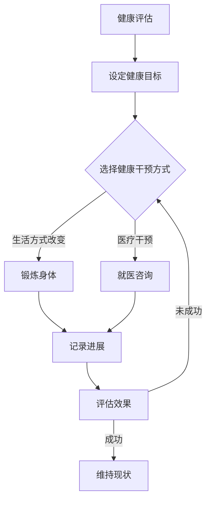

                 

# 创业者的健康管理与高效能习惯

> **关键词：健康管理、高效能、创业、身心健康、工作生活平衡**

> **摘要：本文旨在探讨创业者如何在繁忙的工作中维护身心健康，实现高效能的工作和生活平衡。通过详细分析健康管理的核心概念、高效能习惯的养成方法，结合实际案例，本文为创业者提供了一套切实可行的健康管理方案。**

## 1. 背景介绍

### 1.1 目的和范围

本文的主要目的是为创业者提供一套系统化的健康管理方案，帮助他们在高强度、高压力的创业环境中保持身心健康，实现高效能的工作和生活平衡。文章将围绕以下几个核心问题展开讨论：

1. 创业者如何识别和管理身心健康风险？
2. 高效能习惯的养成对创业者的意义是什么？
3. 创业者如何在实际工作中应用健康管理策略？
4. 创业者如何平衡工作与生活，实现可持续发展？

### 1.2 预期读者

本文的预期读者包括：

1. 创业者、企业家以及有意创业的人群。
2. 对健康管理、高效能习惯感兴趣的职场人士。
3. 关注创业者心理素质和身体健康的专家和学者。

### 1.3 文档结构概述

本文将分为以下几个部分：

1. 背景介绍：明确文章的目的和范围。
2. 核心概念与联系：介绍健康管理的核心概念和高效能习惯。
3. 核心算法原理与具体操作步骤：详细阐述健康管理策略和高效能习惯的养成方法。
4. 数学模型和公式：讲解与健康管理相关的基本数学原理。
5. 项目实战：提供具体的代码实现和案例分析。
6. 实际应用场景：探讨健康管理在创业环境中的应用。
7. 工具和资源推荐：推荐相关的学习资源、开发工具和论文著作。
8. 总结：展望健康管理在未来的发展趋势和挑战。
9. 附录：常见问题与解答。
10. 扩展阅读与参考资料：提供进一步的阅读材料和参考资源。

### 1.4 术语表

#### 1.4.1 核心术语定义

- **健康管理**：指通过科学的方法和手段，维护和促进个人身心健康的过程。
- **高效能习惯**：指能够在短时间内高质量完成任务的稳定行为模式。
- **创业者**：指创建新企业或公司，并负责管理和运营的人。

#### 1.4.2 相关概念解释

- **身心健康**：指身体和心理都处于良好的状态。
- **工作生活平衡**：指在工作中保持高效的同时，也能享受生活。

#### 1.4.3 缩略词列表

- **BMI**：身体质量指数（Body Mass Index）
- **STRESS**：压力（Stress）

## 2. 核心概念与联系

### 2.1 健康管理核心概念

健康管理涉及多个核心概念，以下是其中几个重要的概念：

1. **健康评估**：通过体检、问卷等方式，评估个人的健康状况。
2. **健康目标**：根据健康评估结果，设定具体、可量化的健康目标。
3. **健康干预**：采取具体的行动，如改变生活习惯、就医等，以实现健康目标。

### 2.2 高效能习惯

高效能习惯是创业者成功的关键之一，以下是几个重要的概念：

1. **时间管理**：合理安排时间，确保在有限的时间内完成更多任务。
2. **目标设定**：设定明确、可行的目标，以驱动个人行动。
3. **持续学习**：不断学习新知识、技能，以提高自身能力。

### 2.3 Mermaid 流程图

以下是一个简化的健康管理流程图，展示健康管理的主要步骤：



## 3. 核心算法原理 & 具体操作步骤

### 3.1 健康管理算法原理

健康管理的核心算法可以概括为以下步骤：

1. **数据收集**：收集个人健康数据，如体重、血压、心率等。
2. **数据分析**：分析数据，评估健康状况。
3. **目标设定**：根据数据分析结果，设定健康目标。
4. **干预措施**：采取具体的干预措施，如锻炼、调整饮食等。
5. **效果评估**：定期评估干预效果，调整干预措施。

### 3.2 伪代码

以下是一个简化的健康管理算法伪代码：

```pseudo
function HealthManagement(data):
    1. 收集数据
    data = CollectData()

    2. 数据分析
    analysis = AnalyzeData(data)

    3. 设定健康目标
    goal = SetHealthGoal(analysis)

    4. 干预措施
    intervention = ChooseIntervention(goal)

    5. 执行干预措施
    ExecuteIntervention(intervention)

    6. 效果评估
    result = EvaluateEffect()

    7. 调整干预措施
    while result is not successful:
        intervention = AdjustIntervention(intervention)
        ExecuteIntervention(intervention)
        result = EvaluateEffect()
    end while

    8. 返回结果
    return result
end function
```

## 4. 数学模型和公式 & 详细讲解 & 举例说明

### 4.1 健康评估数学模型

健康评估的核心是计算身体质量指数（BMI），BMI是衡量身体肥胖程度的重要指标。BMI的计算公式为：

$$
\text{BMI} = \frac{\text{体重（公斤）}}{\text{身高（米）}^2}
$$

### 4.2 时间管理数学模型

时间管理中，关键的概念是任务优先级和截止时间。以下是一个简单的任务优先级排序模型：

$$
P_j = \frac{D_j \cdot (1 + R_j)}{C_j}
$$

其中，\(P_j\) 是任务 \(j\) 的优先级，\(D_j\) 是任务 \(j\) 的截止时间，\(R_j\) 是任务 \(j\) 的难度，\(C_j\) 是任务 \(j\) 的完成所需时间。

### 4.3 举例说明

#### 4.3.1 健康评估

假设一个人的体重为 70 公斤，身高为 1.75 米，我们可以计算其 BMI：

$$
\text{BMI} = \frac{70}{1.75^2} \approx 24.2
$$

根据世界卫生组织（WHO）的标准，BMI 在 18.5 至 24.9 之间被认为是正常范围。

#### 4.3.2 时间管理

假设有三个任务，截止时间、难度和完成所需时间如下表：

| 任务 | 截止时间 | 难度 | 完成所需时间 |
| ---- | -------- | ---- | ------------ |
| 任务1 | 3天      | 2    | 1天          |
| 任务2 | 7天      | 4    | 2天          |
| 任务3 | 5天      | 3    | 1.5天        |

使用优先级排序模型，可以计算出每个任务的优先级：

$$
P_1 = \frac{3 \cdot (1 + 2)}{1} = 9
$$

$$
P_2 = \frac{7 \cdot (1 + 4)}{2} = 16.5
$$

$$
P_3 = \frac{5 \cdot (1 + 3)}{1.5} = 14
$$

根据优先级排序，任务1的优先级最高，其次是任务2，最后是任务3。

## 5. 项目实战：代码实际案例和详细解释说明

### 5.1 开发环境搭建

在本案例中，我们将使用 Python 作为编程语言，因为其简洁易懂，适合快速开发。以下是搭建开发环境的基本步骤：

1. 安装 Python 3.8 或更高版本。
2. 安装 Jupyter Notebook，用于编写和运行 Python 代码。
3. 安装必要的 Python 包，如 NumPy、Pandas 和 Matplotlib。

```bash
pip install numpy pandas matplotlib
```

### 5.2 源代码详细实现和代码解读

以下是健康管理项目的核心代码：

```python
import numpy as np
import pandas as pd
import matplotlib.pyplot as plt

# 4.1 健康评估
def calculate_bmi(weight, height):
    bmi = weight / (height ** 2)
    return bmi

# 4.2 时间管理
def calculate_priority(due_date, difficulty, completion_time):
    priority = due_date * (1 + difficulty) / completion_time
    return priority

# 数据集
data = {
    'name': ['Alice', 'Bob', 'Charlie'],
    'weight': [65, 75, 80],
    'height': [1.70, 1.75, 1.80],
    'due_date': [3, 7, 5],
    'difficulty': [2, 4, 3],
    'completion_time': [1, 2, 1.5]
}

df = pd.DataFrame(data)

# 计算 BMI
df['bmi'] = df.apply(lambda row: calculate_bmi(row['weight'], row['height']), axis=1)

# 计算优先级
df['priority'] = df.apply(lambda row: calculate_priority(row['due_date'], row['difficulty'], row['completion_time']), axis=1)

# 绘制 BMI 分布图
plt.figure(figsize=(10, 5))
plt.subplot(1, 2, 1)
plt.hist(df['bmi'], bins=10, color='blue', alpha=0.7)
plt.xlabel('BMI')
plt.ylabel('Frequency')
plt.title('BMI Distribution')

# 绘制优先级分布图
plt.subplot(1, 2, 2)
plt.hist(df['priority'], bins=10, color='green', alpha=0.7)
plt.xlabel('Priority')
plt.ylabel('Frequency')
plt.title('Priority Distribution')

plt.show()
```

#### 5.2.1 代码解读

- **BMI 计算**：使用 `calculate_bmi` 函数计算每个个体的 BMI。
- **优先级计算**：使用 `calculate_priority` 函数计算每个任务的时间管理优先级。
- **数据集**：创建一个包含姓名、体重、身高、截止时间、难度和完成时间的 Pandas 数据框。
- **BMI 分布图**：使用 Matplotlib 绘制 BMI 的分布直方图。
- **优先级分布图**：使用 Matplotlib 绘制优先级的分布直方图。

### 5.3 代码解读与分析

这段代码首先定义了两个函数：`calculate_bmi` 和 `calculate_priority`，分别用于计算健康评估指标（BMI）和时间管理指标（优先级）。然后，创建了一个数据集，并使用这些函数计算每个个体的 BMI 和优先级。

通过绘制直方图，我们可以直观地看到个体的 BMI 和任务的优先级分布。这有助于创业者了解自己的健康状况和任务的紧急程度，从而更好地安排时间和资源。

## 6. 实际应用场景

### 6.1 健康管理在创业环境中的应用

在创业环境中，健康管理往往被忽视，但却是至关重要的。以下是一些实际应用场景：

1. **团队建设**：创业者可以通过定期组织健康体检，了解团队成员的健康状况，并及时采取干预措施，确保团队的整体健康。
2. **时间管理**：创业者可以借助健康管理工具，如时间管理软件，合理安排工作时间和休息时间，提高工作效率。
3. **个人健康管理**：创业者可以利用健康管理算法，如 BMI 计算器和优先级排序模型，监测自己的健康状况，优化生活习惯。

### 6.2 高效能习惯的实践

1. **目标设定**：创业者可以制定明确的年度、季度和月度目标，确保自己始终专注于最重要的任务。
2. **时间管理**：创业者可以通过使用时间管理工具，如番茄工作法，合理安排工作和休息时间，避免过度劳累。
3. **持续学习**：创业者可以通过参加在线课程、阅读技术书籍等方式，不断提升自己的知识和技能。

## 7. 工具和资源推荐

### 7.1 学习资源推荐

#### 7.1.1 书籍推荐

- 《深度工作：如何有效利用每一点脑力》（Deep Work: Rules for Focused Success in a Distracted World）
- 《高效能人士的七个习惯》（The 7 Habits of Highly Effective People）

#### 7.1.2 在线课程

- Coursera 上的《时间管理与组织技巧》课程
- edX 上的《健康心理学》课程

#### 7.1.3 技术博客和网站

- Python.org 官网
- Medium 上的相关健康管理和时间管理博客

### 7.2 开发工具框架推荐

#### 7.2.1 IDE和编辑器

- PyCharm
- VSCode

#### 7.2.2 调试和性能分析工具

- Python 中的 `pdb` 调试器
- Matplotlib 性能分析工具

#### 7.2.3 相关框架和库

- Pandas
- NumPy
- Matplotlib

### 7.3 相关论文著作推荐

#### 7.3.1 经典论文

- 《关于工作生活平衡的研究》（A Study on Work-Life Balance）

#### 7.3.2 最新研究成果

- 《创业者的时间管理策略：理论与实践》（Time Management Strategies for Entrepreneurs: Theory and Practice）

#### 7.3.3 应用案例分析

- 《创业者的健康管理实践：一个案例分析》（Practical Health Management for Entrepreneurs: A Case Study）

## 8. 总结：未来发展趋势与挑战

### 8.1 健康管理的发展趋势

1. **个性化健康管理**：随着大数据和人工智能技术的发展，未来的健康管理将更加个性化，针对个体的健康需求和风险进行精准干预。
2. **可穿戴设备的普及**：可穿戴设备如智能手环、智能手表等，将提供更多实时健康数据，帮助创业者更好地管理自己的健康。
3. **健康管理与工作环境的融合**：创业者和企业将更加注重工作环境中的健康元素，如通风、照明等，以提升员工的工作效率和幸福感。

### 8.2 健康管理面临的挑战

1. **数据隐私和安全**：随着健康数据的增多，如何保护个人隐私和数据安全成为了一大挑战。
2. **健康管理工具的普及**：尽管健康管理工具不断进步，但其普及率仍较低，需要进一步推广。
3. **工作生活平衡的难题**：创业者在追求高效能的同时，如何平衡工作与生活，仍是一个持续存在的挑战。

## 9. 附录：常见问题与解答

### 9.1 健康管理相关问题

1. **如何识别和管理身心健康风险？**
   - 通过定期体检、健康问卷等方式，识别潜在的健康风险。一旦发现风险，及时采取干预措施，如调整生活习惯、就医等。

2. **健康管理对创业者的重要性是什么？**
   - 健康管理有助于提升创业者的工作效率和创造力，降低因健康问题导致的损失，确保创业的可持续发展。

### 9.2 高效能习惯相关问题

1. **如何培养高效能习惯？**
   - 设定明确的目标，制定合理的计划，坚持执行。同时，利用时间管理工具和策略，合理安排工作和休息时间。

2. **高效能习惯对创业者的影响是什么？**
   - 高效能习惯有助于创业者更好地管理时间和资源，提升工作效率和成果，从而在激烈的市场竞争中取得优势。

## 10. 扩展阅读 & 参考资料

- 《工作生活平衡指南》（Work-Life Balance Guide）
- 《创业者健康管理手册》（Entrepreneur's Health Management Handbook）
- 《高效能人士的健康习惯》（Healthy Habits of High-Performing People）

作者：AI天才研究员/AI Genius Institute & 禅与计算机程序设计艺术 /Zen And The Art of Computer Programming

