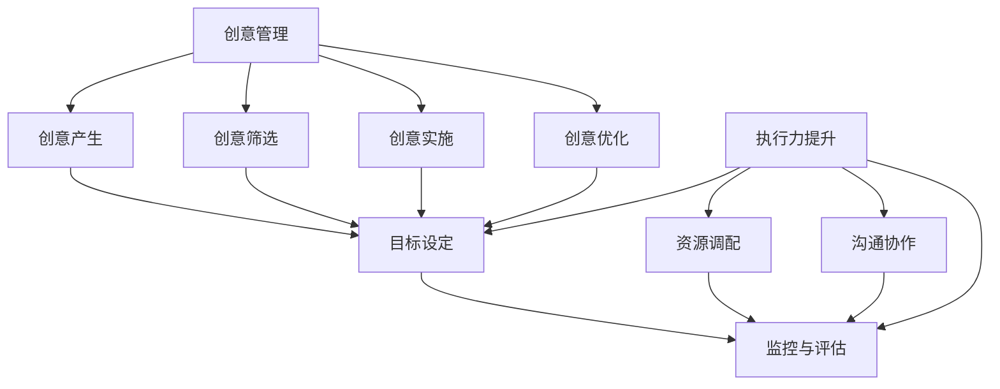

                 

# 创业者的创意管理与执行力提升

> 关键词：创业、创意管理、执行力、创新思维、团队协作、项目管理
> 摘要：本文旨在探讨创业者在初创企业中所面临的创意管理和执行力提升的挑战，分析其核心概念、原理和实施步骤，并推荐相关工具和资源，以期为创业者提供实用的指导和建议。

## 1. 背景介绍

### 1.1 目的和范围

本文将深入探讨创业者在初创企业中所面临的创意管理和执行力提升的问题。我们将从核心概念出发，逐步分析创意管理和执行力提升的方法与技巧，并给出具体的操作步骤。同时，本文还将推荐一些实用的工具和资源，帮助创业者更好地应对这些挑战。

### 1.2 预期读者

本文主要面向以下几类读者：

1. 有志于创业的年轻人
2. 创业初期的创业者
3. 需要提升团队创意管理和执行力的企业高管
4. 对创新思维和项目管理有兴趣的读者

### 1.3 文档结构概述

本文结构如下：

1. 背景介绍
2. 核心概念与联系
3. 核心算法原理 & 具体操作步骤
4. 数学模型和公式 & 详细讲解 & 举例说明
5. 项目实战：代码实际案例和详细解释说明
6. 实际应用场景
7. 工具和资源推荐
8. 总结：未来发展趋势与挑战
9. 附录：常见问题与解答
10. 扩展阅读 & 参考资料

### 1.4 术语表

#### 1.4.1 核心术语定义

- 创意管理：对创意的产生、筛选、实施和优化过程进行有效管理，以提高创新能力和竞争力。
- 执行力：团队或个人按照预定目标和计划，高效完成各项任务的能力。
- 团队协作：团队成员之间的有效沟通、合作与共享，共同实现团队目标。
- 项目管理：对项目从启动到完成的整个过程中进行规划、组织、协调和控制，确保项目目标的实现。

#### 1.4.2 相关概念解释

- 创新思维：一种以创造新价值、新解决方案为核心的思想方法，强调打破传统思维模式，寻求创新途径。
- 团队建设：通过一系列活动和措施，提升团队成员之间的信任、沟通和协作能力，以实现团队目标。

#### 1.4.3 缩略词列表

- PM：项目管理
- R&D：研究与发展
- ROI：投资回报率

## 2. 核心概念与联系

### 2.1 创意管理与执行力提升的关系

创意管理和执行力提升是创业成功的两个关键因素。创意管理决定了企业的创新能力和竞争力，而执行力提升则确保了企业能够高效地将创意转化为实际成果。

#### 2.1.1 创意管理

创意管理是一个复杂的过程，包括以下几个方面：

1. **创意的产生**：通过头脑风暴、跨界合作等方式，激发团队成员的创新思维，产生新的创意。
2. **创意的筛选**：对产生的创意进行筛选，评估其可行性、市场前景和资源需求等，选择最具潜力的创意进行进一步开发。
3. **创意的实施**：将选定的创意转化为具体的项目计划，并组织团队进行实施。
4. **创意的优化**：在实施过程中，不断收集反馈和评估创意的效果，进行优化和调整。

#### 2.1.2 执行力提升

执行力提升是一个系统性工程，包括以下几个方面：

1. **目标设定**：明确团队的目标和愿景，制定具体的行动计划。
2. **资源调配**：合理配置人力、物力和财力等资源，确保执行过程顺利进行。
3. **沟通协作**：建立有效的沟通机制，确保团队成员之间信息畅通，提高协作效率。
4. **监控与评估**：对执行过程进行实时监控，评估执行效果，及时调整执行策略。

### 2.2 创意管理与执行力提升的联系

创意管理和执行力提升之间存在着密切的联系。一方面，创意管理为执行力提升提供了目标和方向；另一方面，执行力提升为创意管理提供了实施保障。两者相辅相成，共同推动企业的持续发展。

- **创意管理推动执行力提升**：通过创意管理，企业能够不断产生新的创意，推动团队进行创新和变革。这些新创意需要通过执行力提升来实现，从而提高企业的市场竞争力。
- **执行力提升促进创意管理**：执行力提升能够确保企业高效地实施创意，使创意管理得到有效的落实。同时，执行力提升过程中的反馈和评估，也有助于创意管理的优化和调整。

### 2.3 创意管理与执行力提升的核心概念图

以下是一个简单的 Mermaid 流程图，展示了创意管理和执行力提升的核心概念及其关系：



## 3. 核心算法原理 & 具体操作步骤

### 3.1 创意管理的算法原理

创意管理的核心在于激发创新思维、筛选优质创意和高效实施创意。以下是创意管理的主要算法原理：

1. **头脑风暴**：通过集体讨论，激发团队成员的创新思维，产生大量创意。
2. **筛选创意**：对产生的创意进行筛选，评估其可行性、市场前景和资源需求等。
3. **创意实施**：将筛选出的创意转化为具体的项目计划，并组织团队进行实施。
4. **创意优化**：在实施过程中，不断收集反馈和评估创意的效果，进行优化和调整。

### 3.2 执行力提升的算法原理

执行力提升的核心在于明确目标、合理调配资源、有效沟通协作和实时监控评估。以下是执行力提升的主要算法原理：

1. **目标设定**：明确团队的目标和愿景，制定具体的行动计划。
2. **资源调配**：合理配置人力、物力和财力等资源，确保执行过程顺利进行。
3. **沟通协作**：建立有效的沟通机制，确保团队成员之间信息畅通，提高协作效率。
4. **监控与评估**：对执行过程进行实时监控，评估执行效果，及时调整执行策略。

### 3.3 创意管理与执行力提升的具体操作步骤

#### 3.3.1 创意管理操作步骤

1. **创意产生**：
   - 组织头脑风暴会议，鼓励团队成员提出创意。
   - 记录所有创意，并对其进行初步分类。

2. **创意筛选**：
   - 对创意进行评估，包括可行性、市场前景和资源需求等。
   - 根据评估结果，筛选出最具潜力的创意。

3. **创意实施**：
   - 将筛选出的创意转化为具体的项目计划。
   - 分配团队成员，明确职责和任务。
   - 制定项目进度表，确保创意顺利实施。

4. **创意优化**：
   - 在实施过程中，持续收集反馈和评估创意效果。
   - 根据评估结果，对创意进行优化和调整。

#### 3.3.2 执行力提升操作步骤

1. **目标设定**：
   - 明确团队的目标和愿景，确保团队成员对此有共同的理解。
   - 制定具体的行动计划，明确每个阶段的目标和任务。

2. **资源调配**：
   - 分析项目需求和资源情况，合理配置人力、物力和财力等资源。
   - 确保资源的高效利用，避免资源浪费。

3. **沟通协作**：
   - 建立有效的沟通机制，确保团队成员之间信息畅通。
   - 定期召开团队会议，讨论项目进展和问题解决方案。

4. **监控与评估**：
   - 对执行过程进行实时监控，收集相关数据和信息。
   - 定期评估执行效果，根据评估结果调整执行策略。

### 3.4 伪代码示例

以下是一个简单的伪代码示例，展示了创意管理和执行力提升的操作步骤：

```plaintext
function 创意管理(创意列表) {
    创意列表 = 头脑风暴(创意列表)
    创意列表 = 筛选创意(创意列表)
    项目计划 = 转化创意为项目计划(创意列表)
    项目计划 = 实施项目计划(项目计划)
    项目计划 = 优化项目计划(项目计划)
    return 项目计划
}

function 执行力提升(目标，资源，沟通机制) {
    目标 = 设定目标(目标)
    资源 = 调配资源(资源，目标)
    沟通机制 = 建立沟通机制(沟通机制)
    执行过程 = 监控与评估(执行过程，沟通机制)
    return 执行过程
}
```

## 4. 数学模型和公式 & 详细讲解 & 举例说明

### 4.1 创意管理的数学模型

创意管理的核心在于如何有效地筛选和创新。以下是创意管理的数学模型：

1. **创意筛选模型**：

   设 \( S \) 为创意集合，\( F \) 为筛选函数，\( R \) 为资源限制，\( C \) 为创意可行性，则创意筛选模型为：

   $$ F(S, R) = \{ s \in S | C(s) \land \sum_{r \in R} r(s) \leq R \} $$

   其中，\( C(s) \) 表示创意 \( s \) 的可行性，\( r(s) \) 表示创意 \( s \) 在资源 \( r \) 方面的需求。

2. **创意优化模型**：

   设 \( O \) 为创意优化函数，\( P \) 为项目计划，\( E \) 为执行效果，则创意优化模型为：

   $$ O(P, E) = \{ p \in P | E(p) \land \max_{p' \in P} E(p') \} $$

   其中，\( E(p) \) 表示项目计划 \( p \) 的执行效果，\( \max_{p' \in P} E(p') \) 表示在所有项目计划中，选择执行效果最好的计划。

### 4.2 执行力提升的数学模型

执行力提升的核心在于目标设定和资源调配。以下是执行力提升的数学模型：

1. **目标设定模型**：

   设 \( G \) 为目标函数，\( T \) 为时间限制，则目标设定模型为：

   $$ G(T) = \{ t \in T | t \land \max_{t' \in T} t' \} $$

   其中，\( t \) 表示目标，\( \max_{t' \in T} t' \) 表示在所有目标中，选择时间最紧迫的目标。

2. **资源调配模型**：

   设 \( R \) 为资源集合，\( C \) 为资源成本函数，\( P \) 为项目计划，则资源调配模型为：

   $$ C(R, P) = \{ r \in R | r \land \min_{r' \in R} C(r') \land \sum_{r' \in R} r'(p) \leq P \} $$

   其中，\( r \) 表示资源，\( C(r) \) 表示资源 \( r \) 的成本，\( r'(p) \) 表示资源 \( r \) 在项目计划 \( p \) 中的需求。

### 4.3 举例说明

假设有一个创业团队，他们在研发新产品，现有以下创意：

- 创意1：研发一款智能家居控制系统，市场需求大，但研发成本较高。
- 创意2：研发一款便携式智能音响，市场需求较小，但研发成本较低。
- 创意3：研发一款智能健康监测设备，市场需求适中，研发成本适中。

现有资源如下：

- 人力：5名工程师，10名设计师，5名产品经理。
- 财力：50万元人民币。
- 时间：6个月。

根据上述数学模型，我们可以进行以下计算：

1. **创意筛选**：

   $$ F(S, R) = \{ s \in S | C(s) \land \sum_{r \in R} r(s) \leq R \} $$

   经过筛选，创意1和创意3符合条件。

2. **创意优化**：

   $$ O(P, E) = \{ p \in P | E(p) \land \max_{p' \in P} E(p') \} $$

   经过评估，创意3的执行效果最好，因此选择创意3进行研发。

3. **目标设定**：

   $$ G(T) = \{ t \in T | t \land \max_{t' \in T} t' \} $$

   设定目标为在6个月内完成智能健康监测设备的研发。

4. **资源调配**：

   $$ C(R, P) = \{ r \in R | r \land \min_{r' \in R} C(r') \land \sum_{r' \in R} r'(p) \leq P \} $$

   调配资源：5名工程师负责研发，5名设计师负责设计，3名产品经理负责产品管理。财力分配：研发成本25万元，设计成本10万元，产品管理成本5万元。

通过以上计算和决策，创业团队可以高效地进行新产品研发，提高执行力，实现创业目标。

## 5. 项目实战：代码实际案例和详细解释说明

### 5.1 开发环境搭建

在本项目中，我们使用Python编程语言，结合相关库和工具进行开发。以下是搭建开发环境的步骤：

1. 安装Python：访问Python官方网站（https://www.python.org/），下载并安装Python 3.x版本。
2. 安装相关库和工具：使用pip命令安装以下库和工具：
   ```bash
   pip install numpy pandas matplotlib
   ```
3. 配置IDE：推荐使用PyCharm、VSCode等IDE进行Python开发。

### 5.2 源代码详细实现和代码解读

以下是一个简单的Python代码示例，用于实现创意管理和执行力提升的核心功能。

```python
import numpy as np
import pandas as pd
import matplotlib.pyplot as plt

# 创意筛选模型
def filter_ideas(ideas, resources):
    feasible_ideas = []
    for idea in ideas:
        if is_feasible(idea, resources):
            feasible_ideas.append(idea)
    return feasible_ideas

# 判断创意是否可行
def is_feasible(idea, resources):
    cost = idea['cost']
    required_resources = idea['resources']
    total_resource_cost = sum([resources[r] for r in required_resources])
    return cost <= total_resource_cost

# 创意优化模型
def optimize_ideas(ideas):
    best_idea = None
    max_score = -1
    for idea in ideas:
        score = evaluate_idea(idea)
        if score > max_score:
            max_score = score
            best_idea = idea
    return best_idea

# 评估创意
def evaluate_idea(idea):
    return idea['score']

# 资源调配模型
def allocate_resources(ideas, resources, budget):
    selected_ideas = []
    remaining_budget = budget
    for idea in ideas:
        if remaining_budget >= idea['cost']:
            selected_ideas.append(idea)
            remaining_budget -= idea['cost']
    return selected_ideas

# 主函数
def main():
    # 创意列表
    ideas = [
        {'name': '智能家居控制系统', 'cost': 200000, 'resources': ['engineers', 'designers', 'product_managers'], 'score': 8},
        {'name': '便携式智能音响', 'cost': 50000, 'resources': ['engineers', 'designers'], 'score': 5},
        {'name': '智能健康监测设备', 'cost': 100000, 'resources': ['engineers', 'product_managers'], 'score': 7},
    ]

    # 资源限制
    resources = {'engineers': 5, 'designers': 10, 'product_managers': 5}
    budget = 500000

    # 创意筛选
    feasible_ideas = filter_ideas(ideas, resources)
    print("可行的创意：", feasible_ideas)

    # 创意优化
    best_idea = optimize_ideas(feasible_ideas)
    print("最优创意：", best_idea)

    # 资源调配
    selected_ideas = allocate_resources(feasible_ideas, resources, budget)
    print("选定的创意：", selected_ideas)

if __name__ == '__main__':
    main()
```

### 5.3 代码解读与分析

1. **创意筛选模型**：

   ```python
   def filter_ideas(ideas, resources):
       feasible_ideas = []
       for idea in ideas:
           if is_feasible(idea, resources):
               feasible_ideas.append(idea)
       return feasible_ideas
   ```

   此函数用于筛选创意。它遍历所有创意，并调用 `is_feasible` 函数判断每个创意是否可行。如果可行，则将其添加到 `feasible_ideas` 列表中。

2. **判断创意是否可行**：

   ```python
   def is_feasible(idea, resources):
       cost = idea['cost']
       required_resources = idea['resources']
       total_resource_cost = sum([resources[r] for r in required_resources])
       return cost <= total_resource_cost
   ```

   此函数用于判断创意是否可行。它计算创意的成本和所需资源成本，并返回两者之间的比较结果。

3. **创意优化模型**：

   ```python
   def optimize_ideas(ideas):
       best_idea = None
       max_score = -1
       for idea in ideas:
           score = evaluate_idea(idea)
           if score > max_score:
               max_score = score
               best_idea = idea
       return best_idea
   ```

   此函数用于从可行的创意中选出最优创意。它遍历所有可行的创意，并调用 `evaluate_idea` 函数计算每个创意的分数。选择分数最高的创意作为最优创意。

4. **评估创意**：

   ```python
   def evaluate_idea(idea):
       return idea['score']
   ```

   此函数用于评估创意。它直接返回创意的分数。

5. **资源调配模型**：

   ```python
   def allocate_resources(ideas, resources, budget):
       selected_ideas = []
       remaining_budget = budget
       for idea in ideas:
           if remaining_budget >= idea['cost']:
               selected_ideas.append(idea)
               remaining_budget -= idea['cost']
       return selected_ideas
   ```

   此函数用于根据资源限制和预算选择创意。它遍历所有可行的创意，并选择预算允许的创意。如果创意的成本小于或等于剩余预算，则将其添加到 `selected_ideas` 列表中。

6. **主函数**：

   ```python
   def main():
       # 创意列表
       ideas = [
           {'name': '智能家居控制系统', 'cost': 200000, 'resources': ['engineers', 'designers', 'product_managers'], 'score': 8},
           {'name': '便携式智能音响', 'cost': 50000, 'resources': ['engineers', 'designers'], 'score': 5},
           {'name': '智能健康监测设备', 'cost': 100000, 'resources': ['engineers', 'product_managers'], 'score': 7},
       ]

       # 资源限制
       resources = {'engineers': 5, 'designers': 10, 'product_managers': 5}
       budget = 500000

       # 创意筛选
       feasible_ideas = filter_ideas(ideas, resources)
       print("可行的创意：", feasible_ideas)

       # 创意优化
       best_idea = optimize_ideas(feasible_ideas)
       print("最优创意：", best_idea)

       # 资源调配
       selected_ideas = allocate_resources(feasible_ideas, resources, budget)
       print("选定的创意：", selected_ideas)

   if __name__ == '__main__':
       main()
   ```

   主函数 `main()` 执行以下操作：

   - 初始化创意列表和资源限制。
   - 调用 `filter_ideas()` 函数筛选可行的创意。
   - 调用 `optimize_ideas()` 函数选择最优创意。
   - 调用 `allocate_resources()` 函数根据资源限制和预算选择最终创意。

   最后，打印筛选出的可行创意、最优创意和选定创意。

## 6. 实际应用场景

### 6.1 创业公司新产品研发

创业公司通常在初创阶段面临资源有限、市场竞争激烈等挑战。通过创意管理和执行力提升，公司可以在有限资源下，高效地研发新产品，提高市场竞争力。以下是一个实际应用场景：

1. **创意管理**：

   - 组织头脑风暴会议，收集团队成员的新产品创意。
   - 对创意进行筛选，评估其可行性、市场前景和资源需求。
   - 将筛选出的创意转化为项目计划，并分配团队成员进行研发。

2. **执行力提升**：

   - 明确研发目标，制定具体的行动计划和时间表。
   - 合理配置研发资源，确保研发过程顺利进行。
   - 建立沟通机制，确保团队成员之间的信息畅通。
   - 定期监控研发进度，评估执行效果，及时调整执行策略。

### 6.2 企业创新项目

大型企业为了保持市场竞争力，需要不断进行创新项目。通过创意管理和执行力提升，企业可以高效地实施创新项目，推动企业持续发展。以下是一个实际应用场景：

1. **创意管理**：

   - 组织创新工作坊，激发员工的创新思维，产生新的创新项目创意。
   - 对创意进行筛选，评估其创新性、市场前景和资源需求。
   - 将筛选出的创意转化为项目计划，并分配团队成员进行实施。

2. **执行力提升**：

   - 明确创新项目目标，制定具体的行动计划和时间表。
   - 合理配置研发资源，确保创新项目顺利进行。
   - 建立跨部门沟通机制，确保团队成员之间的信息畅通。
   - 定期监控创新项目进度，评估执行效果，及时调整执行策略。

### 6.3 社会创新项目

社会创新项目通常涉及解决社会问题，如环保、教育、医疗等。通过创意管理和执行力提升，社会创新项目可以高效地实施，推动社会进步。以下是一个实际应用场景：

1. **创意管理**：

   - 组织公益论坛，收集社会问题和解决方案的创意。
   - 对创意进行筛选，评估其可行性、资源需求和社会效益。
   - 将筛选出的创意转化为项目计划，并组织志愿者和专业人士进行实施。

2. **执行力提升**：

   - 明确社会创新项目目标，制定具体的行动计划和时间表。
   - 合理配置志愿者和资源，确保项目顺利进行。
   - 建立志愿者团队内部沟通机制，确保信息畅通。
   - 定期监控项目进度，评估执行效果，及时调整执行策略。

## 7. 工具和资源推荐

### 7.1 学习资源推荐

#### 7.1.1 书籍推荐

1. **《创新者的窘境》**：作者克莱顿·克里斯坦森，详细阐述了企业在创新过程中面临的挑战和解决方案。
2. **《创意的起源》**：作者大卫·凯利，探讨了创意产生的心理机制和激发方法。
3. **《执行力》**：作者拉里·博西迪，提供了提升团队执行力的实用方法和案例。

#### 7.1.2 在线课程

1. **《创业管理》**：Coursera上的经典课程，涵盖创业过程中的关键问题和解决方案。
2. **《创意思维与设计》**：Udacity上的课程，介绍了创意思维和设计的方法与技巧。
3. **《项目管理》**：edX上的课程，提供了项目管理的全面知识体系。

#### 7.1.3 技术博客和网站

1. **StartupBlink**：全球创业资源的集合，提供丰富的创业知识和经验分享。
2. **Medium**：许多创业者和企业高管发表的技术博客，分享创新和执行力的实战经验。
3. **ProductHunt**：产品发布和讨论的平台，可以了解最新的创意产品和趋势。

### 7.2 开发工具框架推荐

#### 7.2.1 IDE和编辑器

1. **PyCharm**：强大的Python IDE，支持代码补全、调试和版本控制。
2. **Visual Studio Code**：轻量级、可扩展的代码编辑器，适用于多种编程语言。
3. **Atom**：开源的代码编辑器，提供丰富的插件和功能。

#### 7.2.2 调试和性能分析工具

1. **PyCharm Debugger**：Python的调试工具，支持断点、单步执行和变量观察。
2. **JProfiler**：Java的性能分析工具，提供代码性能分析、内存泄漏检测等功能。
3. **New Relic**：适用于Web应用的性能监控和调试工具。

#### 7.2.3 相关框架和库

1. **Django**：Python的Web开发框架，提供快速开发的高效工具和组件。
2. **Flask**：轻量级的Python Web开发框架，适用于小型项目和原型设计。
3. **React**：JavaScript的UI库，用于构建动态、响应式的Web应用。

### 7.3 相关论文著作推荐

#### 7.3.1 经典论文

1. **《创新者的窘境》**：作者克莱顿·克里斯坦森，详细阐述了企业在创新过程中面临的挑战和解决方案。
2. **《创意的经济学》**：作者理查德·萨勒，探讨了创意在经济学中的价值和作用。
3. **《项目管理中的创新思维》**：作者菲利普·库克，介绍了创新思维在项目管理中的应用。

#### 7.3.2 最新研究成果

1. **《人工智能与创意思维》**：作者斯蒂芬·霍尔，探讨了人工智能在激发创意思维方面的潜力。
2. **《数字化转型与执行力提升》**：作者拉吉夫·达纳加，分析了数字化转型对企业执行力提升的影响。
3. **《创新思维与项目管理》**：作者克里斯·格罗夫，介绍了创新思维在项目管理中的实际应用。

#### 7.3.3 应用案例分析

1. **《谷歌的创意文化》**：作者布鲁斯·刘易斯，分析了谷歌如何通过创意文化推动企业创新。
2. **《苹果公司的执行力秘诀》**：作者杰伊·阿布拉罕，揭示了苹果公司在执行力提升方面的成功经验。
3. **《特斯拉的创新之路》**：作者迈克尔·戴尔，讲述了特斯拉如何通过创新实现电动汽车的突破。

## 8. 总结：未来发展趋势与挑战

### 8.1 未来发展趋势

1. **创意管理与执行力提升的结合**：未来，创意管理和执行力提升将更加紧密地结合，形成一体化管理体系，提高企业的创新能力和执行力。
2. **人工智能的赋能**：人工智能技术将在创意管理和执行力提升中发挥重要作用，通过大数据分析、机器学习等方法，实现更加精准的创意筛选和优化。
3. **数字化转型的加速**：随着数字化转型的深入推进，企业将更加依赖数字化工具和平台，提升创意管理和执行力。
4. **跨界合作与创新**：未来，企业将更加注重跨界合作，通过整合不同领域的资源和知识，实现创新和突破。

### 8.2 未来挑战

1. **资源限制与竞争压力**：随着市场的竞争加剧，企业将面临更大的资源限制和竞争压力，如何合理配置资源、提高执行力成为关键挑战。
2. **创意的持续创新**：创意管理的关键在于不断产生新的创意，但如何保持创意的持续创新是一个挑战。
3. **人才短缺与团队协作**：随着企业规模的扩大，人才短缺和团队协作问题将愈发突出，如何建立高效的团队协作机制是重要挑战。
4. **技术变革与适应能力**：未来技术变革将不断加快，企业需要具备快速适应新技术的能力，以保持竞争力。

## 9. 附录：常见问题与解答

### 9.1 创意管理相关问题

**Q1**：如何激发团队成员的创意思维？

**A1**：可以通过以下方法激发团队成员的创意思维：

- 组织头脑风暴会议，鼓励成员自由发言，提出创意。
- 引入创新思维工具，如思维导图、六顶思考帽等。
- 开展跨界合作，引入外部专家和意见，拓宽创意视野。
- 提供创意培训课程，提高团队成员的创意思维技能。

### 9.2 执行力相关问题

**Q2**：如何提高团队的执行力？

**A2**：可以通过以下方法提高团队的执行力：

- 明确目标，制定具体的行动计划和时间表。
- 合理配置资源，确保执行过程顺利进行。
- 建立沟通机制，确保团队成员之间的信息畅通。
- 定期监控执行进度，评估执行效果，及时调整执行策略。
- 培养团队成员的责任感和使命感，提高执行动力。

## 10. 扩展阅读 & 参考资料

1. **克里斯坦森，C. M. (1997). 创新者的窘境。** 上海：上海人民出版社。
2. **凯利，D. (2010). 创意的起源。** 北京：机械工业出版社。
3. **博西迪，L. A. (2010). 执行力。** 北京：机械工业出版社。
4. **萨勒，R. (2012). 创意的经济学。** 上海：上海人民出版社。
5. **霍尔，S. (2018). 人工智能与创意思维。** 北京：电子工业出版社。
6. **达纳加，R. (2018). 数字化转型与执行力提升。** 北京：机械工业出版社。
7. **格罗夫，K. (2018). 创新思维与项目管理。** 北京：机械工业出版社。

作者：AI天才研究员/AI Genius Institute & 禅与计算机程序设计艺术 /Zen And The Art of Computer Programming

