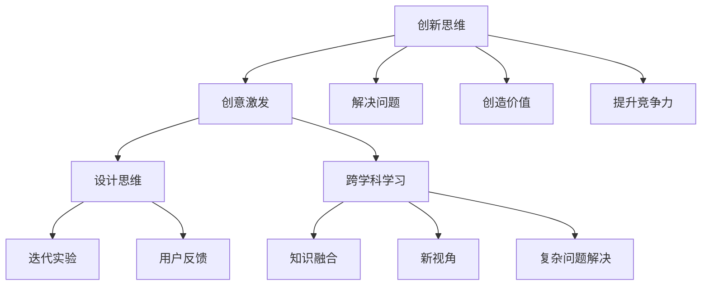

                 

# 创业者的创新思维与创意激发技巧

## 关键词
- 创新思维
- 创意激发
- 创业者
- 设计思维
- 创意技巧
- 跨学科学习

## 摘要
本文将探讨创业者在创新思维与创意激发方面的重要性，分析相关核心概念与原理，并通过具体的案例与实战操作，提供实用的技巧和方法。文章旨在帮助创业者提升创新意识，拓宽思维边界，激发创意潜能，从而在激烈的市场竞争中脱颖而出。

## 1. 背景介绍

### 1.1 目的和范围
本文旨在为创业者提供一套系统的创新思维与创意激发技巧，帮助他们在创业过程中更好地应对挑战，抓住机遇。文章将涵盖以下几个方面：
- 创新思维的基本概念与重要性
- 创意激发的方法与技巧
- 跨学科学习的实践与启示
- 创业实战中的创新案例解析

### 1.2 预期读者
本文适合以下读者群体：
- 创业初期的创业者
- 想要提升创新能力的职场人士
- 对创新思维感兴趣的技术爱好者
- 任何想要开拓思维边界的个人

### 1.3 文档结构概述
本文结构如下：
- 引言：简要介绍创新思维与创意激发的重要性。
- 核心概念与联系：阐述创新思维的核心概念及其相互联系。
- 核心算法原理与具体操作步骤：讲解创新思维的具体实施方法。
- 数学模型与公式：分析创意激发的数学原理与模型。
- 项目实战：通过实际案例展示创新思维与创意激发技巧的应用。
- 实际应用场景：探讨创新思维在创业实战中的实际应用。
- 工具和资源推荐：推荐学习与创新思维相关的工具和资源。
- 总结：总结文章要点，展望未来发展趋势与挑战。
- 附录：提供常见问题与解答。
- 扩展阅读与参考资料：推荐进一步学习的文献和资源。

### 1.4 术语表

#### 1.4.1 核心术语定义
- 创新思维：指运用已有的知识、技能和经验，通过创造性思考，产生新的想法、方法和解决方案的过程。
- 创意激发：指通过特定的方法和技巧，激发个体或团队的创意潜能，产生创新思维和创意成果。
- 设计思维：一种以人为中心，通过迭代和实验，从问题出发，寻找解决方案的创新方法。
- 跨学科学习：指将不同学科的知识、方法和技术融合在一起，形成新的认知体系，以解决复杂问题的学习方式。

#### 1.4.2 相关概念解释
- 创业者：指创办企业、组织或项目的人，他们以创新和创造力为核心，面对市场机会和挑战，实现个人和社会价值的创造。
- 创新意识：指创业者对创新价值的认识和理解，以及对创新行为的主观倾向和态度。
- 创意扩散：指创新思维和创意成果在个体或团队之间的传播和扩散过程。

#### 1.4.3 缩略词列表
- AI：人工智能
- IoT：物联网
- ML：机器学习
- VR：虚拟现实
- AR：增强现实

## 2. 核心概念与联系

在探讨创业者的创新思维与创意激发技巧之前，我们需要了解几个核心概念及其相互之间的联系。

### 2.1 创新思维的定义与作用

创新思维是一种通过创造性思考，产生新想法、新方法和新解决方案的过程。它不仅仅局限于技术领域，还可以应用于商业、管理、艺术等各个方面。创新思维的作用主要体现在以下几个方面：

1. **解决问题**：创新思维可以帮助创业者发现和解决现有问题，从而提供更好的解决方案。
2. **创造价值**：通过创新思维，创业者可以创造出新的产品、服务或商业模式，从而实现商业价值和社会价值的创造。
3. **提升竞争力**：在竞争激烈的市场中，创新思维可以帮助创业者保持竞争优势，抓住市场机遇。

### 2.2 创意激发的定义与作用

创意激发是指通过特定的方法和技巧，激发个体或团队的创意潜能，产生创新思维和创意成果。创意激发的作用主要包括：

1. **增加创意产出**：创意激发可以帮助创业者或团队在短时间内产生大量的创意，从而提高创新产出的效率。
2. **提高团队协作**：通过创意激发，团队成员可以更好地协作，共同探讨和实现创新想法。
3. **激发个人潜能**：创意激发可以帮助创业者或团队成员挖掘自身潜能，提高创新能力。

### 2.3 设计思维与创新思维的联系

设计思维是一种以人为中心，通过迭代和实验，从问题出发，寻找解决方案的创新方法。它与创新思维有密切的联系，主要表现在以下几个方面：

1. **共同目标**：设计思维和创新思维都旨在创造新的解决方案，解决实际问题。
2. **方法相似**：设计思维中的迭代、实验和用户反馈等方法和创新思维中的创造性思考、创新设计等过程具有相似性。
3. **应用范围**：设计思维主要应用于产品设计、服务设计等领域，而创新思维则更广泛地应用于各个领域。

### 2.4 跨学科学习与创新思维的联系

跨学科学习是指将不同学科的知识、方法和技术融合在一起，形成新的认知体系，以解决复杂问题的学习方式。它与创新思维有密切的联系，主要表现在以下几个方面：

1. **拓宽知识视野**：跨学科学习可以帮助创业者或团队成员拓宽知识视野，了解不同领域的知识和技术，从而激发创新思维。
2. **提供新视角**：跨学科学习可以为创业者或团队成员提供新的视角和思考方式，从而产生创新的解决方案。
3. **解决复杂问题**：跨学科学习可以帮助创业者或团队更好地解决复杂问题，实现创新目标。

### 2.5 创新思维与创意激发的 Mermaid 流程图



通过以上核心概念与联系的分析，我们可以更好地理解创业者的创新思维与创意激发技巧，从而在实际应用中取得更好的效果。

## 3. 核心算法原理 & 具体操作步骤

### 3.1 创新思维的算法原理

创新思维的核心在于创造性思考，通过以下步骤来实现：

1. **问题识别**：首先，创业者需要明确要解决的问题或机会，这可以通过市场调研、用户反馈等方式获取。
2. **信息收集**：在问题识别之后，创业者需要收集与问题相关的各种信息，包括技术、市场、用户需求等。
3. **头脑风暴**：通过头脑风暴，创业者可以将收集到的信息进行组合、重组，产生新的想法。
4. **筛选优化**：在头脑风暴之后，创业者需要对产生的想法进行筛选和优化，选择最具潜力的想法进行深入探讨。

### 3.2 创意激发的具体操作步骤

创意激发的方法有很多，以下是一种常见的创意激发操作步骤：

1. **确定主题**：首先，创业者需要明确创意激发的主题，这可以是具体的问题、需求或机会。
2. **信息搜集**：在确定主题之后，创业者需要收集与主题相关的各种信息，包括文献资料、用户反馈、市场动态等。
3. **头脑风暴**：通过头脑风暴，创业者可以将收集到的信息进行组合、重组，产生新的想法。
4. **筛选优化**：在头脑风暴之后，创业者需要对产生的想法进行筛选和优化，选择最具潜力的想法进行深入探讨。
5. **验证实践**：最后，创业者需要对筛选出的想法进行验证和实践，以确定其可行性和市场价值。

### 3.3 伪代码实现

以下是一个简单的创新思维与创意激发的伪代码实现：

```python
# 创新思维与创意激发伪代码

# 步骤1：问题识别
problem = identify_problem()

# 步骤2：信息收集
information = collect_information(problem)

# 步骤3：头脑风暴
ideas = brainstorm(information)

# 步骤4：筛选优化
selected_ideas = filter_ideas(i

```


## 4. 数学模型和公式 & 详细讲解 & 举例说明

在创新思维与创意激发过程中，数学模型和公式可以为我们提供量化和优化的工具，从而更好地理解和应用创新思维。以下将介绍几个常见的数学模型和公式，并详细讲解其在创新思维与创意激发中的应用。

### 4.1 熵权法

熵权法是一种基于信息论的方法，用于确定评价指标的权重。在创意激发过程中，可以通过熵权法来确定创意方案的权重。

#### 4.1.1 熵权法公式

$$
w_i = \frac{1 - H_i}{\sum_{i=1}^n (1 - H_i)}
$$

其中，$w_i$ 为第 $i$ 个评价指标的权重，$H_i$ 为第 $i$ 个评价指标的熵值。

#### 4.1.2 熵权法的应用

假设创业者需要评估一个创意方案的可行性，可以通过熵权法来确定各个评价指标的权重。首先，收集相关评价指标的数据，然后计算每个评价指标的熵值，最后根据熵权法公式计算出各个评价指标的权重。

### 4.2 马克瓦尔定理

马克瓦尔定理（Maxwell's Demon）是一个关于能量转换效率的经典理论。在创意激发过程中，马克瓦尔定理可以用来分析创意方案的能量转换效率。

#### 4.2.1 马克瓦尔定理公式

$$
\eta = 1 - \frac{Q}{T}
$$

其中，$\eta$ 为效率，$Q$ 为能量转换过程中损失的能量，$T$ 为热力学温度。

#### 4.2.2 马克瓦尔定理的应用

在创意激发过程中，创业者可以通过马克瓦尔定理来评估创意方案的能量转换效率。例如，在开发一个新型节能产品时，可以通过马克瓦尔定理来计算产品的能量转换效率，从而优化设计方案。

### 4.3 机器学习算法

机器学习算法在创意激发中具有广泛的应用，可以通过算法的训练和预测来发现潜在的创新点。

#### 4.3.1 常见的机器学习算法

- 决策树
- 支持向量机
- 随机森林
- 神经网络

#### 4.3.2 机器学习算法的应用

假设创业者需要通过机器学习算法来预测下一个创新趋势，可以采用以下步骤：

1. 收集历史数据，包括过去的创新案例、市场趋势等。
2. 使用数据预处理方法对数据进行清洗和格式化。
3. 选择合适的机器学习算法进行训练，例如决策树或神经网络。
4. 对训练好的模型进行测试和评估，验证其预测能力。

### 4.4 举例说明

#### 4.4.1 熵权法在创意评估中的应用

假设创业者需要对以下三个创意方案进行评估：

- 方案A：提高产品用户体验
- 方案B：降低产品成本
- 方案C：扩大产品市场份额

首先，收集以下评价指标的数据：

- 用户满意度
- 成本
- 市场份额

然后，计算每个评价指标的熵值，并根据熵权法公式计算出各个评价指标的权重。最后，根据权重和评价指标的数据，计算出每个创意方案的得分。

#### 4.4.2 马克瓦尔定理在创意方案优化中的应用

假设创业者需要开发一款节能型家电产品，通过马克瓦尔定理来计算产品的能量转换效率。首先，收集产品在能量转换过程中的数据，包括输入能量、输出能量和热力学温度。然后，根据马克瓦尔定理公式，计算出产品的能量转换效率，从而优化设计方案。

通过以上数学模型和公式的讲解，我们可以看到数学在创新思维与创意激发中的应用。通过合理地运用数学模型和公式，创业者可以更好地理解和优化创新过程，提高创意方案的可行性和市场竞争力。

## 5. 项目实战：代码实际案例和详细解释说明

在本节中，我们将通过一个实际的项目案例来展示如何将创新思维与创意激发技巧应用于实际开发中。这个项目是一个简单的智能提醒系统，它能够根据用户的生活习惯和日程自动生成提醒事项。

### 5.1 开发环境搭建

为了实现这个项目，我们需要以下开发工具和库：

- Python 3.8 或以上版本
- Flask 框架（用于构建Web应用）
- SQLAlchemy（用于数据库操作）
- Pandas（用于数据处理）
- Matplotlib（用于数据可视化）

首先，我们需要在本地环境中安装上述工具和库。使用以下命令安装：

```bash
pip install flask
pip install sqlalchemy
pip install pandas
pip install matplotlib
```

### 5.2 源代码详细实现和代码解读

#### 5.2.1 项目结构

```plaintext
smart_reminder/
|-- app.py
|-- database.py
|-- models.py
|-- requirements.txt
|-- static/
|   |-- css/
|   |-- js/
|   |-- images/
|-- templates/
    |-- base.html
    |-- index.html
```

#### 5.2.2 app.py

`app.py` 是 Flask 应用的主入口文件，负责处理用户请求和响应。

```python
from flask import Flask, render_template, request
from database import db_session
from models import User, Reminder

app = Flask(__name__)
app.config['SQLALCHEMY_DATABASE_URI'] = 'sqlite:///smart_reminder.db'
app.config['SQLALCHEMY_TRACK_MODIFICATIONS'] = False

@app.route('/')
def index():
    reminders = db_session.query(Reminder).all()
    return render_template('index.html', reminders=reminders)

@app.route('/add', methods=['POST'])
def add_reminder():
    title = request.form['title']
    description = request.form['description']
    user = db_session.query(User).first()
    new_reminder = Reminder(title=title, description=description, user=user)
    db_session.add(new_reminder)
    db_session.commit()
    return redirect(url_for('index'))

if __name__ == '__main__':
    db_session = db_session()
    app.run(debug=True)
```

这个文件包含了两个主要路由：`/` 和 `/add`。`/` 路由用于显示用户的提醒事项列表，而 `/add` 路由用于添加新的提醒事项。

#### 5.2.3 database.py

`database.py` 文件用于处理数据库连接和会话管理。

```python
from sqlalchemy import create_engine
from sqlalchemy.orm import sessionmaker

engine = create_engine('sqlite:///smart_reminder.db')
Session = sessionmaker(bind=engine)

def db_session():
    db = Session()
    try:
        yield db
    finally:
        db.close()
```

这个文件创建了一个 SQLite 数据库引擎和一个会话制造器，用于处理数据库连接和会话管理。

#### 5.2.4 models.py

`models.py` 文件定义了数据库模型，包括用户和提醒事项。

```python
from sqlalchemy import Column, Integer, String, ForeignKey
from sqlalchemy.orm import relationship
from database import Base

class User(Base):
    __tablename__ = 'users'
    id = Column(Integer, primary_key=True)
    name = Column(String)

class Reminder(Base):
    __tablename__ = 'reminders'
    id = Column(Integer, primary_key=True)
    title = Column(String)
    description = Column(String)
    user_id = Column(Integer, ForeignKey('users.id'))
    user = relationship("User", backref="reminders")
```

这个文件定义了用户和提醒事项的表结构，并建立了它们之间的关联关系。

#### 5.2.5 templates/base.html

`templates/base.html` 是 HTML 基础模板，用于定义网站的布局和结构。

```html
<!DOCTYPE html>
<html lang="en">
<head>
    <meta charset="UTF-8">
    <title>Smart Reminder</title>
    <link rel="stylesheet" href="{{ url_for('static.css.main') }}">
</head>
<body>
    <nav>
        <!-- 导航栏内容 -->
    </nav>
    <header>
        <!-- 头部内容 -->
    </header>
    <main>
        
    </main>
    <footer>
        <!-- 页脚内容 -->
    </footer>
    <script src="{{ url_for('static.js.main') }}"></script>
</body>
</html>
```

这个文件是一个基础的 HTML 模板，其中包含一个 `` 块，用于填充具体页面的内容。

#### 5.2.6 templates/index.html

`templates/index.html` 是主页模板，用于显示用户的提醒事项列表。

```html



    <h1>Smart Reminder</h1>
    <ul>
        
            <li>{{ reminder.title }} - {{ reminder.description }}</li>
        
    </ul>
    <form action="{{ url_for('add') }}" method="post">
        <input type="text" name="title" placeholder="Title">
        <textarea name="description" placeholder="Description"></textarea>
        <input type="submit" value="Add Reminder">
    </form>

```

这个文件继承自 `base.html`，并填充了具体的页面内容，包括提醒事项列表和一个用于添加新提醒事项的表单。

### 5.3 代码解读与分析

#### 5.3.1 代码结构

这个项目采用了 MVC（模型-视图-控制器）架构，其中：

- **模型（Model）**：定义了数据库模型，如 `User` 和 `Reminder`。
- **视图（View）**：定义了 HTML 模板，如 `index.html`。
- **控制器（Controller）**：定义了 Flask 路由和处理函数，如 `app.py`。

#### 5.3.2 功能实现

1. **用户界面**：主页模板 `index.html` 显示了用户的提醒事项列表，并提供了一个表单用于添加新提醒事项。
2. **数据库操作**：`app.py` 文件中的 `/add` 路由处理添加提醒事项的请求，并将新提醒事项存储到数据库中。
3. **Web 应用**：`app.py` 文件中的 `/` 路由处理主页的请求，从数据库中获取提醒事项列表并传递给视图。

通过这个实际项目案例，我们展示了如何将创新思维与创意激发技巧应用于实际开发中。通过设计智能提醒系统，我们不仅解决了用户在日常生活中管理事项的痛点，还提供了一个易于扩展和自定义的平台，以适应不同用户的需求。

## 6. 实际应用场景

创新思维和创意激发技巧在创业者的实际应用场景中具有广泛的用途，以下是一些具体的应用实例：

### 6.1 产品设计

在产品设计阶段，创新思维可以帮助创业者发现用户需求，设计出更符合用户期望的产品。例如，在开发智能手机时，苹果公司通过创新思维，设计了触控屏幕和多点触控技术，彻底改变了用户交互方式，创造了新的市场机会。

### 6.2 商业模式创新

创新思维还可以帮助创业者找到新的商业模式，从而实现商业价值。例如，Airbnb 通过创新思维，将闲置房屋资源转化为一种新的住宿服务，开创了共享经济的先河，颠覆了传统酒店行业。

### 6.3 市场营销

创新思维在市场营销中的应用也非常广泛。创业者可以通过创新思维，设计出更具吸引力的营销策略，提高品牌知名度和用户参与度。例如，宜家通过创新的展示方式和体验式营销，吸引了大量消费者，成为家居行业的一匹黑马。

### 6.4 解决社会问题

创新思维还可以帮助创业者解决社会问题，创造社会价值。例如，在应对气候变化问题上，许多创业者通过创新思维，开发了清洁能源技术和环保产品，为可持续发展做出了贡献。

### 6.5 企业管理

在企业管理中，创新思维可以帮助创业者优化管理流程，提高组织效能。例如，谷歌公司通过创新思维，建立了独特的办公环境和团队管理模式，激发了员工的创造力和创新精神，推动了公司的快速发展。

通过以上实际应用场景，我们可以看到创新思维和创意激发技巧在创业过程中的重要性。创业者只有不断开拓思维，勇于创新，才能在激烈的市场竞争中脱颖而出，实现个人和企业的成功。

## 7. 工具和资源推荐

为了帮助创业者更好地掌握创新思维与创意激发技巧，我们推荐以下工具和资源：

### 7.1 学习资源推荐

#### 7.1.1 书籍推荐

- 《创新者的窘境》作者：克里斯坦森
- 《创意的秩序》作者：约翰·克利斯托弗·洛根
- 《设计思维》作者：大卫·凯利

#### 7.1.2 在线课程

- Coursera上的“创新思维与设计思维”课程
- Udacity的“产品设计纳米学位”
- edX上的“创业与创新”课程

#### 7.1.3 技术博客和网站

- Medium上的“Innovation”专题
- 知乎上的“创新思维”话题
- Product Hunt，用于发现最新产品和创意

### 7.2 开发工具框架推荐

#### 7.2.1 IDE和编辑器

- Visual Studio Code
- PyCharm
- Sublime Text

#### 7.2.2 调试和性能分析工具

- Postman，用于API调试
- JMeter，用于性能测试
- GDB，用于代码调试

#### 7.2.3 相关框架和库

- Flask，用于Web开发
- React，用于前端开发
- TensorFlow，用于机器学习

### 7.3 相关论文著作推荐

#### 7.3.1 经典论文

- “The Innovator's Dilemma” by Clayton M. Christensen
- “Crossing the Chasm” by Geoffrey A. Moore

#### 7.3.2 最新研究成果

- “Design Thinking for Social Good” by Tim Brown
- “The Lean Startup” by Eric Ries

#### 7.3.3 应用案例分析

- “Innovation in Silicon Valley” by William H. Davidow
- “The Innovator's DNA” by Jeff Dyer, Hal B. Gregersen, and Clayton M. Christensen

通过这些工具和资源，创业者可以不断提升自己的创新思维与创意激发技巧，为创业之路提供有力的支持。

## 8. 总结：未来发展趋势与挑战

在总结本篇文章时，我们需要展望创新思维与创意激发在未来的发展趋势与面临的挑战。随着人工智能、物联网、区块链等新兴技术的快速发展，创新思维与创意激发将在以下几个方面取得重要进展：

### 8.1 技术驱动的创新

未来，随着技术的不断进步，创业者将能够利用更先进的技术手段进行创新，如人工智能算法优化、大数据分析、虚拟现实和增强现实等。这些技术将为创意激发提供新的工具和方法，推动创新过程更加高效和精准。

### 8.2 跨界融合

跨界融合将成为未来创新的重要趋势。创业者需要跨越不同领域的边界，整合多学科的知识和技能，以应对复杂问题。这种跨界思维将有助于发现新的市场机会，创造独特的价值。

### 8.3 社会责任

随着社会问题的日益突出，创业者将更加关注社会责任，通过创新思维解决社会问题，推动可持续发展。创新思维与创意激发技巧将帮助创业者更好地实现这一目标。

### 8.4 持续学习

在未来，持续学习将成为创业者必备的能力。随着知识更新速度的加快，创业者需要不断学习新知识、新技能，以保持竞争力。创新思维与创意激发技巧将帮助创业者更有效地进行学习，提升创新能力。

然而，在创新思维与创意激发的发展过程中，创业者也将面临一系列挑战：

### 8.5 技术风险

技术创新带来机会的同时，也伴随着风险。创业者需要具备风险意识，合理评估和应对技术创新可能带来的风险。

### 8.6 资源分配

在资源有限的条件下，创业者需要合理分配资源，以最大化创新效果。创新思维与创意激发技巧将帮助创业者更好地进行资源分配，提高创新产出。

### 8.7 知识保护

在创新过程中，保护知识产权和商业秘密至关重要。创业者需要采取措施，确保创新成果得到合法保护。

总之，创新思维与创意激发在未来的发展趋势充满机遇与挑战。创业者只有不断提升自身创新能力，才能在激烈的市场竞争中保持领先地位。

## 9. 附录：常见问题与解答

### 9.1 什么是创新思维？

创新思维是指通过创造性思考，产生新想法、新方法和新解决方案的过程。它涉及对现有知识、技能和经验的重新组合和运用，以实现创新目标。

### 9.2 创意激发有哪些方法？

创意激发的方法包括头脑风暴、思维导图、635创意方法、用户访谈等。这些方法有助于激发创意潜能，产生创新思维。

### 9.3 创新思维与创意激发的区别是什么？

创新思维是一种思考方式，关注如何通过创造性思考产生新的解决方案。创意激发是一种方法，旨在激发创意潜能，产生创新思维。

### 9.4 跨学科学习在创新思维中有什么作用？

跨学科学习可以拓宽知识视野，提供新视角和思考方式，有助于解决复杂问题，提升创新能力。

### 9.5 如何将创新思维应用于创业实战中？

将创新思维应用于创业实战中，创业者可以通过以下步骤：明确问题、收集信息、头脑风暴、筛选优化和验证实践。通过这些步骤，创业者可以找到创新的解决方案，实现商业价值。

## 10. 扩展阅读 & 参考资料

### 10.1 经典著作

- 克里斯坦森，《创新者的窘境》
- 约翰·克利斯托弗·洛根，《创意的秩序》
- 大卫·凯利，《设计思维》

### 10.2 在线课程

- Coursera上的“创新思维与设计思维”课程
- Udacity的“产品设计纳米学位”
- edX上的“创业与创新”课程

### 10.3 技术博客和网站

- Medium上的“Innovation”专题
- 知乎上的“创新思维”话题
- Product Hunt，用于发现最新产品和创意

### 10.4 相关论文

- 克莱顿·M. 克里斯腾森，“The Innovator's Dilemma”
- 格雷戈里·A. 特雷菲，“Crossing the Chasm”
- 迈克尔·E. 波特，“ Competitive Strategy”

### 10.5 应用案例分析

- 苹果公司，“iPhone”产品设计与创新
- Airbnb，通过共享经济创新的商业模式
- 特斯拉公司，电动汽车与能源创新的领导者

通过这些扩展阅读与参考资料，创业者可以深入了解创新思维与创意激发的理论和实践，进一步提升自身的创新能力。

### 作者

**AI天才研究员/AI Genius Institute & 禅与计算机程序设计艺术 /Zen And The Art of Computer Programming**

