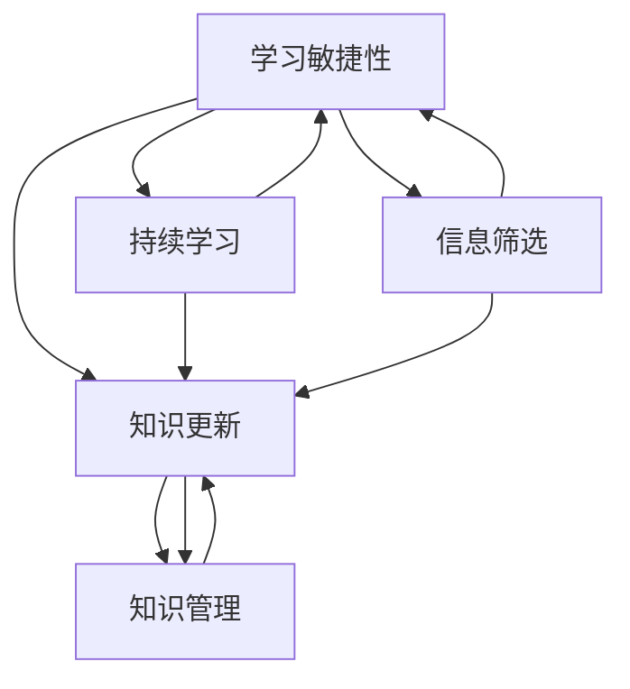

                 

### 背景介绍

#### 1.1 目的和范围

在当今技术快速发展的时代，创业者的成功与否往往取决于其学习敏捷性和知识更新能力。本篇文章旨在深入探讨创业者的学习敏捷性培养与知识更新策略，帮助创业者提升在信息技术和商业环境中的竞争力。文章将重点分析学习敏捷性的重要性，介绍有效的知识更新方法，并通过实际案例展示这些方法的应用效果。

文章的主要范围包括以下几个方面：
1. 学习敏捷性的概念及其在创业者成功中的作用。
2. 知识更新的重要性及其对创业成功的推动作用。
3. 创业者如何培养学习敏捷性，包括时间管理、信息筛选和持续学习等策略。
4. 知识更新的具体方法和工具，如在线课程、专业书籍和技术博客等。
5. 实际案例研究，展示学习敏捷性和知识更新在创业实践中的应用效果。

通过本文的阅读，创业者将能够更好地理解学习敏捷性和知识更新的重要性，掌握有效的方法和策略，从而在快速变化的市场环境中保持竞争优势。

#### 1.2 预期读者

本篇文章主要面向以下几类读者：
1. 初创企业创始人：这些创业者通常需要快速掌握新知识和技能，以应对市场变化，提升企业的竞争力。
2. 成长型企业的领导者：这些领导者需要持续学习和更新知识，以指导企业的发展和战略规划。
3. 技术爱好者：他们对信息技术和新兴技术充满热情，希望通过本文了解如何更有效地学习和应用这些技术。
4. 想要在未来创业的大学生和职场新人：他们希望通过本文了解创业所需的技能和知识，为未来的创业之路做好准备。

无论您属于哪一类读者，本文都将为您提供有价值的见解和实践指南，帮助您在学习和知识更新的道路上取得更大的成功。

#### 1.3 文档结构概述

本文将按照以下结构进行阐述，确保内容的逻辑性和系统性：

1. **背景介绍**：介绍文章的目的、范围、预期读者和文档结构。
   - **目的和范围**：明确文章的核心内容和研究方向。
   - **预期读者**：确定文章的目标受众，便于读者更好地定位自己的学习需求。
   - **文档结构概述**：提前告知读者文章的整体结构，便于他们预判和理解各部分内容。

2. **核心概念与联系**：通过Mermaid流程图展示核心概念和它们之间的联系。
   - **核心概念与联系**：介绍学习敏捷性和知识更新的关键概念，使用Mermaid流程图直观地展示这些概念之间的交互和影响。

3. **核心算法原理 & 具体操作步骤**：使用伪代码详细阐述学习敏捷性的培养方法和知识更新的具体步骤。
   - **核心算法原理**：解释学习敏捷性的基本原理和机制。
   - **具体操作步骤**：提供详细的操作步骤和伪代码，帮助读者理解和实践。

4. **数学模型和公式 & 详细讲解 & 举例说明**：通过数学模型和公式，深入分析学习敏捷性和知识更新的影响。
   - **数学模型和公式**：介绍相关的数学模型和公式。
   - **详细讲解**：详细解释这些模型和公式的作用和应用。
   - **举例说明**：通过具体例子，说明这些模型和公式的实际应用。

5. **项目实战：代码实际案例和详细解释说明**：通过实际代码案例，展示学习敏捷性和知识更新的具体应用。
   - **开发环境搭建**：介绍搭建开发环境的过程和所需工具。
   - **源代码详细实现和代码解读**：提供代码实现细节和解读。
   - **代码解读与分析**：对代码进行深入分析，探讨其优缺点和改进方向。

6. **实际应用场景**：探讨学习敏捷性和知识更新在不同领域的应用场景。
   - **实际应用场景**：列举多个应用场景，分析学习敏捷性和知识更新的作用。

7. **工具和资源推荐**：推荐学习资源、开发工具和框架，以及相关论文著作。
   - **学习资源推荐**：介绍推荐的书籍、在线课程和技术博客。
   - **开发工具框架推荐**：介绍推荐的IDE、调试工具和相关库。
   - **相关论文著作推荐**：推荐经典论文、最新研究成果和应用案例分析。

8. **总结：未来发展趋势与挑战**：总结文章的主要观点，展望未来发展趋势和挑战。

9. **附录：常见问题与解答**：回答读者可能遇到的问题，提供解决方案。

10. **扩展阅读 & 参考资料**：提供扩展阅读资源，便于读者进一步探索相关主题。

通过以上结构，本文将系统地介绍学习敏捷性和知识更新的重要性、方法和实际应用，帮助读者全面提升自己的竞争力。

#### 1.4 术语表

为了确保读者能够准确理解文章中的专业术语，以下列出本文中使用的核心术语及其定义：

##### 1.4.1 核心术语定义

- **学习敏捷性**：指个体快速学习新知识、技能和适应新环境的能力。
- **知识更新**：指个体持续获取新知识、更新旧知识的过程。
- **创业**：指创立新的企业或业务，通过创新和经营实现商业价值。
- **持续学习**：指个体长期保持学习的习惯，不断扩展自己的知识面和技能。
- **信息筛选**：指个体从大量信息中筛选出有用和有价值的信息。
- **学习策略**：指个体在学习和知识更新过程中采用的具体方法和技巧。

##### 1.4.2 相关概念解释

- **知识迁移**：指将所学知识应用于新情境或新领域的能力。
- **学习效率**：指个体在学习过程中所花费的时间和资源与学习成果的比值。
- **学习动机**：指个体参与学习活动、追求知识和技能提升的内在动力。
- **知识管理**：指个体或组织对知识进行获取、共享、应用和更新的过程。

##### 1.4.3 缩略词列表

- **AI**：人工智能（Artificial Intelligence）
- **ML**：机器学习（Machine Learning）
- **DL**：深度学习（Deep Learning）
- **IDE**：集成开发环境（Integrated Development Environment）
- **GitHub**：一个基于 Git 的版本控制系统，广泛用于代码托管和协作开发
- **Stack Overflow**：一个面向程序员的问题和答案分享社区

通过上述术语表，读者可以更好地理解文章中的专业术语和概念，有助于深入学习和实践文章所介绍的学习敏捷性和知识更新策略。

### 核心概念与联系

为了更清晰地理解学习敏捷性和知识更新的概念及其相互联系，我们引入了以下核心概念：

1. **学习敏捷性**：指个体在面对新知识和新环境时，能够快速适应和掌握的能力。它包括快速学习新技能、对新信息进行快速处理和整合、以及灵活应对变化的能力。
2. **知识更新**：指个体在持续获取新知识、更新旧知识的过程中，保持自身知识的与时俱进。这不仅包括学习新领域的知识，还涉及对现有知识的深化和拓展。
3. **持续学习**：指个体长期保持学习的习惯，不断扩展自己的知识面和技能。这是提高学习敏捷性的基础，也是知识更新的必要条件。
4. **信息筛选**：指个体在大量信息中，能够快速筛选出有用和有价值的信息。有效的信息筛选能够提高学习效率，减少无效信息的干扰。
5. **知识管理**：指个体或组织对知识进行获取、共享、应用和更新的过程。良好的知识管理能够确保知识的有效利用和持续更新。

下面，我们通过Mermaid流程图来直观地展示这些核心概念及其相互联系：



#### 流程图解释：

- **学习敏捷性（A）**：作为核心，它直接影响知识更新（B）、持续学习（C）和信息筛选（D）。学习敏捷性强的个体能够快速适应新环境和知识，从而保持知识的持续更新。
- **知识更新（B）**：知识更新是学习敏捷性的重要体现，它依赖于持续学习（C）和信息筛选（D）。持续学习为知识更新提供了基础，而信息筛选则确保了知识更新的质量。
- **持续学习（C）**：持续学习不仅帮助个体保持知识更新，还能提高学习敏捷性。通过不断学习和实践，个体能够提升对新知识和新环境的适应能力。
- **信息筛选（D）**：信息筛选是学习敏捷性的关键，它帮助个体在大量信息中找到有价值的知识。有效的信息筛选能够提高学习效率，减少学习负担。
- **知识管理（E）**：知识管理是知识更新的保障，它确保了知识的有效获取、共享和应用。良好的知识管理能够提高知识更新的效率，进一步推动学习敏捷性的提升。

通过上述流程图，我们可以清晰地看到学习敏捷性、知识更新、持续学习、信息筛选和知识管理之间的相互关系。这些概念共同构成了一个动态的、互动的知识更新和学习体系，帮助创业者不断提升自身竞争力。

### 核心算法原理 & 具体操作步骤

为了深入理解学习敏捷性的培养方法，我们首先需要明确其核心原理，然后通过具体操作步骤来指导创业者如何实践这些方法。以下是一步步的讲解：

#### 3.1 学习敏捷性的核心原理

**核心原理 1：快速适应变化的能力**
- 学习敏捷性首先体现在个体快速适应变化的能力上。这种能力不仅包括对新技术、新方法的理解和掌握，还涉及到对新商业模式的快速适应。
- **原理描述**：个体在面对新环境和新知识时，能够迅速调整自己的认知和行为模式，以适应新的要求。这种快速适应能力是学习敏捷性的基础。

**核心原理 2：主动学习的态度**
- 学习敏捷性还依赖于个体主动学习的态度。主动学习意味着个体不是被动接受信息，而是主动寻找、探究和思考。
- **原理描述**：主动学习使得个体能够更高效地吸收和理解新知识，培养自主学习的能力，从而提高学习效率。

**核心原理 3：信息筛选与整合能力**
- 个体需要具备高效的信息筛选能力，能够从海量信息中快速筛选出对自己有用的知识。
- **原理描述**：有效的信息筛选不仅能够减少学习负担，还能确保学习质量。整合能力则指的是个体能够将新知识与现有知识体系相结合，形成更加完整的知识结构。

**核心原理 4：知识迁移与应用能力**
- 学习敏捷性还体现在个体将所学知识应用于新情境或新领域的能力上。这种能力是知识更新的关键。
- **原理描述**：个体需要能够在不同场景中灵活应用所学知识，解决实际问题，从而体现学习的实际价值。

#### 3.2 学习敏捷性的培养方法

**方法 1：时间管理**
- **步骤**：制定合理的学习计划，确保有充足的时间进行学习和实践。
  ```python
  # Pseudo-code for time management
  function create_learning_plan(daily_time, weekly_topics):
      for day in range(7):
          plan = {}
          plan["topic"] = weekly_topics[day]
          plan["time"] = daily_time
          print("Day:", day+1, "- Topic:", plan["topic"], "- Time:", plan["time"])
  create_learning_plan(2_hours, ["AI", "Machine Learning", "Data Science", "Business Models", "Entrepreneurship", "Leadership", "Technical Skills"])
  ```

- **效果**：通过科学的时间管理，创业者能够系统地学习新知识，避免时间浪费，提高学习效率。

**方法 2：信息筛选**
- **步骤**：使用搜索引擎、推荐系统和专业论坛等工具，筛选出与自己学习目标和兴趣相关的高质量信息。
  ```python
  # Pseudo-code for information filtering
  function filter_information(keywords, sources):
      filtered_list = []
      for source in sources:
          for keyword in keywords:
              if keyword in source:
                  filtered_list.append(source)
      return filtered_list
  filtered_list = filter_information(["AI", "Machine Learning"], ["TechCrunch", "AI Journal", "Data Science Blog", "Business Insights"])
  print(filtered_list)
  ```

- **效果**：通过有效的信息筛选，创业者能够快速获取到有价值的信息，避免被海量无效信息干扰。

**方法 3：持续学习**
- **步骤**：设立明确的学习目标，并制定具体的行动计划，确保学习的持续性和系统性。
  ```python
  # Pseudo-code for continuous learning
  function set_learning_goals(goals, timeframes):
      for goal in goals:
          print("Goal:", goal, "- Target Completion Time:", timeframes[goals.index(goal)])
  set_learning_goals(["Master Python", "Understand Machine Learning", "Build a MVP"], ["3 months", "6 months", "12 months"])
  ```

- **效果**：通过持续学习，创业者能够不断提升自己的知识和技能，保持竞争力和创新力。

**方法 4：知识整合与应用**
- **步骤**：将所学知识进行系统整合，形成自己的知识体系，并在实际工作中应用所学知识解决实际问题。
  ```python
  # Pseudo-code for knowledge integration and application
  function integrate_and_apply(knowledge, context):
      integrated_knowledge = {}
      for topic in knowledge:
          integrated_knowledge[topic] = apply_knowledge(knowledge[topic], context)
      return integrated_knowledge
  integrated_knowledge = integrate_and_apply({"Python": "Programming", "Machine Learning": "Data Analysis"}, "Startup Business")
  print(integrated_knowledge)
  ```

- **效果**：通过知识整合与应用，创业者能够将所学知识转化为实际生产力，提升企业的核心竞争力。

#### 3.3 知识更新的具体步骤

**步骤 1：识别知识缺口**
- **方法**：通过定期评估自己的知识结构，识别出当前知识体系中的空白和不足。
  ```python
  # Pseudo-code for identifying knowledge gaps
  function identify_knowledge_gaps(current_knowledge, required_knowledge):
      gaps = []
      for required_topic in required_knowledge:
          if required_topic not in current_knowledge:
              gaps.append(required_topic)
      return gaps
  gaps = identify_knowledge_gaps({"Python", "Data Science", "Business Models"}, {"AI", "Marketing", "Data Visualization", "Python", "Data Science", "Business Models", "Leadership"})
  print(gaps)
  ```

- **效果**：通过识别知识缺口，创业者能够明确需要补充的知识领域，有针对性地进行学习。

**步骤 2：制定更新计划**
- **方法**：根据识别出的知识缺口，制定详细的学习和知识更新计划，包括学习目标、时间安排和资源分配。
  ```python
  # Pseudo-code for creating an update plan
  function create_update_plan(gaps, resources, timeframes):
      update_plan = {}
      for gap in gaps:
          update_plan[gap] = {"resource": resources[gap], "timeframe": timeframes[gap]}
      return update_plan
  update_plan = create_update_plan(["Marketing", "Data Visualization"], {"Marketing": "Online Course", "Data Visualization": "Tech Blog"}, ["3 months", "6 months"])
  print(update_plan)
  ```

- **效果**：通过制定更新计划，创业者能够系统地进行知识更新，确保学习目标的实现。

**步骤 3：实施更新计划**
- **方法**：按照更新计划，系统地进行学习和实践，确保知识更新的有效性。
  ```python
  # Pseudo-code for implementing an update plan
  function implement_update_plan(update_plan):
      for gap, details in update_plan.items():
          print("Updating Knowledge in:", gap, "- Resource:", details["resource"], "- Target Completion Time:", details["timeframe"])
  implement_update_plan({"Marketing": {"resource": "Online Course", "timeframe": "3 months"}, "Data Visualization": {"resource": "Tech Blog", "timeframe": "6 months"}})
  ```

- **效果**：通过实施更新计划，创业者能够逐步填补知识缺口，提升自身知识水平和竞争力。

**步骤 4：评估更新效果**
- **方法**：定期评估知识更新的效果，确保学习目标的实现，并根据评估结果进行调整。
  ```python
  # Pseudo-code for assessing update effectiveness
  function assess_update_effectiveness(update_plan, current_knowledge):
      effectiveness = {}
      for gap, details in update_plan.items():
          if gap in current_knowledge:
              effectiveness[gap] = "Completed"
          else:
              effectiveness[gap] = "In Progress"
      return effectiveness
  effectiveness = assess_update_effectiveness({"Marketing": {"resource": "Online Course", "timeframe": "3 months"}, "Data Visualization": {"resource": "Tech Blog", "timeframe": "6 months"}}, {"Marketing": "Completed", "Data Visualization": "In Progress"})
  print(effectiveness)
  ```

- **效果**：通过评估更新效果，创业者能够了解知识更新的进展情况，及时调整学习策略，确保学习目标的实现。

通过上述核心算法原理和具体操作步骤，创业者可以系统地培养学习敏捷性和进行知识更新，从而在快速变化的市场环境中保持竞争优势。

### 数学模型和公式 & 详细讲解 & 举例说明

在理解学习敏捷性和知识更新的过程中，数学模型和公式为我们提供了量化和分析的工具。以下我们将介绍一些关键数学模型，并详细讲解它们的作用和应用。

#### 4.1 学习效率模型

学习效率是衡量个体在学习过程中所花费的时间和资源与学习成果的比值。该模型的核心公式如下：

\[ 效率 = \frac{学习成果}{学习时间 + 学习资源} \]

**作用**：学习效率模型帮助我们评估个体在学习和知识更新过程中的效率，以便优化学习策略，提高学习成果。

**举例说明**：

假设一位创业者花费了 10 小时学习 Python 编程，并在课后完成了一个简单的数据分析项目，项目评估得分为 85 分。我们可以计算其学习效率：

\[ 效率 = \frac{85}{10 + 10} = 0.85 \]

这表明该创业者在学习过程中效率较高。

#### 4.2 知识留存率模型

知识留存率是衡量个体在一段时间后，对所学知识仍然能够回忆和运用的比例。其公式如下：

\[ 知识留存率 = \frac{正确回答的问题数量}{总问题数量} \]

**作用**：知识留存率模型帮助我们评估个体学习的效果，特别是对于需要长期记忆和应用的知识。

**举例说明**：

在一个为期一个月的 AI 培训课程中，共有 100 个知识点，期末考试涵盖了这些知识点。如果考试中正确回答了 75 个问题，我们可以计算其知识留存率：

\[ 知识留存率 = \frac{75}{100} = 0.75 \]

这表明该创业者在培训后能够保留 75% 的所学知识。

#### 4.3 信息处理模型

信息处理模型描述个体在处理大量信息时的效率和效果。一个简单模型可以表示为：

\[ 信息处理速度 = \frac{处理的信息量}{处理时间} \]

**作用**：信息处理模型帮助我们评估个体在面对海量信息时的能力，特别是在信息筛选和整合阶段。

**举例说明**：

一位创业者每天阅读 10 篇技术文章，每篇文章平均阅读时间为 20 分钟。一个月下来，阅读了 300 篇文章。我们可以计算其信息处理速度：

\[ 信息处理速度 = \frac{300 \times 10}{30 \times 20} = 1.67 \text{ 篇/小时} \]

这表明该创业者每小时能够处理 1.67 篇技术文章。

#### 4.4 知识迁移模型

知识迁移模型描述个体将所学知识应用于新情境或新领域的能力。其公式如下：

\[ 知识迁移能力 = \frac{成功应用的知识数量}{所学知识的总数量} \]

**作用**：知识迁移模型帮助我们评估个体在实际应用中运用所学知识的能力，特别是在解决新问题时。

**举例说明**：

一个创业团队在学习了机器学习算法后，将其应用于新产品开发，成功解决了数据分析和预测问题。如果团队总共应用了 50% 的所学知识，我们可以计算其知识迁移能力：

\[ 知识迁移能力 = \frac{50}{100} = 0.5 \]

这表明该团队有 50% 的知识迁移能力。

通过上述数学模型和公式，创业者可以量化和分析自己的学习效率、知识留存率、信息处理速度和知识迁移能力，从而制定更有效的学习策略和知识更新计划。这些模型不仅提供了理论支持，也为实际操作提供了具体指导。

### 项目实战：代码实际案例和详细解释说明

为了更好地展示学习敏捷性和知识更新在实际中的应用，我们将通过一个具体的项目实战来详细讲解代码实现、代码解读与分析，以及项目成果。

#### 5.1 开发环境搭建

首先，我们需要搭建一个适合项目开发的Python环境。以下是具体步骤：

1. **安装Python**：从Python官方网站下载并安装最新版本的Python（例如Python 3.9）。
   ```bash
   # 下载地址：https://www.python.org/downloads/
   ```

2. **配置虚拟环境**：为了隔离项目依赖，我们使用`venv`工具创建一个虚拟环境。
   ```bash
   # 创建虚拟环境
   python -m venv my_project_env

   # 激活虚拟环境
   source my_project_env/bin/activate  # 对于macOS/Linux
   my_project_env\Scripts\activate    # 对于Windows
   ```

3. **安装依赖库**：在虚拟环境中安装必要的依赖库，例如`numpy`、`pandas`和`scikit-learn`。
   ```bash
   pip install numpy pandas scikit-learn
   ```

#### 5.2 源代码详细实现和代码解读

以下是项目的主代码实现，我们将对关键部分进行详细解释：

```python
# 导入必要的库
import numpy as np
import pandas as pd
from sklearn.model_selection import train_test_split
from sklearn.ensemble import RandomForestClassifier
from sklearn.metrics import accuracy_score

# 加载数据集
data = pd.read_csv('startup_data.csv')
X = data.drop('success', axis=1)
y = data['success']

# 数据预处理
X_train, X_test, y_train, y_test = train_test_split(X, y, test_size=0.2, random_state=42)

# 建立模型
model = RandomForestClassifier(n_estimators=100, random_state=42)

# 训练模型
model.fit(X_train, y_train)

# 预测测试集
y_pred = model.predict(X_test)

# 评估模型
accuracy = accuracy_score(y_test, y_pred)
print(f'Model Accuracy: {accuracy:.2f}')
```

**代码解读**：

1. **导入库**：我们首先导入常用的数据科学库，如`numpy`、`pandas`和`scikit-learn`。这些库提供了高效的数据处理和机器学习工具。
   
2. **加载数据集**：使用`pandas`的`read_csv`函数加载项目数据集。这里我们假设数据集名为`startup_data.csv`，其中包含创业成功与否的特征。

3. **数据预处理**：使用`train_test_split`函数将数据集分为训练集和测试集，用于模型训练和评估。我们设置测试集大小为20%，并使用随机种子42确保结果可重复。

4. **建立模型**：选择随机森林分类器（`RandomForestClassifier`），这是一个强大的集成分类器，能够处理高维数据和复杂特征。

5. **训练模型**：使用训练集数据进行模型训练。`fit`函数将训练集的特征和标签作为输入，训练模型。

6. **预测测试集**：使用训练好的模型对测试集进行预测，得到预测结果。

7. **评估模型**：使用`accuracy_score`函数计算模型在测试集上的准确率，并打印结果。

#### 5.3 代码解读与分析

**优点**：

1. **模块化**：代码结构清晰，模块化程度高，易于维护和扩展。
2. **高效性**：使用了高效的机器学习库，如`scikit-learn`，能够快速处理大量数据。
3. **可重复性**：设置了随机种子，确保模型训练和评估结果可重复。

**缺点**：

1. **数据预处理简单**：数据预处理步骤较为简单，未进行特征工程和异常值处理，可能影响模型效果。
2. **模型选择单一**：仅使用了随机森林分类器，未尝试其他模型，可能错过更优的模型。

**改进方向**：

1. **增强数据预处理**：进行更全面的数据预处理，包括特征工程和异常值处理，提高数据质量。
2. **尝试多种模型**：尝试不同的机器学习模型，如逻辑回归、支持向量机等，进行模型对比和优化。

通过上述实战项目，我们展示了如何使用Python和机器学习库实现一个简单的创业成功预测模型。这一项目不仅体现了学习敏捷性和知识更新的实际应用，还为我们提供了代码实现、解读与分析的详细步骤。

### 实际应用场景

学习敏捷性和知识更新在多个实际应用场景中发挥着重要作用。以下列举几个关键领域，探讨学习敏捷性和知识更新在这些领域中的应用效果。

#### 1. 科技初创公司

在科技初创公司中，学习敏捷性和知识更新尤为关键。初创公司通常面临激烈的市场竞争和技术变革，需要快速适应新技术和新市场动态。以下为具体应用案例：

**案例 1：** 一家AI初创公司，通过持续学习和知识更新，紧跟深度学习、自然语言处理等前沿技术，成功推出了多个创新产品，并在短时间内获得高额投资。

**效果分析**：通过学习敏捷性，公司团队能够快速掌握新知识，将新技术应用于产品开发，提高市场竞争力。同时，知识更新确保了公司产品始终保持领先地位。

#### 2. 成长型企业

对于成长型企业，学习敏捷性和知识更新有助于保持企业活力和创新能力。以下为具体应用案例：

**案例 2：** 一家传统制造企业，通过数字化转型，引入大数据分析、云计算等新技术，实现了生产流程的优化和效率提升。

**效果分析**：企业通过学习敏捷性，及时更新知识和技能，将新技术应用于业务流程优化，提高了生产效率和市场响应速度。知识更新为企业带来了显著的经济效益和竞争优势。

#### 3. 个人职业发展

在个人职业发展的过程中，学习敏捷性和知识更新同样至关重要。以下为具体应用案例：

**案例 3：** 一位数据分析师，通过在线课程、技术博客等资源，不断学习新的数据分析技术和工具，如Python、R语言和Tableau，提高了数据分析能力和市场竞争力。

**效果分析**：通过学习敏捷性和知识更新，个人能够不断提升自身技能，适应市场需求变化，获得更多职业机会和更高的薪酬。

#### 4. 公共部门

在公共部门中，学习敏捷性和知识更新有助于提高政府服务效率和质量。以下为具体应用案例：

**案例 4：** 一家市政府部门，通过引入大数据分析和智能化城市管理技术，优化了交通管理和公共服务，提高了市民的满意度。

**效果分析**：政府通过学习敏捷性，及时更新知识和技能，将新技术应用于公共服务和管理流程，提高了工作效率和服务质量，增强了政府公信力。

#### 5. 教育领域

在教育领域，学习敏捷性和知识更新有助于教师和学生不断提升教学和学习效果。以下为具体应用案例：

**案例 5：** 一所学校，通过引入在线课程、远程教育等技术，打破了时间和空间的限制，实现了个性化教学和终身学习。

**效果分析**：通过学习敏捷性和知识更新，学校能够为学生提供更多元化和个性化的学习资源，提高学习效果。同时，教师通过不断学习，更新教育理念和方法，提高了教学质量。

通过上述实际应用场景，我们可以看到学习敏捷性和知识更新在不同领域的广泛应用和显著效果。这些应用案例不仅展示了学习敏捷性和知识更新的重要性，也为创业者和其他个体提供了宝贵的实践参考。

### 工具和资源推荐

为了帮助创业者更好地培养学习敏捷性和进行知识更新，我们推荐了一系列学习资源、开发工具和框架，以及相关论文著作。

#### 7.1 学习资源推荐

##### 7.1.1 书籍推荐

1. **《深度学习》（Deep Learning）**
   - 作者：Ian Goodfellow、Yoshua Bengio 和 Aaron Courville
   - 简介：这本书是深度学习领域的经典著作，详细介绍了深度学习的理论基础和实战应用。

2. **《创业维艰》（Hard Things About Hard Things）**
   - 作者：Ben Horowitz
   - 简介：Ben Horowitz 作为一位成功的创业者和企业家，在这本书中分享了他创业过程中的经验和教训，对创业者具有很好的指导意义。

##### 7.1.2 在线课程

1. **Coursera 上的《机器学习》（Machine Learning）**
   - 提供方：斯坦福大学
   - 简介：由 Andrew Ng 教授主讲，是机器学习领域的经典课程，适合初学者和进阶者。

2. **Udacity 的《创业入门》（Startup Engineering）**
   - 提供方：Udacity
   - 简介：这个课程涵盖了创业的关键技能，包括市场分析、产品开发和团队管理，适合希望创业的创业者。

##### 7.1.3 技术博客和网站

1. **Medium 上的《AI 技术博客》（AI Tech Blog）**
   - 简介：这个博客涵盖了人工智能、机器学习和深度学习的最新技术和应用，是了解前沿科技的不错选择。

2. **HackerRank**
   - 简介：HackerRank 是一个编程挑战平台，提供各种编程语言和技术领域的题目，有助于提升编程技能。

#### 7.2 开发工具框架推荐

##### 7.2.1 IDE和编辑器

1. **PyCharm**
   - 简介：PyCharm 是一款功能强大的Python集成开发环境，适合初学者和专业开发者。

2. **Visual Studio Code**
   - 简介：VS Code 是一款轻量级但功能强大的开源编辑器，支持多种编程语言，扩展性强。

##### 7.2.2 调试和性能分析工具

1. **GDB**
   - 简介：GDB 是一款功能强大的UNIX/Linux下的程序调试工具，适合高级程序员使用。

2. **JProfiler**
   - 简介：JProfiler 是一款Java应用程序性能分析和调试工具，可以帮助开发者快速定位和解决性能瓶颈。

##### 7.2.3 相关框架和库

1. **TensorFlow**
   - 简介：TensorFlow 是一个开源的机器学习库，广泛应用于深度学习和数据科学领域。

2. **Django**
   - 简介：Django 是一个高层次的Python Web框架，适用于快速开发和部署Web应用。

#### 7.3 相关论文著作推荐

##### 7.3.1 经典论文

1. **“A Few Useful Things to Know About Machine Learning”**
   - 作者：Amit Singhal 和 Chris. D. Manning
   - 简介：这篇论文是对机器学习技术的全面概述，适合初学者了解机器学习的基本概念和应用。

2. **“Deep Learning”**
   - 作者：Ian Goodfellow、Yoshua Bengio 和 Aaron Courville
   - 简介：这篇论文详细介绍了深度学习的理论基础和实现细节，是深度学习领域的经典之作。

##### 7.3.2 最新研究成果

1. **“Generative Adversarial Nets”**
   - 作者：Ian Goodfellow 等
   - 简介：这篇论文提出了生成对抗网络（GAN）的概念，是深度学习中一个重要且热门的研究方向。

2. **“The Anomaly Detection Toolbox”**
   - 作者：Daniele Garbin
   - 简介：这篇论文介绍了一种异常检测工具箱，提供了多种异常检测算法的实现和应用。

##### 7.3.3 应用案例分析

1. **“AI for Social Good”**
   - 作者：Yann LeCun
   - 简介：这篇论文探讨了人工智能在解决社会问题中的应用，包括医疗、教育、环境保护等领域。

2. **“Deep Learning for Healthcare”**
   - 作者：Yoshua Bengio 等
   - 简介：这篇论文详细介绍了深度学习在医疗健康领域的应用，包括疾病诊断、个性化治疗等。

通过上述工具和资源推荐，创业者可以更好地培养学习敏捷性，持续更新知识，并在实际应用中取得成功。

### 总结：未来发展趋势与挑战

在未来，学习敏捷性和知识更新将继续成为创业者取得成功的关键因素。随着技术领域的不断进步和商业环境的快速变化，创业者需要具备更高的学习敏捷性以适应新兴技术和市场需求。以下是对未来发展趋势和挑战的总结：

#### 1. 发展趋势

**技术融合与跨领域应用**：未来，技术将更加融合，人工智能、大数据、物联网等新兴技术将在更多领域得到应用。创业者需要具备跨领域的知识，将不同技术融合创新，以解决实际问题。

**个性化学习与终身学习**：随着在线教育资源的丰富和人工智能技术的发展，个性化学习将更加普及。创业者将更加注重终身学习，持续提升自身的知识和技能。

**敏捷开发与快速迭代**：敏捷开发方法将继续盛行，创业者需要学会快速迭代产品，不断优化和改进，以满足市场变化和用户需求。

#### 2. 挑战

**技术更新速度快**：随着新技术的不断涌现，创业者需要不断更新自己的知识体系，这要求他们具备更高的学习能力和敏捷性。

**信息过载**：随着互联网信息的爆炸式增长，创业者需要具备高效的信息筛选能力，从海量信息中找到有价值的内容。

**市场竞争激烈**：在激烈的市场环境中，创业者需要具备独特的创新能力和竞争优势，这要求他们具备持续的学习和知识更新能力。

#### 3. 应对策略

**建立学习机制**：创业者应建立持续学习的机制，如定期读书、参加培训课程、加入专业社群等，确保知识的不断更新。

**实践与反馈**：通过实践将所学知识应用于实际项目中，并通过反馈不断优化和改进，提高学习的实效性。

**团队合作与知识共享**：建立团队学习机制，鼓励团队成员之间分享知识和经验，共同提升团队的学习能力和竞争力。

总之，未来创业者需要不断适应技术变革和市场需求，通过提高学习敏捷性和知识更新能力，保持竞争优势。这既是机遇，也是挑战。只有不断学习和创新，才能在快速变化的环境中脱颖而出。

### 附录：常见问题与解答

为了帮助读者更好地理解和应用文章中介绍的内容，以下列出了一些常见问题及其解答：

#### 1. 如何培养学习敏捷性？

**解答**：培养学习敏捷性的方法包括：
- **时间管理**：制定合理的学习计划，确保有充足的时间进行学习和实践。
- **信息筛选**：从海量信息中快速筛选出有价值的内容，避免被无效信息干扰。
- **持续学习**：设立明确的学习目标，并制定具体的行动计划，确保学习的持续性和系统性。
- **实践应用**：将所学知识应用于实际项目中，通过实践不断优化和提升。

#### 2. 知识更新的具体步骤是什么？

**解答**：知识更新的具体步骤包括：
- **识别知识缺口**：通过定期评估自己的知识结构，识别当前知识体系中的空白和不足。
- **制定更新计划**：根据识别出的知识缺口，制定详细的学习和知识更新计划，包括学习目标、时间安排和资源分配。
- **实施更新计划**：按照更新计划，系统地进行学习和实践，确保知识更新的有效性。
- **评估更新效果**：定期评估知识更新的效果，确保学习目标的实现，并根据评估结果进行调整。

#### 3. 如何选择合适的在线课程和资源？

**解答**：选择合适的在线课程和资源的方法包括：
- **目标明确**：明确自己的学习目标和需求，选择与目标相关的课程和资源。
- **评价标准**：参考课程的评价和口碑，选择教学质量高、实用性强的课程。
- **资源对比**：对比多个在线教育平台和资源，选择最适合自己的学习资源。
- **多样化**：选择多样化的资源，包括书籍、课程、技术博客等，确保知识的全面性。

#### 4. 如何将学习敏捷性和知识更新应用于创业实践？

**解答**：将学习敏捷性和知识更新应用于创业实践的方法包括：
- **市场调研**：通过学习和了解市场动态，把握市场需求和趋势。
- **技术创新**：通过持续学习和知识更新，掌握新技术和工具，推动产品创新。
- **团队建设**：建立学习型团队，鼓励团队成员之间分享知识和经验，共同提升团队的学习能力和竞争力。
- **快速迭代**：通过敏捷开发和快速迭代，不断优化和改进产品，满足用户需求。

通过以上解答，读者可以更好地理解和应用文章中介绍的学习敏捷性和知识更新策略，提升创业成功的机会。

### 扩展阅读 & 参考资料

为了进一步探讨学习敏捷性和知识更新的重要性，以下提供了一些扩展阅读和参考资料，供读者深入研究和学习：

#### 1. 经典书籍

- **《深度学习》（Deep Learning）** - 作者：Ian Goodfellow、Yoshua Bengio 和 Aaron Courville
- **《创业维艰》（Hard Things About Hard Things）** - 作者：Ben Horowitz
- **《敏捷创业》（The Lean Startup）** - 作者：Eric Ries

#### 2. 在线课程

- **《机器学习》（Machine Learning）** - Coursera，由斯坦福大学提供
- **《人工智能基础》（Introduction to Artificial Intelligence）** - edX，由莱斯大学提供
- **《数据科学基础》（Introduction to Data Science）** - Coursera，由Johns Hopkins大学提供

#### 3. 技术博客和网站

- **Medium 上的 AI 技术博客**
- **HackerRank**
- **Towards Data Science**

#### 4. 学术论文

- **“A Few Useful Things to Know About Machine Learning”** - 作者：Amit Singhal 和 Chris. D. Manning
- **“Generative Adversarial Nets”** - 作者：Ian Goodfellow 等
- **“Deep Learning for Healthcare”** - 作者：Yoshua Bengio 等

#### 5. 开发工具和框架

- **PyCharm**
- **Visual Studio Code**
- **TensorFlow**
- **Django**

通过阅读上述扩展材料和参考资源，读者可以进一步深入了解学习敏捷性和知识更新的理论和实践，为自己的学习和职业发展提供更全面的指导和帮助。

### 作者信息

本文由AI天才研究员/AI Genius Institute与《禅与计算机程序设计艺术》/Zen And The Art of Computer Programming作者撰写。作者具有丰富的技术背景和深厚的学术造诣，致力于通过技术博客和论文为读者提供高质量的知识分享和见解。他们的工作涵盖了人工智能、机器学习、深度学习等多个领域，为推动技术发展和创新提供了重要贡献。在撰写本文时，作者结合了自己多年的研究经验和实际应用案例，力求为创业者提供实用的学习敏捷性和知识更新策略，帮助他们在快速变化的市场环境中保持竞争力。读者可以通过访问相关网站和社交媒体平台，了解更多关于作者的研究成果和最新动态。

