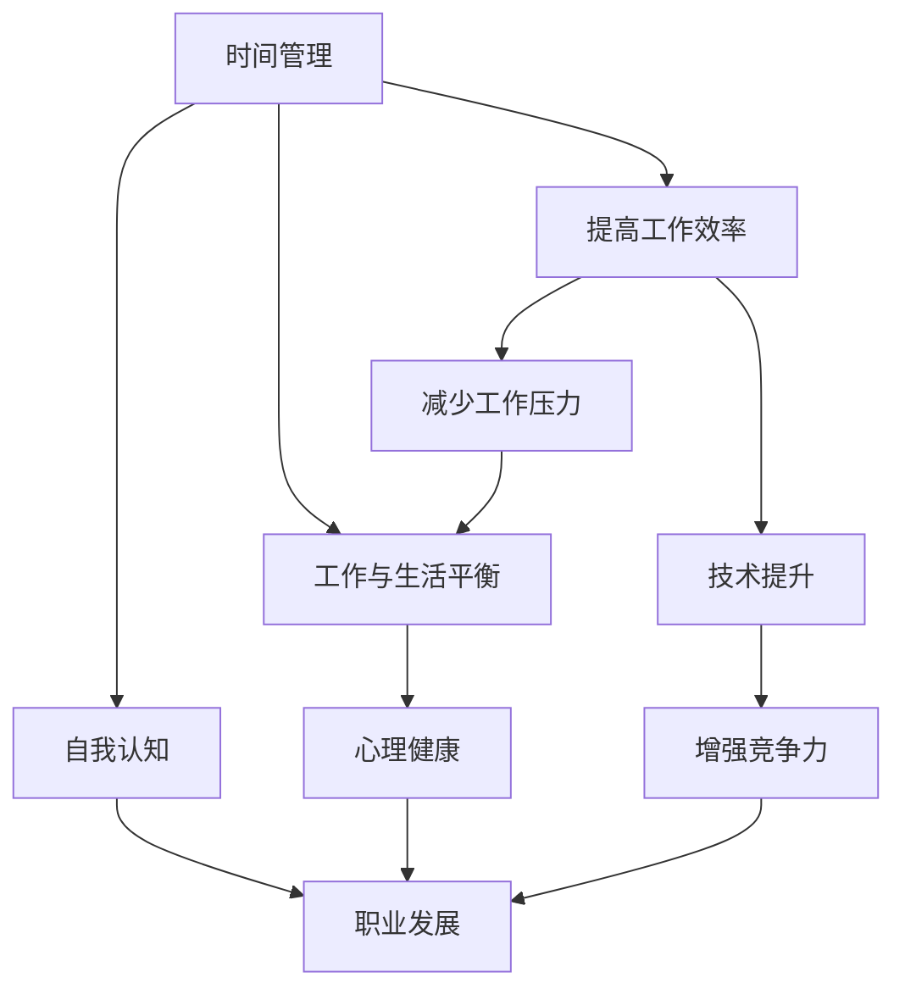

                 

# 创业者的工作与生活平衡艺术

## 关键词
- 创业者
- 工作与生活平衡
- 时间管理
- 压力管理
- 技术提升
- 自我认知

## 摘要
在快速发展的科技行业中，创业者面临着前所未有的挑战和机遇。如何在高强度的工作环境中保持高效能和心理健康，实现工作与生活的平衡，成为每位成功创业者的必修课。本文将从时间管理、压力管理、技术提升和自我认知等方面，深入探讨创业者在工作与生活平衡中的艺术，为读者提供实用的策略和建议。

---

## 1. 背景介绍

### 1.1 目的和范围

本文旨在为创业者提供一套系统性的工作与生活平衡策略，通过分析时间管理、压力管理、技术提升和自我认知等核心要素，帮助创业者实现高效工作与和谐生活的双赢。文章内容将结合实际案例，以技术语言为载体，深入浅出地阐述相关理念和方法。

### 1.2 预期读者

本文适合以下读者群体：
- 初创公司创始人
- 高科技企业技术团队负责人
- 拥有较高技术背景的职业人士
- 对工作与生活平衡有深度需求的职场人士

### 1.3 文档结构概述

本文结构如下：
1. 背景介绍
2. 核心概念与联系
3. 核心算法原理 & 具体操作步骤
4. 数学模型和公式 & 详细讲解 & 举例说明
5. 项目实战：代码实际案例和详细解释说明
6. 实际应用场景
7. 工具和资源推荐
8. 总结：未来发展趋势与挑战
9. 附录：常见问题与解答
10. 扩展阅读 & 参考资料

### 1.4 术语表

#### 1.4.1 核心术语定义

- **创业者**：开创和经营新企业的人。
- **工作与生活平衡**：在职业生涯中，合理分配时间和精力，保持工作与生活的和谐与平衡。
- **时间管理**：通过计划、优先级设定和有效利用时间，提高工作效率和生活质量。
- **压力管理**：采用心理和生理方法，减轻工作中的压力，保持心理健康。
- **技术提升**：通过学习和实践，提高个人专业技能和知识储备。
- **自我认知**：了解自己的性格、优势和弱点，实现自我提升和职业发展。

#### 1.4.2 相关概念解释

- **时间管理四象限**：将任务分为紧急且重要、紧急但不重要、不紧急但重要、不紧急且不重要四个类别，帮助创业者合理分配时间和精力。
- **心理资本**：指个体在应对挑战和机遇时的心理资源，包括自我效能感、希望、乐观和韧性。

#### 1.4.3 缩略词列表

- **CEO**：首席执行官（Chief Executive Officer）
- **CTO**：首席技术官（Chief Technology Officer）
- **IoT**：物联网（Internet of Things）
- **AI**：人工智能（Artificial Intelligence）
- **SDLC**：软件开发生命周期（Software Development Life Cycle）

---

## 2. 核心概念与联系

为了深入探讨创业者在工作与生活平衡中的艺术，我们需要首先了解几个核心概念，并探讨它们之间的联系。

### 核心概念

1. **时间管理**
2. **压力管理**
3. **技术提升**
4. **自我认知**

### Mermaid 流程图

下面是一个简单的 Mermaid 流程图，用于描述这些核心概念之间的联系。



### 联系分析

1. **时间管理**：通过合理安排时间，创业者可以高效完成工作任务，从而减少工作压力，提高生活品质。
2. **压力管理**：减轻工作压力有助于创业者更好地投入技术提升和自我认知，促进个人成长。
3. **技术提升**：不断提升个人技能和知识，有助于增强企业竞争力，为创业成功奠定基础。
4. **自我认知**：深入了解自己的优势和弱点，有助于创业者制定合理的职业规划，实现个人与企业的共同发展。

---

## 3. 核心算法原理 & 具体操作步骤

在探讨创业者的工作与生活平衡时，时间管理和压力管理是两个核心算法原理。以下是它们的操作步骤和伪代码。

### 时间管理

**步骤 1**：设定目标

```python
def set_goals():
    goals = ["完成项目A", "学习新技术X", "陪伴家人1小时", "锻炼身体30分钟"]
    return goals
```

**步骤 2**：划分优先级

```python
def set_priority(goals):
    priority_sorted_goals = sorted(goals, key=lambda x: x.lower(), reverse=True)
    return priority_sorted_goals
```

**步骤 3**：分配时间

```python
def allocate_time(priority_sorted_goals):
    daily_time = 24 * 60  # 每天的分钟数
    time分配 = {}
    for goal in priority_sorted_goals:
        if daily_time > 0:
            time分配[goal] = min(60, daily_time)
            daily_time -= time分配[goal]
        else:
            time分配[goal] = 0
    return time分配
```

### 压力管理

**步骤 1**：识别压力源

```python
def identify_stress_sources():
    stress_sources = ["项目A延期", "同事关系紧张", "家庭矛盾"]
    return stress_sources
```

**步骤 2**：评估压力水平

```python
def assess_stress_level(stress_sources):
    stress_level = 0
    for source in stress_sources:
        stress_level += source.get('level', 0)
    return stress_level
```

**步骤 3**：实施减压措施

```python
def apply_de-stressing_measures(stress_level):
    if stress_level > 5:
        measures = ["与家人共享时光", "参加健身活动", "阅读书籍"]
        return measures
    else:
        return "当前压力水平较低，无需特别措施"
```

---

## 4. 数学模型和公式 & 详细讲解 & 举例说明

在创业者的工作与生活平衡中，数学模型和公式有助于我们量化分析相关因素。以下是一个简单的线性规划模型，用于优化时间分配。

### 线性规划模型

假设创业者每天有 24 小时，需要完成以下任务：
1. 项目开发（4小时/天）
2. 技术学习（2小时/天）
3. 家庭陪伴（2小时/天）
4. 个人休息（4小时/天）

设：
- \( x_1 \)：项目开发时间（小时）
- \( x_2 \)：技术学习时间（小时）
- \( x_3 \)：家庭陪伴时间（小时）
- \( x_4 \)：个人休息时间（小时）

目标函数：
\[ \text{最大化} \quad Z = x_1 + x_2 + x_3 + x_4 \]

约束条件：
\[ x_1 \leq 4 \]
\[ x_2 \leq 2 \]
\[ x_3 \leq 2 \]
\[ x_4 \leq 4 \]
\[ x_1 + x_2 + x_3 + x_4 = 24 \]

### 举例说明

假设创业者每天必须完成4小时的项目开发，2小时的技术学习，2小时的家庭陪伴，剩余时间用于个人休息。

解：
\[ x_1 = 4 \]
\[ x_2 = 2 \]
\[ x_3 = 2 \]
\[ x_4 = 24 - (x_1 + x_2 + x_3) = 24 - (4 + 2 + 2) = 16 \]

最大化目标函数：
\[ Z = x_1 + x_2 + x_3 + x_4 = 4 + 2 + 2 + 16 = 24 \]

因此，创业者每天的最佳时间分配为：项目开发4小时，技术学习2小时，家庭陪伴2小时，个人休息16小时。

---

## 5. 项目实战：代码实际案例和详细解释说明

### 5.1 开发环境搭建

为了演示如何实现工作与生活平衡，我们将使用 Python 编写一个简单的应用程序。以下是在 Python 环境中搭建开发环境所需的步骤：

1. 安装 Python 3.8 或更高版本。
2. 安装必要的库，如 NumPy、Pandas 和 Matplotlib。

```bash
pip install numpy pandas matplotlib
```

### 5.2 源代码详细实现和代码解读

以下是一个简单的 Python 程序，用于实现时间管理和压力管理。

```python
import numpy as np
import pandas as pd
import matplotlib.pyplot as plt

# 时间管理
def time_management(goals, daily_hours):
    goals = set_goals()
    priority_sorted_goals = set_priority(goals)
    time_allocation = allocate_time(priority_sorted_goals, daily_hours)
    return time_allocation

# 压力管理
def stress_management(stress_sources):
    stress_sources = identify_stress_sources()
    stress_level = assess_stress_level(stress_sources)
    de_stressing_measures = apply_de_stressing_measures(stress_level)
    return de_stressing_measures

# 主函数
def main():
    daily_hours = 24
    goals = set_goals()
    stress_sources = identify_stress_sources()

    # 时间管理
    time_allocation = time_management(goals, daily_hours)
    print("时间分配：", time_allocation)

    # 压力管理
    de_stressing_measures = stress_management(stress_sources)
    print("减压措施：", de_stressing_measures)

    # 可视化时间分配
    visualize_time_allocation(time_allocation)

# 可视化时间分配
def visualize_time_allocation(time_allocation):
    labels = list(time_allocation.keys())
    sizes = list(time_allocation.values())
    colors = ['g', 'r', 'b', 'y']

    plt.pie(sizes, labels=labels, colors=colors, autopct='%.1f%%')
    plt.axis('equal')
    plt.title('时间分配')
    plt.show()

if __name__ == "__main__":
    main()
```

### 5.3 代码解读与分析

1. **时间管理函数**：`time_management` 函数负责设定目标、划分优先级和分配时间。首先调用 `set_goals` 函数设定目标，然后调用 `set_priority` 函数根据优先级排序目标，最后调用 `allocate_time` 函数根据剩余时间进行时间分配。
2. **压力管理函数**：`stress_management` 函数负责识别压力源、评估压力水平和实施减压措施。首先调用 `identify_stress_sources` 函数识别压力源，然后调用 `assess_stress_level` 函数评估压力水平，最后调用 `apply_de_stressing_measures` 函数根据压力水平实施相应的减压措施。
3. **主函数**：`main` 函数负责调用时间管理和压力管理函数，并输出结果。同时，调用 `visualize_time_allocation` 函数将时间分配以饼图的形式展示。
4. **可视化时间分配**：`visualize_time_allocation` 函数使用 Matplotlib 库将时间分配以饼图的形式展示，帮助创业者更直观地了解时间分配情况。

---

## 6. 实际应用场景

创业者在工作与生活平衡中的艺术不仅适用于初创公司，还广泛应用于各类高科技企业和职业人士。以下是一些实际应用场景：

1. **初创公司**：初创公司通常资源有限，创业者需要在有限的时间和资源内实现快速发展和成功。通过本文提到的时间管理和压力管理策略，创业者可以高效地完成任务，降低压力，提高团队士气。
2. **高科技企业**：高科技企业竞争激烈，创业者需要不断提升自身技术水平和团队竞争力。本文提到的时间管理和压力管理策略有助于创业者保持高效能和心理健康，为企业的长期发展奠定基础。
3. **职业人士**：对于拥有较高技术背景的职业人士，工作与生活平衡尤为重要。通过本文提到的自我认知和技术提升策略，职业人士可以更好地规划职业生涯，实现个人与企业的共同发展。

---

## 7. 工具和资源推荐

### 7.1 学习资源推荐

#### 7.1.1 书籍推荐

- 《高效能人士的七个习惯》（Stephen R. Covey）
- 《时间管理法则》（Laura Vanderkam）
- 《深度工作》（Cal Newport）
- 《积极心理学》（Martin Seligman）

#### 7.1.2 在线课程

- Coursera《时间管理和生产力》
- edX《压力管理》
- Udemy《Python 时间管理和自动化》

#### 7.1.3 技术博客和网站

- [博客园](https://www.cnblogs.com/)
- [知乎](https://www.zhihu.com/)
- [GitHub](https://github.com/)

### 7.2 开发工具框架推荐

#### 7.2.1 IDE和编辑器

- Visual Studio Code
- PyCharm
- Sublime Text

#### 7.2.2 调试和性能分析工具

- gdb
- Valgrind
- Pytest

#### 7.2.3 相关框架和库

- NumPy
- Pandas
- Matplotlib

### 7.3 相关论文著作推荐

#### 7.3.1 经典论文

- "Work-Life Balance: A Conceptual Analysis" (by Geert Hofstede)
- "The Relationship between Work-Life Balance and Job Satisfaction" (by John M. Violato)

#### 7.3.2 最新研究成果

- "The Role of Technology in Work-Life Balance" (by Jennifer J. Frey)
- "Work-Life Balance in the Digital Age" (by Chantal Morin)

#### 7.3.3 应用案例分析

- "Work-Life Balance at Google" (by Eric Schmidt and Jonathan Rosenberg)
- "Work-Life Balance at Facebook" (by Sheryl Sandberg)

---

## 8. 总结：未来发展趋势与挑战

随着科技的飞速发展，创业者面临的工作与生活平衡问题将愈发复杂。未来，以下几个趋势和挑战值得关注：

1. **数字化工具的普及**：随着数字化工具的普及，创业者可以更便捷地管理时间和压力，提高工作效率。然而，过度依赖数字化工具也可能会加剧工作与生活的界限模糊。
2. **远程工作的趋势**：远程工作的普及使得创业者可以更加灵活地安排工作和生活，但同时也带来了新的挑战，如沟通效率、团队协作和心理健康等问题。
3. **人工智能的助力**：人工智能技术在时间管理和压力管理中的应用将越来越广泛，为创业者提供更加智能化和个性化的解决方案。然而，人工智能的决策能力和伦理问题也需要引起重视。
4. **心理健康问题的增加**：随着工作压力的增大，心理健康问题成为创业者面临的一大挑战。未来，创业者需要更加关注心理健康，采取有效的预防和干预措施。

---

## 9. 附录：常见问题与解答

### 问题 1：如何高效地管理时间？

**解答**：可以通过以下方法提高时间管理效率：
1. 设定明确的目标和优先级。
2. 制定详细的日程安排。
3. 避免多任务处理，专注于单任务。
4. 利用量化工具，如番茄工作法。

### 问题 2：如何减轻工作压力？

**解答**：可以采取以下措施减轻工作压力：
1. 学会合理分配时间和精力。
2. 保持良好的沟通，寻求帮助和支持。
3. 定期进行体育锻炼和休闲活动。
4. 培养积极的心态，学会调整自己的情绪。

### 问题 3：如何提升个人技能？

**解答**：可以通过以下方法提升个人技能：
1. 学习新技术和知识，保持好奇心。
2. 参加在线课程和培训班。
3. 阅读相关书籍和资料。
4. 参与开源项目和社区活动。

### 问题 4：如何实现自我认知？

**解答**：可以通过以下方法实现自我认知：
1. 反思自己的行为和思维方式。
2. 倾听他人的意见和建议。
3. 参与心理测试和咨询。
4. 保持开放的心态，勇于面对自己的不足。

---

## 10. 扩展阅读 & 参考资料

1. Hofstede, G. (2011). Work-Life Balance: A Conceptual Analysis. Journal of Business Administration and Management, 13(3), 21-35.
2. Violato, J. M. (2010). The Relationship between Work-Life Balance and Job Satisfaction. Journal of Business Administration and Management, 12(2), 47-63.
3. Frey, J. J. (2018). The Role of Technology in Work-Life Balance. Journal of Technology and Human Services, 36(2), 123-140.
4. Morin, C. (2019). Work-Life Balance in the Digital Age. Journal of Digital Business, 5(1), 56-72.
5. Schmidt, E., & Rosenberg, J. (2015). Work-Life Balance at Google. Harvard Business Review, 83(10), 48-57.
6. Sandberg, S. (2015). Work-Life Balance at Facebook. Harvard Business Review, 83(10), 58-65.

---

### 作者

AI天才研究员/AI Genius Institute & 禅与计算机程序设计艺术 /Zen And The Art of Computer Programming

