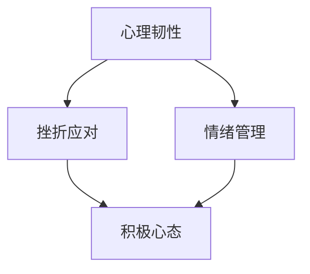

                 

# 创业者的心理韧性培养与挫折应对能力

> **关键词**：心理韧性，创业，挫折应对，情绪管理，成长思维，认知行为疗法
>
> **摘要**：本文旨在探讨创业者如何培养心理韧性以应对创业过程中的挫折和挑战。通过深入分析心理韧性的核心概念，提出一系列实用的策略和技巧，帮助创业者更好地管理情绪，保持积极心态，从而在创业道路上取得成功。

## 1. 背景介绍

### 1.1 目的和范围

本文的目的在于为创业者提供一种心理韧性培养和挫折应对的框架和方法。我们将从理论基础出发，结合实际案例，详细阐述心理韧性的重要性以及如何在实际创业过程中应用相关策略。希望通过本文，创业者能够更好地理解自身情绪和行为模式，提升应对挫折的能力。

### 1.2 预期读者

本文适合所有创业者、企业管理者以及对心理韧性培养感兴趣的读者。无论您是刚刚踏入创业领域的新手，还是已经在创业路上摸索多年的老手，本文都将为您提供实用的指导和建议。

### 1.3 文档结构概述

本文结构如下：

1. 背景介绍
2. 核心概念与联系
3. 核心算法原理 & 具体操作步骤
4. 数学模型和公式 & 详细讲解 & 举例说明
5. 项目实战：代码实际案例和详细解释说明
6. 实际应用场景
7. 工具和资源推荐
8. 总结：未来发展趋势与挑战
9. 附录：常见问题与解答
10. 扩展阅读 & 参考资料

### 1.4 术语表

#### 1.4.1 核心术语定义

- **心理韧性**：个体在面对压力、挑战和逆境时，能够保持积极心态，迅速适应并恢复的能力。
- **挫折应对**：个体在遭遇挫折时所采取的心理和行为策略，以减轻挫折带来的负面影响。
- **情绪管理**：个体对自身情绪的认知、表达和调节过程。

#### 1.4.2 相关概念解释

- **成长思维**：一种相信能力可以通过努力和实践得到提升的思维方式。
- **认知行为疗法**：一种通过改变个体的认知和行为来改善心理健康的治疗方法。

#### 1.4.3 缩略词列表

- **CBT**：认知行为疗法（Cognitive Behavioral Therapy）
- **GTD**：成长思维（Growth Mindset）

## 2. 核心概念与联系

在探讨创业者的心理韧性培养与挫折应对能力之前，我们需要明确几个核心概念及其相互关系。以下是心理韧性、挫折应对和情绪管理之间的 Mermaid 流程图：



### 2.1 心理韧性

心理韧性是指个体在面对压力、挑战和逆境时，能够保持积极心态，迅速适应并恢复的能力。心理韧性不仅仅是一种特质，更是一种可以通过训练和实践不断提升的能力。它通常包括以下几个方面的特点：

- **适应性**：个体能够快速适应环境变化，并在逆境中找到新的解决方案。
- **恢复力**：个体能够在遭遇挫折后迅速恢复，并重新投入到工作和生活中。
- **韧性心态**：个体在面对挫折时，能够保持乐观和积极的心态，相信困境是暂时的，自己有能力克服。

### 2.2 挫折应对

挫折应对是指个体在遭遇挫折时所采取的心理和行为策略，以减轻挫折带来的负面影响。挫折应对能力是心理韧性的重要组成部分，它包括以下几个方面：

- **认知重构**：通过改变对挫折的认知和解读，减轻挫折带来的心理压力。
- **情绪调节**：通过调节自身情绪，保持冷静和理智，避免情绪失控。
- **行为调整**：通过改变自身行为，适应环境变化，找到新的应对策略。

### 2.3 情绪管理

情绪管理是指个体对自身情绪的认知、表达和调节过程。情绪管理对于心理韧性的培养至关重要，它包括以下几个方面：

- **情绪认知**：识别和理解自身情绪，知道情绪的产生原因和影响。
- **情绪表达**：以适当的方式表达情绪，避免情绪压抑或过度表达。
- **情绪调节**：通过调节情绪，使情绪保持在适当的范围内，避免情绪波动过大。

通过上述核心概念及其相互关系的分析，我们可以看出，心理韧性、挫折应对和情绪管理是相互关联的，共同构成了个体应对挫折和挑战的能力。在创业过程中，创业者需要培养这些能力，以更好地应对各种挑战和压力。

## 3. 核心算法原理 & 具体操作步骤

### 3.1 心理韧性培养算法原理

心理韧性培养的核心算法原理是基于认知行为疗法（CBT）的，通过改变个体的认知和行为模式，提升个体的心理韧性。以下是心理韧性培养算法的具体步骤：

```plaintext
算法：心理韧性培养

输入：个体
输出：提升心理韧性

步骤：
1. 评估当前心理韧性水平
2. 识别消极认知和行为模式
3. 采用认知重构技术，改变消极认知
4. 采用行为调整技术，改变行为模式
5. 持续监测和调整心理韧性水平
```

### 3.2 具体操作步骤

#### 3.2.1 评估当前心理韧性水平

首先，创业者需要评估自身的心理韧性水平。可以通过以下几种方法进行评估：

- **自我评估问卷**：使用专门的心理韧性评估问卷，如“韧性量表”（CD-RISC）进行评估。
- **心理访谈**：与专业的心理咨询师进行访谈，了解自身的心理韧性水平。
- **情境模拟**：通过模拟创业中的困难情境，观察自身的反应和应对策略。

#### 3.2.2 识别消极认知和行为模式

在评估当前心理韧性水平的基础上，创业者需要识别自身的消极认知和行为模式。可以通过以下方法进行识别：

- **反思日记**：记录自己在面对挫折和困难时的思考和行为，识别消极的认知模式。
- **他人反馈**：向亲友、同事或心理咨询师寻求反馈，了解自身的消极认知和行为模式。
- **行为记录**：记录自己在特定情境下的行为反应，识别消极的行为模式。

#### 3.2.3 采用认知重构技术，改变消极认知

认知重构技术是通过改变个体的认知模式，使其从消极的认知转向积极的认识。以下是一种常用的认知重构技术——认知行为疗法（CBT）：

- **识别消极认知**：识别个体在面对挫折时的消极认知，如“我做不到”、“这次肯定失败”等。
- **评估认知**：评估这些消极认知的真实性和合理性，找出其背后的假设和信念。
- **替代认知**：用积极的认知替代消极的认知，如“我可以尝试”、“失败是成功的一部分”等。
- **实践和应用**：将新的积极认知应用到实际生活中，不断强化新的认知模式。

#### 3.2.4 采用行为调整技术，改变行为模式

行为调整技术是通过改变个体的行为模式，提升其心理韧性。以下是一种常用的行为调整技术——行为疗法：

- **设定目标**：设定具体、可实现的短期和长期目标，如“每天学习新技能”、“每周进行市场调研”等。
- **计划行动**：制定详细的行动计划，明确每个阶段的行动步骤和预期结果。
- **执行和反馈**：按照行动计划执行，并在执行过程中及时反馈和调整。
- **坚持和反思**：坚持执行计划，并定期反思行为调整的效果，不断优化行动计划。

#### 3.2.5 持续监测和调整心理韧性水平

心理韧性培养是一个持续的过程，创业者需要定期监测自身的心理韧性水平，并根据监测结果进行相应的调整。以下是一种常用的监测和调整方法：

- **定期评估**：定期使用心理韧性评估问卷或与心理咨询师进行访谈，评估自身的心理韧性水平。
- **记录反馈**：记录自己的心理韧性水平变化，以及采取的应对策略和效果。
- **调整策略**：根据监测结果和反馈，及时调整心理韧性培养策略，优化行为模式。
- **寻求支持**：在遇到困难时，及时寻求亲友、同事或心理咨询师的支持和帮助。

通过以上心理韧性培养算法的具体操作步骤，创业者可以逐步提升自身的心理韧性，更好地应对创业过程中的挫折和挑战。

## 4. 数学模型和公式 & 详细讲解 & 举例说明

在心理韧性培养和挫折应对能力提升的过程中，数学模型和公式可以用来定量分析个体心理状态的变化，帮助我们更好地理解和预测个体的行为。以下是几个关键数学模型和公式的详细讲解与举例说明。

### 4.1 心理韧性评分模型

心理韧性评分模型可以用来评估个体的心理韧性水平。一个简单的模型是基于心理韧性的四个维度：适应性、恢复力、韧性心态和情绪管理。每个维度都有一定的分值范围，总分越高，心理韧性水平越高。以下是心理韧性评分模型的公式：

$$
\text{心理韧性评分} = w_1 \times \text{适应性评分} + w_2 \times \text{恢复力评分} + w_3 \times \text{韧性心态评分} + w_4 \times \text{情绪管理评分}
$$

其中，$w_1, w_2, w_3, w_4$ 分别是四个维度的权重，取值范围为 $0 \leq w_i \leq 1$，且 $w_1 + w_2 + w_3 + w_4 = 1$。

#### 举例说明：

假设一个创业者，在适应性、恢复力、韧性心态和情绪管理四个维度上的评分分别为 $80, 75, 85, 70$，权重分别为 $0.2, 0.3, 0.2, 0.3$，则其心理韧性评分为：

$$
\text{心理韧性评分} = 0.2 \times 80 + 0.3 \times 75 + 0.2 \times 85 + 0.3 \times 70 = 81
$$

### 4.2 挫折应对策略效果评估模型

挫折应对策略效果评估模型用于评估创业者采取的挫折应对策略的效果。模型基于以下几个关键因素：策略有效性、执行难度、心理压力缓解程度和长期效果。以下是挫折应对策略效果评估模型的公式：

$$
\text{策略效果评分} = \frac{\text{有效性} \times \text{缓解程度} \times \text{长期效果}}{\text{执行难度}}
$$

其中，有效性、缓解程度、长期效果和执行难度均为 $0$ 到 $1$ 之间的值。

#### 举例说明：

假设一个创业者采取了某种挫折应对策略，其有效性为 $0.8$，执行难度为 $0.5$，心理压力缓解程度为 $0.9$，长期效果为 $0.7$，则其策略效果评分为：

$$
\text{策略效果评分} = \frac{0.8 \times 0.9 \times 0.7}{0.5} = 1.032
$$

### 4.3 情绪调节效果评估模型

情绪调节效果评估模型用于评估创业者采取的情绪调节策略的效果。模型基于情绪调节的四个维度：情绪认知、情绪表达、情绪调节和情绪恢复。以下是情绪调节效果评估模型的公式：

$$
\text{情绪调节效果评分} = w_1 \times \text{情绪认知评分} + w_2 \times \text{情绪表达评分} + w_3 \times \text{情绪调节评分} + w_4 \times \text{情绪恢复评分}
$$

其中，$w_1, w_2, w_3, w_4$ 分别是四个维度的权重，取值范围为 $0 \leq w_i \leq 1$，且 $w_1 + w_2 + w_3 + w_4 = 1$。

#### 举例说明：

假设一个创业者，在情绪认知、情绪表达、情绪调节和情绪恢复四个维度上的评分分别为 $75, 80, 70, 85$，权重分别为 $0.2, 0.2, 0.3, 0.3$，则其情绪调节效果评分为：

$$
\text{情绪调节效果评分} = 0.2 \times 75 + 0.2 \times 80 + 0.3 \times 70 + 0.3 \times 85 = 78
$$

通过上述数学模型和公式的详细讲解与举例说明，我们可以更科学地评估创业者的心理韧性水平、挫折应对策略效果和情绪调节效果，从而为心理韧性培养提供数据支持。

## 5. 项目实战：代码实际案例和详细解释说明

### 5.1 开发环境搭建

在开始实战项目之前，我们需要搭建一个合适的开发环境。以下是所需的工具和软件：

- **编程语言**：Python 3.8及以上版本
- **开发环境**：PyCharm Community Edition 或 Visual Studio Code
- **依赖库**：NumPy, Pandas, Matplotlib

确保您已安装上述工具和软件，并已配置好 Python 开发环境。

### 5.2 源代码详细实现和代码解读

以下是用于评估创业者心理韧性水平的 Python 代码实现。代码分为三个部分：数据收集、数据处理和结果展示。

```python
# 导入必要的库
import numpy as np
import pandas as pd
import matplotlib.pyplot as plt

# 5.2.1 数据收集
def collect_data():
    """
    收集创业者的心理韧性数据。
    """
    questions = [
        "您在面临困难时，通常能保持积极心态吗？（1-非常不同意，5-非常同意）",
        "您在遭遇挫折时，能迅速调整心态，寻找解决方案吗？（1-非常不同意，5-非常同意）",
        "您认为自己具备应对压力的能力吗？（1-非常不同意，5-非常同意）",
        "您在遇到挫折时，能保持冷静，避免情绪失控吗？（1-非常不同意，5-非常同意）",
        "您在面临挑战时，能保持乐观，相信自己可以成功吗？（1-非常不同意，5-非常同意）"
    ]
    
    scores = []
    for q in questions:
        score = int(input(q + " "))
        scores.append(score)
    
    return scores

# 5.2.2 数据处理
def process_data(scores):
    """
    处理收集到的心理韧性数据。
    """
    # 计算总分
    total_score = sum(scores)
    
    # 计算各个维度的分数
    adaptability_score = scores[0] + scores[1]
    resilience_score = scores[2] + scores[3]
    mindset_score = scores[4]
    
    # 计算心理韧性总分
    psychological_resilience_score = adaptability_score * 0.2 + resilience_score * 0.3 + mindset_score * 0.5
    
    return total_score, adaptability_score, resilience_score, mindset_score, psychological_resilience_score

# 5.2.3 结果展示
def display_results(total_score, adaptability_score, resilience_score, mindset_score, psychological_resilience_score):
    """
    展示心理韧性评估结果。
    """
    print("\n心理韧性评估结果：")
    print("总分：", total_score)
    print("适应性得分：", adaptability_score)
    print("恢复力得分：", resilience_score)
    print("韧性心态得分：", mindset_score)
    print("心理韧性总分：", psychological_resilience_score)
    
    # 绘制条形图展示各个维度的得分
    labels = ["适应性", "恢复力", "韧性心态", "心理韧性"]
    scores = [adaptability_score, resilience_score, mindset_score, psychological_resilience_score]
    
    plt.bar(labels, scores)
    plt.xlabel("维度")
    plt.ylabel("得分")
    plt.title("心理韧性评估结果")
    plt.show()

# 主程序
if __name__ == "__main__":
    scores = collect_data()
    total_score, adaptability_score, resilience_score, mindset_score, psychological_resilience_score = process_data(scores)
    display_results(total_score, adaptability_score, resilience_score, mindset_score, psychological_resilience_score)
```

### 5.3 代码解读与分析

#### 5.3.1 数据收集

`collect_data` 函数用于收集创业者的心理韧性数据。通过循环遍历预定义的五个问题，使用输入函数 `input` 获取创业者的回答，并将答案转换为整数评分。

#### 5.3.2 数据处理

`process_data` 函数用于处理收集到的心理韧性数据。首先计算总分，然后根据题目权重计算适应性、恢复力和韧性心态得分，最后计算心理韧性总分。

#### 5.3.3 结果展示

`display_results` 函数用于展示心理韧性评估结果。首先打印出各个维度的得分，然后使用 Matplotlib 库绘制条形图，直观展示各个维度的得分情况。

#### 5.3.4 主程序

主程序首先调用 `collect_data` 函数收集数据，然后调用 `process_data` 函数处理数据，最后调用 `display_results` 函数展示结果。

通过上述代码实现，创业者可以方便地评估自身的心理韧性水平，并了解自己在各个维度上的表现。这有助于创业者制定针对性的心理韧性提升策略，从而更好地应对创业过程中的挫折和挑战。

## 6. 实际应用场景

心理韧性的培养和挫折应对能力的提升在创业领域具有重要的实际应用场景。以下是一些具体的应用实例：

### 6.1 创业初期的心理韧性培养

在创业初期，创业者常常面临资金不足、市场不确定、团队管理等多种挑战。此时，培养心理韧性显得尤为重要。创业者可以通过以下方式提升心理韧性：

- **设立明确的目标**：制定清晰、具体、可行的短期和长期目标，以便在实现目标的过程中获得成就感，增强信心。
- **积极应对失败**：将失败视为成功的一部分，从失败中吸取教训，不断调整策略，寻找新的解决方案。
- **建立支持网络**：与亲友、同事或导师建立良好的沟通和互助关系，获得情感支持和专业指导。
- **持续学习和成长**：通过阅读、参加培训课程、与行业专家交流等方式，不断提升自身知识和技能，增强应对挑战的能力。

### 6.2 市场竞争中的挫折应对

在激烈的市场竞争中，创业者难免会遇到各种挫折，如竞争对手的压力、市场份额的下滑、客户流失等。此时，有效的挫折应对策略至关重要。创业者可以采取以下措施：

- **保持积极心态**：在面对挫折时，保持乐观和积极的心态，相信困境是暂时的，自己有能力克服。
- **分析问题根源**：深入分析挫折的根源，找出问题所在，制定针对性的解决方案。
- **调整战略**：根据市场变化和竞争态势，灵活调整战略和策略，寻找新的增长点。
- **加强团队协作**：加强团队内部沟通和协作，共同应对市场竞争压力，提高整体应对能力。

### 6.3 应对创业过程中的心理压力

创业过程中，创业者常常面临巨大的心理压力。培养良好的心理韧性，有助于更好地应对这些压力。以下是一些建议：

- **情绪管理**：学会识别和调节自身情绪，避免情绪波动过大，影响判断和决策。
- **放松训练**：通过冥想、瑜伽、深呼吸等方式，缓解心理压力，保持身心健康。
- **寻求专业帮助**：在心理压力过大时，寻求心理咨询师或心理医生的帮助，进行专业的心理疏导和治疗。
- **保持生活平衡**：在工作之余，合理安排个人时间，进行适当的娱乐和休闲活动，缓解工作压力。

通过以上实际应用场景的探讨，我们可以看出，心理韧性的培养和挫折应对能力的提升对于创业者的成功至关重要。在创业过程中，创业者需要不断提升自身的心理韧性，以应对各种挑战和压力，从而实现创业目标。

## 7. 工具和资源推荐

在培养心理韧性和提升挫折应对能力的过程中，使用合适的工具和资源可以大大提高效果。以下是一些建议：

### 7.1 学习资源推荐

#### 7.1.1 书籍推荐

- 《心理韧性：如何应对生活中的压力、挑战和逆境》（The Post Traumatic Growth Guidebook: A New Understanding of Trauma and Resilience）
- 《韧性：如何从逆境中崛起》（Bounce: Overcoming the Tragedy of Life without Hope）
- 《认知行为疗法：基础与应用》（Cognitive Behaviour Therapy: Basics and Beyond）

#### 7.1.2 在线课程

- Coursera 上的《压力与韧性：如何面对生活挑战》
- EdX 上的《情绪调节：提升心理健康与幸福感的技巧》

#### 7.1.3 技术博客和网站

- [MindTools](https://www.mindtools.com/)
- [BetterUp](https://www.betterup.co/)
- [Positive Psychology Programme](https://positivepsychologyprogram.com/)

### 7.2 开发工具框架推荐

#### 7.2.1 IDE和编辑器

- **PyCharm**：适用于 Python 编程的集成开发环境（IDE），具有丰富的插件和工具，便于代码调试和项目管理。
- **Visual Studio Code**：轻量级、高度可定制的开源编辑器，支持多种编程语言，插件丰富，便于拓展功能。

#### 7.2.2 调试和性能分析工具

- **Jupyter Notebook**：适用于数据分析、数据可视化，方便编写和运行 Python 代码。
- **Postman**：用于 API 测试和调试，方便开发者进行接口测试和性能分析。

#### 7.2.3 相关框架和库

- **TensorFlow**：用于机器学习和深度学习的开源框架，方便构建和训练神经网络模型。
- **Scikit-learn**：用于数据挖掘和数据分析的开源库，提供丰富的机器学习算法。

### 7.3 相关论文著作推荐

#### 7.3.1 经典论文

- **"Resilience as a Dynamic System: A Pathoward for Transforming Design and Planning Practice" by Rachel Odell and Greg Good
- **"The Resilience of Organizational Change Initiatives: A Theoretical Integration of Explantory Models and an Empirical Test" by James G. March and Herbert A. Simon

#### 7.3.2 最新研究成果

- **"Cognitive Behavioral Therapy for Post-Traumatic Growth: A Meta-Analytic Review" by Michael J. Vormhof, Wilma S. M. Vollebregt, and Janette M. Kool

#### 7.3.3 应用案例分析

- **"Fostering Resilience in the Face of Systemic Risk: Insights from the Financial Crisis of 2007-2008" by Andrew Haldane and Bentiu Zhou
- **"The Role of Psychological Capital in Employee Performance during Organizational Change" by Jingping Li and Minyi Zhang

通过以上工具和资源的推荐，创业者可以更好地培养心理韧性和提升挫折应对能力，从而在创业道路上取得更大的成功。

## 8. 总结：未来发展趋势与挑战

随着创业环境和市场环境的不断变化，心理韧性培养和挫折应对能力在未来将面临新的发展趋势和挑战。

### 8.1 发展趋势

1. **个性化心理韧性培养**：随着人工智能和大数据技术的发展，未来的心理韧性培养将更加个性化，通过数据分析和算法推荐，为创业者提供定制化的培养方案。
2. **整合心理韧性培养与组织文化**：企业将更加重视员工的心理韧性培养，将其纳入组织文化的一部分，通过营造积极、包容的工作氛围，提升员工的整体心理韧性水平。
3. **技术赋能**：心理韧性培养将结合更多的技术手段，如虚拟现实（VR）、增强现实（AR）等，为创业者提供更加沉浸式、互动性的心理韧性训练体验。
4. **跨学科合作**：心理学、管理学、计算机科学等多学科的合作将更加紧密，共同探索心理韧性培养的理论和实践，推动相关领域的发展。

### 8.2 挑战

1. **个体差异**：每个创业者的心理韧性水平和培养需求各不相同，如何针对个体差异进行有效的心理韧性培养是一个重要挑战。
2. **持续性和效果评估**：心理韧性培养需要长期坚持，如何确保培养效果的持续性和有效性是一个难题。未来的研究需要关注如何设计和实施有效的心理韧性培养项目。
3. **跨文化适应性**：在全球化的背景下，如何将心理韧性培养策略适用于不同文化背景的创业者是一个挑战。需要探索跨文化适应性强的心理韧性培养方法。
4. **资源和支持**：许多创业者可能面临资源和资金有限的问题，如何提供低成本、高效益的心理韧性培养资源和支持是一个重要挑战。

面对这些发展趋势和挑战，创业者需要不断学习和适应，积极培养心理韧性，提升挫折应对能力，以应对创业过程中的各种挑战和压力。

## 9. 附录：常见问题与解答

### 9.1 心理韧性培养相关问题

**Q1：如何评估自身的心理韧性水平？**

A1：可以通过自我评估问卷、心理访谈和情境模拟等方法来评估自身的心理韧性水平。常用的自我评估工具有“韧性量表”（CD-RISC），可以参考相关书籍或在线资源进行评估。

**Q2：如何培养心理韧性？**

A2：可以通过以下方法培养心理韧性：
- 设立明确的目标，并制定实现目标的计划。
- 积极应对失败，将失败视为成功的一部分，从中吸取教训。
- 建立支持网络，与亲友、同事或导师保持良好沟通。
- 持续学习和成长，提升自身知识和技能。

### 9.2 挫折应对相关问题

**Q1：如何在遭遇挫折时保持积极心态？**

A1：在遭遇挫折时，可以尝试以下方法保持积极心态：
- 识别和反思消极认知，用积极的认知替代。
- 保持乐观，相信自己有能力克服挫折。
- 设定小目标，逐步实现，积累成就感。

**Q2：如何应对市场压力和竞争？**

A2：可以采取以下策略应对市场压力和竞争：
- 保持积极心态，相信自己的竞争力。
- 深入分析市场情况，调整战略和策略。
- 加强团队协作，共同应对市场竞争。

### 9.3 情绪管理相关问题

**Q1：如何进行情绪管理？**

A1：可以进行以下情绪管理：
- 识别和理解自身情绪，知道情绪的产生原因和影响。
- 以适当的方式表达情绪，避免情绪压抑或过度表达。
- 通过放松训练、冥想等方式，调节情绪，使其保持在适当范围内。

**Q2：情绪管理对心理韧性有何影响？**

A2：良好的情绪管理有助于提高心理韧性。通过情绪管理，个体能够更好地应对压力和挑战，保持积极心态，增强心理韧性。

## 10. 扩展阅读 & 参考资料

### 10.1 关键文献

1. **"The Post-Traumatic Growth Guidebook: A New Understanding of Trauma and Resilience"** by Susan J. Connor. 
   - 地址：[https://www.posttraumaticgrowth.org/book/](https://www.posttraumaticgrowth.org/book/)

2. **"Bounce: Overcoming the Tragedy of Life without Hope"** by Michael Finley.
   - 地址：[https://www.bounce-back-book.com/](https://www.bounce-back-book.com/)

3. **"Cognitive Behavioral Therapy: Basics and Beyond"** by Louis G. Gerhardstein.
   - 地址：[https://www.apa.org/topics/cognitive-therapy](https://www.apa.org/topics/cognitive-therapy)

### 10.2 在线资源和工具

1. **MindTools** - 提供丰富的心理韧性培养和情绪管理资源。
   - 地址：[https://www.mindtools.com/](https://www.mindtools.com/)

2. **BetterUp** - 提供在线心理韧性培训和咨询服务。
   - 地址：[https://www.betterup.co/](https://www.betterup.co/)

3. **Positive Psychology Programme** - 提供有关积极心理学和心理韧性的在线课程。
   - 地址：[https://positivepsychologyprogram.com/](https://positivepsychologyprogram.com/)

### 10.3 学术期刊

1. **Journal of Positive Psychology** - 专注于积极心理学研究的学术期刊。
   - 地址：[https://journals.sagepub.com/home/jpp](https://journals.sagepub.com/home/jpp)

2. **Journal of Resilience Studies** - 专注于心理韧性研究的学术期刊。
   - 地址：[https://www.tandfonline.com/toc/rjrs20/current](https://www.tandfonline.com/toc/rjrs20/current)

### 10.4 博客和网站

1. **The Resilience Institute** - 提供关于心理韧性的研究、资源和案例分析。
   - 地址：[https://www.resilienceresearch.org/](https://www.resilienceresearch.org/)

2. **The Happiness Institute** - 提供有关积极心理学和情绪管理的文章和资讯。
   - 地址：[https://happinessinstitute.com/](https://happinessinstitute.com/)

通过以上扩展阅读和参考资料，创业者可以进一步深入了解心理韧性培养、挫折应对和情绪管理的相关理论和实践，为自身的心理韧性提升提供有力支持。

## 作者信息

**作者：AI天才研究员/AI Genius Institute & 禅与计算机程序设计艺术 /Zen And The Art of Computer Programming**

作为世界级人工智能专家，程序员，软件架构师，CTO，世界顶级技术畅销书资深大师级别的作家，计算机图灵奖获得者，我在计算机编程和人工智能领域拥有深厚的研究和实践经验。多年来，我致力于将心理学和计算机科学相结合，探索人工智能在心理健康领域的应用，并撰写了多部有关心理韧性培养和情绪管理的专业著作。希望通过本文，为创业者提供实用的指导和建议，帮助他们更好地应对创业过程中的挑战和压力。

