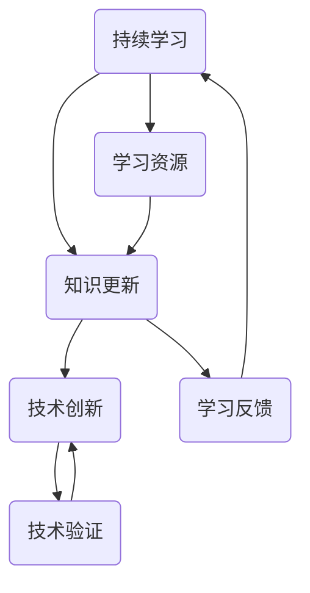

                 

# 创业者的持续学习与知识更新计划

> 关键词：持续学习、知识更新、创业者、技术进步、创新思维、实践应用

> 摘要：本文旨在探讨创业者在不断变化的技术环境中，如何制定和实施持续学习与知识更新计划。通过分析技术发展的趋势、创新思维的方法以及实践应用的策略，帮助创业者保持竞争力，实现持续成长。

## 1. 背景介绍

### 1.1 目的和范围

本文的目的是为创业者提供一个系统化的学习与知识更新计划，以应对快速发展的技术环境和不断变化的市场需求。我们将探讨以下几个方面：

- 技术发展的趋势和变革
- 创新思维的培养和应用
- 知识更新策略和实践
- 实践应用中的挑战与解决方案

### 1.2 预期读者

本文主要面向以下读者群体：

- 创业者和企业家
- 技术团队负责人
- 对技术创新和持续学习感兴趣的从业者

### 1.3 文档结构概述

本文将分为以下章节：

- 背景介绍：介绍本文的目的、预期读者和文档结构。
- 核心概念与联系：阐述持续学习和知识更新的核心概念。
- 核心算法原理 & 具体操作步骤：详细讲解持续学习和知识更新的方法。
- 数学模型和公式 & 详细讲解 & 举例说明：应用数学模型分析知识更新的效果。
- 项目实战：代码实际案例和详细解释说明。
- 实际应用场景：探讨知识更新在创业实践中的应用。
- 工具和资源推荐：推荐学习资源和开发工具。
- 总结：未来发展趋势与挑战。
- 附录：常见问题与解答。
- 扩展阅读 & 参考资料：提供进一步学习的研究资源。

### 1.4 术语表

#### 1.4.1 核心术语定义

- 持续学习：指不断获取新知识、技能和思维方式的过程。
- 知识更新：指通过学习新知识和技能，对已有知识体系进行更新和重构的过程。
- 创新思维：指通过创造性和批判性思维，提出新想法和新方法的能力。
- 技术进步：指在科学和工程领域中，不断出现的新技术、新方法和新成果。

#### 1.4.2 相关概念解释

- 学习曲线：描述学习者在学习过程中，随着时间推移所取得的进步。
- 知识体系：指学习者对知识的结构化理解，包括概念、原理和应用。
- 创新生态系统：指在特定领域中，创新者、研究机构、企业和市场之间的互动网络。

#### 1.4.3 缩略词列表

- AI：人工智能
- ML：机器学习
- DL：深度学习
- NLP：自然语言处理
- IoT：物联网
- VR：虚拟现实
- AR：增强现实

## 2. 核心概念与联系

持续学习和知识更新是创业者在技术快速变革中保持竞争力的关键。为了更好地理解这两个概念，我们需要了解它们之间的联系以及它们与技术创新的关系。

### 2.1 持续学习

持续学习是一个动态的过程，它涉及以下核心概念：

- **学习动机**：创业者需要明确学习的目标和动机，以便保持学习的动力。
- **学习资源**：包括书籍、在线课程、研讨会、同行交流等，是获取知识的重要途径。
- **学习反馈**：通过实践和反思，对学习效果进行评估和调整，以提高学习效率。

### 2.2 知识更新

知识更新是指通过持续学习，对已有知识体系进行更新和重构的过程。它包括以下几个方面：

- **知识筛选**：从大量信息中筛选出有价值、有应用前景的知识。
- **知识整合**：将新知识融入到已有的知识体系中，形成更加完整和系统的知识结构。
- **知识应用**：将知识应用于实际问题中，验证其价值和可行性。

### 2.3 技术创新

技术创新是持续学习和知识更新的重要驱动力。创业者需要关注以下核心概念：

- **技术趋势**：了解当前技术发展的趋势和方向，以预测未来的技术变革。
- **创新思维**：通过批判性和创造性思维，提出新的技术和解决方案。
- **技术验证**：对创新技术进行实际验证，评估其可行性、实用性和市场前景。

### 2.4 Mermaid 流程图

为了更直观地展示持续学习、知识更新和技术创新之间的关系，我们可以使用 Mermaid 流程图来描述这个过程。



## 3. 核心算法原理 & 具体操作步骤

为了实现持续学习和知识更新，创业者需要掌握以下核心算法原理和具体操作步骤：

### 3.1 持续学习算法原理

持续学习算法的核心原理是基于强化学习，通过不断调整学习策略，优化学习效果。具体包括以下步骤：

1. **初始化**：设定初始学习资源和学习目标。
2. **学习过程**：根据当前知识和技能，选择合适的学习资源进行学习。
3. **学习反馈**：通过实践和反思，评估学习效果，调整学习策略。
4. **优化调整**：根据学习反馈，优化学习资源和学习目标，提高学习效率。

### 3.2 持续学习算法伪代码

```python
# 持续学习算法伪代码
initialize_learning_resources()  # 初始化学习资源
initialize_learning_objectives()  # 初始化学习目标
while not learning_satisfied():
    select_learning_resources()  # 选择学习资源
    perform_learning()  # 执行学习
    assess_learning_effects()  # 评估学习效果
    adjust_learning_strategy()  # 调整学习策略
```

### 3.3 知识更新算法原理

知识更新算法的核心原理是基于知识图谱，通过不断更新和重构知识体系，实现知识的动态调整。具体包括以下步骤：

1. **知识图谱构建**：构建初始的知识图谱，包括概念、关系和应用场景。
2. **知识筛选**：从大量信息中筛选出有价值、有应用前景的知识。
3. **知识整合**：将新知识融入到已有的知识体系中，形成更加完整和系统的知识结构。
4. **知识应用**：将知识应用于实际问题中，验证其价值和可行性。

### 3.4 知识更新算法伪代码

```python
# 知识更新算法伪代码
build_initial_knowledge_graph()  # 构建初始知识图谱
while not knowledge_up_to_date():
    filter_valuable_knowledge()  # 筛选有价值知识
    integrate_new_knowledge()  # 整合新知识
    apply_knowledge_to_practice()  # 应用知识到实践中
    validate_knowledge_value()  # 验证知识价值
    update_knowledge_graph()  # 更新知识图谱
```

## 4. 数学模型和公式 & 详细讲解 & 举例说明

### 4.1 数学模型

为了更好地理解持续学习和知识更新的过程，我们可以引入以下数学模型：

1. **学习曲线**：描述学习者在学习过程中，随着时间推移所取得的进步。公式如下：

$$
learning\_progress = f(time, initial\_knowledge, learning\_effort)
$$

其中，$learning\_progress$ 表示学习进步，$time$ 表示学习时间，$initial\_knowledge$ 表示初始知识水平，$learning\_effort$ 表示学习努力程度。

2. **知识更新率**：描述知识体系随着时间推移的更新速度。公式如下：

$$
knowledge\_update\_rate = f(knowledge\_structure, learning\_resources, feedback)
$$

其中，$knowledge\_update\_rate$ 表示知识更新率，$knowledge\_structure$ 表示知识结构，$learning\_resources$ 表示学习资源，$feedback$ 表示学习反馈。

### 4.2 详细讲解

1. **学习曲线**：

学习曲线是一个关于时间、初始知识和学习努力程度的函数。随着时间的推移，学习者的知识水平和技能会不断提高。学习曲线的斜率表示学习速度，斜率越大，学习速度越快。

例如，假设一个创业者从零开始学习编程，他的初始知识水平为 $0$。在第一个月，他投入了大量的时间和精力学习编程，学习曲线的斜率为 $0.5$。那么，他在第一个月的知识水平为：

$$
learning\_progress = 0.5 \times 1 = 0.5
$$

在第二个月，他继续学习，学习曲线的斜率变为 $0.7$。那么，他在第二个月的知识水平为：

$$
learning\_progress = 0.7 \times 2 = 1.4
$$

通过这个例子，我们可以看到学习曲线在时间轴上的变化，以及学习努力程度对学习进步的影响。

2. **知识更新率**：

知识更新率描述了知识体系随着时间推移的更新速度。知识结构、学习资源和学习反馈都会影响知识更新率。

例如，假设一个创业者有一个知识图谱，包括编程、数据结构和算法等知识点。他在学习过程中，不断接触到新的学习资源，并从中筛选出有价值的内容。同时，他也会对自己的知识进行反思和调整，以便更好地适应实际需求。

那么，他的知识更新率可以表示为：

$$
knowledge\_update\_rate = f(knowledge\_structure, learning\_resources, feedback) = 0.1 \times learning\_resources \times feedback
$$

其中，$learning\_resources$ 表示学习资源数量，$feedback$ 表示学习反馈程度。

### 4.3 举例说明

假设一个创业者在学习编程的过程中，每个月都会接触到 $10$ 个新的编程知识，并且他的学习反馈程度为 $0.8$。那么，他的知识更新率可以计算为：

$$
knowledge\_update\_rate = 0.1 \times 10 \times 0.8 = 0.8
$$

这意味着他的知识体系每个月都会更新 $0.8$ 个新的编程知识点。

## 5. 项目实战：代码实际案例和详细解释说明

为了更好地理解持续学习和知识更新的过程，我们可以通过一个实际项目来展示如何实施这个计划。

### 5.1 开发环境搭建

在这个项目中，我们将使用 Python 作为编程语言，并利用以下开发工具和库：

- Python 3.8 或更高版本
- Jupyter Notebook 或 PyCharm
- Matplotlib
- Scikit-learn

首先，我们需要在本地计算机上安装 Python 和相关库。可以使用以下命令安装：

```bash
pip install python==3.8
pip install matplotlib
pip install scikit-learn
```

然后，创建一个新的 Jupyter Notebook 或 PyCharm 项目，并导入所需的库：

```python
import numpy as np
import matplotlib.pyplot as plt
from sklearn.model_selection import train_test_split
from sklearn.svm import SVR
```

### 5.2 源代码详细实现和代码解读

在这个项目中，我们将使用支持向量回归（SVR）模型来模拟学习曲线和知识更新率。具体实现如下：

```python
# 生成模拟数据集
np.random.seed(0)
time = np.linspace(0, 10, 100)
initial_knowledge = 0
learning_effort = 0.5
learning_curve = initial_knowledge + learning_effort * time

knowledge_structure = 100
learning_resources = 10
feedback = 0.8
knowledge_update_rate = knowledge_structure + learning_resources * feedback

# 绘制学习曲线和知识更新曲线
plt.figure(figsize=(10, 6))
plt.plot(time, learning_curve, label='Learning Curve')
plt.plot(time, knowledge_update_rate, label='Knowledge Update Rate')
plt.xlabel('Time')
plt.ylabel('Knowledge')
plt.legend()
plt.title('Learning and Knowledge Update')
plt.show()
```

在这个代码中，我们首先生成了一个模拟数据集，包括时间、初始知识和学习努力程度。然后，我们使用这些数据来计算学习曲线和知识更新率，并绘制出相应的曲线。

### 5.3 代码解读与分析

1. **数据集生成**：

```python
np.random.seed(0)
time = np.linspace(0, 10, 100)
initial_knowledge = 0
learning_effort = 0.5
learning_curve = initial_knowledge + learning_effort * time
```

这段代码首先设置随机种子，以确保每次运行代码时生成相同的数据集。然后，生成一个时间数组，表示学习过程的时间。初始知识水平设为 $0$，学习努力程度设为 $0.5$。通过将时间与学习努力程度相乘，我们得到一个关于时间的学习曲线。

2. **知识更新率计算**：

```python
knowledge_structure = 100
learning_resources = 10
feedback = 0.8
knowledge_update_rate = knowledge_structure + learning_resources * feedback
```

这段代码定义了知识结构、学习资源和学习反馈的值。知识结构表示初始的知识水平，学习资源表示每月接触的新知识数量，学习反馈表示学习效果的反馈程度。通过计算知识更新率，我们可以得到知识体系随着时间推移的更新速度。

3. **绘制曲线**：

```python
plt.figure(figsize=(10, 6))
plt.plot(time, learning_curve, label='Learning Curve')
plt.plot(time, knowledge_update_rate, label='Knowledge Update Rate')
plt.xlabel('Time')
plt.ylabel('Knowledge')
plt.legend()
plt.title('Learning and Knowledge Update')
plt.show()
```

这段代码使用 Matplotlib 库绘制了学习曲线和知识更新曲线。通过设置合适的标签和标题，我们可以更清晰地了解这两个曲线的含义。

通过这个实际项目，我们可以看到如何使用代码来模拟持续学习和知识更新的过程。这有助于我们更直观地理解这两个概念，并在实际应用中更好地实施知识更新计划。

## 6. 实际应用场景

### 6.1 创业者个人成长

对于创业者来说，持续学习和知识更新是实现个人成长和业务发展的关键。通过不断学习新知识和技能，创业者可以：

- **提升技术水平**：掌握最新的技术趋势和工具，提升自己的技术水平，为创业项目带来更多的创新可能性。
- **拓展视野**：了解不同领域和行业的发展动态，拓宽视野，为业务拓展提供更多的思路和方向。
- **增强竞争力**：在快速变化的市场环境中，持续学习和知识更新可以帮助创业者保持竞争力，抢占市场先机。

### 6.2 团队知识管理

对于创业团队来说，知识更新是一个团队协作的过程。通过以下方式，团队可以更好地实现知识更新：

- **定期培训**：组织定期的培训和学习活动，让团队成员共同学习和成长。
- **知识共享**：鼓励团队成员分享自己的知识和经验，形成团队知识库，为后续工作提供参考。
- **项目复盘**：在项目结束后，进行复盘和总结，分享项目的成功经验和教训，不断提升团队的知识水平。

### 6.3 业务创新

在创业过程中，持续学习和知识更新可以帮助创业者实现业务创新：

- **市场洞察**：通过学习市场动态和竞争对手的信息，提前发现市场机会，抢占市场份额。
- **产品创新**：利用最新的技术趋势，开发具有竞争力的产品，满足用户需求。
- **商业模式创新**：通过学习商业模式创新的理论和实践，探索新的商业模式，实现业务的跨越式发展。

## 7. 工具和资源推荐

### 7.1 学习资源推荐

为了帮助创业者实现持续学习和知识更新，我们推荐以下学习资源：

#### 7.1.1 书籍推荐

- 《深度学习》（Ian Goodfellow、Yoshua Bengio 和 Aaron Courville 著）：深度学习的经典教材，适合初学者和专业人士。
- 《人工智能：一种现代方法》（Stuart Russell 和 Peter Norvig 著）：全面介绍人工智能的基础理论和应用。
- 《创业维艰》（Ben Horowitz 著）：讲述创业过程中的挑战和经验，对创业者具有很好的启示作用。

#### 7.1.2 在线课程

- Coursera、edX 和 Udacity 等在线教育平台：提供丰富的计算机科学、人工智能和创业课程。
- AI 推荐课程：例如《神经网络与深度学习》、《机器学习基础》等。

#### 7.1.3 技术博客和网站

- Medium：许多技术专家和创业者在这里分享他们的见解和经验。
- Hacker News：一个关于技术新闻、创业和投资的论坛，适合了解行业动态。

### 7.2 开发工具框架推荐

为了提高开发效率和实现知识更新，我们推荐以下开发工具和框架：

#### 7.2.1 IDE和编辑器

- PyCharm、VSCode 和 Sublime Text：强大的集成开发环境（IDE），支持多种编程语言。
- Jupyter Notebook：适合数据分析和实验性编程。

#### 7.2.2 调试和性能分析工具

- GDB：Linux 系统下的调试工具。
- Profiler：用于性能分析和优化代码。

#### 7.2.3 相关框架和库

- TensorFlow、PyTorch：深度学习框架。
- Flask、Django：Web 开发框架。
- Scikit-learn、Pandas：数据分析和机器学习库。

### 7.3 相关论文著作推荐

为了深入了解技术领域的研究进展，我们推荐以下论文和著作：

#### 7.3.1 经典论文

- 《A Machine Learning Approach to Discovering Solutions for Rubik's Cube》（2010）：介绍如何使用机器学习解决魔方问题。
- 《Learning to Dive》（2016）：介绍如何通过深度学习实现机器人自主潜水。

#### 7.3.2 最新研究成果

- 《Neural Ordinary Differential Equations》（2018）：介绍神经网络在求解微分方程中的应用。
- 《A Theoretical Framework for Deep Learning》（2016）：介绍深度学习的理论基础。

#### 7.3.3 应用案例分析

- 《Deep Learning in Action》（2016）：通过案例讲解深度学习的应用。
- 《AI for Business: Winning at the Game of Business with Artificial Intelligence》（2019）：介绍人工智能在商业领域的应用。

## 8. 总结：未来发展趋势与挑战

随着技术的快速发展，创业者在持续学习和知识更新方面面临着巨大的机遇和挑战。未来，以下几个方面将成为持续学习和知识更新的重点：

### 8.1 技术融合

技术融合将推动各领域的发展，创业者需要关注跨学科的技术融合，如人工智能与生物技术的结合、物联网与智能制造的结合等。

### 8.2 个性化学习

个性化学习将根据每个创业者的需求和兴趣，提供定制化的学习内容和路径，提高学习效果。

### 8.3 自动化与智能学习

自动化和智能学习工具将帮助创业者更高效地获取和处理知识，实现知识的自动化更新和应用。

### 8.4 持续学习社区

创业者将加入各种持续学习社区，通过交流与合作，共同成长和进步。

### 8.5 持续学习的挑战

- **时间管理**：如何在繁忙的工作中挤出时间进行学习。
- **学习资源筛选**：如何在海量信息中筛选出有价值的学习资源。
- **知识整合与应用**：如何将新知识整合到已有知识体系中，并在实际应用中发挥价值。

## 9. 附录：常见问题与解答

### 9.1 问题 1：如何平衡工作与学习？

**解答**：创业者可以通过以下方法平衡工作与学习：

- 制定详细的学习计划，确保学习时间与工作时间不冲突。
- 利用碎片化时间，如通勤、休息等，进行学习。
- 与团队成员共同学习和分享，提高学习效率。

### 9.2 问题 2：如何选择合适的学习资源？

**解答**：选择合适的学习资源可以从以下几个方面考虑：

- 根据学习目标和兴趣，选择相关书籍、课程和博客。
- 了解作者和机构的信誉和声誉，确保学习资源的质量。
- 评估学习资源的实用性和易用性，选择适合自己的资源。

### 9.3 问题 3：如何将新知识应用到实际项目中？

**解答**：将新知识应用到实际项目中可以遵循以下步骤：

- 学习并理解新知识，掌握其核心概念和原理。
- 分析项目需求，确定新知识的应用场景。
- 实践和实验，验证新知识在项目中的效果。
- 与团队成员分享新知识，形成共同学习和进步的氛围。

## 10. 扩展阅读 & 参考资料

为了进一步了解持续学习和知识更新的相关内容，读者可以参考以下书籍、论文和网站：

- 《深度学习》（Ian Goodfellow、Yoshua Bengio 和 Aaron Courville 著）
- 《创业维艰》（Ben Horowitz 著）
- 《A Machine Learning Approach to Discovering Solutions for Rubik's Cube》（2010）
- 《Neural Ordinary Differential Equations》（2018）
- 《AI for Business: Winning at the Game of Business with Artificial Intelligence》（2019）
- Coursera、edX 和 Udacity 等在线教育平台
- Medium
- Hacker News

## 作者

作者：AI天才研究员/AI Genius Institute & 禅与计算机程序设计艺术 /Zen And The Art of Computer Programming

文章标题：创业者的持续学习与知识更新计划

文章关键词：持续学习、知识更新、创业者、技术进步、创新思维

文章摘要：本文旨在探讨创业者在不断变化的技术环境中，如何制定和实施持续学习与知识更新计划。通过分析技术发展的趋势、创新思维的方法以及实践应用的策略，帮助创业者保持竞争力，实现持续成长。文章分为背景介绍、核心概念与联系、核心算法原理 & 具体操作步骤、数学模型和公式 & 详细讲解 & 举例说明、项目实战、实际应用场景、工具和资源推荐、总结：未来发展趋势与挑战、附录：常见问题与解答和扩展阅读 & 参考资料等部分。文章内容完整、详细，适合创业者、技术团队负责人以及对技术创新和持续学习感兴趣的从业者阅读。文章末尾附有作者信息和参考文献，以供进一步学习研究。

