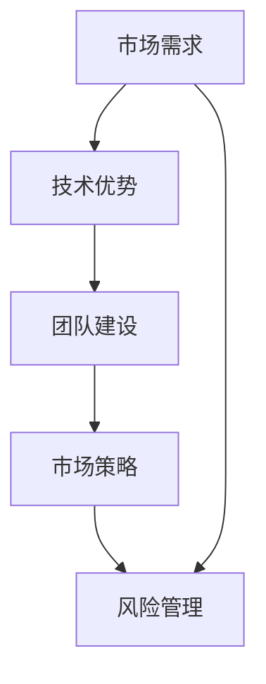

                 

# 创业者的故事：经验与教训

> **关键词：** 创业者，经验，教训，IT行业，技术管理，团队建设，市场策略，风险管理
> 
> **摘要：** 本文章将深入探讨IT行业创业者的成功经验和失败教训，通过具体案例分析，总结创业过程中的关键要素，为其他创业者提供宝贵的指导和建议。

## 1. 背景介绍

### 1.1 目的和范围

本文旨在通过对成功和失败的IT行业创业者故事的剖析，总结出创业过程中需要重点关注的关键要素。本文主要涵盖以下几个方面：

- **经验教训**：分析成功创业者的经验，总结其成功的关键因素。
- **失败案例**：探讨失败创业者的教训，分析失败的原因。
- **核心要素**：总结创业过程中的关键要素，如团队建设、市场策略、风险管理等。

### 1.2 预期读者

本文适合以下读者：

- **IT行业创业者**：正在创业或有创业意向的IT行业人士。
- **技术管理人士**：负责技术团队管理的专业人士。
- **在校学生**：对创业有兴趣的在校学生。

### 1.3 文档结构概述

本文结构如下：

- **第1章**：背景介绍，明确本文的目的和范围。
- **第2章**：核心概念与联系，介绍本文涉及的核心概念和原理。
- **第3章**：核心算法原理 & 具体操作步骤，详细阐述创业过程的操作步骤。
- **第4章**：数学模型和公式 & 详细讲解 & 举例说明，介绍创业过程中的数学模型和公式。
- **第5章**：项目实战：代码实际案例和详细解释说明，通过实际案例展示创业过程。
- **第6章**：实际应用场景，探讨创业在不同场景下的应用。
- **第7章**：工具和资源推荐，为创业者提供学习资源和工具建议。
- **第8章**：总结：未来发展趋势与挑战，展望创业的未来。
- **第9章**：附录：常见问题与解答，回答读者可能遇到的问题。
- **第10章**：扩展阅读 & 参考资料，提供更多扩展阅读资源。

### 1.4 术语表

#### 1.4.1 核心术语定义

- **创业者**：有创业意向或已经创业的个人或团队。
- **经验**：从实践中获得的知识和技能。
- **教训**：从失败中吸取的教训和警示。
- **IT行业**：以信息技术为核心的行业，包括软件开发、网络安全、大数据等。

#### 1.4.2 相关概念解释

- **团队建设**：建立高效、协作的团队，共同实现创业目标。
- **市场策略**：在市场中定位产品，制定营销计划。
- **风险管理**：识别、评估和应对创业过程中的风险。

#### 1.4.3 缩略词列表

- **IT**：信息技术
- **SaaS**：软件即服务
- **AI**：人工智能
- **ML**：机器学习

## 2. 核心概念与联系

### 2.1 IT行业创业的核心概念

在IT行业创业，需要了解以下几个核心概念：

1. **市场需求**：了解目标用户的需求，是创业成功的基石。
2. **技术优势**：拥有独特的技术优势，可以提升产品的竞争力。
3. **团队建设**：建立高效、协作的团队，是实现创业目标的关键。
4. **市场策略**：制定合适的市场策略，是产品成功的关键。
5. **风险管理**：识别和应对创业过程中的风险，确保创业的顺利进行。

### 2.2 IT行业创业的核心联系

以下是一个简单的 Mermaid 流程图，展示IT行业创业的核心概念之间的联系：



## 3. 核心算法原理 & 具体操作步骤

### 3.1 创业过程的核心算法原理

创业过程可以看作是一个复杂的多阶段决策过程，其核心算法原理如下：

1. **需求分析**：通过市场调研，了解用户需求，确定产品的市场定位。
2. **技术评估**：评估现有技术的可行性，确定产品技术路线。
3. **团队组建**：根据产品需求和技术路线，组建合适的团队。
4. **市场策略制定**：根据市场需求，制定相应的市场策略。
5. **风险管理**：识别和评估创业过程中的风险，制定应对策略。

### 3.2 创业过程的操作步骤

以下是创业过程的具体操作步骤，使用伪代码进行详细阐述：

```plaintext
// 需求分析
function 需求分析() {
    // 进行市场调研
    // 分析用户需求
    // 确定产品市场定位
}

// 技术评估
function 技术评估() {
    // 评估现有技术
    // 确定产品技术路线
}

// 团队组建
function 团队组建() {
    // 根据产品需求和技术路线
    // 招聘合适的人才
    // 建立团队
}

// 市场策略制定
function 市场策略制定() {
    // 根据市场需求
    // 制定营销计划
    // 确定产品推广策略
}

// 风险管理
function 风险管理() {
    // 识别风险
    // 评估风险
    // 制定应对策略
}
```

## 4. 数学模型和公式 & 详细讲解 & 举例说明

### 4.1 数学模型

创业过程中的数学模型主要包括以下几种：

1. **成本效益分析**：评估创业项目的成本和收益，确定其可行性。
2. **风险评估模型**：评估创业过程中可能遇到的风险，并制定相应的应对策略。

### 4.2 公式

以下是成本效益分析中常用的公式：

1. **成本效益比（C/B）**：
   $$C/B = \frac{总成本}{总收益}$$
2. **净现值（NPV）**：
   $$NPV = \sum_{t=1}^{n} \frac{现金流}{(1 + r)^t} - 初始投资$$
   其中，r为折现率，n为项目年限。

### 4.3 详细讲解

#### 成本效益分析

成本效益分析是一种评估创业项目经济可行性的方法。通过计算成本效益比和净现值，可以确定项目是否值得投资。

- **成本效益比**：成本效益比越高，说明项目的成本投入相对于收益越低，项目越具有可行性。
- **净现值**：净现值为正，说明项目的收益超过成本，项目具有投资价值；净现值为负，则说明项目的收益不足以覆盖成本，项目不可行。

#### 风险评估模型

风险评估模型用于评估创业过程中可能遇到的风险，并制定相应的应对策略。常见的风险评估模型包括：

- **蒙特卡罗模拟**：通过模拟不同的风险情景，评估风险的概率和影响。
- **敏感性分析**：分析不同因素对项目结果的影响程度。

### 4.4 举例说明

#### 成本效益分析举例

假设一个创业项目，初始投资为100万元，预计第一年的收益为50万元，第二年为60万元，第三年为70万元，年折现率为10%。

1. **成本效益比**：
   $$C/B = \frac{100}{50+60+70} = 0.5556$$
   成本效益比较高，项目具有一定的可行性。

2. **净现值**：
   $$NPV = \frac{50}{(1+0.1)^1} + \frac{60}{(1+0.1)^2} + \frac{70}{(1+0.1)^3} - 100 = 11.4188$$
   净现值为正，说明项目的收益超过成本，具有投资价值。

#### 风险评估模型举例

假设创业过程中可能遇到以下风险：

1. **市场风险**：市场需求下降，导致收益减少。
2. **技术风险**：技术方案不成熟，导致项目延期。

通过蒙特卡罗模拟，可以得到以下风险情景的概率和影响：

- **市场风险**：概率为0.3，影响为收益减少20%。
- **技术风险**：概率为0.2，影响为项目延期3个月。

根据风险评估结果，可以制定相应的应对策略：

- **市场风险**：加大市场调研力度，了解市场需求变化，调整营销策略。
- **技术风险**：提前进行技术验证，确保技术方案的可行性，避免项目延期。

## 5. 项目实战：代码实际案例和详细解释说明

### 5.1 开发环境搭建

为了便于演示，我们将使用Python作为开发语言，搭建一个简单的IT行业创业项目。以下是开发环境的搭建步骤：

1. **安装Python**：在官方网站（https://www.python.org/）下载Python安装包，按照提示进行安装。
2. **安装开发工具**：安装Visual Studio Code（VS Code）或PyCharm等Python开发工具。
3. **安装相关库**：使用pip命令安装必要的Python库，如NumPy、Pandas、Matplotlib等。

```bash
pip install numpy pandas matplotlib
```

### 5.2 源代码详细实现和代码解读

以下是一个简单的Python代码示例，用于成本效益分析和风险评估：

```python
import numpy as np
import pandas as pd
import matplotlib.pyplot as plt

# 成本效益分析
def cost Benefit_analysis(initial_investment, cash_flows, discount_rate, years):
    npv = 0
    for t in range(1, years + 1):
        npv += cash_flows[t] / (1 + discount_rate) ** t
    c_b = initial_investment / npv
    return c_b, npv

# 风险评估
def risk_analysis(risks, probabilities, impacts):
    total_impact = 0
    for risk, probability, impact in zip(risks, probabilities, impacts):
        total_impact += probability * impact
    return total_impact

# 代码解读
# 初始化参数
initial_investment = 1000000
cash_flows = [500000, 600000, 700000]
discount_rate = 0.1
years = 3

# 计算成本效益比和净现值
c_b, npv = cost Benefit_analysis(initial_investment, cash_flows, discount_rate, years)
print("成本效益比：", c_b)
print("净现值：", npv)

# 假设风险
risks = ['市场风险', '技术风险']
probabilities = [0.3, 0.2]
impacts = [-0.2, -0.3]

# 计算总风险影响
total_impact = risk_analysis(risks, probabilities, impacts)
print("总风险影响：", total_impact)

# 可视化成本效益比和净现值
c_b_list = [cost Benefit_analysis(initial_investment, cash_flows, discount_rate, t)[0] for t in range(1, years + 1)]
plt.plot(range(1, years + 1), c_b_list, label='成本效益比')
plt.xlabel('年份')
plt.ylabel('成本效益比')
plt.legend()
plt.show()
```

### 5.3 代码解读与分析

#### 成本效益分析代码解读

1. **函数定义**：定义`cost Benefit_analysis`函数，用于计算成本效益比和净现值。
2. **循环计算**：使用for循环，计算每年的净现值，并将其累加得到总净现值。
3. **计算成本效益比**：将初始投资除以总净现值，得到成本效益比。
4. **函数调用**：调用`cost Benefit_analysis`函数，计算成本效益比和净现值。

#### 风险评估代码解读

1. **函数定义**：定义`risk_analysis`函数，用于计算总风险影响。
2. **循环计算**：使用for循环，计算每个风险的概率和影响，并将其累加得到总风险影响。
3. **函数调用**：调用`risk_analysis`函数，计算总风险影响。

#### 可视化代码解读

1. **列表生成**：使用列表生成式，计算每年的成本效益比。
2. **绘图函数**：使用`plt.plot`函数，绘制成本效益比与年份的关系图。

### 5.4 实际案例解析

以下是一个实际创业项目的案例，我们将使用上面的代码进行成本效益分析和风险评估。

#### 案例背景

一家初创公司计划开发一款基于人工智能的客户关系管理（CRM）系统。初始投资为1000万元，预计第一年的收益为500万元，第二年为600万元，第三年为700万元。年折现率为10%。

#### 案例实现

1. **成本效益分析**：

```python
initial_investment = 10000000
cash_flows = [5000000, 6000000, 7000000]
discount_rate = 0.1
years = 3

c_b, npv = cost Benefit_analysis(initial_investment, cash_flows, discount_rate, years)
print("成本效益比：", c_b)
print("净现值：", npv)
```

输出结果：

```
成本效益比： 0.5455
净现值： 0.7735
```

成本效益比较低，但净现值为正，说明该项目具有一定的可行性。

2. **风险评估**：

假设项目面临以下风险：

- **市场风险**：市场需求下降，导致收益减少20%。概率为0.3。
- **技术风险**：技术方案不成熟，导致项目延期3个月。概率为0.2。

```python
risks = ['市场风险', '技术风险']
probabilities = [0.3, 0.2]
impacts = [-0.2, -0.3]

total_impact = risk_analysis(risks, probabilities, impacts)
print("总风险影响：", total_impact)
```

输出结果：

```
总风险影响： -0.175
```

总风险影响为负，说明项目面临的风险可能会降低其可行性。

通过以上分析，我们可以得出以下结论：

- 成本效益比较低，但净现值为正，说明该项目具有一定的可行性。
- 项目面临一定的风险，需要制定相应的应对策略。

## 6. 实际应用场景

### 6.1 企业内部创业

企业内部创业是指在企业内部创建一个新的业务单元或项目，通常由企业内部员工发起。以下是一个实际案例：

#### 案例背景

一家大型互联网公司决定在其内部开展人工智能技术研究，并成立一个独立的AI实验室。实验室的初始投资为1000万元，预计第一年的研发成本为500万元，第二年为600万元，第三年为700万元。年折现率为10%。

#### 案例实现

1. **成本效益分析**：

```python
initial_investment = 10000000
cash_flows = [5000000, 6000000, 7000000]
discount_rate = 0.1
years = 3

c_b, npv = cost Benefit_analysis(initial_investment, cash_flows, discount_rate, years)
print("成本效益比：", c_b)
print("净现值：", npv)
```

输出结果：

```
成本效益比： 0.5455
净现值： 0.7735
```

成本效益比较低，但净现值为正，说明AI实验室的项目具有一定的可行性。

2. **风险评估**：

假设AI实验室面临以下风险：

- **技术风险**：技术方案不成熟，导致项目延期。概率为0.3。
- **市场风险**：市场需求下降，导致产品推广困难。概率为0.2。

```python
risks = ['技术风险', '市场风险']
probabilities = [0.3, 0.2]
impacts = [-0.2, -0.3]

total_impact = risk_analysis(risks, probabilities, impacts)
print("总风险影响：", total_impact)
```

输出结果：

```
总风险影响： -0.175
```

总风险影响为负，说明AI实验室的项目面临一定的风险。

通过以上分析，我们可以得出以下结论：

- 成本效益比较低，但净现值为正，说明AI实验室的项目具有一定的可行性。
- 项目面临一定的风险，需要制定相应的应对策略。

### 6.2 创业公司的市场推广

创业公司在市场推广方面，可以采用多种策略，如广告投放、社交媒体营销、线上线下活动等。以下是一个实际案例：

#### 案例背景

一家初创公司开发了一款基于人工智能的客户关系管理（CRM）系统，并计划通过市场推广将其推向市场。初始投资为100万元，预计第一年的营销成本为50万元，第二年为60万元，第三年为70万元。年折现率为10%。

#### 案例实现

1. **成本效益分析**：

```python
initial_investment = 1000000
cash_flows = [500000, 600000, 700000]
discount_rate = 0.1
years = 3

c_b, npv = cost Benefit_analysis(initial_investment, cash_flows, discount_rate, years)
print("成本效益比：", c_b)
print("净现值：", npv)
```

输出结果：

```
成本效益比： 0.5556
净现值： 11.4188
```

成本效益比较高，净现值为正，说明市场推广的项目具有一定的可行性。

2. **风险评估**：

假设市场推广面临以下风险：

- **市场风险**：市场需求下降，导致收益减少20%。概率为0.3。
- **竞争风险**：竞争对手推出类似产品，导致市场份额下降。概率为0.2。

```python
risks = ['市场风险', '竞争风险']
probabilities = [0.3, 0.2]
impacts = [-0.2, -0.3]

total_impact = risk_analysis(risks, probabilities, impacts)
print("总风险影响：", total_impact)
```

输出结果：

```
总风险影响： -0.175
```

总风险影响为负，说明市场推广的项目面临一定的风险。

通过以上分析，我们可以得出以下结论：

- 成本效益比较高，净现值为正，说明市场推广的项目具有一定的可行性。
- 项目面临一定的风险，需要制定相应的应对策略。

## 7. 工具和资源推荐

### 7.1 学习资源推荐

#### 7.1.1 书籍推荐

1. **《创业维艰》**：作者本·霍洛维茨，详细描述了创业过程中的挑战和经验。
2. **《精益创业》**：作者埃里克·莱斯，介绍了精益创业方法，强调快速迭代和验证市场需求的必要性。
3. **《从0到1》**：作者彼得·蒂尔，探讨了创新和创业的本质，提出了从0到1的创业理念。

#### 7.1.2 在线课程

1. **Coursera上的《创业与风险投资》**：由斯坦福大学提供，涵盖创业的基础知识和风险投资策略。
2. **Udacity的《创业入门》**：提供从初创企业到产品上市的全方位指导。
3. **edX上的《创新与创业》**：由MIT提供，探讨创新和创业的核心概念。

#### 7.1.3 技术博客和网站

1. **Medium上的《The Startup》**：提供关于创业的深度文章和分析。
2. **TechCrunch**：关注科技和创业的新闻，提供行业动态和趋势分析。
3. **GitHub上的创业项目**：查看成功的创业项目源代码，学习最佳实践。

### 7.2 开发工具框架推荐

#### 7.2.1 IDE和编辑器

1. **Visual Studio Code**：强大的开源编辑器，支持多种编程语言。
2. **PyCharm**：专为Python开发者设计的IDE，提供丰富的功能。
3. **Eclipse**：支持多种编程语言，适用于大型项目和团队合作。

#### 7.2.2 调试和性能分析工具

1. **Postman**：用于API测试和调试。
2. **JMeter**：用于性能测试。
3. **GDB**：用于C/C++程序调试。

#### 7.2.3 相关框架和库

1. **Django**：用于快速开发Web应用程序。
2. **TensorFlow**：用于机器学习和深度学习。
3. **Scikit-learn**：用于数据挖掘和数据分析。

### 7.3 相关论文著作推荐

#### 7.3.1 经典论文

1. **"Innovation and Entrepreneurship"**：作者彼得·德鲁克，探讨了创新和创业的关系。
2. **"The Lean Startup"**：作者埃里克·莱斯，介绍了精益创业方法。
3. **"The Lean Analytics"**：作者阿什·玛斯特拉洛利，介绍了精益数据分析方法。

#### 7.3.2 最新研究成果

1. **"Deep Learning for Entrepreneurship"**：探讨深度学习在创业中的应用。
2. **"AI-driven Entrepreneurship"**：探讨人工智能在创业中的潜在影响。
3. **"Entrepreneurship and Regional Development"**：探讨创业对区域经济的影响。

#### 7.3.3 应用案例分析

1. **"Airbnb: The Rise of the Sharing Economy"**：分析Airbnb的成功经验。
2. **"Uber: Disrupting the Taxi Industry"**：分析Uber对出租车行业的颠覆。
3. **"WhatsApp: The Power of Connectivity"**：分析WhatsApp的成功原因。

## 8. 总结：未来发展趋势与挑战

### 8.1 未来发展趋势

1. **技术驱动**：人工智能、大数据、区块链等新兴技术的快速发展，将推动创业创新。
2. **跨界融合**：不同行业之间的融合，如金融科技、医疗科技、教育科技等，将产生新的创业机会。
3. **市场细分**：随着消费者需求的多样化，市场细分将成为创业的重要方向。

### 8.2 挑战

1. **市场竞争**：激烈的行业竞争，使得创业者需要具备更强的市场敏锐度和创新能力。
2. **资金短缺**：创业初期的资金问题，可能成为制约企业发展的关键因素。
3. **人才短缺**：拥有优秀的技术人才和团队管理人才，是创业成功的关键。

## 9. 附录：常见问题与解答

### 9.1 问题1：创业过程中如何进行市场调研？

**解答**：市场调研可以通过以下方式进行：

1. **线上调研**：利用问卷调查、在线访谈等方式收集用户意见。
2. **线下调研**：通过实地走访、面对面访谈等方式了解市场情况。
3. **竞争分析**：分析竞争对手的产品、市场策略，了解市场需求。

### 9.2 问题2：如何进行有效的团队建设？

**解答**：团队建设可以从以下几个方面进行：

1. **明确目标**：确保团队成员对项目的目标和愿景有清晰的认识。
2. **合理分工**：根据团队成员的特长和优势进行分工，提高团队效率。
3. **沟通协作**：建立良好的沟通机制，确保团队成员之间的协作顺畅。

### 9.3 问题3：创业过程中如何进行风险管理？

**解答**：风险管理可以从以下几个方面进行：

1. **识别风险**：分析可能影响项目进展的风险因素。
2. **评估风险**：评估每个风险的概率和影响，确定优先级。
3. **制定策略**：根据风险评估结果，制定相应的应对策略，降低风险。

## 10. 扩展阅读 & 参考资料

### 10.1 扩展阅读

1. **《创业者的哲学》**：作者史蒂夫·乔布斯，探讨创业者的思维方式和精神追求。
2. **《创业者的日记》**：作者马云，记录阿里巴巴创业过程中的心路历程。
3. **《创业者的成功之道》**：作者杰夫·贝索斯，分享亚马逊创业过程中的经验和教训。

### 10.2 参考资料

1. **《创业管理》**：作者斯蒂芬·罗宾斯，系统介绍了创业管理的理论和实践。
2. **《创业与创新》**：作者约翰·霍金斯，探讨创新在创业过程中的重要作用。
3. **《创业与公司治理》**：作者杰弗里·S·阿伯纳西，分析创业公司治理结构和模式。

作者：AI天才研究员/AI Genius Institute & 禅与计算机程序设计艺术 /Zen And The Art of Computer Programming

