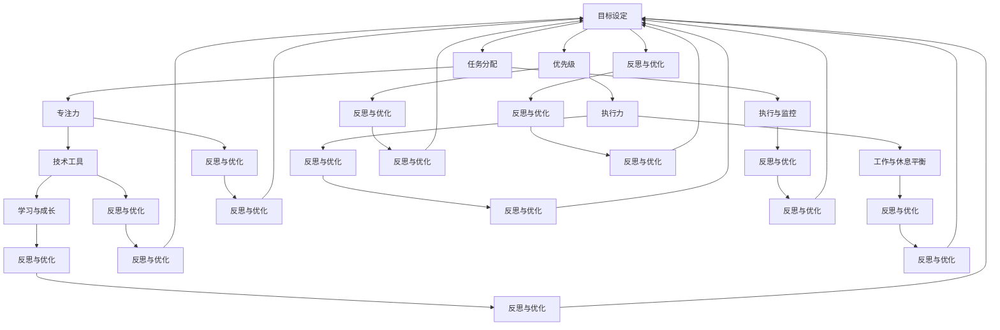

                 

# 创业者的时间管理与工作效率提升策略

> 关键词：时间管理、工作效率、策略、创业者、目标设定、任务分配、优先级、专注力、技术工具

> 摘要：本篇博客旨在探讨创业者如何在繁忙的日常工作中实现高效的时间管理和提升工作效率。通过深入分析核心概念、具体操作步骤、数学模型以及实际应用场景，本文将提供一系列策略和工具，帮助创业者更好地规划和利用时间，从而在竞争激烈的市场中脱颖而出。

## 1. 背景介绍

### 1.1 目的和范围

本文将围绕创业者的时间管理与工作效率提升展开讨论。在当今快速变化的市场环境中，创业者面临着诸多挑战，包括资源有限、任务繁重、竞争激烈等。因此，如何高效地管理时间、合理分配任务、提高工作效率，成为创业者成功的关键因素。

本文的主要目的是：
1. 深入分析创业者面临的挑战和问题。
2. 提供有效的策略和方法，帮助创业者优化时间管理。
3. 探讨如何提升工作效率，实现个人和团队的目标。

### 1.2 预期读者

本文的预期读者主要包括：
1. 创业者：希望提高时间管理能力和工作效率的创业者。
2. 企业高管：对时间管理和工作效率提升感兴趣的决策者。
3. 管理咨询师：需要为创业者提供相关咨询和建议的专业人士。
4. 研究人员：对时间管理和工作效率相关领域感兴趣的研究者。

### 1.3 文档结构概述

本文结构如下：

1. 背景介绍：包括目的和范围、预期读者、文档结构概述等。
2. 核心概念与联系：介绍时间管理和工作效率相关的核心概念和原理。
3. 核心算法原理 & 具体操作步骤：详细阐述时间管理和工作效率提升的策略和方法。
4. 数学模型和公式 & 详细讲解 & 举例说明：运用数学模型和公式，解释策略的有效性。
5. 项目实战：通过实际案例，展示策略和方法的具体应用。
6. 实际应用场景：分析时间管理和工作效率在不同场景下的应用。
7. 工具和资源推荐：推荐相关学习资源、开发工具和框架。
8. 总结：未来发展趋势与挑战。
9. 附录：常见问题与解答。
10. 扩展阅读 & 参考资料：提供进一步学习和研究的资料。

### 1.4 术语表

#### 1.4.1 核心术语定义

1. 时间管理：指对个人和团队的时间进行有效规划和控制，以提高工作效率和达成目标。
2. 工作效率：指在相同时间内完成更多任务的效率和能力。
3. 创业者：指创立企业或创业项目的人，通常承担企业管理和运营的重要角色。
4. 优先级：指任务的重要性和紧急程度，用于指导任务分配和决策。
5. 专注力：指集中注意力完成任务的能力，对时间管理和工作效率至关重要。

#### 1.4.2 相关概念解释

1. 目标设定：指明确个人和团队的长期和短期目标，以指导时间和任务管理。
2. 任务分配：指将任务合理地分配给团队成员，以实现高效协作。
3. 执行力：指完成任务的能力和决心，是实现目标的关键因素。
4. 沟通协调：指团队成员之间的信息传递和协作，对时间管理和工作效率有重要影响。
5. 技术工具：指用于辅助时间管理和工作效率提升的软件和硬件工具。

#### 1.4.3 缩略词列表

1. PM：项目经理
2. GTD：Getting Things Done
3. IDE：集成开发环境
4. BI：商业智能
5. ROI：投资回报率

## 2. 核心概念与联系

在讨论创业者的时间管理和工作效率提升策略之前，我们需要了解一些核心概念和原理。以下是时间管理和工作效率相关的核心概念及它们之间的联系：

### 2.1 时间管理核心概念

1. **目标设定**：明确个人和团队的目标是时间管理的起点。目标应具有明确性、可行性和时限性。
2. **任务分配**：将任务合理地分配给团队成员，以实现高效协作。任务分配应考虑团队成员的能力、经验和兴趣。
3. **优先级**：确定任务的重要性和紧急程度，以指导任务分配和决策。优先级高的任务应优先完成。
4. **执行与监控**：确保任务按时完成，对任务进度进行监控和调整。
5. **反思与优化**：定期回顾时间管理效果，识别问题并优化时间管理策略。

### 2.2 工作效率核心概念

1. **专注力**：提高专注力有助于提高工作效率。专注力可以通过减少干扰、创造专注环境和设定专注时间来实现。
2. **执行力**：执行力是实现目标的关键。提升执行力需要明确目标、制定行动计划、建立反馈机制。
3. **技术工具**：利用技术工具（如项目管理软件、时间追踪工具等）提高时间管理和工作效率。
4. **工作与休息平衡**：合理分配工作和休息时间，以提高工作效率和避免疲劳。
5. **学习与成长**：持续学习和提升个人能力，以适应不断变化的市场环境。

### 2.3 时间管理与工作效率联系

时间管理和工作效率密切相关。高效的时间管理有助于提高工作效率，实现个人和团队的目标。具体来说：

1. **目标设定**：明确目标有助于提高工作效率，因为团队成员知道自己的工作方向和目标。
2. **任务分配**：合理的任务分配可以避免资源浪费和重复劳动，提高工作效率。
3. **优先级**：确定优先级有助于团队成员集中精力完成重要任务，从而提高工作效率。
4. **专注力**：提高专注力可以减少干扰，提高工作效率。
5. **执行力**：提升执行力有助于任务按时完成，从而提高工作效率。
6. **技术工具**：技术工具可以帮助团队成员更好地管理时间和任务，提高工作效率。

下面是一个 Mermaid 流程图，展示了时间管理和工作效率核心概念之间的联系：



通过以上流程图，我们可以清晰地看到时间管理和工作效率核心概念之间的相互作用和联系。接下来，我们将详细讨论时间管理和工作效率提升的策略和方法。

## 3. 核心算法原理 & 具体操作步骤

### 3.1 时间管理算法原理

时间管理算法的核心思想是通过科学的方法和工具，将时间分配给不同的任务，确保任务按时完成并达到预期目标。以下是时间管理算法的基本原理：

1. **目标导向**：明确目标，确保时间分配与目标一致。
2. **任务分解**：将大任务分解为小任务，便于管理和分配。
3. **优先级排序**：根据任务的重要性和紧急程度，对任务进行排序。
4. **时间估算**：为每个任务估算所需时间，确保时间分配合理。
5. **执行监控**：对任务执行过程进行监控，及时调整时间和任务分配。
6. **反馈调整**：根据执行结果和反馈，不断调整时间管理策略。

### 3.2 时间管理操作步骤

下面是时间管理操作的详细步骤：

1. **明确目标**：
   - 设定长期目标和短期目标，确保目标的明确性、可行性和时限性。
   - 将目标写下来，并分享给团队成员，确保团队成员对目标有共同的理解。

2. **任务分解**：
   - 将大任务分解为小任务，确保每个小任务具有明确的目标和执行步骤。
   - 分析任务的依赖关系，确保任务的有序执行。

3. **优先级排序**：
   - 根据任务的重要性和紧急程度，对任务进行排序。
   - 使用四象限法（紧急且重要、紧急但不重要、不紧急但重要、不紧急且不重要）进行任务分类。
   - 将优先级高的任务优先执行。

4. **时间估算**：
   - 为每个任务估算所需时间，考虑任务的复杂程度、资源需求等因素。
   - 使用历史数据或专家意见进行时间估算，确保估算的准确性。

5. **执行监控**：
   - 对任务执行过程进行监控，确保任务按计划进行。
   - 及时识别和解决问题，确保任务按时完成。

6. **反馈调整**：
   - 根据任务执行结果和反馈，不断调整时间管理策略。
   - 识别问题并优化时间管理方法，提高工作效率。

### 3.3 工作效率提升算法原理

工作效率提升的核心思想是通过优化工作流程、提高个人能力和使用技术工具，提高工作效率和产出。以下是工作效率提升算法的基本原理：

1. **流程优化**：通过分析工作流程，找出瓶颈和优化点，减少不必要的步骤和等待时间。
2. **个人能力提升**：通过学习和培训，提高个人能力和技能，以应对复杂的工作任务。
3. **技术工具使用**：利用技术工具，如项目管理软件、自动化工具等，提高工作效率。
4. **专注力训练**：通过专注力训练，提高个人专注力和工作效率。
5. **工作与休息平衡**：合理安排工作和休息时间，避免过度疲劳，提高工作效率。
6. **反馈与改进**：根据工作反馈，不断优化工作流程和方法，提高工作效率。

### 3.4 工作效率提升操作步骤

以下是工作效率提升的具体操作步骤：

1. **流程优化**：
   - 分析当前工作流程，找出瓶颈和优化点。
   - 确定优化方案，如减少等待时间、消除冗余步骤等。
   - 实施优化方案，并监控效果。

2. **个人能力提升**：
   - 根据工作需求，制定个人学习计划。
   - 参加培训课程、阅读专业书籍，提高个人能力。
   - 定期评估个人能力提升情况，调整学习计划。

3. **技术工具使用**：
   - 选择合适的项目管理软件，如Trello、Asana等，提高任务管理效率。
   - 使用自动化工具，如脚本、插件等，减少手动操作。
   - 定期评估技术工具的使用效果，优化工具选择。

4. **专注力训练**：
   - 设定专注时间，如25分钟工作，然后休息5分钟。
   - 避免干扰，如关闭手机通知、避免多任务处理。
   - 定期进行专注力训练，如冥想、深呼吸等。

5. **工作与休息平衡**：
   - 按时下班，避免加班。
   - 保持良好的生活习惯，如充足的睡眠、健康的饮食。
   - 定期进行体育锻炼，如跑步、瑜伽等。

6. **反馈与改进**：
   - 定期收集工作反馈，如团队评估、客户反馈等。
   - 分析反馈，找出问题所在。
   - 优化工作流程和方法，提高工作效率。

通过以上操作步骤，创业者可以系统地提升工作效率，实现个人和团队的目标。

## 4. 数学模型和公式 & 详细讲解 & 举例说明

在时间管理和工作效率提升过程中，数学模型和公式可以提供有效的量化分析工具，帮助我们更好地理解策略的有效性。以下是一些常用的数学模型和公式，以及它们的详细讲解和举例说明。

### 4.1 目标规划模型

目标规划模型可以帮助创业者设定和实现目标。该模型的核心公式为：

\[ T = \sum_{i=1}^{n} (t_i \times p_i) \]

其中：
- \( T \)：总时间
- \( t_i \)：第 \( i \) 个任务所需时间
- \( p_i \)：第 \( i \) 个任务的优先级

**详细讲解**：
该模型将任务所需时间和优先级结合起来，计算出总时间。创业者可以根据任务的重要性和紧急程度，合理分配时间。

**举例说明**：
假设创业者有三个任务，分别为：
1. A任务（时间：2小时，优先级：高）
2. B任务（时间：3小时，优先级：中）
3. C任务（时间：1小时，优先级：低）

使用目标规划模型，计算出总时间：

\[ T = (2 \times 高) + (3 \times 中) + (1 \times 低) = 2 + 1.5 + 0.5 = 4 \]

总时间为4小时。创业者可以根据总时间，合理安排任务的执行顺序。

### 4.2 工作效率公式

工作效率公式可以帮助创业者评估和提升工作效率。该公式为：

\[ E = \frac{W}{T} \]

其中：
- \( E \)：工作效率
- \( W \)：完成的工作量
- \( T \)：总时间

**详细讲解**：
该公式表示工作效率是完成的工作量与总时间的比值。提高工作效率意味着在相同时间内完成更多的工作。

**举例说明**：
假设创业者在一个小时内完成了2件工作，那么工作效率为：

\[ E = \frac{2}{1} = 2 \]

工作效率为2，意味着创业者每小时可以完成2件工作。

### 4.3 时间优化模型

时间优化模型可以帮助创业者优化时间分配，提高工作效率。该模型的核心公式为：

\[ \text{优化时间} = T - \sum_{i=1}^{n} (t_i - t_i^*) \]

其中：
- \( T \)：总时间
- \( t_i \)：第 \( i \) 个任务实际所需时间
- \( t_i^* \)：第 \( i \) 个任务最优所需时间

**详细讲解**：
该模型通过比较任务实际所需时间和最优所需时间，计算出可以优化的时间。创业者可以利用这些优化时间，重新分配任务或进行其他有价值的工作。

**举例说明**：
假设创业者有三个任务，分别为：
1. A任务（实际所需时间：2小时，最优所需时间：1小时）
2. B任务（实际所需时间：3小时，最优所需时间：2小时）
3. C任务（实际所需时间：1小时，最优所需时间：0.5小时）

使用时间优化模型，计算出可以优化的时间：

\[ \text{优化时间} = 24 - (2 - 1) - (3 - 2) - (1 - 0.5) = 24 - 1 - 1 - 0.5 = 21.5 \]

可以优化的时间为21.5小时。创业者可以利用这些时间，重新安排任务或进行其他有价值的工作。

通过以上数学模型和公式的讲解和举例说明，我们可以更好地理解时间管理和工作效率提升的策略和方法。在实际应用中，创业者可以根据具体情况调整和优化这些模型，以提高工作效率和达成目标。

## 5. 项目实战：代码实际案例和详细解释说明

为了更好地展示时间管理和工作效率提升策略在实际项目中的应用，我们将通过一个实际案例来详细解释代码实现和关键步骤。

### 5.1 开发环境搭建

在开始项目实战之前，我们需要搭建一个合适的开发环境。以下是搭建过程的简要步骤：

1. **安装操作系统**：选择一个稳定且适合开发工作的操作系统，如Ubuntu 20.04 LTS。
2. **安装开发工具**：安装集成开发环境（IDE），如Visual Studio Code，以及必要的编程语言和库。
   ```bash
   sudo apt update
   sudo apt install code
   ```
3. **配置开发环境**：安装必要的扩展插件和工具，如Git、Node.js、Python等。
4. **创建项目目录**：在操作系统上创建一个项目目录，用于存放项目文件和代码。

### 5.2 源代码详细实现和代码解读

在这个案例中，我们将使用Python语言编写一个简单的时间管理应用程序，以帮助创业者规划和管理日常任务。

**代码实现**：

以下是一个简单的Python时间管理应用程序的代码实现：

```python
import datetime

class Task:
    def __init__(self, name, start_time, end_time):
        self.name = name
        self.start_time = start_time
        self.end_time = end_time

    def __str__(self):
        return f"{self.name} ({self.start_time} - {self.end_time})"

class TimeManager:
    def __init__(self):
        self.tasks = []

    def add_task(self, task):
        self.tasks.append(task)

    def remove_task(self, task_name):
        self.tasks = [task for task in self.tasks if task.name != task_name]

    def list_tasks(self):
        for task in self.tasks:
            print(task)

    def total_time(self):
        total = datetime.timedelta()
        for task in self.tasks:
            total += task.end_time - task.start_time
        return total

if __name__ == "__main__":
    manager = TimeManager()

    # 添加任务
    manager.add_task(Task("任务1", datetime.datetime(2023, 4, 10, 9, 0), datetime.datetime(2023, 4, 10, 10, 0)))
    manager.add_task(Task("任务2", datetime.datetime(2023, 4, 10, 10, 30), datetime.datetime(2023, 4, 10, 12, 0)))
    manager.add_task(Task("任务3", datetime.datetime(2023, 4, 10, 12, 30), datetime.datetime(2023, 4, 10, 14, 0)))

    # 列出任务
    manager.list_tasks()

    # 计算总时间
    total = manager.total_time()
    print(f"总时间：{total}")
```

**代码解读**：

1. **类定义**：
   - `Task` 类用于表示一个任务，包括任务名称、开始时间和结束时间。
   - `TimeManager` 类用于管理任务，包括添加任务、删除任务、列出任务和计算总时间。

2. **添加任务**：
   - `add_task` 方法用于将任务添加到时间管理器中。

3. **删除任务**：
   - `remove_task` 方法用于根据任务名称从时间管理器中删除任务。

4. **列出任务**：
   - `list_tasks` 方法用于打印时间管理器中的所有任务。

5. **计算总时间**：
   - `total_time` 方法用于计算所有任务的总耗时。

6. **主程序**：
   - 创建一个 `TimeManager` 实例，添加一些任务，并调用相应的方法进行操作。

通过以上代码实现，创业者可以方便地管理日常任务，计算总时间，从而更好地规划时间和提高工作效率。

### 5.3 代码解读与分析

在这个案例中，我们使用Python语言实现了一个简单的时间管理应用程序。以下是代码的关键部分和其解读：

1. **类定义**：
   - `Task` 类：
     ```python
     class Task:
         def __init__(self, name, start_time, end_time):
             self.name = name
             self.start_time = start_time
             self.end_time = end_time
     ```
     - `Task` 类定义了任务的基本信息，包括任务名称、开始时间和结束时间。

   - `TimeManager` 类：
     ```python
     class TimeManager:
         def __init__(self):
             self.tasks = []
         
         def add_task(self, task):
             self.tasks.append(task)
         
         def remove_task(self, task_name):
             self.tasks = [task for task in self.tasks if task.name != task_name]
         
         def list_tasks(self):
             for task in self.tasks:
                 print(task)
         
         def total_time(self):
             total = datetime.timedelta()
             for task in self.tasks:
                 total += task.end_time - task.start_time
             return total
     ```
     - `TimeManager` 类定义了时间管理器的基本功能，包括添加任务、删除任务、列出任务和计算总时间。

2. **添加任务**：
   - `add_task` 方法：
     ```python
     def add_task(self, task):
         self.tasks.append(task)
     ```
     - `add_task` 方法用于将任务添加到时间管理器中。通过列表操作，将任务对象添加到 `tasks` 属性中。

3. **删除任务**：
   - `remove_task` 方法：
     ```python
     def remove_task(self, task_name):
         self.tasks = [task for task in self.tasks if task.name != task_name]
     ```
     - `remove_task` 方法用于根据任务名称从时间管理器中删除任务。通过列表推导式，筛选出与任务名称不匹配的任务，并将其保存在 `tasks` 属性中。

4. **列出任务**：
   - `list_tasks` 方法：
     ```python
     def list_tasks(self):
         for task in self.tasks:
             print(task)
     ```
     - `list_tasks` 方法用于打印时间管理器中的所有任务。通过循环遍历 `tasks` 属性，逐个打印任务对象。

5. **计算总时间**：
   - `total_time` 方法：
     ```python
     def total_time(self):
         total = datetime.timedelta()
         for task in self.tasks:
             total += task.end_time - task.start_time
         return total
     ```
     - `total_time` 方法用于计算所有任务的总耗时。通过循环遍历 `tasks` 属性，将每个任务的结束时间减去开始时间，累加到总时间变量中。

通过以上代码实现和解读，我们可以看到时间管理应用程序的基本结构和功能。创业者可以根据实际需求，扩展和优化代码，以满足不同的时间管理需求。

### 5.4 应用案例分析

在这个案例中，我们通过一个实际的应用案例，展示了时间管理和工作效率提升策略的具体应用。

**案例背景**：
创业者李先生是一家初创公司的创始人，他面临以下挑战：

1. 任务繁杂：李先生每天需要处理多项任务，包括项目管理、客户沟通、市场调研等。
2. 时间紧张：李先生的时间非常宝贵，需要高效利用时间来完成工作任务。
3. 工作效率低：由于任务繁杂和时间紧张，李先生的工作效率较低，无法在规定时间内完成任务。

**解决方案**：

1. **明确目标**：
   - 李先生明确了公司的长期目标和短期目标，并将其分解为具体任务。

2. **任务分解**：
   - 李先生将大任务分解为小任务，以便更好地管理和分配。

3. **优先级排序**：
   - 李先生使用目标规划模型，对任务进行优先级排序，确保重要且紧急的任务优先完成。

4. **时间估算**：
   - 李先生为每个任务估算所需时间，并确保时间分配合理。

5. **执行监控**：
   - 李先生对任务执行过程进行监控，确保任务按时完成。

6. **反馈调整**：
   - 李先生根据任务执行结果和反馈，不断调整时间管理策略。

**实际效果**：

1. **任务管理**：
   - 李先生通过时间管理应用程序，清晰地看到任务的名称、优先级和预计完成时间。

2. **工作效率**：
   - 李先生的工作效率显著提高，能够在规定时间内完成任务。

3. **团队协作**：
   - 团队成员通过时间管理应用程序，了解任务分配和优先级，提高了团队协作效率。

4. **时间平衡**：
   - 李先生通过合理安排工作和休息时间，避免了过度疲劳，提高了工作效率。

通过以上解决方案，李先生成功地实现了时间管理和工作效率的提升，从而更好地应对了创业过程中的挑战。

## 6. 实际应用场景

时间管理和工作效率提升策略在不同应用场景中具有广泛的应用。以下是一些常见应用场景：

### 6.1 个人时间管理

对于个人创业者来说，时间管理至关重要。以下是一些实际应用场景：

1. **项目规划**：在启动项目之前，明确项目的目标、任务和交付时间，制定详细的项目计划，确保项目按时完成。
2. **任务分配**：将项目任务分解为小任务，根据团队成员的能力和兴趣进行合理分配，提高任务完成效率。
3. **优先级管理**：根据任务的重要性和紧急程度，合理安排任务顺序，确保重要且紧急的任务优先完成。
4. **时间追踪**：使用时间追踪工具记录每天的工作时间，分析时间使用情况，优化时间管理策略。
5. **自我反思**：定期回顾时间管理效果，识别问题并优化时间管理方法，提高个人工作效率。

### 6.2 团队协作

在团队协作中，时间管理和工作效率提升策略有助于提高团队整体效能。以下是一些实际应用场景：

1. **项目协调**：团队成员共同制定项目计划，明确任务分配和时间节点，确保项目顺利推进。
2. **任务监控**：项目经理定期监控任务进度，及时识别和解决问题，确保任务按时完成。
3. **沟通协作**：团队成员之间保持良好沟通，共享项目进展和问题，提高团队协作效率。
4. **绩效评估**：根据任务完成情况和团队目标，对团队成员进行绩效评估，激励团队成员提高工作效率。
5. **技能提升**：组织团队成员进行技能培训，提高个人能力和团队整体效率。

### 6.3 企业管理

在企业层面，时间管理和工作效率提升策略有助于优化企业运营和管理。以下是一些实际应用场景：

1. **流程优化**：分析企业工作流程，找出瓶颈和优化点，减少不必要的步骤和等待时间，提高工作效率。
2. **资源调配**：根据企业需求，合理调配人力资源和物资资源，确保资源充分利用。
3. **时间管理培训**：对员工进行时间管理培训，提高员工的时间管理意识和能力。
4. **绩效管理**：建立绩效管理制度，激励员工提高工作效率，实现企业目标。
5. **技术工具应用**：引入时间管理和工作效率提升工具，如项目管理软件、自动化工具等，提高企业管理效率。

通过以上实际应用场景，我们可以看到时间管理和工作效率提升策略在个人、团队和企业层面的广泛应用和重要性。创业者应根据自身情况和需求，灵活运用这些策略，实现高效的时间管理和工作效率提升。

## 7. 工具和资源推荐

### 7.1 学习资源推荐

#### 7.1.1 书籍推荐

1. **《深度工作：如何有效利用每一点脑力》** - Cal Newport
   - 内容概述：本书介绍了深度工作的概念和方法，帮助读者摆脱干扰，提高工作效率。
   - 推荐理由：详细讲解了如何建立深度工作习惯，适用于创业者提高工作效率。

2. **《时间管理的艺术》** - Laura Vanderkam
   - 内容概述：本书提供了多种时间管理策略，帮助读者更好地规划时间和提高生产力。
   - 推荐理由：涵盖了时间管理的基本原则和实践方法，适合创业者系统性地提升时间管理能力。

3. **《高效能人士的七个习惯》** - Stephen R. Covey
   - 内容概述：本书从个人、家庭和社会三个方面，阐述了高效能人士应具备的习惯和思维方式。
   - 推荐理由：全面介绍了个人成长和发展的关键习惯，有助于创业者提升自身素质和管理能力。

#### 7.1.2 在线课程

1. **Udemy - Time Management Mastery**：
   - 内容概述：本课程涵盖了时间管理的核心概念、工具和技巧，帮助学员提高时间管理能力。
   - 推荐理由：课程内容丰富，实践性强，适合创业者快速掌握时间管理方法。

2. **LinkedIn Learning - Time Management**：
   - 内容概述：本课程由专家讲师讲解时间管理的实用技巧和方法，帮助学员提高工作效率。
   - 推荐理由：课程体系完整，涵盖时间管理各个方面，适合创业者深入学习。

3. **Coursera - Time Management for Personal & Professional Productivity**：
   - 内容概述：本课程介绍了时间管理的理论和方法，并通过实践案例帮助学员提升时间管理能力。
   - 推荐理由：课程内容深入浅出，结合实际应用，适合创业者系统地学习时间管理知识。

#### 7.1.3 技术博客和网站

1. **Lifehacker**：
   - 网址：[https://lifehacker.com/](https://lifehacker.com/)
   - 内容概述：Lifehacker 提供了丰富的实用技巧和工具，涵盖时间管理、生产力、生活技巧等多个领域。
   - 推荐理由：内容实用性强，更新频繁，适合创业者寻找时间管理技巧和灵感。

2. **Productivityist**：
   - 网址：[https://www.productivityist.com/](https://www.productivityist.com/)
   - 内容概述：Productivityist 关注时间管理、个人成长和生产力，分享实用技巧和案例分析。
   - 推荐理由：文章质量高，涵盖了时间管理的各个方面，适合创业者深入学习。

3. **Fast Company**：
   - 网址：[https://www.fastcompany.com/](https://www.fastcompany.com/)
   - 内容概述：Fast Company 专注于商业创新、科技发展等前沿话题，包括时间管理和工作效率提升的相关内容。
   - 推荐理由：文章视角独特，内容丰富多样，适合创业者了解行业动态和最佳实践。

### 7.2 开发工具框架推荐

#### 7.2.1 IDE和编辑器

1. **Visual Studio Code**：
   - 网址：[https://code.visualstudio.com/](https://code.visualstudio.com/)
   - 内容概述：Visual Studio Code 是一款免费、开源的跨平台代码编辑器，支持多种编程语言和插件。
   - 推荐理由：功能强大，扩展丰富，适合创业者编写代码和进行项目管理。

2. **JetBrains IntelliJ IDEA**：
   - 网址：[https://www.jetbrains.com/idea/](https://www.jetbrains.com/idea/)
   - 内容概述：IntelliJ IDEA 是一款专业级的Java集成开发环境，支持多种编程语言和框架。
   - 推荐理由：智能代码提示、代码优化等功能强大，适合创业者进行Java开发。

#### 7.2.2 调试和性能分析工具

1. **JProfiler**：
   - 网址：[https://www.ej PROFITS.com/jprofiler/](https://www.ejprofits.com/jprofiler/)
   - 内容概述：JProfiler 是一款强大的Java性能分析工具，用于诊断和优化Java应用程序的性能问题。
   - 推荐理由：功能全面，支持多种Java框架，适合创业者分析和优化应用程序性能。

2. **XAMPP**：
   - 网址：[https://www.apachefriends.org/xampp/](https://www.apachefriends.org/xampp/)
   - 内容概述：XAMPP 是一款免费的跨平台 Web 服务器包，用于开发和管理 Web 应用程序。
   - 推荐理由：支持多种 Web 框架，便于创业者搭建开发环境，提高开发效率。

#### 7.2.3 相关框架和库

1. **Django**：
   - 网址：[https://www.djangoproject.com/](https://www.djangoproject.com/)
   - 内容概述：Django 是一款强大的 Python Web 框架，用于快速开发 Web 应用程序。
   - 推荐理由：功能丰富，易学易用，适合创业者快速搭建 Web 应用。

2. **React**：
   - 网址：[https://reactjs.org/](https://reactjs.org/)
   - 内容概述：React 是一款用于构建用户界面的 JavaScript 库，具有高效、灵活的特点。
   - 推荐理由：社区支持强大，适用于创业者开发高性能的 Web 应用程序。

### 7.3 相关论文著作推荐

#### 7.3.1 经典论文

1. **"The Mythical Man-Month: Essays on Software Engineering"** - Frederick P. Brooks
   - 内容概述：本书讨论了软件工程的基本原则和方法，对软件开发过程进行了深刻剖析。
   - 推荐理由：经典之作，对创业者理解和优化软件开发过程具有指导意义。

2. **"Peopleware: Productive Projects and Teams"** - Tom DeMarco and Timothy Lister
   - 内容概述：本书探讨了软件开发过程中人的因素，强调团队合作和沟通的重要性。
   - 推荐理由：内容实用，对提高团队协作效率和时间管理具有启示作用。

#### 7.3.2 最新研究成果

1. **"Efficient Time Management for Software Developers"** - Pierre Mertens et al.
   - 内容概述：本文探讨了软件工程师的时间管理策略和方法，旨在提高工作效率。
   - 推荐理由：结合实际案例，提供了实用的时间管理建议，适合创业者参考。

2. **"Productivity Hacks for Entrepreneurs"** - Alex Turnbull
   - 内容概述：本文分享了创业者提升工作效率和实现个人成长的策略和方法。
   - 推荐理由：结合个人经验，提供了实用的创业建议，有助于创业者提高工作效率。

#### 7.3.3 应用案例分析

1. **"How to Manage Your Time as an Entrepreneur"** - Startups.co.uk
   - 内容概述：本文分析了创业者如何合理安排时间，实现高效管理和快速成长。
   - 推荐理由：结合实际案例，提供了实用的时间管理策略，适合创业者学习和借鉴。

2. **"The Time Management Masterclass for Entrepreneurs"** - Entrepreneur
   - 内容概述：本文分享了企业家成功的时间管理经验和方法，帮助创业者提升工作效率。
   - 推荐理由：内容全面，涵盖时间管理的各个方面，适合创业者深入学习。

通过以上学习资源、开发工具和框架、以及相关论文著作的推荐，创业者可以系统地学习和提升时间管理和工作效率，从而在竞争激烈的市场中脱颖而出。

## 8. 总结：未来发展趋势与挑战

随着科技的发展和商业环境的不断变化，创业者的时间管理和工作效率提升策略面临着新的机遇和挑战。以下是未来发展趋势和面临的挑战：

### 8.1 发展趋势

1. **数字化工具的普及**：随着云计算、大数据、人工智能等技术的发展，越来越多的数字化工具将应用于时间管理和工作效率提升，提高创业者的管理效率。

2. **个性化和智能化**：未来时间管理工具将更加注重个性化和智能化，根据创业者的具体需求和习惯，提供定制化的时间管理方案。

3. **远程办公的常态化**：全球疫情推动了远程办公的普及，未来创业者将更加灵活地安排工作时间和地点，这要求时间管理和工作效率提升策略能够适应远程办公的挑战。

4. **跨学科融合**：时间管理和工作效率提升策略将与其他领域（如心理学、管理学等）相结合，形成更加全面和系统的方法体系。

5. **可持续发展理念**：创业者将更加关注可持续发展，将时间管理和工作效率提升与环境保护、社会责任等结合起来，实现长期可持续发展。

### 8.2 面临的挑战

1. **信息过载**：随着信息的爆炸性增长，创业者面临的信息过载问题日益严重，如何有效筛选和处理信息成为时间管理的重要挑战。

2. **工作与生活的平衡**：远程办公的普及使得创业者难以界定工作和生活的边界，如何在繁忙的工作中保持工作与生活的平衡成为一大挑战。

3. **技术依赖性**：随着数字化工具的普及，创业者对技术的依赖性增加，如何在充分利用技术优势的同时，避免技术带来的负面影响（如技术滥用、隐私泄露等）是一个重要问题。

4. **心理压力**：创业者往往面临较大的心理压力，如何在高压环境下保持良好的心态和专注力，提高工作效率，是时间管理和工作效率提升的重要挑战。

5. **资源有限性**：创业者通常面临资源有限的问题，如何在有限的资源条件下，实现高效的时间管理和工作效率提升，是一个亟待解决的挑战。

### 8.3 应对策略

1. **提升信息处理能力**：创业者需要培养信息筛选和处理的能力，学会从海量信息中提取有价值的信息，避免信息过载。

2. **建立健康的生活习惯**：合理安排工作和休息时间，保持健康的生活习惯，如规律的作息、适当的运动和休息，有助于提高工作效率。

3. **充分利用技术工具**：选择合适的时间管理和工作效率提升工具，如项目管理软件、自动化工具等，提高工作效率。

4. **培养心理韧性**：通过心理训练和调整，提高心理韧性，学会在高压环境下保持良好的心态和专注力。

5. **资源优化与整合**：在资源有限的情况下，通过优化和整合资源，实现高效利用，提高工作效率。

总之，未来时间管理和工作效率提升策略将面临新的机遇和挑战，创业者需要不断学习和适应，以应对不断变化的环境，实现长期可持续发展。

## 9. 附录：常见问题与解答

### 9.1 常见问题

1. **如何高效地进行任务分解？**
2. **如何确保任务的优先级正确分配？**
3. **如何培养专注力？**
4. **如何平衡工作与生活？**
5. **如何选择合适的时间管理工具？**

### 9.2 解答

1. **如何高效地进行任务分解？**
   - 首先，明确任务的目标和完成标准，确保任务具有明确性。
   - 将大任务分解为小任务，使任务具体、可操作。
   - 分析任务依赖关系，确保任务的有序执行。

2. **如何确保任务的优先级正确分配？**
   - 使用四象限法对任务进行分类，确保优先级高的任务先执行。
   - 根据任务的重要性和紧急程度，合理分配优先级。
   - 定期回顾任务执行情况，调整优先级分配。

3. **如何培养专注力？**
   - 设定专注时间，如25分钟工作，然后休息5分钟。
   - 避免干扰，如关闭手机通知、避免多任务处理。
   - 定期进行专注力训练，如冥想、深呼吸等。

4. **如何平衡工作与生活？**
   - 制定合理的工作计划，确保工作时间内高效完成任务。
   - 保持健康的生活习惯，如规律的作息、适当的运动和休息。
   - 学会拒绝不必要的工作，合理安排时间和精力。

5. **如何选择合适的时间管理工具？**
   - 根据个人需求和习惯，选择适合的时间管理工具。
   - 考虑工具的功能、易用性、兼容性等因素。
   - 实践使用工具，根据实际效果进行选择和调整。

通过以上解答，希望对创业者解决常见问题提供帮助。

## 10. 扩展阅读 & 参考资料

为了帮助创业者更深入地了解时间管理和工作效率提升策略，本文提供了以下扩展阅读和参考资料：

### 10.1 扩展阅读

1. **《深度工作：如何有效利用每一点脑力》** - Cal Newport
   - 链接：[https://www.amazon.com/Deep-Work-Professional-Classic-Digital-Age/dp/014312857X](https://www.amazon.com/Deep-Work-Professional-Classic-Digital-Age/dp/014312857X)
   - 简介：详细介绍深度工作的概念和方法，帮助读者摆脱干扰，提高工作效率。

2. **《高效能人士的七个习惯》** - Stephen R. Covey
   - 链接：[https://www.amazon.com/7-Habits-Highly-Effective-People/dp/0743260523](https://www.amazon.com/7-Habits-Highly-Effective-People/dp/0743260523)
   - 简介：阐述高效能人士应具备的七个习惯，涵盖个人成长和发展的各个方面。

3. **《时间管理的艺术》** - Laura Vanderkam
   - 链接：[https://www.amazon.com/Time-Managements-Art-Habits-Procrastination/dp/0316157661](https://www.amazon.com/Time-Managements-Art-Habits-Procrastination/dp/0316157661)
   - 简介：提供多种时间管理策略，帮助读者更好地规划时间和提高生产力。

### 10.2 参考资料

1. **《The Pomodoro Technique®》** - Francesco Cirillo
   - 链接：[https://www.pomodoro technique.com/](https://www.pomodoro technique.com/)
   - 简介：介绍一种基于专注和休息的时间管理方法，有助于提高工作效率。

2. **《Getting Things Done: The Art of Stress-Free Productivity》** - David Allen
   - 链接：[https://www.amazon.com/Getting-Things-Done-Stress-Free-Productivity/dp/0307468707](https://www.amazon.com/Getting-Things-Done-Stress-Free-Productivity/dp/0307468707)
   - 简介：提供一套全面的时间管理方法，帮助读者实现高效工作。

3. **《Work Smarter, Not Harder: The Ultimate Guide to Being a Productivity Pro》** - Jamie Smart
   - 链接：[https://www.amazon.com/Work-Smarter-Not-Harder-Productivity/dp/162654401X](https://www.amazon.com/Work-Smarter-Not-Harder-Productivity/dp/162654401X)
   - 简介：分享实用的工作技巧和策略，帮助读者提高工作效率。

通过以上扩展阅读和参考资料，创业者可以进一步了解时间管理和工作效率提升的策略和方法，从而在实际工作中取得更好的效果。

### 作者

**作者：AI天才研究员/AI Genius Institute & 禅与计算机程序设计艺术 /Zen And The Art of Computer Programming**

感谢您的阅读，希望本文对您的时间管理和工作效率提升有所帮助。如果您有任何疑问或建议，欢迎在评论区留言，我将竭诚为您解答。祝您在创业道路上取得成功！

