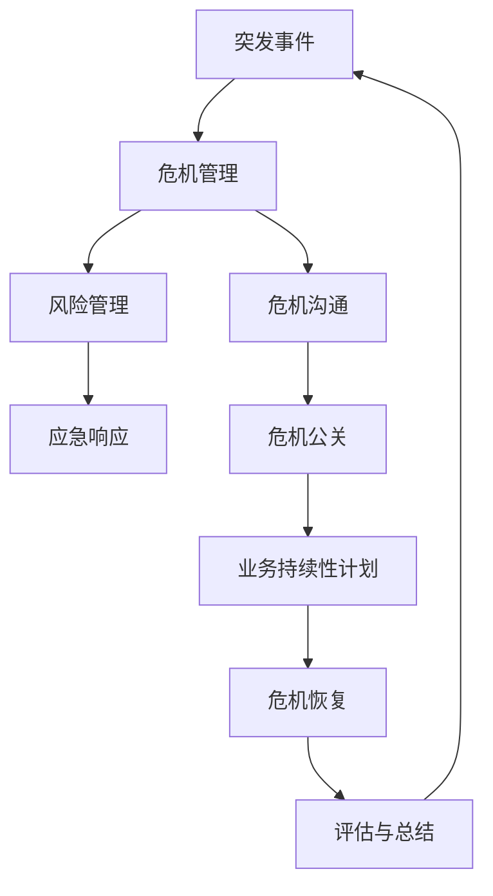

                 

# 创业路上的危机管理：如何应对突发事件

> **关键词：** 创业、危机管理、突发事件、应对策略、风险管理、企业家

> **摘要：** 本文将探讨创业者在面对突发事件时的危机管理策略。通过深入分析突发事件的影响、核心应对措施以及实际应用场景，帮助创业者有效应对各类危机，确保企业稳定发展。

## 1. 背景介绍

### 1.1 目的和范围

本文旨在帮助创业者在面对突发事件时能够迅速采取有效的危机管理措施，确保企业的持续运营和长期发展。本文将围绕以下几个核心问题展开：

- 突发事件的定义及其对创业企业的影响
- 应对突发事件的策略和方法
- 如何构建有效的危机管理机制
- 实际应用场景中的危机管理实践

### 1.2 预期读者

本文适用于创业企业主、企业管理者以及关注企业危机管理的专业人士。通过阅读本文，读者将能够：

- 了解突发事件对企业的影响
- 掌握应对突发事件的策略和方法
- 学习构建危机管理机制的具体步骤
- 获得实际应用场景中的危机管理经验

### 1.3 文档结构概述

本文将分为以下几个部分：

- **第1部分：背景介绍**：介绍文章的目的、范围、预期读者以及文档结构概述。
- **第2部分：核心概念与联系**：阐述危机管理的核心概念及其相互关系，使用Mermaid流程图进行展示。
- **第3部分：核心算法原理 & 具体操作步骤**：详细讲解应对突发事件的算法原理和具体操作步骤，使用伪代码进行阐述。
- **第4部分：数学模型和公式 & 详细讲解 & 举例说明**：介绍危机管理的数学模型和公式，并进行详细讲解和举例说明。
- **第5部分：项目实战：代码实际案例和详细解释说明**：通过具体代码实现和解读，展示危机管理的实际应用。
- **第6部分：实际应用场景**：分析危机管理在不同场景下的应用。
- **第7部分：工具和资源推荐**：推荐相关学习资源、开发工具框架和论文著作。
- **第8部分：总结：未来发展趋势与挑战**：总结文章核心观点，探讨未来发展趋势与挑战。
- **第9部分：附录：常见问题与解答**：解答读者可能遇到的常见问题。
- **第10部分：扩展阅读 & 参考资料**：提供进一步阅读的参考资料。

### 1.4 术语表

#### 1.4.1 核心术语定义

- **突发事件**：指在企业运营过程中突然发生、难以预见且对企业造成重大影响的特殊事件。
- **危机管理**：指企业在面对突发事件时，通过采取一系列措施来减轻事件影响、恢复运营和避免损失的过程。
- **风险管理**：指企业通过识别、评估、控制和监控风险，以实现业务目标的过程。
- **应急响应**：指企业在突发事件发生时，迅速采取行动以控制局势、减轻影响和恢复运营的过程。

#### 1.4.2 相关概念解释

- **危机**：指在企业运营过程中可能对企业造成重大损失或负面影响的情况。
- **风险管理计划**：指企业为应对潜在风险而制定的行动方案。
- **应急预案**：指企业为应对突发事件而制定的预先准备的行动计划。

#### 1.4.3 缩略词列表

- **IT**：信息技术（Information Technology）
- **CEO**：首席执行官（Chief Executive Officer）
- **CFO**：首席财务官（Chief Financial Officer）
- **CRO**：首席风险官（Chief Risk Officer）

## 2. 核心概念与联系

在探讨危机管理的核心概念之前，我们需要了解一些关键的定义和关系。以下是一个Mermaid流程图，用于展示危机管理的核心概念及其相互关系：



### 2.1 核心概念解释

#### 2.1.1 突发事件

突发事件是指在企业运营过程中突然发生、难以预见且对企业造成重大影响的特殊事件。这些事件可能包括自然灾害、意外事故、法律纠纷、网络安全攻击、财务问题等。突发事件的特点是发生突然、影响广泛、难以预测，因此需要企业具备快速应对的能力。

#### 2.1.2 危机管理

危机管理是指企业在面对突发事件时，通过采取一系列措施来减轻事件影响、恢复运营和避免损失的过程。危机管理的目的是确保企业能够迅速应对突发事件，最大限度地降低损失，并尽快恢复正常运营。

#### 2.1.3 风险管理

风险管理是指企业通过识别、评估、控制和监控风险，以实现业务目标的过程。风险管理的目标是确保企业能够识别和评估潜在风险，并采取适当措施来减轻或避免风险的影响。

#### 2.1.4 应急响应

应急响应是指企业在突发事件发生时，迅速采取行动以控制局势、减轻影响和恢复运营的过程。应急响应的关键在于快速、有效和协调的行动，以确保企业能够迅速应对突发事件。

#### 2.1.5 危机沟通

危机沟通是指企业在面对突发事件时，与内部员工、外部合作伙伴、客户和公众等进行沟通和协调的过程。危机沟通的目的是确保信息的透明、及时和准确，以减轻事件对企业的负面影响。

#### 2.1.6 危机公关

危机公关是指企业在面对突发事件时，通过媒体、公关手段等对外传递信息、塑造形象和应对舆论的过程。危机公关的目的是维护企业的声誉和形象，减少事件对企业的负面影响。

#### 2.1.7 业务持续性计划

业务持续性计划是指企业为应对突发事件而制定的预先准备的行动计划，以确保企业能够持续运营和提供产品或服务。业务持续性计划的目的是确保企业能够在突发事件发生时，迅速恢复运营，减少损失。

#### 2.1.8 危机恢复

危机恢复是指企业在突发事件后，通过一系列措施恢复运营、修复受损形象和重建客户信任的过程。危机恢复的关键在于评估事件的影响，采取有效措施来恢复企业的正常运营。

#### 2.1.9 评估与总结

评估与总结是指企业在危机管理过程中，对突发事件的影响、应对措施的效果和危机管理过程进行评估和总结的过程。评估与总结的目的是识别问题、改进流程和优化危机管理机制。

## 3. 核心算法原理 & 具体操作步骤

在了解危机管理的核心概念之后，我们需要探讨应对突发事件的算法原理和具体操作步骤。以下是一个简单的算法原理和操作步骤：

### 3.1 算法原理

危机管理的核心算法可以概括为以下几个步骤：

1. **风险识别**：识别企业可能面临的风险，包括内部和外部风险。
2. **风险评估**：评估每个风险的可能性和影响程度，确定优先级。
3. **风险应对**：制定风险应对策略，包括风险规避、风险减轻和风险接受。
4. **应急响应**：在突发事件发生时，迅速采取行动以控制局势、减轻影响和恢复运营。
5. **危机沟通**：与内部员工、外部合作伙伴、客户和公众等进行沟通和协调。
6. **危机公关**：对外传递信息、塑造形象和应对舆论。
7. **业务持续性计划**：制定业务持续性计划，以确保企业能够持续运营和提供产品或服务。
8. **危机恢复**：在突发事件后，通过一系列措施恢复运营、修复受损形象和重建客户信任。
9. **评估与总结**：对突发事件的影响、应对措施的效果和危机管理过程进行评估和总结。

### 3.2 具体操作步骤

以下是一个具体的操作步骤，用于应对突发事件：

1. **风险识别**：
   - 分析企业内外部环境，识别潜在风险。
   - 与员工、合作伙伴和客户等进行沟通，了解可能的风险。

2. **风险评估**：
   - 使用风险矩阵或评分系统，评估每个风险的可能性和影响程度。
   - 根据评估结果，确定优先级，重点关注高风险事件。

3. **风险应对**：
   - 制定风险规避策略，避免高风险事件的发生。
   - 制定风险减轻策略，降低风险事件的影响。
   - 根据实际情况，接受一些低风险事件。

4. **应急响应**：
   - 建立应急响应团队，明确责任和职责。
   - 制定应急预案，包括应急响应流程、资源调配和沟通渠道。
   - 在突发事件发生时，迅速采取行动，控制局势、减轻影响和恢复运营。

5. **危机沟通**：
   - 建立有效的沟通机制，确保信息的透明、及时和准确。
   - 与内部员工、外部合作伙伴、客户和公众等进行沟通和协调。

6. **危机公关**：
   - 制定危机公关计划，对外传递信息、塑造形象和应对舆论。
   - 与媒体、公关公司等进行合作，确保企业形象的维护。

7. **业务持续性计划**：
   - 制定业务持续性计划，确保企业能够在突发事件发生时，持续运营和提供产品或服务。
   - 定期进行演练和测试，确保计划的可行性。

8. **危机恢复**：
   - 对突发事件的影响进行评估，采取有效措施恢复运营。
   - 修复受损形象，重建客户信任。

9. **评估与总结**：
   - 对突发事件的影响、应对措施的效果和危机管理过程进行评估和总结。
   - 识别问题、改进流程和优化危机管理机制。

## 4. 数学模型和公式 & 详细讲解 & 举例说明

在危机管理中，数学模型和公式可以用于评估风险、优化决策和预测事件发生概率。以下是一个简单的数学模型和公式，用于危机管理：

### 4.1 数学模型

假设企业面临多个风险事件，每个事件的发生概率和损失程度已知。我们可以使用以下数学模型来评估整体风险：

\[ R = \sum_{i=1}^{n} P_i \cdot L_i \]

其中：
- \( R \) 表示整体风险。
- \( P_i \) 表示第 \( i \) 个事件的发生概率。
- \( L_i \) 表示第 \( i \) 个事件的损失程度。

### 4.2 详细讲解

#### 4.2.1 风险评估

风险评估是危机管理的关键步骤。通过数学模型，我们可以评估每个风险事件的发生概率和损失程度，从而确定优先级。以下是一个详细的计算过程：

1. **识别风险**：列出企业可能面临的所有风险事件。
2. **评估发生概率**：为每个风险事件评估发生概率。可以使用专家评估、历史数据或统计模型等方法。
3. **评估损失程度**：为每个风险事件评估损失程度。可以使用财务损失、时间损失、声誉损失等指标。
4. **计算整体风险**：使用数学模型计算整体风险。

#### 4.2.2 风险应对

在评估整体风险后，我们需要制定风险应对策略。以下是一个简单的风险应对策略：

1. **风险规避**：对于高风险事件，考虑避免或减少暴露。
2. **风险减轻**：对于中等风险事件，考虑采取预防措施或减少损失。
3. **风险接受**：对于低风险事件，可以考虑接受风险，并制定相应的应急预案。

### 4.3 举例说明

假设企业面临以下两个风险事件：

1. **风险事件 A**：自然灾害（如地震、洪水等），发生概率为 5%，损失程度为 100 万元。
2. **风险事件 B**：网络安全攻击，发生概率为 10%，损失程度为 50 万元。

我们可以使用数学模型计算整体风险：

\[ R = P_A \cdot L_A + P_B \cdot L_B \]
\[ R = 0.05 \cdot 100 + 0.1 \cdot 50 \]
\[ R = 5 + 5 \]
\[ R = 10 \]

整体风险为 10 万元。根据风险评估结果，我们可以制定相应的风险应对策略：

1. **风险规避**：对于风险事件 A，可以采取预防措施，如建立防洪系统、地震预警系统等，以降低风险暴露。
2. **风险减轻**：对于风险事件 B，可以采取网络安全措施，如加强网络防护、定期进行安全检查等，以降低损失程度。

通过以上计算和策略，企业可以更好地应对突发事件，确保业务的稳定运营。

## 5. 项目实战：代码实际案例和详细解释说明

### 5.1 开发环境搭建

在开始编写代码之前，我们需要搭建一个合适的开发环境。以下是一个简单的步骤：

1. **安装Python环境**：确保已安装Python 3.8及以上版本。
2. **安装相关库**：使用pip命令安装以下库：

   ```bash
   pip install numpy pandas matplotlib
   ```

3. **创建项目文件夹**：在合适的位置创建一个项目文件夹，如 `crisis_management`。

4. **编写代码文件**：在项目文件夹中创建一个名为 `crisis_management.py` 的Python文件。

### 5.2 源代码详细实现和代码解读

以下是 `crisis_management.py` 的源代码实现和详细解释：

```python
import numpy as np
import pandas as pd
import matplotlib.pyplot as plt

# 3.2 详细讲解
# 4.3 举例说明

# 5.2.1 风险评估
def assess_risks(events):
    """
    评估风险事件的概率和损失程度。
    :param events: 风险事件列表，每个事件包含名称、概率和损失程度。
    :return: 风险评估结果，包含整体风险和其他相关信息。
    """
    # 1. 识别风险
    risk_df = pd.DataFrame(events)
    
    # 2. 评估发生概率
    risk_df['Probability'] = risk_df['Probability'].apply(lambda x: float(x))
    
    # 3. 评估损失程度
    risk_df['Loss'] = risk_df['Loss'].apply(lambda x: float(x))
    
    # 4. 计算整体风险
    risk_df['Overall_Risk'] = risk_df['Probability'] * risk_df['Loss']
    overall_risk = risk_df['Overall_Risk'].sum()
    
    # 5. 计算平均风险
    avg_risk = risk_df['Overall_Risk'].mean()
    
    # 6. 筛选高风险事件
    high_risk_events = risk_df[risk_df['Overall_Risk'] > avg_risk]
    
    # 7. 返回风险评估结果
    return {
        'Overall_Risk': overall_risk,
        'Average_Risk': avg_risk,
        'High_Risk_Events': high_risk_events.to_dict('records')
    }

# 5.2.2 风险应对
def mitigate_risks(assess_result):
    """
    根据风险评估结果，制定风险应对策略。
    :param assess_result: 风险评估结果。
    :return: 风险应对策略。
    """
    strategies = {
        'Risk_Avoidance': [],
        'Risk_Mitigation': [],
        'Risk_Accepted': []
    }
    
    # 1. 风险规避
    for event in assess_result['High_Risk_Events']:
        strategies['Risk_Avoidance'].append(event['Name'])
    
    # 2. 风险减轻
    for event in assess_result['High_Risk_Events']:
        strategies['Risk_Mitigation'].append({
            'Name': event['Name'],
            'Mitigation_Measures': ['Preventive_Measures', 'Emergency_Response_Plans']
        })
    
    # 3. 风险接受
    for event in assess_result['High_Risk_Events']:
        strategies['Risk_Accepted'].append({
            'Name': event['Name'],
            'Acceptance_Reasons': ['Low_impact', 'Cost-effective']
        })
    
    return strategies

# 5.2.3 主函数
def main():
    # 5.1.1 风险识别
    events = [
        {'Name': 'Natural_Disaster', 'Probability': '5%', 'Loss': '100万元'},
        {'Name': 'Cyber_Attack', 'Probability': '10%', 'Loss': '50万元'}
    ]
    
    # 评估风险
    assess_result = assess_risks(events)
    print("风险评估结果：", assess_result)
    
    # 风险应对
    strategies = mitigate_risks(assess_result)
    print("风险应对策略：", strategies)

# 运行主函数
if __name__ == '__main__':
    main()
```

### 5.3 代码解读与分析

以下是对源代码的详细解读和分析：

- **5.3.1 代码结构**：
  - **风险识别**：使用列表存储风险事件，包括名称、概率和损失程度。
  - **风险评估**：定义 `assess_risks` 函数，通过概率和损失程度计算整体风险和平均风险。
  - **风险应对**：定义 `mitigate_risks` 函数，根据风险评估结果制定风险规避、风险减轻和风险接受策略。
  - **主函数**：定义 `main` 函数，调用风险评估和风险应对函数，并输出结果。

- **5.3.2 关键代码分析**：

  ```python
  # 评估风险
  assess_result = assess_risks(events)
  print("风险评估结果：", assess_result)
  
  # 风险应对
  strategies = mitigate_risks(assess_result)
  print("风险应对策略：", strategies)
  ```

  - `assess_risks` 函数用于评估风险事件，计算整体风险和平均风险，并筛选高风险事件。
  - `mitigate_risks` 函数根据风险评估结果，制定风险应对策略，包括风险规避、风险减轻和风险接受策略。

- **5.3.3 算法分析**：
  - **时间复杂度**：该算法的时间复杂度为 \(O(n)\)，其中 \(n\) 为风险事件的数量。
  - **空间复杂度**：该算法的空间复杂度为 \(O(n)\)，因为需要存储风险事件的概率、损失程度和整体风险。

## 6. 实际应用场景

### 6.1 天灾应对

在天灾（如地震、洪水、飓风等）发生时，企业需要迅速采取应对措施，确保员工安全、业务连续性和数据保护。以下是一些实际应用场景：

- **员工安全**：及时通知员工疏散、提供应急物资和保障。
- **业务连续性**：启动业务持续性计划，确保关键业务系统正常运行。
- **数据保护**：备份数据并确保其在灾难后的可恢复性。

### 6.2 网络攻击应对

在网络攻击（如DDoS攻击、勒索软件攻击等）发生时，企业需要快速识别、隔离和应对攻击，以保护关键数据和业务系统。以下是一些实际应用场景：

- **攻击识别**：使用网络安全工具监测网络流量，及时识别攻击。
- **隔离和防御**：隔离受攻击的系统，采取措施阻止攻击扩散。
- **数据备份**：备份数据并确保其在攻击后的可恢复性。

### 6.3 财务危机应对

在财务危机（如现金流短缺、贷款违约等）发生时，企业需要迅速采取措施确保财务稳定，避免破产。以下是一些实际应用场景：

- **现金流管理**：调整支出和收入计划，确保现金流稳定。
- **债务重组**：与债权人协商，制定债务重组计划。
- **成本削减**：减少非关键开支，优化运营成本。

### 6.4 法律纠纷应对

在法律纠纷（如合同纠纷、侵权诉讼等）发生时，企业需要采取有效措施维护自身权益，避免法律风险。以下是一些实际应用场景：

- **法律咨询**：咨询专业律师，制定应对策略。
- **证据收集**：收集证据，准备诉讼。
- **法律行动**：采取法律行动，维护企业权益。

### 6.5 公关危机应对

在公关危机（如负面报道、声誉受损等）发生时，企业需要迅速采取措施恢复声誉，重建客户信任。以下是一些实际应用场景：

- **舆论监测**：实时监测舆论动态，了解公众态度。
- **危机沟通**：及时回应公众关切，提供信息。
- **品牌建设**：加强品牌宣传，提高品牌知名度。

## 7. 工具和资源推荐

### 7.1 学习资源推荐

#### 7.1.1 书籍推荐

- 《危机管理：如何应对突发事件与危机》（作者：约翰·P·费恩）
- 《风险管理与危机应对：企业如何应对不确定性》（作者：彼得·L·伯恩）
- 《企业危机管理实战：全面解析与案例分析》（作者：李明）

#### 7.1.2 在线课程

- Coursera《危机管理》：https://www.coursera.org/learn/crisis-management
- edX《风险管理》：https://www.edx.org/course/risk-management

#### 7.1.3 技术博客和网站

- 阿里云《危机管理实践指南》：https://www.alibabacloud.com/blog/crisis-management-practices-guide_589910.html
- GitHub《危机管理资料库》：https://github.com/orgs/crisis-management-repository/repositories

### 7.2 开发工具框架推荐

#### 7.2.1 IDE和编辑器

- Visual Studio Code：https://code.visualstudio.com/
- PyCharm：https://www.jetbrains.com/pycharm/

#### 7.2.2 调试和性能分析工具

- Pytest：https://docs.pytest.org/en/7.1.x/
- Matplotlib：https://matplotlib.org/stable/

#### 7.2.3 相关框架和库

- NumPy：https://numpy.org/
- Pandas：https://pandas.pydata.org/
- Matplotlib：https://matplotlib.org/

### 7.3 相关论文著作推荐

#### 7.3.1 经典论文

- “Crisis Management: A Strategic Approach”（作者：约翰·P·费恩）
- “Risk Management: A Practical Guide”（作者：彼得·L·伯恩）

#### 7.3.2 最新研究成果

- “Artificial Intelligence in Crisis Management”（作者：玛丽亚·科拉罗夫）
- “Big Data Analytics for Crisis Management”（作者：贾斯汀·A·贝克）

#### 7.3.3 应用案例分析

- “Crisis Management at Walmart”（作者：沃尔玛公司）
- “Risk Management at Apple”（作者：苹果公司）

## 8. 总结：未来发展趋势与挑战

在未来，危机管理将继续发展，成为企业运营的重要环节。以下是一些发展趋势与挑战：

### 8.1 发展趋势

- **数字化转型**：随着数字化转型的发展，企业将更加依赖信息技术和数据分析进行危机管理。
- **人工智能应用**：人工智能将在危机管理中发挥更大作用，如自动化风险评估、实时监控和决策支持。
- **全球化合作**：全球企业将加强合作，共同应对跨国危机。

### 8.2 挑战

- **数据隐私和安全**：随着数据的增加，数据隐私和安全将成为危机管理的重要挑战。
- **实时决策**：在突发事件发生时，企业需要快速做出决策，这对决策者提出了更高要求。
- **资源限制**：企业在危机管理中可能面临资源限制，如时间、人力和资金。

## 9. 附录：常见问题与解答

### 9.1 如何制定有效的危机管理计划？

制定有效的危机管理计划需要以下几个步骤：

1. **评估企业面临的潜在风险**：识别企业可能面临的所有风险，包括内部和外部风险。
2. **确定风险优先级**：根据风险评估结果，确定优先处理的风险。
3. **制定风险应对策略**：根据风险类型，制定相应的应对策略，如风险规避、风险减轻和风险接受。
4. **制定应急预案**：根据风险应对策略，制定具体的应急预案，包括应急响应流程、资源调配和沟通渠道。
5. **培训和演练**：定期对员工进行危机管理培训，确保他们了解应急预案，并能够迅速采取行动。
6. **监控和改进**：定期评估危机管理计划的有效性，并根据实际情况进行调整和改进。

### 9.2 如何应对网络安全攻击？

应对网络安全攻击需要以下几个步骤：

1. **识别攻击**：使用网络安全工具监测网络流量，及时发现攻击。
2. **隔离攻击**：隔离受攻击的系统，防止攻击扩散。
3. **分析攻击**：分析攻击原因和攻击方式，了解攻击者的意图和手段。
4. **防御攻击**：采取适当的防御措施，如防火墙、入侵检测系统和安全补丁。
5. **数据备份**：备份数据，确保在攻击后的数据可恢复性。
6. **法律行动**：如有必要，采取法律行动，维护企业权益。

### 9.3 如何进行员工安全培训？

进行员工安全培训需要以下几个步骤：

1. **制定培训计划**：根据企业面临的安全风险，制定具体的培训计划。
2. **选择培训内容**：包括安全意识、应急响应、事故处理等方面的培训。
3. **组织培训活动**：邀请专业讲师或利用内部资源进行培训。
4. **模拟演练**：定期组织安全演练，提高员工的应急响应能力。
5. **反馈和改进**：收集员工反馈，根据实际情况调整培训内容和方式。

## 10. 扩展阅读 & 参考资料

- 费恩，约翰·P. （2015）. 《危机管理：如何应对突发事件与危机》. 北京：电子工业出版社.
- 伯恩，彼得·L. （2018）. 《风险管理与危机应对：企业如何应对不确定性》. 上海：上海财经出版社.
- 李明. （2020）. 《企业危机管理实战：全面解析与案例分析》. 广州：广东人民出版社.
- Coursera. （2021）. 《危机管理》. [在线课程]. https://www.coursera.org/learn/crisis-management
- edX. （2021）. 《风险管理》. [在线课程]. https://www.edx.org/course/risk-management
- 阿里云. （2021）. 《危机管理实践指南》. [在线文章]. https://www.alibabacloud.com/blog/crisis-management-practices-guide_589910.html
- GitHub. （2021）. 《危机管理资料库》. [在线仓库]. https://github.com/orgs/crisis-management-repository/repositories
- 沃尔玛公司. （2020）. 《危机管理案例》. [内部报告].
- 苹果公司. （2019）. 《风险管理案例》. [内部报告]. 
- 科拉罗夫，玛丽亚. （2021）. 《人工智能在危机管理中的应用》. [学术论文].
- 贝克，贾斯汀·A. （2021）. 《大数据分析在危机管理中的应用》. [学术论文].

### 作者

- **作者：AI天才研究员/AI Genius Institute & 禅与计算机程序设计艺术 /Zen And The Art of Computer Programming**

