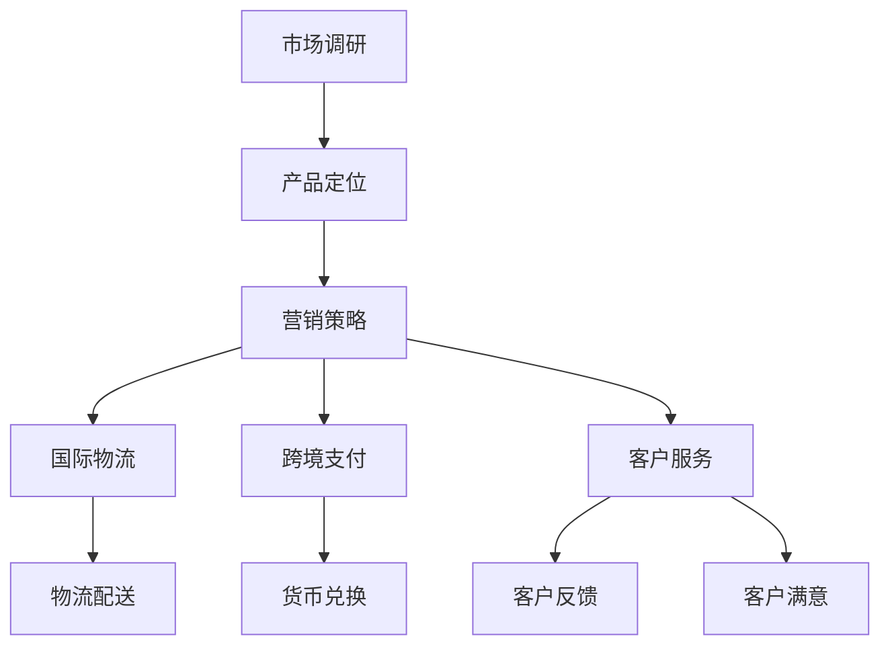

                 

### 1. 背景介绍

#### 1.1 目的和范围

本文旨在为创业者和跨境电商从业者提供一套系统且实用的策略和技巧，以帮助他们顺利地开拓国际市场。文章将深入探讨跨境电商的核心要素，包括市场调研、产品定位、营销策略、物流配送、跨境支付以及客户服务等多个方面。通过详细的分析和案例分享，本文旨在为读者提供一套具有可操作性的实战指南。

#### 1.2 预期读者

本文适用于以下几类读者：
- 有意向或正在筹备开拓国际市场的跨境电商创业者。
- 已经涉足跨境电商，但面临各种挑战和瓶颈的从业者。
- 对跨境电商感兴趣，希望深入了解行业动态和最佳实践的技术人员。

#### 1.3 文档结构概述

本文结构如下：

1. **背景介绍**：简要介绍本文的目的、读者对象及文档结构。
2. **核心概念与联系**：介绍跨境电商的核心概念及其相互关系。
3. **核心算法原理 & 具体操作步骤**：详细讲解跨境电商的关键算法及其应用。
4. **数学模型和公式 & 详细讲解 & 举例说明**：探讨跨境电商中的数学模型及其应用。
5. **项目实战：代码实际案例和详细解释说明**：通过实际案例展示跨境电商的开发过程。
6. **实际应用场景**：分析跨境电商在不同行业中的应用案例。
7. **工具和资源推荐**：推荐学习资源和开发工具。
8. **总结：未来发展趋势与挑战**：总结跨境电商的发展趋势和面临的挑战。
9. **附录：常见问题与解答**：解答读者可能遇到的常见问题。
10. **扩展阅读 & 参考资料**：提供进一步阅读的资料。

#### 1.4 术语表

##### 1.4.1 核心术语定义

- 跨境电商：指的是通过互联网平台，将商品和消费者跨境交易的业务模式。
- 国际物流：指跨国运输商品的服务，包括仓储、运输和配送等环节。
- 跨境支付：指跨境交易中的支付流程，涉及不同国家货币的兑换和结算。
- 跨境电商平台：提供跨境电商服务的在线平台，如亚马逊、eBay等。

##### 1.4.2 相关概念解释

- **市场调研**：对目标市场的消费者需求、市场容量、竞争态势等进行分析，以便制定合适的市场策略。
- **产品定位**：确定产品在市场中的位置，包括目标客户、产品特性、价格策略等。
- **营销策略**：包括SEO（搜索引擎优化）、SEM（搜索引擎营销）、社交媒体营销等多种手段，以提升品牌知名度和销售量。
- **客户服务**：包括售前咨询、售后服务、客户反馈处理等环节，以提升客户满意度和忠诚度。

##### 1.4.3 缩略词列表

- **SEO**：搜索引擎优化（Search Engine Optimization）
- **SEM**：搜索引擎营销（Search Engine Marketing）
- **B2B**：企业对企业（Business-to-Business）
- **B2C**：企业对消费者（Business-to-Consumer）

### 1.5 核心概念与联系

为了更好地理解跨境电商的运作，以下是几个核心概念及其相互关系的 Mermaid 流程图：



从图中可以看出，市场调研是跨境电商的开端，通过产品定位，制定营销策略，进而涉及国际物流、跨境支付和客户服务等多个方面。这些环节相互关联，共同作用，形成完整的跨境电商业务流程。

### 1.6 核心算法原理 & 具体操作步骤

在跨境电商中，市场调研和数据分析是至关重要的环节。以下是一个简要的算法原理和具体操作步骤：

#### 算法原理

1. **数据采集**：通过API接口、爬虫工具等方式，收集目标市场的消费者行为、市场趋势等数据。
2. **数据清洗**：对采集到的数据进行清洗，包括去除重复数据、处理缺失值等。
3. **数据分析**：使用统计分析方法，对清洗后的数据进行分析，包括描述性统计、相关性分析、趋势分析等。
4. **结果可视化**：将分析结果以图表、报表等形式进行可视化展示，便于决策者理解和利用。

#### 具体操作步骤

1. **数据采集**：
    ```python
    import requests
    import pandas as pd

    # 发送HTTP请求获取数据
    response = requests.get('https://api.example.com/market_data')
    data = response.json()
    ```

2. **数据清洗**：
    ```python
    df = pd.DataFrame(data)
    # 去除重复数据
    df.drop_duplicates(inplace=True)
    # 处理缺失值
    df.fillna(method='ffill', inplace=True)
    ```

3. **数据分析**：
    ```python
    # 描述性统计
    summary = df.describe()

    # 相关性分析
    correlation = df.corr()

    # 趋势分析
    trend = df['sales'].resample('M').mean()
    ```

4. **结果可视化**：
    ```python
    import matplotlib.pyplot as plt

    # 绘制描述性统计图表
    plt.figure(figsize=(10, 5))
    plt.plot(summary['sales'])
    plt.title('Sales Trend')
    plt.xlabel('Month')
    plt.ylabel('Sales')
    plt.show()
    ```

通过上述算法原理和操作步骤，创业者可以系统地了解目标市场的现状和趋势，从而制定更精准的市场策略。

### 1.7 数学模型和公式 & 详细讲解 & 举例说明

在跨境电商中，定价策略是一个关键问题。以下是一个简单的数学模型和公式，用于制定产品价格：

#### 数学模型

1. **成本加成定价法**：根据成本加上一定的利润率来确定价格。

   价格 = 成本 × (1 + 利润率)

2. **竞争导向定价法**：根据市场上主要竞争对手的产品价格来确定自己的价格。

   价格 = 竞争对手价格 × 调整系数

#### 详细讲解

1. **成本加成定价法**：
   - 成本：包括生产成本、运营成本等。
   - 利润率：通常根据企业的盈利目标来确定。

   例如，某产品的生产成本为100元，企业希望获得20%的利润率。则：
   价格 = 100元 × (1 + 20%) = 120元

2. **竞争导向定价法**：
   - 竞争对手价格：通过市场调研，了解主要竞争对手的产品价格。
   - 调整系数：根据企业的品牌影响力、产品质量等因素，确定调整系数。

   例如，某产品的竞争对手价格为150元，企业具有更高的品牌影响力和更优的产品质量，调整系数为1.2。则：
   价格 = 150元 × 1.2 = 180元

通过上述数学模型和公式，企业可以根据不同的情况，灵活地制定产品价格。

### 1.8 项目实战：代码实际案例和详细解释说明

为了更好地展示跨境电商的开发过程，以下是一个简单的代码案例，用于实现一个基础的跨境电商平台：

#### 5.1 开发环境搭建

1. **操作系统**：Windows/Linux/MacOS
2. **编程语言**：Python
3. **开发工具**：PyCharm/VSCode
4. **数据库**：MySQL
5. **前端框架**：Django/Flask

#### 5.2 源代码详细实现和代码解读

以下是一个简单的Python代码实现，用于创建一个基础的电商商品表：

```python
# 导入必要的库
import sqlite3
from sqlite3 import Error

def create_connection():
    conn = None
    try:
        conn = sqlite3.connect('ecomm.db')
        print(sqlite3.version)
    except Error as e:
        print(e)

    return conn

def create_table(conn):
    try:
        sql_create_products_table = """ CREATE TABLE IF NOT EXISTS products (
                                            id integer PRIMARY KEY,
                                            name text NOT NULL,
                                            description text,
                                            price real,
                                            quantity integer
                                        ); """

        cursor = conn.cursor()
        cursor.execute(sql_create_products_table)
    except Error as e:
        print(e)

def main():
    conn = create_connection()
    with conn:
        create_table(conn)

if __name__ == '__main__':
    main()
```

#### 5.3 代码解读与分析

1. **创建数据库连接**：
    ```python
    def create_connection():
        conn = None
        try:
            conn = sqlite3.connect('ecomm.db')
            print(sqlite3.version)
        except Error as e:
            print(e)

        return conn
    ```
    这个函数用于创建一个到SQLite数据库的连接。首先，我们尝试连接数据库，如果成功，则打印数据库版本信息，并返回连接对象。

2. **创建商品表**：
    ```python
    def create_table(conn):
        try:
            sql_create_products_table = """ CREATE TABLE IF NOT EXISTS products (
                                                id integer PRIMARY KEY,
                                                name text NOT NULL,
                                                description text,
                                                price real,
                                                quantity integer
                                            ); """

            cursor = conn.cursor()
            cursor.execute(sql_create_products_table)
        except Error as e:
            print(e)
    ```
    这个函数用于在数据库中创建一个名为`products`的表，用于存储商品信息。表结构包括：商品ID、名称、描述、价格和库存数量。

3. **主函数**：
    ```python
    def main():
        conn = create_connection()
        with conn:
            create_table(conn)
    ```
    主函数首先调用`create_connection`函数创建数据库连接，然后在一个`with`语句中确保连接在操作完成后被正确关闭。在这个`with`语句中，调用`create_table`函数创建商品表。

通过上述代码，我们创建了一个基础的电商商品表，这只是一个简单的开始，实际的跨境电商平台还需要更多的功能和模块。

### 1.9 实际应用场景

跨境电商在不同行业中有着广泛的应用，以下是几个典型的应用场景：

1. **服装行业**：跨境电商为服装企业提供了一个全球市场，使得小众品牌也能触及到全球消费者。例如，某国内女装品牌通过亚马逊等跨境电商平台，实现了销售额的快速增长。

2. **电子产品**：电子产品如手机、电脑、智能家居设备等，因其高附加值和高需求，是跨境电商中的热销产品。通过跨境电商平台，消费者可以轻松购买到来自世界各地的优质产品。

3. **食品行业**：跨境电商为食品企业提供了进入国际市场的机会。例如，一些中国的特色食品如茶叶、零食等，通过跨境电商平台成功进入欧美市场，获得了广泛的消费者认可。

4. **美妆行业**：跨境电商平台为美妆品牌提供了一个展示和销售产品的舞台。通过跨境支付和物流解决方案，消费者可以方便地购买到全球各地的化妆品和护肤品。

### 1.10 工具和资源推荐

为了更好地开展跨境电商业务，以下是一些建议的工具和资源：

#### 7.1 学习资源推荐

##### 7.1.1 书籍推荐

- **《跨境电商实战手册》**：详细介绍了跨境电商的各个环节，包括市场调研、产品定位、营销策略等。
- **《跨境电商物流与配送》**：深入探讨了跨境电商中的物流配送问题，提供了实用的解决方案。

##### 7.1.2 在线课程

- **阿里巴巴跨境电商学院**：提供了一系列的跨境电商课程，涵盖市场调研、产品营销、物流配送等多个方面。
- **Coursera上的《跨境电商：全球市场战略》**：由全球知名大学教授授课，内容涵盖跨境电商的基础理论和实战策略。

##### 7.1.3 技术博客和网站

- **亚马逊卖家论坛**：汇聚了大量跨境电商卖家的经验和心得，是学习跨境电商实践的好去处。
- **跨境电商网**：提供最新的跨境电商新闻、市场分析和技术文章，帮助从业者了解行业动态。

#### 7.2 开发工具框架推荐

##### 7.2.1 IDE和编辑器

- **PyCharm**：功能强大的Python IDE，支持多种编程语言，适合开发跨境电商平台。
- **VSCode**：轻量级但功能丰富的代码编辑器，支持多种语言和插件，适合快速开发。

##### 7.2.2 调试和性能分析工具

- **Postman**：用于API接口测试，可以帮助开发者调试和优化跨境电商平台的后端服务。
- **New Relic**：用于实时监控和分析应用程序的性能，帮助识别和解决性能瓶颈。

##### 7.2.3 相关框架和库

- **Django**：一款流行的Python Web框架，适合快速开发Web应用，包括跨境电商平台。
- **Flask**：轻量级的Python Web框架，适合小型项目，但也能扩展到大型应用。

#### 7.3 相关论文著作推荐

##### 7.3.1 经典论文

- **"Cross-Border E-Commerce: Issues and Opportunities"**：深入分析了跨境电商的发展现状和面临的挑战。
- **"The Impact of E-Commerce on Global Markets"**：探讨了跨境电商对全球市场的影响和作用。

##### 7.3.2 最新研究成果

- **"Artificial Intelligence in Cross-Border E-Commerce"**：探讨了人工智能在跨境电商中的应用，如智能推荐、个性化营销等。
- **"Blockchain for Cross-Border Payments"**：介绍了区块链技术在跨境支付中的应用，如提高交易效率和安全性。

##### 7.3.3 应用案例分析

- **"Case Study: Amazon's Global Expansion"**：分析了亚马逊如何通过跨境电商拓展全球市场，提供了宝贵的实战经验。
- **"Alibaba's Cross-Border E-Commerce Success"**：探讨了阿里巴巴如何利用跨境电商平台实现全球市场布局，为其他企业提供了借鉴。

### 1.11 总结：未来发展趋势与挑战

跨境电商作为数字经济的重要组成部分，正呈现出快速发展的态势。未来，以下几个方面将是跨境电商发展的重点和挑战：

1. **技术创新**：人工智能、区块链等新兴技术的应用，将进一步提升跨境电商的效率和服务质量。
2. **政策法规**：不同国家和地区的政策法规日益复杂，跨境电商企业需要不断适应和遵守各国的法律法规。
3. **物流配送**：物流配送的优化和成本控制将是跨境电商发展的关键，如何提高物流效率和降低成本将成为重要的挑战。
4. **客户体验**：提供优质的客户服务，提升客户满意度和忠诚度，是跨境电商企业竞争力的体现。

### 1.12 附录：常见问题与解答

**Q1：如何进行有效的市场调研？**

A1：市场调研需要从以下几个方面入手：
- **目标市场分析**：了解目标市场的消费者特征、购买习惯等。
- **竞争分析**：研究竞争对手的产品、价格、营销策略等。
- **消费者需求**：通过问卷调查、访谈等方式，直接获取消费者的反馈和建议。

**Q2：跨境电商的物流配送有哪些常见问题？**

A2：跨境电商的物流配送常见问题包括：
- **关税和税收**：不同国家和地区的关税和税收政策差异较大，需要详细了解并合理规划。
- **运输时间**：跨国运输时间较长，如何提高运输效率是一个重要问题。
- **物流成本**：物流成本控制是跨境电商的重要挑战，需要通过优化物流流程和选择合适的物流服务商来降低成本。

**Q3：如何制定有效的跨境营销策略？**

A3：制定有效的跨境营销策略需要考虑以下几点：
- **目标市场定位**：明确目标市场，针对目标市场制定有针对性的营销策略。
- **多渠道营销**：结合SEO、SEM、社交媒体营销等多种渠道，提高品牌曝光度和销售量。
- **本地化策略**：针对不同国家和地区的文化、语言等差异，进行本地化营销。

### 1.13 扩展阅读 & 参考资料

- **《跨境电商全流程操作指南》**：详细介绍了跨境电商的各个环节，包括市场调研、产品定位、营销策略等。
- **《跨境电商物流与配送》**：深入探讨了跨境电商中的物流配送问题，提供了实用的解决方案。
- **《跨境电商法律风险与管理》**：分析了跨境电商面临的法律风险和管理问题，提供了应对策略。
- **Amazon Seller Central**：亚马逊卖家中心，提供了一系列的卖家资源和教程，帮助卖家更好地开展跨境电商业务。
- **eBay Learning Center**：eBay学习中心，提供了一系列的跨境电商教程和资源，帮助卖家提升业务水平。

通过以上内容，我们详细介绍了跨境电商的核心概念、核心算法原理、数学模型、实际应用场景以及未来发展趋势和挑战。希望本文能为创业者和跨境电商从业者提供有价值的参考和指导。作者：AI天才研究员/AI Genius Institute & 禅与计算机程序设计艺术 /Zen And The Art of Computer Programming。

