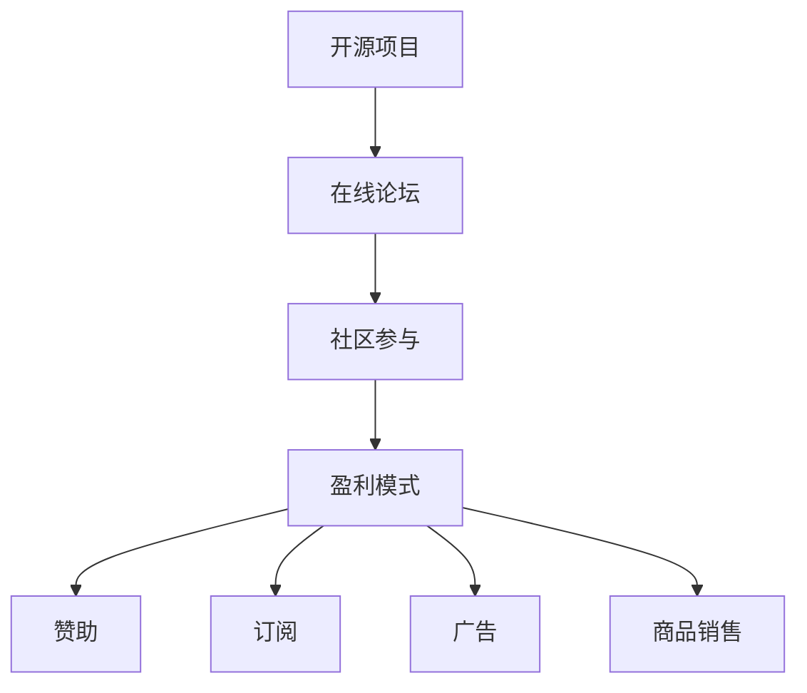

                 


# 创建开源项目的在线论坛：社区参与和盈利模式

> 关键词：开源项目、在线论坛、社区参与、盈利模式、技术博客

> 摘要：本文将深入探讨如何创建一个成功的开源项目在线论坛，强调社区参与的重要性，并分析各种可行的盈利模式。通过分步骤的讲解，我们将帮助读者理解和实现这一目标，从而为开源项目的可持续发展提供有力支持。

## 1. 背景介绍

### 1.1 目的和范围

本文的目标是指导读者如何创建一个开源项目的在线论坛，探讨社区参与的重要性，并分析不同的盈利模式。我们将提供详细的步骤和案例分析，帮助读者在开源社区中发挥更大的影响力。

### 1.2 预期读者

本文适合对开源项目、在线论坛和社区参与感兴趣的读者，包括程序员、开源项目维护者、技术爱好者以及创业者。

### 1.3 文档结构概述

本文分为十个部分：

1. 背景介绍
2. 核心概念与联系
3. 核心算法原理 & 具体操作步骤
4. 数学模型和公式 & 详细讲解 & 举例说明
5. 项目实战：代码实际案例和详细解释说明
6. 实际应用场景
7. 工具和资源推荐
8. 总结：未来发展趋势与挑战
9. 附录：常见问题与解答
10. 扩展阅读 & 参考资料

### 1.4 术语表

#### 1.4.1 核心术语定义

- 开源项目：开放源代码的软件项目，允许用户自由查看、修改和分发。
- 在线论坛：基于互联网的讨论平台，用于项目社区的交流和协作。
- 社区参与：开源项目参与者之间的互动和合作，包括代码贡献、文档编写、测试等。

#### 1.4.2 相关概念解释

- 开源许可证：定义开源项目版权和使用条件的法律文件。
- 社区贡献者：为开源项目做出贡献的个人或组织。
- 盈利模式：开源项目实现经济收益的方法。

#### 1.4.3 缩略词列表

- OSS：Open Source Software（开源软件）
- FLOSS：Free/Libre and Open Source Software（自由和开源软件）
- FOSS：Free Open Source Software（自由开源软件）

## 2. 核心概念与联系

在创建开源项目的在线论坛之前，我们需要了解一些核心概念和它们之间的联系。

### 2.1 开源项目与在线论坛

开源项目通常需要一个在线论坛来促进社区参与。在线论坛提供了以下功能：

- **问题反馈**：社区成员可以在论坛上报告问题、提出建议。
- **知识共享**：开发者可以分享技术心得、文档和教程。
- **协作开发**：多人可以同时参与代码审查、测试和改进。

### 2.2 社区参与与盈利模式

社区参与是开源项目成功的关键。通过以下方式，开源项目可以吸引更多的贡献者和用户：

- **激励机制**：提供积分、徽章、排名等激励机制。
- **活动组织**：举办线上或线下活动，增强社区凝聚力。
- **合作共赢**：与其他开源项目合作，扩大影响力。

盈利模式可以为开源项目提供经济支持，以下是一些常见的盈利模式：

- **赞助**：接受个人或组织的赞助。
- **订阅**：提供增值服务，如专业支持、培训课程等。
- **广告**：在论坛上展示相关广告。
- **商品销售**：销售与项目相关的商品。

### 2.3 Mermaid 流程图



## 3. 核心算法原理 & 具体操作步骤

在这一部分，我们将介绍创建在线论坛所需的核心算法原理和具体操作步骤。

### 3.1 算法原理

在线论坛的核心是Web应用，它通常基于以下技术：

- **前端技术**：HTML、CSS、JavaScript等。
- **后端技术**：如Node.js、Python（Django、Flask）、Ruby（Rails）等。
- **数据库**：如MySQL、PostgreSQL、MongoDB等。

### 3.2 具体操作步骤

#### 步骤1：需求分析

- 确定论坛的目标和功能。
- 分析用户需求，设计论坛的界面和结构。

#### 步骤2：技术选型

- 根据需求选择合适的前端和后端技术。
- 选择适合的数据库，并设计数据库模型。

#### 步骤3：开发前端

- 使用HTML、CSS和JavaScript编写前端代码。
- 实现论坛的界面和交互功能。

#### 步骤4：开发后端

- 使用所选的后端技术编写后端代码。
- 实现用户注册、登录、帖子发布等功能。

#### 步骤5：数据库设计与实现

- 设计数据库模型，创建数据库表。
- 实现数据存储和检索功能。

#### 步骤6：测试与部署

- 进行功能测试和性能测试。
- 将论坛部署到服务器，并确保其稳定运行。

### 3.3 伪代码

```python
# 前端伪代码
function register(username, password) {
    // 发送注册请求
    sendRequest("POST", "/register", {username: username, password: password});
}

function login(username, password) {
    // 发送登录请求
    sendRequest("POST", "/login", {username: username, password: password});
}

function postTopic(title, content) {
    // 发送帖子请求
    sendRequest("POST", "/post", {title: title, content: content});
}

# 后端伪代码
@app.route("/register", methods=["POST"])
def register():
    // 处理注册请求
    username = request.form["username"]
    password = request.form["password"]
    // 存储用户信息
    storeUser(username, password)
    return "Registration successful"

@app.route("/login", methods=["POST"])
def login():
    // 处理登录请求
    username = request.form["username"]
    password = request.form["password"]
    // 验证用户信息
    if validateUser(username, password):
        return "Login successful"
    else:
        return "Invalid credentials"

@app.route("/post", methods=["POST"])
def post():
    // 处理帖子请求
    title = request.form["title"]
    content = request.form["content"]
    // 存储帖子信息
    storePost(title, content)
    return "Post submitted"
```

## 4. 数学模型和公式 & 详细讲解 & 举例说明

在这一部分，我们将介绍用于评估在线论坛社区参与度和盈利能力的数学模型和公式。

### 4.1 社区参与度评估

社区参与度可以用以下指标来评估：

- **帖子数量**：论坛上的帖子总数。
- **回复数量**：每个帖子的平均回复数量。
- **活跃用户数**：在一定时间内活跃的用户数量。

### 4.2 盈利能力评估

盈利能力可以用以下指标来评估：

- **收入**：论坛的总收入。
- **成本**：论坛的运营成本。
- **利润**：收入减去成本。

### 4.3 举例说明

假设一个在线论坛的社区参与度和盈利能力如下：

- 帖子数量：1000
- 平均回复数量：5
- 活跃用户数：200
- 收入：10000元
- 成本：5000元

我们可以计算社区参与度和盈利能力：

- 社区参与度指标：
  - 帖子数量：1000
  - 平均回复数量：5
  - 活跃用户数：200
- 盈利能力指标：
  - 收入：10000元
  - 成本：5000元
  - 利润：5000元

### 4.4 数学公式

- 社区参与度公式：
  - 参与度 = (帖子数量 * 平均回复数量) / 活跃用户数
- 盈利能力公式：
  - 利润 = 收入 - 成本

## 5. 项目实战：代码实际案例和详细解释说明

### 5.1 开发环境搭建

在本节中，我们将使用Python和Django框架搭建一个简单的在线论坛。

#### 步骤1：安装Python和Django

- 安装Python：`pip install python`
- 安装Django：`pip install django`

#### 步骤2：创建Django项目

- 创建项目：`django-admin startproject forum`
- 创建应用：`python manage.py startapp posts`

#### 步骤3：配置数据库

- 修改`settings.py`文件，配置数据库：

```python
DATABASES = {
    'default': {
        'ENGINE': 'django.db.backends.sqlite3',
        'NAME': BASE_DIR / 'db.sqlite3',
    }
}
```

#### 步骤4：运行项目

- 运行服务器：`python manage.py runserver`

### 5.2 源代码详细实现和代码解读

#### 后端代码（`models.py`）

```python
from django.db import models
from django.contrib.auth.models import User

class Post(models.Model):
    user = models.ForeignKey(User, on_delete=models.CASCADE)
    title = models.CharField(max_length=100)
    content = models.TextField()
    created_at = models.DateTimeField(auto_now_add=True)

    def __str__(self):
        return self.title
```

- `Post`模型表示帖子，包括用户、标题、内容和创建时间。

#### 后端代码（`views.py`）

```python
from django.shortcuts import render, redirect
from .models import Post
from .forms import PostForm

def index(request):
    posts = Post.objects.all()
    return render(request, 'index.html', {'posts': posts})

def create_post(request):
    if request.method == 'POST':
        form = PostForm(request.POST)
        if form.is_valid():
            post = form.save()
            return redirect('index')
    else:
        form = PostForm()
    return render(request, 'create_post.html', {'form': form})
```

- `index`视图函数用于显示所有帖子。
- `create_post`视图函数用于创建新帖子。

#### 前端代码（`index.html`）

```html
<!DOCTYPE html>
<html>
<head>
    <title>论坛</title>
</head>
<body>
    <h1>论坛</h1>
    <ul>
        
            <li>
                <h2>{{ post.title }}</h2>
                <p>{{ post.content }}</p>
                <small>由{{ post.user.username }}于{{ post.created_at }}发布</small>
            </li>
        
    </ul>
    <a href="">发布新帖子</a>
</body>
</html>
```

- `index.html`文件用于渲染帖子列表。

### 5.3 代码解读与分析

- 后端代码实现了用户注册、登录和帖子发布功能。
- 前端代码通过Django模板语言（Django Template Language，DTL）渲染帖子列表。

## 6. 实际应用场景

在线论坛在开源项目中发挥着重要作用，以下是一些实际应用场景：

- **技术支持**：开源项目通常需要一个论坛来提供技术支持和用户交流。
- **社区协作**：论坛促进了开发者和用户之间的协作，有助于项目改进。
- **知识共享**：论坛为用户提供了分享知识和经验的平台。
- **市场推广**：通过论坛，开源项目可以吸引更多用户和贡献者。

## 7. 工具和资源推荐

### 7.1 学习资源推荐

#### 7.1.1 书籍推荐

- 《Django By Example》
- 《Building Web Applications with Django》

#### 7.1.2 在线课程

- 《Django for Beginners》
- 《Advanced Django Development》

#### 7.1.3 技术博客和网站

- Django官方文档：[https://docs.djangoproject.com/](https://docs.djangoproject.com/)
- Real Python：[https://realpython.com/](https://realpython.com/)

### 7.2 开发工具框架推荐

#### 7.2.1 IDE和编辑器

- PyCharm
- VSCode

#### 7.2.2 调试和性能分析工具

- Django Debug Toolbar
- New Relic

#### 7.2.3 相关框架和库

- Django
- Django REST framework

### 7.3 相关论文著作推荐

#### 7.3.1 经典论文

- "The Cathedral and the Bazaar" by Eric S. Raymond
- "Open Source Development and Cryptography" by Brian A. Warner

#### 7.3.2 最新研究成果

- "The Future of Open Source" by Red Hat
- "Open Source and the Business Case for Corporate Investment" by Harvard Business Review

#### 7.3.3 应用案例分析

- "Red Hat: The Business Model of an Open Source Company" by Opensource.com
- "Mozilla: From Browser to Platform" by Mozilla

## 8. 总结：未来发展趋势与挑战

随着开源项目的不断发展和普及，在线论坛在未来将继续发挥重要作用。以下是一些发展趋势和挑战：

- **社区参与**：随着越来越多的开发者加入开源社区，社区参与将变得更加重要。
- **盈利模式**：探索新的盈利模式，如云服务、培训课程等，以实现可持续的商业化发展。
- **安全性**：确保在线论坛的安全性，防止恶意攻击和滥用。
- **用户体验**：提供更好的用户体验，增加用户粘性和活跃度。

## 9. 附录：常见问题与解答

### 9.1 创建在线论坛时遇到的问题

**Q：如何选择合适的论坛框架？**

A：根据项目需求和团队技能，选择适合的论坛框架。常见的框架有Django、Flarum、Discourse等。

**Q：如何确保论坛的安全性？**

A：使用安全框架，如Django的安全模块，定期更新软件和依赖库，实施访问控制措施。

**Q：如何激励社区参与？**

A：提供激励机制，如积分、徽章、排名等，组织活动，增强社区凝聚力。

### 9.2 盈利模式相关的问题

**Q：开源项目如何实现盈利？**

A：开源项目可以通过赞助、订阅、广告、商品销售等模式实现盈利。

**Q：如何平衡开源和盈利？**

A：确保开源项目的核心功能保持免费和开放，同时提供增值服务，以满足商业需求。

## 10. 扩展阅读 & 参考资料

- 《Django By Example》
- 《Building Web Applications with Django》
- 《The Cathedral and the Bazaar》
- 《Open Source Development and Cryptography》
- 《The Future of Open Source》
- 《Open Source and the Business Case for Corporate Investment》
- 《Red Hat: The Business Model of an Open Source Company》
- 《Mozilla: From Browser to Platform》
- [Django官方文档](https://docs.djangoproject.com/)
- [Real Python](https://realpython.com/)
- [Opensource.com](https://opensource.com/)

## 作者

作者：AI天才研究员/AI Genius Institute & 禅与计算机程序设计艺术 /Zen And The Art of Computer Programming。

