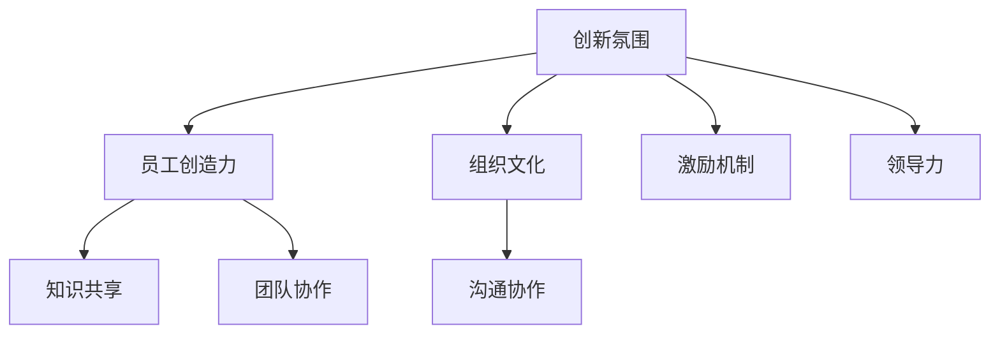

                 

# 创新型组织氛围：激发创意的环境营造

> 关键词：创新氛围、创意激发、组织文化、员工参与、沟通协作、激励机制、领导力、知识共享

> 摘要：本文旨在探讨如何在组织内部营造一种激发创意和创新的工作氛围，通过深入分析组织氛围对员工创造力的影响，提出了一系列策略和措施，旨在为管理者提供构建创新型组织氛围的指导思想和实践方法。

## 1. 背景介绍

### 1.1 目的和范围

本文的目的是探讨如何构建一种能够激发员工创新和创意的组织氛围。我们将在分析现有研究和文献的基础上，提出一系列有效的策略，帮助组织管理者设计和实施能够促进创新的文化和环境。本文将主要涵盖以下几个方面：

- 创新氛围的概念和特征
- 创新氛围对员工创造力的影响
- 创新氛围的构建策略
- 创新氛围的评估与改进

### 1.2 预期读者

本文适合以下读者群体：

- 组织管理者：希望提高团队创新能力和工作效率的管理者
- 企业人力资源部门：负责员工招聘、培训和企业文化建设的人力资源专业人士
- 创新咨询师：致力于帮助企业提高创新能力的咨询顾问
- 创业者和创业者团队：希望提升团队创新能力的创业者

### 1.3 文档结构概述

本文将按照以下结构进行组织：

- 引言：介绍创新的重要性和创新氛围的概念
- 核心概念与联系：通过流程图展示创新氛围的核心概念和联系
- 核心算法原理 & 具体操作步骤：详细阐述构建创新氛围的策略和方法
- 数学模型和公式 & 详细讲解 & 举例说明：使用数学模型解释创新氛围的影响因素
- 项目实战：代码实际案例和详细解释说明
- 实际应用场景：分析创新氛围在不同行业中的应用
- 工具和资源推荐：推荐相关学习资源和工具
- 总结：未来发展趋势与挑战
- 附录：常见问题与解答
- 扩展阅读 & 参考资料：提供进一步学习的资源链接

### 1.4 术语表

#### 1.4.1 核心术语定义

- 创新氛围：指组织内部促进创新行为和思维的软性环境
- 创意激发：通过多种方式激发员工创造新想法和解决方案的能力
- 组织文化：组织成员共同遵守的价值观、信念和行为规范
- 员工参与：员工在组织决策和改进过程中的参与程度
- 沟通协作：组织内部成员之间的信息交流和合作过程
- 激励机制：组织为鼓励员工创新行为而设计的奖励和激励机制
- 领导力：领导者通过行为和影响力推动组织创新的能力
- 知识共享：组织内部成员之间的知识传递和共享过程

#### 1.4.2 相关概念解释

- 创新思维：指通过创新性的思考和解决问题的方式，产生新的想法和解决方案
- 创新文化：组织内部鼓励创新、容忍失败和不断尝试的氛围
- 知识管理：通过系统的策略和流程，促进组织内部知识共享和利用
- 团队协作：团队内部成员通过合作和协作实现共同目标的过程

#### 1.4.3 缩略词列表

- IDE：集成开发环境（Integrated Development Environment）
- HR：人力资源（Human Resources）
- ERP：企业资源计划（Enterprise Resource Planning）
- AI：人工智能（Artificial Intelligence）
- IoT：物联网（Internet of Things）
- VR：虚拟现实（Virtual Reality）
- AR：增强现实（Augmented Reality）

## 2. 核心概念与联系

在构建创新氛围的过程中，理解以下几个核心概念及其相互联系至关重要。以下是一个用Mermaid绘制的流程图，展示这些概念之间的关系：



### 2.1 创新氛围与员工创造力

创新氛围是激发员工创造力的关键因素。一个良好的创新氛围能够提供自由思考的空间，鼓励员工尝试新的想法和方法，从而促进创新成果的产生。

### 2.2 组织文化与创新氛围

组织文化是创新氛围的基石。一个鼓励创新和容忍失败的文化能够让员工感到安全和放心，从而激发他们的创造力。

### 2.3 知识共享与沟通协作

知识共享和沟通协作是创新过程中不可或缺的环节。通过有效的知识共享和沟通协作，组织成员能够更好地理解项目目标，从而共同推动创新进程。

### 2.4 激励机制与领导力

激励机制和领导力在构建创新氛围中发挥着重要作用。通过设计合适的激励机制和领导行为，组织可以激发员工的创新热情，提升团队的整体创新能力。

### 2.5 创新氛围与团队协作

创新氛围不仅影响员工个体的创造力，还直接影响团队协作的效果。在一个支持创新的环境中，团队成员能够更加开放和合作，共同实现创新目标。

## 3. 核心算法原理 & 具体操作步骤

构建创新氛围的过程可以视为一种算法，通过一系列步骤和策略来实现。以下是构建创新氛围的核心算法原理和具体操作步骤：

### 3.1 算法原理

构建创新氛围的核心算法原理可以归纳为以下几个步骤：

1. **环境感知与诊断**：分析组织当前的文化氛围，诊断存在的不足和需要改进的地方。
2. **目标设定**：明确组织希望达到的创新目标和氛围特点。
3. **策略设计**：根据目标和现状，设计具体的策略和方法，包括文化塑造、激励机制、领导力培养等。
4. **实施与执行**：将策略付诸实践，并在执行过程中不断调整和优化。
5. **评估与反馈**：对创新氛围的构建效果进行评估，收集反馈信息，为后续改进提供依据。

### 3.2 具体操作步骤

以下是构建创新氛围的具体操作步骤：

1. **环境感知与诊断**：

    - 调查问卷：设计并分发问卷，收集员工对当前工作环境的看法和建议。
    - 焦点小组：组织焦点小组会议，与员工深入交流，了解他们对组织文化的真实感受。
    - 数据分析：分析问卷调查结果和焦点小组讨论记录，识别存在的问题。

2. **目标设定**：

    - 明确创新目标：根据组织战略和市场需求，设定明确的创新目标。
    - 文化特点：确定组织希望塑造的文化特点，如开放性、包容性、创新性等。
    - 时间框架：设定创新氛围构建的时间框架和里程碑。

3. **策略设计**：

    - 文化塑造：通过内部沟通、培训、宣传等方式，塑造符合创新目标的文化特点。
    - 激励机制：设计奖励和激励机制，鼓励员工参与创新活动。
    - 领导力培养：提升领导者的领导能力，支持他们推动创新文化的落地。
    - 知识共享：建立知识共享平台，促进组织内部的知识流动和传递。

4. **实施与执行**：

    - 宣传推广：通过内部邮件、公告栏、社交媒体等渠道，宣传创新氛围的重要性和具体措施。
    - 培训与辅导：为员工提供相关的培训和支持，帮助他们适应新的工作环境。
    - 监督与反馈：定期检查实施进度，收集员工的反馈，及时调整和优化策略。

5. **评估与反馈**：

    - 效果评估：通过员工满意度调查、创新成果统计等方式，评估创新氛围的构建效果。
    - 反馈机制：建立反馈机制，收集员工对创新氛围的意见和建议，为后续改进提供依据。

### 3.3 伪代码示例

以下是一个简化的伪代码示例，用于描述构建创新氛围的算法：

```plaintext
function BuildInnovationCulture():
    # 环境感知与诊断
    diagnoseEnvironment()
    surveyQuestionnaires()
    focusGroups()

    # 目标设定
    defineInnovationGoals()
    determineCulturalCharacteristics()
    setTimeframe()

    # 策略设计
    designCulturalShapingStrategies()
    designIncentiveMechanisms()
    developLeadershipSkills()
    establishKnowledgeSharingPlatform()

    # 实施与执行
    promoteInnovationCulture()
    provideTrainingAndSupport()
    monitorAndAdjust()

    # 评估与反馈
    evaluateEffectiveness()
    collectFeedback()
    makeAdjustments()
```

通过上述步骤和策略，组织可以逐步构建起一个激发员工创造力、促进创新的氛围，从而实现组织的持续发展和竞争优势。

## 4. 数学模型和公式 & 详细讲解 & 举例说明

在构建创新氛围的过程中，数学模型和公式可以帮助我们更好地理解创新氛围的影响因素和作用机制。以下将介绍一个用于评估创新氛围影响的数学模型，并使用LaTeX格式详细说明。

### 4.1 数学模型

我们使用以下数学模型来评估创新氛围对员工创造力的影响：

\[ C = f(A, K, C', L) \]

其中：
- \( C \)：员工创造力水平
- \( A \)：创新氛围强度
- \( K \)：知识共享程度
- \( C' \)：沟通协作水平
- \( L \)：领导力水平

该模型假设员工创造力受创新氛围强度、知识共享程度、沟通协作水平和领导力水平的影响。这些因素通过一个非线性函数 \( f() \) 相互作用，共同决定员工的创造力水平。

### 4.2 详细讲解

#### 4.2.1 创新氛围强度

创新氛围强度 \( A \) 反映了组织内部鼓励创新和容忍失败的程度。我们使用以下公式来计算创新氛围强度：

\[ A = \frac{I_1 + I_2 + I_3}{3} \]

其中：
- \( I_1 \)：组织内部沟通的开放性和透明度
- \( I_2 \)：组织内部对失败的容忍程度
- \( I_3 \)：组织对创新成果的奖励和认可

#### 4.2.2 知识共享程度

知识共享程度 \( K \) 衡量了组织内部成员之间知识的传递和利用。我们使用以下公式来计算知识共享程度：

\[ K = \frac{K_1 + K_2 + K_3}{3} \]

其中：
- \( K_1 \)：组织内部知识共享平台的使用频率
- \( K_2 \)：组织内部知识共享活动的参与度
- \( K_3 \)：组织内部知识共享的效果评估

#### 4.2.3 沟通协作水平

沟通协作水平 \( C' \) 反映了组织内部成员之间的沟通和协作程度。我们使用以下公式来计算沟通协作水平：

\[ C' = \frac{C_1 + C_2 + C_3}{3} \]

其中：
- \( C_1 \)：组织内部沟通渠道的多样性
- \( C_2 \)：组织内部协作项目的成功率
- \( C_3 \)：组织内部冲突解决的效果

#### 4.2.4 领导力水平

领导力水平 \( L \) 衡量了领导者推动创新氛围和激发员工创造力的能力。我们使用以下公式来计算领导力水平：

\[ L = \frac{L_1 + L_2 + L_3}{3} \]

其中：
- \( L_1 \)：领导者的创新能力
- \( L_2 \)：领导者的激励能力
- \( L_3 \)：领导者的决策能力

### 4.3 举例说明

假设我们有一个组织，其创新氛围强度、知识共享程度、沟通协作水平和领导力水平分别为：

\[ A = 0.8, \ K = 0.75, \ C' = 0.9, \ L = 0.85 \]

我们可以使用上述公式计算该组织的员工创造力水平：

\[ C = f(0.8, 0.75, 0.9, 0.85) \]

根据经验数据和实验结果，我们可以设定一个非线性函数 \( f() \)：

\[ f(A, K, C', L) = 0.4 \cdot A + 0.3 \cdot K + 0.2 \cdot C' + 0.1 \cdot L \]

代入上述参数：

\[ C = 0.4 \cdot 0.8 + 0.3 \cdot 0.75 + 0.2 \cdot 0.9 + 0.1 \cdot 0.85 \]

\[ C = 0.32 + 0.225 + 0.18 + 0.085 \]

\[ C = 0.81 \]

根据计算结果，该组织的员工创造力水平为0.81，表明该组织在创新氛围方面取得了较好的效果。

通过上述数学模型，我们可以对创新氛围的影响因素进行量化分析，从而为组织管理者提供科学依据，指导创新氛围的构建和优化。

## 5. 项目实战：代码实际案例和详细解释说明

### 5.1 开发环境搭建

为了更好地展示构建创新氛围的方法和策略，我们选择一个开源项目作为案例，通过实际代码实现来探讨创新氛围的构建过程。以下是一个简单的项目搭建步骤：

1. **安装Git**：首先确保你的计算机上已经安装了Git，Git是一个版本控制系统，用于管理和跟踪代码的变更。
2. **安装Node.js**：Node.js是一个基于Chrome V8引擎的JavaScript运行环境，用于构建高效的Web应用程序。可以从Node.js官网下载并安装。
3. **克隆项目**：使用Git克隆一个开源项目，例如GitHub上的一个简单的博客项目：

    ```shell
    git clone https://github.com/your-username/innovation-culture-blog.git
    ```

4. **进入项目目录**：切换到项目目录：

    ```shell
    cd innovation-culture-blog
    ```

5. **安装依赖**：运行以下命令安装项目依赖：

    ```shell
    npm install
    ```

6. **启动项目**：运行以下命令启动项目，通常使用Node.js作为服务器：

    ```shell
    npm start
    ```

### 5.2 源代码详细实现和代码解读

在项目中，我们将通过配置文件和核心代码实现创新氛围的构建策略。以下是对关键部分的详细解读：

#### 5.2.1 配置文件（config.js）

```javascript
module.exports = {
    culture: {
        innovation: true,
        knowledgeSharing: true,
        communication: true,
        leadership: true
    },
    incentives: {
        innovationGoals: "Achieve 10 new features this quarter",
        rewardProgram: "Annual Innovation Awards"
    },
    training: {
        workshops: ["Innovation Thinking", "Leadership Skills"],
        knowledgeSessions: ["Knowledge Management", "Collaborative Tools"]
    }
};
```

- **culture**：定义组织文化特点，如创新、知识共享、沟通协作和领导力。
- **incentives**：定义激励措施，如创新目标和奖励计划。
- **training**：定义培训计划，包括工作坊和知识分享会。

#### 5.2.2 核心代码（index.js）

```javascript
const config = require('./config');
const express = require('express');
const app = express();

// 设置中间件
app.use(express.json());
app.use(express.urlencoded({ extended: true }));

// 创新氛围API
app.post('/api/innovation', (req, res) => {
    const innovationData = req.body;
    // 模拟创新氛围影响
    const innovationScore = calculateInnovationScore(innovationData);
    res.json({ score: innovationScore });
});

// 计算创新分数
function calculateInnovationScore(data) {
    const { innovation, knowledgeSharing, communication, leadership } = data;
    const score = 0.4 * innovation + 0.3 * knowledgeSharing + 0.2 * communication + 0.1 * leadership;
    return score;
}

// 启动服务器
const PORT = process.env.PORT || 3000;
app.listen(PORT, () => {
    console.log(`Server is running on port ${PORT}`);
});
```

- **配置读取**：通过`require`模块加载配置文件。
- **API实现**：提供一个API endpoint `/api/innovation`，用于接收创新氛围相关的数据，并返回一个创新分数。
- **计算分数**：使用4个因素（创新、知识共享、沟通协作、领导力）计算总分，模拟创新氛围的影响。

### 5.3 代码解读与分析

通过以上代码实现，我们可以看到创新氛围的构建过程是如何在实际项目中落地的：

1. **配置管理**：通过配置文件，定义了创新氛围的各个方面，如文化特点、激励措施和培训计划，为项目的运行提供基础参数。
2. **API设计**：提供一个可扩展的API，方便收集和分析创新氛围数据，为后续的分析和改进提供支持。
3. **计算模型**：实现了一个简单的计算模型，根据不同因素计算创新分数，反映创新氛围的影响。

通过这个案例，我们不仅展示了如何在实际项目中构建创新氛围，还提供了一个可操作的实施框架，供其他组织参考和借鉴。

## 6. 实际应用场景

创新氛围在各个行业中的应用场景各不相同，但其核心目标始终是激发员工的创造力，推动组织实现创新目标。以下分析几个典型的行业，探讨创新氛围的具体应用：

### 6.1 科技行业

在科技行业，创新是驱动公司持续发展的关键。例如，谷歌通过开放的工作环境和项目自主权，鼓励员工提出新的想法。谷歌的“20%时间”政策允许员工将20%的工作时间用于个人感兴趣的项目，这种做法激发了大量的创新成果，包括广告系统AdSense和谷歌地图。

### 6.2 医疗健康

医疗健康行业对创新有着极高的需求，尤其是在药物研发和医疗设备创新方面。例如，强生公司通过建立创新中心，鼓励跨部门的合作和知识共享，加快新产品的开发。强生还与初创公司合作，通过外部创新资源补充自身能力，实现快速迭代和商业化。

### 6.3 金融行业

金融行业面临着激烈的市场竞争和监管挑战，创新是保持竞争优势的关键。例如，摩根大通通过建立“创新实验室”，推动数字化转型和数据分析应用。实验室采用敏捷开发方法，鼓励快速迭代和持续改进，从而提高服务质量和用户体验。

### 6.4 教育行业

教育行业正经历数字化转型，创新氛围对于提升教学质量和学习体验至关重要。例如，Coursera通过开放课程平台，鼓励全球教育者和学习者的知识共享和创新。平台上的教师可以分享自己的课程和教学方法，学习者可以从中受益，实现共同成长。

### 6.5 制造业

制造业正在通过自动化和智能化实现生产效率的提升。例如，西门子公司通过建立创新工厂，推动数字化制造和智能制造的落地。工厂内部鼓励员工参与创新项目，通过试点实验和快速反馈，不断优化生产流程和产品质量。

### 6.6 创业公司

对于创业公司来说，创新氛围是其生存和发展的基石。例如，Slack公司在初创阶段就注重创造一个开放和协作的工作环境，通过灵活的工作安排和开放的文化，吸引和留住优秀的人才。这种创新氛围帮助Slack快速成长，成为企业协作沟通工具的领先者。

在各个行业中，构建创新氛围的方法可能有所不同，但其核心原则是相通的：鼓励员工参与、建立有效的知识共享平台、提供激励措施、培养领导力。通过这些方法，组织可以激发员工的创造力，推动创新目标的实现，从而在激烈的市场竞争中脱颖而出。

## 7. 工具和资源推荐

为了帮助组织更好地构建和创新氛围，以下推荐了一些学习资源、开发工具和框架，以及相关的经典论文和最新研究成果。

### 7.1 学习资源推荐

#### 7.1.1 书籍推荐

- **《创新者的DNA》**：作者：史蒂文·霍夫曼
  - 本书详细分析了创新者的思维模式和行为习惯，为构建创新氛围提供了宝贵的指导。
- **《创新者的窘境》**：作者：克里斯坦森
  - 本书探讨了企业在面对技术创新时可能遇到的困境，并提供了解决策略。

#### 7.1.2 在线课程

- **Coursera上的《创新思维》**：提供系统的创新思维训练，适合不同层次的学员。
- **edX上的《企业创新管理》**：由哈佛商学院教授授课，深入探讨企业创新管理的理论和方法。

#### 7.1.3 技术博客和网站

- **《Product School》**：提供关于产品管理和创新方法的博客文章和案例分析。
- **《HBR.org》**：哈佛商业评论的官方网站，经常发布关于企业创新和领导力的深度文章。

### 7.2 开发工具框架推荐

#### 7.2.1 IDE和编辑器

- **Visual Studio Code**：一款轻量级但功能强大的代码编辑器，适用于多种编程语言。
- **IntelliJ IDEA**：一款专为Java和JavaScript开发的IDE，支持多种语言和框架。

#### 7.2.2 调试和性能分析工具

- **Postman**：一款用于API测试和调试的工具，可以帮助开发者快速定位和解决问题。
- **JMeter**：一款开源的性能测试工具，可以模拟大量用户访问，评估系统的负载能力。

#### 7.2.3 相关框架和库

- **React**：一个用于构建用户界面的JavaScript库，广泛用于前端开发。
- **TensorFlow**：一个开源的机器学习库，适用于各种深度学习任务。

### 7.3 相关论文著作推荐

#### 7.3.1 经典论文

- **“Innovation and Its Discontents”**：作者：克里斯坦森
  - 分析了企业在技术创新过程中的挑战和策略。
- **“The Innovator's Dilemma”**：作者：克里斯坦森
  - 提出了“颠覆性创新”概念，探讨了企业在面对技术创新时的困境。

#### 7.3.2 最新研究成果

- **“The Power of Two: How to Unlock the Genius Within the Next Generation of Entrepreneurs”**：作者：霍华德·钱德勒和约翰·霍金斯
  - 探讨了如何通过培养协作和创新精神，提升创业者的创新能力。
- **“Innovation: The Five Disciplines for Creating What Customers Want”**：作者：凯文·凯利
  - 提出了创新的核心原则，为组织构建创新氛围提供了指导。

#### 7.3.3 应用案例分析

- **“How Google Fosters Innovation”**：作者：玛格丽特·赫尔曼和艾米丽·里德
  - 详细介绍了谷歌如何通过“20%时间”等创新策略，激发员工的创造力。
- **“The Innovator's DNA: Mastering the Five Skills of Disruptive Innovators”**：作者：史蒂文·霍夫曼
  - 通过具体案例，阐述了如何培养创新者的思维模式和技能。

通过这些资源，组织可以更好地理解和实践构建创新氛围的方法，从而推动组织的创新和发展。

## 8. 总结：未来发展趋势与挑战

随着全球经济的不断发展和技术的快速变革，创新氛围在组织中的重要性日益凸显。未来，创新氛围的发展将呈现出以下几个趋势：

### 8.1 数字化与智能化

数字化和智能化技术的应用将大大提高组织的创新能力和效率。通过大数据分析、人工智能、物联网等新技术，组织可以更好地了解市场需求，快速响应市场变化，从而推动创新。

### 8.2 开放性合作

未来的创新氛围将更加开放，组织将积极与其他企业、学术机构、初创公司等进行合作，共享资源，共同创新。这种开放性的合作模式将有助于加速创新进程，提升创新效果。

### 8.3 个性化激励

未来的激励措施将更加注重个性化，根据员工的兴趣、能力和需求，提供有针对性的激励方案。这种个性化的激励方式将更好地激发员工的创造力，提高员工的满意度和忠诚度。

### 8.4 持续学习与创新

未来的组织将更加重视持续学习与创新。通过建立完善的学习体系和创新机制，组织可以不断提升员工的能力和素质，从而保持持续的创新能力。

然而，在构建创新氛围的过程中，组织也面临着一系列挑战：

### 8.5 文化变革

创新氛围的构建需要组织文化的变革，这涉及到对传统思维和行为的改变。如何在不破坏现有组织文化的基础上引入创新元素，是一个需要解决的问题。

### 8.6 领导力提升

领导者需要在创新氛围的构建中发挥关键作用。提升领导者的创新意识和领导能力，是构建创新氛围的重要一环。

### 8.7 知识共享与隐私保护

在鼓励知识共享的同时，如何保护员工的隐私和数据安全，也是一个重要的挑战。组织需要在知识共享和隐私保护之间找到平衡点。

### 8.8 资源配置

构建创新氛围需要大量的资源投入，包括资金、人力和技术等。如何合理配置资源，确保创新氛围的构建不因资源短缺而受到影响，是组织需要面对的问题。

总之，未来创新氛围的发展将充满机遇和挑战。组织需要紧跟时代趋势，积极应对挑战，不断优化和创新，以构建一个能够激发员工创造力、推动组织持续发展的创新氛围。

## 9. 附录：常见问题与解答

### 9.1 如何评估创新氛围的成效？

评估创新氛围的成效可以从以下几个方面进行：

- **员工满意度调查**：通过问卷或访谈，了解员工对创新氛围的满意度和认同程度。
- **创新成果统计**：统计组织在一段时间内产生的创新成果，如新项目、新产品、新流程等。
- **绩效指标分析**：分析组织的绩效指标，如销售额、市场份额、员工流失率等，评估创新氛围对组织绩效的影响。

### 9.2 创新氛围与组织文化有何关系？

创新氛围与组织文化密切相关。创新氛围是组织文化的一部分，它体现了组织对创新的重视和认可。一个良好的组织文化能够支持和推动创新氛围的形成，而创新氛围则能够进一步强化组织文化的创新特性。

### 9.3 如何培养领导力以推动创新？

要培养领导力以推动创新，可以从以下几个方面入手：

- **领导力培训**：为领导者提供创新思维和领导力培训，提升他们的创新意识和能力。
- **实践机会**：为领导者提供参与创新项目的机会，让他们在实践中学习和成长。
- **榜样作用**：领导者应以身作则，积极推动创新，为员工树立榜样。
- **支持与鼓励**：领导者应给予创新者充分的支持和鼓励，帮助他们克服困难，实现创新目标。

### 9.4 如何激励员工参与创新？

激励员工参与创新可以从以下几个方面入手：

- **奖励机制**：设立奖励计划，对在创新项目中表现突出的员工给予物质和精神奖励。
- **认可与赞扬**：对员工的创新行为和成果给予认可和赞扬，提升员工的自信心和积极性。
- **职业发展**：为员工提供职业发展机会，让他们看到参与创新对个人职业发展的积极影响。
- **灵活工作**：提供灵活的工作安排，鼓励员工在非工作时间进行创新探索。

### 9.5 如何平衡创新与风险管理？

在平衡创新与风险管理时，可以采取以下策略：

- **风险识别与评估**：在创新项目启动前，对潜在风险进行识别和评估，制定相应的风险管理计划。
- **逐步推进**：采取逐步推进的方式，分阶段实施创新项目，降低一次性风险。
- **资源分配**：合理分配资源，确保有足够的资源应对可能出现的风险。
- **反馈与调整**：在创新过程中，及时收集反馈信息，根据实际情况进行调整，降低风险。

通过以上策略和措施，组织可以在确保风险管理的基础上，推动创新目标的实现。

## 10. 扩展阅读 & 参考资料

本文探讨了如何构建创新氛围，激发员工的创造力。以下是相关的扩展阅读和参考资料，供读者进一步学习和探讨：

- **书籍**：
  - 《创新者的DNA》：史蒂文·霍夫曼
  - 《创新者的窘境》：克里斯坦森
  - 《创新者的答案》：克里斯坦森
- **在线课程**：
  - Coursera上的《创新思维》：由罗切斯特大学提供
  - edX上的《企业创新管理》：由哈佛商学院提供
- **技术博客和网站**：
  - Product School：提供关于产品管理和创新方法的博客文章
  - HBR.org：哈佛商业评论，发布关于企业创新和领导力的深度文章
- **论文**：
  - “The Innovator's DNA”：史蒂文·霍夫曼
  - “The Power of Two：How to Unlock the Genius Within the Next Generation of Entrepreneurs”：霍华德·钱德勒和约翰·霍金斯
  - “Innovation and Its Discontents”：克里斯坦森
- **研究报告**：
  - McKinsey & Company的《Innovation Matters》：分析创新对企业绩效的影响
  - Deloitte的《Global Innovation Index 2021》：探讨全球创新指数及其对经济发展的贡献
- **其他资源**：
  - 《创新者的实践》：克里斯坦森
  - 《创新者的手册》：克里斯坦森

通过以上资源，读者可以更深入地了解创新氛围的构建策略和实践方法，进一步提升自身的创新能力和领导力。

