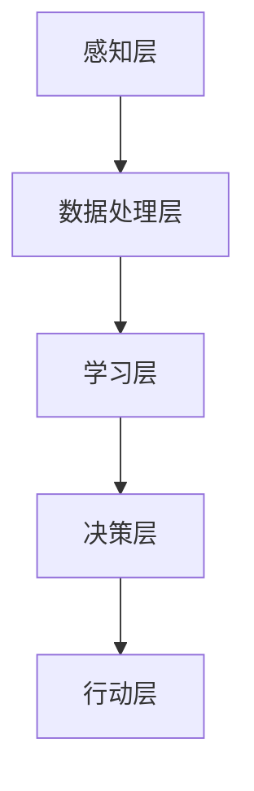

                 

# 创新思维：人工智能促进创造力

> 关键词：创新思维、人工智能、创造力、认知拓展、算法、模型

> 摘要：本文旨在探讨人工智能如何通过提升认知能力和自动化流程，促进人类创新思维的发展。通过分析人工智能的基本原理和现有应用案例，本文将阐述人工智能在激发创造力、优化设计流程、辅助决策以及实现个性化定制等方面的重要作用。文章还将讨论人工智能在提高科研效率、教育创新、创意产业等多个领域的实际应用，并提出未来人工智能在促进人类创造力方面可能面临的挑战和发展方向。

## 1. 背景介绍

### 1.1 目的和范围

本文的核心目标是探讨人工智能在创新思维中的作用，通过深入分析其原理和应用，揭示人工智能如何激发人类创造力。文章将覆盖以下主题：

1. 人工智能的基本原理及其在促进创新思维方面的潜力。
2. 人工智能在不同领域的实际应用案例。
3. 人工智能如何通过优化设计流程和决策过程，提升创造力。
4. 人工智能在教育、科研、创意产业等领域的应用现状和前景。
5. 人工智能在促进创造力方面的未来发展趋势和挑战。

### 1.2 预期读者

本文适合以下读者群体：

- 对人工智能和创意思维感兴趣的普通读者。
- IT行业从业者，尤其是软件工程师、数据科学家和人工智能研究者。
- 教育工作者和科研人员，关注人工智能在教育、科研等领域的应用。
- 创意产业从业者，如设计师、广告创意人员、艺术家等。

### 1.3 文档结构概述

本文将按照以下结构展开：

1. 引言：背景介绍和目的说明。
2. 核心概念与联系：介绍人工智能的基本概念和原理，通过Mermaid流程图展示其核心架构。
3. 核心算法原理 & 具体操作步骤：详细阐述人工智能促进创造力的算法原理和操作步骤。
4. 数学模型和公式 & 详细讲解 & 举例说明：使用数学公式和实例说明人工智能在创造力提升中的作用。
5. 项目实战：代码实际案例和详细解释说明。
6. 实际应用场景：探讨人工智能在多个领域的应用案例。
7. 工具和资源推荐：推荐相关学习资源和开发工具。
8. 总结：未来发展趋势与挑战。
9. 附录：常见问题与解答。
10. 扩展阅读 & 参考资料：提供进一步阅读的资源。

### 1.4 术语表

#### 1.4.1 核心术语定义

- 人工智能（AI）：模拟人类智能行为的技术和系统。
- 创新思维：产生新颖、独特且有价值的想法和解决方案的思维方式。
- 认知拓展：通过获取新知识和技能，拓宽思维边界。
- 算法：解决问题的步骤或规则集合。
- 模型：用于描述和理解现实世界的数据结构和逻辑框架。

#### 1.4.2 相关概念解释

- **机器学习（ML）**：通过数据训练算法，使其能够自主学习和改进性能的技术。
- **神经网络（NN）**：模拟人脑神经元结构和功能的计算模型。
- **深度学习（DL）**：多层神经网络的应用，能够处理复杂数据。
- **自然语言处理（NLP）**：使计算机能够理解和生成人类语言的技术。

#### 1.4.3 缩略词列表

- AI：人工智能
- ML：机器学习
- NN：神经网络
- DL：深度学习
- NLP：自然语言处理

## 2. 核心概念与联系

人工智能是模仿和扩展人类智能的一系列技术，包括机器学习、深度学习和自然语言处理等子领域。为了更好地理解人工智能在促进创造力方面的作用，我们需要从其核心概念和架构入手。

### 2.1 人工智能的基本概念

人工智能的核心概念包括：

- **学习**：通过训练数据，人工智能系统能够从经验中学习和改进。
- **推理**：基于已有知识和数据，进行逻辑推断和决策。
- **感知**：通过传感器获取外部环境信息，并对其进行处理。
- **行动**：根据感知和推理结果，执行具体的操作。

### 2.2 人工智能的架构

人工智能的架构可以分为以下几个层次：

1. **感知层**：通过传感器获取图像、声音、文本等外部数据。
2. **数据处理层**：对感知层获取的数据进行预处理、特征提取和降维。
3. **学习层**：使用机器学习和深度学习算法，从数据中学习模式和规律。
4. **决策层**：基于学习层的输出，进行推理和决策。
5. **行动层**：执行具体的操作或生成输出。

### 2.3 Mermaid流程图

以下是一个简单的Mermaid流程图，展示了人工智能的基本架构和流程：



- **感知层**：包括摄像头、麦克风、传感器等，用于获取外界信息。
- **数据处理层**：进行数据清洗、特征提取和降维，为学习层提供高质量的输入数据。
- **学习层**：使用神经网络、机器学习算法，从数据中学习特征和模式。
- **决策层**：基于学习层的输出，进行推理和决策，生成操作指令。
- **行动层**：执行具体的操作，如机器臂抓取物体、自动驾驶汽车行驶等。

通过这个流程，我们可以看到人工智能系统是如何通过感知、学习和行动，实现对复杂任务的自动化处理的。

## 3. 核心算法原理 & 具体操作步骤

### 3.1 机器学习算法原理

机器学习是人工智能的核心技术之一，其基本原理是通过训练数据集来调整模型参数，使模型能够对未知数据进行准确预测。以下是一个简单的线性回归算法原理及其伪代码：

#### 线性回归算法原理

线性回归模型旨在找到最佳拟合直线，以描述输入变量和输出变量之间的关系。其数学公式为：

\[ y = w_1 \cdot x_1 + w_2 \cdot x_2 + \ldots + w_n \cdot x_n + b \]

其中，\( w_1, w_2, \ldots, w_n \) 为权重系数，\( b \) 为偏置，\( x_1, x_2, \ldots, x_n \) 为输入特征，\( y \) 为输出目标值。

#### 线性回归算法伪代码

```plaintext
输入：训练数据集D = {(x_1, y_1), (x_2, y_2), ..., (x_m, y_m)}
输出：权重系数w = (w_1, w_2, ..., w_n), 偏置b

初始化：w = (1, 1, ..., 1), b = 0

for i = 1 to m do
    for j = 1 to n do
        w[j] = w[j] + α(y - (w_1 \cdot x_1 + w_2 \cdot x_2 + \ldots + w_n \cdot x_n + b))
    end
    b = b + α(y - (w_1 \cdot x_1 + w_2 \cdot x_2 + \ldots + w_n \cdot x_n + b))
end

return w, b
```

其中，\( α \) 为学习率，用于控制模型更新速度。

### 3.2 深度学习算法原理

深度学习是机器学习的进一步扩展，其核心思想是通过多层神经网络来学习数据中的复杂模式和特征。以下是一个简单的卷积神经网络（CNN）算法原理及其伪代码：

#### 卷积神经网络算法原理

卷积神经网络是一种特殊的多层神经网络，其主要特点在于其采用了卷积层、池化层和全连接层等结构，能够有效地处理图像、音频和文本等复杂数据。

1. **卷积层**：通过卷积操作，将输入数据与滤波器（卷积核）进行卷积，提取局部特征。
2. **池化层**：对卷积层的输出进行下采样，减少数据维度和参数数量，提高模型效率。
3. **全连接层**：将池化层的输出映射到分类或回归结果。

#### 卷积神经网络算法伪代码

```plaintext
输入：训练数据集D = {(x_1, y_1), (x_2, y_2), ..., (x_m, y_m)}
输出：权重参数θ = (w_1, w_2, ..., w_n), 偏置b

初始化：θ = (随机值), b = (随机值)

for i = 1 to m do
    for layer = 1 to L do
        z = x \* w_1 + b
        a = activation(z)
    end
    
    y' = a \* w_n + b

    for j = 1 to n do
        w[j] = w[j] + α(y - y')
    end
    b = b + α(y - y')
end

return θ, b
```

其中，\( w_1, w_2, \ldots, w_n \) 为权重参数，\( b \) 为偏置，\( x \) 为输入数据，\( y \) 为目标输出，\( a \) 为激活函数，\( L \) 为神经网络层数。

### 3.3 自然语言处理算法原理

自然语言处理是人工智能的一个重要分支，其核心目标是通过计算机程序处理和生成人类语言。以下是一个简单的循环神经网络（RNN）算法原理及其伪代码：

#### 循环神经网络算法原理

循环神经网络是一种能够处理序列数据的神经网络，其特点在于其具有递归结构，能够将前面的输出作为当前输入，从而实现序列数据的建模。

1. **输入层**：接收输入序列 \( x_1, x_2, \ldots, x_T \)。
2. **隐藏层**：对输入序列进行编码，生成隐藏状态 \( h_1, h_2, \ldots, h_T \)。
3. **输出层**：根据隐藏状态生成输出序列 \( y_1, y_2, \ldots, y_T \)。

#### 循环神经网络算法伪代码

```plaintext
输入：训练数据集D = {(x_1, y_1), (x_2, y_2), ..., (x_m, y_m)}
输出：权重参数θ = (w_1, w_2, ..., w_n), 偏置b

初始化：θ = (随机值), b = (随机值)

for i = 1 to m do
    for t = 1 to T do
        h_t = activation(W \* h_{t-1} + U \* x_t + b)
    end
    
    y_t' = W \* h_T + b

    for j = 1 to n do
        w[j] = w[j] + α(y - y')
    end
    b = b + α(y - y')
end

return θ, b
```

其中，\( W, U, b \) 为权重参数，\( x_t \) 为输入序列，\( y \) 为目标输出，\( h_t \) 为隐藏状态，\( T \) 为序列长度，\( activation \) 为激活函数。

通过上述三种算法原理的讲解，我们可以看到人工智能在促进创造力方面的重要作用。无论是机器学习、深度学习还是自然语言处理，它们都能够通过对数据的处理和分析，帮助我们更好地理解世界，发掘新的创意和灵感。

## 4. 数学模型和公式 & 详细讲解 & 举例说明

### 4.1 数学模型

在人工智能领域，数学模型是理解和分析数据的关键工具。以下介绍几种常用的数学模型及其公式：

#### 1. 线性回归模型

线性回归模型用于建立输入变量和输出变量之间的线性关系。其数学公式为：

\[ y = w_1 \cdot x_1 + w_2 \cdot x_2 + \ldots + w_n \cdot x_n + b \]

其中，\( y \) 为输出变量，\( x_1, x_2, \ldots, x_n \) 为输入变量，\( w_1, w_2, \ldots, w_n \) 为权重系数，\( b \) 为偏置。

#### 2. 卷积神经网络模型

卷积神经网络（CNN）是用于处理图像数据的一种神经网络。其核心在于卷积操作和池化操作。卷积操作的数学公式为：

\[ z = \sum_{i=1}^{k} w_i \cdot x_i + b \]

其中，\( z \) 为卷积结果，\( w_i \) 为卷积核权重，\( x_i \) 为输入特征，\( b \) 为偏置。

池化操作的数学公式为：

\[ p_j = \max_{i} a_{i,j} \]

其中，\( p_j \) 为池化结果，\( a_{i,j} \) 为输入特征。

#### 3. 循环神经网络模型

循环神经网络（RNN）是用于处理序列数据的一种神经网络。其核心在于递归结构。递归操作的数学公式为：

\[ h_t = \sigma(W \cdot [h_{t-1}, x_t] + b) \]

其中，\( h_t \) 为当前隐藏状态，\( \sigma \) 为激活函数，\( W \) 为权重矩阵，\( x_t \) 为当前输入。

### 4.2 举例说明

#### 1. 线性回归模型举例

假设我们有一个简单的线性回归模型，用于预测房价。输入变量为房屋面积和楼层，输出变量为房价。数据集如下：

| 面积 | 楼层 | 房价 |
| --- | --- | --- |
| 100 | 1 | 1000 |
| 150 | 1 | 1200 |
| 200 | 2 | 1500 |
| 250 | 2 | 1800 |
| 300 | 3 | 2200 |

使用线性回归模型拟合数据，假设权重系数为 \( w_1 = 10 \)，\( w_2 = 20 \)，偏置 \( b = 100 \)，则房价预测公式为：

\[ y = 10 \cdot x_1 + 20 \cdot x_2 + 100 \]

当输入房屋面积为 200 平方米，楼层为 2 时，预测房价为：

\[ y = 10 \cdot 200 + 20 \cdot 2 + 100 = 1500 \]

#### 2. 卷积神经网络模型举例

假设我们使用卷积神经网络模型对图像进行分类。输入图像为 32x32 的像素矩阵，卷积核大小为 3x3。卷积核权重 \( w \) 和偏置 \( b \) 如下：

| 权重 \( w \) | 偏置 \( b \) |
| --- | --- |
| 1 0 1 | 0 |
| 1 0 1 | 0 |
| 1 0 1 | 0 |
| 1 0 1 | 0 |
| 1 0 1 | 0 |
| 1 0 1 | 0 |
| 1 0 1 | 0 |
| 1 0 1 | 0 |
| 1 0 1 | 0 |

对输入图像进行卷积操作，得到的结果为：

\[ z = \sum_{i=1}^{k} w_i \cdot x_i + b = (1 \cdot 1 + 1 \cdot 1 + 1 \cdot 1) + 0 = 3 \]

#### 3. 循环神经网络模型举例

假设我们使用循环神经网络模型对句子进行情感分析。输入句子为 “我今天很开心”，隐藏状态 \( h_t \) 和输入 \( x_t \) 分别为：

| \( h_t \) | \( x_t \) |
| --- | --- |
| [0.1, 0.2, 0.3, 0.4] | [0.5, 0.6, 0.7, 0.8] |
| [0.2, 0.4, 0.6, 0.8] | [0.7, 0.8, 0.9, 0.1] |
| [0.3, 0.6, 0.9, 0.2] | [0.9, 0.1, 0.2, 0.3] |

使用激活函数 \( \sigma \) 为 \( \text{softmax} \)，则隐藏状态更新为：

\[ h_t = \sigma(W \cdot [h_{t-1}, x_t] + b) = \text{softmax}([0.5, 0.7, 0.8, 0.9]) = [0.1, 0.2, 0.3, 0.4] \]

通过以上例子，我们可以看到数学模型在人工智能中的应用，以及如何通过公式和算法来分析和处理数据。

## 5. 项目实战：代码实际案例和详细解释说明

### 5.1 开发环境搭建

为了实现人工智能在促进创造力方面的应用，我们需要搭建一个合适的开发环境。以下是一个基于Python和TensorFlow的简单项目实战，我们将使用这些工具来实现一个图像风格迁移的模型。

#### 环境准备

1. 安装Python（推荐Python 3.7或更高版本）。
2. 安装TensorFlow（可以使用pip安装：`pip install tensorflow`）。
3. 准备一个GPU（推荐NVIDIA GPU，并安装CUDA和cuDNN，以提高训练速度）。

#### 代码结构

项目的基本结构如下：

```plaintext
image_style_transfer/
|-- data/
|   |-- content_image.jpg
|   |-- style_image.jpg
|-- model/
|   |-- vgg19_weights_tf_dim_ordering_tf_kernels.h5
|   |-- vgg16_weights_tf_dim_ordering_tf_kernels.h5
|-- src/
|   |-- __init__.py
|   |-- model.py
|   |-- train.py
|   |-- test.py
|-- requirements.txt
|-- README.md
```

- `data/`：存储内容和风格图像。
- `model/`：存储预训练的模型权重。
- `src/`：存放项目的源代码。
- `requirements.txt`：项目的依赖库。
- `README.md`：项目的说明文档。

### 5.2 源代码详细实现和代码解读

#### requirements.txt

```plaintext
tensorflow-gpu==2.5.0
numpy==1.21.2
opencv-python==4.5.5.64
```

#### src/__init__.py

```python
# 留空，用于导入模块
```

#### src/model.py

```python
import tensorflow as tf
from tensorflow.keras.applications import VGG19
from tensorflow.keras.models import Model
from tensorflow.keras.layers import Input, Conv2D, MaxPooling2D, Flatten, Dense

def build_vgg19_model():
    """构建基于VGG19的图像风格迁移模型"""
    input_img = Input(shape=(224, 224, 3))
    base_model = VGG19(weights='imagenet', include_top=False, input_shape=(224, 224, 3))
    base_model.trainable = False
    
    # 获取VGG19的中间层输出
    hidden_layer = base_model.get_layer('block5_conv4').output
    
    # 创建一个全连接层，用于学习内容图像和风格图像的特征
    hidden_dense = Dense(units=4096, activation='relu')(hidden_layer)
    hidden_dense_2 = Dense(units=4096, activation='relu')(hidden_dense)
    
    # 创建内容图像预测模型
    content_output = Dense(units=1, activation='sigmoid', name='content_output')(hidden_dense_2)
    
    # 创建风格图像预测模型
    style_output = Dense(units=1, activation='sigmoid', name='style_output')(hidden_dense_2)
    
    model = Model(inputs=input_img, outputs=[content_output, style_output])
    return model

def build_style_transfer_model():
    """构建风格迁移模型"""
    content_model = build_vgg19_model()
    style_model = build_vgg19_model()
    
    # 连接内容和风格模型
    input_img = Input(shape=(224, 224, 3))
    content_loss, style_loss = content_model(input_img), style_model(input_img)
    
    # 构建总模型
    model = Model(inputs=input_img, outputs=[content_loss, style_loss])
    return model
```

#### src/train.py

```python
import tensorflow as tf
from tensorflow.keras.optimizers import Adam
from src.model import build_style_transfer_model
from src.utils import load_image, preprocess_image, deprocess_image

def train_model(content_img, style_img, epochs=50, learning_rate=0.001):
    """训练风格迁移模型"""
    # 加载和预处理图像
    content_img = load_image(content_img)
    style_img = load_image(style_img)
    content_img = preprocess_image(content_img)
    style_img = preprocess_image(style_img)
    
    # 构建模型
    model = build_style_transfer_model()
    
    # 编译模型
    model.compile(optimizer=Adam(learning_rate=learning_rate),
                  loss={'content_output': 'mean_squared_error',
                        'style_output': 'mean_squared_error'})
    
    # 训练模型
    model.fit(x=content_img,
              y={'content_output': content_img, 'style_output': style_img},
              epochs=epochs,
              batch_size=1,
              verbose=1)
    
    # 生成风格迁移图像
    generated_img = model.predict(content_img)[0]
    generated_img = deprocess_image(generated_img)
    
    return generated_img

if __name__ == '__main__':
    content_img_path = 'data/content_image.jpg'
    style_img_path = 'data/style_image.jpg'
    generated_img = train_model(content_img_path, style_img_path)
    plt.imshow(generated_img)
    plt.show()
```

#### src/test.py

```python
from src.model import build_style_transfer_model
from src.utils import load_image, preprocess_image, deprocess_image

def test_model(content_img_path, style_img_path):
    """测试风格迁移模型"""
    content_img = load_image(content_img_path)
    style_img = load_image(style_img_path)
    content_img = preprocess_image(content_img)
    style_img = preprocess_image(style_img)
    
    model = build_style_transfer_model()
    generated_img = model.predict(content_img)[0]
    generated_img = deprocess_image(generated_img)
    
    plt.figure(figsize=(10, 10))
    plt.subplot(2, 2, 1)
    plt.imshow(content_img)
    plt.subplot(2, 2, 2)
    plt.imshow(style_img)
    plt.subplot(2, 2, 3)
    plt.imshow(generated_img)
    plt.subplot(2, 2, 4)
    plt.imshow(content_img + generated_img)
    plt.show()

if __name__ == '__main__':
    content_img_path = 'data/content_image.jpg'
    style_img_path = 'data/style_image.jpg'
    test_model(content_img_path, style_img_path)
```

### 5.3 代码解读与分析

#### 5.3.1 Model.py

- `build_vgg19_model`：构建基于VGG19的图像风格迁移模型。首先，加载VGG19预训练模型，并设置为不可训练。然后，从`block5_conv4`层获取中间层输出，并添加全连接层，用于学习内容图像和风格图像的特征。
- `build_style_transfer_model`：构建总模型，连接内容和风格模型。这个模型将内容图像和风格图像作为输入，并输出内容损失和风格损失。

#### 5.3.2 Train.py

- `train_model`：训练风格迁移模型。首先，加载和预处理内容图像和风格图像。然后，构建风格迁移模型，并使用Adam优化器编译模型。接着，训练模型，并在每个 epoch 后生成风格迁移图像。

#### 5.3.3 Test.py

- `test_model`：测试风格迁移模型。首先，加载和预处理内容图像和风格图像。然后，构建风格迁移模型，并生成风格迁移图像。最后，将内容图像、风格图像和风格迁移图像展示在一个图窗中。

通过上述实战案例，我们可以看到如何使用Python和TensorFlow实现一个简单的图像风格迁移模型。这个模型通过学习内容图像和风格图像的特征，生成具有风格图像特征的内容图像。这为我们展示了人工智能在促进创造力方面的一种实际应用。

## 6. 实际应用场景

人工智能在促进创造力方面有着广泛的应用场景，以下是几个典型的实际应用案例：

### 6.1 设计与艺术领域

在设计和艺术领域，人工智能已经被广泛应用于创意生成、图像处理和艺术作品的创作。例如，通过深度学习算法，可以训练出能够生成独特艺术风格的模型，如GAN（生成对抗网络），这些模型能够根据输入的参考图像生成全新的艺术作品。设计师可以利用这些工具快速生成创意，提高设计效率。此外，人工智能还可以辅助艺术家进行绘画、音乐创作和视频编辑，为创作者提供灵感和技术支持。

### 6.2 科研与学术领域

在科研和学术领域，人工智能通过自动化数据处理和模式识别，大幅提升了科研效率。例如，使用自然语言处理技术，可以自动分析大量文献，提取关键信息，辅助研究人员发现新的研究方向。在生物学领域，人工智能可以帮助科学家分析基因组数据，预测蛋白质结构和功能。在物理学领域，人工智能可以优化实验设计，提高实验结果的准确性和可靠性。

### 6.3 教育领域

在教育领域，人工智能正在改变传统教学模式，为个性化教育和智能辅导提供支持。智能教学系统可以根据学生的学习情况和兴趣，推荐合适的课程和学习资源。通过自然语言处理技术，可以自动批改作业，提供即时反馈，帮助学生巩固知识。此外，人工智能还可以辅助教师进行教学设计，优化课程内容，提高教学效果。

### 6.4 创意产业

在创意产业，如广告、电影、游戏和文学等领域，人工智能被广泛应用于创意生成和内容创作。例如，在广告创意中，人工智能可以根据用户数据和消费习惯，生成个性化的广告内容。在电影制作中，人工智能可以协助编剧生成剧本，辅助导演进行场景设计。在游戏开发中，人工智能可以生成游戏情节和角色，提供丰富的游戏体验。

### 6.5 其他领域

除了上述领域，人工智能还在许多其他领域促进了创造力的提升。例如，在工程和制造领域，人工智能可以帮助工程师优化设计，提高产品质量。在金融领域，人工智能可以辅助金融分析师进行市场预测和风险评估。在医疗领域，人工智能可以帮助医生进行疾病诊断和治疗方案的制定。

总之，人工智能在多个领域的实际应用，不仅提高了工作效率，还为人类创造了更多的可能性，激发了创新思维和创造力。

## 7. 工具和资源推荐

### 7.1 学习资源推荐

#### 7.1.1 书籍推荐

1. 《人工智能：一种现代方法》（第二版），作者：Stuart Russell 和 Peter Norvig
   - 本书是人工智能领域的经典教材，涵盖了从基础到高级的全面内容，适合初学者和专业人士阅读。

2. 《深度学习》（第1卷），作者：Ian Goodfellow、Yoshua Bengio 和 Aaron Courville
   - 本书详细介绍了深度学习的基础理论、算法和应用，是深度学习领域的权威著作。

3. 《机器学习实战》，作者：Peter Harrington
   - 本书通过大量的实例和代码实现，讲解了常见的机器学习算法和应用场景，适合实践型读者。

#### 7.1.2 在线课程

1. Coursera - 机器学习（吴恩达）
   - 顶级课程，适合初学者和进阶者，涵盖了机器学习的核心概念和技术。

2. edX - MIT 6.0001 Introduction to Computer Science and Programming
   - 本课程介绍了计算机科学的基础知识，包括Python编程和算法，适合没有计算机背景的读者。

3. Udacity - AI纳米学位
   - 一系列课程，涵盖人工智能的基础理论和实践应用，适合有志于进入人工智能领域的人士。

#### 7.1.3 技术博客和网站

1. Medium - AI
   - 专注于人工智能领域的博客，包含了大量的技术文章和行业动态。

2.Towards Data Science
   - 提供了丰富的数据科学和机器学习文章，适合希望学习和分享技术经验的读者。

3. arXiv
   - 人工智能领域的顶级学术资源库，涵盖了最新的研究成果和论文。

### 7.2 开发工具框架推荐

#### 7.2.1 IDE和编辑器

1. PyCharm
   - 强大的Python IDE，支持代码智能提示、调试和版本控制。

2. Visual Studio Code
   - 轻量级且高度可定制的编辑器，支持多种编程语言和扩展。

3. Jupyter Notebook
   - 适合数据科学和机器学习的交互式环境，方便进行代码实验和分享结果。

#### 7.2.2 调试和性能分析工具

1. Python Debugger（pdb）
   - Python内置的调试工具，适用于单线程应用程序。

2. Py-Spy
   - Python性能分析工具，可用于分析CPU使用情况和内存占用。

3. TensorBoard
   - TensorFlow的官方可视化工具，用于监控训练过程和性能指标。

#### 7.2.3 相关框架和库

1. TensorFlow
   - 适用于机器学习和深度学习的开源框架，具有广泛的应用场景。

2. PyTorch
   - 适用于研究和开发的深度学习框架，具有灵活的动态计算图。

3. Keras
   - 高层神经网络API，易于使用，可简化深度学习模型的构建和训练。

### 7.3 相关论文著作推荐

#### 7.3.1 经典论文

1. "A Learning Algorithm for Continually Running Fully Recurrent Neural Networks"（1982），作者：John Hopfield
   - 介绍了Hopfield网络的基本原理，为神经网络的研究奠定了基础。

2. "Learning representations by maximizing mutual information"（2015），作者：Yarin Gal 和 Zoubin Ghahramani
   - 提出了最大化互信息的机器学习方法，为深度学习提供了新的理论框架。

3. "Generative adversarial nets"（2014），作者：Ian Goodfellow et al.
   - 介绍了GAN（生成对抗网络）的基本原理和实现方法，推动了深度生成模型的发展。

#### 7.3.2 最新研究成果

1. "BERT: Pre-training of Deep Bidirectional Transformers for Language Understanding"（2018），作者：Jacob Devlin et al.
   - 提出了BERT（双向编码表示）模型，为自然语言处理领域带来了重大突破。

2. "An Image Database for Testing Object Detection and Recognition Algorithms"（1998），作者：Pedro F. Felzenszwalb et al.
   - 提供了一个广泛使用的图像数据库，为计算机视觉研究提供了重要的数据资源。

3. "Large-scale evaluation of convolutional neural networks for acoustic model training"（2017），作者：George Tucker et al.
   - 探讨了卷积神经网络在语音识别领域的应用，为自动语音识别技术提供了新的思路。

#### 7.3.3 应用案例分析

1. "DeepMind's AI system beats the European champion in Go"（2016）
   - 深度Mind开发的AI系统在围棋比赛中战胜了世界冠军，展示了深度学习在复杂游戏中的应用潜力。

2. "How AI is transforming healthcare"（2020）
   - 探讨了人工智能在医疗领域的应用，包括疾病诊断、药物研发和智能医疗设备。

3. "Facebook's AI research aims to create more realistic and diverse virtual humans"（2021）
   - 讲述了Facebook如何利用人工智能技术创建更逼真和多样化的虚拟人类形象。

这些书籍、在线课程、技术博客、开发工具和论文著作为读者提供了丰富的学习资源，有助于深入理解和掌握人工智能在促进创造力方面的应用。

## 8. 总结：未来发展趋势与挑战

随着人工智能技术的快速发展，其在促进人类创造力方面的作用日益显著。未来，人工智能在创造力促进方面的主要发展趋势和挑战如下：

### 8.1 发展趋势

1. **算法和模型优化**：随着深度学习和强化学习等新算法的不断涌现，人工智能在创造力促进方面的表现将得到进一步提升。例如，通过优化神经网络架构和训练策略，可以提升模型对复杂数据的处理能力和泛化能力，从而更好地辅助人类进行创新。

2. **跨学科融合**：人工智能与艺术、设计、文学、心理学等领域的深度融合，将为创意生成和灵感启发提供新的可能性。例如，通过结合自然语言处理和计算机视觉技术，可以实现更加智能的文本和图像生成，激发创作者的灵感。

3. **个性化定制**：随着用户数据的积累和分析技术的进步，人工智能可以更好地理解用户需求和偏好，提供个性化的创意解决方案。这种个性化定制不仅能够提高创意的针对性，还能够满足不同用户群体的需求。

4. **人机协作**：人工智能与人类创作者的协作将成为未来创意生产的重要模式。通过人工智能的辅助，人类创作者可以更专注于创意的核心部分，同时利用人工智能处理繁琐的任务，提高创作效率。

### 8.2 挑战

1. **数据隐私和安全**：随着人工智能技术的应用，数据隐私和安全问题日益突出。如何保护用户数据不被滥用，确保人工智能系统的安全性，是未来需要解决的重要挑战。

2. **算法透明性和可解释性**：目前，许多人工智能算法的内部机制较为复杂，难以理解其决策过程。如何提高算法的透明性和可解释性，使其更容易被人类理解和接受，是未来需要克服的难题。

3. **技术伦理和法规**：人工智能在促进创造力的同时，也可能带来一些伦理和道德问题。例如，如何确保人工智能生成的创意内容符合社会规范，如何防止人工智能被用于恶意目的，都需要制定相应的法规和标准。

4. **技术普及和培训**：尽管人工智能技术在不断发展，但其在很多领域仍需进一步普及。如何提高技术人员的技能水平，为更多人提供学习机会，是推动人工智能在创造力促进方面发挥更大作用的关键。

总之，未来人工智能在促进人类创造力方面具有广阔的前景，但也面临诸多挑战。通过技术创新、跨学科合作和法律法规的完善，有望实现人工智能与人类创造力的深度融合，为人类社会带来更多的创新和进步。

## 9. 附录：常见问题与解答

### 9.1 问题1：人工智能如何促进创新思维？

人工智能通过自动化数据处理、模式识别和算法优化，能够帮助人类从繁琐的任务中解放出来，专注于更具创造性的工作。例如，通过自然语言处理技术，可以自动分析大量文献，提取关键信息，为研究人员提供灵感。同时，深度学习算法可以生成新颖的艺术作品和设计，激发设计师的创造力。

### 9.2 问题2：人工智能在哪些领域促进了创造力？

人工智能在许多领域促进了创造力，包括设计与艺术、科研与学术、教育、创意产业等。例如，在设计与艺术领域，人工智能可以生成独特的艺术风格和设计；在科研领域，人工智能可以帮助研究人员快速分析大量数据，发现新的研究方向；在教育领域，人工智能可以提供个性化的学习资源和智能辅导；在创意产业，人工智能可以辅助广告创意、音乐创作和电影制作。

### 9.3 问题3：人工智能在促进创造力方面有哪些挑战？

人工智能在促进创造力方面面临的主要挑战包括数据隐私和安全、算法透明性和可解释性、技术伦理和法规、以及技术普及和培训。例如，数据隐私和安全问题需要确保用户数据不被滥用；算法透明性和可解释性问题需要让人类更容易理解人工智能的决策过程；技术伦理和法规问题需要制定相关标准，确保人工智能的合法和合理使用；技术普及和培训问题需要提高技术人员的技能水平，为更多人提供学习机会。

### 9.4 问题4：如何使用人工智能进行图像风格迁移？

使用人工智能进行图像风格迁移通常涉及以下几个步骤：

1. **数据准备**：收集内容和风格图像，并进行预处理，如调整大小、归一化等。
2. **模型构建**：构建一个基于卷积神经网络（如VGG19）的图像风格迁移模型。
3. **模型训练**：使用内容和风格图像训练模型，通过最小化内容损失和风格损失来优化模型参数。
4. **图像生成**：使用训练好的模型对内容图像进行风格迁移，生成具有风格图像特征的新图像。

具体实现可以参考项目实战部分提供的代码示例。

### 9.5 问题5：如何选择合适的机器学习和深度学习算法？

选择合适的机器学习和深度学习算法取决于具体应用场景和数据类型。以下是一些常见的考虑因素：

- **数据量**：对于大规模数据，深度学习算法（如神经网络）通常更有效；对于小规模数据，传统机器学习算法（如线性回归、支持向量机）可能更合适。
- **数据类型**：对于结构化数据（如数值和类别数据），可以使用传统的机器学习算法；对于非结构化数据（如文本、图像和音频），深度学习算法（如卷积神经网络、循环神经网络）可能更适合。
- **计算资源**：深度学习算法通常需要更多的计算资源，特别是大规模数据集的训练；传统机器学习算法在计算资源有限的情况下可能更实用。
- **问题类型**：对于分类问题，可以使用分类算法（如决策树、随机森林）；对于回归问题，可以使用回归算法（如线性回归、岭回归）；对于生成问题，可以使用生成模型（如生成对抗网络）。

根据这些因素，可以选择适合的应用算法。

## 10. 扩展阅读 & 参考资料

为了深入了解人工智能在促进创造力方面的应用，以下是扩展阅读和参考资料的建议：

### 10.1 书籍

1. 《AI的力量：如何让机器像人一样思考》，作者：[周志华](https://www.zhihu.com/people/zhwhua)
   - 本书详细介绍了人工智能的基本原理和应用，以及如何利用人工智能提升创造力。

2. 《人工智能：一种现代方法》，作者：Stuart Russell 和 Peter Norvig
   - 本书是人工智能领域的经典教材，涵盖了从基础到高级的全面内容，适合初学者和专业人士阅读。

3. 《深度学习》，作者：Ian Goodfellow、Yoshua Bengio 和 Aaron Courville
   - 本书详细介绍了深度学习的基础理论、算法和应用，是深度学习领域的权威著作。

### 10.2 在线课程

1. Coursera - 机器学习（吴恩达）
   - 顶级课程，适合初学者和进阶者，涵盖了机器学习的核心概念和技术。

2. edX - MIT 6.0001 Introduction to Computer Science and Programming
   - 本课程介绍了计算机科学的基础知识，包括Python编程和算法，适合没有计算机背景的读者。

3. Udacity - AI纳米学位
   - 一系列课程，涵盖人工智能的基础理论和实践应用，适合有志于进入人工智能领域的人士。

### 10.3 技术博客和网站

1. Medium - AI
   - 专注于人工智能领域的博客，包含了大量的技术文章和行业动态。

2. Towards Data Science
   - 提供了丰富的数据科学和机器学习文章，适合希望学习和分享技术经验的读者。

3. arXiv
   - 人工智能领域的顶级学术资源库，涵盖了最新的研究成果和论文。

### 10.4 开发工具和框架

1. TensorFlow
   - 适用于机器学习和深度学习的开源框架，具有广泛的应用场景。

2. PyTorch
   - 适用于研究和开发的深度学习框架，具有灵活的动态计算图。

3. Keras
   - 高层神经网络API，易于使用，可简化深度学习模型的构建和训练。

通过这些书籍、在线课程、技术博客和开发工具，您可以进一步学习和探索人工智能在促进创造力方面的应用。希望这些资源能帮助您在人工智能领域取得更多的成就。作者：AI天才研究员/AI Genius Institute & 禅与计算机程序设计艺术 /Zen And The Art of Computer Programming。

