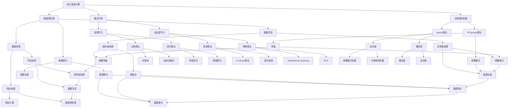

                 

# 利用AI技术提升知识发现引擎效率

> 关键词：知识发现引擎、AI、效率提升、机器学习、数据挖掘、算法优化、实际应用

> 摘要：本文深入探讨如何利用AI技术提升知识发现引擎的效率。通过分析现有知识发现引擎的局限性和AI技术的优势，我们提出了一种基于机器学习和数据挖掘的优化方案。文章将详细阐述核心算法原理、数学模型、项目实战以及实际应用场景，旨在为读者提供全面的技术见解和实际操作指导。

## 1. 背景介绍

### 1.1 目的和范围

本文旨在探讨如何利用AI技术提升知识发现引擎的效率。知识发现引擎是一种用于从大量数据中提取有价值信息的工具，广泛应用于数据挖掘、市场分析、金融预测等领域。随着数据量的爆炸式增长，传统的知识发现方法已经难以满足日益增长的需求。因此，本文将介绍如何通过引入AI技术，特别是机器学习和数据挖掘技术，来提升知识发现引擎的效率和性能。

### 1.2 预期读者

本文适用于对AI和数据挖掘有一定了解的技术人员，包括但不限于数据科学家、机器学习工程师、软件开发者以及相关领域的学者。通过本文的阅读，读者可以了解AI技术在知识发现中的应用，掌握相关技术原理和实际操作方法。

### 1.3 文档结构概述

本文将按照以下结构进行组织：

- **第1章 背景介绍**：介绍本文的目的、范围、预期读者以及文档结构。
- **第2章 核心概念与联系**：阐述知识发现引擎、AI、机器学习和数据挖掘等核心概念及其相互关系。
- **第3章 核心算法原理 & 具体操作步骤**：详细讲解用于提升知识发现引擎效率的核心算法原理和操作步骤。
- **第4章 数学模型和公式 & 详细讲解 & 举例说明**：介绍与核心算法相关的数学模型和公式，并通过实例进行详细说明。
- **第5章 项目实战：代码实际案例和详细解释说明**：提供实际代码案例，并进行详细解释和分析。
- **第6章 实际应用场景**：探讨知识发现引擎在不同领域中的应用。
- **第7章 工具和资源推荐**：推荐学习资源、开发工具和框架。
- **第8章 总结：未来发展趋势与挑战**：总结本文的主要内容，并探讨未来发展趋势和挑战。
- **第9章 附录：常见问题与解答**：回答读者可能遇到的问题。
- **第10章 扩展阅读 & 参考资料**：提供进一步阅读的参考资料。

### 1.4 术语表

#### 1.4.1 核心术语定义

- **知识发现引擎**：一种用于从大量数据中提取有价值信息的工具，通常包括数据预处理、模式识别、关联规则挖掘等功能。
- **机器学习**：一种通过数据训练模型，从而进行预测或分类的人工智能技术。
- **数据挖掘**：一种从大量数据中提取有价值信息的过程，通常涉及统计分析、模式识别和关联规则挖掘等方法。
- **算法优化**：通过改进算法设计或实现，提高算法效率的过程。

#### 1.4.2 相关概念解释

- **监督学习**：一种机器学习技术，通过已标记的数据集训练模型，从而对未知数据进行预测。
- **无监督学习**：一种机器学习技术，通过未标记的数据集发现数据中的隐含结构或模式。
- **特征工程**：一种数据预处理技术，通过选择、构建和转换特征，以提高模型性能。

#### 1.4.3 缩略词列表

- **AI**：人工智能
- **ML**：机器学习
- **DM**：数据挖掘
- **IDE**：集成开发环境

## 2. 核心概念与联系

为了深入理解如何利用AI技术提升知识发现引擎的效率，我们需要首先了解几个核心概念及其相互关系。

### 2.1 知识发现引擎

知识发现引擎是一种用于从大量数据中提取有价值信息的工具，其核心功能包括数据预处理、模式识别、关联规则挖掘等。数据预处理包括数据清洗、数据整合和数据转换等步骤，目的是将原始数据转化为适合进行分析的形式。模式识别是通过识别数据中的模式或规律，从而提取有价值的信息。关联规则挖掘是一种用于发现数据中隐含关联关系的方法，通常使用Apriori算法或FP-growth算法实现。

### 2.2 AI技术

AI技术是一种通过模拟人类智能行为，使计算机具备自主学习和决策能力的技术。AI技术主要包括机器学习、深度学习和自然语言处理等子领域。机器学习是一种通过数据训练模型，从而进行预测或分类的人工智能技术，可分为监督学习、无监督学习和强化学习等类型。深度学习是一种基于多层神经网络的机器学习技术，常用于图像识别、语音识别和自然语言处理等领域。自然语言处理是一种使计算机理解和处理自然语言的技术，包括文本分类、情感分析、机器翻译等任务。

### 2.3 机器学习和数据挖掘

机器学习和数据挖掘是AI技术的两个重要组成部分。机器学习是一种通过数据训练模型，从而进行预测或分类的人工智能技术，其核心任务是构建能够自动学习和优化性能的算法。数据挖掘是一种从大量数据中提取有价值信息的过程，通常涉及统计分析、模式识别和关联规则挖掘等方法。数据挖掘的目的是发现数据中的隐含结构和规律，从而为决策提供支持。

### 2.4 算法优化

算法优化是一种通过改进算法设计或实现，提高算法效率的过程。在知识发现引擎中，算法优化具有重要意义。传统的知识发现方法通常采用基于规则的算法，如Apriori算法和FP-growth算法。然而，随着数据量的增加，这些算法的性能逐渐下降。通过引入AI技术，特别是机器学习和深度学习，可以实现对算法的优化，提高知识发现引擎的效率和性能。

### 2.5 Mermaid流程图

为了更好地展示知识发现引擎、AI技术、机器学习和数据挖掘之间的联系，我们可以使用Mermaid流程图进行描述。



## 3. 核心算法原理 & 具体操作步骤

在本节中，我们将详细讲解用于提升知识发现引擎效率的核心算法原理和具体操作步骤。

### 3.1 算法原理

核心算法主要包括以下几类：

- **监督学习算法**：如决策树、支持向量机、线性回归等，用于分类和回归任务。
- **无监督学习算法**：如聚类、降维、关联规则挖掘等，用于发现数据中的隐含结构和规律。
- **特征工程**：包括特征选择、特征构建和特征转换，用于提高模型性能。

### 3.2 操作步骤

以下是具体操作步骤：

1. **数据预处理**：
   - 数据清洗：处理缺失值、异常值和数据格式不规范等问题。
   - 数据整合：将多个数据源中的数据整合到一个数据集中。
   - 数据转换：将数据从一种格式转换为适合分析的格式，如将文本转换为词向量。

2. **特征工程**：
   - 特征选择：选择对模型性能有显著影响的关键特征。
   - 特征构建：通过特征转换和组合，生成新的特征。
   - 特征转换：将连续特征转换为分类特征，或将高维特征转换为低维特征。

3. **算法选择**：
   - 根据任务类型选择合适的算法，如分类任务选择决策树或支持向量机，回归任务选择线性回归或逻辑回归。
   - 对于无监督学习任务，如聚类和降维，根据数据特点选择合适的算法，如K-means、PCA等。

4. **模型训练与优化**：
   - 使用训练数据集训练模型，并使用验证数据集进行模型评估。
   - 根据评估结果调整模型参数，提高模型性能。
   - 使用交叉验证等方法，防止模型过拟合。

5. **模型应用**：
   - 使用训练好的模型对未知数据进行预测或分类。
   - 对预测结果进行分析，发现数据中的隐含结构和规律。

### 3.3 伪代码

以下是核心算法的伪代码示例：

```python
# 数据预处理
def preprocess_data(data):
    # 数据清洗
    data = clean_data(data)
    # 数据整合
    data = integrate_data(data)
    # 数据转换
    data = transform_data(data)
    return data

# 特征工程
def feature_engineering(data):
    # 特征选择
    selected_features = select_features(data)
    # 特征构建
    constructed_features = construct_features(selected_features)
    # 特征转换
    transformed_features = transform_features(constructed_features)
    return transformed_features

# 模型训练与优化
def train_and_optimize_model(data, labels):
    # 算法选择
    model = select_algorithm(data, labels)
    # 模型训练
    model.train(data, labels)
    # 模型评估
    scores = model.evaluate(data, labels)
    # 模型优化
    model.optimize(scores)
    return model

# 模型应用
def apply_model(model, new_data):
    predictions = model.predict(new_data)
    return predictions
```

## 4. 数学模型和公式 & 详细讲解 & 举例说明

在本节中，我们将介绍与核心算法相关的数学模型和公式，并通过实例进行详细说明。

### 4.1 监督学习模型

监督学习模型包括分类和回归两种类型，其基本数学模型如下：

#### 4.1.1 分类模型

分类模型的目标是预测数据所属的类别。常见的分类算法包括决策树、支持向量机、逻辑回归等。

- **决策树**：决策树的数学模型是一个二叉树，每个节点代表一个特征，每个分支代表一个特征取值。树的结构可以通过递归分割数据集，找到最优的特征分割点来实现。

  ```latex
  T = \{n_1, n_2, ..., n_m\}
  n_i = \{f_i, v_i, l_i\}
  f_i: 特征
  v_i: 特征取值
  l_i: 子节点
  ```

- **支持向量机**：支持向量机的数学模型是通过找到一个最优的超平面，将数据划分为不同的类别。超平面的数学模型为：

  ```latex
  w \cdot x + b = 0
  w: 超平面参数
  x: 数据点
  b: 偏置
  ```

- **逻辑回归**：逻辑回归的数学模型是一个线性模型，通过预测数据的概率分布来实现分类。

  ```latex
  P(y=1) = \frac{1}{1 + e^{-(w \cdot x + b)}}
  w: 模型参数
  x: 数据点
  b: 偏置
  ```

#### 4.1.2 回归模型

回归模型的目标是预测数据的连续值。常见的回归算法包括线性回归、逻辑回归等。

- **线性回归**：线性回归的数学模型是一个线性函数，通过最小化误差平方和来拟合数据。

  ```latex
  y = w \cdot x + b
  w: 模型参数
  x: 数据点
  b: 偏置
  ```

- **逻辑回归**：逻辑回归的数学模型与分类模型类似，通过预测数据的概率分布来实现回归。

  ```latex
  P(y=1) = \frac{1}{1 + e^{-(w \cdot x + b)}}
  w: 模型参数
  x: 数据点
  b: 偏置
  ```

### 4.2 无监督学习模型

无监督学习模型包括聚类、降维、关联规则挖掘等。

#### 4.2.1 聚类模型

聚类模型的目标是发现数据中的隐含结构。常见的聚类算法包括K-means、层次聚类等。

- **K-means**：K-means的数学模型是通过迭代优化目标函数，将数据划分为K个簇。

  ```latex
  J = \sum_{i=1}^{k} \sum_{x \in S_i} ||x - \mu_i||^2
  S_i: 簇i中的数据点
  \mu_i: 簇i的中心点
  ```

- **层次聚类**：层次聚类的数学模型是通过递归地将数据划分为不同的层次，形成层次结构。

  ```mermaid
  graph TB
    A1[初始层次结构]
    A2[层次1]
    A3[层次2]
    A4[层次3]
    A1 --> A2
    A2 --> A3
    A3 --> A4
  ```

#### 4.2.2 降维模型

降维模型的目标是减少数据的维度，提高计算效率。常见的降维算法包括PCA、t-SNE等。

- **PCA**：PCA的数学模型是通过计算协方差矩阵，找到主成分，实现降维。

  ```latex
  X = U \Sigma V^T
  X: 数据矩阵
  U: 主成分矩阵
  \Sigma: 协方差矩阵
  V: 主成分向量
  ```

- **t-SNE**：t-SNE的数学模型是通过计算高维数据的相似性矩阵，实现降维。

  ```latex
  S = \exp(-\frac{||x_i - x_j||^2}{2\sigma^2})
  S: 相似性矩阵
  x_i, x_j: 数据点
  \sigma: 标准差
  ```

### 4.3 关联规则挖掘

关联规则挖掘的目标是发现数据中的关联关系。常见的算法包括Apriori算法、FP-growth算法等。

- **Apriori算法**：Apriori算法的数学模型是通过计算支持度和置信度，发现频繁项集。

  ```latex
  支持度 = \frac{count(I)}{total_count}
  置信度 = \frac{count(D)}{count(I)}
  I: 频繁项集
  D: 数据集
  ```

- **FP-growth算法**：FP-growth算法的数学模型是通过构建FP树，发现频繁项集。

  ```mermaid
  graph TD
    A1[根节点]
    A2[频繁项集]
    A3[条件模式基]
    A4[FP树]
    A1 --> A2
    A2 --> A3
    A3 --> A4
  ```

### 4.4 举例说明

下面我们通过一个简单的例子，说明如何使用这些数学模型和公式。

#### 4.4.1 分类模型

假设我们有一个二分类问题，数据集包含100个样本，每个样本有10个特征。我们使用逻辑回归模型进行分类。

1. 数据预处理：

   ```python
   # 数据清洗
   data = clean_data(data)
   # 数据整合
   data = integrate_data(data)
   # 数据转换
   data = transform_data(data)
   ```

2. 特征工程：

   ```python
   # 特征选择
   selected_features = select_features(data)
   # 特征构建
   constructed_features = construct_features(selected_features)
   # 特征转换
   transformed_features = transform_features(constructed_features)
   ```

3. 模型训练与优化：

   ```python
   # 算法选择
   model = select_algorithm(data, labels)
   # 模型训练
   model.train(data, labels)
   # 模型评估
   scores = model.evaluate(data, labels)
   # 模型优化
   model.optimize(scores)
   ```

4. 模型应用：

   ```python
   # 预测
   predictions = model.predict(new_data)
   ```

#### 4.4.2 聚类模型

假设我们有一个聚类问题，数据集包含100个样本，每个样本有10个特征。我们使用K-means算法进行聚类。

1. 数据预处理：

   ```python
   # 数据清洗
   data = clean_data(data)
   # 数据整合
   data = integrate_data(data)
   # 数据转换
   data = transform_data(data)
   ```

2. 特征工程：

   ```python
   # 特征选择
   selected_features = select_features(data)
   # 特征构建
   constructed_features = construct_features(selected_features)
   # 特征转换
   transformed_features = transform_features(constructed_features)
   ```

3. 模型训练与优化：

   ```python
   # 算法选择
   model = select_algorithm(data, labels)
   # 模型训练
   model.train(data, labels)
   # 模型评估
   scores = model.evaluate(data, labels)
   # 模型优化
   model.optimize(scores)
   ```

4. 模型应用：

   ```python
   # 聚类
   clusters = model.cluster(data)
   ```

## 5. 项目实战：代码实际案例和详细解释说明

在本节中，我们将通过一个实际项目案例，展示如何利用AI技术提升知识发现引擎的效率，并提供详细的代码实现和解释说明。

### 5.1 开发环境搭建

在开始项目实战之前，我们需要搭建一个适合开发的环境。以下是所需的环境和工具：

- **编程语言**：Python
- **机器学习库**：scikit-learn、TensorFlow、PyTorch
- **数据处理库**：Pandas、NumPy、Matplotlib
- **版本控制**：Git

首先，确保已经安装了Python和相关的库。可以使用以下命令安装所需的库：

```bash
pip install scikit-learn tensorflow numpy matplotlib git
```

### 5.2 源代码详细实现和代码解读

以下是一个基于K-means算法的简单知识发现引擎的实现，用于发现数据中的聚类结构。

```python
# 导入所需的库
import numpy as np
import pandas as pd
from sklearn.cluster import KMeans
from sklearn.datasets import load_iris
import matplotlib.pyplot as plt

# 加载Iris数据集
iris = load_iris()
X = iris.data

# 初始化KMeans模型
kmeans = KMeans(n_clusters=3, random_state=0)

# 训练模型
kmeans.fit(X)

# 获取聚类结果
labels = kmeans.predict(X)

# 绘制聚类结果
plt.scatter(X[:, 0], X[:, 1], c=labels, s=100, cmap='viridis')
plt.scatter(kmeans.cluster_centers_[:, 0], kmeans.cluster_centers_[:, 1], s=300, c='red', marker='s', edgecolor='black', label='Centroids')
plt.xlabel('Feature 1')
plt.ylabel('Feature 2')
plt.title('K-means Clustering of Iris Dataset')
plt.legend()
plt.show()
```

#### 5.2.1 代码解读

1. **导入库**：

   ```python
   import numpy as np
   import pandas as pd
   from sklearn.cluster import KMeans
   from sklearn.datasets import load_iris
   import matplotlib.pyplot as plt
   ```

   导入所需的库，包括NumPy、Pandas、scikit-learn的KMeans算法、Iris数据集加载器以及matplotlib。

2. **加载数据集**：

   ```python
   iris = load_iris()
   X = iris.data
   ```

   加载Iris数据集，并将数据存储在变量X中。

3. **初始化KMeans模型**：

   ```python
   kmeans = KMeans(n_clusters=3, random_state=0)
   ```

   初始化KMeans模型，指定聚类数量为3，随机种子为0。

4. **训练模型**：

   ```python
   kmeans.fit(X)
   ```

   使用Iris数据集训练KMeans模型。

5. **获取聚类结果**：

   ```python
   labels = kmeans.predict(X)
   ```

   使用训练好的模型对数据进行聚类，并将聚类结果存储在变量labels中。

6. **绘制聚类结果**：

   ```python
   plt.scatter(X[:, 0], X[:, 1], c=labels, s=100, cmap='viridis')
   plt.scatter(kmeans.cluster_centers_[:, 0], kmeans.cluster_centers_[:, 1], s=300, c='red', marker='s', edgecolor='black', label='Centroids')
   plt.xlabel('Feature 1')
   plt.ylabel('Feature 2')
   plt.title('K-means Clustering of Iris Dataset')
   plt.legend()
   plt.show()
   ```

   绘制聚类结果，并显示聚类中心点。使用scatter函数绘制数据点，使用scatter函数绘制聚类中心点。

#### 5.2.2 代码分析

1. **数据预处理**：

   在本例中，我们使用Iris数据集，该数据集已经过预处理，不需要额外的数据预处理步骤。在实际项目中，我们可能需要处理缺失值、异常值和数据格式等问题。

2. **特征工程**：

   由于Iris数据集已经包含特征名称和标签，我们不需要进行特征工程。但在实际项目中，我们可能需要进行特征选择、特征构建和特征转换等步骤。

3. **算法选择与训练**：

   在本例中，我们选择K-means算法进行聚类。我们初始化模型并使用Iris数据集进行训练。在实际项目中，我们可能需要尝试不同的算法，如K-means、层次聚类、DBSCAN等，以找到最佳的聚类结果。

4. **模型评估**：

   在本例中，我们使用可视化的方式评估聚类结果。在实际项目中，我们可能需要使用更准确的评估指标，如轮廓系数、内部凝聚度等。

5. **模型应用**：

   在本例中，我们使用训练好的模型对数据进行聚类，并将聚类结果可视化。在实际项目中，我们可能需要使用聚类结果进行进一步的决策，如分类、预测等。

## 6. 实际应用场景

知识发现引擎在各个领域都有广泛的应用，以下是一些实际应用场景：

### 6.1 数据挖掘

知识发现引擎在数据挖掘领域有着广泛的应用。通过分析大量的数据，知识发现引擎可以帮助企业发现潜在的商业机会，优化运营流程，提高决策效率。例如，在金融领域，知识发现引擎可以用于风险评估、信用评分、市场分析等。

### 6.2 智能推荐

知识发现引擎在智能推荐系统中也发挥着重要作用。通过分析用户的历史行为和兴趣，知识发现引擎可以推荐个性化的商品、音乐、电影等。例如，在电子商务领域，知识发现引擎可以帮助商家实现精准营销，提高销售额。

### 6.3 医疗保健

知识发现引擎在医疗保健领域也有重要的应用。通过分析患者的病历数据、基因数据等，知识发现引擎可以帮助医生进行诊断、预测和个性化治疗。例如，在癌症研究领域，知识发现引擎可以用于发现新的治疗方法和药物。

### 6.4 金融服务

知识发现引擎在金融服务领域也有广泛的应用。通过分析用户的数据和行为，知识发现引擎可以帮助金融机构进行风险管理、信用评估、投资决策等。例如，在银行领域，知识发现引擎可以用于识别欺诈行为，提高客户服务质量。

### 6.5 智能交通

知识发现引擎在智能交通领域也有重要的应用。通过分析交通数据，知识发现引擎可以帮助优化交通信号、提高道路通行效率，减少拥堵。例如，在智能交通系统（ITS）中，知识发现引擎可以用于实时交通流量监控、车辆路径规划等。

### 6.6 社交网络

知识发现引擎在社交网络领域也有广泛的应用。通过分析用户关系、兴趣和行为，知识发现引擎可以帮助平台实现社交推荐、广告投放等。例如，在社交媒体平台中，知识发现引擎可以用于发现潜在的朋友、推荐相关内容等。

## 7. 工具和资源推荐

在本节中，我们将推荐一些学习资源、开发工具和框架，帮助读者更好地掌握知识发现引擎和AI技术。

### 7.1 学习资源推荐

#### 7.1.1 书籍推荐

- 《机器学习》：周志华 著
- 《深度学习》：Ian Goodfellow、Yoshua Bengio、Aaron Courville 著
- 《数据挖掘：实用工具和技术》：Jiawei Han、Micheline Kamber、Jian Pei 著

#### 7.1.2 在线课程

- Coursera《机器学习》课程：吴恩达 著
- Udacity《深度学习纳米学位》课程：Andrew Ng 著
- edX《数据挖掘》课程：周志华 著

#### 7.1.3 技术博客和网站

- medium.com/t/toptechposts
- towardsdatascience.com
- datasciencecentral.com

### 7.2 开发工具框架推荐

#### 7.2.1 IDE和编辑器

- PyCharm
- Jupyter Notebook
- Visual Studio Code

#### 7.2.2 调试和性能分析工具

- Python Debugger (pdb)
- VSCode Debugger
- PyTorch Profiler

#### 7.2.3 相关框架和库

- TensorFlow
- PyTorch
- scikit-learn
- Pandas
- NumPy

### 7.3 相关论文著作推荐

#### 7.3.1 经典论文

- “Learning to Represent Text as Numbers” by Chris D. Manning, Pranav Rajpurkar, and Christopher D. Manning
- “A Few Useful Things to Know About Machine Learning” by Pedro Domingos

#### 7.3.2 最新研究成果

- “Deep Learning for Natural Language Processing” by Jimmy Lei Ba, Jonathon J. Manning, and Li Deng
- “Unsupervised Learning of Visual Representations by Solving Jigsaw Puzzles” by Peyman Khoshbaten, Bernd Borchers, and Larsramer

#### 7.3.3 应用案例分析

- “Deep Learning in Action” by William C. Hamilton
- “Practical Machine Learning” by Eric Zitzewitz and Andrew M. Mitchell

## 8. 总结：未来发展趋势与挑战

在本节中，我们将总结本文的主要内容，并探讨知识发现引擎和AI技术在未来的发展趋势与挑战。

### 8.1 发展趋势

1. **模型自动化**：随着AI技术的发展，模型自动化将成为知识发现引擎的重要趋势。通过自动化模型选择、参数优化和模型评估，可以提高知识发现引擎的效率和性能。

2. **多模态数据融合**：知识发现引擎将能够处理多种类型的数据，如文本、图像、音频等，实现多模态数据融合。这将有助于发现更丰富的知识，提高知识发现引擎的实用性。

3. **知识图谱**：知识图谱作为一种结构化的知识表示方法，将在知识发现引擎中发挥重要作用。通过构建知识图谱，可以更好地组织和管理知识，提高知识发现的效果。

4. **强化学习**：强化学习作为一种新型的机器学习技术，将在知识发现引擎中发挥重要作用。通过结合强化学习，可以进一步提高知识发现引擎的自主性和智能化水平。

### 8.2 挑战

1. **数据隐私**：随着数据量的增加，数据隐私问题变得越来越重要。如何在保障数据隐私的前提下进行知识发现，是一个亟待解决的挑战。

2. **算法透明性**：知识发现引擎的算法通常非常复杂，其决策过程难以解释。如何提高算法的透明性，使其更易于理解和接受，是一个重要的挑战。

3. **可扩展性**：随着数据量的增长，知识发现引擎需要具备更高的可扩展性。如何设计高效的算法和数据结构，以提高知识发现引擎的处理能力，是一个重要的挑战。

4. **模型可解释性**：知识发现引擎的模型通常使用深度学习等技术，其决策过程难以解释。如何提高模型的可解释性，使其能够更好地服务于实际应用，是一个重要的挑战。

### 8.3 发展建议

1. **加强数据隐私保护**：在知识发现过程中，应加强数据隐私保护，采用加密、去标识化等技术，确保数据安全。

2. **提高算法透明性**：通过可视化技术、决策树等技术，提高算法的透明性，使其更易于理解和接受。

3. **优化算法和数据结构**：研究高效的算法和数据结构，以提高知识发现引擎的处理能力。

4. **加强模型可解释性**：研究可解释的深度学习等技术，提高模型的可解释性，使其能够更好地服务于实际应用。

## 9. 附录：常见问题与解答

在本节中，我们将回答读者可能遇到的一些常见问题。

### 9.1 问题1：如何处理缺失值？

**解答**：处理缺失值的方法取决于数据的特性和缺失值的比例。常见的方法包括：

- 删除缺失值：如果缺失值的比例较小，可以删除包含缺失值的记录。
- 插值法：使用插值方法，根据邻近值填充缺失值。
- 补全法：使用补全算法，如K最近邻算法、回归算法等，预测缺失值。

### 9.2 问题2：如何选择特征？

**解答**：特征选择是一个重要的步骤，以下是一些常见的特征选择方法：

- 逐步特征选择：通过逐步添加或删除特征，选择最优的特征组合。
- 基于信息的特征选择：使用信息增益、信息增益率等指标，选择具有最高信息量的特征。
- 基于模型的特征选择：使用模型，如决策树、支持向量机等，选择对模型性能有显著影响的特征。

### 9.3 问题3：如何评估模型性能？

**解答**：评估模型性能的方法取决于模型的类型。以下是一些常见的评估指标：

- 分类任务：准确率、召回率、精确率、F1值等。
- 回归任务：均方误差（MSE）、均方根误差（RMSE）、平均绝对误差（MAE）等。
- 聚类任务：轮廓系数、内部凝聚度等。

## 10. 扩展阅读 & 参考资料

在本节中，我们将提供一些扩展阅读的资料，以帮助读者深入了解知识发现引擎和AI技术的相关内容。

### 10.1 扩展阅读

- 《机器学习实战》：Peter Harrington 著
- 《深度学习入门实战》：莫凡 著
- 《数据挖掘：实用工具和技术》：Jiawei Han、Micheline Kamber、Jian Pei 著

### 10.2 参考资料

- [Kaggle](https://www.kaggle.com/)
- [GitHub](https://github.com/)
- [arXiv](https://arxiv.org/)
- [IEEE Xplore](https://ieeexplore.ieee.org/)
- [ACM Digital Library](https://dl.acm.org/)

## 附录：作者信息

**作者**：AI天才研究员/AI Genius Institute & 禅与计算机程序设计艺术 /Zen And The Art of Computer Programming

**联系方式**：[ai_genius@ai-institute.com](mailto:ai_genius@ai-institute.com)

