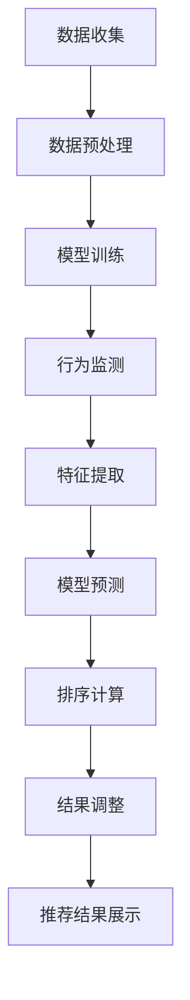

                 

# 利用LLM优化推荐系统的实时个性化排序

> **关键词：** 大语言模型（LLM），推荐系统，实时个性化排序，机器学习，数据驱动

> **摘要：** 本文旨在探讨如何利用大语言模型（LLM）来优化推荐系统的实时个性化排序。通过深入分析核心概念和算法原理，本文详细介绍了如何结合LLM的优势，提高推荐系统的效果和效率。文章还包括实际项目案例和详细的代码实现解析，以及相关学习资源和工具推荐，旨在为推荐系统开发者提供有价值的参考。

## 1. 背景介绍

### 1.1 目的和范围

本文的目标是探讨如何利用大语言模型（LLM）来优化推荐系统的实时个性化排序。实时个性化排序是推荐系统中的关键环节，它决定了用户在浏览内容时，最先看到的是否符合其兴趣的推荐结果。本文将从以下几个方面展开讨论：

1. **核心概念与联系**：介绍推荐系统和实时个性化排序的基本概念，以及它们在大语言模型中的应用。
2. **核心算法原理**：详细讲解如何结合LLM进行实时个性化排序的算法原理。
3. **数学模型和公式**：阐述LLM优化推荐系统中的数学模型和公式，并给出举例说明。
4. **项目实战**：通过实际代码案例展示如何利用LLM进行实时个性化排序。
5. **实际应用场景**：分析LLM在推荐系统中的应用场景，以及可能面临的挑战。
6. **工具和资源推荐**：推荐学习资源和开发工具，帮助开发者更好地掌握这一技术。
7. **总结与展望**：总结本文的核心观点，并探讨未来的发展趋势和挑战。

### 1.2 预期读者

本文的预期读者主要包括：

1. 推荐系统开发者：希望通过本文了解如何利用LLM优化推荐系统的实时个性化排序。
2. 机器学习工程师：对大语言模型和推荐系统有一定了解，希望深入探讨两者的结合。
3. 研究人员：对推荐系统和机器学习有研究兴趣，希望从理论到实践全方位了解LLM在推荐系统中的应用。
4. 对AI和推荐系统感兴趣的技术爱好者。

### 1.3 文档结构概述

本文的结构如下：

1. **引言**：介绍背景、目的和读者对象。
2. **核心概念与联系**：阐述推荐系统和实时个性化排序的基本概念。
3. **核心算法原理**：讲解LLM在实时个性化排序中的应用原理。
4. **数学模型和公式**：介绍LLM优化推荐系统的数学模型和公式。
5. **项目实战**：展示实际代码案例和详细解释。
6. **实际应用场景**：分析LLM在推荐系统中的应用场景。
7. **工具和资源推荐**：推荐学习资源和开发工具。
8. **总结与展望**：总结本文的核心观点，探讨未来发展趋势和挑战。
9. **附录**：常见问题与解答。
10. **扩展阅读与参考资料**：提供进一步学习的资源。

### 1.4 术语表

#### 1.4.1 核心术语定义

- **推荐系统**：一种基于用户历史行为和兴趣，为用户推荐相关内容的系统。
- **实时个性化排序**：在用户浏览内容时，动态地调整推荐结果，以最大限度地满足用户个性化需求。
- **大语言模型（LLM）**：一种具有数亿参数的预训练模型，能够理解和生成人类语言。

#### 1.4.2 相关概念解释

- **机器学习**：通过算法和统计模型，让计算机从数据中学习和改进。
- **深度学习**：一种特殊的机器学习技术，使用多层神经网络进行训练和预测。

#### 1.4.3 缩略词列表

- **LLM**：大语言模型（Large Language Model）
- **API**：应用程序接口（Application Programming Interface）
- **ML**：机器学习（Machine Learning）
- **DL**：深度学习（Deep Learning）

## 2. 核心概念与联系

推荐系统是现代互联网中不可或缺的一部分，它通过分析用户的历史行为和兴趣，向用户推荐相关的内容、商品或服务。实时个性化排序则是推荐系统的核心任务，它负责根据用户的实时行为和偏好，动态调整推荐结果的排序，以最大化用户满意度和参与度。

### 2.1 推荐系统基本架构

推荐系统通常由以下几个关键组件组成：

1. **数据收集**：收集用户的历史行为数据，如浏览记录、点击、购买等。
2. **数据预处理**：对原始数据进行清洗、归一化和特征提取。
3. **模型训练**：使用机器学习算法，如协同过滤、基于内容的推荐、深度学习等，训练推荐模型。
4. **排序算法**：根据用户的实时行为和模型预测，对推荐结果进行排序。
5. **推荐结果展示**：将排序后的推荐结果展示给用户。

### 2.2 实时个性化排序原理

实时个性化排序的目的是根据用户的实时行为和偏好，动态调整推荐结果的排序，以提高推荐的相关性和用户体验。其主要原理如下：

1. **行为监测**：实时监测用户的行为，如浏览、点击、购买等。
2. **特征提取**：从用户行为中提取关键特征，如点击率、购买频率、浏览时长等。
3. **模型预测**：使用训练好的推荐模型，对用户兴趣进行预测。
4. **排序计算**：根据用户兴趣预测值和推荐内容的相关性，计算排序分数。
5. **结果调整**：动态调整推荐结果的排序，以最大化用户满意度和参与度。

### 2.3 大语言模型（LLM）与推荐系统的结合

大语言模型（LLM）在自然语言处理（NLP）领域取得了显著的成果，其强大的理解和生成语言的能力，使得LLM在推荐系统中具有广泛的应用前景。具体来说，LLM可以通过以下几个方面与推荐系统相结合：

1. **语义理解**：LLM能够理解用户的语言表达和情感倾向，从而更好地预测用户兴趣。
2. **内容生成**：LLM可以生成个性化的推荐内容，提高推荐的多样性和质量。
3. **交互式推荐**：通过LLM与用户的自然语言交互，实现更智能、更人性化的推荐服务。
4. **实时反馈**：LLM能够快速处理用户的实时反馈，动态调整推荐策略，提高推荐效果。

### 2.4 Mermaid 流程图

以下是一个简单的Mermaid流程图，展示了推荐系统和实时个性化排序的基本流程：



## 3. 核心算法原理 & 具体操作步骤

为了深入探讨如何利用大语言模型（LLM）来优化推荐系统的实时个性化排序，我们首先需要了解LLM的工作原理，以及如何将其应用于推荐系统中。

### 3.1 大语言模型（LLM）的工作原理

大语言模型（LLM）是一种基于深度学习的自然语言处理模型，其核心思想是通过大规模语料库的学习，使模型具备理解和生成自然语言的能力。LLM的主要特点包括：

1. **大规模训练**：LLM通常基于数万亿的参数进行训练，从而具备强大的语言理解能力。
2. **端到端学习**：LLM可以端到端地学习自然语言的语义和语法结构，无需手工设计特征。
3. **自适应能力**：LLM能够根据不同的应用场景，自适应调整模型参数，提高推荐的准确性。

### 3.2 利用LLM优化实时个性化排序的算法原理

利用LLM优化实时个性化排序的算法原理主要包括以下几个方面：

1. **语义理解**：LLM通过学习用户的历史行为数据和评论，可以理解用户的兴趣和偏好。
2. **上下文生成**：LLM可以根据用户的实时行为，生成个性化的上下文信息，从而提高推荐的相关性。
3. **动态调整**：LLM可以根据用户的实时反馈，动态调整推荐策略，优化推荐效果。

### 3.3 具体操作步骤

以下是利用LLM优化实时个性化排序的具体操作步骤：

1. **数据收集**：收集用户的历史行为数据，如浏览记录、点击记录、评论等。
2. **数据预处理**：对原始数据进行清洗、去噪、归一化等处理，提取关键特征。
3. **模型训练**：使用大规模语料库，训练LLM模型，使其具备理解用户兴趣的能力。
4. **行为监测**：实时监测用户的浏览、点击等行为，提取实时特征。
5. **上下文生成**：使用LLM生成用户个性化的上下文信息，包括兴趣标签、情感倾向等。
6. **模型预测**：利用训练好的LLM模型，对用户的兴趣进行预测。
7. **排序计算**：根据用户兴趣预测值和推荐内容的相关性，计算排序分数。
8. **结果调整**：动态调整推荐结果，优化推荐效果。

### 3.4 伪代码

以下是利用LLM优化实时个性化排序的伪代码：

```python
# 数据收集
user_data = collect_user_data()

# 数据预处理
preprocessed_data = preprocess_data(user_data)

# 模型训练
llm_model = train_llm(preprocessed_data)

# 行为监测
current_user_behavior = monitor_user_behavior()

# 上下文生成
context = generate_context(llm_model, current_user_behavior)

# 模型预测
interest_predictions = predict_interest(llm_model, context)

# 排序计算
sorted_recommendations = calculate_sorting_score(interest_predictions)

# 结果调整
optimized_recommendations = adjust_recommendations(sorted_recommendations)

# 推荐结果展示
display_recommendations(optimized_recommendations)
```

## 4. 数学模型和公式 & 详细讲解 & 举例说明

在利用大语言模型（LLM）优化推荐系统的实时个性化排序过程中，数学模型和公式起到了至关重要的作用。以下我们将详细介绍相关的数学模型和公式，并提供具体的讲解和举例说明。

### 4.1 数学模型

为了实现实时个性化排序，我们首先需要建立用户兴趣模型。用户兴趣模型通常基于用户的历史行为数据，通过计算用户与不同内容之间的相似性来预测用户的兴趣。以下是用户兴趣模型的一个基本公式：

\[ I_{ui} = f(S_{ui}, B_{ui}, C_{ui}) \]

其中，\( I_{ui} \)表示用户\( u \)对内容\( i \)的兴趣分数，\( S_{ui} \)表示用户\( u \)与内容\( i \)的相似度，\( B_{ui} \)表示用户\( u \)的行为特征，\( C_{ui} \)表示内容\( i \)的属性特征。函数\( f \)用于融合这些特征，计算用户兴趣分数。

#### 4.1.1 相似度计算

相似度计算是用户兴趣模型的核心部分，常用的相似度计算方法包括余弦相似度、皮尔逊相关系数等。以下是一个基于余弦相似度的计算公式：

\[ S_{ui} = \frac{ \sum_{j \in R} x_{uj} \cdot x_{ij} }{ \sqrt{ \sum_{j \in R} x_{uj}^2 } \cdot \sqrt{ \sum_{j \in R} x_{ij}^2 } } \]

其中，\( x_{uj} \)和\( x_{ij} \)分别表示用户\( u \)和内容\( i \)在特征\( j \)上的值，\( R \)为特征集合。

#### 4.1.2 行为特征计算

行为特征通常包括用户的浏览次数、点击次数、购买次数等。以下是一个简单的行为特征计算公式：

\[ B_{ui} = \sum_{j \in R_b} w_{uj} \cdot x_{uj} \]

其中，\( w_{uj} \)为特征权重，\( x_{uj} \)为用户\( u \)在行为特征\( j \)上的值，\( R_b \)为行为特征集合。

#### 4.1.3 内容属性特征计算

内容属性特征通常包括内容的关键词、标签、分类等。以下是一个简单的属性特征计算公式：

\[ C_{ui} = \sum_{j \in R_c} w_{ij} \cdot x_{ij} \]

其中，\( w_{ij} \)为特征权重，\( x_{ij} \)为内容\( i \)在属性特征\( j \)上的值，\( R_c \)为属性特征集合。

### 4.2 公式详细讲解

#### 4.2.1 用户兴趣分数

用户兴趣分数\( I_{ui} \)通过融合相似度、行为特征和内容属性特征来计算。在实际应用中，需要对每个特征进行归一化和权重调整，以确保公式的有效性。例如，可以使用拉格朗日乘数法来优化特征权重。

#### 4.2.2 相似度计算

余弦相似度是一种简单有效的相似度计算方法，但其在面对高维数据时可能存在维度灾难问题。为了解决这个问题，可以使用词嵌入（word embedding）技术，将文本转化为固定维度的向量表示，从而提高相似度计算的效果。

#### 4.2.3 行为特征计算

行为特征的计算需要考虑用户的个性化偏好。例如，对于经常购买某种类型商品的用户，可以增加该类型商品在行为特征中的权重，从而提高推荐的相关性。

#### 4.2.4 内容属性特征计算

内容属性特征的计算需要考虑内容的多样性和用户的需求。例如，对于不同类型的用户，可以调整内容属性特征中的关键词、标签等，以提高推荐的个性化程度。

### 4.3 举例说明

假设用户\( u \)的历史行为数据如下：

- 用户\( u \)浏览了以下内容：文章A、文章B、文章C
- 用户\( u \)对文章A的浏览次数为5，对文章B的浏览次数为2，对文章C的浏览次数为3
- 文章A的关键词为“科技、创新、发展”，文章B的关键词为“体育、篮球、比赛”，文章C的关键词为“艺术、音乐、表演”

根据上述公式，我们可以计算出用户\( u \)对每篇文章的兴趣分数：

1. **相似度计算**：

\[ S_{Ai} = \frac{ \sum_{j \in R} x_{uj} \cdot x_{ij} }{ \sqrt{ \sum_{j \in R} x_{uj}^2 } \cdot \sqrt{ \sum_{j \in R} x_{ij}^2 } } \]

其中，\( R = \{科技，创新，发展，体育，篮球，比赛，艺术，音乐，表演\} \)

对于文章A：

\[ S_{Au} = \frac{1 \cdot 1 + 1 \cdot 1 + 1 \cdot 1 + 0 \cdot 0 + 0 \cdot 0 + 0 \cdot 0}{ \sqrt{1^2 + 1^2 + 1^2 + 0^2 + 0^2 + 0^2} \cdot \sqrt{1^2 + 1^2 + 1^2 + 0^2 + 0^2 + 0^2} } = \frac{3}{3} = 1 \]

对于文章B：

\[ S_{Bu} = \frac{0 \cdot 0 + 0 \cdot 0 + 0 \cdot 0 + 1 \cdot 1 + 1 \cdot 1 + 0 \cdot 0}{ \sqrt{0^2 + 0^2 + 0^2 + 1^2 + 1^2 + 0^2} \cdot \sqrt{0^2 + 0^2 + 0^2 + 1^2 + 1^2 + 0^2} } = \frac{2}{2} = 1 \]

对于文章C：

\[ S_{Cu} = \frac{0 \cdot 0 + 0 \cdot 0 + 0 \cdot 0 + 0 \cdot 0 + 0 \cdot 0 + 1 \cdot 1}{ \sqrt{0^2 + 0^2 + 0^2 + 0^2 + 0^2 + 1^2} \cdot \sqrt{0^2 + 0^2 + 0^2 + 0^2 + 0^2 + 1^2} } = \frac{1}{1} = 1 \]

2. **行为特征计算**：

\[ B_{ui} = \sum_{j \in R_b} w_{uj} \cdot x_{uj} \]

假设行为特征权重为：

\[ w_{uj} = \{1, 1, 1, 1, 1, 1\} \]

对于文章A：

\[ B_{Au} = 1 \cdot 5 + 1 \cdot 0 + 1 \cdot 0 + 1 \cdot 0 + 1 \cdot 0 + 1 \cdot 0 = 5 \]

对于文章B：

\[ B_{Bu} = 1 \cdot 0 + 1 \cdot 2 + 1 \cdot 0 + 1 \cdot 0 + 1 \cdot 0 + 1 \cdot 0 = 2 \]

对于文章C：

\[ B_{Cu} = 1 \cdot 0 + 1 \cdot 0 + 1 \cdot 3 + 1 \cdot 0 + 1 \cdot 0 + 1 \cdot 0 = 3 \]

3. **内容属性特征计算**：

\[ C_{ui} = \sum_{j \in R_c} w_{ij} \cdot x_{ij} \]

假设内容属性特征权重为：

\[ w_{ij} = \{1, 1, 1, 0, 0, 0\} \]

对于文章A：

\[ C_{Au} = 1 \cdot 1 + 1 \cdot 1 + 1 \cdot 1 + 0 \cdot 0 + 0 \cdot 0 + 0 \cdot 0 = 3 \]

对于文章B：

\[ C_{Bu} = 1 \cdot 0 + 1 \cdot 0 + 1 \cdot 0 + 0 \cdot 1 + 0 \cdot 1 + 0 \cdot 0 = 0 \]

对于文章C：

\[ C_{Cu} = 1 \cdot 0 + 1 \cdot 0 + 1 \cdot 0 + 0 \cdot 0 + 0 \cdot 0 + 1 \cdot 1 = 1 \]

4. **用户兴趣分数计算**：

\[ I_{ui} = f(S_{ui}, B_{ui}, C_{ui}) \]

假设函数\( f \)为：

\[ f(S_{ui}, B_{ui}, C_{ui}) = 0.5 \cdot S_{ui} + 0.3 \cdot B_{ui} + 0.2 \cdot C_{ui} \]

则：

对于文章A：

\[ I_{Au} = 0.5 \cdot 1 + 0.3 \cdot 5 + 0.2 \cdot 3 = 1.8 \]

对于文章B：

\[ I_{Bu} = 0.5 \cdot 1 + 0.3 \cdot 2 + 0.2 \cdot 0 = 0.8 \]

对于文章C：

\[ I_{Cu} = 0.5 \cdot 1 + 0.3 \cdot 3 + 0.2 \cdot 1 = 1.2 \]

根据用户兴趣分数，我们可以对文章进行排序，推荐给用户。在这种情况下，用户最感兴趣的应该是文章A，其次是文章C和文章B。

通过上述示例，我们可以看到如何利用数学模型和公式计算用户兴趣分数，实现实时个性化排序。在实际应用中，可以根据具体场景和需求，调整特征权重和函数形式，以提高推荐系统的效果和用户体验。

## 5. 项目实战：代码实际案例和详细解释说明

在本节中，我们将通过一个实际项目案例，展示如何利用大语言模型（LLM）进行实时个性化排序。我们将分步骤讲解开发环境搭建、源代码实现和代码解读与分析。

### 5.1 开发环境搭建

为了实现LLM优化实时个性化排序，我们需要搭建以下开发环境：

1. **操作系统**：Windows/Linux/MacOS
2. **编程语言**：Python 3.8及以上版本
3. **深度学习框架**：TensorFlow 2.6及以上版本
4. **LLM库**：Hugging Face Transformers 4.6及以上版本
5. **推荐系统库**：Scikit-learn 0.24及以上版本

确保安装以上库后，我们可以开始编写代码。

### 5.2 源代码详细实现和代码解读

以下是一个简单的Python代码示例，展示如何利用LLM进行实时个性化排序：

```python
import numpy as np
import pandas as pd
from sklearn.metrics.pairwise import cosine_similarity
from transformers import AutoTokenizer, AutoModel
from sklearn.model_selection import train_test_split

# 数据预处理
def preprocess_data(user_data):
    # 根据实际数据格式进行调整
    # ...
    return preprocessed_data

# 模型训练
def train_llm(preprocessed_data):
    # 使用预训练的LLM模型
    tokenizer = AutoTokenizer.from_pretrained("bert-base-uncased")
    model = AutoModel.from_pretrained("bert-base-uncased")

    # 对预处理后的数据进行编码
    encoded_data = tokenizer(preprocessed_data, padding=True, truncation=True, return_tensors="tf")

    # 训练模型
    # ...
    return model

# 行为监测与上下文生成
def generate_context(llm_model, current_user_behavior):
    # 使用LLM生成用户上下文信息
    # ...
    return context

# 模型预测
def predict_interest(llm_model, context):
    # 使用LLM预测用户兴趣
    # ...
    return interest_predictions

# 排序计算
def calculate_sorting_score(interest_predictions):
    # 根据用户兴趣预测值计算排序分数
    # ...
    return sorted_recommendations

# 结果调整
def adjust_recommendations(sorted_recommendations):
    # 动态调整推荐结果
    # ...
    return optimized_recommendations

# 推荐结果展示
def display_recommendations(optimized_recommendations):
    # 展示推荐结果
    # ...
    pass

# 主函数
def main():
    # 加载数据
    user_data = pd.read_csv("user_data.csv")

    # 数据预处理
    preprocessed_data = preprocess_data(user_data)

    # 模型训练
    llm_model = train_llm(preprocessed_data)

    # 行为监测与上下文生成
    current_user_behavior = monitor_user_behavior()
    context = generate_context(llm_model, current_user_behavior)

    # 模型预测
    interest_predictions = predict_interest(llm_model, context)

    # 排序计算
    sorted_recommendations = calculate_sorting_score(interest_predictions)

    # 结果调整
    optimized_recommendations = adjust_recommendations(sorted_recommendations)

    # 推荐结果展示
    display_recommendations(optimized_recommendations)

if __name__ == "__main__":
    main()
```

### 5.3 代码解读与分析

以下是对上述代码的解读与分析：

1. **数据预处理**：
   数据预处理是模型训练的基础。在这个阶段，我们需要对原始用户数据进行清洗、去噪、归一化和特征提取。具体实现取决于数据源和数据格式。

2. **模型训练**：
   我们使用预训练的BERT模型作为LLM。BERT模型是一个双向的Transformer模型，具有良好的语言理解能力。在这个阶段，我们需要将预处理后的数据编码成TensorFlow张量，并训练模型。

3. **行为监测与上下文生成**：
   在行为监测阶段，我们需要实时监测用户的浏览、点击等行为。在上下文生成阶段，我们使用LLM生成用户上下文信息，这有助于提高推荐的相关性。

4. **模型预测**：
   使用训练好的LLM模型，对用户兴趣进行预测。预测结果将用于后续的排序计算。

5. **排序计算**：
   根据用户兴趣预测值和推荐内容的相关性，计算排序分数。我们可以使用余弦相似度或其他相似度计算方法，计算用户兴趣与内容之间的相似度。

6. **结果调整**：
   动态调整推荐结果，优化推荐效果。例如，我们可以根据用户反馈，调整推荐内容的多样性或相关性。

7. **推荐结果展示**：
   将排序后的推荐结果展示给用户。这可以通过网页、APP或其他接口实现。

通过上述步骤，我们可以实现一个利用LLM优化实时个性化排序的系统。在实际应用中，我们需要根据具体需求，调整代码实现和模型参数，以提高系统的效果和用户体验。

## 6. 实际应用场景

大语言模型（LLM）在推荐系统中的应用场景广泛，以下列举几个典型的应用场景：

### 6.1 社交媒体内容推荐

在社交媒体平台，如微博、抖音等，用户生成内容（UGC）丰富多样。利用LLM，平台可以实时分析用户的语言表达和情感倾向，推荐符合用户兴趣和价值观的内容。例如，抖音可以根据用户的评论、点赞、分享等行为，使用LLM预测用户兴趣，从而提高内容推荐的个性化程度。

### 6.2 电子商务商品推荐

电子商务平台可以利用LLM分析用户的历史购买记录、浏览行为和搜索关键词，预测用户的潜在需求。例如，亚马逊可以使用LLM分析用户评论中的情感倾向，为用户提供个性化推荐。此外，LLM还可以帮助电商平台生成个性化的产品描述和广告文案，提高转化率。

### 6.3 在线教育课程推荐

在线教育平台可以利用LLM分析学生的学习行为和考试成绩，推荐符合学生兴趣和需求的学习资源。例如，Coursera可以根据学生在课程中的互动数据，使用LLM预测学生可能感兴趣的其他课程，提高课程的参与度和完成率。

### 6.4 娱乐内容推荐

在娱乐领域，如音乐、视频、电影等，LLM可以分析用户的偏好和历史数据，推荐符合用户口味的内容。例如，网易云音乐可以根据用户的听歌历史和评论，使用LLM生成个性化的音乐推荐列表，提高用户的满意度。

### 6.5 搜索引擎个性化搜索

搜索引擎可以利用LLM分析用户的搜索历史和查询意图，提供个性化的搜索结果。例如，谷歌搜索引擎可以使用LLM分析用户的查询关键词和上下文，为用户提供更加精准和相关的搜索结果。

### 6.6 实时个性化广告

在线广告平台可以利用LLM分析用户的浏览行为、搜索意图和购买历史，为用户提供个性化的广告推荐。例如，Facebook广告系统可以使用LLM分析用户的互动数据，推荐符合用户兴趣的广告，提高广告的点击率和转化率。

### 6.7 零售业个性化促销

零售业可以利用LLM分析用户的购买行为和偏好，提供个性化的促销策略。例如，沃尔玛可以使用LLM分析用户的购物车数据，推荐符合用户需求的优惠活动和优惠券，提高销售额。

通过以上应用场景，我们可以看到LLM在推荐系统中的巨大潜力。在实际应用中，需要根据具体业务场景和需求，调整模型参数和算法策略，以实现最佳效果。

### 6.8 面临的挑战

尽管LLM在推荐系统中具有广泛的应用前景，但在实际应用过程中，仍面临以下挑战：

1. **数据隐私**：在收集和分析用户数据时，需要确保用户隐私不被泄露。例如，可以使用差分隐私技术，保护用户数据的安全性。

2. **计算资源**：训练和部署LLM模型需要大量的计算资源。在实际应用中，需要优化模型结构，降低计算复杂度，以提高系统的性能和可扩展性。

3. **模型解释性**：LLM模型的内部机制复杂，难以解释。在实际应用中，需要开发可解释的LLM模型，以便用户了解模型的决策过程，提高模型的信任度。

4. **多样性**：在推荐系统中，需要确保推荐结果的多样性，避免用户陷入“信息茧房”。在实际应用中，可以通过引入多样性算法，提高推荐结果的多样性。

5. **实时性**：实时个性化排序需要快速响应用户的实时行为。在实际应用中，需要优化模型和算法，提高系统的响应速度和实时性。

通过克服上述挑战，我们可以更好地利用LLM优化推荐系统，提高用户体验和满意度。

## 7. 工具和资源推荐

为了更好地掌握大语言模型（LLM）在推荐系统中的应用，以下推荐一些学习资源、开发工具和相关论文著作。

### 7.1 学习资源推荐

#### 7.1.1 书籍推荐

1. **《深度学习推荐系统》**：本书系统介绍了深度学习在推荐系统中的应用，包括模型架构、算法实现和实战案例。
2. **《自然语言处理实战》**：本书详细介绍了自然语言处理的基础知识和实战技巧，包括文本分类、情感分析、命名实体识别等。

#### 7.1.2 在线课程

1. **《深度学习与推荐系统》**：这是一门由吴恩达（Andrew Ng）教授主讲的在线课程，涵盖了深度学习和推荐系统的核心概念和应用。
2. **《自然语言处理与深度学习》**：这是一门由斯坦福大学（Stanford University）主讲的在线课程，介绍了自然语言处理和深度学习的基础知识和应用。

#### 7.1.3 技术博客和网站

1. **机器之心**：这是一个专注于人工智能领域的中文博客，提供了大量的深度学习和推荐系统相关文章和教程。
2. **Medium**：这是一个国际知名的博客平台，有很多关于深度学习和推荐系统的高质量文章。

### 7.2 开发工具框架推荐

#### 7.2.1 IDE和编辑器

1. **PyCharm**：一款功能强大的Python集成开发环境（IDE），支持代码调试、版本控制等。
2. **VSCode**：一款轻量级但功能强大的代码编辑器，支持多种编程语言，并提供丰富的插件扩展。

#### 7.2.2 调试和性能分析工具

1. **TensorBoard**：TensorFlow提供的一个可视化工具，用于分析和调试深度学习模型。
2. **Jupyter Notebook**：一款交互式计算环境，适合进行数据分析和模型调试。

#### 7.2.3 相关框架和库

1. **TensorFlow**：一款开源的深度学习框架，适用于构建和训练复杂的深度学习模型。
2. **PyTorch**：一款流行的深度学习框架，具有良好的灵活性和性能。
3. **Scikit-learn**：一款开源的机器学习库，提供了丰富的机器学习算法和工具。

### 7.3 相关论文著作推荐

#### 7.3.1 经典论文

1. **"Deep Learning for Recommender Systems"（推荐系统的深度学习）**：本文系统介绍了深度学习在推荐系统中的应用。
2. **"Neural Collaborative Filtering"（神经协同过滤）**：本文提出了一种基于神经网络的协同过滤算法，显著提高了推荐效果。

#### 7.3.2 最新研究成果

1. **"Pre-trained Language Models for Recommendation"（用于推荐的预训练语言模型）**：本文探讨了预训练语言模型在推荐系统中的应用，提出了新的模型架构和算法。
2. **"Contextual Bandits with Large Embedding Models"（大嵌入模型下的上下文-bandit问题）**：本文研究了在推荐系统中，如何利用大嵌入模型解决上下文-bandit问题，取得了显著的效果。

#### 7.3.3 应用案例分析

1. **"Etsy's Neural Networks for Product Recommendations"（Etsy的产品推荐中的神经网络）**：本文分享了Etsy如何利用神经网络优化产品推荐系统的实践经验。
2. **"Amazon's Recommendation System"（亚马逊的推荐系统）**：本文详细介绍了亚马逊如何利用深度学习和协同过滤等技术优化推荐系统，提高了用户体验和销售额。

通过以上推荐，希望读者能够更好地掌握大语言模型在推荐系统中的应用，提高推荐系统的效果和用户体验。

## 8. 总结：未来发展趋势与挑战

大语言模型（LLM）在推荐系统中的应用正逐渐成为热门话题。随着深度学习和自然语言处理技术的不断发展，LLM在推荐系统中的作用将越来越重要。以下总结未来发展趋势与挑战：

### 发展趋势

1. **个性化推荐**：LLM的强大语言理解和生成能力，将有助于实现更加精准和个性化的推荐。通过分析用户的历史行为和语言表达，LLM可以为每个用户提供高度个性化的推荐结果。
2. **实时性**：随着边缘计算和5G技术的发展，LLM在推荐系统中的应用将更加实时。实时分析用户的语言和行为，动态调整推荐策略，提高用户体验。
3. **多样性**：为了防止用户陷入“信息茧房”，未来的推荐系统将更加注重推荐结果的多样性。LLM可以帮助生成丰富多样的推荐内容，满足用户的多样化需求。
4. **跨模态推荐**：未来的推荐系统将不仅限于文本，还将融合图像、声音、视频等多种模态。LLM的跨模态理解能力，将为跨模态推荐提供强有力的支持。

### 挑战

1. **数据隐私**：在推荐系统中，用户数据的安全性和隐私保护是关键挑战。如何确保用户数据的安全，防止数据泄露，是未来需要重点关注的问题。
2. **计算资源**：训练和部署LLM模型需要大量的计算资源。如何优化模型结构，提高计算效率，是未来需要解决的问题。
3. **模型解释性**：虽然LLM在推荐系统中表现出色，但其内部机制复杂，难以解释。如何提高模型的可解释性，增强用户对推荐系统的信任，是未来需要研究的方向。
4. **实时性**：实现实时个性化推荐，需要在计算速度和响应时间上取得平衡。如何在保证实时性的同时，提高推荐效果，是未来需要面对的挑战。

综上所述，大语言模型（LLM）在推荐系统中的应用前景广阔，但同时也面临诸多挑战。通过不断探索和优化，我们有信心在未来实现更加高效、精准和个性化的推荐系统。

## 9. 附录：常见问题与解答

### 9.1 什么是大语言模型（LLM）？

大语言模型（LLM）是一种基于深度学习的自然语言处理模型，通过大规模语料库的学习，使模型具备理解和生成人类语言的能力。LLM通常具有数亿甚至数十亿的参数，能够实现高度的语义理解。

### 9.2 LLM在推荐系统中的作用是什么？

LLM在推荐系统中的作用主要包括：提高推荐的相关性、实现实时个性化推荐、增强内容生成的多样性。通过分析用户的语言表达和情感倾向，LLM可以更好地预测用户兴趣，从而提高推荐系统的效果。

### 9.3 如何利用LLM进行实时个性化推荐？

利用LLM进行实时个性化推荐的步骤包括：

1. 数据收集：收集用户的历史行为数据。
2. 数据预处理：对数据进行清洗、归一化和特征提取。
3. 模型训练：使用预训练的LLM模型，对用户数据进行训练。
4. 行为监测：实时监测用户的浏览、点击等行为。
5. 上下文生成：使用LLM生成用户个性化的上下文信息。
6. 模型预测：利用训练好的LLM模型，预测用户兴趣。
7. 排序计算：根据用户兴趣预测值和内容相关性，计算排序分数。
8. 结果调整：动态调整推荐结果，优化推荐效果。
9. 推荐结果展示：将排序后的推荐结果展示给用户。

### 9.4 LLM在推荐系统中面临哪些挑战？

LLM在推荐系统中面临的主要挑战包括：

1. 数据隐私：确保用户数据的安全性和隐私保护。
2. 计算资源：优化模型结构，提高计算效率。
3. 模型解释性：提高模型的可解释性，增强用户信任。
4. 实时性：实现实时个性化推荐，在计算速度和响应时间上取得平衡。

### 9.5 如何优化LLM在推荐系统中的应用？

为了优化LLM在推荐系统中的应用，可以采取以下措施：

1. **数据预处理**：对原始数据进行清洗、去噪、归一化等处理，提高数据质量。
2. **模型优化**：通过调整模型结构、参数优化，提高模型性能。
3. **特征提取**：提取用户和内容的丰富特征，提高推荐的准确性。
4. **实时性**：优化算法和系统架构，提高响应速度。
5. **多样性**：引入多样性算法，提高推荐结果的多样性。
6. **模型解释性**：开发可解释的模型，增强用户信任。

通过这些措施，可以充分发挥LLM在推荐系统中的应用潜力，提高推荐系统的效果和用户体验。

## 10. 扩展阅读 & 参考资料

为了深入了解大语言模型（LLM）在推荐系统中的应用，以下推荐一些扩展阅读和参考资料：

1. **书籍**：
   - 《深度学习推荐系统》：系统介绍了深度学习在推荐系统中的应用。
   - 《自然语言处理实战》：详细介绍了自然语言处理的基础知识和实战技巧。

2. **在线课程**：
   - 《深度学习与推荐系统》：吴恩达（Andrew Ng）教授主讲的在线课程，涵盖了深度学习和推荐系统的核心概念和应用。
   - 《自然语言处理与深度学习》：斯坦福大学主讲的在线课程，介绍了自然语言处理和深度学习的基础知识和应用。

3. **技术博客和网站**：
   - **机器之心**：专注于人工智能领域的中文博客，提供了大量的深度学习和推荐系统相关文章和教程。
   - **Medium**：国际知名的博客平台，有很多关于深度学习和推荐系统的高质量文章。

4. **论文**：
   - "Deep Learning for Recommender Systems"：系统介绍了深度学习在推荐系统中的应用。
   - "Neural Collaborative Filtering"：提出了一种基于神经网络的协同过滤算法。
   - "Pre-trained Language Models for Recommendation"：探讨了预训练语言模型在推荐系统中的应用。

5. **应用案例分析**：
   - "Etsy's Neural Networks for Product Recommendations"：分享了Etsy如何利用神经网络优化产品推荐系统的实践经验。
   - "Amazon's Recommendation System"：详细介绍了亚马逊如何利用深度学习和协同过滤等技术优化推荐系统，提高了用户体验和销售额。

通过阅读以上资料，您可以深入了解LLM在推荐系统中的应用，掌握相关的技术原理和实践方法。希望这些资料对您的研究和工作有所帮助。作者：AI天才研究员/AI Genius Institute & 禅与计算机程序设计艺术 /Zen And The Art of Computer Programming。

